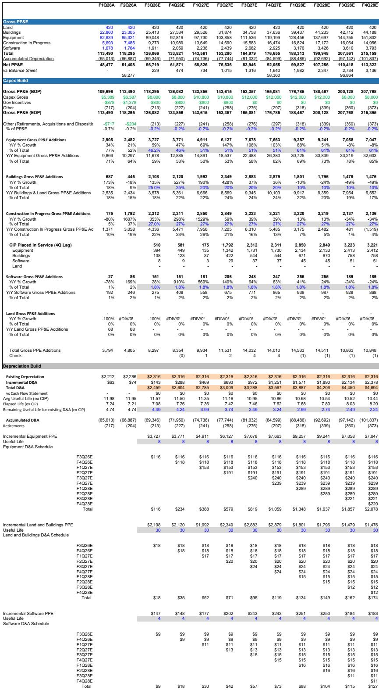
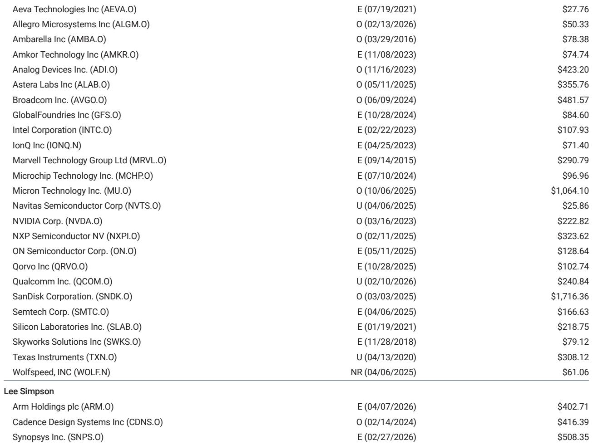
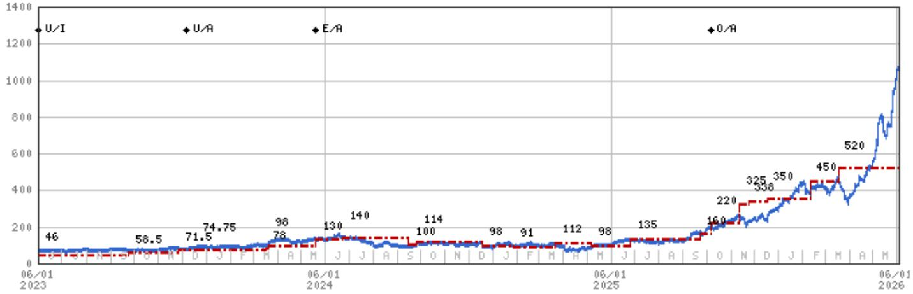

# 市场真正低估的不是AI需求，而是存储器供给侧的再定价

过去两年，市场对AI基础设施的投资热情从未冷却，但一个关键问题始终悬而未决：当GPU供给逐步跟上，算力瓶颈是否会从“芯片”转移到“存储”？某外资投行在最新发布的研报中给出了一个清晰的判断——DRAM已经成为AI建设中的首要瓶颈，而这一结构性短缺在2028年前看不到快速解决方案。这意味着，存储器股票当前不到10倍的远期市盈率，不是估值泡沫，而是市场对盈利持续性的定价仍不够充分。

这份报告上调了美光科技的目标价至1050美元，SanDisk至1750美元，并大幅调高了2027年的盈利预测。上调幅度之大——美光2027年EPS预测上调48%，SanDisk上调24%——本身就是一个信号：分析师认为市场对存储器公司未来两年盈利能力的理解存在系统性偏差。

本文将从五个维度拆解这份报告的核心逻辑，并指出报告尚未完全回答的关键问题。

## 1. 这轮存储器短缺不是周期性的，而是由AI建筑的结构性需求驱动

传统上，存储器行业遵循“繁荣-萧条”周期：供不应求时价格上涨，厂商扩产，随后供过于求，价格暴跌。但这一次，驱动因素发生了根本性变化。

报告明确指出，DRAM短缺的核心原因不是消费电子需求回暖，而是AI基础设施建设的持续扩张。超大规模云服务商对HBM（高带宽存储器）的需求几乎无止境，而DRAM的供给增长却受到两个硬约束：一是洁净室建设周期，二是EUV光刻设备的可用性。这两个因素都不是短期能解决的。

报告引用了在台湾的调研反馈：供应链预期DRAM价格在5月季度上涨40%，8月季度再涨15%，甚至高于分析师的模型假设。这意味着，即便分析师已经上调了价格预期，真实市场可能比模型更紧。

这里的关键洞察是：存储器短缺已经从“周期性事件”转变为“结构性特征”。对于投资者而言，这意味着不能再用过去10年的估值框架来定价这些公司。过去，存储器公司的高盈利往往被视为不可持续，市场给予极低的远期市盈率。但如果短缺持续2-3年甚至更久，这些盈利的“持续性”就需要被重新评估。

## 2. 盈利持续性的重新定价，才是估值扩张的真正动力

美光的市盈率从3月底的4倍扩张到目前的11倍，但报告认为这远未结束。核心逻辑是：市场正在逐步接受“高盈利将持续更长时间”这一叙事，但定价尚未完全反映。

报告将美光的目标价上调至1050美元，估值基础是基于周期平均EPS的29.5倍。这个倍数本身并不激进——与半导体板块整体估值相当。但关键在于，分析师将周期平均EPS从21美元大幅上调至35美元。这意味着，即便采用与之前相同的估值倍数，目标价也几乎翻倍。

更值得关注的是，报告提到美光预计将在2027财年启动大规模股票回购，模型假设2027-2028年回购规模达500亿美元。这一信息有两个含义：第一，公司自身对现金流前景有足够信心；第二，回购将进一步提高每股收益，形成正反馈。

但这里有一个尚未被充分讨论的问题：回购启动的前提是美光不再受芯片法案相关条款的限制。如果政策环境发生变化，这一催化剂可能推迟。报告没有对此展开，但这是一个需要持续跟踪的政策变量。

## 3. 供给侧的物理约束比需求侧更值得关注

许多投资者习惯将目光集中在AI需求的增长曲线，但报告提醒我们：供给侧的约束可能才是决定价格走势的更关键变量。

美光的资本支出计划非常激进。报告模型显示，2027财年资本支出将达440亿美元，2028财年400亿美元，远超市场预期的376亿和369亿美元。如此大规模的投资，是否意味着供给即将过剩？

报告的回答是：不会。原因在于，这些资本支出中有相当大一部分被HBM的“产率折损”所消耗。所谓的“产率折损”，是指生产HBM所需的DRAM晶圆数量远高于传统DRAM——因为HBM需要将多个DRAM die堆叠在一起，每一层都需要额外的测试和封装步骤。这意味着，即便资本支出大幅增加，实际可用的位元供给增长仍然有限。

报告预计，位元供给增长将在2027-2028年加速，但节奏仍然受制于工厂建设和设备安装的进度。这是一个典型的“远水不解近渴”的格局：即便今天开始大规模投资，新增产能也需要18-24个月才能释放。

对于投资者而言，这意味着2027年之前，存储器价格大概率维持高位。而2027年之后，即使供给增加，如果AI需求继续扩张，市场仍可能保持紧张。报告中没有展开的一个问题是：如果全球经济出现衰退，AI资本支出是否会大幅削减？这是目前模型中最不确定的变量。

## 4. 美光与SanDisk的差异化定位：数据中心敞口决定了相对吸引力

报告明确表达了对美光的相对偏好，核心原因在于两家公司的终端市场结构不同。

美光的DRAM业务中，数据中心和AI相关收入占比更高。而SanDisk的NAND业务虽然同样受益于超大规模云服务商的采购，但其需求结构中PC和智能手机的权重更大。报告提到，Kioxia（SanDisk的合资伙伴）在投资者日上仅将长期位元增长预期从20%小幅上调至22%，主要增量来自AI推理，而PC和移动市场增长乏力。

这一差异意味着：如果消费电子需求持续疲软，SanDisk的业绩弹性可能不如美光。但报告同时指出，消费电子疲软并未影响NAND的定价环境——这恰恰说明，超大规模云服务商的需求已经足够强大，足以支撑整个市场。

这里有一个值得深思的观察：报告将长期供应协议（LTA）视为“症状而非原因”。也就是说，超大规模云服务商之所以愿意签署多年供应协议，是因为他们预期供应将持续紧张，而非这些协议本身导致了价格上涨。这一视角的转换很重要：它意味着需求端的承诺是真实且持续的，而非投机性的库存堆积。

## 5. 报告尚未完全回答的关键问题：周期顶峰何时到来，以及市场如何定价“下一个下行”

尽管报告对2027-2028年的盈利充满信心，但一个根本性问题仍然悬而未决：这个周期的顶峰在哪里？当供给最终赶上需求时，价格和利润率会以多快的速度回落？

报告承认，其工作假设仍然是“在2028年之前会出现价格和利润率的某种修正”，但同时强调“这在今天的证据中尚未体现”。这一表述本身就暗示了不确定性。报告通过周期平均EPS的估值方法，试图平滑掉周期性波动，但问题在于：如果下一个下行周期比市场预期的更早或更猛烈，当前基于35美元周期平均EPS的估值是否仍然合理？

另一个未被充分讨论的问题是：EUV光刻设备的供给瓶颈本身是否会成为制约？如果ASML的产能无法满足所有DRAM厂商的需求，那么美光的扩产计划是否会受到影响？报告提到了EUV可用性作为供给约束之一，但没有量化这一风险。

此外，报告对2028年之后的资本支出假设（从440亿降至400亿美元）是基于“新增产能逐步到位”的判断。但如果AI需求持续超预期，这一假设可能需要上调，进而影响自由现金流的计算。

这些未解问题，正是我们在后续深度研究中需要持续跟踪的焦点。完整报告中包含详细的资本支出模型、PPE折旧时间表以及各季度的盈利预测，这些数据对于构建自己的投资框架至关重要。

---

Personal reading notes and learning share only. Not investment advice.

