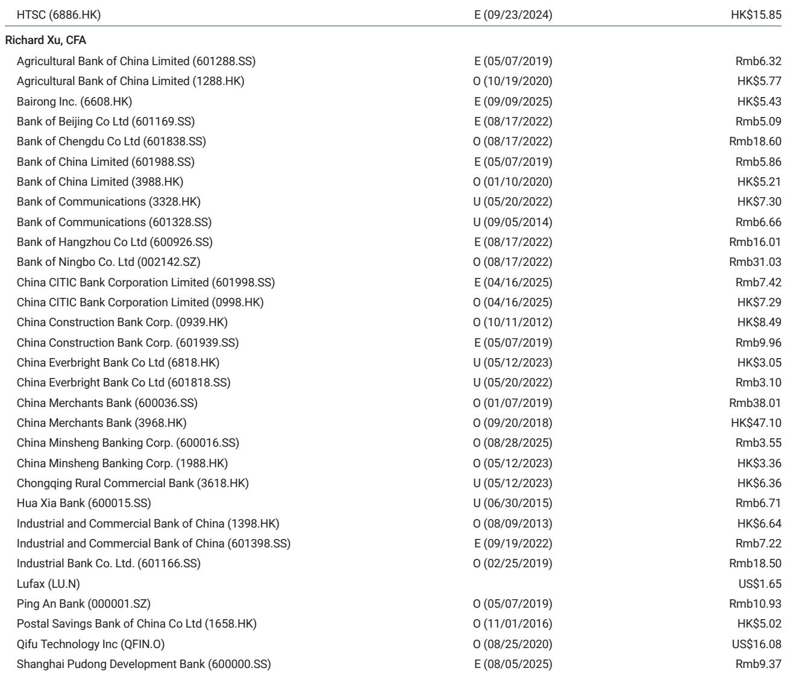
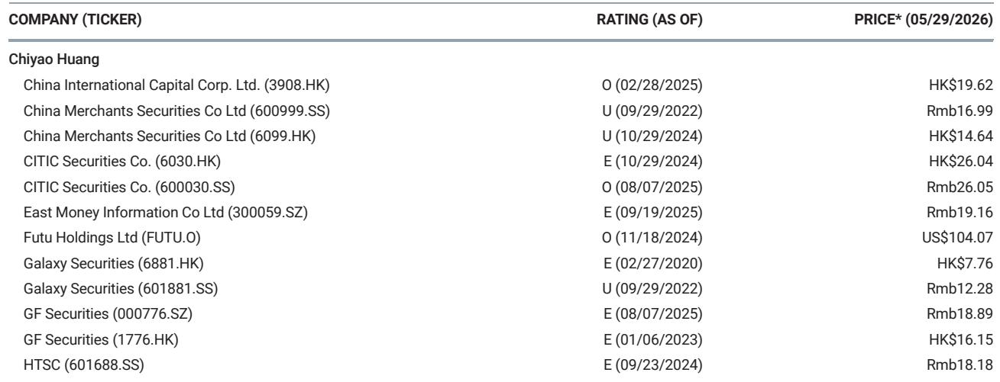
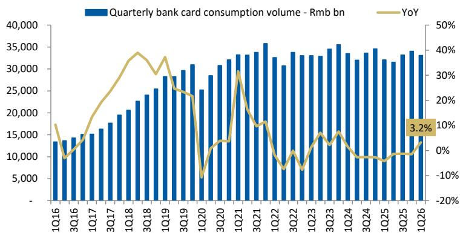

# China’s Payment Data Reveals a Consumption Recovery That Official Statistics Miss

The official narrative on Chinese consumption has been one of steady moderation. Retail sales growth slowed to 2.4% year-on-year in the first quarter of 2026, continuing a trend that has worried investors and policymakers alike. Yet beneath this headline number, a very different story is unfolding in the country’s payment systems. Total system payment volume surged 29% year-on-year in 1Q26, a dramatic acceleration from the 5% growth recorded in 4Q25. Bank card consumption, which had been in decline throughout 2025, turned positive for the first time in over a year, rising 3.2% year-on-year. This is not a statistical anomaly. It is a signal that the nature of Chinese consumption is shifting in ways that official retail sales data are not capturing.

The divergence between payment data and retail sales figures is the most important analytical insight for anyone trying to understand China’s consumer economy today. The gap is not noise. It is information. It tells us that consumers are reallocating spending across channels, that the recovery is real but uneven, and that the financial sector is positioned to benefit in ways that the broader economy may not yet reflect. For investors focused on Chinese financials, this divergence creates both opportunity and a need for careful interpretation.

The first quarter of 2026 marks a potential inflection point. The rebound in payment volumes was broad-based across both major clearing systems. UnionPay, which processes the bulk of offline and bank card transactions, saw payment growth rebound to 11.2% year-on-year. NetsUnion, the primary processor for online and third-party payments, grew 7.2% year-on-year. Both figures comfortably exceeded official retail sales growth. The pattern suggests that consumers are spending more, but they are doing so through channels and instruments that are not fully captured in traditional retail sales surveys.

This is not a story of a consumption boom. It is a story of a consumption recovery that is being misread by conventional metrics. The data demands a strategic reassessment of how we measure and forecast Chinese consumer demand, and it has direct implications for how investors should position in Chinese financial stocks.

## The Gap Between Payment Data and Retail Sales Signals a Structural Shift in How Consumers Spend

The most striking feature of the 1Q26 data is the widening gap between payment system volumes and official retail sales growth. Throughout 2025, retail sales growth moderated steadily while payment growth remained relatively stable. In 1Q26, that gap became a chasm. Payment volumes grew at more than ten times the rate of retail sales.

What explains this divergence? The most plausible interpretation is a shift from online to offline consumption channels. During the pandemic years, Chinese consumers migrated en masse to e-commerce and digital payments. That shift inflated official retail sales data because online transactions are more easily captured in statistical surveys. As consumers return to physical stores, restaurants, and service establishments, a larger share of spending is occurring in offline settings where transaction capture is less complete. Bank card consumption, which is heavily weighted toward offline point-of-sale transactions, turned positive for the first time since 2024, suggesting that this channel shift is accelerating.

The implication is profound. If the gap persists, it means that official retail sales data have become a lagging and potentially misleading indicator of true consumption momentum. Investors who rely solely on retail sales to gauge consumer health may be underestimating the strength of the recovery. The payment data, by contrast, provides a real-time, transaction-level view of spending that is more granular and more current.

## Bank Card Consumption Turning Positive Marks a Reversal of a Multi-Year Downtrend and Has Direct Implications for Bank Fee Income

Bank card consumption growth turned positive at 3.2% year-on-year in 1Q26, after contracting through most of 2025. This is not a trivial data point. Bank card spending is directly linked to bank fee income through merchant discount rates, annual fees, and interchange revenue. For Chinese banks, which have been under pressure from narrowing net interest margins, fee income has become an increasingly important driver of profitability.

The recovery in bank card consumption suggests that consumers are regaining confidence in using credit and debit cards for discretionary spending. This is consistent with the broader improvement in household financial conditions. The report estimates that household financial asset growth reached 10.8% year-on-year in 1Q26, driven largely by equities and mutual funds. Rising household wealth tends to precede increased consumption, particularly for discretionary categories that are more likely to be paid for by card.

However, the recovery is not yet robust. The report notes that banks remain conservative in their credit card loan allocation. This is a rational response to still-elevated consumer leverage and uncertainty about household income trajectories. The question is whether bank card consumption growth can sustain its current pace without a corresponding acceleration in credit card lending. If banks remain cautious, the recovery in card spending may be constrained by credit availability rather than consumer demand.

## UnionPay and NetsUnion Growth Patterns Reveal a Two-Speed Recovery in Offline Versus Online Spending

The divergence between UnionPay and NetsUnion growth rates is itself informative. UnionPay, which processes the majority of offline and in-store transactions, grew at 11.2% year-on-year, significantly outpacing NetsUnion’s 7.2% growth. This is a reversal of the pattern that prevailed during the pandemic, when online payment growth consistently exceeded offline.

The data suggests that the offline recovery is accelerating. Consumers are returning to physical retail, dining, travel, and entertainment. This is consistent with anecdotal evidence of crowded shopping malls and sold-out domestic tourist destinations. For financial institutions, this shift matters because offline transactions tend to generate higher fee income per transaction than online payments, which are often processed at lower merchant discount rates.

But the online channel is not weakening. NetsUnion growth of 7.2% is still healthy and above retail sales growth. The pattern is not one of substitution but of rebalancing. Both channels are growing, but offline is catching up. This creates a favorable mix effect for payment processors and banks, as higher-margin offline transactions increase as a share of total payment volume.

## What the Report Does Not Fully Answer: The Sustainability of Household Wealth-Driven Consumption and the Path of Credit Card Lending

While the 1Q26 data is encouraging, several critical questions remain unanswered. The first concerns the sustainability of household financial asset growth. The 10.8% year-on increase in household financial assets was driven by equities and mutual funds, which are inherently volatile. If equity markets correct or fund flows reverse, the wealth effect that appears to be supporting consumption could dissipate quickly. The payment data does not yet tell us whether the consumption recovery is self-sustaining or dependent on continued asset price appreciation.

The second open question is the trajectory of credit card lending. The report indicates that banks remain conservative in credit card loan allocation, but it does not specify when or under what conditions this conservatism might ease. If banks maintain tight credit standards, the recovery in bank card consumption may plateau. If they begin to loosen, it could accelerate but at the cost of higher credit risk. The optimal path for investors depends on which scenario unfolds.

The third question is whether the divergence between payment data and retail sales will narrow or widen. If it widens further, it would strengthen the case that official consumption data is structurally broken as a leading indicator. If it narrows, it would suggest that the gap was a temporary artifact of channel shifts. The answer has significant implications for how investors should weight payment data versus retail sales in their consumption forecasts.

## A Decision Framework for Investors: How to Use Payment Data as a Leading Indicator for Chinese Financial Stocks

The payment data provides a real-time, high-frequency signal of consumption trends that complements but does not replace traditional economic indicators. For investors in Chinese financials, the data can be used to construct a decision framework with three layers.

First, monitor the trend in total system payment volume growth relative to retail sales growth. A widening gap favors banks and payment processors with exposure to offline and bank card transactions, as it suggests that true consumption is stronger than official data indicates. A narrowing gap would argue for caution, as it would imply that the payment data was a temporary outlier.

Second, track the composition of payment growth between UnionPay and NetsUnion. Faster UnionPay growth relative to NetsUnion is positive for banks with large merchant acquiring businesses and for payment companies focused on offline point-of-sale. Conversely, faster NetsUnion growth would favor online-focused fintech platforms and third-party payment processors.

Third, watch the trajectory of bank card consumption growth in conjunction with credit card loan growth. If card spending accelerates while loan growth remains subdued, it suggests that consumers are using cards for convenience rather than credit, which is a positive sign for fee income but a neutral signal for net interest income. If both accelerate, it would indicate that consumers are becoming more confident in taking on debt, which could boost both fee income and interest income but also increase credit risk.

This framework allows investors to translate raw payment data into actionable portfolio positioning. It also highlights the importance of granular, sub-sector analysis within Chinese financials. Not all banks and payment companies will benefit equally from the trends visible in the 1Q26 data.

## The Strategic Implication: China’s Consumption Recovery Is Real but Requires a New Analytical Lens

The first quarter of 2026 may be remembered as the moment when it became clear that China’s consumption recovery was real but that traditional measurement tools were failing to capture it. The payment data tells a story of a consumer who is spending more, shifting back to offline channels, and benefiting from rising household wealth. The official retail sales data tells a story of continued moderation. Both cannot be equally correct.

For serious investors, the choice is clear. Payment data is more timely, more granular, and more directly linked to financial sector revenues than retail sales surveys. The burden of proof should shift to those who argue that the payment data is misleading. Until proven otherwise, the 1Q26 payment data should be read as a constructive signal for Chinese financial stocks, particularly those with exposure to offline consumption, bank card processing, and fee-based income.

The recovery is not without risks. The dependence on household wealth, the conservatism of bank credit card lending, and the unresolved question of whether the payment-retail sales gap will persist all warrant close monitoring. But the direction of travel is clear. Consumption is recovering, and the financial sector is positioned to benefit.

Join the community to read the full report and review the original charts.

*This article is for learning and discussion only and does not constitute investment advice.*

Personal reading notes and learning share only. Not investment advice.

