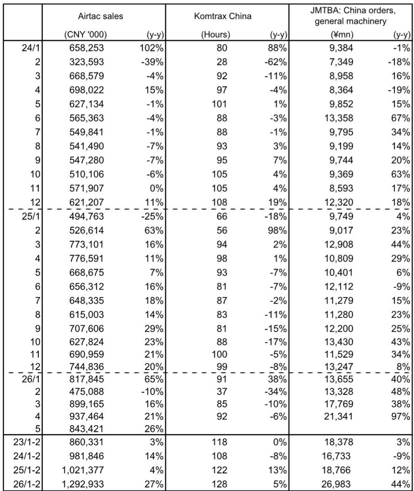

# China's Factory Automation Rally Is Real, But The Real Story Is Not About Seasonality

The latest sales data from Airtac, a Taiwanese pneumatic equipment manufacturer that derives roughly 90% of its China revenue, shows May daily sales up 26% year-on-year. On its face, this is another strong data point in a multi-month recovery. But the pattern beneath the headline demands a more nuanced read. Month-on-month daily sales slipped 1% from April, a month the report identifies as likely representing the highest level of the year. This is not a signal of softening demand. It is the first real test of whether the automation cycle in China has structural legs or is simply riding a wave of policy stimulus and AI-related capital expenditure that will fade as the year progresses.

The critical question for investors is not whether May was good. It was. The question is whether the composition of that growth tells us that the cycle is broadening or concentrating. The answer, based on the sector-level breakdown, is that the cycle is both broadening and concentrating at the same time, and the distinction matters enormously for which companies and sub-sectors will outperform in the second half of 2026.

The report provides a rare window into the granularity of China's factory automation demand. Airtac's sales mix spans electronics, batteries, autos, packaging machinery, machine tools, general machinery, textile machinery, and energy and lighting. That breadth makes it a proxy for the overall health of China's manufacturing investment cycle. When a company with that kind of exposure posts 26% year-on-year daily sales growth, it is worth taking seriously. But the real insight lies in which sectors are driving the growth and which are lagging, and what that tells us about the forces reshaping China's industrial landscape.

## The AI Data Center Investment Thesis Is Now Visible In Machine Tool Orders, Not Just In Semiconductor Supply Chains

The most striking finding in the May data is the performance of the machine tool sector. Sales to machine tool customers rose 35% year-on-year and, critically, increased month-on-month from an already elevated April level. The report explicitly attributes this to increased investment in AI data centers. This is a connection that many investors have not yet fully priced in. The conventional view is that AI-related capital expenditure benefits semiconductor equipment, cooling systems, and power infrastructure. But machine tools are the backbone of precision manufacturing. If AI data center buildout is driving demand for machine tools, it means the capex cycle is extending beyond the obvious beneficiaries into the broader industrial ecosystem that supports advanced manufacturing.

This has second-order implications. Machine tools are used to produce components for everything from server racks to cooling systems to power management equipment. The fact that orders are rising month-on-month, even as other sectors correct on seasonal factors, suggests that the AI-driven demand is not a one-time spike but a sustained investment wave. For investors, this means that companies exposed to precision machining, CNC equipment, and industrial automation components that serve the data center supply chain may have more durable demand than the broader cycle would suggest. The machine tool data point is a leading indicator that the AI capex cycle is deeper than most models capture.

## The Battery And Electronics Correction Is Seasonal, But The Underlying Trend Remains Structurally Positive

Electronics and battery sectors saw sales rise 12% and 55% year-on-year respectively, but both corrected month-on-month from April. The report attributes this to seasonal factors, and the historical pattern supports that interpretation. April tends to be a peak month for these sectors, and a May pullback is normal. However, the magnitude of the year-on-year growth in batteries, at 55%, deserves attention. Battery manufacturing is not a new industry in China, but the growth rate suggests that capacity expansion is continuing at a rapid pace, likely driven by both domestic electric vehicle demand and export-oriented battery production.

The question that the data does not fully answer is whether the battery sector's growth is sustainable at these levels. China's battery industry has faced overcapacity concerns, and trade tensions have created uncertainty around export markets. The 55% year-on-year growth in May is impressive, but it comes against a base that may have been depressed in the prior year. Investors need to assess whether this is a genuine demand-driven expansion or a reflection of inventory building and capacity installation that could normalize in the second half of the year. The report's data does not resolve this ambiguity, and it is one of the key analytical gaps that readers of the full report will need to explore.

## Solar-Power Related Demand Is The Clear Weak Spot, And It Signals A Broader Structural Shift In China's Industrial Priorities

The only sector that posted a year-on-year decline was energy and lighting, which includes solar-power related equipment, falling 5%. This is consistent with a broader trend visible in Chinese industrial production data. Solar power output has been a growth area, but the equipment and automation side of the solar supply chain appears to be under pressure. The report notes that demand in the automation industry as a whole was strong, with the exception of solar power-related industries. This divergence is important.

China's solar industry has faced overcapacity, margin compression, and trade barriers in key export markets. The weakness in automation orders from solar-related customers suggests that capacity expansion in that sector is slowing. For investors, this creates a clear differentiation. Companies with heavy exposure to solar manufacturing equipment face headwinds, while those serving electronics, batteries, machine tools, and AI-related infrastructure benefit from a more favorable demand environment. The data supports a barbell strategy: overweight automation plays tied to AI and advanced manufacturing, underweight those tied to solar.

## The Report Does Not Fully Resolve Whether This Cycle Is Policy-Driven Or Demand-Driven, And The Distinction Will Determine Its Longevity

China's 15th five-year plan emphasizes smart manufacturing and industrial advancements, and Airtac's management explicitly cited this as a tailwind. The report also references government support measures. But the data does not cleanly separate the impact of policy stimulus from organic demand. This is a critical analytical gap. If the current cycle is primarily policy-driven, it may be vulnerable to shifts in government priorities or fiscal constraints. If it is demand-driven, driven by AI investment, electric vehicle adoption, and industrial upgrading, then it has more staying power.

The machine tool data argues for the demand-driven thesis, because AI data center investment is a private sector phenomenon, not a government program. But the broad-based strength across multiple sectors could also reflect a policy-induced capex cycle. The report's historical data shows that Airtac sales have been correlated with China's total social financing and corporate capex appetite surveys in the past. That correlation suggests that credit conditions and policy support matter. Investors need to monitor both the policy environment and the private sector demand signals to assess whether the current momentum is sustainable.

The following decision framework can help investors navigate this uncertainty. First, track machine tool orders as a leading indicator of AI-related industrial demand. If machine tool orders continue to rise month-on-month, the AI capex cycle is deepening. Second, monitor battery sector orders for signs of normalization. If battery orders decelerate sharply in June and July, the seasonal correction may be masking a broader slowdown. Third, watch for any policy announcements related to manufacturing investment or credit support. If the government announces additional stimulus, the cycle gets a near-term boost but raises questions about underlying demand. Fourth, compare Airtac's sales trajectory with Komtrax operating hours and Japan Machine Tool Builders' Association data for China. If these indicators diverge, it will signal which parts of the automation cycle are genuine and which are distorted.

## Join The Community To Read The Full Report And Review The Original Charts

The May data confirms that China's factory automation cycle is alive and broad-based, but the composition of growth reveals a market that is increasingly driven by AI-related investment and advanced manufacturing, not by traditional industrial production. The machine tool sector's strength is the most important signal in the data, and it deserves deeper analysis than a single monthly data point can provide. The full report includes historical charts that show the relationship between Airtac sales, China's total social financing, Komtrax operating hours, and machine tool orders over multiple years. These charts provide the context needed to assess whether the current cycle is different from previous ones. Join the community to read the full report and review the original charts.

*This article is for learning and discussion only and does not constitute investment advice.*

Personal reading notes and learning share only. Not investment advice.

