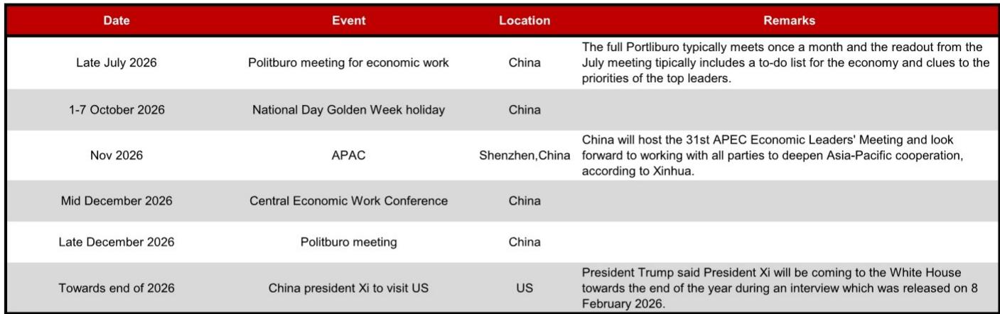
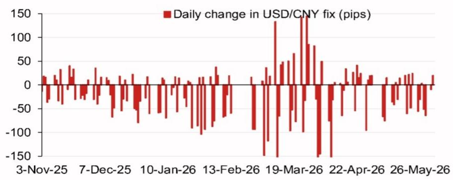
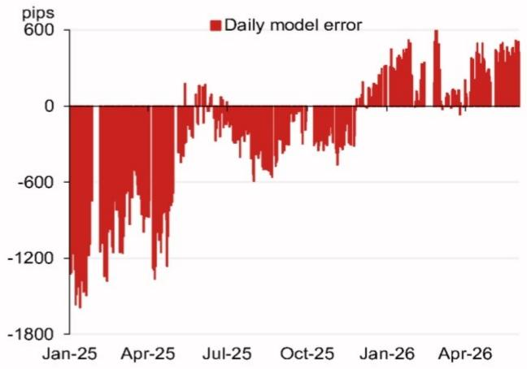

# The PBOC's Fix Model Is Sending a Clear Signal: The Counter-Cyclical Factor Is Back, and It Matters More Than the Spot Rate

The People's Bank of China does not set the daily USD/CNY central parity rate by whim. It follows a transparent, rules-based model that incorporates overnight moves in a basket of currencies, and it reserves the right to add a discretionary "counter-cyclical factor" when it wants to lean against market momentum. The latest projection from a leading global investment bank's Asia FX strategy team puts the model-implied fix at 6.7705, a striking 482 pips lower than the previous day's fix of 6.8187. That is a large single-day shift, and it is almost entirely driven by the weakening of the US dollar against the ruble, the euro, the Thai baht, and the yen. But the real story is not the raw model output. The real story is what happens when the counter-cyclical factor is applied.

With the counter-cyclical factor included, the projected fix rises to 6.7957, which is 230 pips lower than the previous fix but still significantly stronger than the spot close. This gap between the model-implied fix and the adjusted fix is the PBOC's policy signal. It tells us that the central bank is willing to let the renminbi appreciate, but only at a controlled, gradual pace. It is not ready to let the currency rip. This matters now because the window for renminbi appreciation is narrowing. The US dollar is under pressure, but the PBOC faces a complex set of domestic and political constraints that will determine whether it can sustain this stance through the second half of 2026. The model is not just a forecast. It is a window into the central bank's strategic calculus.

The following analysis unpacks what the fix model reveals about the PBOC's current thinking, why the counter-cyclical factor is the most important variable to watch, and what unresolved questions will determine the renminbi's trajectory in the months ahead. For serious currency strategists, the fix is not a data point. It is the opening move in a game of strategic positioning.

## The Model's Inputs Are a Mirror of Global Risk, and the Ruble's Outsize Role Is a Warning

The top four weighted contributors to the projected change in the fix are the Russian ruble, the euro, the Thai baht, and the Japanese yen. The ruble alone contributes 33.5 pips of the projected move, more than the euro and the yen combined. This is not a normal distribution. The ruble is not a major reserve currency, and its weight in the PBOC's basket is not large enough to justify this level of influence under ordinary circumstances. The ruble's outsize contribution is a direct consequence of the extreme volatility in Russian currency markets, which in turn reflects the geopolitical and energy price shocks that have defined the first half of 2026.

The implication is straightforward: the PBOC's fix is now partially hostage to a currency that is driven by sanctions policy, energy supply disruptions, and capital controls. When the ruble strengthens on the back of a rally in oil prices or a diplomatic breakthrough, it pulls the model-implied fix lower. When the ruble weakens, it pushes the fix higher. This creates a transmission mechanism that the PBOC cannot fully control. The central bank can adjust the counter-cyclical factor to offset the ruble's influence, but doing so requires it to make a conscious decision to override the model. The current projection suggests the PBOC is comfortable with the ruble's downward pull on the fix, but that comfort may not last if the ruble's volatility escalates further.

The euro and the yen are more conventional inputs. The euro's 21-pip contribution reflects the broad dollar weakness that has followed the Federal Reserve's pivot to a more dovish stance. The yen's 8-pip contribution is modest, but it is a reminder that the Bank of Japan's gradual normalization of monetary policy is still a tailwind for the renminbi. The Thai baht's 9-pip contribution is interesting: it suggests that the PBOC's model is picking up on the broader Asian currency rally that has accompanied the dollar's decline. This is not just a China story. It is a regional story, and the PBOC is clearly calibrating its fix to avoid falling behind the curve of its Asian peers.

## The Counter-Cyclical Factor Is the PBOC's Policy Lever, and Its Current Setting Reveals a Deliberate Bias

The difference between the raw model projection of 6.7705 and the adjusted projection of 6.7957 is 252 pips. That is the counter-cyclical factor in action. The PBOC is using this discretionary adjustment to push the fix higher than the model would otherwise imply. In plain language, the central bank is leaning against renminbi appreciation. It is not trying to stop the currency from strengthening, but it is trying to slow the pace.

This is a classic PBOC playbook. The counter-cyclical factor was first introduced in 2017 as a tool to smooth out excessive volatility and to signal the central bank's policy preference. When the factor is set to a positive value, it indicates that the PBOC wants a weaker fix than the model alone would produce. When it is set to a negative value, it indicates a preference for a stronger fix. The current positive setting tells us that the PBOC is not yet ready to embrace a strong renminbi narrative.

The question is why. The most obvious answer is export competitiveness. A rapid appreciation of the renminbi would squeeze Chinese exporters at a time when the global demand outlook is uncertain. The US economy is slowing, European growth is tepid, and the trade tensions between China and the US remain unresolved despite the scheduled visit of President Xi to Washington later this year. The PBOC cannot afford to let the currency strengthen to a level that would undermine the export sector's fragile recovery.

But there is a second, less discussed reason: the PBOC is likely concerned about the destabilizing effects of a one-way appreciation bet. If the market interprets the fix as a signal that the renminbi is on a sustained strengthening path, it could trigger a wave of speculative capital inflows. That would put upward pressure on the currency, force the PBOC to intervene in the spot market, and complicate its monetary policy independence. The counter-cyclical factor is a way to manage expectations without committing to a specific exchange rate level.

## The Model's Error History Suggests the PBOC Is Willing to Tolerate Large Misses When It Suits Its Purpose

The chart of daily model errors without the counter-cyclical factor adjustment is revealing. In January 2025, the error was approximately -1800 pips. That is a massive deviation. It means the PBOC's fix was far weaker than the model would have predicted. In April 2025, the error was approximately -600 pips. By July 2025, the error had converged to near zero. Then it widened again to -600 pips in October 2025, before swinging positive to +600 pips in January 2026 and again in April 2026.

This pattern tells a clear story. The PBOC does not treat the model as a binding constraint. It treats the model as a starting point, and it is willing to deviate from it by large margins when the macroeconomic or political situation demands it. The large negative errors in early 2025 coincided with a period of intense trade negotiations and a weakening Chinese economy. The PBOC was actively holding the fix weaker to support growth. The swing to positive errors in early 2026 coincided with the dollar's decline and the PBOC's decision to allow some appreciation. But the magnitude of the positive errors is smaller than the earlier negative errors, which suggests the PBOC is more cautious about letting the currency strengthen than it was about letting it weaken.

For investors, the key takeaway is that the model is a useful guide, but it is not a reliable predictor of the fix. The PBOC's discretion is the dominant force, and that discretion is exercised in response to a complex set of domestic and international factors. Anyone who trades the renminbi based solely on the model projection is missing the most important part of the story.

## What the Report Does Not Fully Answer: The Political Calendar and the Limits of the Counter-Cyclical Factor

The report includes a calendar of key events for the remainder of 2026, and this calendar is the most underexplored part of the analysis. The Politburo meeting for economic work in late July, the Central Economic Work Conference in mid-December, and the scheduled visit of President Xi to the US towards the end of the year are all events that could fundamentally alter the PBOC's exchange rate policy.

The report does not address the question of how the counter-cyclical factor might be adjusted in response to these events. If the Politburo meeting signals a shift towards more aggressive fiscal stimulus, the PBOC may need to keep the fix weaker to support exports and offset the inflationary impact of stimulus. If the Xi-Trump meeting produces a trade deal, the PBOC may allow the renminbi to strengthen as a goodwill gesture. If the meeting fails, the PBOC may double down on a weak currency policy to cushion the blow to the economy.

The report also does not address the question of whether the counter-cyclical factor has any upper bound. Is there a limit to how much the PBOC can deviate from the model before the market loses confidence in the fix? The historical error data suggests the PBOC has a wide band of tolerance, but that band may narrow if the deviations become too large or too persistent. The market's reaction to the fix is itself a constraint, and the PBOC must calibrate its policy to avoid triggering a loss of credibility.

These are not criticisms of the report. They are the natural open questions that any serious analyst must grapple with. The fix model is a tool, not a crystal ball. The PBOC's behavior is the real variable, and that behavior is shaped by a political and economic landscape that is inherently uncertain.

## A Decision Framework for Currency Strategists: Three Questions to Ask Before Taking a Position

For readers who want to translate this analysis into actionable strategy, the following framework is designed to cut through the noise. Before taking a position on the renminbi, ask three questions.

First, what is the counter-cyclical factor telling you? Track the difference between the raw model projection and the actual fix. If the gap is widening in the direction of a weaker fix, the PBOC is signaling that it wants to slow appreciation. If the gap is narrowing or turning negative, the PBOC is signaling that it is comfortable with a stronger currency. The direction of the gap is more important than the absolute level of the fix.

Second, what is the ruble doing? The ruble's outsize weight in the model means that any sharp move in the Russian currency will have a disproportionate impact on the fix. If the ruble is strengthening due to a geopolitical shock, the PBOC may be forced to intervene more aggressively with the counter-cyclical factor. If the ruble is weakening, the PBOC may have more room to let the renminbi appreciate. Do not ignore the ruble. It is now a critical input for any renminbi forecast.

Third, what is the political calendar? The July Politburo meeting, the December Central Economic Work Conference, and the Xi-Trump meeting are the three events most likely to trigger a shift in the PBOC's policy stance. In the weeks leading up to these events, the PBOC is likely to be more cautious and more willing to use the counter-cyclical factor to manage expectations. In the weeks after, the PBOC may be more willing to let the market dictate the fix. Position accordingly.

This framework is not a trading algorithm. It is a way to think about the problem. The renminbi is not a free-floating currency. It is a managed currency, and the management is driven by a model that is itself subject to discretionary overrides. The only way to navigate this complexity is to focus on the variables that the PBOC itself is watching.

## The Full Report Contains the Charts That Make These Trends Visible, and the Data Is Worth Seeing Firsthand

The analysis above is based on the model projections and the historical error data that are summarized in the report's charts. But there is a difference between reading a description of a chart and seeing the chart itself. The bar chart of daily changes in the USD/CNY fix, for example, reveals a pattern of small, incremental adjustments that is not fully captured by the model projection alone. The line chart of model errors shows the ebb and flow of the PBOC's discretion in a way that a single data point cannot.

For serious currency strategists, the charts are not decoration. They are the primary source of insight. The raw numbers tell part of the story, but the visual patterns tell a different, deeper story about the PBOC's behavior over time.

Join the community to read the full report and review the original charts.

*This article is for learning and discussion only and does not constitute investment advice.*

Personal reading notes and learning share only. Not investment advice.

