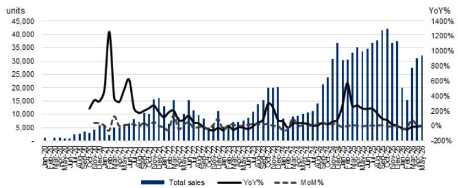
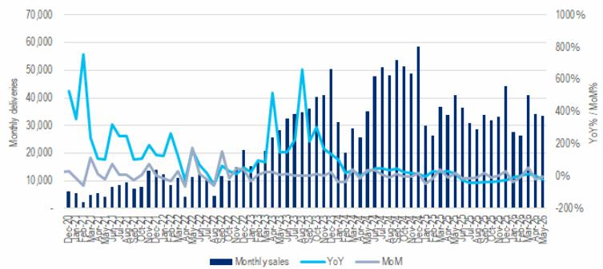

# China's EV Market Is Not Slowing Down — The Real Story Is in the Divergence

The consensus view that China's new energy vehicle market has entered a period of maturation and deceleration is being challenged by the May 2026 sales data. A global investment bank report tracking preliminary wholesale volumes reveals that the sector is not merely holding steady — it is accelerating, with month-over-month growth of 12% and year-over-year expansion of 7%. This is not a market that has plateaued. It is a market that is restructuring beneath the surface, and the headline numbers obscure a more consequential story: the gap between winners and losers is widening at a pace that will reshape competitive dynamics for years to come.

The May data matters because it arrives at a critical inflection point. After a period of intense price competition, policy uncertainty, and macroeconomic headwinds, the market is demonstrating that demand remains structurally robust. But the aggregate figures tell only half the story. The real insight lies in the dispersion of performance across brands. While the sector as a whole beat expectations, individual results ranged from spectacular to concerning. BYD delivered 383,500 units, flat year-over-year but surging 19% month-over-month. Leapmotor posted 81,569 units, an 81% year-over-year gain. Nio delivered 37,705 units, up 62% year-over-year. Meanwhile, Li Auto declined 18% year-over-year, and Xpeng fell 4%. These are not random fluctuations. They are signals of strategic divergence that investors must understand in depth.

The argument of this article is straightforward: the Chinese EV market has entered a phase where aggregate growth masks a brutal zero-sum game. The winners are those who have solved for three things simultaneously — export capability, product portfolio breadth, and operational efficiency. The losers are those who remain dependent on a single product cycle or a narrow domestic base. The May data provides a rich dataset to test this thesis, and the implications for capital allocation are significant.

This analysis draws on the detailed brand-level data from the report, but it extends the logic to identify structural patterns, unresolved questions, and a decision framework for investors. The goal is not to summarize what happened in May. It is to understand what May tells us about the future.

## BYD's Export Surge and Domestic Stability Reveal a Dual-Engine Strategy That Few Can Replicate

The most important single data point in the May report is not BYD's headline volume of 383,500 units. It is the export figure: 160,644 units overseas, representing a 19% month-over-month gain and a 65% year-over-year increase for the first five months of 2026. BYD is now selling more vehicles outside China than most domestic EV brands sell in total. This is not a diversification play. It is a fundamental shift in the company's business model.

Domestically, BYD's numbers are flat year-over-year — a fact that might alarm superficial observers. But flat domestic sales at this scale, in a competitive environment where many peers are declining, is itself a statement of strength. The real story is that BYD has managed to stabilize its domestic position while simultaneously scaling its international operations at a pace that has no precedent in the Chinese auto industry. The 5M26 overseas sales of 616,907 units represent a run rate that, if sustained, would put BYD on track for nearly 1.5 million export units in a full year.

The strategic implication is profound. BYD is effectively running two businesses: a mature, high-volume domestic operation that generates cash flow and manufacturing scale, and a high-growth international operation that is still in its early innings. Most competitors are still trying to figure out how to make one business work. The dual-engine model creates a buffer that few peers can match. When domestic demand softens, exports can compensate. When international markets face regulatory hurdles, the domestic base provides stability.

The composition of BYD's sales also deserves attention. Battery electric vehicles accounted for 52.7% of NEV passenger vehicle sales in May, up from 50.6% in April. Plug-in hybrids grew 3% year-over-year. This mix matters because it suggests BYD is not betting exclusively on one powertrain. It is hedging across technologies, which gives it flexibility to respond to shifting consumer preferences and regulatory changes in different markets. The company's ability to offer both BEV and PHEV at competitive price points is a structural advantage that is difficult to replicate.

## The Mid-Tier Is Splitting Into Two Distinct Groups: Scale Winners and Niche Survivors

A scatter plot of May sales volume against year-over-year growth reveals a striking pattern. The market is not a bell curve. It is a barbell. On one end, you have BYD at 383,500 units with flat growth. On the other, you have a cluster of brands between 30,000 and 80,000 units with dramatically different growth trajectories. Leapmotor at 81,569 units is growing at 81% year-over-year. Zeekr at 34,377 units is growing at 82%. Nio at 37,705 units is growing at 62%. Meanwhile, Li Auto at 33,350 units is declining 18%, and Xpeng at 32,158 units is declining 4%.

This dispersion is not random. It reflects fundamental differences in product strategy, brand positioning, and operational execution. Leapmotor and Zeekr are benefiting from a combination of product refresh cycles and aggressive pricing that has resonated with value-conscious consumers. Nio's strong performance is driven by the ramp-up of its Onvo and Firefly sub-brands, which are expanding its addressable market beyond the premium segment. Li Auto's decline, by contrast, appears to be a function of product cycle timing — the company is between major refreshes, and its L-series lineup is facing increased competition from newer entrants.

The key insight here is that the mid-tier is not a homogeneous category. It is fracturing into two groups: those who have achieved sufficient scale to compete on cost and brand recognition, and those who are carving out defensible niches. Leapmotor, at 81,569 units per month, is approaching the volume threshold where manufacturing economics become significantly more favorable. Nio, while smaller, has built a differentiated brand around battery swapping and premium service that creates customer stickiness. Zeekr is leveraging Geely's manufacturing platform to achieve cost advantages.

The question that the report does not fully answer is whether this fragmentation is temporary or permanent. Will the mid-tier consolidate into a smaller number of players, or can multiple brands coexist at different price points and with different value propositions? The data suggests that the market is large enough to support several players in the 30,000 to 80,000 unit range, but the margin profiles of these companies will vary dramatically. The ones that can achieve both scale and differentiation will survive. The ones that are caught in the middle — too small for cost leadership, too generic for premium pricing — will face increasing pressure.

## Huawei Harmony's Order Momentum Signals a Structural Shift in the Competitive Landscape

The most underappreciated data point in the May report may be the order book for Huawei Harmony. The company reported 46,122 deliveries in May, up 41% month-over-month. But the forward-looking indicators are even more striking: the all-new M9 received over 20,000 non-refundable orders within 24 hours of launch, the Luxeed V9 received over 10,500 orders within 48 hours, and the M6 accumulated over 20,000 orders in its first month. These are not aspirational reservations. They are non-refundable orders, which carry real economic commitment from consumers.

Huawei Harmony is not a traditional automaker. It is a technology company that has entered the automotive space through partnerships and its own brand. The order data suggests that its approach — combining advanced driver assistance systems, intelligent cockpits, and a strong brand halo from Huawei's consumer electronics business — is resonating with Chinese consumers in a way that traditional automakers have struggled to replicate. The M9, in particular, is positioned in the premium segment, which is typically the most difficult market for new entrants to crack.

The strategic implication is that the competitive landscape is no longer just about traditional automakers versus EV startups. It is increasingly about technology companies that can integrate hardware, software, and services in ways that legacy automakers cannot. Huawei Harmony's order momentum raises a question that the report does not fully address: how much of the market is addressable by technology-first players, and how much will remain the domain of traditional automotive engineering and manufacturing?

The answer will depend on whether Huawei Harmony can sustain this momentum beyond the initial product launch cycle. The order data is impressive, but it reflects pent-up demand for a new product. The real test will come in the next six to twelve months, when the company must demonstrate that it can maintain order velocity without relying on launch hype. If it can, then the competitive dynamics of the Chinese EV market will shift fundamentally, and traditional automakers will need to rethink their technology strategies.

## A Decision Framework for Investors: Three Questions to Determine Which EV Stocks Will Outperform

For investors trying to navigate this complex landscape, the May data provides a useful framework for evaluating individual companies. The key is to move beyond simple metrics like month-over-month growth and instead focus on three structural questions that determine long-term viability.

First, does the company have a credible export strategy? The data is clear: domestic competition is intensifying, and the companies that are growing fastest are those that have access to international markets. BYD's export surge is the most obvious example, but Leapmotor and Nio are also building international presence. Companies that remain purely domestic will face increasing margin pressure as the market matures. The export question is not just about revenue diversification. It is about access to higher-margin markets and the ability to absorb excess domestic capacity.

Second, does the company have a product portfolio that spans multiple segments? The winners in May were not single-product companies. Nio's growth was driven by the Onvo and Firefly sub-brands, which expand its addressable market. BYD's stability comes from its broad lineup spanning from the Seagull to the Yangwang. Leapmotor and Zeekr both have multiple models in production. Companies that are dependent on a single model or a narrow price band are vulnerable to product cycle risk and competitive disruption.

Third, does the company have a path to sustainable profitability? This is the question that the report raises but does not fully answer. Several of the companies that are growing rapidly are not yet profitable on a consistent basis. Leapmotor expects to break even in the second quarter, but its full-year gross profit margin guidance has been lowered to 14.5%. Nio is targeting non-GAAP profitability in the second quarter. Li Auto's vehicle margin is around 10%. The path to profitability is not guaranteed, and the companies that can achieve it while maintaining growth will be the ones that generate the best risk-adjusted returns.

The unresolved question from the report is whether the market can sustain multiple players at current volume levels without a wave of consolidation. The May data shows that the market is large enough to support growth, but it does not show whether the market is profitable enough to support all the current participants. Investors should watch for signs of margin compression, inventory buildup, and pricing discipline as leading indicators of which companies are building sustainable businesses and which are burning cash to buy market share.

## The Full Report Reveals the Charts and Data That Make These Patterns Visible

The analysis above is based on the preliminary May sales data and the strategic patterns that emerge from it. But the full report contains detailed charts, historical comparisons, and company-specific breakdowns that provide a much richer picture of what is happening beneath the surface. The scatter plots showing the relationship between sales volume, month-over-month growth, and year-over-year growth are particularly valuable for visualizing the dispersion across brands. The BYD wholesale summary table provides a granular look at the composition of the company's sales by powertrain and vehicle type. The delivery summaries for Li Auto, Nio, and Xpeng show the trajectory of these companies over multiple months.

These charts and data points are not available in this article. They are part of the original research report, and they contain the granular detail that serious investors need to make informed decisions. The patterns identified here — the divergence between winners and losers, the importance of export strategy, the structural shift driven by technology players — are visible in the data, but the full picture requires access to the underlying numbers and the visualizations that bring them to life.

Join the community to read the full report and review the original charts.

*This article is for learning and discussion only and does not constitute investment advice.*

Personal reading notes and learning share only. Not investment advice.

