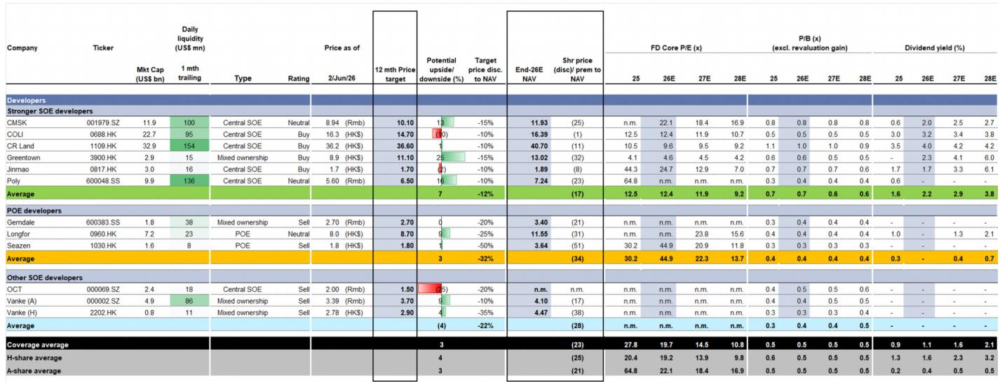
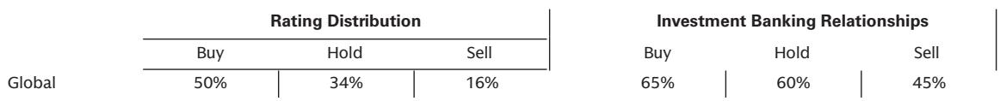

# 市场真正低估的不是需求，而是供给侧的再定价

2026年6月，某外资投行举办了其中国房地产专家电话系列的首场会议，邀请趋势动物创始人聂聪分享对市场的判断。这份研报的核心信号并非“市场何时见底”这类老问题，而是一个更结构性的判断：中国房地产市场的复苏路径正在从“是否复苏”演变为“不同资产类别之间的持续分化”。这种分化不是暂时的波动，而是供给结构、政策工具和需求偏好共同作用下的新均衡。

多数投资者仍在等待一个统一的拐点信号——全国房价普涨、成交量全面回暖。但这份研报呈现的证据指向另一个方向：市场正在被切割成三个截然不同的价格体系——政府回购支撑的微型单元、高租金收益率的非核心城市资产、以及仍在加速下跌的中高端改善型住房。这三条线的逻辑不同，驱动因素不同，对投资组合的含义也不同。

更值得关注的是，报告提出了两种截然不同的复苏情景。在基准情景下，复苏将是一个“从两端向中间渗透”的缓慢过程——优质新房和高收益率资产先行，中端住宅随后跟进，且节奏取决于各城市的库存水位。而在大规模政策刺激情景下，市场可能复制香港模式——风险偏好快速扩张，中价位住宅价格迅速反弹。这两种情景对资产定价的含义完全不同，而当前市场定价隐含的是哪一种，恰恰是最大的未解问题。

以下是我们从这份研报中提炼出的几个关键判断，以及它们对投资框架的含义。

## 1. 全国房价跌幅收窄的背后，是三个完全不同的价格体系在同时运行

如果只看全国层面的月度数据，结论可能是温和的：全国二手房价格指数月环比跌幅已经从年初的-0.5%收窄到近期的-0.4%。但这份收窄并不是因为“所有房子都跌得少了”，而是因为三个价格体系的力量在同时作用。

第一个体系是政府回购驱动的政策性市场。上海50平方米以下的微型单元自2025年11月触底以来已上涨4%，50-70平方米的小户型自2026年1月以来上涨11%。这不是市场自发的需求回暖，而是上海政府加速存量住房回购用于保障性租赁住房的直接结果。这部分价格回升是政策性的、有上限的——一旦回购规模放缓，价格动能可能随之消退。

第二个体系是高租金收益率的非核心城市资产。乌鲁木齐部分核心区域在连续六个月下跌后开始回升，背后是3.6%的平均租金收益率；大理的旅游和养老地产在过去一年上涨了8%，租金收益率约3%。这些资产的定价逻辑更接近固定收益——在利率下行周期中，高收益率资产自然获得重定价。这部分回升是自发的，但规模有限。

第三个体系是仍在承压的主流住宅。北京和广州的房价全线承压，杭州和成都核心区的高端资产自2026年3月以来加速下跌。这些市场既没有政策性回购支撑，也没有高收益率保护，仍在经历供需失衡的调整。

这三个体系并存意味着，全国平均数据掩盖了比表面数字更大的结构性差异。投资者不能再用“全国房价”这个笼统概念来指导决策，而需要分别理解每个价格体系的驱动因素和可持续性。

## 2. 深圳和上海的分化路径正好相反，但都指向同一个逻辑：需求结构已经变了

上海和深圳是这轮分化中最具代表性的两个城市，但它们的反弹路径截然不同。

上海的反弹集中在微型和小户型，由政府回购主导。深圳的稳定则来自中高端市场——总价1000万至2000万元的住房已经触底并小幅回升，南山和福田等核心子市场录得明显上涨动力，背后是改善型需求的复苏。换句话说，上海是“政策托底低端”，深圳是“需求拉动中高端”。

这两个案例的共同点在于：需求已经不再是统一的“买房需求”，而是高度分层的。政府的回购需求、首次置业者的上车需求、改善型家庭的升级需求、以及投资客的收益率需求，正在被不同的资产类别分别满足。这意味着，未来的市场复苏不会是“雨露均沾”的普涨，而是每个细分市场各自找到自己的均衡价格。

这对开发商的启示是：产品定位比城市选择更重要。在上海，开发微型单元的企业可能比开发豪宅的企业更早受益；在深圳，专注于改善型产品的项目可能比刚需盘更快触底。但报告也指出，上海50-90平方米的住房去化可能更为艰难——这部分库存是2006年至2024年“7090政策”的遗留产物，供应量较大，且既没有政府回购支撑，也不属于改善型需求的核心目标。

## 3. 租金收益率正在成为资产定价的新锚点，但市场对此的认知仍然不足

报告中最具结构性的信号之一，是全国80城租金指数已在2026年1月触底，结束了自2023年以来的持续下跌。深圳是这轮租金复苏的领头羊。

租金触底的意义在于：它提供了资产定价的一个基本面锚点。在房价下跌周期中，租金收益率上升意味着房产的投资价值在改善。乌鲁木齐3.6%的租金收益率、大理约3%的收益率、成都部分单元超过3.5%的收益率——这些数字在利率下行环境中变得有吸引力。

报告进一步指出，如果抵押贷款利率再下降50-100个基点，这些高租金收益率资产可能获得20-30%的价值重估。这个判断的逻辑是清晰的：在无风险利率下降的背景下，任何提供稳定现金流且收益率高于无风险利率的资产，都会吸引资本流入。

但这个逻辑有一个尚未验证的关键假设：这些高租金收益率资产的租金能否维持稳定？如果经济下行导致租金下跌，收益率优势可能迅速消失。报告没有完全展开这个风险，但对于任何考虑配置这类资产的投资者来说，这是必须独立验证的问题。

## 4. 复苏的传导机制是“从两端向中间”，但中端市场的库存压力是最大变量

报告提出的基准复苏路径是：优质新房和高收益率资产先行，然后通过置换需求逐渐传导到中端住宅。这个传导机制在理论上是合理的——高端市场回暖会释放卖房者的购买力，从而带动中端市场交易活跃。

但传导的速度和幅度取决于一个关键变量：库存。截至2026年4月，一线和强二线城市的库存月数在9至32个月之间，而其他二线城市在14至479个月之间，三四线城市更高。这个差距意味着，即使一线城市出现复苏信号，向低能级城市的传导也会非常缓慢，甚至可能无法完成。

报告特别提到了武汉、苏州、南京、杭州等城市的中端资产——这些城市在本轮下行中跌幅较大，如果出现类似香港的中端市场反弹，可能提供超额收益机会。但这里需要谨慎：香港的反弹是在大规模政策刺激下实现的，而报告基准情景中并不包含这种刺激。如果没有政策催化，这些城市的中端市场可能需要更长时间才能触底。

## 5. 定价逻辑正在从“地段”转向“品质”，但这个趋势的可持续性仍需验证

报告指出一个值得关注的趋势：市场定价的核心逻辑正在从传统的“地段为王”转向更加注重物业服务和居住品质。具体表现为，提供优质物业管理和社区设施的项目，相对于相邻项目享有15%-20%的单价溢价。

这个趋势如果成立，意味着房产的价值来源正在发生变化。过去二十年，中国房地产的价值核心是“土地升值”——地段决定了房价的上限。但在一线城市土地供应日趋紧张、新建项目越来越少的背景下，存量房的品质差异正在成为定价的关键因素。

然而，这个趋势的可持续性需要进一步验证。高品质物业的溢价能否维持，取决于两个条件：一是业主是否愿意持续支付更高的物业费，二是物业管理公司是否有能力维持服务质量。报告没有讨论这两个条件是否成立，但它们是判断这个趋势能否成为长期定价因素的关键。

## 6. 报告没有完全回答的关键问题：政策刺激情景的概率有多大？

报告提出了两种情景，但并没有给出每种情景的概率权重。这是投资者最需要独立判断的问题。

基准情景（无大规模刺激）意味着一个缓慢、分化、充满不确定性的复苏过程。在这个情景下，投资机会集中在两端：高租金收益率的现金流资产，以及优质新房项目在进入二手房市场后的溢价空间。中端市场需要等待更长时间。

政策刺激情景（抵押贷款利率再降50-100个基点、政府回购显著加速）则意味着更快的反弹，尤其是中端市场可能出现类似香港的快速修复。在这个情景下，现在被低估的中端资产可能提供最大的弹性。

当前市场定价隐含的是哪种情景？从开发商股票的估值来看（报告提供的估值表显示覆盖范围内公司平均交易价格较净资产价值折价23%），市场显然更倾向于基准情景。但政策路径的不确定性意味着，任何政策信号的变化都可能导致资产定价的重新校准。

---

关于复苏传导的具体时间线、各城市库存数据的详细拆解、以及政策刺激情景下哪些资产类别最受益，我们会在社群中继续讨论。欢迎来星球微信群，一起跟踪这些关键变量的变化。

Personal reading notes and learning share only. Not investment advice.

