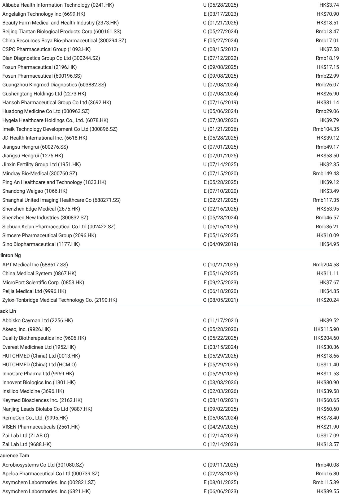
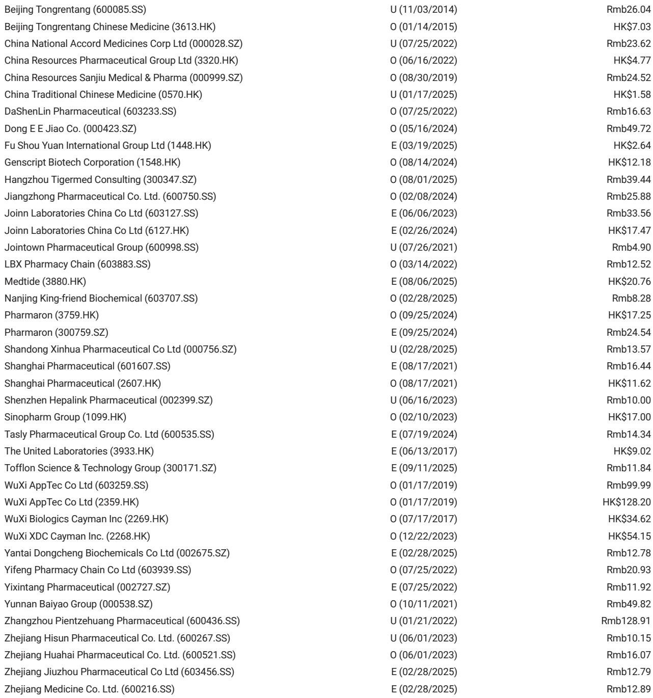
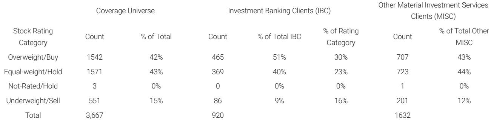

# KRAS G12C的真相：不是所有抑制剂都一样，组合疗法的门槛比想象中更高

ASCO 2026进入第二天，讨论的焦点从前沿探索转向了一线治疗的格局重塑。这份某外资投行发布的第二天要点解析，透露出一个清晰但容易被忽略的信号：市场正在为KRAS G12C抑制剂寻找合理的临床定位，但真正的变量不是机制本身，而是分子层面的差异和组合策略的选择门槛。

报告的核心判断可以浓缩为一句话：KRAS G12C单药在一线非小细胞肺癌中的故事线比组合疗法更清晰，而组合疗法的有效性虽然真实存在，但需要更精细的患者分层、更主动的不良反应管理和更严格的剂量连续性。这不是一个“谁更好”的问题，而是一个“谁更适合哪种场景”的格局判断。

以下是我们从这份报告中提炼出的五层洞察。

## 1. 单药在一线的故事线比组合更干净，但“干净”不等于“容易”

讨论者对于Divarasib和Elisrasib的数据给出了一个有趣的信号：对单药在一线的前景更有信心。这不是否定组合疗法的价值，而是承认了一个现实——当疗效与毒性需要权衡时，单药方案的确定性更高。

报告特别强调了一个容易被忽视的细节：讨论者认为，化疗联合方案相比免疫联合化疗的长期生存优势有限。这意味着，如果组合疗法的设计只是简单地“把化疗加进去”，而不是考虑与免疫检查点抑制剂的协同，那么这条路径的长期价值可能被高估。

对于专注于KRAS G12C的中国生物科技公司——如Abbisko、Genfleet、Jacobio——这个判断意味着，单药适应症的推进速度可能比市场预期的更具竞争力，前提是分子本身具备足够好的药代动力学特性和安全性窗口。但报告也隐含了一个未完全回答的问题：什么样的单药活性才算“足够好”？这个阈值尚未被明确界定。

## 2. “不是所有G12C抑制剂都生而平等”——分子层面的差异正在成为竞争的分水岭

这是报告中最重要的一个观点。讨论者明确指出了这一点，并且给出了具体的维度：ON/OFF读通（read-through）的差异、分子水平的药代动力学、靶点结合能力、中枢神经系统穿透性以及毒性谱。

市场上长期以来有一种倾向，把KRAS G12C抑制剂视为一个同质化的类别，认为只要机制相同，临床结果就会趋同。但这份报告用数据说明，事实恰恰相反。一些OFF抑制剂（即非共价结合的抑制剂）正在展示持久的单药活性，而ON抑制剂（共价结合）的读通情况仍然模棱两可。

这意味着，投资者在评估不同公司的KRAS G12C资产时，不能再仅仅看“有没有进入临床”或者“初步有效率是多少”，而需要深入到分子设计层面去理解差异。肝毒性和剂量调整的频率将成为区分优劣的关键指标——报告明确提到，肝毒性和剂量修改仍然是核心关注点。

对于中国公司而言，这是一个双刃剑：分子设计能力强的公司可能获得溢价，而那些仅仅依靠跟随策略的资产可能面临更大的竞争压力。

## 3. 非G12C和pan-RAS的探索让RAS图谱保持流动性，但化疗依赖和质量控制是硬约束

报告提到，非G12C和pan-RAS抑制剂的探索正在从多个方向推进，尤其是在胰腺导管腺癌（PDAC）中，组合策略仍然以化疗为基础。这是一个重要的现实检验：尽管RAS抑制剂的进展令人振奋，但在一线治疗中，化疗仍然是大多数组合方案的支柱。

报告还提出了两个需要关注的约束：MAPK通路的合作伙伴选择、以及谱系可塑性（lineage plasticity）带来的耐药风险。这些都不是短期可以解决的问题，而是需要更长时间的临床验证。

对于投资者来说，这意味着RAS领域的竞争格局仍然高度不确定。那些声称可以覆盖所有RAS突变的平台，在临床数据出来之前，仍然是一个需要验证的假设。报告没有完全展开的是：在非G12C领域，哪些合作伙伴（如SHP2、MEK）的组合策略最有可能首先突破？这个问题的答案可能决定下一轮RAS资产的价值重估。

## 4. ADC在一线的推进正在重塑治疗范式，但组合与序贯的选择将成为关键

报告提到，ADC在一线治疗中的使用正在被大力提倡，涵盖尿路上皮癌、三阴性乳腺癌和HER2阳性乳腺癌。但真正的争议不在于“是否应该用”，而在于“如何用”——是联合使用还是序贯使用，如何在保证疗效的前提下实现可耐受的给药方案。

报告特别指出，双载荷/双特异性ADC被视为下一波创新的方向，尤其是载荷不再局限于拓扑异构酶抑制剂和微管抑制剂。但报告也提醒了几个需要关注的问题：连接子的稳定性、生物标志物的依赖性、以及交叉耐药性。

对于中国ADC公司——如Duality、Innovent、Akeso、Leads Bio——这个判断意味着，格式深度（format depth）和载荷/连接子的逻辑正在成为核心竞争力。那些拥有多样化载荷平台和差异化连接子技术的公司，在一线竞争的格局中可能占据更有利的位置。但报告没有完全展开的是：交叉耐药性的具体机制是什么？如果患者在接受ADC治疗后进展，下一步的序贯治疗应该如何选择？这些问题将是未来临床实践和投资判断的核心。

## 5. 报告尚未完全回答的关键问题：剂量强度与生活质量之间的权衡如何量化？

报告在多个地方提到了剂量强度、生活质量（QoL）和疗效/毒性权衡。尤其是在KRAS G12C的讨论中，肝毒性和剂量调整被反复提及；在ADC的讨论中，皮肤和胃肠道毒性对生活质量的影响也被强调。

但报告没有给出一个清晰的框架来量化这种权衡。对于临床医生和患者来说，什么样的疗效改善可以接受一定程度的毒性增加？这个阈值在不同的癌种、不同的治疗线数、不同的患者群体中可能完全不同。对于投资者来说，这意味着那些能够提供更好的安全性窗口（从而维持更高的剂量强度）的分子，可能获得超出市场预期的商业价值。

这个未解问题也直接关系到中国公司的竞争策略：如果中国患者对某些毒性的耐受性不同，或者中国临床实践更倾向于保守的剂量调整，那么在中国市场，安全性优势可能比疗效优势更具商业价值。这是一个值得深入讨论的方向。

## 顺着这些未解问题，继续读完整报告

这份报告在短短几页中勾勒出了ASCO 2026第二天最核心的格局变化：KRAS G12C不是同质化的战场，ADC的一线竞争正在从“能不能用”转向“怎么用”，而RAS图谱的流动性意味着投资判断需要更长的验证周期。

我们选择不在这里把报告的每一个数据点和结论都展开，因为那会剥夺你阅读原始报告时的发现感。但我们可以告诉你，报告中还有大量关于具体公司的评级变化、目标价调整、以及基于新数据的竞争格局重塑分析——这些内容对于理解中国生物科技板块的资产定价至关重要。

如果你对以下问题感兴趣，欢迎来星球微信群里继续讨论：KRAS G12C的分子差异在投资中应该如何量化？ADC的双载荷平台是否真的能够解决交叉耐药性问题？在非G12C领域，哪些中国公司最有可能率先取得突破？

我们会在群内分享完整研报的原始图表和我们的逐段解读，也会持续跟踪ASCO后续的讨论进展。

Personal reading notes and learning share only. Not investment advice.

