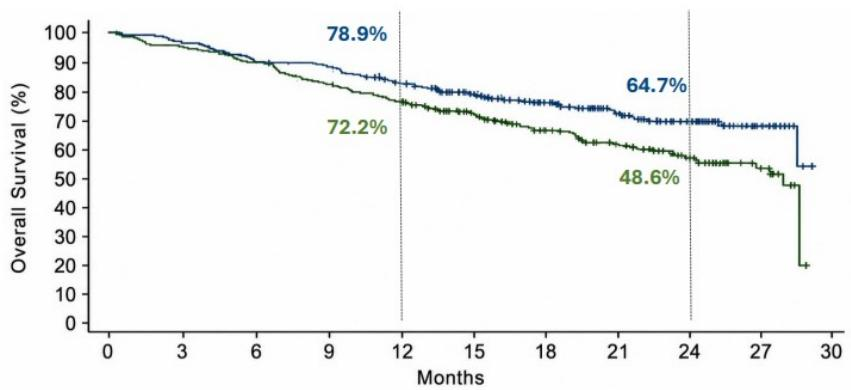
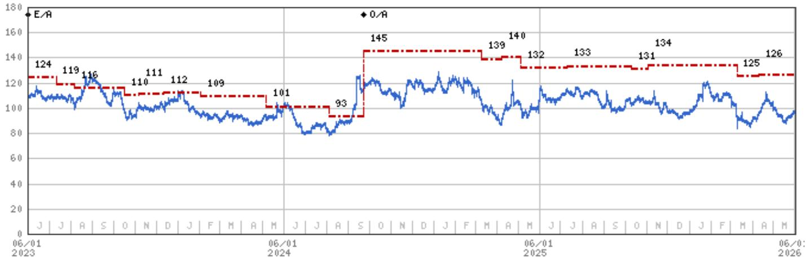
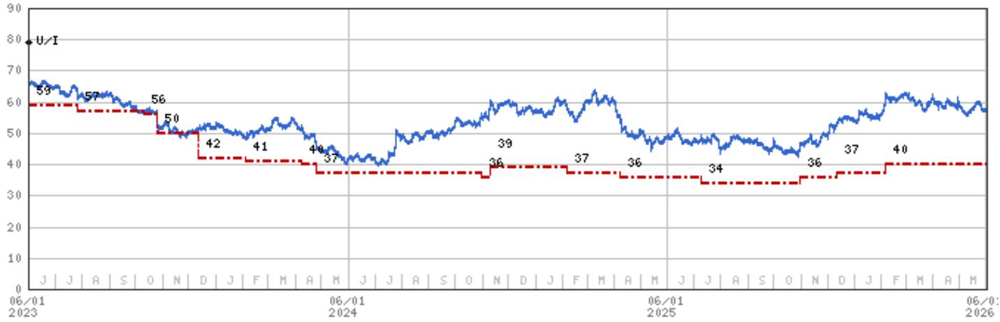
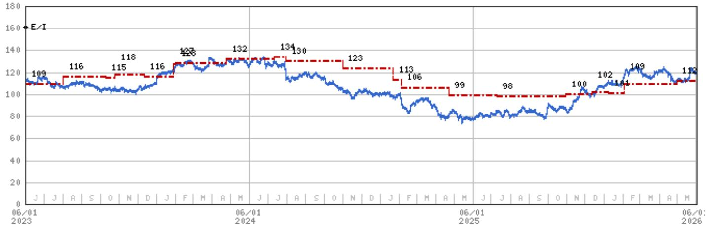
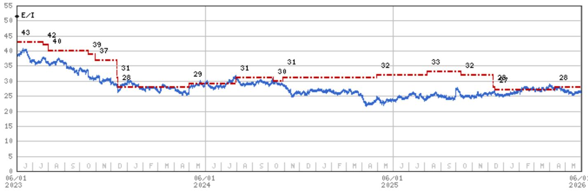

# Biopharma | North America

# Front-line lung cancer takeaways from ASCO

ASCO conference featured a number of presentations of Ph2/3 data emerging in front-line NSCLC, which is currently dominated by MRK's Keytruda+/-chemo. We were most focused on MRK/Kelun's Sac-TMT (TROP2 ADC) and Akeso/SMMT's Ivo (PD1xVEGF bispec). See below and within for our takeaways.

At ASCO (see preview HERE) we were focused on MRK/Kelun's sacituzumab tirumotecan (sac-TMT; ADC to TROP2), and the PD(L)1xVEGF bispecifics - Akeso/SMMT's ivonescimab, BMY/BNTX's pumitamig, and PFE's PF'4404. These two modalities have emerged as some of the leading strategies to attempt to improve upon or replace Keytruda (PD1 antibody, which goes off patent in 2028). MRK is uniquely positioned in that it has a drug in each category (including LM-299, a PD-1xVEGF bispecific antibody from LaNova).

MRK (EW): We view the Sac-TMT OpiTROP-Lung05 Ph3 data (PD-L1 positive patients) as an incremental positive update for the drug, but generally consistent with the data released in the abstract (see HERE), and we see Ph3 data later this year from the OpiTROP-Lung06 China trial (vs. Keytruda+chemo in NSQ PD-L1 negative population) as another key input into the drug's profile. We also await further details in terms of MRK's strategy to address PD-L1 low population. For MRK we model sac-TMT 2035 risk-adjusted sales of \$4.1bn (at a 55% POS) across tumor types vs. VA cons' of \$5.4bn. Additional lateral data on TROP2's in 1L NSCLC will come from AstraZeneca and GILD (see Exhibit 1 below).

PD(L)1xVEGF bispecifics: The data sets at ASCO from Akeso/SMMT, BNTX/BMY, and PFE demonstrate that PD(L)1xVEGF bispecifics can elicit meaningful response across all PD-L1 levels, including TPS<1%. In addition, we note there were two firsts from this drug class at the conference: (1) first demonstration of a stat sig survival benefit (SMMT/Akeso's HARMONi-6), and (2) the first global data in 1L NSCLC (BMY/BNTX's ROSETTA-Lung02 Ph2 trial). However, a number of questions are still outstanding in our view and we await more definitive survival data from global trials vs. Keytruda+chemo. We continue to see BNTX (OW) as the best way to gain exposure to this class in our coverage.

Importantly, the Ivo+chemo HARMONI-6 (squamous all comers) OS data represents the first validation of translatibility of PFS to OS for the class, but there are a number of caveats noted by the discussant and in the Lancet publication. The discussant stated that while the results were provocative, there are several outstanding questions, including the shorter follow-up, benefit by age, and whether these results can be reproduced in a global study (i.e., HARMONi-3) vs. Keytruda +chemo. Hence, in our opinion OS data from the ongoing Ivo+chemo HARMONi-3 (all comers) Ph3 trial in 2H26 are more important for the outlook of PD(L)-

MS & CO. LLC

Terence C Flynn, Ph.D.

Equity Analyst

Terence.Flynn@morganstanley.com +1 212 761-2230

Chris Yu, J.D., Ph.D.

Equity Analyst

Chris.L.Yu@morganstanley.com +1 212 761-2535

Hailey Horowitz

Research Associate

Hailey.Horowitz@morganstanley.com +1 212 761-5264

Alexander Yevdokimov, Ph.D.

Research Associate

Alexander.Yevdokimov@morganstanley.com +1 212 761-2167

Connor M Massari

Equity Analyst

Connor.Massari@morganstanley.com +1 212 761-2417

Damien H Kerner

Research Associate

Damien.H.Kerner@morganstanley.com +1 212 761-3829

MS INDIA COMPANY PRIVATE LIMITED+

Saket Agarwal

Research Associate

Saket.Agarwal@morganstanley.com +91 22 6995-4012

2026 EXTEL

ALL-AMERICA RESEARCH POLL

May 26 – June, 12 2026

VIEW OUR ANALYSTS >

MS does and seeks to do business with companies covered in MS. As a result, investors should be aware that the firm may have a conflict of interest that could affect the objectivity of MS. Investors should consider MS as only a single factor in making their investment decision.

For analyst certification and other important disclosures, refer to the Disclosure Section, located at the end of this report.

+= Analysts employed by non-U.S. affiliates are not registered with FINRA, may not be associated persons of the member and may not be subject to FINRA restrictions on communications with a subject company, public appearances and trading securities held by a research analyst account.

1xVEGF class given the global nature of the trial, coupled with a comparison to the Keytruda+chemo control arm. Recall this is also consistent with feedback from our Therapeutics Doctor Days earlier this year (see HERE). See HARMONI-6 takeaways from our China healthcare team HERE.

In our view the incremental Ph2 data at ASCO suggest that BMY (UW)/BNTX (OW) Pumi and PFE's (EW) PF'4404 are competitive with SMMT/Akeso's Ivo in NSCLC, and they achieve high ORR's across both squamous (SQ) and non-squamous (NSQ) histologies and all PD-L1 levels. See Exhibit 6, Exhibit 7, and Exhibit 8 for cross-trial efficacy comparison, with the typical caveats for such comparisons. For Pumi, we project 2035 risk-adjusted WW sales (before profit split) of \$5.6bn, with POS ranging from 50-70% across different tumors. For PF'4404, we project 2035 risk-adjusted WW sales of \$2.7bn (50% POS).

Exhibit 1: Overview of select 1L metastatic NSCLC trials   

other

Histology
| PD-L1 Status | PD-L1+50% (PD-L1-High) | ARTEMIDE-Lung02 (AZN) + nlivegostomig+chemo vs. Key+chemo PCD Feb. 29 | ARTEMIDE-Lung02 (AZN) + nlivegostomig+chemo vs. Key+chemo PCD Feb. 29 | ARTEMIDE-Lung02 (AZN) + nlivegostomig+chemo vs. Key+chemo PCD Feb. 29 | ARTEMIDE-Lung02 (AZN) + nlivegostomig+chemo vs. Key+chemo PCPD Feb. 29 | ARTEMIDE-Lung02 (AZN) + nlivegostomig+chemo vs. Key+chemo PCD Feb. 29 | ARTEMIDE-Lung02 (AZN) + nlivegostomig+chemo vs. Key+chemo PCD Feb. 29 | ARTEMIDE-Lung02 (AZN) + nlivegostomig+chemo vs. Kep+chemo PCD Feb. 29 | ARTEMIDE-Lung02 (AZN) + nlivegostomig+chemo vs. Key+chemo PCD Feb. 29 | ARTEMIDE-Lung02 (AZN) + nlivegostomig+chemo vs. Key+chemo PCD Feb. 29 | ARTEMIDE-Lung02 (AZN) + nlivegostomig-chemo vs. Key+chemo PCD Feb. 29 | ARTEMIDE-Lung02 (AZN) + nlivegostomig-chemo vs. Key+chemo PCD Feb. 29 | ARTEMIDE-Lung02 (AZN) + nlivegostomig-chemo vs. Key+chemo PCD Feb. 29 | ARTEMIDE-Lung02 (AZN) + nivegostomig-chemo vs. Key+chemo PCD Feb. 29 | ARTEMIDE-Lung02 (AZN) + nivegostomig-chemo vs. Key+chemo PCD Feb. 29 | ARTEMIDE-Lung02 (AZN) + nivegostomig-chemo vs. Key+chemo PCD Feb. 29 | ARTEMIDE-Lung02 ( AZN / Daichi) + Nivegostomig-chemo vs. Key+chemo PCD Feb. 29 | ARTEMIDE-Lung02 ( AZN / Daichi) + Nivegostomig-chemo vs. Key+chemo PCD Feb. 29 | ARTEMIDE-Lung02 ( AZN / Daichi) + Nivegostomig-chemo vs. Key+chemo PCD Feb. 29 | ARTEMIDE-Lung02 ( AZN) + nivegostomig-chemo vs. Key+chemo PCD Feb. 29 | ARTEMIDE-Lung02 ( AZN) + nivegostomig-chemo vs. Key+chemo PCD Feb. 29 | ARTEMIDE-Lung02 ( AZN) + nivegostomig-chemo vs. Key+chemo PCD Feb. 29 | ARTEMIDE-Lung02 ( AZN) + nivegostomig-chemo vs. Key+chemo PCD Feb.<fcel>KEYNOTE-467 (MRK) & Key+chemo vs. Chemo HARMONi-6 (SMMT/Akeso) & Ivo+chemo vs. Televimbra+chemo Positive PFS data 10/19/25 OS data at ASCO '26 KEYNOTE-467 (MRK) & Key+chemo vs. Chemo HARMONi-6 (SMMT/Akeso) & Ivo+chemo vs. Televimbra+chemo Positive PFS data 10/19/25 OS data at ASCO '26 CheckMate ISLA (BMY) & Opdive-Yenvoy+chemo vs. Chemo KEYNOTE-624 (MRK) & Key+commo HARMONi-7 (SMMT/Akeso) & Ivo+ key PCD of Apr. 28 TROPION-Lung08 (AZN/Daichi) + Data=Key vs. Key Data expected -2H26 KEYNOTE-642 (MRK) & Key+commo HARMONi-7 (SMMT/Akeso) + Ivo+ key PCD of Apr. 28 TROPION-Lung08 (AZN/Daichi) + Data=Key vs. Key Data expected -2H26 KEYNOTE-642 (MRK) & Key+commo HARMONi-7 (SMMT/Akeso) + Ivo+ key PCD of Apr. 28 TROPION-Lung08 (AZN/Daichi) + Data=Key v. Key Data expected -2H26 KEYNOTE-642 (MRK) & Key+commo HARMONi-7 (SMMT/Akeso) + Ivo+ key PCD of Apr. 28 TROPION-Lung08 (AZN/Daichi) + Data=Key v. Key Data expected -2H26 KEYNOTE-642 (MRK) & Key+commo HARMONi-7(SMMT/Akeso) & Ivo+ key PCD of Apr. 28 TROPION-Lung08 (AZN/Daichi) + Data=Key v. Key Data expected -2H26 KEYNOTE-642 (MRK) & Key+commo HARMONi-7(SMMT/Akeso) & Ivo+ key PCD of Apr. 28 TROPION-Lung08 (AZN/Daichi) + Data=Keyv. Key Data expected -2H26 KEYNOTE-642 (MRK) & Key+commo HARMONi-7(SMMT/Akeso) & Ivo+ key PCD of Apr. 28 TROPION-Lung08 (AZN/Daichi) + Data=Key v. Key Data expected -2H26 KEYNOTE-642 (MRK) & Key+commo HARMONi-7(SMMT/Akeso) & Ivo+ key PCD of Apr. 28 TROPION-Lung08 (AZN/Daichi) + Data=Key v. Key Data expected -2H26 KEYNOTE-642 (MRK) & Key+commo HARMONi-7(SMMT/Akeso) & Ivo+ key PCD of Apr. 28 TROPION-Lung08 (AZN/Dauchi) + Data=Key v. Key Data expected -2H26 KEYNOTE-642 (MRK) & Key+commo HARMONi-7(SMMT/Akeso) & Ivo+ key PCD of Apr. 28 TROPION-Lung08 (AZN/Daichi) + Data=Key v. Key Data expected -2H26 KEYNOTE-642 (MRK) & Key+commo: Interim data at ESMO 26 or later<nl>

Source: Company data, CT.gov, MS

How to vote: To request a ballot, please go to https://www.extelinsights.com/voting.

text_image

2026 EXTEL
ALL-AMERICA
RESEARCH POLL
May 26 – June 12, 2026
We appreciate your support
VOTE HERE
★★★★★

Akeso is covered by Jack Lin; AstraZeneca is covered by Sarita Kapila; BeOne is covered by Sean Laaman; Daiichi Sankyo is covered by Shinichiro Muraoka; Kelun is covered by Alexis Yan; SMMT is not covered.

# MRK/Kelun's Sac-TMT (TROP2 ADC)

# China-only Ph3 sac-TMT+Keytruda vs. Keytruda data in 1L PD-L1 positive NSCLC (OptiTROP-Lung05)

MRK's partner Kelun presented Ph3 China-only data from the OptiTROP-Lung05 trial of sac-TMT+Keytruda vs. Keytruda in 1L PD-L1-positive NSCLC; see our initial take on the abstract HERE. At median follow-up of 10.5mos, median PFS was not reached for sac-TMT vs. 5.7mos for Keytruda (p<0.0001). PFS data to date imply a mPFS for sac-TMT +Keytruda of \~15-17mos, which is generally in line with investor expectations of \~15-20mos; see Exhibit 2, and our prior estimate of \~16mos+ based on the HR. The PFS performance of the Keytruda control arm also appears in line with expectations (see Exhibit 10). The data for OS were not mature, and a favorable trend was observed in the sac-TMT+Key group (HR, 0.55; 95% CI, 0.36-0.85). The BICR-assessed ORR was 70.2% in the sac-TMT + Key group versus 42.0% in the Key group. In the pre-specified PD-L1 subgroups, the HRs for PFS in pts with TPS 1-49% and TPS ≥ 50% were 0.28 (95% CI, 0.19-0.41) and 0.47 (95% CI, 0.29-0.77). In the pre-specified histology subgroups, the HRs for PFS in pts with non-squamous and squamous were 0.28 (95% CI, 0.18-0.43) and 0.44 (95% CI, 0.29-0.66). The Lancet publication noted that the observed benefit of sac-TMT +Keytruda in patients with non-squamous NSCLC is consistent with findings from other studies of TROP2 ADCs, citing the global Ph3 TROPION-Lung01 trial of Datroway vs. chemo in 2L+ NSCLC.

Exhibit 2: Model predictions for PFS in sac-TMT+Key arm 

<table><tr><td colspan="6">Table S1. Parametric model predictions for progression-free survival in the sac-TMT plus pembrolizumab group</td></tr><tr><td rowspan="2">Parametric Model</td><td colspan="3">Predicted progression-free survival in the Sac-TMT + Pembrolizumab group, median (95% CI)</td><td rowspan="2">Difference*, month</td><td rowspan="2">AIC</td></tr><tr><td>Overall</td><td>PD-L1 TPS of 1 to 49%</td><td>PD-L1 TPS of 50% or greater</td></tr><tr><td>Lognormal</td><td>16.7 (12.8-22.1)</td><td>15.7 (11.2-21.8)</td><td>18.4 (11.6-29.9)</td><td>11.0</td><td>552.0</td></tr><tr><td>LogLogistic</td><td>15.7 (12.4-20.0)</td><td>14.8 (11.1-20.2)</td><td>17.3 (11.3-27.2)</td><td>10.0</td><td>555.2</td></tr><tr><td>Exponential</td><td>17.5 (13.8-22.4)</td><td>16.9 (12.3-22.8)</td><td>18.5 (12.7-26.5)</td><td>11.8</td><td>560.4</td></tr><tr><td>Gamma</td><td>15.0 (12.0-18.3)</td><td>14.2 (10.9-18.4)</td><td>16.4 (11.2-22.7)</td><td>9.3</td><td>556.0</td></tr><tr><td>Weibull</td><td>15.0 (12.2-18.4)</td><td>14.1 (10.9-18.1)</td><td>16.5 (11.4-23.8)</td><td>9.3</td><td>556.9</td></tr></table>

\* The difference in median progression-free survival between the sac-TMT plus pembrolizumab group and the pembrolizumab group was based on the predicted median value for the sac-TMT plus pembrolizumab group minus the observed median value for the pembrolizumab group in the intent-to-treat population. The observed median progression-free survival for the pembrolizumab group was 5.7 months (95% CI, 4.3–7.0). Smaller AIC indicating better fitting. Sac-TMT=sacituzumab tirumotecan; AIC=Akaike Information Criterion; PD-L1=programmed death ligand 1; TPS=tumor proportion score; CI=confidence interval.   
Source: Xiong et al, Lancet 2026

Per the publication, the safety profile of sac-TMT+Key was consistent with the known safety profiles of the individual agents, with no new safety signals identified. The increased toxicity with the combo was primarily driven by expected sac-TMT-related heme tox and stomatitis vs. Keytruda monotherapy. This heme tox was generally manageable with supportive care, dose modification, or temporary treatment interruption, while permanent discontinuation rates were low (TEAEs led to discontinuation of sac-TMT/Keytruda in 3.8%/5.3% of pts in the sac-TMT+Keytruda group while discontinuation of Keytruda occurred in 4.9% of pts in the Keytruda mono group). Per the authors, taken together with the observed delay in deterioration of global health status, these findings suggest that the clinical benefit of the combination was not offset by unacceptable toxicity. Gr3+ TEAEs were 55.3% in the sac-TMT+Keytruda group and 31.4% in the Keytruda group. Most common Gr3+ TEAEs of special interest for sac-TMT were neutrophil count decreased (17.3%), anemia (9.1%), and stomatitis (5.3%).

MRK has previously commented that sac-TMT is differentiated from other TROP2 ADCs by its novel bifunctional linker design, which aims to balance stability with payload release, with the goal of potentially mitigating the hematologic toxicity observed with GILD's Trodelvy's looser linker, while avoiding the interstitial lung disease (ILD) risk associated with tighter linker systems such as AZN/Daiichi's Datroway. See Exhibit 11.

In our view, the more definitive sac-TMT data will come from global Ph3 trials. MRK/Kelun are pursuing a broad registrational development program for sac-TMT across NSCLC, breast cancer, gynecologic cancers (incl. endometrial, cervical, and ovarian), as well as urothelial cancer and gastroesophageal adenocarcinoma; see Exhibit 12 for a summary. Recall, MRK recently announced positive interim PFS/OS results for the TroFuse-005 trial in 2L+ endometrial cancer; LINK. We view the breadth of the program as a differentiator for sac-TMT, as successful execution across multiple tumor types could drive a meaningfully larger TAM and peak sales opportunity relative to competitors.

For MRK we model sac-TMT 2035 risk-adjusted sales of \$4.1bn (at a 55% POS) vs. MRK VA cons' of \$5.4bn. We'd note that the FDA granted MRK a Commissioner's National Priority Voucher for sac-TMT, which could enable a faster review once filed in the US.

# SMMT/Akeso's Ivonescimab (PD-1xVEGF)

# China-only Ph3 Ivo+chemo vs. Tevimbra+chemo data in 1L SQ NSCLC (HARMONi-6)

Background: SMMT/Akeso presented full PFS and OS data from the HARMONi-6 trial of Ivonescimab (Ivo)+chemo vs. Tevimbra (BeOne's PD-1)+chemo in 1L SQ NSCLC. We'd note that PFS data from the trial had previously been reported at ESMO in October '25 (11.1mos for Ivo+chemo vs. 6.9mos for Tevimbra+chemo, HR=0.6 p<0.0001; LINK), and thus the focus here was on OS. However, the trial uses Tevimbra+chemo rather than Keytruda +chemo as a comparator and hence investors are likely to somewhat discount the results in our view. We'd also caveat that these data are from a China-only population and will need to be replicated on a global basis. SMMT/Akeso are running a Ph3 global study in 1L NSCLC (HARMONi-3) against Keytruda +chemo, and final PFS and interim OS are expected in 2H26. Recall the Independent Data Monitoring Committee recently conducted an interim PFS analysis and recommended the study continue as planned.

At a high level in HARMONi-6, Ivo + chemo achieved a stat sig and meaningful OS benefit, which is the first evidence that the PFS benefits previously seen with the PD(L)1xVEGF class might translate into an OS benefit. However, based on the discussant's comments, we believe there are still a number of outstanding questions, including the short follow-up and whether these results can be reproduced in a global study (HARMONi-3 study) against Keytruda + chemo.

Key takeaways from HARMONi-6 presentation. At data cutoff (Feb 27, 2026) for the interim overall survival analysis, the median duration of follow-up was 21.4 months. See Exhibit 7 for 1L SQ NSCLC cross-trial efficacy comparison, and Exhibit 9 for 1L SQ NSCLC cross-trial safety comparison, with the typical caveats of such comparisons.

- In the ITT population, Ivo + chemo resulted in an mOS of 27.9 months vs. 23.7 months for Tevi + chemo, with a HR of 0.66 (Exhibit 3). For reference, the historical mOS for Tevi + chemo in this indication was 22.8 months in Ph3 RATIONALE-307 (LINK). We note as for Keytruda + chemo, the mOS was 15.9 months (KN-407) and 30.1 months (KN-407 China).   
- The presenter noted that the mOS in the lvo arm would have not been reached without the last single event.   
- The overall survival benefit was consistent across all key subgroups

• PD-L1 TPS l<1%, the HR was 0.64   
- TPS ≥1%, the HR was 0.68   
- TPS 1-49%, the HR was 0.67   
- TPS ≥50%, the HR was 0.64

\- Earlier this year we spoke with a couple lung KOLs, and they had varying degrees of excitement about the PD(L)1xVEGF bispecific drug class. Specifically on HARMONi-3 (global), they want to see an HR for OS of 0.7 to 0.75, which in their view would be transformational (LINK).

\- Ivo + chemo showed a manageable safety profile, with 69% Gr≥3 TRAEs vs. 59% for the control arm. Discontinuation rate was 4% vs. 4% for the control arm (Exhibit 5). VEGF-related AEs occurred more frequently in the Ivo arm, most of which were Gr1-2. See hemorrhage rate in Exhibit 9.

The independent discussant stated that while the results were provocative, there are some outstanding questions. Specifically, she provided 3 high-level takeaways: (1) Ivo + chemo is effective in Chinese patients, based on the interim OS data. (2) Ivo resulted in VEGF-related AEs, and there is uncertainty regarding patient selection. (3) Applicability to global, generally older, SQ lung cancer population is unclear. Below we highlight the key questions she raised:

- The median follow-up was only 21 months, and it is possible that with longer follow-up, the mOS and HR results may change.   
- Noted the control arm mOS differences vs. Keytruda + chemo. See above.   
- Unclear if the HARMONi-6 population is representative of the global patient population

• Higher percentage of men in HARMONi-6 (96%) vs. 79% for KN-407. The HARMONi-6 presenter noted that it is due to men being the exclusive heavy smokers in China.   
• HARMONi-6 has a smaller % of PDL1 high patients compared to other 1L SQ NSCLC studies.   
• Notably, patients age 65 or older did not experience a survival benefit, where the OS HR was 0.93 for $\geq$ 65 vs. 0.43 for <65 yo (Exhibit 4). For reference, we note the OS HR dispersion for these age groups was smaller in KN-407 - 0.74 for $\geq$ 65 vs. 0.52 for <65 yo. She mentioned that the median age of the study was 64 (patients over 75 were excluded) vs. \~70 in the US, so the results limit applicability to the global population in her view.

# The results were also published in Lancet (HERE), which echoed some of the

discussant's comments: "The median overall survival was reached following the last single event, and the long-term survival tail should be interpreted with caution. Longer follow-up is therefore warranted to fully characterise the tail of the survival curve and further validate the durability of the long-term survival outcome. Second, the study enrolled relatively few female patients and excluded individuals aged over 75 years.

Accordingly, the efficacy results should be interpreted with caution when extrapolated to these populations. In addition, the study population was restricted to patients from China, but a global phase 3 trial (HARMONi-3) is currently ongoing."

Exhibit 3: OS curves from the ITT population of HARMONi-6   

line

| Months | Overall Survival (%) |
| ------ | -------------------- |
| 0      | 100                  |
| 3      | ~95                  |
| 6      | ~90                  |
| 9      | ~85                  |
| 12     | 78.9                 |
| 15     | ~80                  |
| 18     | ~75                  |
| 21     | ~70                  |
| 24     | 64.7                 |
| 27     | ~55                  |
| 30     | ~50                  |

<table><tr><td></td><td>Ivonescimab + chemo (N=266)</td><td>Tislelizumab + chemo (N=266)</td></tr><tr><td>mOS, months (95% CI)</td><td>27.89(27.89, NE)</td><td>23.69(20.11, NE)</td></tr><tr><td>Stratified HR (95% CI)</td><td colspan="2">0.66(0.50, 0.87)</td></tr><tr><td>p-value</td><td colspan="2">0.0017</td></tr></table>

OS significance boundary: 0.0049   
The median OS in the ivonescimab group would have not been reached without the last single event

Exhibit 4: HARMONi-6 OS subgroup analysis by age 

<table><tr><td rowspan="2">B</td><td colspan="2">Events/number of participants</td><td rowspan="2">HR (95% CI)</td></tr><tr><td>Ivonescimab plus chemotherapy</td><td>Tislelizumab plus chemotherapy</td></tr><tr><td>Overall</td><td>84/266</td><td>120/266</td><td>0.66 (0.50-0.87)</td></tr><tr><td>Age, years</td><td></td><td></td><td></td></tr><tr><td>&lt;65</td><td>31/135</td><td>63/139</td><td>0.43 (0.28-0.67)</td></tr><tr><td>≥65</td><td>53/131</td><td>57/127</td><td>0.93 (0.64-1.36)</td></tr></table>

Source: Lu et al. (Lancet 2026)

Exhibit 5: Safety profile of Ivo + chemo in HARMONi-6 

<table><tr><td></td><td>Ivonescimab + chemo (N=266)</td><td>Tislelizumab + chemo (N=265)</td></tr><tr><td>TRAE</td><td>264 (99.2)</td><td>263 (99.2)</td></tr><tr><td>Grade ≥ 3 TRAE</td><td>184 (69.2)</td><td>156 (58.9)</td></tr><tr><td>Serious TRAE</td><td>110 (41.4)</td><td>91 (34.3)</td></tr><tr><td>Leading to ivonescimab or tislelizumab discontinuation</td><td>14 (5.3)</td><td>12 (4.5)</td></tr><tr><td>Leading to death</td><td>10 (3.8)</td><td>11 (4.2)</td></tr><tr><td>Grade ≥ 3 irAE#</td><td>34 (14)</td><td>36 (14)</td></tr></table>

• Data are n (%)

\- # immune-related adverse events were assessed by investigators

Source: Company Data

# BMY/BNTX and PFE PD-(L)1 x VEGF bispecs

BMY/BNTX presented the first global data from the PD(L)1xVEGF class in 1L NSCLC from a Ph2 dosing-finding study of Pumi + chemo in 1L NSCLC irrespective of PD-L1 levels (Rosetta-LungO2). PFE also presented updated Ph2 dosing-finding data of PF'4404 (PD1xVEGF) in 1L PD-L1≥1% NSCLC (China only).

At a high level, we believe these data suggest that Pumi and PF'4404 are competitive with SMMT/Akeso's Ivo, and they achieve high ORRs across both squamous (SQ) and non-squamous (NSQ) histologies and all PD-L1 levels. See Exhibit 6, Exhibit 7, and Exhibit 8 for cross-trial efficacy comparison, with the typical caveats for such comparisons.

Takeaways from Pumi's global Ph2 dose-finding study in 1L NSCLC irrespective of PD-L1 levels (Rosetta-Lung02). The study evaluated Pumi 1400mg and 2000mg + chemo in 44 patients, in which 48% SQ and 52% NSQ. Across these patients, PD-L1 TPS<1% was 58%, TPS 1-49% was 25%, and TPS ≥50% was 17%. The safety profile appears manageable.

- ORR was higher for the 1400mg dose than the 2000mg dose across histologies. Based on the overall trial data, 1500mg Q3W flat dose is chosen for Ph3 portion of the trial, slightly above the 1400mg dose in the Ph2 study.   
- For the 1400mg dose, cORR of 73% for SQ and 64% for NSQ. 100% disease control.   
- Combined doses: cORR: 48% for TPS 1%; 78% for TPS 1 – 49%; 100% for TPS ≥ 50%.   
- Not surprising in our view, there were more Pumi-related TRAE for SQ (91%) vs. 64% for NSQ; higher discontinuation rate due to TRAE for SQ (24%) vs. 14% for NSQ; and higher bleeding for SQ (33%) vs. 9% for NSQ. For the SQ cohort, there was one patient death, who had multiple comorbidities and was oxygen dependent, cause of death unknown. See Exhibit 9 for 1L SQ NSCLC cross-trial safety comparison (with the typical caveats for such comparisons), and we note Pumi + chemo had numerically much higher discontinuation rate (24%) vs. 3% for Ivo + chemo.

For Pumi, we project 2035 risk-adjusted WW sales (before profit split) of \$5.6bn, with POS ranging from 50-70% across different tumors.

# Key takeaways from PF'4404's China-only updated Ph2 data in 1L PD-L1≥1% NSCLC.

The study evaluated four different doses: 5, 10, 20, and 30 mg/kg in 83 patients, in which 45% SQ and 55% NSQ. Across these patients, TPS 1-49% was 62% and TPS≥50% was 28%. The safety profile appears manageable. The efficacy and safety data shown below are for the 10mg dose (the presentation was primarily focused on this dose level).

- 10mg/kg (n=34) was chosen as the pivotal dose.   
• 68% cORR and 12.4 months mPFS.   
- High cORR and durable responses were observed irrespective of histology and TPS.   
• SQ: 64% cORR; 12.4 months mPFS

• NSQ: 75% cORR; 8.9 months mPFS   
• TPS 1-49%: 62% cORR; 9.6 months mPFS   
- TPS≥50%: 77% cORR; 15.8 months mPFS

\- Majority of the AEs were mild to moderate, with 15% Gr3+ VEGF-related AEs, and 6% Gr3+ immune-related AEs.

• 3% discontinuation rate due to TRAE.

For PF'4404, we project 2035 risk-adjusted WW sales of \$2.7bn (50% POS).

Exhibit 6: 1L PD-L1≥1% NSCLC cross-trial efficacy comparison 

<table><tr><td></td><td>n</td><td>ORR</td><td>DOR</td><td>PFS</td><td>PFS HR</td><td>OS</td><td>OS HR</td><td>Phase</td><td>Study</td><td>Source</td><td>Notes</td></tr><tr><td colspan="12">1L PD-L1 ≥1% NSCLC</td></tr><tr><td>Pumi</td><td>17</td><td>47%</td><td>NR</td><td>13.6</td><td></td><td>13.9</td><td></td><td>Ph1b/2a</td><td>NCT05918445</td><td>ASCO 2024</td><td>Stage IIIB-IV</td></tr><tr><td>Ivonescimab</td><td>198</td><td>50%</td><td>NR</td><td>11.1</td><td>0.51</td><td></td><td></td><td>Ph3</td><td>HARMONi-2</td><td>WCLC 2024</td><td>Stage IIIB-IV; China only</td></tr><tr><td>vs Keytruda</td><td>200</td><td>39%</td><td>NR</td><td>5.8</td><td></td><td></td><td></td><td></td><td></td><td></td><td></td></tr><tr><td>PF&#x27;4404/SSGJ-707</td><td>34</td><td>68%</td><td>18</td><td>12.4</td><td></td><td>NR</td><td></td><td>Ph2</td><td>NCT06361927</td><td>ASCO 2026</td><td>China only (10mg/kg dose, selected for pivotal)</td></tr><tr><td>MK-2010 (20mg)</td><td>11</td><td>55%</td><td></td><td></td><td></td><td></td><td></td><td></td><td>NCT06650566</td><td>AACR 2026</td><td>China only. For 30mg, 44% ORR</td></tr><tr><td>Sac-TMT + Keytruda</td><td>208</td><td>70%</td><td>NR (at least 16)</td><td>0.35</td><td>NR</td><td></td><td></td><td>Ph3</td><td>OptiTROP-Lung05</td><td>ASCO 2026</td><td>China only</td></tr><tr><td>vs Keytruda</td><td>205</td><td>42%</td><td>NR</td><td>5.7</td><td></td><td></td><td></td><td></td><td></td><td></td><td></td></tr><tr><td>Keytruda</td><td>637</td><td>27%</td><td></td><td>5.4</td><td></td><td>16.7</td><td></td><td>Ph3</td><td>KN-042</td><td>Keytruda label</td><td>Stage III</td></tr><tr><td>vs chemo</td><td>637</td><td>27%</td><td></td><td>6.5</td><td></td><td>12.1</td><td></td><td></td><td></td><td></td><td></td></tr><tr><td>Tecentriq</td><td>277</td><td>31%</td><td>26.3</td><td>5.8</td><td></td><td>18.9</td><td></td><td>Ph3</td><td>IMpower110</td><td>WCLC 2020 (Herbst et al)</td><td>Stage IV</td></tr><tr><td>vs chemo</td><td>277</td><td>32%</td><td>5.7</td><td>5.6</td><td></td><td>14.7</td><td></td><td></td><td></td><td></td><td></td></tr></table>

Source: Company Data, MS

Exhibit 7: 1L SQ NSCLC cross-trial efficacy comparison 

<table><tr><td>1L Squamous NSCLC</td><td>n</td><td>ORR</td><td>DOR</td><td>PFS</td><td>PFS HR</td><td>OS</td><td>OS HR</td><td>Phase</td><td>Study</td><td>Source</td><td>Notes</td></tr><tr><td>Ivonescimab + chemo</td><td>266</td><td>76%</td><td>11.2</td><td>11.1</td><td>0.6</td><td>27.9</td><td>0.66</td><td rowspan="2">Ph3</td><td rowspan="2">HARMONi-6</td><td rowspan="2">ESMO 2025ASCO 2026</td><td rowspan="2">China only</td></tr><tr><td>vs Tevimbra + chemo</td><td>266</td><td>67%</td><td>8.38</td><td>6.9</td><td></td><td>23.7</td><td></td></tr><tr><td>Pumi + chemo</td><td>11</td><td>73%</td><td></td><td></td><td></td><td></td><td></td><td>Ph2</td><td>ROSETTA Lung-02</td><td>ASCO 2026</td><td>1400mg dose (1500mg selected for Ph3)</td></tr><tr><td>PF&#x27;4404/SSGJ-707 (10mg) + c</td><td>24/13</td><td>75%/69%</td><td></td><td></td><td></td><td></td><td></td><td>Ph2</td><td>NCT06412471</td><td>SITC2025</td><td>China only</td></tr><tr><td>Keytruda + chemo</td><td>278</td><td>58%</td><td>7.2</td><td>6.4</td><td></td><td>15.9</td><td></td><td rowspan="2">Ph3</td><td rowspan="2">KN-407</td><td rowspan="2">Keytruda label</td><td rowspan="2"></td></tr><tr><td>vs chemo</td><td>281</td><td>35%</td><td>4.9</td><td>4.8</td><td></td><td>11.3</td><td></td></tr><tr><td>Keytruda + chemo</td><td>65</td><td>80%</td><td>7.1</td><td>8.3</td><td></td><td>30.1</td><td></td><td rowspan="2">Ph3</td><td rowspan="2">KN-407 China</td><td rowspan="2">Cheng 2021 (JTOClin Res Rep)</td><td rowspan="2"></td></tr><tr><td>vs chemo</td><td>60</td><td>43%</td><td>3.5</td><td>4.2</td><td></td><td>12.7</td><td></td></tr></table>

Source: Company Data, MS

Exhibit 8: 1L NSQ NSCLC cross-trial efficacy comparison 

<table><tr><td>1L Non-Squamous NSCLC</td><td>n</td><td>ORR</td><td>DOR</td><td>PFS</td><td>OS</td><td>Phase</td><td>Study</td><td>Source</td><td>Notes</td></tr><tr><td>Ivonescimab + chemo</td><td>72</td><td>54%</td><td>15.4</td><td>13.3</td><td>NR</td><td>Ph2</td><td>NCT04736823</td><td>ELCC 2024</td><td></td></tr><tr><td>Pumi + chemo</td><td>11</td><td>64%</td><td></td><td></td><td></td><td>Ph2</td><td>ROSETTA Lung-02</td><td>ASCO 2026</td><td>1400mg dose (1500mg selected for Ph3)</td></tr><tr><td>PF&#x27;4404/SSGI-707 (10mg) + c</td><td>29</td><td>59%</td><td></td><td></td><td></td><td>Ph2</td><td>NCT06412471</td><td>SITC2025</td><td>China only</td></tr><tr><td>Keytruda + chemo</td><td>410</td><td>48%</td><td>11.2</td><td>8.8</td><td>NR</td><td rowspan="2">Ph3</td><td rowspan="2">KN-189</td><td rowspan="2">KN-189</td><td rowspan="2"></td></tr><tr><td>vs chemo</td><td>206</td><td>19%</td><td>7.8</td><td>4.9</td><td>11.3</td></tr><tr><td>Tecentriq + chemo</td><td>453</td><td>46%</td><td>10.8</td><td>7.2</td><td>18.6</td><td rowspan="2">Ph3</td><td rowspan="2">IMpower130</td><td rowspan="2">IMpower130</td><td rowspan="2">Stage IV</td></tr><tr><td>vs chemo</td><td>228</td><td>32%</td><td>7.8</td><td>6.5</td><td>13.9</td></tr><tr><td>Avastin + chemo</td><td></td><td>35%</td><td></td><td>6.2</td><td>12.3</td><td rowspan="2">Ph3</td><td rowspan="2">E4599</td><td rowspan="2">Avastin label</td><td rowspan="2">Stage IIIB-IV</td></tr><tr><td>vs chemo</td><td></td><td>15%</td><td></td><td>4.5</td><td>10.3</td></tr><tr><td>Tecentriq + Avastin + chemo</td><td>359</td><td>55%</td><td>10.8</td><td>8.5</td><td>19.2</td><td rowspan="2">Ph3</td><td rowspan="2">IMpower150</td><td rowspan="2">IMpower150</td><td rowspan="2"></td></tr><tr><td>vs Avastin + chemo</td><td>337</td><td>42%</td><td>6.5</td><td>7.0</td><td>14.7</td></tr></table>

Source: Company Data, MS

Exhibit 9: 1L SQ NSCLC cross-trial safety comparison 

<table><tr><td>1L SQ NSCLC</td><td>Pumi + chemo</td><td>Ivo + chemo</td><td>Tevimbra+chemo</td></tr><tr><td>n</td><td>21</td><td>266</td><td>265</td></tr><tr><td>Any TRAE</td><td>100%</td><td>99%</td><td>99%</td></tr><tr><td>Gr≥3 TRAEs</td><td>62%</td><td>69%</td><td>59%</td></tr><tr><td>Gr5 TRAEs</td><td>5%</td><td>4%</td><td>4%</td></tr><tr><td>Discontinuation due to TRAE</td><td>24%</td><td>5%</td><td>5%</td></tr><tr><td>PD(L)1xVEGF drug related</td><td>14%</td><td>-</td><td>-</td></tr><tr><td>Immune-related AEs</td><td>38%</td><td>-</td><td>-</td></tr><tr><td>Gr≥3</td><td>5%</td><td>14%</td><td>14%</td></tr><tr><td>VEGF-related AEs</td><td>67%</td><td>60%</td><td>26%</td></tr><tr><td>Gr≥3</td><td>5%</td><td>12%</td><td>3%</td></tr><tr><td>Haemorrhage</td><td>33%</td><td>25%</td><td>12%</td></tr><tr><td>Gr≥3</td><td>5%</td><td>3%</td><td>1%</td></tr><tr><td>Source</td><td>Rosetta-Lung02 (ASCO 2026)</td><td>HARMONi-6 (ASCO 2026)</td><td>HARMONi-6 (ASCO 2026)</td></tr></table>

Source: Company Data, MS

# Additional Exhibits

Exhibit 10: Keytruda KEYNOTE 1L NSCLC data summary across PD-L1 expression levels 

<table><tr><td>Trial Population</td><td colspan="2">KEYNOTE-189(5-yr follow-up)1L NSQ NSCLC</td><td colspan="2">KEYNOTE-407(5-yr follow-up)1L SQ NSCLC</td><td colspan="2">KEYNOTE-042(5-yr follow-up)1L NSCLC</td><td colspan="2">KEYNOTE-024(5-yr follow-up)1L NSCLC</td></tr><tr><td>Arm</td><td>Keytruda+chemo</td><td>Chemo</td><td>Keytruda+chemo</td><td>Chemo</td><td>Keytruda</td><td>Chemo</td><td>Keytruda</td><td>Chemo</td></tr><tr><td>PD-L1 ≥50%</td><td></td><td></td><td></td><td></td><td></td><td></td><td></td><td></td></tr><tr><td>n</td><td>132</td><td>70</td><td>73</td><td>73</td><td>299</td><td>300</td><td>154</td><td>151</td></tr><tr><td>mPFS (mos)</td><td>11.3</td><td>4.8</td><td>8.3</td><td>4.2</td><td>6.5</td><td>6.5</td><td>7.7</td><td>5.5</td></tr><tr><td>12-mo PFS rate</td><td>49%</td><td>17%</td><td>37%</td><td>15%</td><td>~35%*</td><td>~30%*</td><td>~40%</td><td>~15%</td></tr><tr><td>mOS (mos)</td><td>27.7</td><td>10.1</td><td>19.9</td><td>11.5</td><td>20.0</td><td>12.2</td><td>26.3</td><td>13.4</td></tr><tr><td>PD-L1 1-49%</td><td></td><td></td><td></td><td></td><td></td><td></td><td></td><td></td></tr><tr><td>n</td><td>128</td><td>58</td><td>103</td><td>104</td><td>338</td><td>337</td><td></td><td></td></tr><tr><td>mPFS (mos)</td><td>9.4</td><td>4.9</td><td>8.2</td><td>6.0</td><td></td><td></td><td></td><td></td></tr><tr><td>12-mo PFS rate</td><td>44%</td><td>21%</td><td>40%</td><td>19%</td><td></td><td></td><td></td><td></td></tr><tr><td>mOS (mos)</td><td>21.8</td><td>12.1</td><td>18.0</td><td>13.1</td><td>13.4*</td><td>12.1*</td><td></td><td></td></tr><tr><td>PD-L1 ≥1%</td><td></td><td></td><td></td><td></td><td></td><td></td><td></td><td></td></tr><tr><td>n</td><td></td><td></td><td></td><td></td><td>637</td><td>637</td><td></td><td></td></tr><tr><td>mPFS (mos)</td><td></td><td></td><td></td><td></td><td>5.6</td><td>6.8</td><td></td><td></td></tr><tr><td>12-mo PFS rate</td><td></td><td></td><td></td><td></td><td>~30%*</td><td>~30%*</td><td></td><td></td></tr><tr><td>mOS (mos)</td><td></td><td></td><td></td><td></td><td>16.4</td><td>12.1</td><td></td><td></td></tr><tr><td>PD-L1 &lt;1%</td><td></td><td></td><td></td><td></td><td></td><td></td><td></td><td></td></tr><tr><td>n</td><td>127</td><td>63</td><td>95</td><td>99</td><td></td><td></td><td></td><td></td></tr><tr><td>mPFS (mos)</td><td>6.2</td><td>5.1</td><td>6.3</td><td>5.9</td><td></td><td></td><td></td><td></td></tr><tr><td>12-mo PFS rate</td><td>27%</td><td>16%</td><td>32%</td><td>21%</td><td></td><td></td><td></td><td></td></tr><tr><td>mOS (mos)</td><td>17.2</td><td>10.2</td><td>15.0</td><td>11.0</td><td></td><td></td><td></td><td></td></tr><tr><td>PD-L1 all-comers</td><td></td><td></td><td></td><td></td><td></td><td></td><td></td><td></td></tr><tr><td>n</td><td>410</td><td>206</td><td>278</td><td>281</td><td></td><td></td><td></td><td></td></tr><tr><td>mPFS (mos)</td><td>9.0</td><td>4.9</td><td>8.0</td><td>5.1</td><td></td><td></td><td></td><td></td></tr><tr><td>12-mo PFS rate</td><td>40%</td><td>18%</td><td>36%</td><td>19%</td><td></td><td></td><td></td><td></td></tr><tr><td>mOS (mos)</td><td>22.0</td><td>10.6</td><td>17.2</td><td>11.6</td><td></td><td></td><td></td><td></td></tr></table>

Source: MS, Garassino et al, JCO 2023 (KN-189), Novello et al, JCO 2023 (KN-407), Reck et al, JCO 2021 (KN-024), Castro et al, JCO 2022 (KN-042); \*From earlier cut (Mok et al, ELCC 2019)

Exhibit 11: TROP2 ADC safety cross-trial comparison 

<table><tr><td>Company</td><td>GILD</td><td>AZN/Daiichi</td><td>AZN/Daiichi</td></tr><tr><td>Drug</td><td>Trodelvy</td><td>Datroway</td><td>Datroway</td></tr><tr><td>Dose</td><td>10 mg/kg days 1&amp;8(21-day cycle)</td><td>6 mg/kg Q3W(21-day cycle)</td><td>6 mg/kg Q3W(21-day cycle)</td></tr><tr><td>Trial</td><td>Pooled</td><td>Pooled</td><td>Pooled</td></tr><tr><td>Population</td><td>BC/UC</td><td>BC</td><td>NSCLC</td></tr><tr><td>n</td><td>1,063</td><td>443</td><td>484</td></tr><tr><td>Discontinuation Due to AEs</td><td></td><td></td><td></td></tr><tr><td>Permanent DC due to AEs (%)</td><td>2-6%*</td><td>3%</td><td>8%</td></tr><tr><td>Diarrhea</td><td></td><td></td><td></td></tr><tr><td>Diarrhea - Any Grade (%)</td><td>64%</td><td>11%</td><td>12%</td></tr><tr><td>Diarrhea - Grade 3-4 (%)</td><td>11%</td><td>&lt;1%</td><td>0%</td></tr><tr><td>Cytopenias</td><td></td><td></td><td></td></tr><tr><td>Neutropenia - Any Grade (%)</td><td>64%</td><td></td><td></td></tr><tr><td>Neutropenia - Grade 3-4 (%)</td><td>49%</td><td></td><td></td></tr><tr><td>Febrile Neutropenia (%)</td><td>6%</td><td></td><td></td></tr><tr><td>Decreased hemoglobin - Any Grade (%)</td><td>69%</td><td>35%</td><td>34%</td></tr><tr><td>Decreased hemoglobin - Grade 3-4 (%)</td><td>6%-9%*</td><td>3%</td><td>5%</td></tr><tr><td>Interstitial Lung Disease</td><td></td><td></td><td></td></tr><tr><td>ILD - Any Grade (%)</td><td></td><td>4%</td><td>7%</td></tr><tr><td>ILD - Grade 3-4 (%)</td><td></td><td>&lt;1%</td><td>1%</td></tr><tr><td>ILD - Fatal (%)</td><td></td><td>&lt;1%</td><td>2%</td></tr><tr><td>DC due to ILD (%)</td><td></td><td>2%</td><td>4%</td></tr></table>

Trodelvy includes IMMU-132-01, ASCENT, TROPiCS-02, TROPHY   
Datroway BC includes TROPION-Breast01, TROPION-PanTumor01 for ILD; TROPION-Breast01 only for DCs/diarrhea/decreased hemoglobin   
Datroway NSCLC includes TROPION-Lung01, TROPION-Lung05, and TROPION-PanTumor01   
\*DC rates: IMMU-132-01: 2%; ASCENT: 5%; TROPiCS-02: 6%   
Gr3/4 hemoglobin decrease: IMMU-132-01: 6%; TROPiCS-02: 8%; ASCENT: 9%   
Source: Trodelvy and Datroway FDA labels

Exhibit 12: Sac-TMT global Ph3 program summary 

<table><tr><td></td><td>Trial</td><td>Comparator(s)</td><td>Population</td><td>Primary Endpoint</td><td>Primary completion</td></tr><tr><td rowspan="5">NSCLC</td><td>TroFuse-004</td><td>Sac-TMT vs. chemo</td><td>3L EGFRm NSCLC</td><td>PFS, OS</td><td>May &#x27;27</td></tr><tr><td>TroFuse-007</td><td>Sac-TMT+Key vs. Key</td><td>1L PD-L1 TPS ≥50% NSCLC</td><td>OS</td><td>January &#x27;28</td></tr><tr><td>TroFuse-009</td><td>Sac-TMT vs. chemo</td><td>2L non-squamous EGFRm NSCLC</td><td>PFS, OS</td><td>September &#x27;28</td></tr><tr><td>TroFuse-019</td><td>Sac-TMT+Key+chemo vs. Key+chemo</td><td>Adjuvant NSCLC (no pCR post surgery)</td><td>DFS</td><td>February &#x27;34</td></tr><tr><td>TroFuse-023</td><td>Sac-TMT+Key+chemo vs. Key+chemo</td><td>mNSCLC maintenance (post Keytruda+chemo)</td><td>OS</td><td>January &#x27;29</td></tr><tr><td rowspan="4">Breast</td><td>TroFuse-010</td><td>Sac-TMT+/-Key vs. TPC chemo</td><td>HR+/HER2- unresectable LA or mBC</td><td>PFS</td><td>July &#x27;27</td></tr><tr><td>TroFuse-011</td><td>Sac-TMT+/-Key vs. TPC chemo</td><td>LA/mTNBC PD-L1 at CPS &lt;10</td><td>PFS, OS</td><td>May &#x27;30</td></tr><tr><td>TroFuse-012</td><td>Sac-TMT+Key vs. TPC Key+/-chemo</td><td>TNBC did not achieve pCR at surgery</td><td>iDFS</td><td>December &#x27;30</td></tr><tr><td>TroFuse-032</td><td>Sac-TMT+Key+chemo+TPC vs. Key+chemo+TPC</td><td>Neoadjuvant TNBC or HR-low/HER2- BC</td><td>pCR, EFS</td><td>March &#x27;33</td></tr><tr><td rowspan="6">Gynecologic Cancers</td><td>TroFuse-005</td><td>Sac-TMT vs. chemo</td><td>Post platinum &amp; I/O endometrial cancer</td><td>PFS, OS</td><td>January &#x27;28 positive topline reported</td></tr><tr><td>TroFuse-033</td><td>Sac-TMT+Key+chemo vs. Key+chemo</td><td>pMMR endometrial cancer</td><td>PFS, OS</td><td>May &#x27;32</td></tr><tr><td>TroFuse-020</td><td>Sac-TMT vs.TPC Tivdak or chemo</td><td>2L metastatic cervical cancer</td><td>ORR, OS</td><td>June &#x27;28</td></tr><tr><td>TroFuse-036</td><td>Sac-TMT+Key+chemo+/-Avastin vs. Key+chemo+/-Avastin</td><td>1L maintenance cervical cancer</td><td>PFS/OS</td><td>October &#x27;31</td></tr><tr><td>TroFuse-021</td><td>Sac-TMT+Avastin vs. Avastin</td><td>Non-HRD positive advanced ovarian cancer</td><td>PFS</td><td>February &#x27;33</td></tr><tr><td>TroFuse-022</td><td>Sac-TMT+Avastin vs. Avastin</td><td>Platinum sensitive recurrent ovarian cancer</td><td>PFS</td><td>April &#x27;29</td></tr><tr><td rowspan="2">Other</td><td>TroFuse-031</td><td>Sac-TMT vs. chemo</td><td>LA/m 2-4L UC post Keytruda/Padcev/chemo</td><td>OS</td><td>July &#x27;29</td></tr><tr><td>TroFuse-015</td><td>Sac-TMT vs. TPC chemo</td><td>3L+ adv./met. gastroesophageal adenocarcinoma</td><td>OS</td><td>January &#x27;27</td></tr></table>

Source: CT.gov, MS

# Valuation Methodology and Risks

# Bristol Myers Squibb Co (BMY.N)

Our 12-month price target of \$40 is based on a \~7x P/E multiple applied to our 2Q27-1Q28 EPS estimate of \$5.66. This multiple is below BMY's 10-year average (14x) and the industry (15x) but supported by our outlook for growth in 2026+.

# Risks to Upside

■ Sales from recently launched products are higher than projected   
■ Pipeline assets deliver positive data   
■ Competitor drugs are unsuccessful clinically/commercially   
■ M&A/business development fill the revenue gap

# Risks to Downside

■ Sales from recently launched products are lower than projected   
■ Pipeline assets experience setbacks   
■ Competitor drugs are successful clinically and/or commercially

# BioNTech SE (BNTX.O)

We derive our PT from a DCF based on our forecasts of BioNTech&#39;s existing and future products through 2040E. We use a 10% discount rate and a 3.0% terminal growth rate.

# Risks to Upside

■ Covid-19 vaccines become mainstays and a significant portion of population gets annual booster   
■ Positive readouts from mRNA cancer vaccines   
■ BNT327 trials read out positively and take significant I/O market share

# Risks to Downside

■ Minimal Covid vaccine tail   
■ Failure of mRNA cancer vaccines readouts   
■ Failure of gotistobart (anti-CTLA-4 antibody)   
■ Failure of BNT327

# Merck & Co., Inc. (MRK.N)

Our 12-month price target of \$112 is based on a 11x P/E multiple applied to our 2Q27-1Q28 EPS estimate of \$10.16. This multiple is below MRK's 10-year average (\~13.7x) and the industry (15x) but supported by our outlook for growth.

# Risks to Upside

■ MRK develops Keytuda co-formulations and extends the tail of the franchise   
■ MRK's non-oncology pipeline is successful and contributes revenue towards the end of the decade   
■ ROI positive M&A

# Risks to Downside

■ MRK's Keytuda life cycle management strategy is unsuccessful   
■ MRK's non-oncology pipeline is unsuccessful and will not contribute revenue in the outer-years   
■ Lack of M&A or ROI negative M&A

# Pfizer Inc (PFE.N)

Our 12-month price target of \$28 uses a 10x P/E multiple applied to our 2Q27-1Q28 EPS of \$2.85. This is below the peer group average of \~14-15x, but in our view is appropriate given PFE's top-line growth is declining in 2026-2030 (-5% CAGR), as well as above average patent cliff exposure vs. the peer group.

# Risks to Upside

■ COVID-19 testing, vaccines and treatments become mainstays   
■ PFE/BNTX successfully develop a COVID-19+flu combination vaccine   
■ PFE's LOE exposed products decline slower than expected

# Risks to Downside

■ COVID-19 pandemic is behind us   
■ PFE/BNTX's combo COVID+flu vaccine does not succeed in clinical trials   
■ PFE's existing franchises face commercial challenges and/or pipeline setbacks

# Disclosure Section

The information and opinions in MS were prepared by MS & Co. LLC, and/or MS C.T.V.M. S.A., and/or MS Mexico, Casa de Bolsa, S.A. de C.V., and/or MS Canada Limited. As used in this disclosure section, "MS" includes MS & Co. LLC, MS C.T.V.M. S.A., MS Mexico, Casa de Bolsa, S.A. de C.V., MS Canada Limited and their affiliates as necessary.

For important disclosures, stock price charts and equity rating histories regarding companies that are the subject of this report, please see the MS Disclosure Website at www.morganstanley.com/eqr/disclosures/webapp/generalresearch, or contact your investment representative or MS at 1585 Broadway, (Attention: Research Management), New York, NY, 10036 USA.

For valuation methodology and risks associated with any recommendation, rating or price target referenced in this research report, please contact the Client Support Team as follows: US/Canada +1 800 303-2495; Hong Kong +852 2848-5999; Latin America +1 718 754-5444 (U.S.); London +44 (0)20-7425-8169; Singapore +65 6834-6860; Sydney +61 (0)2-9770-1505; Tokyo +81 (0)3-6836-9000. Alternatively you may contact your investment representative or MS at 1585 Broadway, (Attention: Research Management), New York, NY 10036 USA.

# Analyst Certification

The following analysts hereby certify that their views about the companies and their securities discussed in this report are accurately expressed and that they have not received and will not receive direct or indirect compensation in exchange for expressing specific recommendations or views in this report: Terence C Flynn, Ph.D.; Connor M Massari; Chris Yu, J.D., Ph.D..

# Global Research Conflict Management Policy

MS has been published in accordance with our conflict management policy, which is available at www.morganstanley.com/institutional/research/conflictpolicies. A Portuguese version of the policy can be found at www.morganstanley.com.br

# Important Regulatory Disclosures on Subject Companies

As of April 30, 2026, MS beneficially owned 1% or more of a class of common equity securities of the following companies covered in MS: Bristol Myers Squibb Co, Merck & Co., Inc., Pfizer Inc.

Within the last 12 months, MS managed or co-managed a public offering (or 144A offering) of securities of Bristol Myers Squibb Co, Merck & Co., Inc..

Within the last 12 months, MS has received compensation for investment banking services from Bristol Myers Squibb Co, Merck & Co., Inc., Pfizer Inc.

In the next 3 months, MS expects to receive or intends to seek compensation for investment banking services from BioNTech SE, Bristol Myers Squibb Co, Merck & Co., Inc., Pfizer Inc.

Within the last 12 months, MS has received compensation for products and services other than investment banking services from Bristol Myers Squibb Co, Merck & Co., Inc., Pfizer Inc.

Within the last 12 months, MS has provided or is providing investment banking services to, or has an investment banking client relationship with, the following company: BioNTech SE, Bristol Myers Squibb Co, Merck & Co., Inc., Pfizer Inc.

Within the last 12 months, MS has either provided or is providing non-investment banking, securities-related services to and/or in the past has entered into an agreement to provide services or has a client relationship with the following company: BioNTech SE, Bristol Myers Squibb Co, Merck & Co., Inc., Pfizer Inc.

An employee, director or consultant of MS is a director of Merck & Co., Inc.. This person is not a research analyst or a member of a research analyst's household.

The equity research analysts or strategists principally responsible for the preparation of MS have received compensation based upon various factors, including quality of research, investor client feedback, stock picking, competitive factors, firm revenues and overall investment banking revenues. Equity Research analysts' or strategists' compensation is not linked to investment banking or capital markets transactions performed by MS or the profitability or revenues of particular trading desks.

MS and its affiliates do business that relates to companies/instruments covered in MS, including market making, providing liquidity, fund management, commercial banking, extension of credit, investment services and investment banking. MS sells to and buys from customers the securities/instruments of companies covered in MS on a principal basis. MS may have a position in the debt of the Company or instruments discussed in this report. MS trades or may trade as principal in the debt securities (or in related derivatives) that are the subject of the debt research report.

Certain disclosures listed above are also for compliance with applicable regulations in non-US jurisdictions.

# STOCK RATINGS

MS uses a relative rating system using terms such as Overweight, Equal-weight, Not-Rated or Underweight (see definitions below). MS does not assign ratings of Buy, Hold or Sell to the stocks we cover. Overweight, Equal-weight, Not-Rated and Underweight are not the equivalent of buy, hold and sell. Investors should carefully read the definitions of all ratings used in MS. In addition, since MS contains more complete information concerning the analyst's views, investors should carefully read MS, in its entirety, and not infer the contents from the rating alone. In any case, ratings (or research) should not be used or relied upon as investment advice. An investor's decision to buy or sell a stock should depend on individual circumstances (such as the investor's existing holdings) and other considerations.

# Global Stock Ratings Distribution

(as of May 31, 2026)

The Stock Ratings described below apply to MS's Fundamental Equity Research and do not apply to Debt Research produced by the Firm.

For disclosure purposes only (in accordance with FINRA requirements), we include the category headings of Buy, Hold, and Sell alongside our ratings of Overweight, Equal-weight, Not-Rated and Underweight. MS does not assign ratings of Buy, Hold or Sell to the stocks we cover. Overweight, Equal-weight, Not-Rated and Underweight are not the equivalent of buy, hold, and sell but represent recommended relative weightings (see definitions below). To satisfy regulatory requirements, we correspond Overweight, our most positive stock rating, with a buy recommendation; we correspond Equal-weight and Not-Rated to hold and Underweight to sell recommendations, respectively.

<table><tr><td></td><td colspan="2">Coverage Universe</td><td colspan="3">Investment Banking Clients (IBC)</td><td colspan="2">Other Material Investment ServicesClients (MISC)</td></tr><tr><td>Stock RatingCategory</td><td>Count</td><td>% of Total</td><td>Count</td><td>% of Total IBC</td><td>% of RatingCategory</td><td>Count</td><td>% of Total OtherMISC</td></tr><tr><td>Overweight/Buy</td><td>1542</td><td>42%</td><td>465</td><td>51%</td><td>30%</td><td>707</td><td>43%</td></tr><tr><td>Equal-weight/Hold</td><td>1571</td><td>43%</td><td>369</td><td>40%</td><td>23%</td><td>723</td><td>44%</td></tr><tr><td>Not-Rated/Hold</td><td>3</td><td>0%</td><td>0</td><td>0%</td><td>0%</td><td>1</td><td>0%</td></tr><tr><td>Underweight/Sell</td><td>551</td><td>15%</td><td>86</td><td>9%</td><td>16%</td><td>201</td><td>12%</td></tr><tr><td>Total</td><td>3,667</td><td></td><td>920</td><td></td><td></td><td>1632</td><td></td></tr></table>

Data include common stock and ADRs currently assigned ratings. Investment Banking Clients are companies from whom MS received investment banking compensation in the last 12 months. Due to rounding off of decimals, the percentages provided in the "% of total" column may not add up to exactly 100 percent.

# Analyst Stock Ratings

Overweight (O). The stock's total return is expected to exceed the average total return of the analyst's industry (or industry team's) coverage universe, on a risk-adjusted basis, over the next 12-18 months.

Equal-weight (E). The stock's total return is expected to be in line with the average total return of the analyst's industry (or industry team's) coverage universe, on a risk-adjusted basis, over the next 12-18 months.

Not-Rated (NR). Currently the analyst does not have adequate conviction about the stock's total return relative to the average total return of the analyst's industry (or industry team's) coverage universe, on a risk-adjusted basis, over the next 12-18 months.

Underweight (U). The stock's total return is expected to be below the average total return of the analyst's industry (or industry team's) coverage universe, on a risk-adjusted basis, over the next 12-18 months.

Unless otherwise specified, the time frame for price targets included in MS is 12 to 18 months.

# Analyst Industry Views

Attractive (A): The analyst expects the performance of his or her industry coverage universe over the next 12-18 months to be attractive vs. the relevant broad market benchmark, as indicated below.

In-Line (I): The analyst expects the performance of his or her industry coverage universe over the next 12-18 months to be in line with the relevant broad market benchmark, as indicated below. Cautious (C): The analyst views the performance of his or her industry coverage universe over the next 12-18 months with caution vs. the relevant broad market benchmark, as indicated below. Benchmarks for each region are as follows: North America - S&P 500; Latin America - relevant MSCI country index or MSCI Latin America Index; Europe - MSCI Europe; Japan - TOPIX; Asia - relevant MSCI country index or MSCI sub-regional index or MSCI AC Asia Pacific ex Japan Index.

Stock Price, Price Target and Rating History (See Rating Definitions)

BioNTech SE (BNTX.0) - As of 06/01/26 GMT in USD   
Industry : Biotechnology   

line

| Date       | Value |
| ---------- | ----- |
| 06/01 2023 | 124   |
|            | 119   |
|            | 116   |
|            | 110   |
|            | 111   |
|            | 112   |
|            | 109   |
|            | 101   |
|            | 93    |
|            | 145   |
|            | 139   |
|            | 140   |
|            | 132   |
|            | 133   |
|            | 134   |
|            | 125   |
|            | 126   |

Stock Rating History: 12/16/21 : E/I; 11/5/22 : E/A; 9/23/24 : O/A   
Price Target History: 12/16/21 : 294; 1/18/22 : 284; 1/31/22 : 217; 4/12/22 : 197; 5/9/22 : 195; 7/14/22 : 194; 11/7/22 : 203;
1/23/23 : 216; 3/27/23 : 150; 5/9/23 : 124; 7/11/23 : 119; 8/7/23 : 116; 10/17/23 : 110; 11/7/23 : 111; 12/12/23 : 112; 2/2/24 : 109;
5/6/24 : 101; 8/5/24 : 93; 9/23/24 : 145; 3/10/25 : 139; 4/6/25 : 140; 5/5/25 : 132; 7/10/25 : 133; 10/10/25 : 131; 11/3/25 : 134;
3/10/26 : 125; 4/10/26 : 126   
Source: MS Date Format : MM/DD/YY Price Target = No Price Target Assigned (NA)   
Stock Price (Not Covered by Current Analyst) — Stock Price (Covered by Current Analyst)   
Stock and Industry Ratings (abbreviations below) appear as ♦ Stock Rating/Industry View   
Stock Ratings: Overweight (O) Equal-weight (E) Underweight (U) Not-Rated (NR) No Rating Available (NA)   
Industry View: Attractive (A) In-line (I) Cautious (C) No Rating (NR)   
Effective January 13, 2014, the stocks covered by MS Asia Pacific will be rated relative to the analyst's industry (or industry team's) coverage.   
Effective January 13, 2014, the industry view benchmarks for MS Asia Pacific are as follows: relevant MSCI country index or MSCI sub-regional index or MSCI AC Asia Pacific ex Japan Index.

Bristol Myers Squibb Co (BMY.N) - As of 06/01/26 GMT in USD   
Industry : Major Pharmaceuticals   

line

| Date       | Value |
| ---------- | ----- |
| 06/01 2023 | 59    |
|            | 57    |
|            | 56    |
|            | 50    |
|            | 42    |
|            | 41    |
|            | 40    |
|            | 37    |
|            | 36    |
|            | 39    |
|            | 37    |
|            | 36    |
|            | 34    |
|            | 36    |
|            | 37    |
|            | 40    |

Stock Rating History: 6/1/21 : E/A; 4/6/22 : U/I   
Price Target History: 4/30/21 : 62; 7/28/21 : 71; 10/12/21 : 66; 4/6/22 : 64; 5/2/22 : 63; 7/27/22 : 61; 10/26/22 : 60; 2/2/23 : 62;   
4/27/23 : 59; 7/27/23 : 57; 10/10/23 : 56; 10/26/23 : 50; 12/12/23 : 42; 2/4/24 : 41; 4/9/24 : 40; 4/25/24 : 37; 10/31/24 : 36;   
11/11/24 : 39; 2/6/25 : 37; 4/8/25 : 36; 7/10/25 : 34; 10/30/25 : 36; 12/12/25 : 37; 2/5/26 : 40   
Source: MS Date Format : MM/DD/YY Price Target = No Price Target Assigned (NA)   
Stock Price (Not Covered by Current Analyst) — Stock Price (Covered by Current Analyst)   
Stock and Industry Ratings (abbreviations below) appear as ♦ Stock Rating/Industry View   
Stock Ratings: Overweight (O) Equal-weight (E) Underweight (U) Not-Rated (NR) No Rating Available (NA)   
Industry View: Attractive (A) In-line (I) Cautious (C) No Rating (NR)   
Effective January 13, 2014, the stocks covered by MS Asia Pacific will be rated relative to the analyst's industry (or industry team's) coverage.   
Effective January 13, 2014, the industry view benchmarks for MS Asia Pacific are as follows: relevant MSCI country index or MSCI sub-regional index or MSCI AC Asia Pacific ex Japan Index.

Merck & Co., Inc. (MRK.N) - As of 06/01/26 GMT in USD
Industry : Major Pharmaceuticals   

line

| Date       | Value |
| ---------- | ----- |
| 06/01 2023 | 109   |
|            | 116   |
|            | 115   |
|            | 118   |
|            | 116   |
|            | 123   |
|            | 132   |
|            | 134   |
|            | 130   |
|            | 123   |
|            | 113   |
|            | 106   |
|            | 99    |
|            | 98    |
|            | 100   |
|            | 102   |
|            | 104   |
|            | 109   |
|            | 112   |
|            | 112   |

Stock Rating History: 6/1/21 : 0/A; 9/7/21 : E/A; 4/6/22 : E/I   
Price Target History: 12/21/20 : 90; 9/7/21 : 85; 10/12/21 : 88; 10/29/21 : 90; 11/8/21 : 88; 11/29/21 : 82; 4/6/22 : 80;   
4/28/22 : 87; 7/6/22 : 88; 7/28/22 : 92; 10/12/22 : 91; 10/27/22 : 100; 2/2/23 : 99; 4/27/23 : 109; 8/1/23 : 116; 10/10/23 : 115;   
10/26/23 : 118; 12/12/23 : 116; 1/29/24 : 127; 2/1/24 : 128; 4/25/24 : 132; 7/11/24 : 134; 7/30/24 : 130; 10/31/24 : 123;   
1/21/25 : 113; 2/4/25 : 106; 4/24/25 : 99; 7/10/25 : 98; 10/31/25 : 100; 12/12/25 : 102; 1/8/26 : 101; 2/3/26 : 109; 4/30/26 : 112   
Source: MS Date Format : MM/DD/YY Price Target = No Price Target Assigned (NA)   
Stock Price (Not Covered by Current Analyst) — Stock Price (Covered by Current Analyst)   
Stock and Industry Ratings (abbreviations below) appear as ♦ Stock Rating/Industry View   
Stock Ratings: Overweight (O) Equal-weight (E) Underweight (U) Not-Rated (NR) No Rating Available (NA)   
Industry View: Attractive (A) In-line (I) Cautious (C) No Rating (NR)   
Effective January 13, 2014, the stocks covered by MS Asia Pacific will be rated relative to the analyst's industry (or industry team's) coverage.   
Effective January 13, 2014, the industry view benchmarks for MS Asia Pacific are as follows: relevant MSCI country index or MSCI sub-regional index or MSCI AC Asia Pacific ex Japan Index.

Pfizer Inc (PFE.N) - As of 06/01/26 GMT in USD
Industry : Major Pharmaceuticals   

line

| Date       | Value |
| ---------- | ----- |
| 06/01 2023 | 43    |
|            | 42    |
|            | 40    |
|            | 39    |
|            | 37    |
|            | 31    |
|            | 28    |
|            | 29    |
|            | 31    |
|            | 30    |
|            | 31    |
|            | 32    |
|            | 33    |
|            | 32    |
|            | 28    |
|            | 28    |

Stock Rating History: 6/1/21 : E/A; 4/6/22 : E/I   
Price Target History: 5/9/21 : 42; 7/28/21 : 45; 10/12/21 : 48; 11/6/21 : 50; 11/29/21 : 60; 2/9/22 : 55; 5/3/22 : 52; 7/8/22 : 49;   
10/12/22 : 50; 11/1/22 : 51; 12/13/22 : 53; 2/1/23 : 45; 4/10/23 : 44; 5/2/23 : 43; 7/21/23 : 42; 8/1/23 : 40; 10/17/23 : 39;   
10/31/23 : 37; 12/12/23 : 31; 12/14/23 : 28; 5/1/24 : 29; 7/30/24 : 31; 10/11/24 : 30; 10/29/24 : 31; 4/29/25 : 32; 8/5/25 : 33;   
10/10/25 : 32; 12/12/25 : 28; 12/16/25 : 27; 4/10/26 : 28   
Source: MS Date Format : MM/DD/YY Price Target No Price Target Assigned (NA)   
Stock Price (Not Covered by Current Analyst) — Stock Price (Covered by Current Analyst)   
Stock and Industry Ratings (abbreviations below) appear as ♦ Stock Rating/Industry View   
Stock Ratings: Overweight (O) Equal-weight (E) Underweight (U) Not-Rated (NR) No Rating Available (NA)   
Industry View: Attractive (A) In-line (I) Cautious (C) No Rating (NR)   
Effective January 13, 2014, the stocks covered by MS Asia Pacific will be rated relative to the analyst's industry (or industry team's) coverage.   
Effective January 13, 2014, the industry view benchmarks for MS Asia Pacific are as follows: relevant MSCI country index or MSCI sub-regional index or MSCI AC Asia Pacific ex Japan Index.

# Important Disclosures for MS Smith Barney LLC Customers

Important disclosures regarding any material conflict of interest that can reasonably be expected to have influenced MS Smith Barney LLC's choice of a third-party research provider or the subject company of a third-party research report, are available on the MS Wealth Management disclosure website at www.morganstanley.com/online/researchdisclosures. For MS specific disclosures, you may refer to https://www.morganstanley.com/eqr/disclosures/webapp/generalresearch.

Each MS report is reviewed and approved on behalf of MS Smith Barney LLC. This review and approval is conducted by the same person who reviews the research report on behalf of MS. This could create a conflict of interest.

# Other Important Disclosures

MS policy is to update research reports as and when the Research Analyst and Research Management deem appropriate, based on developments with the issuer, the sector, or the market that may have a material impact on the research views or opinions stated therein. In addition, certain Research publications are intended to be updated on a regular periodic basis (weekly/monthly/quarterly/annual) and will ordinarily be updated with that frequency, unless the Research Analyst and Research Management determine that a different publication schedule is appropriate based on current conditions.

MS is not acting as a municipal advisor and the opinions or views contained herein are not intended to be, and do not constitute, advice within the meaning of Section 975 of the Dodd-Frank Wall Street Reform and Consumer Protection Act.

MS produces an equity research product called a "Tactical Idea." Views contained in a "Tactical Idea" on a particular stock may be contrary to the recommendations or views expressed in research on the same stock. This may be the result of differing time horizons, methodologies, market events, or other factors. For all research available on a particular stock, please contact your sales representative or go to Matrix at http://www.morganstanley.com/matrix.

MS is provided to our clients through our proprietary research portal on Matrix and also distributed electronically by MS to clients. Certain, but not all, MS products are also made available to clients through third-party vendors or redistributed to clients through alternate electronic means as a convenience. For access to all available MS, please contact your sales representative or go to Matrix at http://www.morganstanley.com/matrix.

Any access and/or use of MS is subject to MS's Terms of Use (http://www.morganstanley.com/terms.html). By accessing and/or using MS, you are indicating that you have read and agree to be bound by our Terms of Use (http://www.morganstanley.com/terms.html). In addition you consent to MS processing your personal data and using cookies in accordance with our Privacy Policy and our Global Cookies Policy (http://www.morganstanley.com/privacy\_pledge.html), including for the purposes of setting your preferences and to collect readership data so that we can deliver better and more personalized service and products to you. To find out more information about how MS processes personal data, how we use cookies and how to reject cookies see our Privacy Policy and our Global Cookies Policy (http://www.morganstanley.com/privacy\_pledge.html). Please use the provided link to review the Terms and Conditions and Most Important Terms and Conditions for MS India Company Private Limited (https://www.morganstanley.com/assets/pdfs/about-us-global-offices/india/Terms\_and\_conditions.pdf) and the following link to review the audit report (https://ny.matrix.ms.com/eqr/research/webapp/researchdocs/MSICPL\_Morgan\_Stanley\_Research\_Audit\_Report.pdf).

If you do not agree to our Terms of Use and/or if you do not wish to provide your consent to MS processing your personal data or using cookies please do not access our research. MS does not provide individually tailored investment advice. MS has been prepared without regard to the circumstances and objectives of those who receive it. MS recommends that investors independently evaluate particular investments and strategies, and encourages investors to seek the advice of a financial adviser. The appropriateness of an investment or strategy will depend on an investor's circumstances and objectives. The securities, instruments, or strategies discussed in MS may not be suitable for all investors, and certain investors may not be eligible to purchase or participate in some or all of them. MS is not an offer to buy or sell or the solicitation of an offer to buy or sell any security/instrument or to participate in any particular trading strategy. The value of and income from your investments may vary because of changes in interest rates, foreign exchange rates, default rates, prepayment rates, securities/instruments prices, market indexes, operational or financial conditions of companies or other factors. There may be time limitations on the exercise of options or other rights in securities/instruments transactions. Past performance is not necessarily a guide to future performance. Estimates of future performance are based on assumptions that may not be realized. If provided, and unless otherwise stated, the closing price on the cover page is that of the primary exchange for the subject company's securities/instruments.

The fixed income research analysts, strategists or economists principally responsible for the preparation of MS have received compensation based upon various factors, including quality, accuracy and value of research, firm profitability or revenues (which include fixed income trading and capital markets profitability or revenues), client feedback and competitive factors. Fixed Income Research analysts', strategists' or economists' compensation is not linked to investment banking or capital markets transactions performed by MS or the profitability or revenues of particular trading desks.

The "Important Regulatory Disclosures on Subject Companies" section in MS lists all companies mentioned where MS owns 1% or more of a class of common equity securities of the companies. For all other companies mentioned in MS, MS may have an investment of less than 1% in securities/instruments or derivatives of securities/instruments of companies and may trade them in ways different from those discussed in MS. Employees of MS not involved in the preparation of MS may have investments in securities/instruments or derivatives of securities/instruments of companies mentioned and may trade them in ways different from those discussed in MS. Derivatives may be issued by MS or associated persons.

With the exception of information regarding MS, MS is based on public information. MS makes every effort to use reliable, comprehensive information, but we make no representation that it is accurate or complete. We have no obligation to tell you when opinions or information in MS change apart from when we intend to discontinue equity research coverage of a subject company. Facts and views presented in MS have not been reviewed by, and may not reflect information known to, professionals in other MS business areas, including investment banking personnel.

MS personnel may participate in company events such as site visits and are generally prohibited from accepting payment by the company of associated expenses unless pre-approved by authorized members of Research management.

MS may make investment decisions that are inconsistent with the recommendations or views in this report.

To our readers based in Taiwan or trading in Taiwan securities/instruments: Information on securities/instruments that trade in Taiwan is distributed by MS Taiwan Limited ("MSTL"). Such information is for your reference only. The reader should independently evaluate the investment risks and is solely responsible for their investment decisions. MS may not be distributed to the public media or quoted or used by the public media without the express written consent of MS. Any non-customer reader within the scope of Article 7-1 of the Taiwan Stock Exchange Recommendation Regulations accessing and/or receiving MS is not permitted to provide MS to any third party (including but not limited to related parties, affiliated companies and any other third parties) or engage in any activities regarding MS which may create or give the appearance of creating a conflict of interest. Information on securities/instruments that do not trade in Taiwan is for informational purposes only and is not to be construed as a recommendation or a solicitation to trade in such securities/instruments. MSTL may not execute transactions for clients in these securities/instruments.

MS is not incorporated under PRC law and the research in relation to this report is conducted outside the PRC. MS does not constitute an offer to sell or the solicitation of an offer to buy any securities in the PRC. PRC investors shall have the relevant qualifications to invest in such securities and shall be responsible for obtaining all relevant approvals, licenses, verifications and/or registrations from the relevant governmental authorities themselves. Neither this report nor any part of it is intended as, or shall constitute, provision of any consultancy or advisory service of securities investment as defined under PRC law. Such information is provided for your reference only.

MS is disseminated in Brazil by MS C.T.V.M. S.A. located at Av. Brigadeiro Faria Lima, 3600, 6th floor, São Paulo - SP, Brazil; and is regulated by the Comissão de Valores Mobiliários; in Mexico by MS México, Casa de Bolsa, S.A. de C.V which is regulated by Comision Nacional Bancaria y de Valores. Paseo de los Tamarindos 90, Torre 1, Col. Bosques de las Lomas Floor 29, 05120 Mexico City; in Japan by MS MUFG Securities Co., Ltd. and, for Commodities related research reports only, MS Capital Group Japan Co., Ltd; in Hong Kong by MS Asia Limited (which accepts responsibility for its contents) and by MS Bank Asia Limited; in Singapore by MS Asia (Singapore) Pte. (Registration number 199206298Z) and/or MS Asia (Singapore) Securities Pte Ltd (Registration number 200008434H), regulated by the Monetary Authority of Singapore (which accepts legal responsibility for its contents and should be contacted with respect to any matters arising from, or in connection with, MS) and by MS Bank Asia Limited, Singapore Branch (Registration number T14FC0118); in Australia to "wholesale clients" within the meaning of the Australian Corporations Act by MS Australia Limited A.B.N. 67 003 734 576, holder of Australian financial services license No. 233742, which accepts responsibility for its contents; in Australia to "wholesale clients" and "retail clients" within the meaning of the Australian Corporations Act by MS Wealth Management Australia Pty Ltd (A.B.N. 19 009 145 555, holder of Australian financial services license No. 240813, which accepts responsibility for its contents; in Korea by MS & Co International plc, Seoul Branch; in India by MS India Company Private Limited having Corporate Identification No (CIN) U22990MH1998PTC115305, regulated by the Securities and Exchange Board of India ("SEBI") and holder of licenses as a Research Analyst (SEBI Registration No. INH000001105); Stock Broker (SEBI Stock Broker Registration No. INZ000244438), Merchant Banker (SEBI Registration No. INM000011203), and depository participant with National Securities Depository Limited (SEBI Registration No. IN-DP-NSDL-567-2021) having registered office at Altimus, Level 39 & 40, Pandurang Budhkar Marg, Worli, Mumbai 400018, India; Telephone no. +91-22-61181000; Compliance Officer Details: Mr. Tejarshi Hardas, Tel. No.: +91-22-61181000 or Email: tejarshi.hardas@morganstanley.com; Grievance officer details: Mr. Tejarshi Hardas, Tel. No.: +91-22-61181000 or Email: msic-compliance@morganstanley.com. MS India Company Private Limited (MSICPL) may use AI tools in providing research services. All recommendations contained herein are made by the duly qualified research analysts; in Canada by MS Canada Limited; in Germany and the European Economic Area where required by MS Europe S.E., authorised and regulated by Bundesanstalt fuer Finanzdienstleistungsaufsicht (BaFin) under the reference number 149169; in the US by MS & Co. LLC, which accepts responsibility for its contents. MS & Co. International plc, authorized by the Prudential Regulation Authority and regulated by the Financial Conduct Authority and the Prudential Regulation Authority, disseminates in the UK research that it has prepared, and research which has been prepared by any of its affiliates, only to persons who (i) are investment professionals falling within Article 19(5) of the Financial Services and Markets Act 2000 (Financial Promotion) Order 2005 (as amended, the "Order"); (ii) are persons who are high net worth entities falling within Article 49(2)(a) to (d) of the Order; or (iii) are persons to whom an invitation or inducement to engage in investment activity (within the meaning of section 21 of the Financial Services and Markets Act 2000, as amended) may otherwise lawfully be communicated or caused to be communicated. RMB MS Proprietary Limited is a member of the JSE Limited and A2X (Pty) Ltd. RMB MS Proprietary Limited is a joint venture owned equally by MS International Holdings Inc. and RMB Investment Advisory (Proprietary) Limited, which is wholly owned by FirstRand Limited. The information in MS is being disseminated by MS Saudi Arabia, regulated by the Capital Market Authority in the Kingdom of Saudi Arabia, and is directed at Sophisticated investors only.

The information in MS is being communicated by MS & Co. International plc (DIFC Branch), regulated by the Dubai Financial Services Authority (the DFSA) or by MS & Co. International plc (ADGM Branch), regulated by the Financial Services Regulatory Authority Abu Dhabi (the FSRA), and is directed at Professional Clients only, as defined by the DFSA or the FSRA, respectively. The financial products or financial services to which this research relates will only be made available to a customer who we are satisfied meets the regulatory criteria of a Professional Client. A distribution of the different MS Research ratings or recommendations, in percentage terms for Investments in each sector covered, is available upon request from your sales representative.

The information in MS is being communicated by MS & Co. International plc (QFC Branch), regulated by the Qatar Financial Centre Regulatory Authority (the QFCRA), and is directed at business customers and market counterparties only and is not intended for Retail Customers as defined by the QFCRA.

As required by the Capital Markets Board of Turkey, investment information, comments and recommendations stated here, are not within the scope of investment advisory activity. Investment advisory service is provided exclusively to persons based on their risk and income preferences by the authorized firms. Comments and recommendations stated here are general in nature. These opinions may not fit to your financial status, risk and return preferences. For this reason, to make an investment decision by relying solely to this information stated here may not bring about outcomes that fit your expectations.

The trademarks and service marks contained in MS are the property of their respective owners. Third-party data providers make no warranties or representations relating to the accuracy, completeness, or timeliness of the data they provide and shall not have liability for any damages relating to such data. The Global Industry Classification Standard (GICS) was developed by and is the exclusive property of MSCI and S&P.

MS, or any portion thereof may not be reprinted, sold or redistributed without the written consent of MS.

Indicators and trackers referenced in MS may not be used as, or treated as, a benchmark under Regulation EU 2016/1011, or any other similar framework.

The issuers and/or fixed income products recommended or discussed in certain fixed income research reports may not be continuously followed. Accordingly, investors should regard those fixed income research reports as providing stand-alone analysis and should not expect continuing analysis or additional reports relating to such issuers and/or individual fixed income products. MS may hold, from time to time, material financial and commercial interests regarding the company subject to the Research report.

Registration granted by SEBI and certification from the National Institute of Securities Markets (NISM) in no way guarantee performance of the intermediary or provide any assurance of returns to investors. Investment in securities market are subject to market risks. Read all the related documents carefully before investing.

© 2026 MS