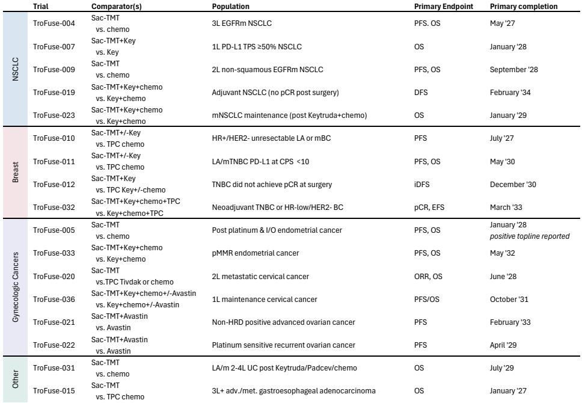
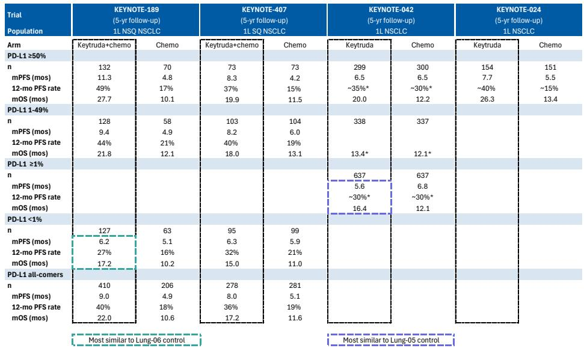
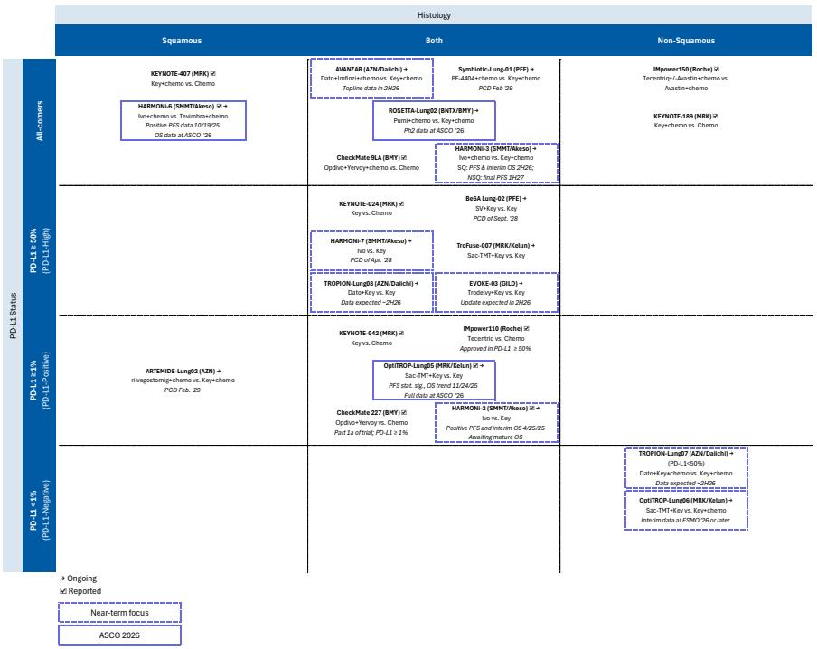

# Keytruda’s Successor Will Not Be A Single Drug, But A Strategic Portfolio—And ASCO 2026 Revealed The Contenders

The first-line non-small cell lung cancer market, long dominated by Merck’s Keytruda with or without chemotherapy, is approaching a structural inflection point. Keytruda’s US patent expiration in 2028 creates a rare window for challengers, but the emerging data from ASCO 2026 makes one thing clear: no single molecule will replace Keytruda. Instead, the next standard of care will be defined by a portfolio strategy, and Merck itself is uniquely positioned to execute it. The two most compelling modalities—TROP2 antibody-drug conjugates and PD-1xVEGF bispecific antibodies—are now backed by Phase 2 and Phase 3 data that demand serious strategic attention. This article interprets the key signals from ASCO, identifies what remains unresolved, and provides a decision framework for investors and strategists evaluating this transition.

The conference delivered two critical firsts for the PD-1xVEGF bispecific class: a statistically significant overall survival benefit in a randomized trial, and the first global data set in first-line NSCLC. Meanwhile, Merck’s TROP2 ADC, sacituzumab tirumotecan, demonstrated compelling progression-free survival in a Phase 3 China-only trial, but questions about its global profile and positioning in PD-L1 low populations remain. The data sets are not yet definitive, but the pattern is clear enough to inform investment and corporate strategy decisions today.

The stakes are enormous. First-line NSCLC is the largest oncology market, and the transition from Keytruda will reshape revenue streams for the next decade. Investors and strategists need to separate signal from noise, and that requires understanding not just which drugs work, but which strategic positions will endure.

## The TROP2 ADC Data Confirms the Modality but Raises Questions About Global Positioning and Patient Selection

Merck and Kelun’s presentation of the Phase 3 OptiTROP-Lung05 trial in PD-L1 positive first-line NSCLC provided the most important TROP2 ADC data set at ASCO. The combination of sacituzumab tirumotecan with Keytruda delivered a median progression-free survival estimated at 15 to 17 months in the experimental arm, compared to 5.7 months for Keytruda alone. The hazard ratio of 0.28 in the PD-L1 TPS 1-49% subgroup is particularly striking, suggesting that the combination may be most differentiated in patients who derive only modest benefit from PD-1 monotherapy.

The safety profile is manageable and consistent with known toxicities of the ADC class. Grade 3 or higher treatment-emergent adverse events occurred in 55.3% of the combination arm versus 31.4% for Keytruda alone, driven primarily by hematologic toxicity and stomatitis. Importantly, permanent discontinuation rates remained low, and patient-reported global health status showed delayed deterioration in the combination arm. The data support the argument that the clinical benefit is not offset by unacceptable toxicity.

Yet several critical questions remain unanswered. The data are from a China-only population, and the global Phase 3 trials are still ongoing. The overall survival data are immature, and while a favorable trend exists, the confidence intervals remain wide. More fundamentally, the positioning of this drug in PD-L1 negative patients remains unclear. The OptiTROP-Lung06 trial, which compares sacituzumab tirumotecan plus Keytruda and chemotherapy against Keytruda plus chemotherapy in the PD-L1 negative population, will be a pivotal readout later this year. If positive, it would significantly expand the addressable market.

Merck’s development program for this ADC is unusually broad, spanning NSCLC, breast cancer, gynecologic cancers, urothelial cancer, and gastroesophageal adenocarcinoma. This breadth is a strategic differentiator. A drug that succeeds across multiple tumor types can generate peak sales far beyond what a single-indication asset could achieve. However, breadth also increases execution risk, and the market’s current consensus estimates of $5.4 billion in 2035 sales for sacituzumab tirumotecan may prove optimistic if any major indication fails.

The deeper strategic question is whether Merck can effectively manage a portfolio that includes both a TROP2 ADC and a PD-1xVEGF bispecific, given that it has assets in both classes. The company’s LM-299, a PD-1xVEGF bispecific antibody from LaNova, is still in earlier development. The risk is that internal competition for resources and trial design priorities could slow progress. The reward is that Merck could own the two most important drug classes in the post-Keytruda era.

## The PD-1xVEGF Bispecific Class Achieved Its First OS Validation, but Global Replication Remains the Key Hurdle

The HARMONi-6 trial from Summit Therapeutics and Akeso represents a landmark for the PD-1xVEGF bispecific class. The combination of ivonescimab plus chemotherapy demonstrated a statistically significant overall survival benefit compared to a PD-1 inhibitor plus chemotherapy in first-line squamous NSCLC. The median overall survival was 27.9 months versus 23.7 months, with a hazard ratio of 0.66. This is the first time any drug in this class has shown a survival benefit in a randomized trial.

The survival benefit was consistent across all key subgroups, including PD-L1 TPS less than 1%, where the hazard ratio was 0.64. This is particularly noteworthy because PD-L1 negative patients represent a significant unmet need and are often poorly served by existing immunotherapy combinations. The safety profile was manageable, with VEGF-related adverse events occurring more frequently in the ivonescimab arm but mostly at grade 1 or 2 severity.

However, the trial design introduces important caveats that investors must weigh carefully. The comparator arm was Tevimbra plus chemotherapy, not Keytruda plus chemotherapy. Tevimbra is a PD-1 inhibitor that may not be fully equivalent to Keytruda in efficacy, and the trial was conducted exclusively in China. The independent discussant at ASCO highlighted three areas of uncertainty: the relatively short follow-up duration, the potential for differential benefit by age, and most critically, whether these results can be reproduced in a global study against the current standard of care.

The HARMONi-3 trial, which is testing ivonescimab plus chemotherapy against Keytruda plus chemotherapy in a global population, will be the definitive test. Final progression-free survival and interim overall survival data are expected in the second half of 2026. If the hazard ratio for overall survival in HARMONi-3 approaches the 0.7 to 0.75 range that key opinion leaders have described as transformational, this class could fundamentally alter the treatment landscape.

Two other PD-1xVEGF bispecifics also presented data at ASCO. BioNTech and Bristol Myers Squibb’s pumitamab, along with Pfizer’s PF-4404, showed high overall response rates across both squamous and non-squamous histologies and all PD-L1 levels. Cross-trial comparisons carry well-known risks, but the data suggest that multiple assets in this class are competitive with ivonescimab. This raises an important strategic question: will the class be commoditized, or will one asset establish a clear efficacy or safety advantage that supports pricing and market share?

The answer may depend on whether any of these drugs can demonstrate a meaningful overall survival benefit in a global trial against Keytruda plus chemotherapy. The bar is high, but the potential reward is enormous. If one bispecific can achieve a hazard ratio of 0.7 or better in a global Phase 3 trial, it would likely become the new standard of care.

## The Report Leaves Critical Questions Unanswered, Particularly Around the PD-L1 Low Population and the Competitive Dynamics Within the Bispecific Class

The ASCO data set provides a strong foundation for strategic analysis, but several important questions remain unresolved. First, the optimal positioning of TROP2 ADCs versus PD-1xVEGF bispecifics is unclear. These are not directly competing mechanisms—one is an antibody-drug conjugate targeting a tumor antigen, the other is a bispecific antibody targeting immune checkpoints and angiogenesis. But they will compete for the same patients, and the choice between them will depend on head-to-head data that do not yet exist.

Second, the PD-L1 low and negative populations represent a critical area of uncertainty. Both drug classes showed promising activity in these subgroups, but the data are preliminary. If either class can demonstrate a clear benefit in patients with PD-L1 TPS less than 1%, it would address a significant unmet need and expand the addressable market substantially. The OptiTROP-Lung06 trial and the HARMONi-3 trial will provide important data on this question, but neither is expected to read out until late 2026 or later.

Third, the competitive dynamics within the PD-1xVEGF bispecific class are far from settled. Ivonescimab has the most mature data set, but pumitamab and PF-4404 showed comparable response rates. The key differentiator will be overall survival in global trials, and those data are still years away. Investors and strategists must decide whether to place a bet on the first mover or wait for more data, knowing that the class could become crowded quickly.

Fourth, the role of chemotherapy in combination regimens is an open question. Both the TROP2 ADC and the bispecific antibodies are being tested with and without chemotherapy. If these drugs can achieve sufficient efficacy as monotherapies or in chemotherapy-free combinations, the market opportunity expands significantly. If chemotherapy remains necessary, the safety and tolerability profile becomes more important.

Finally, the report does not fully address how Merck will manage its portfolio of competing internal assets. With both a TROP2 ADC and a PD-1xVEGF bispecific in development, the company faces a strategic choice: prioritize one over the other, or pursue both and accept the potential for internal cannibalization. The market will need to see clear signals from management about resource allocation and trial design priorities.

## A Decision Framework for Investors and Strategists Evaluating the Post-Keytruda Landscape

The data from ASCO 2026 support a structured decision framework based on three dimensions: mechanism of action, patient population, and trial design quality. Each dimension carries specific risks and opportunities that should inform portfolio positioning.

On the mechanism dimension, TROP2 ADCs and PD-1xVEGF bispecifics represent fundamentally different approaches. TROP2 ADCs deliver a cytotoxic payload directly to tumor cells, while bispecifics modulate the immune microenvironment and inhibit angiogenesis. The two mechanisms are not mutually exclusive, and combination strategies may emerge. The key question is whether one mechanism proves superior in head-to-head comparisons, or whether they are used sequentially or in combination. Investors should monitor biomarker data that might predict which patients benefit most from each approach.

On the patient population dimension, the most important segmentation is by PD-L1 expression level. High PD-L1 expressers already derive substantial benefit from PD-1 monotherapy, so the incremental benefit of adding an ADC or bispecific must be large enough to justify additional toxicity and cost. Low and negative expressers represent the greatest unmet need and the largest potential market expansion. Any drug that can demonstrate a clear benefit in PD-L1 negative patients will have a significant competitive advantage.

On the trial design dimension, the quality of the comparator arm is critical. China-only trials against non-standard comparators provide valuable signal but require global confirmation. The HARMONi-3 trial, with its Keytruda plus chemotherapy control arm and global enrollment, will be the most important data set for the bispecific class. Similarly, the global trials for sacituzumab tirumotecan will determine whether the China data are reproducible in Western populations.

The decision framework also requires attention to timing. The Keytruda patent expiration in 2028 creates a window of opportunity, but the regulatory and commercial timelines for these drugs are uncertain. Sacituzumab tirumotecan has received a US priority review voucher, which could accelerate its FDA review. The bispecific antibodies are further behind, with global Phase 3 data expected in late 2026 or 2027. Investors and strategists must assess whether their investment horizon aligns with these timelines.

Finally, the framework must account for competitive dynamics within each class. The TROP2 ADC space includes competitors from AstraZeneca and Gilead, and the bispecific space includes multiple well-funded programs. First-mover advantage may be significant, but it can also be fleeting if a later entrant demonstrates superior efficacy or safety. The key is to identify which assets have the strongest data, the broadest development programs, and the most credible management teams.

## The Full Report Contains Detailed Cross-Trial Comparisons and Revenue Models That Are Essential for Investment Decisions

The analysis above provides a strategic interpretation of the ASCO 2026 data, but the full report from the global investment bank contains detailed exhibits that are essential for rigorous investment analysis. These include cross-trial efficacy comparisons across the PD-1xVEGF bispecific class, parametric model predictions for progression-free survival in the TROP2 ADC trial, and comprehensive safety comparisons that highlight differences in toxicity profiles across drug classes.

The report also includes a detailed summary of the development programs for both sacituzumab tirumotecan and the PD-1xVEGF bispecifics, with timelines for key data readouts across multiple indications. This information is critical for understanding the sequencing of catalysts and the potential for value creation over the next two to three years.

Most importantly, the report contains revenue models that quantify the risk-adjusted sales potential for each asset, with explicit probability of success assumptions across different tumor types. These models provide a framework for comparing investment opportunities within and across drug classes, and they highlight where consensus estimates may be overly optimistic or pessimistic.

For investors and strategists who need to make informed decisions about positioning in the post-Keytruda landscape, the full report and its original charts are indispensable.

Join the community to read the full report and review the original charts.

*This article is for learning and discussion only and does not constitute investment advice.*

Personal reading notes and learning share only. Not investment advice.

