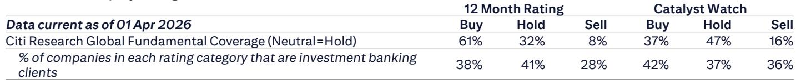

# 市场低估的不是AI算力需求，而是IT服务商从“系统开发”到“代理设计”的职能跃迁

当全球投资者还在争论AI的资本开支何时见顶、企业AI应用的ROI是否成立时，一份来自某外资投行的日本IT服务行业研报，提供了一个更具结构性的观察视角。这份报告的核心判断并非关于算力采购的规模，而是关于AI价值链正在发生的、不易被察觉的职能转移：企业IT服务商（Sler）的业务核心，正在从传统的系统开发，转向企业级AI代理（Agent）的设计、管理与安全。这个转变，将重新定义该行业的定价权与增长天花板。

当前市场对AI的讨论，大多集中在模型能力、算力需求和基础设施投资上。但真正决定未来几年产业格局的，可能是“谁来把通用AI能力转化为企业可用的、成本可控的专用代理”。这份报告从NVIDIA Computex主题演讲中捕捉到的信号表明，这个问题的答案正在向IT服务商倾斜。而这恰恰是当前估值模型中尚未完全定价的部分。

## 1. AI ROI的困境正在催生一个新的中间层市场，而IT服务商是天然承接者

企业AI应用的ROI问题，已成为制约下一阶段部署的关键瓶颈。报告引用了Uber COO的公开表态——生产力提升是否足以证明AI的token成本是合理的，目前仍不清晰。与此同时，Amazon的策略正在从“最大化token使用量”转向“优化token使用量”。这不是孤立现象。随着模型能力提升，OpenAI API等服务的成本也在持续上升，部分企业已经开始质疑这些支出的合理性。

这个困境的本质是什么？不是AI没有价值，而是通用模型的“一刀切”模式在企业场景中产生了大量无效成本。企业需要的是针对特定任务、经过优化、成本可控的专用代理，而不是每次调用都让一个庞大的通用模型从头“思考”。

NVIDIA在Computex上发布的Nemotron 3 Ultra模型，正是针对这一痛点。它被定位为一个开源、低成本、高效率的企业代理开发基础模型。NVIDIA明确表示，企业需要自己设计专用的、低成本的代理。而谁最擅长做这件事？正是那些长期嵌入企业业务流程、理解行业逻辑、拥有客户数据和领域知识的IT服务商。

这意味着，一个全新的中间层市场正在形成：介于基础模型提供商和企业最终用户之间，由IT服务商承担的“企业代理设计、管理与安全”服务。这个市场的规模，可能远超当前市场对IT服务行业的线性增长预测。

## 2. 从“系统开发”到“代理设计”是一次商业模式的升维，而非简单的服务内容扩展

理解这个转变的深度，需要将其放在IT服务行业的历史演进中来看。过去二十年，日本IT服务商的核心业务是系统集成与软件开发——根据客户需求，编写代码，构建信息系统。这是一个按人天计费、项目制交付、边际成本递减空间有限的模式。

而企业AI代理的设计与管理，本质上是完全不同的业务形态。它不是一次性交付的项目，而是持续优化、迭代、运维的服务。企业需要决定“哪个任务用哪个模型”，需要根据任务难度和重要性进行模型路由，需要管理代理的安全性与合规性。这些工作，报告明确指出，将成为Sler未来的业务。

这意味着三件事：第一，收入模式从项目制向订阅制或持续服务制转变，提升收入的可预测性与客户生命周期价值。第二，定价权从“人天费率”向“价值定价”迁移——一个能够帮助企业将token成本降低30%的代理设计方案，其价值远高于同等工时投入的系统开发。第三，竞争壁垒从“项目经验”转向“领域数据+模型调优能力”的复合壁垒，后者的可复制性更低。

当然，这里仍需验证。目前尚不清楚企业愿意为这类代理管理服务支付多高的溢价，也不清楚IT服务商能否在短期内建立起足够的人才储备和方法论。但趋势的方向是明确的。

## 3. 物理AI是下一个前沿，而拥有行业软件和数据的服务商将占据独特生态位

报告在讨论NVIDIA主题演讲时，特别强调了物理AI（Physical AI）的布局。NVIDIA将物理AI视为代理AI之后的下一个阶段，并发布了Cosmos 3等模型，重点推进机器人和自动驾驶领域的应用。

物理AI与数字AI的一个关键区别在于：物理世界中的任务执行，往往需要与规则型软件结合。例如，当机器人执行税务计算这类任务时，使用既有的规则型软件比让AI每次重新验证计算方法更高效。这意味着，物理AI的落地，不仅需要AI模型，还需要大量行业特定的规则引擎、业务流程软件和数据。

这正是像富士通这类与NVIDIA有合作关系的IT服务商的优势所在。它们拥有行业专用软件、客户数据和领域专业知识。随着物理AI的推进，这些资产的价值将被重新评估。报告对富士通表达了明确的关注，认为其将在物理AI时代获得增长预期。

这一判断对投资者的启示是：在评估IT服务商时，不能只看其AI相关的营收占比，更要看其行业软件的深度和数据资产的独特性。那些拥有不可替代的行业知识库和规则系统的公司，在物理AI时代可能获得超出市场预期的生态位。

## 4. 报告尚未完全回答的关键问题：模型层的竞争格局会如何影响服务商的议价能力？

NVIDIA发布Nemotron系列模型，意味着它不再仅仅是算力提供商，也开始进入模型层。报告提到NVIDIA计划后续发布Nemotron 4和5，并希望跟踪NVIDIA作为企业AI模型提供商的定位变化。

这引出一个关键但尚未被充分讨论的问题：如果模型层出现“赢家通吃”或“寡头垄断”的格局，服务商的议价空间有多大？如果基础模型本身足够便宜、足够好用，企业是否会绕过服务商直接使用？相反，如果模型层呈现碎片化、多模型并存的局面，服务商的“模型路由”和“代理管理”价值反而会上升。

目前来看，后一种情景的可能性更大。原因有二：第一，企业级需求高度多样化，单一模型难以覆盖所有场景。第二，NVIDIA的开源策略本身就在推动模型的多元化。但这一判断仍需验证。模型层的竞争动态，将是影响IT服务商长期价值的关键变量。

## 5. 投资者的观察框架：用三个维度重新审视IT服务商的估值

基于以上分析，评估一家IT服务商的AI业务价值，可以建立以下三个维度的框架：

第一，客户粘性的来源。是来自长期系统集成合同，还是来自嵌入业务流程的数据和软件？后者在AI时代更具护城河效应。

第二，代理管理能力的成熟度。公司是否已经开始建立模型评估、任务路由、成本优化等内部方法论？是否有实际案例证明其能够帮助客户降低token成本？

第三，行业软件的深度。在物理AI即将到来的背景下，公司是否拥有难以复制的行业规则引擎或专用软件？这将是下一阶段竞争的关键资产。

那些在这三个维度上得分较高的公司，其AI业务的价值可能被当前市场低估。而那些仅靠传统系统集成、缺乏行业深度和代理管理能力的公司，则可能面临被平台型AI服务商挤压的风险。

## 6. 一个值得持续跟踪的变量：企业AI采用的速度是否会因为成本优化而加速？

当前市场的一个主流叙事是：AI成本上升正在抑制企业采用。但这份报告提供了一个相反的视角：成本优化本身，恰恰是推动下一波采用的关键。当企业能够通过代理设计将token成本降至可接受水平时，原本被搁置的AI项目可能会重新启动。

NVIDIA的Nemotron系列模型，以及IT服务商在代理管理中的角色，正是这个成本优化过程的核心环节。如果这一逻辑成立，那么当前市场对AI投资回报周期的悲观预期，可能需要修正。但这一判断的成立，取决于两个前提：一是开源模型的质量能否持续接近闭源模型，二是IT服务商能否快速建立规模化交付能力。

这两个前提都尚未被市场充分验证，但它们指向一个值得深入探讨的方向。完整的报告对这些前提的论证、相关公司的具体案例以及更详细的财务影响分析，我们将在社群中继续展开。

---

欢迎来星球微信群里继续讨论。上述关于模型层竞争格局对服务商议价能力的影响、物理AI时代行业软件的重估逻辑，以及几个关键日本IT服务商在三个维度上的具体评分，我们在完整报告解读中有更详细的展开。此外，报告中对NVIDIA后续模型路线图与Sler业务协同性的分析，也值得深入探讨。

---

Personal reading notes and learning share only. Not investment advice.

