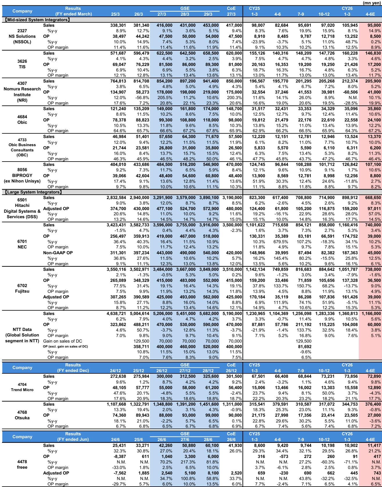
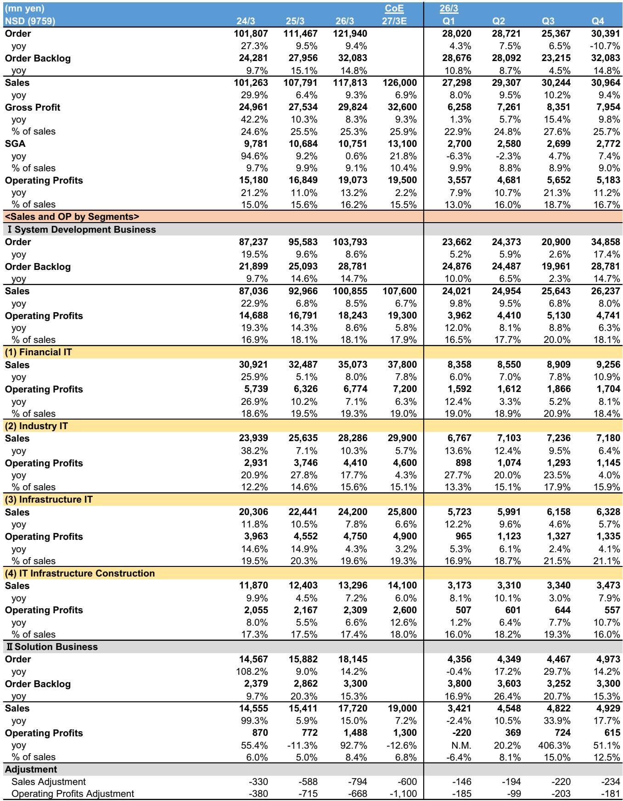
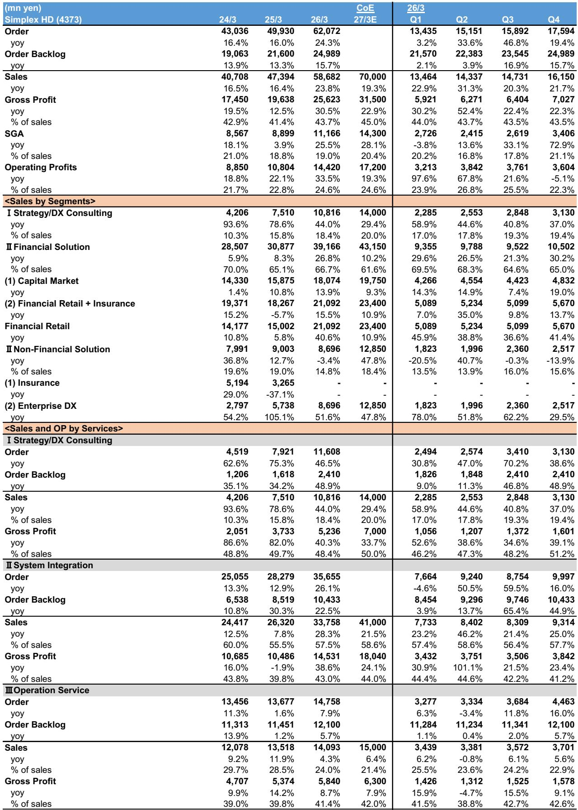

# 日本IT服务业的真正分化点：谁能在AI驱动的效率红利中，把成本节约转化为利润增长

过去几个季度，市场对日本IT服务业的关注焦点一直集中在“需求是否可持续”。金融系统升级、企业数字化转型、政府IT现代化——这些驱动因素看起来都足够坚实。但最近一份覆盖三家非覆盖公司的研报，揭示了一个更微妙的信号：需求侧的故事已经不够用了。真正区分赢家与输家的，不再是订单增长的快慢，而是企业能否在AI驱动的开发效率提升中，把节省下来的人月成本重新转化为利润，而不是被客户的价格压力或内部的费用膨胀所吞噬。

这份研报通过对Simplex Holdings、NSD和DTS三家公司的实地调研，提供了一个极具价值的“对照实验”视角。三家公司同属金融IT服务领域，面对相似的市场环境，但它们的盈利前景却出现了显著分化。Simplex预计FY3/27营业利润增长19%，连续第七年实现两位数增长；而NSD和DTS却只能给出2%-3%的利润增幅指引。这种分化不是需求端的问题——三家公司的订单环境都相当强劲——而是供给端的结构性差异在起作用。

对于关注日本IT服务板块的投资者而言，这意味着传统的“订单增速-收入增速-利润增速”线性分析框架已经不够用了。需要建立一个更精细的观察框架，来评估哪些公司真正具备将AI驱动的效率提升转化为可持续利润的能力。

## 1. 订单增长强劲但利润指引分化，说明行业已进入“效率竞争”阶段

三家公司最新的订单数据都相当健康。Simplex 4Q订单同比增长19%，连续第三个季度实现两位数增长；NSD系统开发订单4Q同比增长17%，较3Q的3%明显加速；即使是表现最弱的DTS，虽然订单同比下滑4%，但公司表示大型项目的回撤影响已基本消化，公共和电信领域订单正在复苏。

然而，三家的FY3/27利润指引却呈现出截然不同的面貌。Simplex预计营业利润增长19%，利润率达24.6%；NSD仅预计增长2%，利润率维持在15.5%左右；DTS预计增长3%，利润率约11.2%。

这种订单与利润之间的脱节，核心原因在于“费用投入”的差异。NSD预计FY3/27的SG&A费用将大幅增长22%（+23.5亿日元），主要用于AI解决方案开发、广告费用和办公空间扩张。DTS同样面临SG&A费用增长13%（+17亿日元），主要投入在AI和人力资源领域。而Simplex虽然也在增加研发投入（+19亿日元，主要用于生成式AI和Web3.0），但其收入增长足够强劲，足以吸收这些增量费用后仍保持利润率稳定。

这意味着什么？当行业需求从“爆发增长”转向“稳定增长”阶段时，企业面临的真正考验不再是“能不能拿到订单”，而是“能不能在投入新技术的同时保持盈利纪律”。那些能够将增量投资精准聚焦于高回报领域、避免费用无差别膨胀的公司，将在这一轮竞争中脱颖而出。

## 2. AI驱动的开发效率提升，将成为利润分化的核心变量

研报中最具洞察力的部分，是Simplex关于AI驱动开发的战略阐述。公司表示，AI驱动开发预计将从FY3/29开始对盈利产生贡献，如果成功，将帮助公司达到FY3/30营业利润目标区间的上限（250-300亿日元）。更重要的是，Simplex明确指出，由于其业务主要基于合同开发模式，AI带来的工时削减将直接转化为公司自身的利润增长。

这一逻辑的关键在于“剩余产能的再分配”。Simplex认为，即使客户在中期内施加价格压力，公司也可以通过将工时削减产生的剩余产能重新分配到其他项目，来提升整体盈利。研报作者对此表示认同，并认为这适用于整个行业。

这实际上揭示了一个重要的二阶效应：AI对IT服务业的冲击，不是简单的“替代人月”，而是“释放产能”。那些拥有强大项目管理和客户关系能力的公司，可以将释放出来的工程师资源快速重新部署到新的高价值项目上，从而在不变动人员规模的情况下实现收入增长。而那些缺乏这种再分配能力的公司，则可能面临“效率提升-收入下降-利润承压”的恶性循环。

目前，Simplex的咨询业务已展现出这种能力的雏形。其咨询部门4Q营业利润同比增长39%，公司表示跨销售SI项目已取得成功，各业务之间的协同效应正在增强。这暗示Simplex已经建立起一种“咨询引导-项目交付-运营服务”的闭环，使得从任何一个环节释放的产能都能在其他环节找到价值出口。

## 3. “准委托合同”与“项目制合同”的商业模式差异，决定了利润留存能力

另一个值得关注的维度是商业模式对利润留存能力的影响。NSD明确提到，公司拥有高比例的“准委托合同”（quasi-mandate contracts），即基于月度人月定价的合同模式。在这种模式下，公司计划通过增加上游业务来避免客户的价格压力。

而Simplex则主要采用项目制合同。这种模式的优势在于，当AI提升开发效率后，公司可以直接享受工时缩短带来的利润提升，而不需要与客户重新谈判定价。Simplex管理层明确表示，即使中期内客户价格压力增加，公司也可以通过剩余产能再分配来提升整体盈利。

这两种模式的差异，本质上决定了AI效率提升的“利润归属”问题。在准委托合同下，效率提升带来的好处更容易被客户通过定价谈判所侵蚀；而在项目制合同下，公司可以更直接地保留效率提升的收益。

当然，项目制合同也有其风险——如果项目估算不准确或技术能力不足，容易产生亏损项目。DTS就是一个典型案例。公司在4Q出现了约7亿日元的亏损项目，主要集中在新客户、新领域（如云服务）的项目上，原因正是缺乏相关经验。这提醒我们，项目制合同的红利并非自动获得，而是需要强大的项目管理和技术能力作为支撑。

## 4. 报告尚未完全回答的关键问题：AI对IT服务业的利润影响究竟何时会实质化

尽管Simplex给出了非常乐观的展望——AI驱动开发从FY3/29开始贡献利润——但这份报告留下了一个关键问题没有得到回答：AI对行业的利润影响究竟会在什么时间点、以什么样的幅度实质化？

Simplex的预测本身包含相当大的不确定性。公司预计FY3/30的营业利润目标区间为250-300亿日元，而能否达到上限取决于AI驱动开发的成功程度。但“成功”的定义是什么？是工具层面的效率提升，还是商业模式层面的根本变革？前者可能只带来几个百分点的利润率改善，后者则可能重新定义行业竞争格局。

另一个未解的问题是：AI对IT服务业的冲击，是否会导致行业整体的“人月定价”体系被打破？如果AI将开发效率提升50%，那么传统的基于人月定价的商业模式将面临根本性挑战。那些能够从“卖人月”转向“卖结果”或“卖IP”的公司，将获得更大的利润空间；而那些固守传统模式的公司，则可能陷入价格战。

此外，NSD和DTS的AI投资计划也值得关注。两家公司都计划大幅增加AI相关投资，但它们的投资回报期和ROI预期是什么？报告没有给出明确答案。考虑到NSD的SG&A费用增长22%而利润仅增长2%，这种“投入-产出”的严重不对称是否意味着AI投资在短期内是“必要但不高效”的？这个问题对评估整个板块的短期盈利前景至关重要。

## 5. 对投资者的观察框架：从三个维度评估日本IT服务公司的AI红利捕获能力

基于以上分析，我们建议投资者从以下三个维度构建评估框架：

第一，商业模式的红利捕获能力。优先选择以项目制合同为主、业务结构包含“咨询-开发-运营”闭环的公司。这类公司更有可能在AI效率提升中保留利润，并通过内部产能再分配实现增长。Simplex的咨询+SI+运营三位一体模式是一个正面案例。

第二，费用投入的纪律性。在行业需求稳定增长的背景下，SG&A费用的增长是否与收入增长相匹配，是否聚焦于高回报领域，是判断公司管理质量的关键指标。NSD的SG&A增长22%而利润仅增长2%，这种投入产出比需要更审慎的评估。

第三，技术能力与项目管理能力的平衡。AI驱动开发的红利，只有在强大的项目管理能力基础上才能兑现。DTS在新领域项目上的亏损案例提醒我们，技术能力的缺失可能导致项目制合同从“利润放大器”变成“亏损加速器”。那些在传统SI领域有深厚积累、同时积极拥抱AI的公司，可能更具优势。

这三个维度可以帮助投资者识别出那些真正具备“AI红利捕获能力”的公司，而不是仅仅被订单增速所迷惑。

## 6. 一个尚未被充分定价的尾部风险：AI可能加速行业整合

最后，我们想提出一个基于报告逻辑推导、但报告本身没有直接讨论的判断：AI可能会加速日本IT服务业的行业整合。

逻辑链条如下：AI提升开发效率 -> 头部公司获得更多可再分配产能 -> 头部公司可以以更低成本承接更多项目 -> 中小型公司面临更强的价格竞争和利润压力 -> 行业集中度提升。

Simplex已经展现出这种“效率优势-市场份额扩张”的良性循环。公司不仅提高了订单展望区间（中点从145亿日元上调至185亿日元），而且在大企业客户中赢得了两个大型SI项目。如果AI进一步放大这种优势，那么头部公司对中小型公司的竞争优势将更加明显。

但报告没有讨论的是，这种整合是否会受到监管或客户意愿的制约？日本金融机构通常倾向于维持多家IT服务供应商的竞争格局，以避免对单一供应商的过度依赖。如果AI推动的整合打破了这种平衡，可能会引发客户的策略调整，从而为中小型公司创造新的生存空间。

这个问题没有简单的答案，但它值得持续跟踪。欢迎来星球微信群里继续讨论，我们将基于完整报告和原始数据，深入分析AI对日本IT服务行业竞争格局的长期影响，并分享我们对具体公司的估值判断。

---

Personal reading notes and learning share only. Not investment advice.

