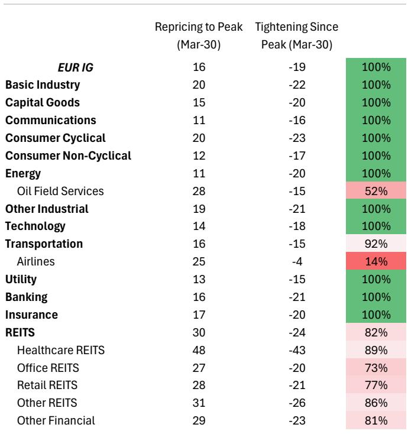
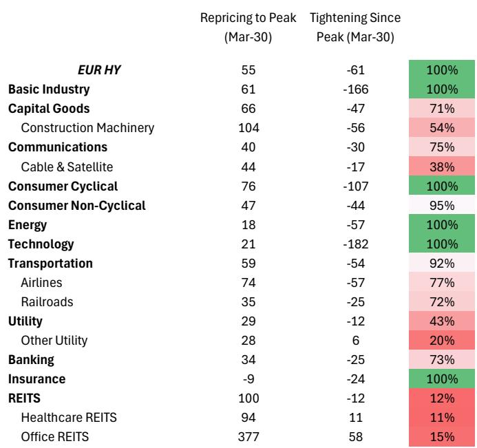
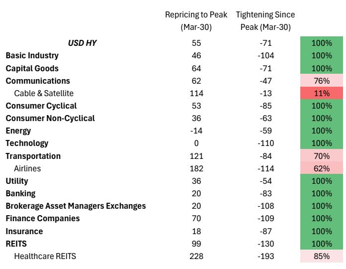

# 信用市场真正低估的不是地缘风险，而是利率从“调整”到“体制切换”的跳跃

过去两个月，全球信用市场经历了一轮令人瞩目的反弹。美国投资级和高收益利差分别收窄17个基点和60个基点，欧洲市场的收窄幅度甚至更大。这似乎印证了一个月前某外资投行提出的判断：“利率在走高，但还不足以实质性破坏固定利率信用市场。”

这个判断至今仍然成立。但真正的问题不是它还能成立多久，而是当它不再成立时，市场会以何种方式、在什么触发条件下完成定价调整。

这份最新发布的全球策略研报提供了一个关键框架：信用利差对利率的免疫不是无限的，它有一个清晰的阈值。而在阈值之外，市场还面临一个更根本的结构性问题——当前利差的压缩已经接近极限，即使利率回落，利差也难以进一步收窄。

这意味着，未来几个月的核心交易不是“赌方向”，而是理解三种不同情景下的不对称性。

## 1. 利差对利率的免疫不是永久的，关键阈值在2.65%-2.75%的盈亏平衡通胀率

信用市场之所以能在利率上行中保持韧性，核心原因在于利率上行的“成分”此前是良性的。最初美国10年期收益率的上升主要由实际利率和期限溢价驱动，而非通胀预期或政策前景的根本性转变。这种成分差异解释了为什么利差没有同步走阔。

但研报的数据显示，这一成分正在发生变化。长期通胀预期在经历了短暂回落后，开始重新走高。虽然目前仍低于2.5%，但方向性的转变值得警惕。

报告提出了一个清晰的量化门槛：当美国5年期盈亏平衡通胀率进入2.65%-2.75%区间时，投资者将开始质疑通胀控制的有效性，进而质疑当前政策路径的可信度。这个阈值之所以重要，不是因为它是某个统计上的极端值，而是因为它代表了一个心理拐点——市场会从“通胀可控”的叙事切换到“政策可能落后于曲线”的叙事。

这一判断的深层含义是：信用利差对利率的免疫本质上是有条件的。只要通胀预期保持温和，高利率可以被解读为经济增长的信号；一旦通胀预期越过临界点，同样的利率水平就会被重新定价为政策失误。

## 2. 供应链指标正在发出比CPI更值得关注的信号

低于预期的美国CPI数据让市场松了一口气，但研报提醒投资者关注另一个更前瞻的指标：供应链压力指数。

该指数在3月至4月间飙升了1.2个标准差，这是自2020年7月疫情冲击以来最大的两个月升幅。这一数据的含义远比一次CPI数据重要。供应链压力是通胀的上游驱动因素，它的恶化往往领先于消费者价格的变化。

更值得玩味的是，市场似乎在用“地缘冲突终将解决”的假设来定价风险资产。从霍尔木兹海峡的油轮通行数据看，4月初一度出现的乐观情绪正在消退，谈判陷入停滞。但金融市场的定价仍然倾向于相信一个“deal”情景。

这里存在一个明显的脱节：如果供应链压力持续恶化，而地缘冲突未能快速解决，那么当前市场定价的“软着陆”叙事将面临修正。报告指出，在这种情形下，信用利差的调整不会是线性的——不是逐点对应利率上升，而是在货币政策出现“体制切换”时集中释放。

## 3. 即使利率回落，利差进一步收窄的空间也极为有限

这可能是整份报告中最反直觉的判断。如果利率能够回落——比如地缘冲突解决导致通胀预期下行——信用利差还能再压缩多少？

答案令人警醒：几乎没有空间。

从估值角度看，美国投资级和高收益利差已经分别处于近十年来的第2和第3百分位。在欧洲，虽然整体估值不如美国极端，但高收益利差也已处于第11百分位。在美国高收益市场，16个主要行业中有10个的利差低于25年百分位。

从持仓角度看，以标普500期货作为风险偏好的代理指标，资产管理公司的净多头仓位处于近十年来的第95百分位。CTA的信用持仓也在5月进入平台期。历史数据显示，地缘冲突解决后最大的利差收窄发生在CTA此前做空信用的时候，而当前CTA已经是净多头。

这两个事实合在一起意味着：即使出现最乐观的“和平红利”，信用市场也已经没有多少“红利”可以释放。当前的价格已经充分反映了乐观情景。

这一判断对投资者的含义是：与其期待利差进一步收窄带来的资本利得，不如认真思考如何在利差走阔的情景中保护组合。报告的三种情景分析框架正是为此设计。

## 4. 欧美的分化正在创造不对称的交易机会，但方向可能已经改变

今年早些时候，做多欧洲信用vs美国信用是一个成功的交易。报告团队在市场动荡中精准操作，两次入场两次获利。但现在，这个交易的逻辑基础正在瓦解。

核心差异在于货币政策路径。报告团队预测欧洲央行2026年将加息50个基点，而美联储同期将降息25个基点。欧洲的脆弱性不仅来自货币政策，还来自更高的能源价格敏感性、有限的财政支持、以及增长的下行风险——这些因素在当前欧洲信用利差中尚未得到充分反映。

更值得关注的是，欧洲的利率波动率仍然比一年均值高出约1.5个标准差，而美国已经基本回归正常。这意味着欧洲市场的定价不确定性远高于美国，而信用市场尚未对此进行充分调整。

报告团队因此选择获利了结欧洲vs美国的相对价值交易，等待更有吸引力的重新入场点。这一操作本身就是一个信号：欧美信用市场的相对价值窗口可能正在关闭。

## 5. 报告尚未完全回答的关键问题：体制切换的触发机制是什么？

研报提出了一个极具洞察力的框架，但有一个关键问题留给了读者：从“调整”到“体制切换”的跃迁，具体由什么触发？

报告给出的阈值是盈亏平衡通胀率2.65%-2.75%，但并未详细讨论触发这个阈值的可能路径。供应链压力持续恶化是一个路径，但它的传导时滞有多长？地缘冲突升级是另一个路径，但当前市场对冲突的“疲劳感”是否会延迟定价反应？AI驱动的资本开支被报告提及为通胀的上行风险，但这个机制的具体传导链条是什么？

这些问题在研报中留下了开放的讨论空间。它们不是报告的缺陷，而是报告框架的自然延伸——任何好的分析都应该让读者意识到，关键假设的验证需要持续跟踪。

另一个未完全展开的问题是：如果欧洲的脆弱性确实高于美国，那么欧洲信用市场的调整会以什么形式出现？是利差的渐进走阔，还是某个事件触发的集中释放？欧洲的流动性结构、投资者基数和市场深度都与美国不同，这意味着调整的路径和速度也可能不同。

## 6. 投资者需要建立的不是单一观点，而是三种情景下的应对框架

面对当前的不确定性，最危险的策略是选择一个方向下重注。报告提供的三种情景框架值得认真对待：

情景一：能源正常化但通胀粘性（油价跌、利率升）。在这个情景下，报告建议做空美国投资级办公REITs相对指数。办公REITs具有长久期现金流结构、高杠杆和在压力时期流动性溢价上升的特点，是利率上行的天然脆弱标的。

情景二：能源正常化且通胀回归暂时性（油价跌、利率跌）。这个情景下，价值在欧洲。报告看好做多欧洲投资级航空公司相对指数，因为该板块自3月底反弹以来尚未充分重定价，存在显著的上行凸性。

情景三：霍尔木兹海峡持续中断且通胀粘性（油价大涨、利率升）。这个情景下，消费者将面临真正的压力。报告建议做空美国高收益零售相对指数，押注增长冲击下的利差表现落后。

每个情景都有明确的交易结构和风险收益特征，而不是模糊的方向性判断。这种情景化思维本身就比任何单一预测更有价值。

最终，这份研报的核心贡献不是给出了一个确定的答案，而是提供了一个清晰的决策框架：理解信用市场当前定价的脆弱性在哪里，识别从“调整”到“体制切换”的阈值，建立应对不同情景的战术工具箱。

对于那些希望深入讨论这些未解问题的读者——特别是关于体制切换触发机制、欧洲脆弱性的具体传导路径、以及三种情景概率权重的判断——我们欢迎在星球微信群里继续讨论。完整报告包含了更详细的数据图表、行业层面的利差分析、以及具体的交易执行建议。

Personal reading notes and learning share only. Not investment advice.

