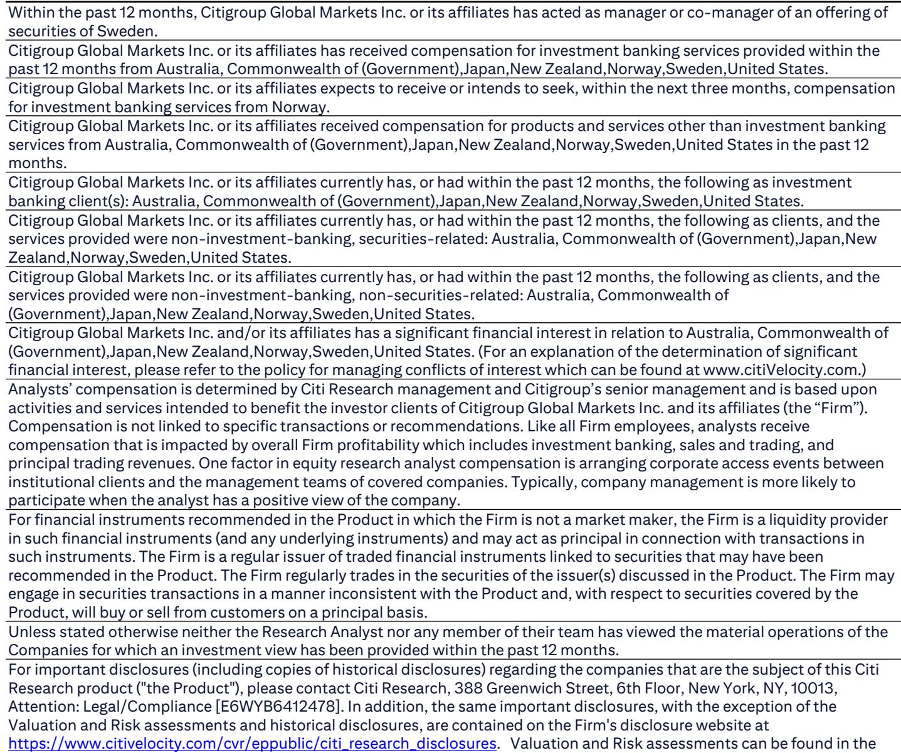
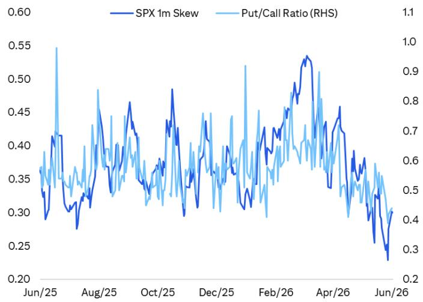
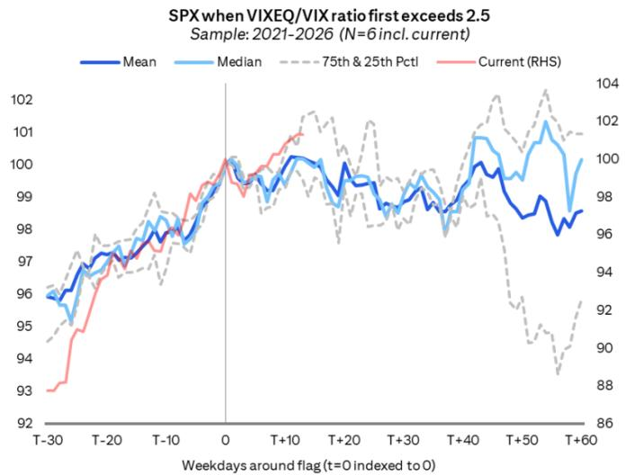

# 市场真正低估的不是风险，而是风险定价的切换时机

过去几个月，全球风险资产在伊朗冲突持续悬而未决、地缘溢价反复波动的背景下，依然走出了令人意外的韧性。AI资本开支周期、能源库存管理的超预期表现、以及市场对霍尔木兹海峡问题最终解决的乐观预期，共同支撑了高贝塔、高利差货币和权益资产的强势。然而，一份来自某外资投行外汇策略团队的最新报告，正在向市场传递一个微妙但重要的信号：风险情绪已经从“绿灯”转向“黄灯”。

这份报告的核心判断并非看空风险资产，而是认为当前低波动率的环境，恰恰是加仓下行保护的战术窗口。真正值得关注的，不是市场是否即将崩盘，而是风险定价的结构正在发生变化——那些在上涨周期中被视为理所当然的“好交易”，在情绪切换后可能呈现出完全不同的损益特征。报告特别指出，近期频繁出现的“股跌债也跌”场景，正在改变外汇市场的传统避险逻辑，而这一点，大多数投资者尚未充分定价。

以下是对这份报告核心逻辑的拆解与延伸。

## 1. 情绪指标集群闪烁，但尚未构成趋势反转的充分条件

报告通过多个独立维度的指标，描绘了一个正在从“积极”转向“脆弱”的风险环境。这些指标各自都不足以单独触发卖出信号，但它们的同步出现，大幅提高了市场脆弱性的概率。

首先是Citi内部开发的POLLS指标——一个综合了仓位、乐观情绪、流动性、杠杆和压力五个维度的情绪监测工具。该指标上周触及18，这一数值在历史经验中通常出现在市场修正之前。量化全球宏观团队的分析显示，在POLLS触发这一阈值后，标普500指数未来30至50个交易日的回报分布明显偏弱。

其次是期权市场的极端信号。CBOE股票看跌/看涨比率跌至过去十年罕见低位，标普500指数一个月的偏斜度同样显示出强烈的看涨期权需求。这意味着市场已经通过期权建立了相当拥挤的看多头寸。报告点出了这一结构的两层含义：第一，如果市场转向避险，低水平的看跌期权持仓将引发集中的看跌期权买入，进而推升波动率；第二，做市商作为看涨期权的净卖出方，需要持有股票多头来对冲，一旦市场开始下跌，做市商削减对冲头寸的行为可能加速下行。

但这些信号并不等同于趋势反转。正如报告所强调的，这只是一次从“绿灯”到“黄灯”的切换，而非直接跳入“红灯”。真正关键的，是哪些变量会推动市场从脆弱走向真正的修正。

## 2. 盈利季的结束正在移除一个被低估的支撑因素

一个容易被忽视的结构性变量是盈利季节的日历效应。报告通过对比标普500指数在盈利季与非盈利季的表现，揭示了一个清晰的规律：过去五年间，指数几乎所有的净涨幅都集中在盈利季窗口内，而在非盈利季期间，指数的表现不仅波动更大，甚至呈现出横向震荡甚至小幅下跌的特征。

更值得注意的是，当使用等权重的标普500指数重新做同样的分析时，这一效应被进一步放大。等权重指数在盈利季的表现甚至优于市值加权指数，但在非盈利季期间，其表现几乎为零。这说明，过去几年市场上涨的驱动力高度依赖企业基本面的兑现，而非简单的流动性驱动或情绪推动。

这一规律对当前环境的含义是：随着第二季度盈利季的结束，市场将失去一个重要的结构性支撑。报告并未断言市场必然下跌，但它提示了一个需要密切关注的窗口——在缺乏盈利季催化剂的未来几周，市场将更易受到其他负面因素的冲击。

## 3. 股票内部的高度离散是市场脆弱性的先行信号

报告的另一个关键发现是标普500成分股波动率与指数波动率的比值已经达到了历史极端水平，超过2.5。这一指标衡量的是个股之间的分化程度。当这一比值处于高位时，意味着指数表面上的平稳掩盖了内部剧烈的个股分化。

历史数据显示，当这一比值突破2.5后，标普500指数往往进入横盘或下行阶段。背后的逻辑并不复杂：当个股之间的离散度达到极端水平时，意味着市场对个股的定价分歧已经很大，指数层面的上涨需要越来越多的个股形成共识。而一旦共识无法持续，指数的脆弱性就会暴露。

这一指标的极端值部分与盈利季相关——盈利季期间个股的业绩差异自然会加大离散度。但报告也提示，在盈利季结束后，如果离散度没有显著回落，那将是一个更值得警惕的信号，因为它可能意味着市场正在对某些结构性风险进行差异化定价，而这些风险尚未在指数层面体现。

## 4. 报告尚未完全回答的关键问题：伊朗风险如何被定价，以及“买预期、卖事实”的演绎路径

报告对伊朗冲突的讨论是整份分析中最具张力但也最不完整的部分。它正确地指出，市场目前倾向于将霍尔木兹海峡问题的解决视为利好，且好消息引发的价格反应大于坏消息。这种不对称定价本身就意味着市场已经部分定价了“协议达成”的情景。

但报告也提出了一个更值得深思的类比：在新冠疫情期间，市场在疫苗实际投入使用之前就已经大幅上涨，当疫苗真正开始接种时，市场反而见顶，因为投资者的注意力迅速转向了通胀和央行加息。如果霍尔木兹海峡的解决方案真的落地，是否也会出现类似的“买预期、卖事实”的演绎？报告提出了这个问题，但并未给出确定的答案。

这里存在一个关键的未解问题：如果协议达成后市场出现短暂的上涨然后迅速反转，这种反转的幅度和持续性会如何？报告倾向于认为，这种情景一旦发生，其影响可能比当前市场预期的更为显著。但这一判断仍然高度依赖后续的地缘政治进展，而地缘政治的可预测性本身就极低。对于投资者而言，这既意味着机会，也意味着必须为这一不确定性预留足够的容错空间。

## 5. 外汇市场正在经历避险逻辑的结构性重构

报告在外汇策略上的判断，可能是整份报告中最具操作价值的部分。它指出，当前外汇市场面临一个独特的复杂性：传统上被视为风险货币的货币（如澳元、挪威克朗），同时也受益于伊朗冲突带来的贸易条件改善。这意味着，如果地缘冲突升级，这些货币可能会同时受到避险情绪和贸易条件改善的双重影响，方向并不明确。

基于这一判断，报告推荐使用日元跨式期权来应对不确定性，而非直接做空风险货币。同时，它更倾向于使用瑞典克朗和新西兰元的看跌期权作为避险对冲，而非澳元和挪威克朗。这一选择背后的逻辑是：瑞典和新西兰的贸易条件对伊朗冲突的敏感度较低，因此它们的避险属性更为纯粹。

这一判断对投资者的启示是：在当前的宏观环境下，传统的“风险偏好/风险规避”二分法可能已经失效。投资者需要更细致地拆解不同资产对多重风险的暴露程度，而非简单地根据标签进行配置。

## 6. 一个实用的观察框架：如何区分战术性修正与趋势反转

报告虽然没有直接给出一个完整的决策树，但我们可以从中提炼出一个三阶段的观察框架，帮助投资者区分市场是在经历一次战术性修正，还是已经进入趋势反转。

第一阶段是当前所处的“黄灯”期：情绪指标极端但尚未恶化，趋势仍在上行，波动率处于低位。这一阶段的正确策略不是退出风险资产，而是利用低波动率增加下行保护。

第二阶段是向“红灯”切换的触发条件：报告列出了几个关键观察点，包括可选消费相对于必需消费的等权重比价是否转弱、波动率曲线前端是否从陡峭转为平坦甚至倒挂、以及波动率的波动率（VVIX）相对于VIX是否开始上升。这些指标目前都尚未恶化，但需要持续监控。

第三阶段是确认趋势反转的技术信号：报告给出的一个具体参考是标普500指数跌破21日均线（当前约7460点）。这并非一个机械的止损线，而是一个需要重新评估市场结构的触发点。

这一框架的核心价值在于，它帮助投资者将情绪、基本面和技术面信号分层处理，避免在单一信号出现时做出过度反应。

---

上述分析中提到的伊朗风险定价的“买预期、卖事实”路径、外汇避险逻辑的结构性变化，以及个股离散度在盈利季后的演变路径，都是报告提出了框架但尚未完全展开的关键问题。这些问题的答案，将在未来几周的市场演化中逐步浮现。

如果您对这些问题的后续演绎感兴趣，或者希望看到报告中对相关图表和数据的完整解读，欢迎来星球微信群里继续讨论。我们会持续跟踪这些关键变量的变化，并在第一时间分享更新后的判断。

Personal reading notes and learning share only. Not investment advice.

