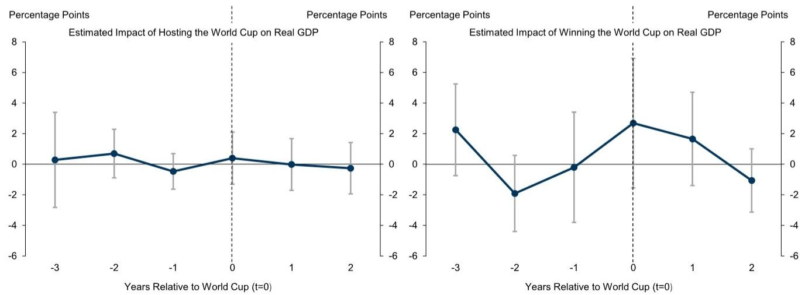
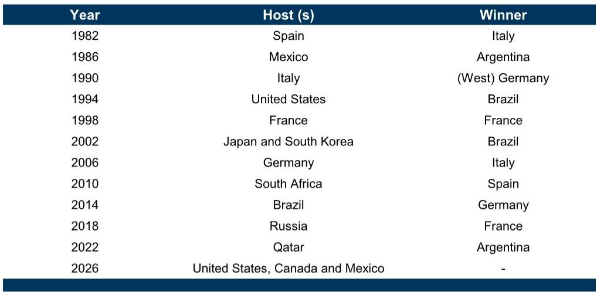

# 世界杯的真正经济账：情绪溢价远超GDP脉冲

如果你只关注世界杯对东道国GDP的拉动，你可能已经错过了这份报告最核心的判断。

某外资投行在最新发布的研报中，用严谨的计量经济学方法，拆解了一个困扰产业界和投资者多年的问题：世界杯这样的超级商业事件，到底能为东道国带来多少真实的经济增量？结论相当克制——甚至可以说，是给所有期待“赛事经济”带来结构性增长的人泼了一盆冷水。

报告分析了1982年以来11届世界杯东道国的GDP表现，使用双重差分法对比了50个发达和新兴经济体。结果发现：世界杯举办当年，东道国实际GDP确实出现了一个边际正效应，但这一效应在统计上并不显著。更关键的是，长期效应几乎为零。

这不是说世界杯没有经济价值。恰恰相反，报告揭示的真正价值，藏在另一个更难以量化的维度里——人们愿意为“赢”和“参与”支付的溢价，远远超过那些被反复计算的基础设施和旅游收入。

对于正在为2026年美加墨世界杯做准备的企业决策者和投资者而言，真正需要思考的问题不是“赛事能带来多少GDP”，而是“哪些商业价值被GDP统计遗漏了，而这些遗漏恰恰是超额收益的来源”。

## 1. 东道国的GDP“脉冲”更像一场统计幻觉

历届世界杯东道国的经济表现，揭示了一个令人不安但必须面对的事实：GDP数据上的“世界杯效应”极不稳定，且无法被系统性验证。

报告使用的样本涵盖了从1982年西班牙到2022年卡塔尔的11届赛事。东道国的GDP表现呈现巨大的离散度——1998年法国世界杯期间经济强劲，但1986年墨西哥世界杯期间经济疲弱，2022年卡塔尔则因为能源价格波动出现极端波动。这种高度异质性意味着，很难将GDP波动归因于世界杯本身。

更深层的原因在于三个结构性限制。

第一，只有很小一部分经济收益会留在东道国。全球超过50亿人观看世界杯，但绝大多数人不会踏入东道国半步。他们购买的啤酒、球衣和周边产品，大部分在各自国家消费，且很多产品本身就是进口的。东道国能够捕获的，只是整条价值链上极小的一段。

第二，世界杯相关支出究竟是真增量的，还是从其他消费中“转移”过来的？这是一个根本性问题。游客在赛事期间的消费，很可能只是替代了他们在其他时间、其他地点的消费。更关键的是，赛事还会“挤出”常规游客——那些因为担心拥堵和涨价而避开东道国的商务旅行者和普通观光客。

第三，也是最容易被忽视的：东道国的经济体量越大，世界杯的边际影响就越小。2026年有三个东道国，其经济总量约占全球GDP的30%（美国26%、加拿大2%、墨西哥2%），而2022年的卡塔尔仅占0.2%。一个固定金额的赛事投资，摊到美国这样庞大的经济体中，几乎不可能产生可观测的宏观脉冲。

所以，当FIFA宣称2026年世界杯将为美国带来172亿美元的GDP增量（约占季度GDP的0.2%）时，投资者需要问的是：这个数字是基于什么假设？它是否考虑了挤出效应和长期回落？

## 2. 夺冠的经济效应比主办更强，但窗口期极短

报告一个反直觉的发现是：赢得世界杯对经济的短期提振，反而比主办世界杯更明显。

数据显示，夺冠国家在赛事当年的GDP增速平均高出对照组约2.7个百分点。虽然这一结果同样未通过统计显著性检验——主要受1986年阿根廷夺冠后经济异常强劲的数据点影响——但信号方向是一致的。

这与该投行此前的一项权益市场研究形成了呼应：夺冠国家的股市在决赛后的一个月内，平均跑赢全球市场3.5%。但三个月后，这一超额收益显著衰减。

这意味着什么？对于投资者而言，世界杯相关的交易机会是极其短暂且高度不确定的。它更像一个事件驱动的短期博弈，而非可以长期持有的结构性主题。那些在赛事前买入“夺冠热门国家”资产并期待持续回报的策略，历史数据并不支持。

更重要的是，这一发现指向了一个更深层的价值来源：情绪溢价。夺冠带来的民族自豪感和集体幸福感，在短期内确实能够转化为消费和投资行为的改变，但这种转化是脉冲式的，且难以持续。

## 3. 真正被低估的价值：人们愿意为“赢”支付的价格

如果GDP效应如此微弱，世界杯的商业价值究竟在哪里？报告提供了一个更具洞察力的分析框架——“支付意愿”原则。

这一方法试图量化的是“快乐溢价”或“心理收入”。研究者通过调查询问受访者：你愿意为你的国家赢得世界杯支付多少钱？

结果令人深思。2014年世界杯期间，德国受访者平均愿意支付23欧元（按当前价值约32欧元）来换取德国队夺冠。而且，随着德国队一路晋级，这一平均金额还在上升。另一项针对美国公众的调查显示，受访者愿意通过额外纳税来资助一项旨在提高美国队未来世界杯成绩的国家计划，其金额相当于该计划成本的两倍。

这些数字加总起来，远超过任何GDP模型测算的赛事经济收益。它们指向一个核心事实：世界杯的真正经济价值，不在于它拉动了多少水泥、啤酒或机票销售，而在于它创造了一种稀缺的、难以复制的集体体验。

对于商业决策者而言，这意味着什么？如果你试图从世界杯中获利，最有效的策略不是押注东道国的宏观经济，而是寻找那些能够直接捕获“情绪溢价”的资产和商业模式。体育用品、啤酒、酒店和航空公司的受益逻辑，恰恰在于它们与这种集体体验直接挂钩，而非与GDP统计相关。

## 4. 报告尚未完全回答的关键问题：情绪溢价如何被货币化

尽管“支付意愿”框架提供了新的分析视角，但报告也坦承，这一领域的研究仍然有限。几个关键问题尚未得到充分解答。

第一，情绪溢价的货币化路径是什么？消费者愿意为“赢”支付的价格，如何转化为企业收入和利润？是通过更高的品牌忠诚度、更强的定价权，还是通过短期内激增的冲动性消费？不同的行业可能有完全不同的捕获机制。

第二，情绪溢价的可持续性如何？夺冠后的“快乐效应”会持续多久？如果像股市表现一样，三个月后就显著消退，那么企业应该在赛事前还是赛事后投入资源？这个时间窗口的错配可能意味着巨大的资源浪费。

第三，也是最具挑战性的：如何提前识别哪些品牌或资产最能捕获情绪溢价？不是所有与体育相关的公司都能从中受益。报告列举了具体的受益公司名单，但背后的选择逻辑——哪些特征使得某些公司更有可能成为赢家——并没有充分展开。

这些未解问题，恰恰是深度讨论和进一步研究的起点。

## 5. 投资者和决策者的观察框架：从“GDP脉冲”转向“情绪捕获”

基于报告的完整逻辑，我们可以提炼出一个更有效的观察框架，帮助读者在2026年世界杯前做出更有依据的判断。

第一，放弃对东道国宏观经济的线性外推。不要因为世界杯就看好美国、加拿大或墨西哥的GDP增长。历史数据已经证明，这种关联极其脆弱。如果你在考虑投资这些国家的指数基金或基础设施相关资产，世界杯不应该成为一个决策变量。

第二，聚焦于那些能够直接捕获“赛事情绪”的行业和公司。报告提到的欧洲和美国消费必需品、美国零售、酒店住宿和航空公司，其受益逻辑在于它们的产品和服务直接嵌入球迷的观赛体验。但需要注意，这种受益是短期的，且已经被市场部分定价。

第三，关注“支付意愿”框架下的结构性机会。如果消费者愿意为“赢”支付溢价，那么能够创造或放大这种“赢”体验的公司——无论是通过内容、技术还是服务——可能拥有更持久的定价权。这一逻辑超越了单一赛事，指向更长期的消费趋势。

第四，警惕“挤出效应”带来的误判。常规游客的减少、其他消费的转移，这些负向效应往往被乐观预测所忽略。对于酒店、航空和旅游行业，真正需要评估的不是“增量游客”，而是“净增量游客”。

最终，这份报告给我们的最大启示或许在于：我们习惯于用GDP、就业、旅游收入这些宏观指标来衡量大型事件的价值，但真正驱动商业回报的，往往是那些无法被GDP统计捕捉的微观情绪。在2026年世界杯的赌桌上，与其押注整个国家的GDP，不如找到那些能直接触摸球迷心跳的资产。

---

欢迎来到星球微信群继续讨论。我们会在群里拆解报告尚未完全展开的细节——比如情绪溢价的行业捕获机制、具体公司的受益弹性测算、以及那些未被充分定价的“赢家诅咒”风险。这些内容在公开报告中只是一笔带过，但在深度讨论中，它们往往才是真正的超额收益来源。

Personal reading notes and learning share only. Not investment advice.

