# US High Grade Credit Outlook

High yields, strong credit fundamentals can push spreads tighter amidst higher macro uncertainty

# Nathaniel Rosenbaum AC

Head of US HG Credit Strategy

(212) 834-2370

nathaniel.rosenbaum@JPM.com

JPM Securities LLC

# Silvi Mantri AC

US HG Credit Strategist

(212) 834-7239

silvi.mantri@JPM.com

JPM Securities LLC

natural_image

Nighttime aerial view of a modern skyscraper with illuminated glass facades and geometric architecture, surrounded by city lights and a distant skyline (no visible text or symbols)

# HG Forecast: Expecting spreads to tighten with moderate total and excess returns

Our spread forecast is 85bp, return forecast is +4.5% 

<table><tr><td></td><td>12/31/25</td><td>Current</td><td>YE 2026F</td><td>Change</td></tr><tr><td>HG spread</td><td>89bp</td><td>96bp</td><td>85bp</td><td>-11bp</td></tr><tr><td>HG yield</td><td>5.2%</td><td>5.4%</td><td>5.3%</td><td>-0.1%</td></tr><tr><td>HG total return</td><td>7.8%</td><td>-0.2%</td><td>4.5%</td><td>4.7%</td></tr><tr><td>HG excess return</td><td>2.0%</td><td>-0.1%</td><td>1.5%</td><td>1.6%</td></tr><tr><td>HG gross supply</td><td>$1.64tr</td><td>$648bn</td><td>$1.83tr</td><td>$1.18tr</td></tr><tr><td>HG net supply</td><td>$616bn</td><td>$346bn</td><td>$826bn</td><td>$480bn</td></tr><tr><td>Rising Stars</td><td>$10bn</td><td>$1bn</td><td>$17bn</td><td>$16bn</td></tr><tr><td>Fallen Angels</td><td>$55bn</td><td>$24bn</td><td>$31bn</td><td>$7bn</td></tr></table>

JPM's economic and rates outlook: Steady growth 

<table><tr><td rowspan="2"></td><td>Actual</td><td colspan="7">US economic forecasts</td></tr><tr><td>4Q25</td><td>1Q26</td><td>2Q26</td><td>3Q26</td><td>4Q26</td><td>2025</td><td>2026</td><td>2027</td></tr><tr><td>Real GDP (%q/q, saar)</td><td>0.7</td><td>3.3</td><td>1.5</td><td>1.5</td><td>1.8</td><td>2.0</td><td>2.0</td><td>2.0</td></tr><tr><td>Real consumer spending (%q/q, saar)</td><td>2.0</td><td>1.5</td><td>1.5</td><td>1.4</td><td>1.5</td><td>2.1</td><td>1.5</td><td>1.7</td></tr><tr><td>Core PCE prices (%q/q, saar)</td><td>2.7</td><td>4.0</td><td>3.3</td><td>2.6</td><td>2.2</td><td>2.9</td><td>3.0</td><td>2.4</td></tr><tr><td>Unemployment rate (%, qtr avg)</td><td>4.5</td><td>4.4</td><td>4.4</td><td>4.3</td><td>4.2</td><td>4.3</td><td>4.3</td><td>4.1</td></tr><tr><td>Fed funds target (%, top of range)</td><td>3.75</td><td>3.75</td><td>3.75</td><td>3.75</td><td>3.75</td><td></td><td></td><td></td></tr><tr><td>2yr Treasury</td><td>3.47</td><td>-</td><td>3.70</td><td>3.80</td><td>3.85</td><td></td><td></td><td></td></tr><tr><td>5yr Treasury</td><td>3.73</td><td>-</td><td>3.90</td><td>4.00</td><td>4.05</td><td></td><td></td><td></td></tr><tr><td>10yr Treasury</td><td>4.17</td><td>-</td><td>4.25</td><td>4.30</td><td>4.35</td><td></td><td></td><td></td></tr><tr><td>30yr Treasury</td><td>4.84</td><td>-</td><td>4.85</td><td>4.85</td><td>4.85</td><td></td><td></td><td></td></tr></table>

Note: Current is as of 04/02/2026   
Source: JPM.   
Note: Full-year 2025/2026 Real GDP, Consumer spending & Core PCE prices reflect %q4/q4, Unemployment rate reflects %y/y, Source: JPM forecasts as of 03/13/2026

# The ongoing conundrum: Still tight spreads versus attractive yields

HG bond spreads off recent tights   
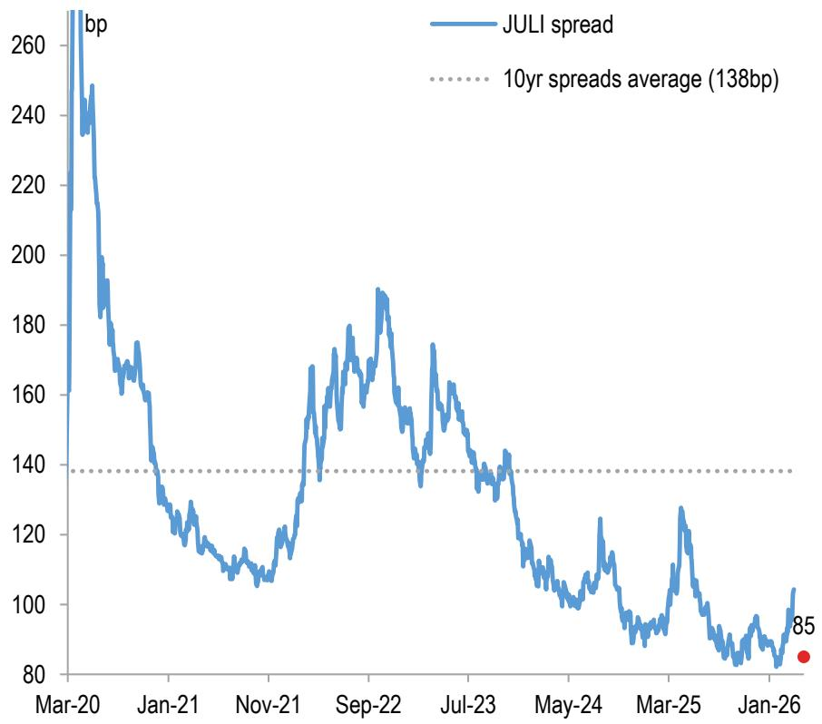

line

| Date    | JULI spread |
|---------|-------------|
| Jan-26  | 85          |

Source: JPM. As of 03/16/2026

HG bond yields are at a level which has led to strong demand   
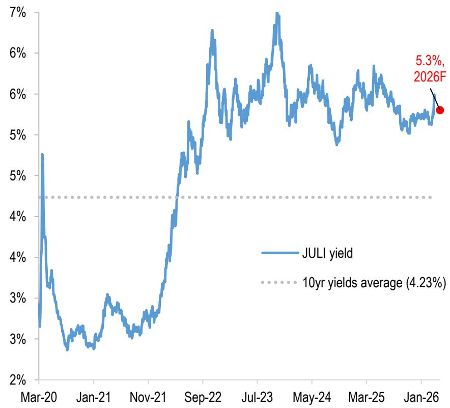

line

| Date    | JULI yield |
|---------|------------|
| Jan-26  | 5.3%       |

Source: JPM. As of 03/16/2026

# Fundamentals are strong but fundamental uncertainty is higher, a restraint on ‘animal spirits’

US growth continues to surprise to the upside   
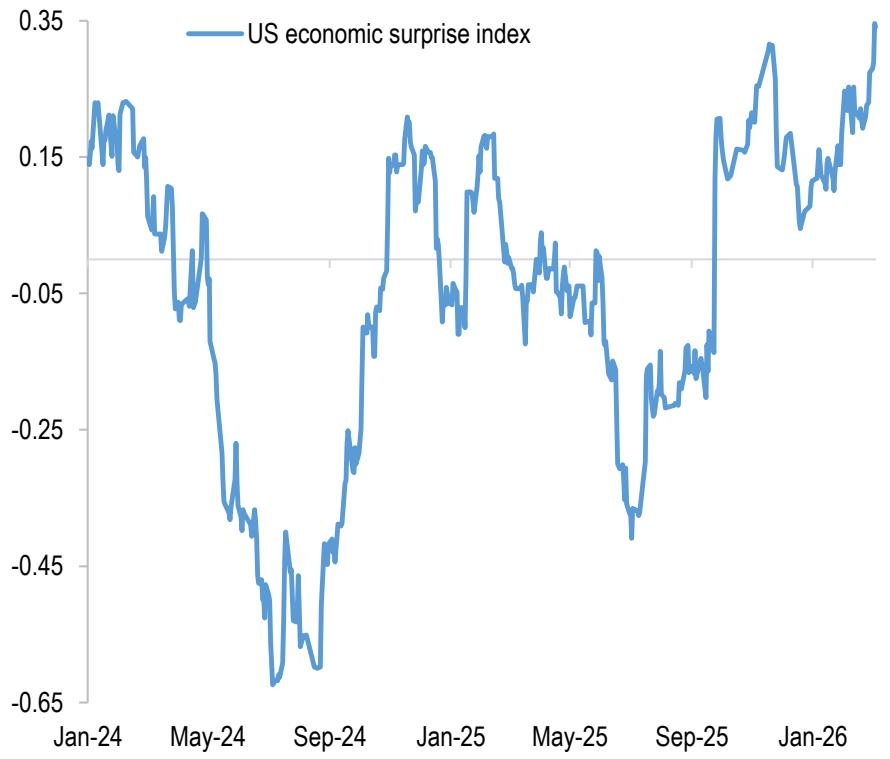

line

| Date    | US economic surprise index |
|---------|----------------------------|
| Jan-24  | 0.15                       |
| May-24  | -0.05                      |
| Sep-24  | -0.65                      |
| Jan-25  | 0.15                       |
| May-25  | -0.05                      |
| Sep-25  | -0.65                      |
| Jan-26  | 0.35                       |

Source: JPM. Bloomberg L.P. Finance

But the uncertainty around future growth prospects is rising   
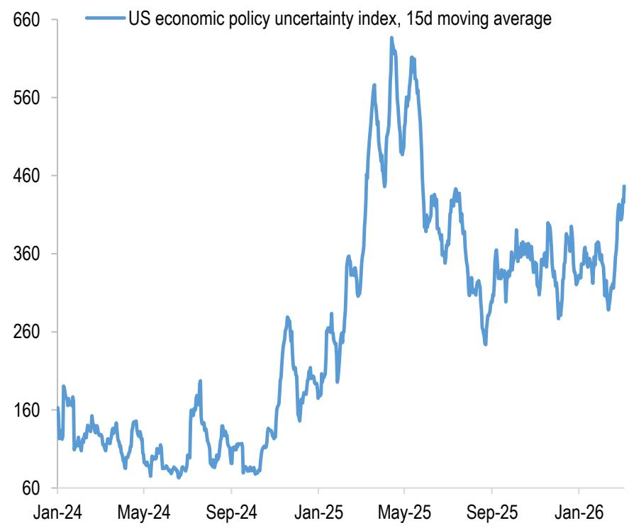

line

| Date   | US economic policy uncertainty index |
|--------|--------------------------------------|
| Jan-24 | 160                                  |
| May-24 | 140                                  |
| Sep-24 | 130                                  |
| Jan-25 | 260                                  |
| May-25 | 580                                  |
| Sep-25 | 360                                  |
| Jan-26 | 480                                  |

Source: JPM. Bloomberg L.P. Finance

# The Middle East conflict may move markets near term but it's unlikely to be a negative for spreads unless the Fed hikes

<table><tr><td rowspan="2">Geopolitical event</td><td colspan="4">Total return</td><td colspan="4">Spread change (bp)</td><td rowspan="2">Fed rate at conflict start (%)</td><td rowspan="2">Rate change in 12m (%)</td></tr><tr><td>1m</td><td>3m</td><td>6m</td><td>12m</td><td>1m</td><td>3m</td><td>6m</td><td>12m</td></tr><tr><td>Arab Israeli War (Oct 1973)</td><td>1.1%</td><td>-0.2%</td><td>-5.9%</td><td>-5.0%</td><td></td><td></td><td></td><td></td><td>9.00</td><td>0.25</td></tr><tr><td>USSR - Afghanistan War (Dec 1979)</td><td>-1.0%</td><td>-0.5%</td><td>4.4%</td><td>-8.7%</td><td></td><td></td><td></td><td></td><td>10.00</td><td>4.00</td></tr><tr><td>Iran-Iraq War (Sept 1980)</td><td>-1.0%</td><td>1.3%</td><td>1.0%</td><td>-6.6%</td><td></td><td></td><td></td><td></td><td>12.00</td><td>3.50</td></tr><tr><td>Falkland&#x27;s War (April 1982)</td><td>1.9%</td><td>4.0%</td><td>24.9%</td><td>41.6%</td><td></td><td></td><td></td><td></td><td>13.00</td><td>-4.50</td></tr><tr><td>US Grenada conflict (Oct 1983)</td><td>1.2%</td><td>3.7%</td><td>0.3%</td><td>14.2%</td><td></td><td></td><td></td><td></td><td>9.50</td><td>0.50</td></tr><tr><td>US Libya a conflict (Apr 1986)</td><td>-1.1%</td><td>1.2%</td><td>4.7%</td><td>6.1%</td><td></td><td></td><td></td><td></td><td>6.75</td><td>-0.25</td></tr><tr><td>Gulf War (Aug 1990)</td><td>0.5%</td><td>3.0%</td><td>7.6%</td><td>15.2%</td><td>14</td><td>50</td><td>30</td><td>2</td><td>8.00</td><td>-2.50</td></tr><tr><td>Somalia Intervention (Dec 1992)</td><td>2.3%</td><td>5.0%</td><td>8.6%</td><td>12.2%</td><td>-2</td><td>-6</td><td>-11</td><td>-15</td><td>3.00</td><td>0.00</td></tr><tr><td>Bosnia Intervention (Feb 1994)</td><td>-3.1%</td><td>-4.4%</td><td>-2.1%</td><td>1.4%</td><td>6</td><td>13</td><td>4</td><td>5</td><td>3.25</td><td>2.75</td></tr><tr><td>Kosovo War (Mar 1999)</td><td>0.3%</td><td>-1.6%</td><td>-1.3%</td><td>0.2%</td><td>0</td><td>10</td><td>20</td><td>44</td><td>4.75</td><td>1.25</td></tr><tr><td>Afghanistan War (Oct 2001)</td><td>-0.8%</td><td>-0.7%</td><td>-0.7%</td><td>3.6%</td><td>-23</td><td>-29</td><td>-14</td><td>46</td><td>2.50</td><td>-1.00</td></tr><tr><td>Iraq War (Mar 2003)</td><td>2.0%</td><td>5.1%</td><td>5.0%</td><td>9.0%</td><td>-26</td><td>-36</td><td>-48</td><td>-62</td><td>1.25</td><td>-0.25</td></tr><tr><td>Russia Crimea conflict (Sep 2014)</td><td>0.1%</td><td>2.6%</td><td>4.2%</td><td>6.5%</td><td>-3</td><td>-8</td><td>-7</td><td>14</td><td>0.13</td><td>0.00</td></tr><tr><td>Russia Ukraine War (Feb 2022)</td><td>-2.5%</td><td>-7.0%</td><td>-9.4%</td><td>-10.4%</td><td>-6</td><td>8</td><td>18</td><td>2</td><td>0.13</td><td>4.50</td></tr><tr><td>Average (1990-present)</td><td>-0.2%</td><td>0.3%</td><td>1.5%</td><td>4.7%</td><td>-5</td><td>0</td><td>-1</td><td>5</td><td></td><td>0.59</td></tr><tr><td>Std Dev (1990-present)</td><td>1.9%</td><td>4.4%</td><td>6.0%</td><td>8.0%</td><td>14</td><td>27</td><td>25</td><td>34</td><td></td><td>2.20</td></tr><tr><td>Average when Fed was hiking</td><td>-1.8%</td><td>-4.3%</td><td>-4.3%</td><td>-3.0%</td><td>0</td><td>10</td><td>14</td><td>17</td><td></td><td></td></tr><tr><td>Average when Fed was cutting/paused</td><td>0.8%</td><td>3.0%</td><td>4.9%</td><td>9.3%</td><td>-8</td><td>-6</td><td>-10</td><td>-3</td><td></td><td></td></tr></table>

Source: JPM.

A majority of current tariff revenue stems from IEEPA tariffs   
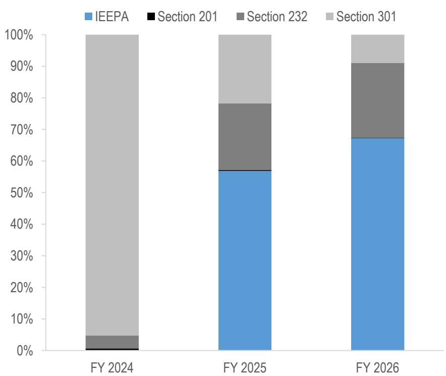

bar_stacked

| Fiscal Year | IEEPA | Section 201 | Section 232 | Section 301 |
|-------------|-------|-------------|-------------|-------------|
| FY 2024     | 0%    | 1%          | 5%          | 98%         |
| FY 2025     | 57%   | 0%          | 23%         | 21%         |
| FY 2026     | 67%   | 0%          | 23%         | 7%          |

Source: JPM, Bloomberg Finance L.P.

Static and Floating effective tariff rates   
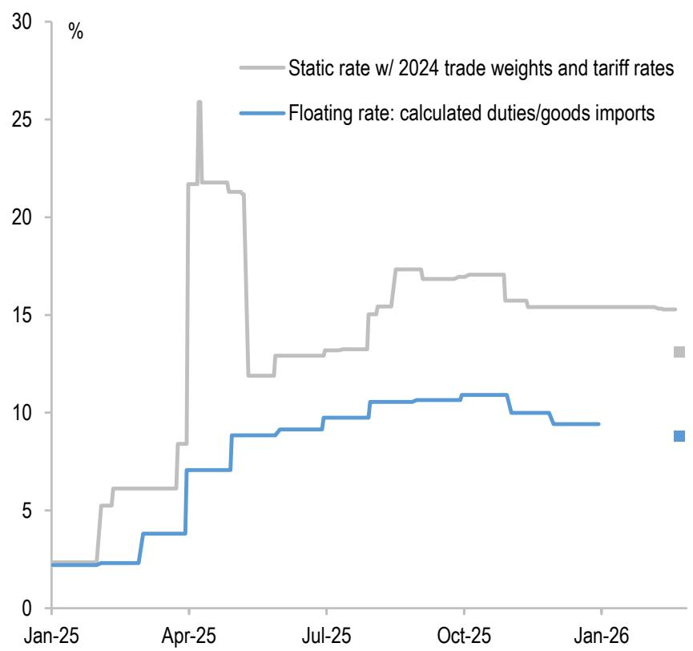

line

| Date   | Static rate w/ 2024 trade weights and tariff rates | Floating rate: calculated duties/goods imports |
|--------|--------------------------------------------------|-----------------------------------------------|
| Jan-25 | ~2%                                              | ~2%                                           |
| Apr-25 | ~26%                                             | ~7%                                           |
| Jul-25 | ~13%                                             | ~10%                                          |
| Oct-25 | ~17%                                             | ~11%                                          |
| Jan-26 | ~15%                                             | ~9%                                           |

Source: JPM, Census Bureau

The share of Treasuries has been steadily rising in the Aggregate index...   
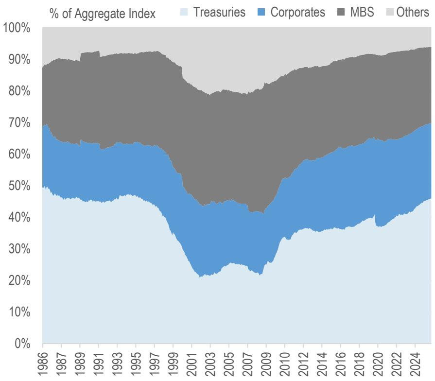

bar_stacked

| Year | Treasuries | Corporates | MBS | Others |
|------|------------|------------|-----|--------|
| 1986 | ~50%       | ~30%       | ~25%| ~10%   |
| 1987 | ~48%       | ~32%       | ~26%| ~10%   |
| 1989 | ~45%       | ~35%       | ~28%| ~10%   |
| 1991 | ~47%       | ~33%       | ~30%| ~10%   |
| 1993 | ~46%       | ~34%       | ~31%| ~10%   |
| 1995 | ~45%       | ~35%       | ~32%| ~10%   |
| 1997 | ~43%       | ~36%       | ~33%| ~10%   |
| 1999 | ~40%       | ~38%       | ~35%| ~10%   |
| 2001 | ~35%       | ~40%       | ~38%| ~10%   |
| 2003 | ~22%       | ~45%       | ~40%| ~10%   |
| 2005 | ~25%       | ~42%       | ~42%| ~10%   |
| 2007 | ~23%       | ~40%       | ~45%| ~10%   |
| 2009 | ~25%       | ~45%       | ~48%| ~10%   |
| 2011 | ~35%       | ~48%       | ~50%| ~10%   |
| 2013 | ~38%       | ~50%       | ~52%| ~10%   |
| 2015 | ~37%       | ~52%       | ~55%| ~10%   |
| 2017 | ~38%       | ~55%       | ~58%| ~10%   |
| 2019 | ~39%       | ~58%       | ~60%| ~10%   |
| 2021 | ~40%       | ~60%       | ~62%| ~10%   |
| 2023 | ~42%       | ~62%       | ~65%| ~10%   |
| 2024 | ~45%       | ~65%       | ~68%| ~10%   |

...and this has biased corporate spreads tighter   
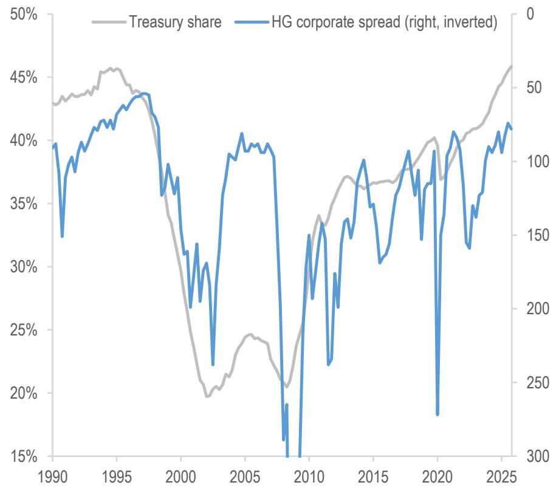

line

| Year | Treasury share | HG corporate spread (right, inverted) |
|------|----------------|----------------------------------------|
| 1990 | ~43%           | ~40%                                   |
| 1995 | ~46%           | ~44%                                   |
| 2000 | ~30%           | ~35%                                   |
| 2005 | ~25%           | ~40%                                   |
| 2010 | ~35%           | ~25%                                   |
| 2015 | ~37%           | ~30%                                   |
| 2020 | ~40%           | ~18%                                   |
| 2025 | ~46%           | ~42%                                   |

Source: JPM, Bloomberg Finance L.P.

# The global data center and AI buildout will be an extraordinary and sustained capital markets event

Data Center Installed Base (GW) vs. Annual Capex (\$bn)   
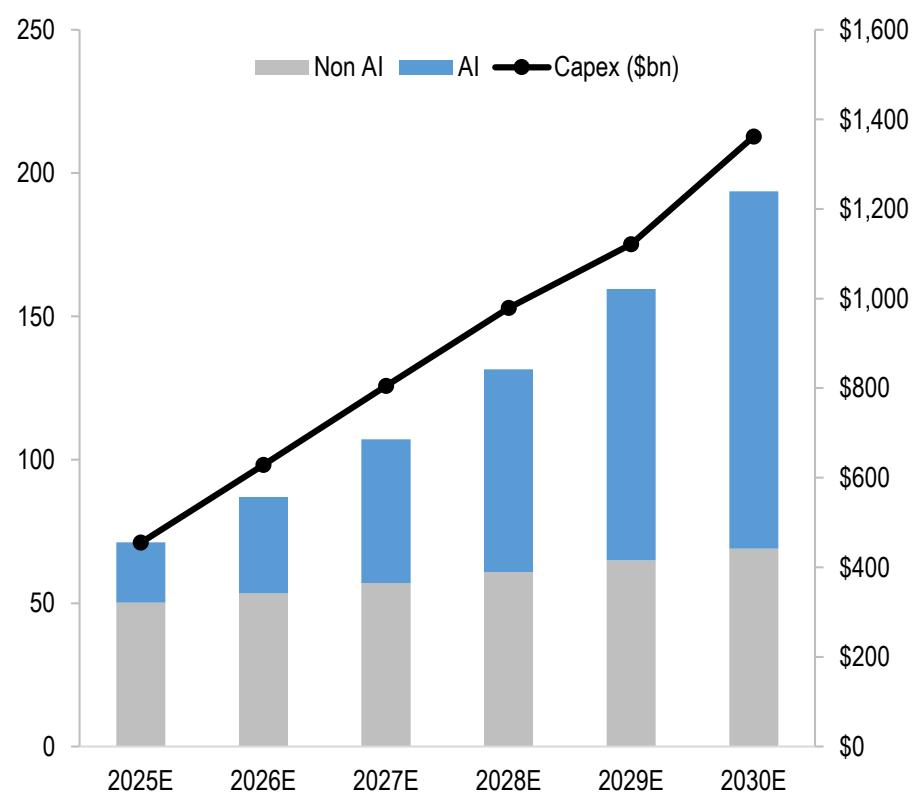

bar_line

| Year   | AI (Left Y-axis) | Non AI (Left Y-axis) | Capex ($bn) |
|--------|------------------|----------------------|-------------|
| 2025E  | ~70              | ~50                  | ~450        |
| 2026E  | ~85              | ~55                  | ~600        |
| 2027E  | ~105             | ~60                  | ~750        |
| 2028E  | ~130             | ~65                  | ~950        |
| 2029E  | ~160             | ~70                  | ~1100       |
| 2030E  | ~195             | ~75                  | ~1400       |

Source: JPM

AI/Data Center Funding Sources   
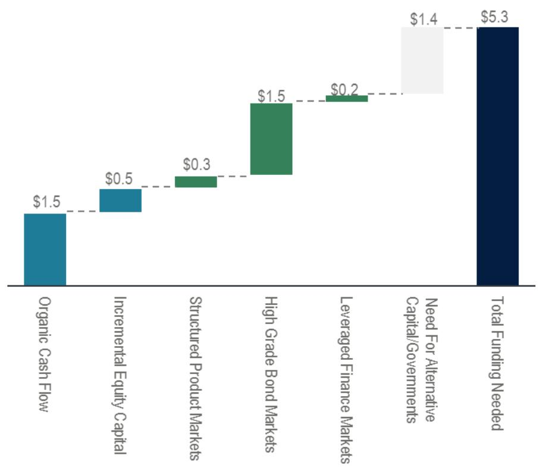

waterfall

| Category | Value ($) |
| :--- | :--- |
| Organic Cash Flow | 1.5 |
| Incremental Equity Capital | 0.5 |
| Structured Product Markets | 0.3 |
| High Grade Bond Markets | 1.5 |
| Leveraged Finance Markets | 0.2 |
| Need For Alternative Capital/Governments | 1.4 |
| Total Funding Needed | 5.3 |

Source: : JPM estimates. Reflects assumed permanent financings.

HG Data Center issuance in the HG bond market has gone from far behind to far ahead of the asset-backed markets   
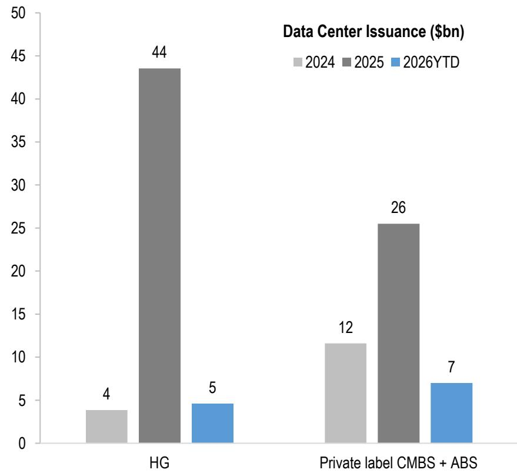

bar

Data Center Issuance ($bn)
| Category | 2024 ($bn) | 2025 ($bn) | 2026YTD ($bn) |
| :--- | :--- | :--- | :--- |
| HG | 4 | 44 | 5 |
| Private label CMBS + ABS | 12 | 26 | 7 |

Source: JPM. As of 11/9/2025

Structuring funding to leverage the HG market instead of the ABS/CMBS markets opens up a larger pool of demand   
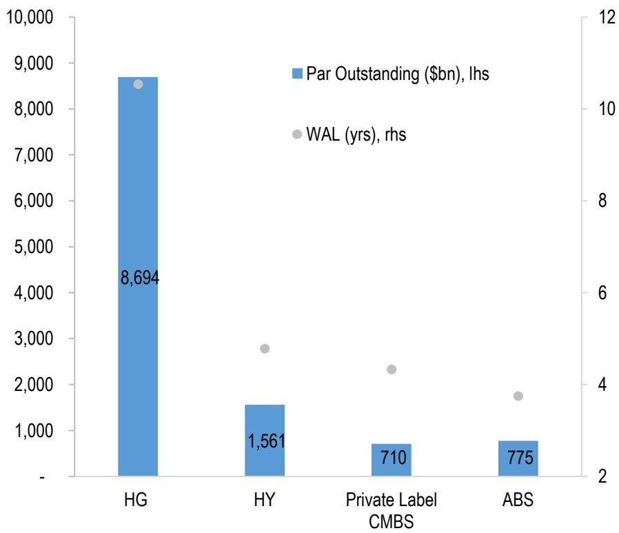

bar_line

| Category | Par Outstanding ($bn), lhs | WAL (yrs), rhs |
| :--- | :--- | :--- |
| HG | 8,694 | 10.5 |
| HY | 1,561 | 4.7 |
| Private Label CMBS | 710 | 4.3 |
| ABS | 775 | 3.8 |

Source: JPM. As of 11/9/2025

AI-related debt in the index by sectors   
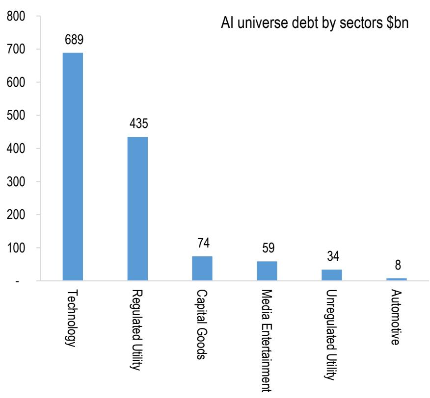

bar

AI universe debt by sectors $bn
| Sector | Debt ($bn) |
| :--- | :--- |
| Technology | 689 |
| Regulated Utility | 435 |
| Capital Goods | 74 |
| Media Entertainment | 59 |
| Unregulated Utility | 34 |
| Automotive | 8 |

Source: JPM, Dealogic

14.8% of IG debt is tied to AI, making it in a sense the biggest ‘sector’ in the market   
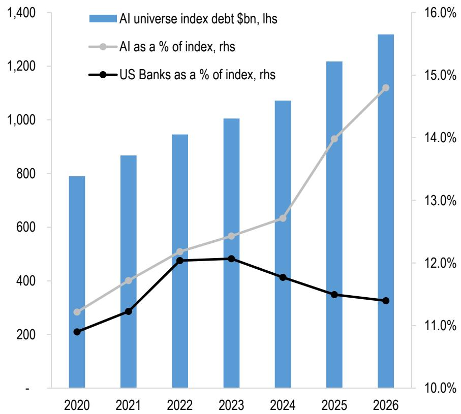

bar_line

| Year | AI universe index debt $bn, lhs | AI as a % of index, rhs | US Banks as a % of index, rhs |
|------|----------------------------------|--------------------------|-------------------------------|
| 2020 | 790                              | 11.0%                    | 11.0%                         |
| 2021 | 860                              | 11.5%                    | 11.5%                         |
| 2022 | 940                              | 12.0%                    | 12.0%                         |
| 2023 | 1000                             | 12.5%                    | 12.0%                         |
| 2024 | 1070                             | 13.0%                    | 11.5%                         |
| 2025 | 1210                             | 14.0%                    | 11.0%                         |
| 2026 | 1330                             | 15.0%                    | 11.0%                         |

Source: JPM

# Hyper-issuing: Already ahead of FY 2025 including non-USD which has doubled

Hyperscaler issuance: Non-USD portion rapidly expanding   
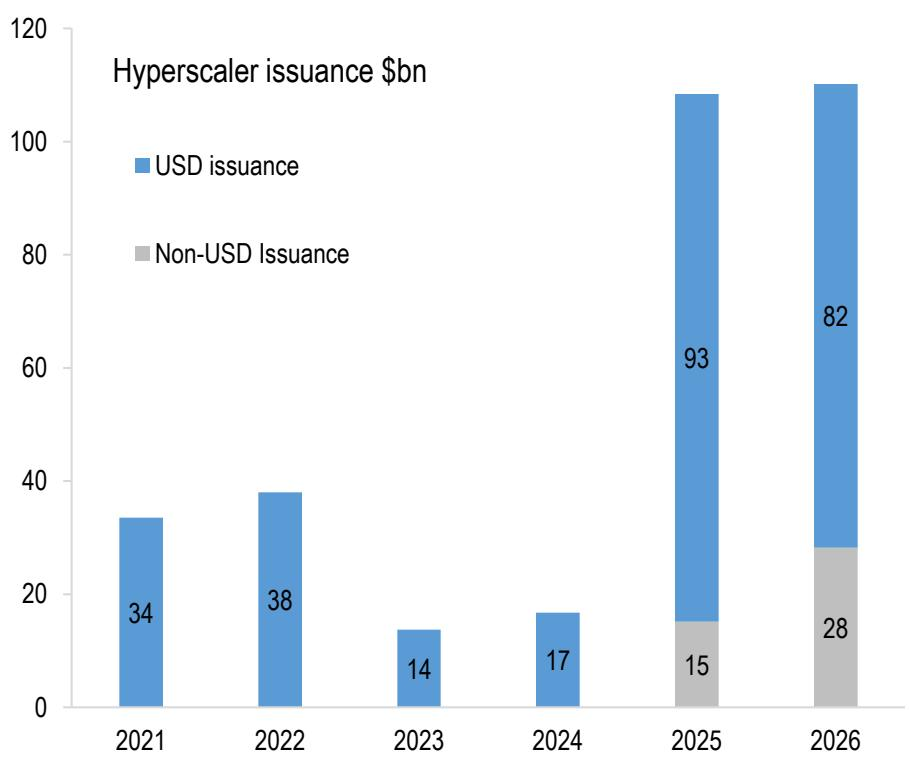

bar_stacked

Hyperscaler issuance $bn
| Year | USD issuance ($bn) | Non-USD Issuance ($bn) |
| :--- | :--- | :--- |
| 2021 | 34 | 0 |
| 2022 | 38 | 0 |
| 2023 | 14 | 0 |
| 2024 | 17 | 0 |
| 2025 | 93 | 15 |
| 2026 | 82 | 28 |

Source: JPM, Dealogic, Bloomberg Finance L.P.

Potentially more upside to issuance   
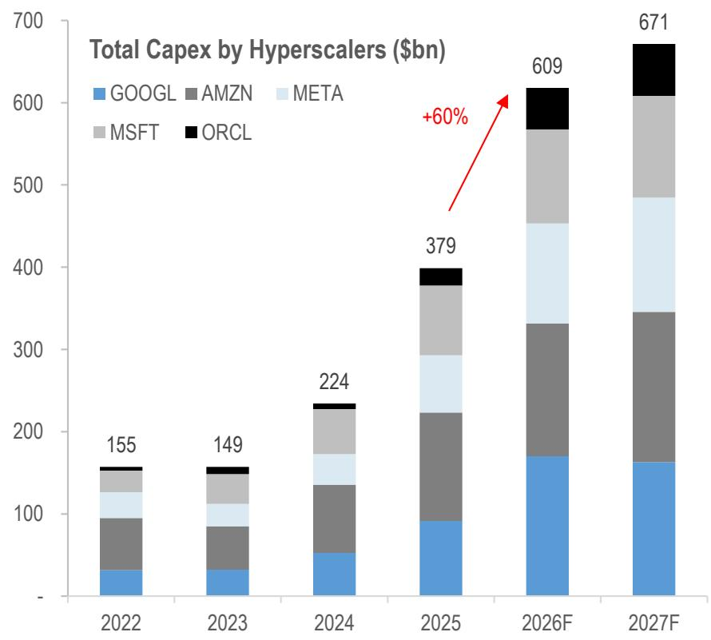

bar_stacked

| Year   | GOOGL | AMZN | META | MSFT | ORCL |
|--------|-------|------|------|------|------|
| 2022   | 35    | 60   | 30   | 30   | 5    |
| 2023   | 35    | 60   | 30   | 40   | 5    |
| 2024   | 50    | 80   | 40   | 60   | 5    |
| 2025   | 90    | 140  | 60   | 100  | 10   |
| 2026F  | 170   | 180  | 110  | 110  | 30   |
| 2027F  | 160   | 210  | 130  | 110  | 50   |

Source: JPM, Bloomberg Finance L.P.

# The HG bond market is growing at the slowest pace in 20 years heading into the AI funding boom, and maturities are elevated for next 5 years

The HG market is growing very slowly, a support for spreads   
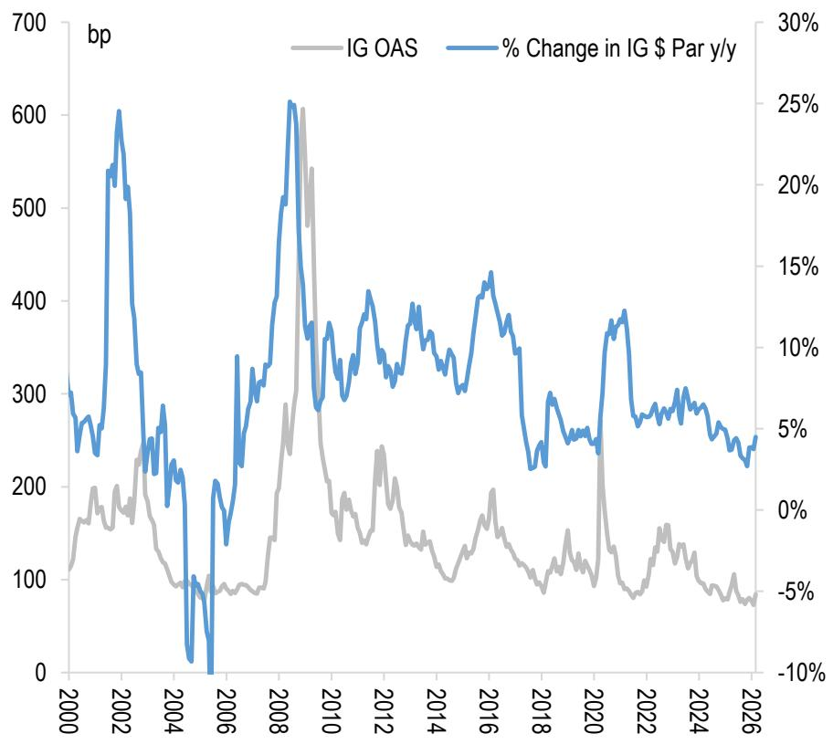

line

| Year | IG OAS (bp) | % Change in IG $ Par y/y (%) |
|------|-------------|-------------------------------|
| 2000 | ~150        | ~5                            |
| 2002 | ~200        | ~25                           |
| 2004 | ~100        | ~-5                           |
| 2006 | ~90         | ~-10                          |
| 2008 | ~300        | ~25                           |
| 2010 | ~600        | ~15                           |
| 2012 | ~250        | ~10                           |
| 2014 | ~150        | ~5                            |
| 2016 | ~200        | ~15                           |
| 2018 | ~100        | ~5                            |
| 2020 | ~150        | ~10                           |
| 2022 | ~150        | ~5                            |
| 2024 | ~100        | ~5                            |
| 2026 | ~75         | ~5                            |

Source: JPM, Bloomberg Finance L.P. As of 2/27/2026

There is no maturity wall in HG credit in the coming years but lots of maturities to re-invest   
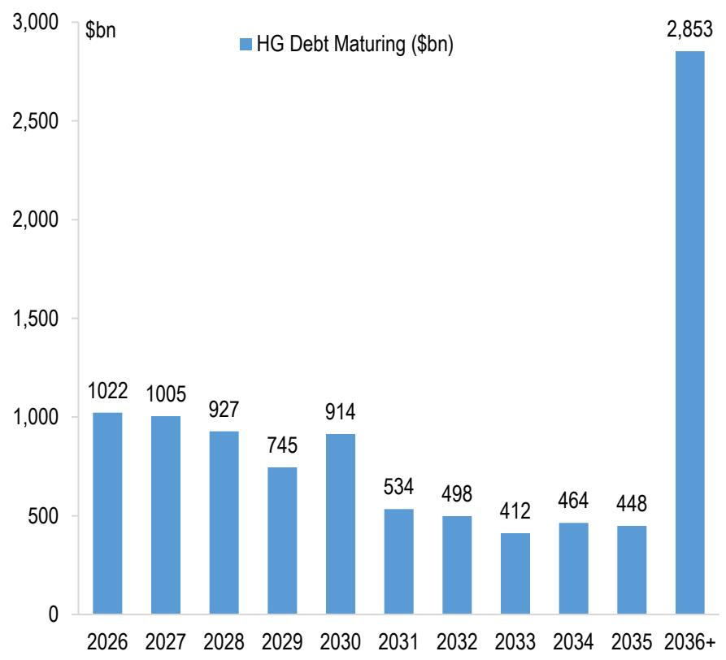

bar

HG Debt Maturing ($bn)
| Year | HG Debt Maturing ($bn) |
| :--- | :--- |
| 2026 | 1022 |
| 2027 | 1005 |
| 2028 | 927 |
| 2029 | 745 |
| 2030 | 914 |
| 2031 | 534 |
| 2032 | 498 |
| 2033 | 412 |
| 2034 | 464 |
| 2035 | 448 |
| 2036+ | 2,853 |

Source: JPM

Corp bond ownership across different investors classes   
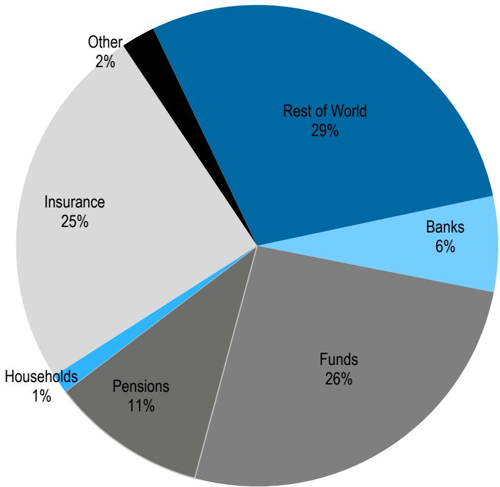

pie

| Category | Percentage (%) |
| :--- | :--- |
| Rest of World | 29 |
| Funds | 26 |
| Insurance | 25 |
| Pensions | 11 |
| Banks | 6 |
| Households | 1 |
| Other | 2 |

Source for both: JPM, Federal Reserve as of 4Q25.

Funds and overseas investor have led demand for US credit over the past 10 years   
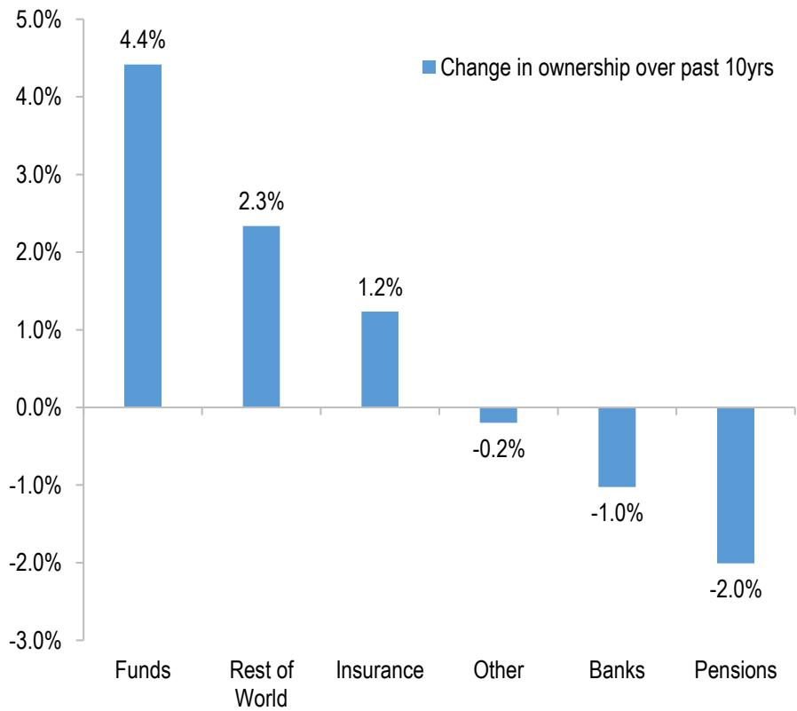

bar

| Category | Change in ownership over past 10yrs (%) |
| :--- | :--- |
| Funds | 4.4 |
| Rest of World | 2.3 |
| Insurance | 1.2 |
| Other | -0.2 |
| Banks | -1.0 |
| Pensions | -2.0 |

# Technicals: Domestic demand is strong even with low returns, e.g. high yields the key driver

Flows are sensitive to returns, but less so than in the past   
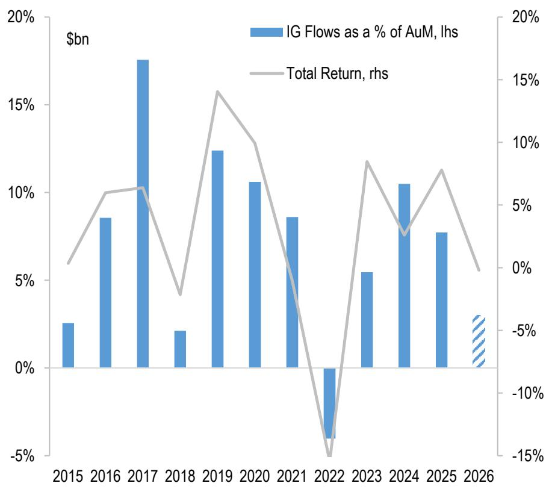

bar_line

| Year | IG Flows as a % of AuM, Ihs ($bn) | Total Return, rhs (%) |
|------|------------------------------------|------------------------|
| 2015 | 2.5                                | 6.0                    |
| 2016 | 8.5                                | 10.0                   |
| 2017 | 18.0                               | 10.5                   |
| 2018 | 2.0                                | 4.0                    |
| 2019 | 12.5                               | 15.5                   |
| 2020 | 10.5                               | 12.0                   |
| 2021 | 8.5                                | 6.0                    |
| 2022 | -3.5                               | -18.0                  |
| 2023 | 5.5                                | 11.5                   |
| 2024 | 10.5                               | 3.0                    |
| 2025 | 7.5                                | 11.5                   |
| 2026 | -1.0                               | -5.0                   |

Source: JPM, EPFR. As of 04/01/2026

HG benefitting from up in quality bias evident in fund flows YTD   
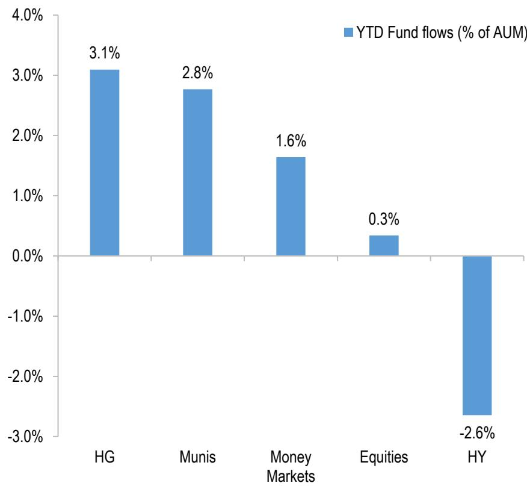

bar

| Category | YTD Fund flows (% of AUM) |
| :--- | :--- |
| HG | 3.1% |
| Munis | 2.8% |
| Money Markets | 1.6% |
| Equities | 0.3% |
| HY | -2.6% |

Source: JPM, EPFR. As of 04/01/2026

When returns are +/- 2.5% over a 3m period there is a strong correlation to fund flows   
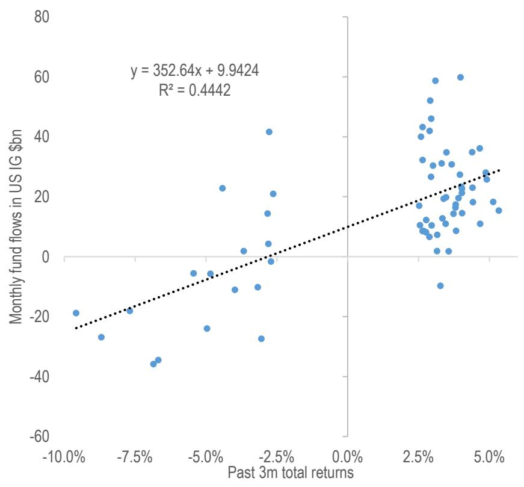

scatter

| Past 3m total returns | Monthly fund flows in US IG $bn |
| --------------------- | ------------------------------ |
| -10.0%                | -20.0                          |
| -7.5%                 | -30.0                          |
| -5.0%                 | -10.0                          |
| -2.5%                 | 0.0                            |
| 0.0%                  | 10.0                           |
| 2.5%                  | 20.0                           |
| 5.0%                  | 30.0                           |

Source: JPM, EPFR. As of 2/25/2026

A >55bp increase in yields is required to trigger outflows   
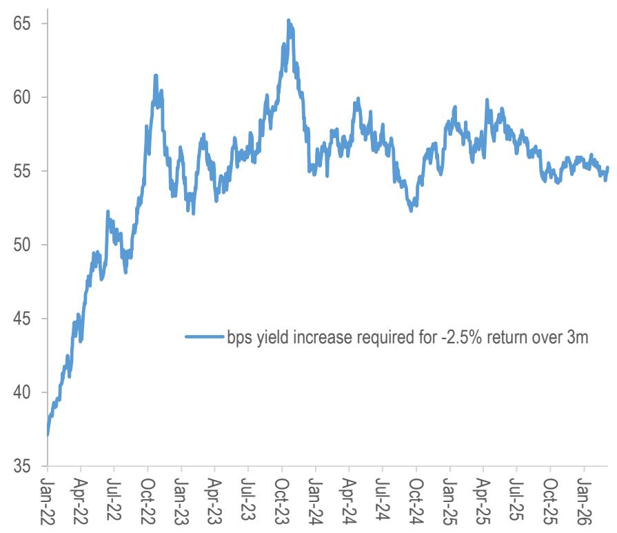

line

| Date   | bps yield increase required for -2.5% return over 3m |
|--------|-----------------------------------------------------|
| Jan-22 | 37.0                                                |
| Apr-22 | 48.0                                                |
| Jul-22 | 52.0                                                |
| Oct-22 | 61.0                                                |
| Jan-23 | 53.0                                                |
| Apr-23 | 57.0                                                |
| Jul-23 | 56.0                                                |
| Oct-23 | 65.0                                                |
| Jan-24 | 55.0                                                |
| Apr-24 | 59.0                                                |
| Jul-24 | 57.0                                                |
| Oct-24 | 52.0                                                |
| Jan-25 | 58.0                                                |
| Apr-25 | 60.0                                                |
| Jul-25 | 57.0                                                |
| Oct-25 | 55.0                                                |
| Jan-26 | 54.0                                                |

Source: JPM

# Technicals: Foreign demand RV has been steadily improving – current strong demand likely a reflection of this dynamic

FX hedging costs for Japan and Taiwan still high but trending down whereas Eurozone rangebound   
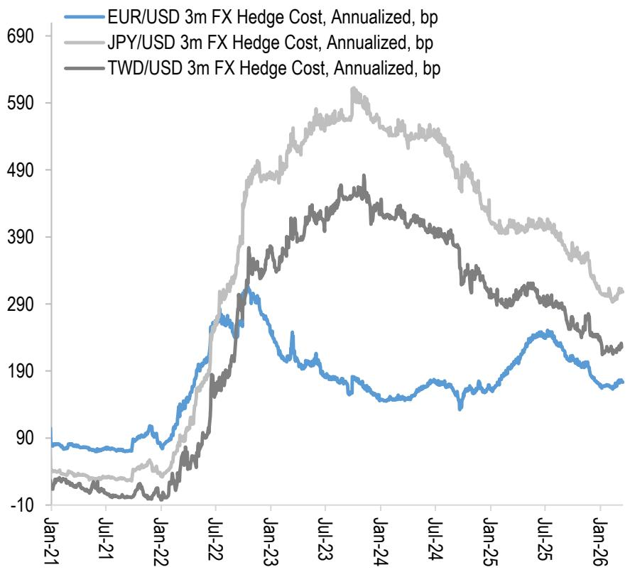

line

| Date   | EUR/USD 3m FX Hedge Cost, Annualized, bp | JPY/USD 3m FX Hedge Cost, Annualized, bp | TWD/USD 3m FX Hedge Cost, Annualized, bp |
|--------|------------------------------------------|------------------------------------------|------------------------------------------|
| Jan-21 | ~85                                      | ~70                                      | ~60                                      |
| Jul-21 | ~80                                      | ~65                                      | ~55                                      |
| Jan-22 | ~90                                      | ~85                                      | ~75                                      |
| Jul-22 | ~180                                     | ~200                                     | ~170                                     |
| Jan-23 | ~220                                     | ~450                                     | ~350                                     |
| Jul-23 | ~190                                     | ~520                                     | ~400                                     |
| Jan-24 | ~170                                     | ~480                                     | ~380                                     |
| Jul-24 | ~180                                     | ~450                                     | ~350                                     |
| Jan-25 | ~190                                     | ~380                                     | ~300                                     |
| Jul-25 | ~170                                     | ~350                                     | ~280                                     |
| Jan-26 | ~180                                     | ~300                                     | ~250                                     |

Source : JPM; Bloomberg Finance L.P. As of 03/16/2026

The trajectory for hedging costs is lower such the RV is expected to improve   
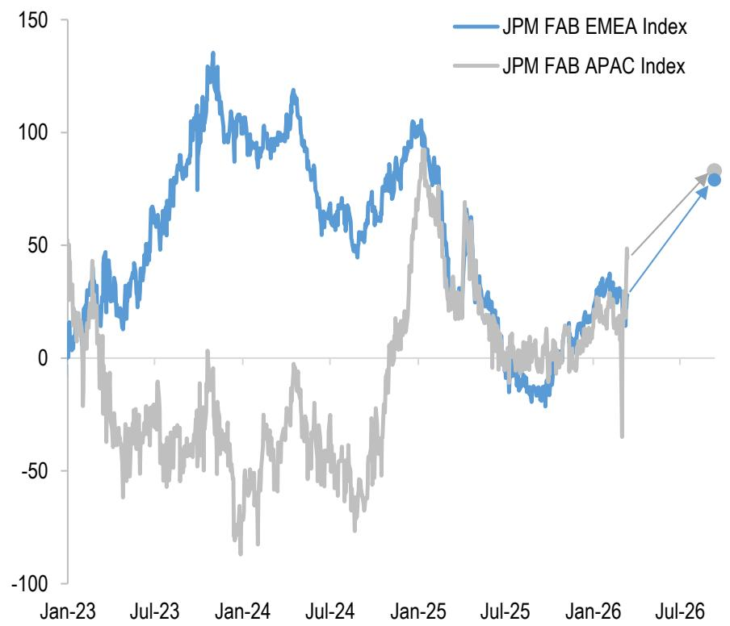

line

| Date   | JPM FAB EMEA Index | JPM FAB APAC Index |
|--------|--------------------|--------------------|
| Jan-23 | ~10                | ~50                |
| Jul-23 | ~60                | ~-20               |
| Jan-24 | ~130               | ~-80               |
| Jul-24 | ~70                | ~-60               |
| Jan-25 | ~100               | ~90                |
| Jul-25 | ~30                | ~-10               |
| Jan-26 | ~30                | ~-30               |
| Jul-26 | ~80                | ~80                |

Source: JPM, Bloomberg Finance L.P. As of 03/13/2026

Policy rate convergence implies lower hedging costs, especially if the BoJ hikes in 2026   
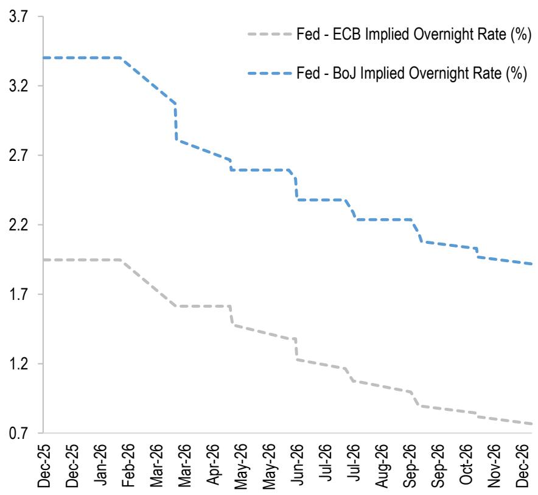

line

| Month    | Fed - ECB Implied Overnight Rate (%) | Fed - BoJ Implied Overnight Rate (%) |
| -------- | ------------------------------------ | ------------------------------------ |
| Dec-25   | 1.8                                  | 3.3                                  |
| Dec-26   | 1.8                                  | 3.3                                  |
| Jan-26   | 1.8                                  | 3.3                                  |
| Feb-26   | 1.8                                  | 3.3                                  |
| Mar-26   | 1.7                                  | 3.1                                  |
| Apr-26   | 1.7                                  | 2.9                                  |
| May-26   | 1.6                                  | 2.7                                  |
| Jun-26   | 1.4                                  | 2.7                                  |
| Jul-26   | 1.2                                  | 2.4                                  |
| Aug-26   | 1.1                                  | 2.4                                  |
| Sep-26   | 0.9                                  | 2.2                                  |
| Oct-26   | 0.8                                  | 2.1                                  |
| Nov-26   | 0.7                                  | 2.0                                  |
| Dec-26   | 0.7                                  | 1.9                                  |

Source: JPM, Bloomberg Finance L.P.

Rising JGB yields may potentially moderate the uptick in foreign demand from lower hedging costs   
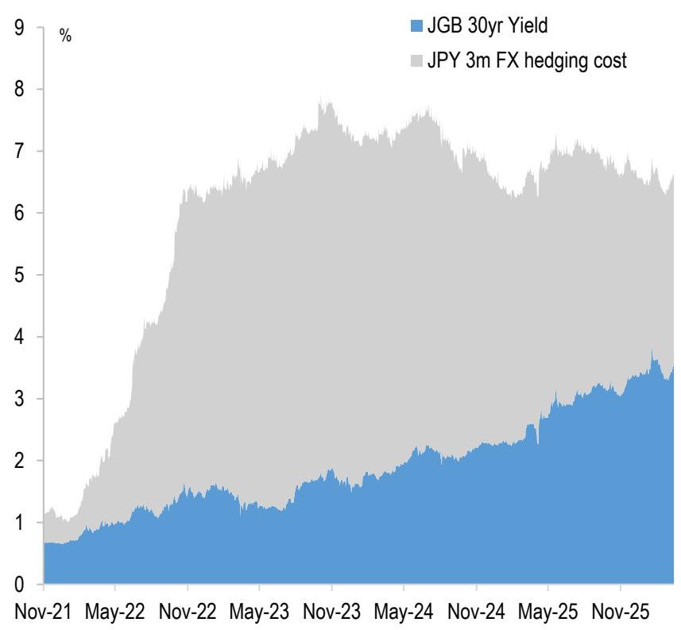

area

| Date    | JGB 30yr Yield | JPY 3m FX hedging cost |
|---------|----------------|------------------------|
| Nov-21  | ~0.7           | ~0.4                   |
| May-22  | ~1.0           | ~1.5                   |
| Nov-22  | ~1.2           | ~3.0                   |
| May-23  | ~1.5           | ~4.5                   |
| Nov-23  | ~1.8           | ~5.5                   |
| May-24  | ~2.0           | ~5.0                   |
| Nov-24  | ~2.2           | ~4.5                   |
| May-25  | ~2.5           | ~4.0                   |
| Nov-25  | ~3.0           | ~3.5                   |

Source: JPM, Bloomberg Finance L.P.

# Technicals: Taiwan a renewed buyer of the long-end

Taiwan demand was flat in recent years but we expect this To inflect higher in 2026 post regulatory changes   
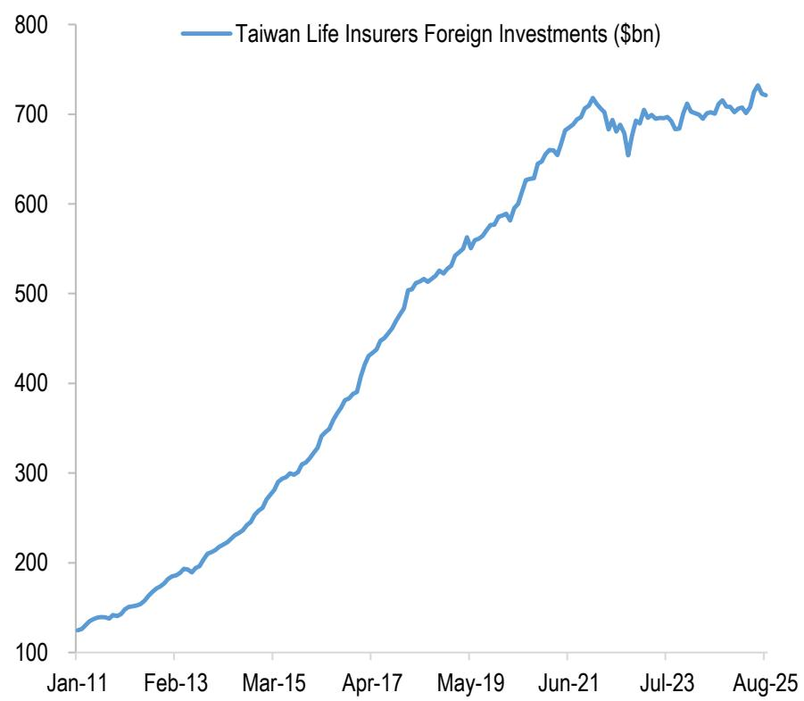

line

| Date   | Taiwan Life Insurers Foreign Investments ($bn) |
|--------|--------------------------------------------------|
| Jan-11 | 120                                              |
| Feb-13 | 180                                              |
| Mar-15 | 280                                              |
| Apr-17 | 400                                              |
| May-19 | 550                                              |
| Jun-21 | 700                                              |
| Jul-23 | 680                                              |
| Aug-25 | 720                                              |

Source: JPM, Bloomberg Finance L.P.

Overnight trading volumes at record high and proportion highest since Q1 2022   
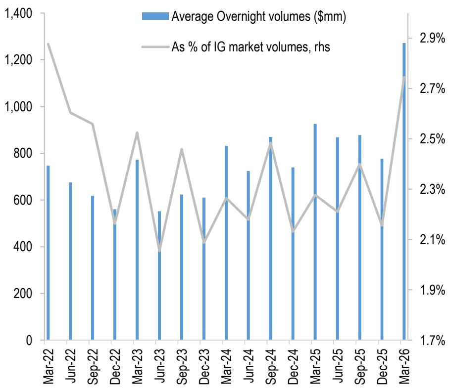

bar_line

| Month    | Average Overnight volumes ($mm) | As % of IG market volumes, rhs |
| -------- | ------------------------------ | ------------------------------ |
| Mar-22   | 750                            | 2.9%                           |
| Jun-22   | 680                            | 2.7%                           |
| Sep-22   | 620                            | 2.6%                           |
| Dec-22   | 550                            | 2.3%                           |
| Mar-23   | 780                            | 2.5%                           |
| Jun-23   | 550                            | 2.1%                           |
| Sep-23   | 630                            | 2.4%                           |
| Dec-23   | 610                            | 2.1%                           |
| Mar-24   | 840                            | 2.3%                           |
| Jun-24   | 730                            | 2.1%                           |
| Sep-24   | 880                            | 2.5%                           |
| Dec-24   | 750                            | 2.1%                           |
| Mar-25   | 930                            | 2.3%                           |
| Jun-25   | 880                            | 2.1%                           |
| Sep-25   | 890                            | 2.3%                           |
| Dec-25   | 780                            | 2.1%                           |
| Mar-26   | 1280                           | 2.7%                           |

Source: JPM, TRACE

The USD HG pickup for Euro investors has bounced as hedging costs decline   
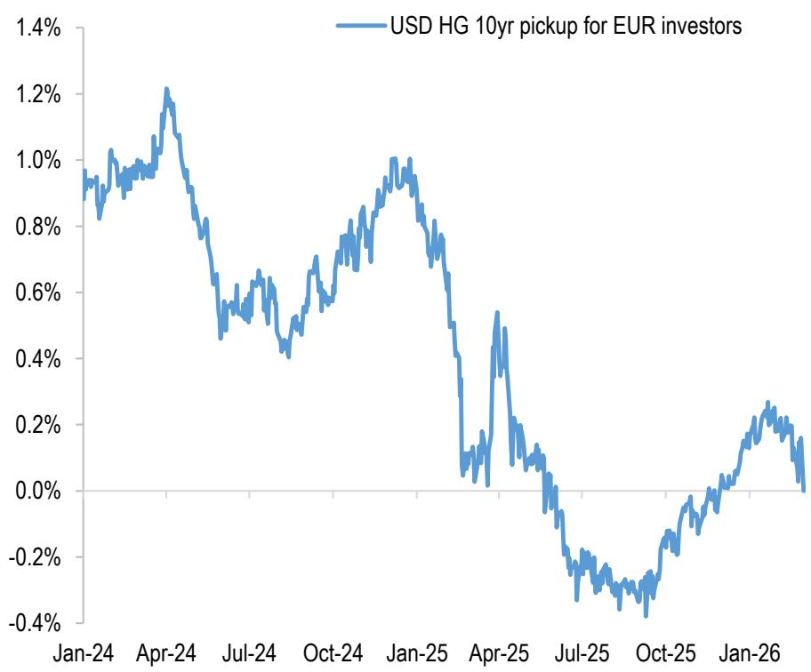

line

| Date    | USD HG 10yr pickup for EUR investors |
|---------|--------------------------------------|
| Jan-24  | ~0.9%                                |
| Apr-24  | ~1.2%                                |
| Jul-24  | ~0.5%                                |
| Oct-24  | ~0.7%                                |
| Jan-25  | ~1.0%                                |
| Apr-25  | ~0.5%                                |
| Jul-25  | ~-0.3%                               |
| Oct-25  | ~-0.4%                               |
| Jan-26  | ~0.2%                                |

Source: JPM, Bloomberg Finance L.P. As of 3/13/2026

EUR HG is lower rated than USD HG and Europe more sensitive to a commodity spike   
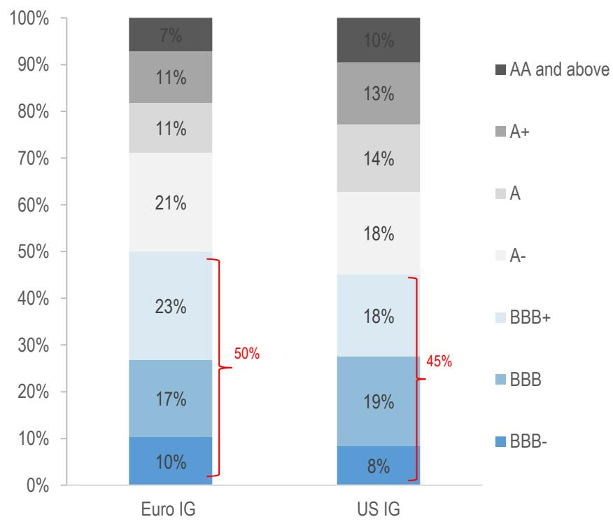

bar_stacked

| Group   | AA and above | A+  | A   | A-  | BBB+ | BBB | BBB- |
|---------|--------------|-----|-----|-----|------|-----|------|
| Euro IG | 7%           | 11% | 11% | 21% | 23%  | 17% | 10%  |
| US IG   | 10%          | 13% | 14% | 18% | 18%  | 19% | 8%   |

Source: JPM, Bloomberg Finance L.P.; As of 3/5/2026

# Technicals: Insurance demand for public HG should be underpinned by strong annuity sales, yet insurance ownership of the HG bond market is declining

Increase in annuity sales yet another source of marginal demand for HG credit   
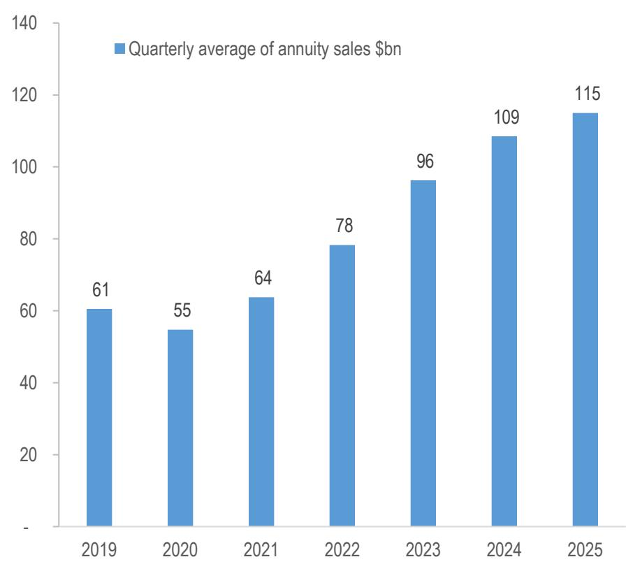

bar

| Year | Quarterly average of annuity sales $bn |
| :--- | :--- |
| 2019 | 61 |
| 2020 | 55 |
| 2021 | 64 |
| 2022 | 78 |
| 2023 | 96 |
| 2024 | 109 |
| 2025 | 115 |

Source: JPM, US Individual annuity sales survey, LIMRA. As of 3Q25

Insurance owned share of the HG public bond market has steadily declined   
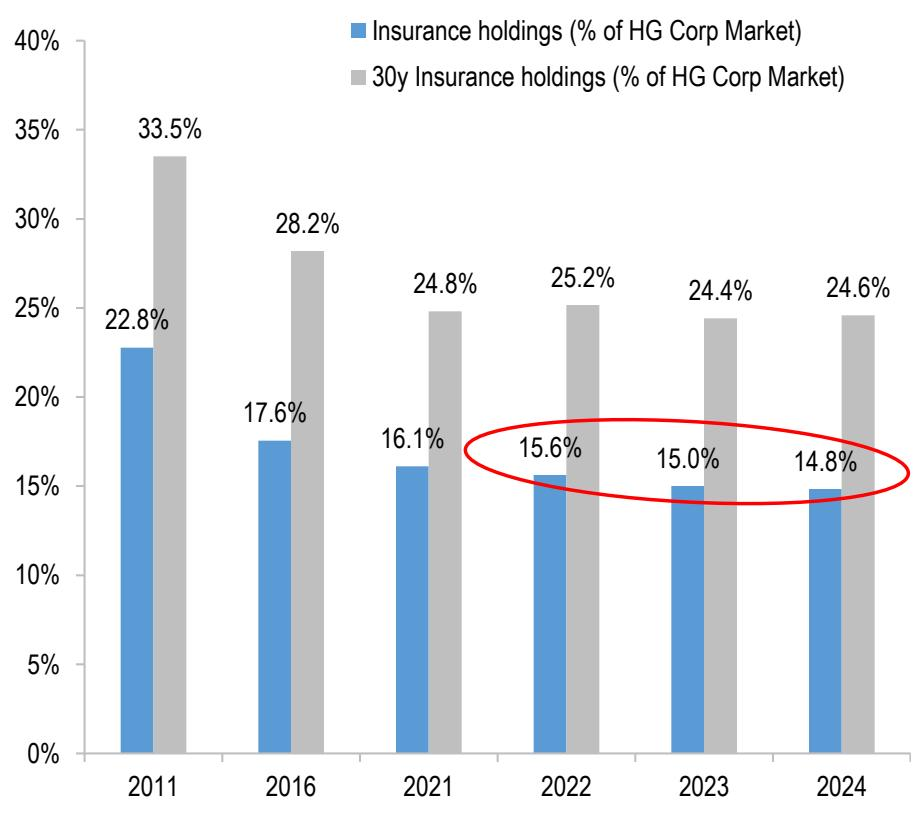

bar

| Year | Insurance holdings (% of HG Corp Market) (%) | 30y Insurance holdings (% of HG Corp Market) (%) |
| :--- | :--- | :--- |
| 2011 | 22.8 | 33.5 |
| 2016 | 17.6 | 28.2 |
| 2021 | 16.1 | 24.8 |
| 2022 | 15.6 | 25.2 |
| 2023 | 15.0 | 24.4 |
| 2024 | 14.8 | 24.6 |
The red oval highlights the 2022–2024 values for Insurance holdings and 30y Insurance holdings.

Source: JPM, NAIC. HG Bonds defined here as those in JULI

# Technicals: Insurance companies were focused on growing Alternatives and Illiquids recent years but more scrutiny on private credit should be a positive

Insurance holdings of private placements and other assets have increased faster than public HG bonds   
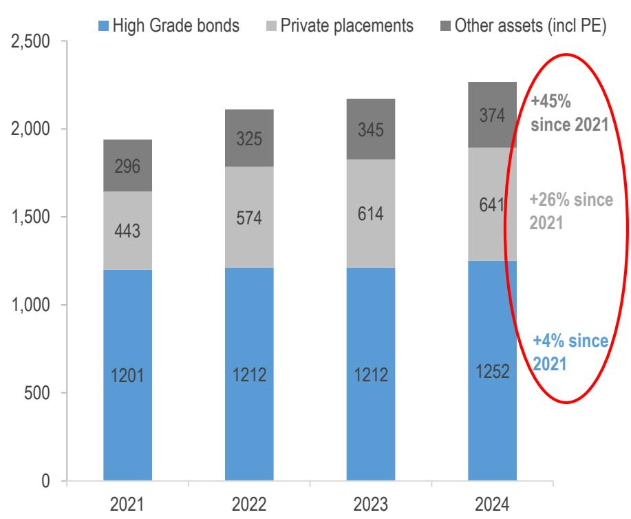

bar_stacked

| Year | High Grade bonds | Private placements | Other assets (incl PE) |
|------|------------------|--------------------|------------------------|
| 2021 | 1201             | 443                | 296                    |
| 2022 | 1212             | 574                | 325                    |
| 2023 | 1212             | 614                | 345                    |
| 2024 | 1252             | 641                | 374                    |

Source: JPM; NAIC. As of 4Q24   
Note: HG and private placements determined by NAIC Schedule D Classification category. Other assets including PE determined by NAIC Schedule BA Classification category.

Within public credit, still a strong preference for IG   
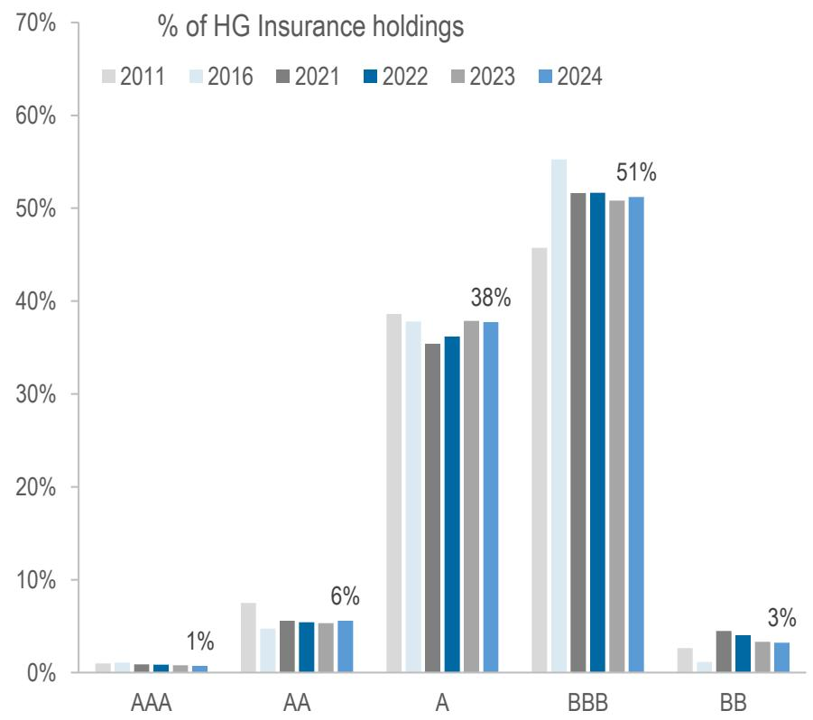

bar

% of HG Insurance holdings
| Rating | 2011 (%) | 2016 (%) | 2021 (%) | 2022 (%) | 2023 (%) | 2024 (%) |
| :--- | :--- | :--- | :--- | :--- | :--- | :--- |
| AAA | 1 | 1 | 1 | 1 | 1 | 1 |
| AA | 7 | 4 | 5 | 5 | 5 | 6 |
| A | 38 | 38 | 35 | 36 | 38 | 38 |
| BBB | 45 | 55 | 51 | 51 | 50 | 51 |
| BB | 2 | 1 | 4 | 3.5 | 3.5 | 3 |

Source: JPM, NAIC.

# Technicals: Pension fund demand is flat, likely remains this way so long as equities continue to outperform

Pension holdings of corporates have stayed flat   
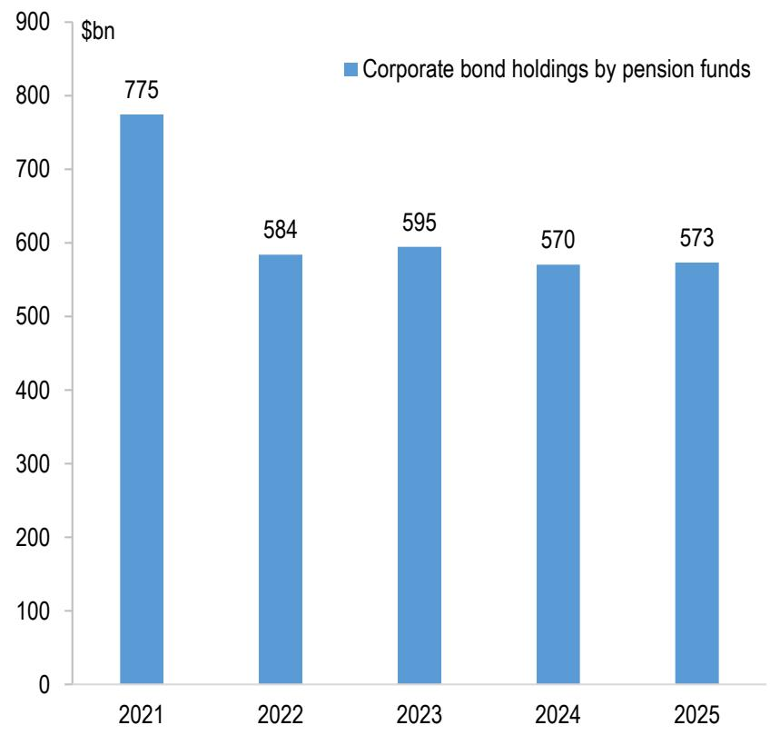

bar

| Year | Corporate bond holdings by pension funds ($bn) |
| :--- | :--- |
| 2021 | 775 |
| 2022 | 584 |
| 2023 | 595 |
| 2024 | 570 |
| 2025 | 573 |

Source: JPM; Milliman as of October 2025

The gap between Equity and Fixed Income returns has been growing over time, in favor of Equities   
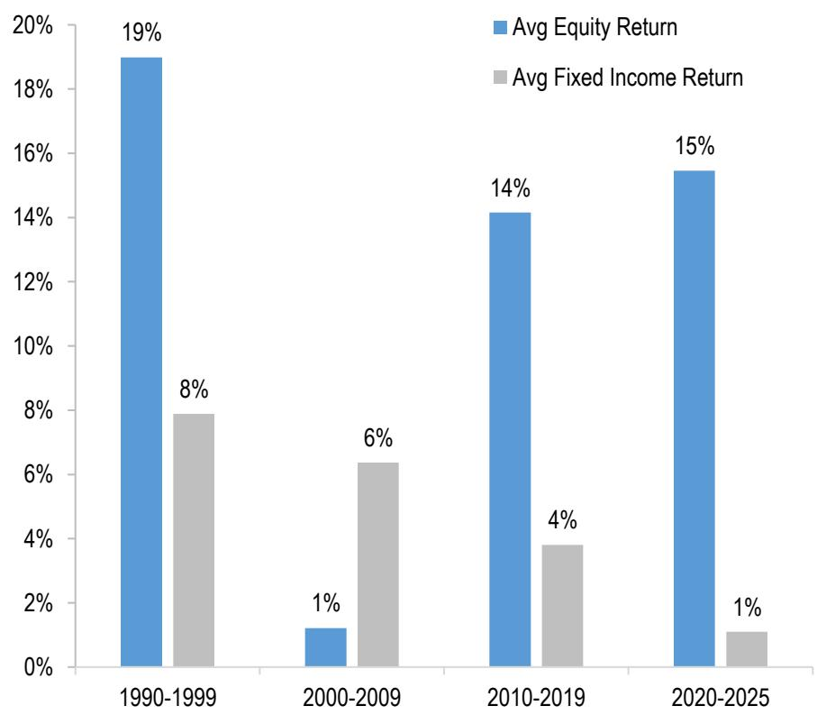

bar

| Period | Avg Equity Return (%) | Avg Fixed Income Return (%) |
| :--- | :--- | :--- |
| 1990-1999 | 19 | 8 |
| 2000-2009 | 1 | 6 |
| 2010-2019 | 14 | 4 |
| 2020-2025 | 15 | 1 |

Source: JPM. Bloomberg Finance L.P.

# Technicals: We expect 2026 to be a record supply year and forecast \$1.81tr of issuance

2026 Gross issuance is expected to rise to \$1.8tr   
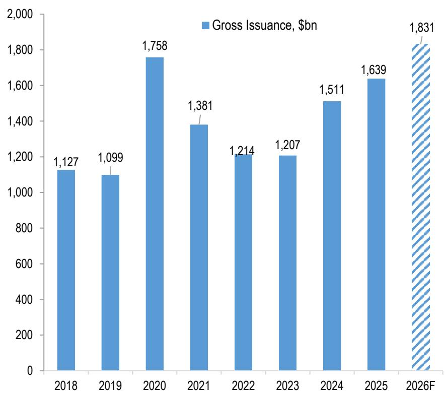

bar

| Year | Gross Issuance ($bn) |
| :--- | :--- |
| 2018 | 1,127 |
| 2019 | 1,099 |
| 2020 | 1,758 |
| 2021 | 1,381 |
| 2022 | 1,214 |
| 2023 | 1,207 |
| 2024 | 1,511 |
| 2025 | 1,639 |
| 2026F | 1,831 |

Source: JPM. As of 2/2/2026

Maturities in 2026 to stay near the record level of 2025   
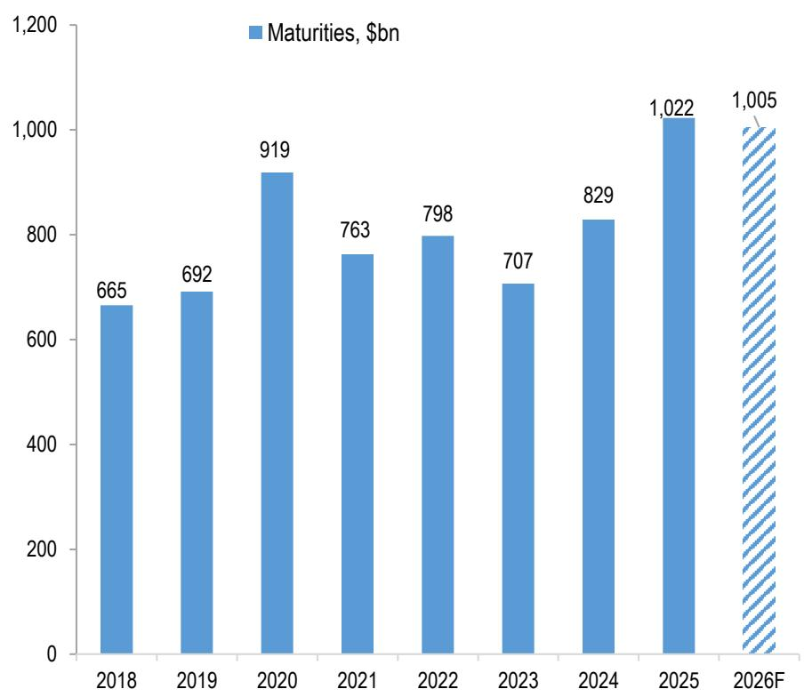

bar

| Year | Maturities ($bn) |
| :--- | :--- |
| 2018 | 665 |
| 2019 | 692 |
| 2020 | 919 |
| 2021 | 763 |
| 2022 | 798 |
| 2023 | 707 |
| 2024 | 829 |
| 2025 | 1,022 |
| 2026F | 1,005 |

We estimate \$508bn in coupon income in 2026, up 8% YoY   
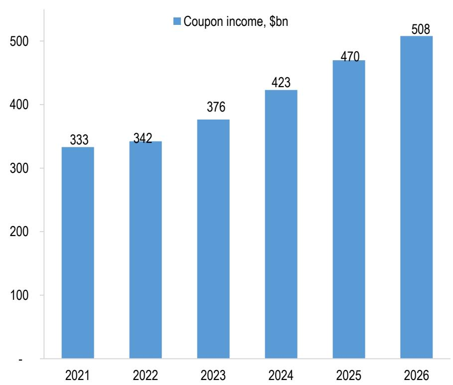

bar

| Year | Coupon income ($bn) |
| :--- | :--- |
| 2021 | 333 |
| 2022 | 342 |
| 2023 | 376 |
| 2024 | 423 |
| 2025 | 470 |
| 2026 | 508 |

Source: JPM; 'Net net' is Net minus coupons. As of 2/2/2026

'Net net' issuance up 2x versus 2025   
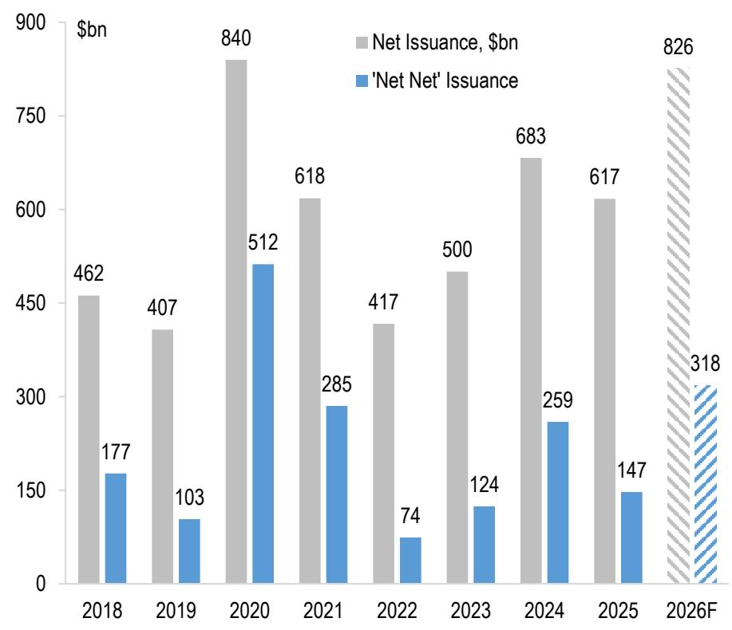

bar

| Year | Net Issuance ($bn) | 'Net' Issuance ($bn) |
| :--- | :--- | :--- |
| 2018 | 462 | 177 |
| 2019 | 407 | 103 |
| 2020 | 840 | 512 |
| 2021 | 618 | 285 |
| 2022 | 417 | 74 |
| 2023 | 500 | 124 |
| 2024 | 683 | 259 |
| 2025 | 617 | 147 |
| 2026F | 826 | 318 |

Reinvestment income jumps in March   
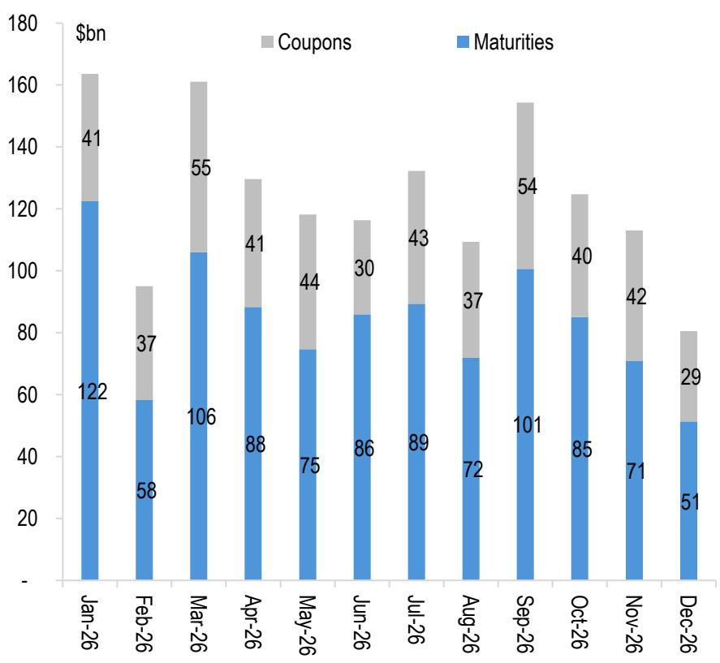

bar_stacked

| Month | Maturities ($bn) | Coupons ($bn) |
| :--- | :--- | :--- |
| Jan-26 | 122 | 41 |
| Feb-26 | 58 | 37 |
| Mar-26 | 106 | 55 |
| Apr-26 | 88 | 41 |
| May-26 | 75 | 44 |
| Jun-26 | 86 | 30 |
| Jul-26 | 89 | 43 |
| Aug-26 | 72 | 37 |
| Sep-26 | 101 | 54 |
| Oct-26 | 85 | 40 |
| Nov-26 | 71 | 42 |
| Dec-26 | 51 | 29 |

Source: JPM, Bloomberg L.P. Finance, Dealogic

New issue outperformance has improved in February despite high primary volumes   
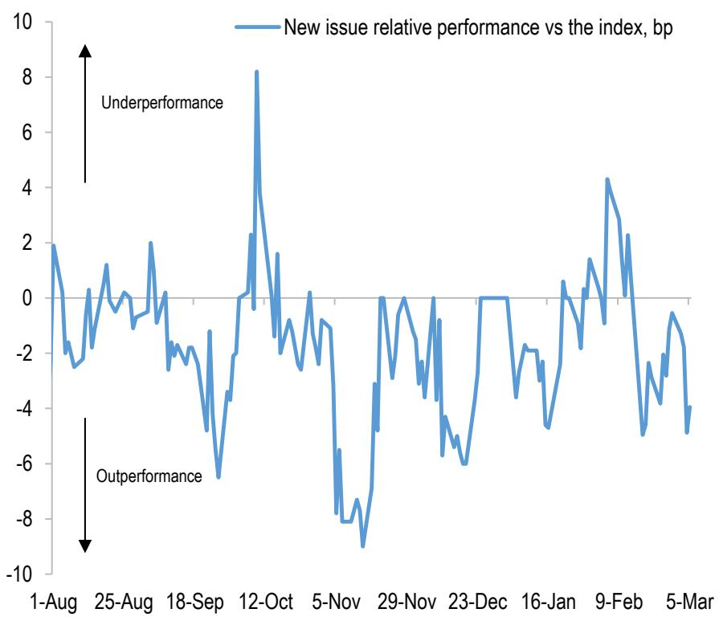

line

| Date     | New issue relative performance vs the index, bp |
| -------- | ----------------------------------------------- |
| 1-Aug    | ~2.0                                            |
| 25-Aug   | ~-2.0                                           |
| 18-Sep   | ~-3.0                                           |
| 12-Oct   | ~8.0                                            |
| 5-Nov    | ~-9.0                                           |
| 29-Nov   | ~-4.0                                           |
| 23-Dec   | ~-6.0                                           |
| 16-Jan   | ~-2.0                                           |
| 9-Feb    | ~4.0                                            |
| 5-Mar    | ~-5.0                                           |

We expect M&A supply to pick up in 2026 to a decade high   
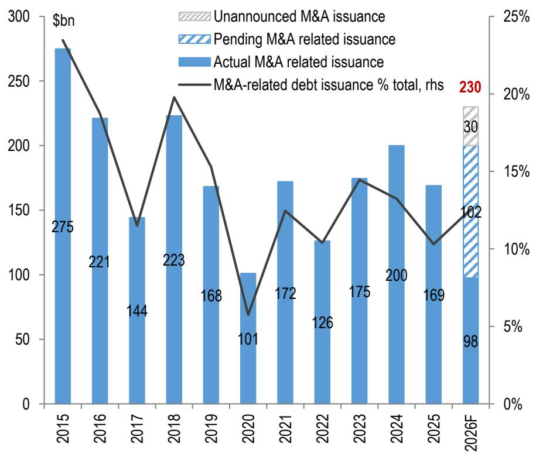

bar_line

| Year | Actual M&A related issuance ($bn) | Pending M&A related issuance ($bn) | Unannounced M&A issuance (%) | M&A-related debt issuance % total, rhs (%) |
| :--- | :--- | :--- | :--- | :--- |
| 2015 | 275 | - | - | 23.8 |
| 2016 | 221 | - | - | 19.4 |
| 2017 | 144 | - | - | 11.5 |
| 2018 | 223 | - | - | 20.0 |
| 2019 | 168 | - | - | 17.8 |
| 2020 | 101 | - | - | 6.0 |
| 2021 | 172 | - | - | 13.0 |
| 2022 | 126 | - | - | 10.5 |
| 2023 | 175 | - | - | 14.5 |
| 2024 | 200 | - | - | 13.5 |
| 2025 | 169 | - | - | 10.5 |
| 2026F | 98 | 102 | 30.0 | 18.5 |
The chart displays a bar chart for actual M&A-related issuance and a line chart for M&A-related debt issuance as a percentage of total M&A issuance over time.

Source: JPM. As of 3/16/2026

Healthcare/Pharma sector alone accounts for 32% of the M&A activity in our forecast   
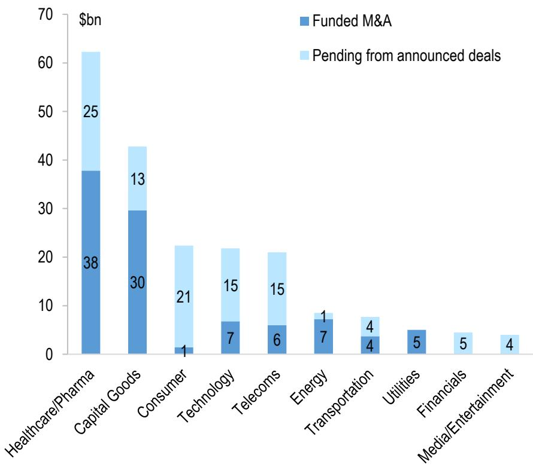

bar_stacked

| Category | Funded M&A ($bn) | Pending from announced deals ($bn) |
| :--- | :--- | :--- |
| Healthcare/Pharma | 38 | 25 |
| Capital Goods | 30 | 13 |
| Consumer | 1 | 21 |
| Technology | 7 | 15 |
| Telecoms | 6 | 15 |
| Energy | 7 | 1 |
| Transportation | 4 | 4 |
| Utilities | 5 | |
| Financials | 0 | 5 |
| Media/Entertainment | 0 | 4 |

Source: JPM

Reverse Yankee issuance was a record in 2025 and has started 2026 at a strong pace   
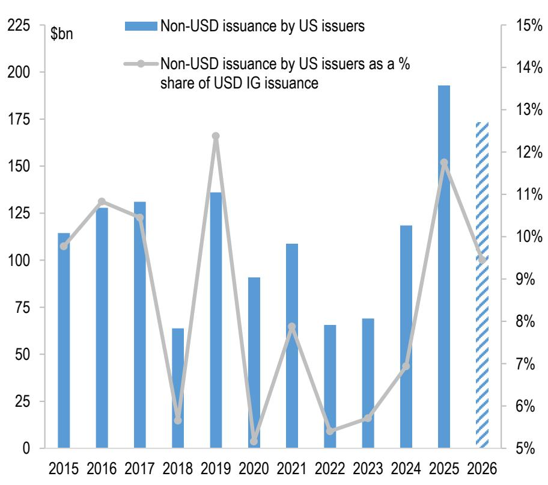

bar_line

| Year | Non-USD issuance by US issuers ($bn) | Non-USD issuance by US issuers as a % share of USD IG issuance |
|------|----------------------------------------|---------------------------------------------------------------|
| 2015 | 115                                    | 10.5                                                          |
| 2016 | 130                                    | 11.5                                                          |
| 2017 | 132                                    | 10.8                                                          |
| 2018 | 65                                     | 5.5                                                           |
| 2019 | 138                                    | 12.5                                                          |
| 2020 | 90                                     | 5.0                                                           |
| 2021 | 110                                    | 7.5                                                           |
| 2022 | 68                                     | 5.5                                                           |
| 2023 | 70                                     | 6.0                                                           |
| 2024 | 120                                    | 7.5                                                           |
| 2025 | 195                                    | 11.5                                                          |
| 2026 | 175                                    | 9.5                                                           |

Source: JPM, Bloomberg L.P. Finance; Note: Annualized 2026 figures.

DM IG corporate credit markets by FX   
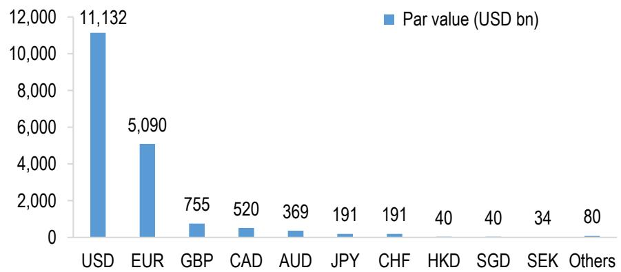

bar

| Currency | Par value (USD bn) |
| :--- | :--- |
| USD | 11,132 |
| EUR | 5,090 |
| GBP | 755 |
| CAD | 520 |
| AUD | 369 |
| JPY | 191 |
| CHF | 191 |
| HKD | 40 |
| SGD | 40 |
| SEK | 34 |
| Others | 80 |

Most non-USD markets currently have very little exposure to the Tech sector   
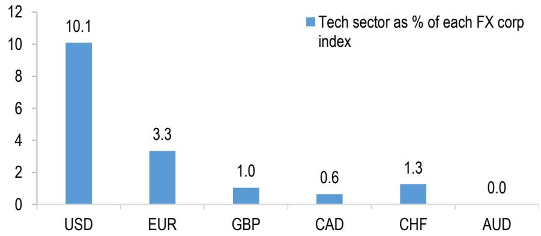

bar

| Country/Region | Tech sector as % of each FX corp index |
| :--- | :--- |
| USD | 10.1 |
| EUR | 3.3 |
| GBP | 1.0 |
| CAD | 0.6 |
| CHF | 1.3 |
| AUD | 0.0 |

Source: JPM, Bloomberg L.P. Finance

The yield pickup between AUD and USD IG corporate credit is at the highest since August 2022   
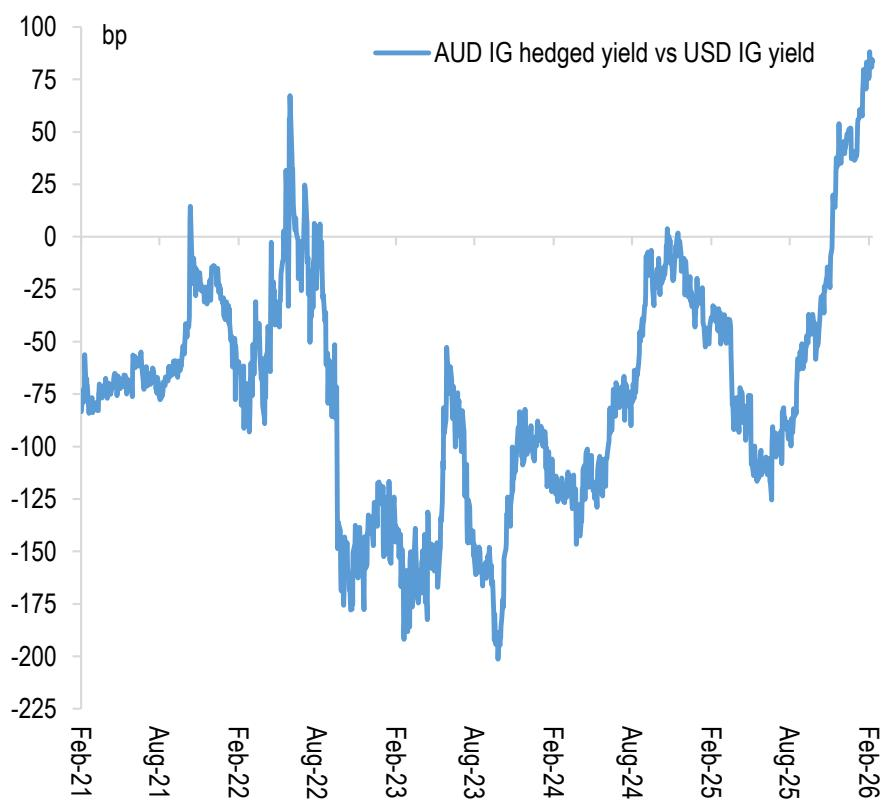

line

| Date    | AUD IG hedged yield vs USD IG yield (bp) |
|---------|------------------------------------------|
| Feb-21  | -75                                      |
| Aug-21  | -50                                      |
| Feb-22  | -100                                     |
| Aug-22  | 75                                       |
| Feb-23  | -150                                     |
| Aug-23  | -200                                     |
| Feb-24  | -100                                     |
| Aug-24  | -50                                      |
| Feb-25  | -100                                     |
| Aug-25  | -50                                      |
| Feb-26  | 75                                       |

Source: JPM, Bloomberg Finance L.P. As of 02/27/2026

Though still small, the AUD credit market has started growing much faster than the USD market   
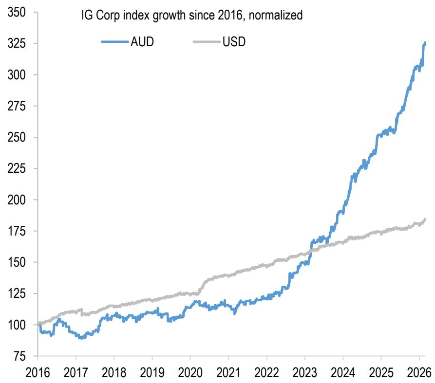

line

| Year | AUD  | USD  |
|------|------|------|
| 2016 | 95   | 100  |
| 2017 | 90   | 110  |
| 2018 | 105  | 115  |
| 2019 | 110  | 120  |
| 2020 | 115  | 125  |
| 2021 | 120  | 135  |
| 2022 | 130  | 145  |
| 2023 | 150  | 155  |
| 2024 | 180  | 165  |
| 2025 | 250  | 175  |
| 2026 | 325  | 185  |

Source: JPM, Bloomberg Finance L.P, As of 02/27/2026

# Valuations: Spreads are at a level that, historically, has not led to positive excess return. The spread breakeven in the long end is very low

Forward 12m excess returns have historically been negative at the current spread level   
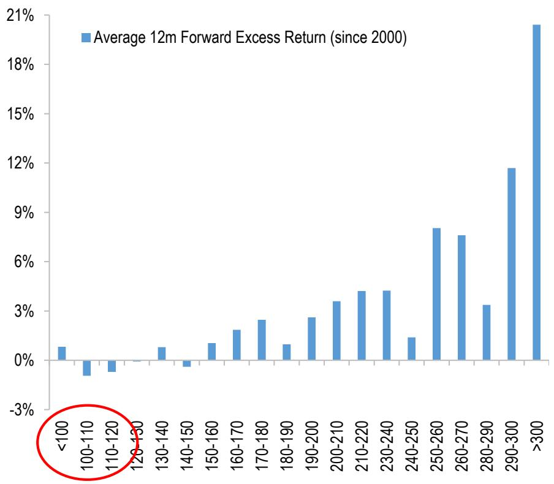

bar

Average 12m Forward Excess Return (since 2000)
| Return Range | Average 12m Forward Excess Return (%) |
| :--- | :--- |
| <100 | 1.5 |
| 100-110 | -1.5 |
| 110-120 | -0.8 |
| 120-130 | -0.1 |
| 130-140 | 1.6 |
| 140-150 | -0.3 |
| 150-160 | 2.4 |
| 160-170 | 2.6 |
| 170-180 | 2.8 |
| 180-190 | 1.8 |
| 190-200 | 2.8 |
| 200-210 | 3.4 |
| 210-220 | 4.4 |
| 230-240 | 4.4 |
| 240-250 | 1.8 |
| 250-260 | 8.2 |
| 260-270 | 7.4 |
| 280-290 | 3.3 |
| 290-300 | 11.8 |
| >300 | 21.4 |

Spread breakevens are very low in the long end   
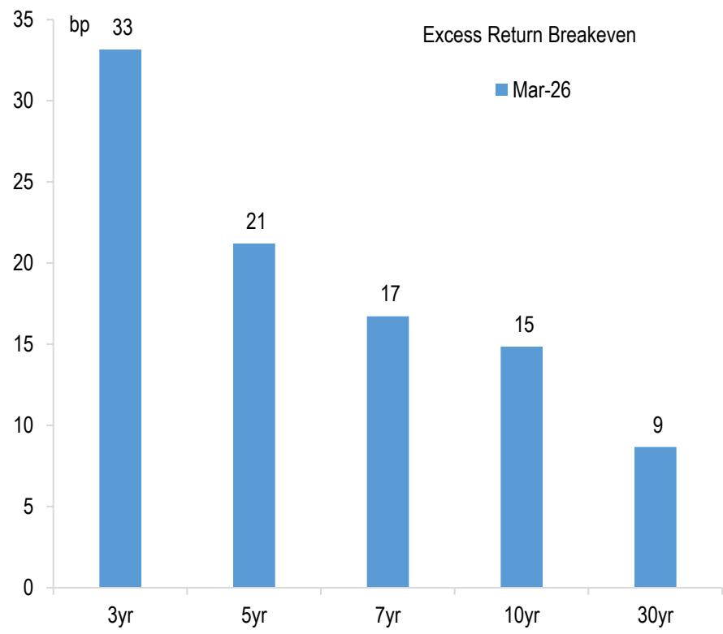

bar

Excess Return Breakeven
| Maturity | Excess Return Breakeven (bp) |
| :--- | :--- |
| 3yr | 33 |
| 5yr | 21 |
| 7yr | 17 |
| 10yr | 15 |
| 30yr | 9 |
Mar-26

Source: JPM

A steeper 10s30s spread curve YTD   
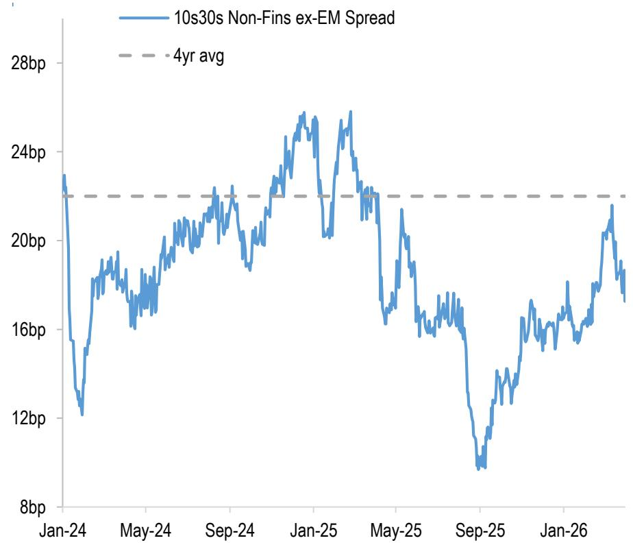

line

| Date    | 10s30s Non-Fins ex-EM Spread |
|---------|-------------------------------|
| Jan-24  | ~23bp                         |
| May-24  | ~19bp                         |
| Sep-24  | ~21bp                         |
| Jan-25  | ~25bp                         |
| May-25  | ~21bp                         |
| Sep-25  | ~10bp                         |
| Jan-26  | ~22bp                         |

Source for both: JPM. As of 04/01/2026

10+ year Non-Financials issuance increased to 26% YTD with a notable pickup in February   
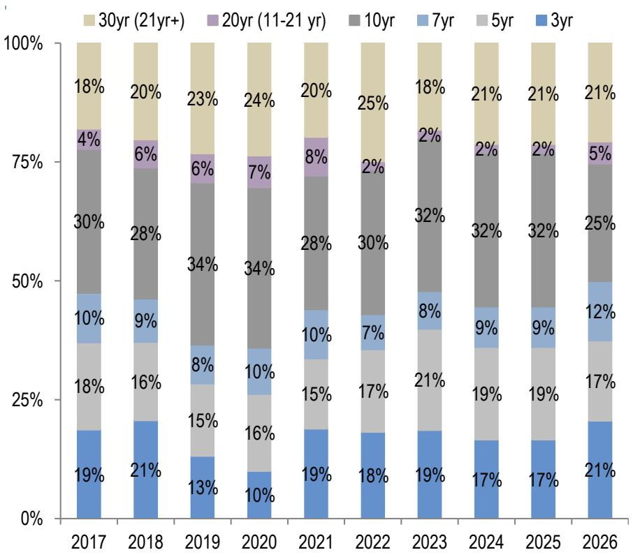

bar_stacked

| Year | 3yr (%) | 5yr (%) | 7yr (%) | 10yr (%) | 20yr (11-21 yr) (%) | 30yr (21yr+) (%) |
|---|---|---|---|---|---|---|
| 2017 | 19 | 18 | 10 | 30 | 4 | 18 |
| 2018 | 21 | 16 | 9 | 28 | 6 | 20 |
| 2019 | 13 | 15 | 8 | 34 | 6 | 23 |
| 2020 | 10 | 16 | 10 | 34 | 7 | 24 |
| 2021 | 19 | 15 | 10 | 28 | 8 | 20 |
| 2022 | 18 | 17 | 7 | 30 | 2 | 25 |
| 2023 | 19 | 21 | 8 | 32 | 2 | 18 |
| 2024 | 17 | 19 | 9 | 32 | 2 | 21 |
| 2025 | 17 | 19 | 9 | 32 | 2 | 21 |
| 2026 | 21 | 17 | 12 | 25 | 5 | 21 |

Source: JPM, Dealogic, As of 3/13/2026

# Valuations: A port in the AI storm? Financials likely to outperform Non-Financials again in 2026

Financials have steadily outperformed for 3 years in a row but there is some room for further outperformance in 2026   
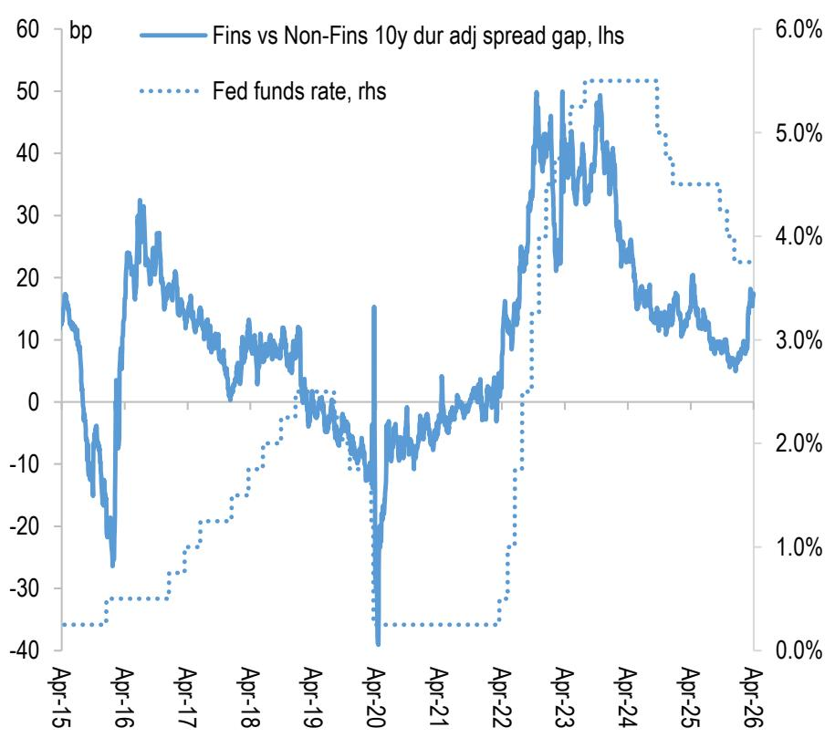

line

| Date   | Fins vs Non-Fins 10y dur adj spread gap, lhs | Fed funds rate, rhs |
|--------|---------------------------------------------|---------------------|
| Apr-15 | 18                                          | 0.0%                |
| Apr-16 | -25                                         | 0.0%                |
| Apr-17 | 25                                          | 1.0%                |
| Apr-18 | 10                                          | 2.0%                |
| Apr-19 | 5                                           | 3.0%                |
| Apr-20 | -40                                         | 4.0%                |
| Apr-21 | 0                                           | 5.0%                |
| Apr-22 | 15                                          | 4.0%                |
| Apr-23 | 50                                          | 5.0%                |
| Apr-24 | 40                                          | 5.5%                |
| Apr-25 | 20                                          | 4.5%                |
| Apr-26 | 18                                          | 3.5%                |

Source: JPM.

Financials share of supply next year is expected to be lowest since 2020   
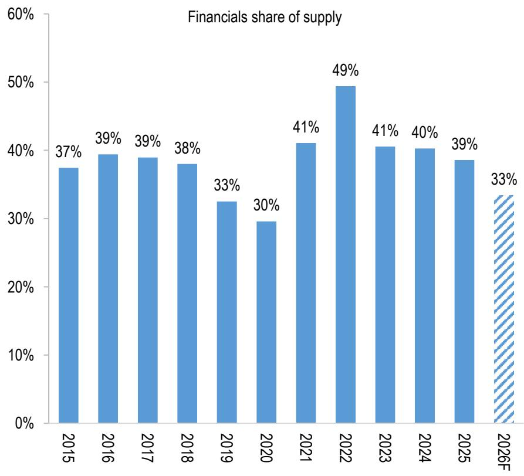

bar

Financials share of supply
| Year | Financials share of supply (%) |
| :--- | :--- |
| 2015 | 37 |
| 2016 | 39 |
| 2017 | 39 |
| 2018 | 38 |
| 2019 | 33 |
| 2020 | 30 |
| 2021 | 41 |
| 2022 | 49 |
| 2023 | 41 |
| 2024 | 40 |
| 2025 | 39 |
| 2026F | 33 |

Source: JPM, Dealogic.

The BB/BBB yield differential is close to its lowest since late 2017 but has widened recently with the sell-off   
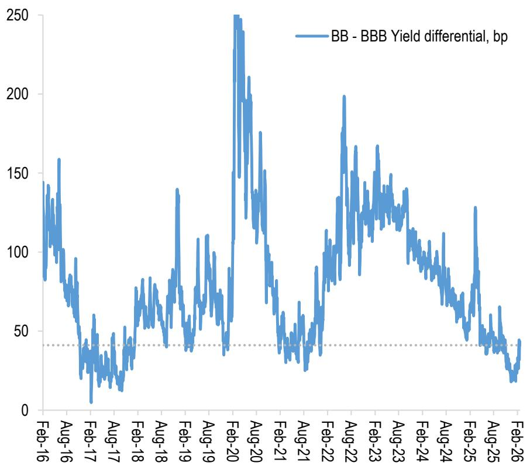

line

| Date    | BB - BBB Yield differential, bp |
|---------|----------------------------------|
| Feb-16  | ~140                             |
| Aug-16  | ~160                             |
| Feb-17  | ~30                              |
| Aug-17  | ~40                              |
| Feb-18  | ~50                              |
| Aug-18  | ~80                              |
| Feb-19  | ~140                             |
| Aug-19  | ~110                             |
| Feb-20  | ~250                             |
| Aug-20  | ~210                             |
| Feb-21  | ~150                             |
| Aug-21  | ~60                              |
| Feb-22  | ~100                             |
| Aug-22  | ~200                             |
| Feb-23  | ~140                             |
| Aug-23  | ~160                             |
| Feb-24  | ~130                             |
| Aug-24  | ~110                             |
| Feb-25  | ~80                              |
| Aug-25  | ~60                              |
| Feb-26  | ~40                              |

Source: JPM. As of 03/16/2026

BBB spreads are not at their tights vs As   
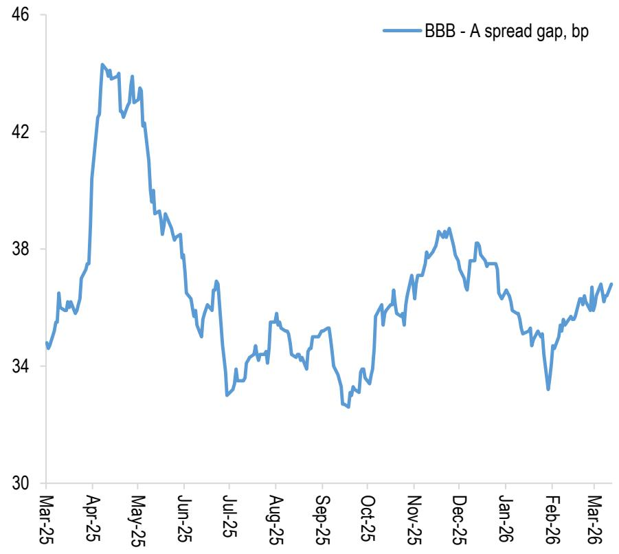

line

| Date   | BBB - A spread gap, bp |
|--------|------------------------|
| Mar-25 | 34.5                   |
| Apr-25 | 45.0                   |
| May-25 | 43.0                   |
| Jun-25 | 38.0                   |
| Jul-25 | 33.5                   |
| Aug-25 | 36.0                   |
| Sep-25 | 34.0                   |
| Oct-25 | 33.0                   |
| Nov-25 | 37.0                   |
| Dec-25 | 38.5                   |
| Jan-26 | 37.0                   |
| Feb-26 | 33.5                   |
| Mar-26 | 37.0                   |

Source: JPM. As of 03/16/2026

MBS spreads have outperformed Corps over the past year, with GSE purchases an additional positive catalyst   
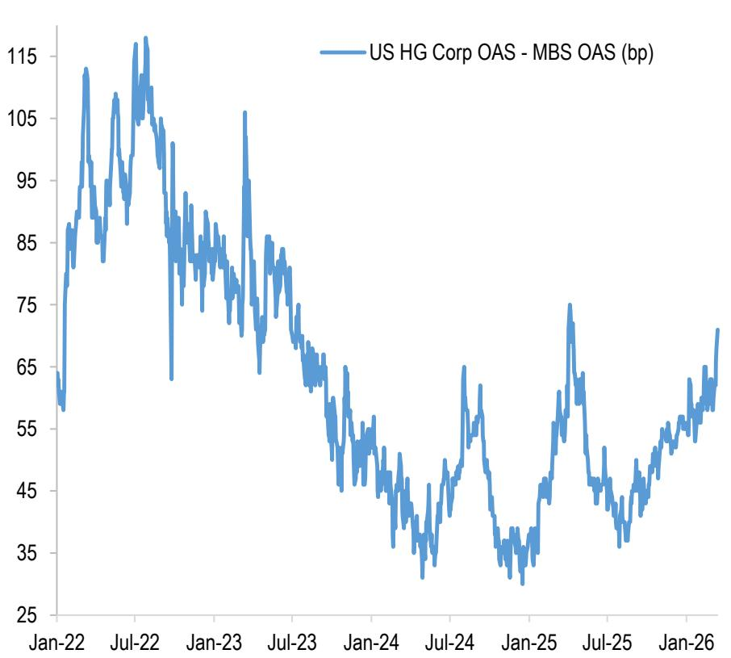

line

| Date   | US HG Corp OAS - MBS OAS (bp) |
|--------|-------------------------------|
| Jan-22 | 58                            |
| Jul-22 | 115                           |
| Jan-23 | 75                            |
| Jul-23 | 65                            |
| Jan-24 | 45                            |
| Jul-24 | 35                            |
| Jan-25 | 30                            |
| Jul-25 | 45                            |
| Jan-26 | 65                            |

Source: JPM.

We've seen some money managers reduce their overweight in MBS in favor of Corps   
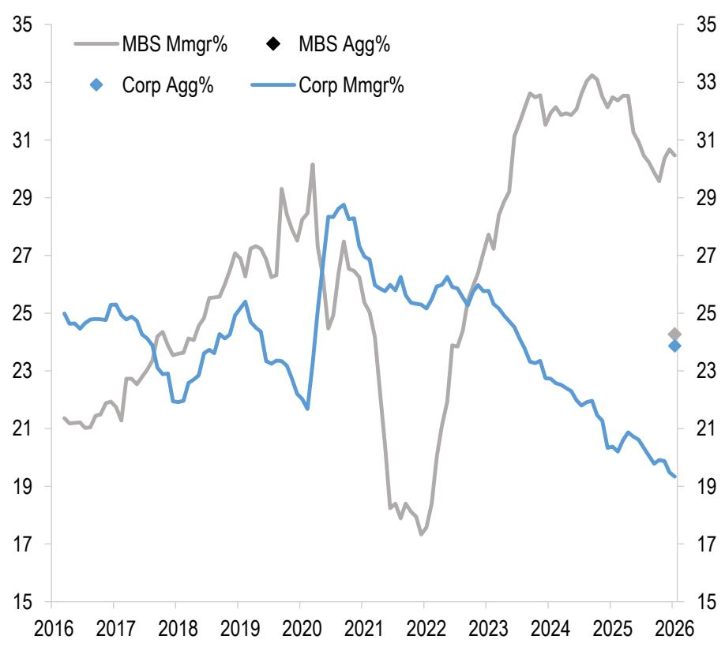

line

| Year | MBS Mmgr% | MBS Agg% | Corp Agg% | Corp Mmgr% |
|------|-----------|----------|-----------|------------|
| 2016 | 21.5      | -        | -         | 24.8       |
| 2017 | 23.0      | -        | -         | 25.2       |
| 2018 | 24.5      | -        | -         | 23.5       |
| 2019 | 26.0      | -        | -         | 25.0       |
| 2020 | 28.5      | -        | -         | 27.0       |
| 2021 | 25.0      | -        | -         | 26.5       |
| 2022 | 17.5      | -        | -         | 25.5       |
| 2023 | 27.0      | -        | -         | 26.0       |
| 2024 | 33.0      | -        | -         | 24.0       |
| 2025 | 32.5      | -        | -         | 21.5       |
| 2026 | 30.0      | 24.0     | 23.5      | 19.0       |

Source: JPM. MorningstarDirect.

Hyperscalers are a significant positive contributor to HG fundamentals already   
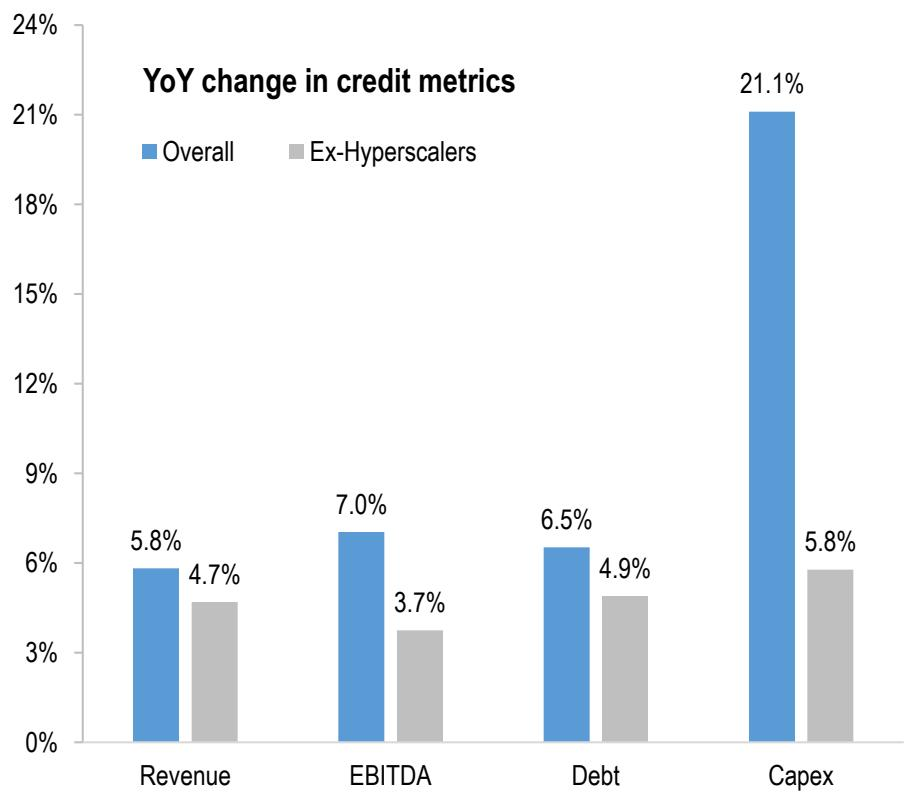

bar

YoY change in credit metrics
| Metric | Overall (%) | Ex-Hyperscalers (%) |
| :--- | :--- | :--- |
| Revenue | 5.8 | 4.7 |
| EBITDA | 7.0 | 3.7 |
| Debt | 6.5 | 4.9 |
| Capex | 21.1 | 5.8 |

Source for both: JPM

Hyperscalers are half as levered and have a 7x stronger interest coverage buffer than the rest of HG 

<table><tr><td>Metric</td><td>Hyperscalers</td><td>ex-Hyperscalers</td><td>Hyperscalers YoY Change; %</td><td>ex-Hyperscalers YoY Change; %</td></tr><tr><td>Gross Leverage</td><td>1.8x</td><td>3.3x</td><td>0.4x (24%)</td><td>0.1x (2%)</td></tr><tr><td>Net Leverage</td><td>1.1x</td><td>2.9x</td><td>0.3x (34%)</td><td>0.1x (2%)</td></tr><tr><td>EBITDA Margin</td><td>42%</td><td>31%</td><td>0.3% (1%)</td><td>-0.5% (-2%)</td></tr><tr><td>Interest Coverage</td><td>64.4x</td><td>8.7x</td><td>-22.1x (-26%)</td><td>-0.2x (-3%)</td></tr><tr><td>Payout Ratio</td><td>30%</td><td>37%</td><td>-8.3% (-22%)</td><td>-0.8% (-2%)</td></tr></table>

# Fundamentals: Revenue grew the most in last twelve quarters and eleven of eighteen sectors posted positive revenue growth y/y

Revenue grew the most since 1Q23   
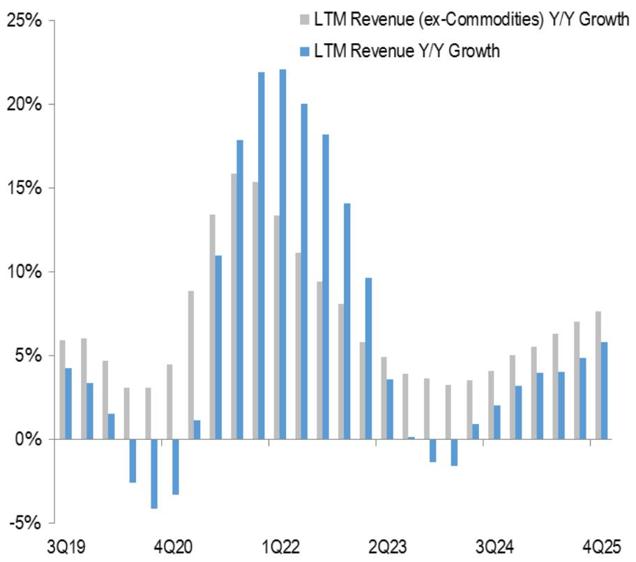

bar

| Quarter | LTM Revenue (ex-Commodities) Y/Y Growth | LTM Revenue Y/Y Growth |
| ------- | ---------------------------------------- | ---------------------- |
| 3Q19    | 5.8%                                     | 4.2%                   |
| 4Q19    | 5.9%                                     | 3.3%                   |
| 1Q20    | 4.7%                                     | 1.4%                   |
| 2Q20    | 3.0%                                     | -2.8%                  |
| 3Q20    | 3.0%                                     | -4.5%                  |
| 4Q20    | 4.4%                                     | -3.5%                  |
| 1Q21    | 8.7%                                     | 1.0%                   |
| 2Q21    | 13.3%                                    | 10.9%                  |
| 3Q21    | 15.8%                                    | 17.8%                  |
| 4Q21    | 15.3%                                    | 21.8%                  |
| 1Q22    | 13.3%                                    | 21.9%                  |
| 2Q22    | 11.0%                                    | 19.9%                  |
| 3Q22    | 9.3%                                     | 18.1%                  |
| 4Q22    | 7.9%                                     | 14.0%                  |
| 1Q23    | 5.6%                                     | 9.5%                   |
| 2Q23    | 4.8%                                     | 3.5%                   |
| 3Q23    | 3.8%                                     | -0.5%                  |
| 4Q23    | 3.5%                                     | -1.8%                  |
| 1Q24    | 3.0%                                     | -2.0%                  |
| 2Q24    | 3.5%                                     | 0.8%                   |
| 3Q24    | 4.0%                                     | 1.9%                   |
| 4Q24    | 5.0%                                     | 3.0%                   |
| 1Q25    | 5.5%                                     | 3.9%                   |
| 2Q25    | 6.0%                                     | 4.0%                   |
| 3Q25    | 6.8%                                     | 4.8%                   |
| 4Q25    | 7.5%                                     | 5.6%                   |

Source for both: JPM

Strongest to weakest Revenue growth by sector y/y 

<table><tr><td></td><td>4Q25</td><td>q/q chg</td><td>q/q % chg</td><td>y/y chg</td><td>y/y % chg</td></tr><tr><td>Diversified Media</td><td>359.4</td><td>14.3</td><td>4.1%</td><td>42.3</td><td>13.4%</td></tr><tr><td>Technology</td><td>2,398.1</td><td>87.3</td><td>3.8%</td><td>261.4</td><td>12.2%</td></tr><tr><td>Healthcare/HMOs</td><td>2,194.3</td><td>57.8</td><td>2.7%</td><td>221.3</td><td>11.2%</td></tr><tr><td>Utilities</td><td>387.8</td><td>9.6</td><td>2.5%</td><td>35.6</td><td>10.1%</td></tr><tr><td>Capital Goods</td><td>729.6</td><td>24.4</td><td>3.5%</td><td>64.1</td><td>9.6%</td></tr><tr><td>Pharmaceuticals</td><td>964.3</td><td>13.7</td><td>1.4%</td><td>71.6</td><td>8.0%</td></tr><tr><td>Telecoms - Yankees</td><td>295.0</td><td>(2.7)</td><td>-0.9%</td><td>13.7</td><td>4.9%</td></tr><tr><td>Non-Food Retail</td><td>1,349.3</td><td>15.3</td><td>1.1%</td><td>60.3</td><td>4.7%</td></tr><tr><td>Telecoms - Domestic</td><td>382.9</td><td>5.4</td><td>1.4%</td><td>15.4</td><td>4.2%</td></tr><tr><td>Metals/Mining</td><td>537.1</td><td>24.0</td><td>4.7%</td><td>21.4</td><td>4.1%</td></tr><tr><td>Food/Beverages</td><td>704.5</td><td>13.3</td><td>1.9%</td><td>22.5</td><td>3.3%</td></tr><tr><td>Food/Drug Retail</td><td>211.8</td><td>1.4</td><td>0.6%</td><td>(0.1)</td><td>-0.1%</td></tr><tr><td>Cable/TV</td><td>178.5</td><td>0.1</td><td>0.0%</td><td>(0.3)</td><td>-0.2%</td></tr><tr><td>Transportation</td><td>285.5</td><td>(0.7)</td><td>-0.2%</td><td>(1.3)</td><td>-0.5%</td></tr><tr><td>Automotive</td><td>469.2</td><td>(4.3)</td><td>-0.9%</td><td>(2.2)</td><td>-0.5%</td></tr><tr><td>Energy</td><td>2,087.2</td><td>-</td><td>0.0%</td><td>(37.2)</td><td>-1.7%</td></tr><tr><td>Consumer Products</td><td>328.2</td><td>(5.1)</td><td>-1.5%</td><td>(7.0)</td><td>-2.1%</td></tr><tr><td>Chemicals</td><td>136.2</td><td>(7.4)</td><td>-5.1%</td><td>(11.0)</td><td>-7.5%</td></tr><tr><td>Overall</td><td>13,998.9</td><td>246.4</td><td>1.8%</td><td>770.5</td><td>5.8%</td></tr><tr><td>Overall ex-Comm</td><td>11,238.5</td><td>229.7</td><td>2.1%</td><td>797.3</td><td>7.6%</td></tr></table>

# Fundamentals: EBITDA growth outpaced revenue and nominal GDP growth materially both with and without commodities

EBITDA growth was strongest since 4Q22   
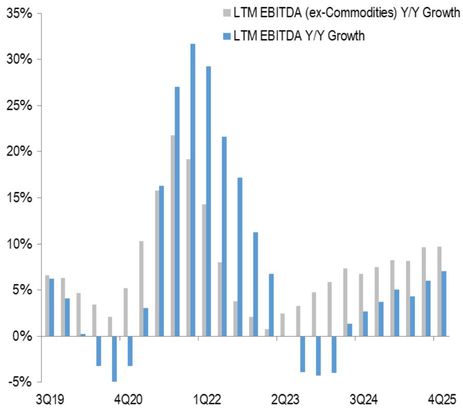

bar

| Quarter | LTM EBITDA (ex-Commodities) Y/Y Growth | LTM EBITDA Y/Y Growth |
|---------|------------------------------------------|------------------------|
| 3Q19    | 6.5%                                     | 6.0%                   |
| 4Q19    | 6.0%                                     | 4.0%                   |
| 1Q20    | 4.5%                                     | 0.0%                   |
| 2Q20    | 3.0%                                     | -3.0%                  |
| 3Q20    | 2.0%                                     | -5.0%                  |
| 4Q20    | 5.0%                                     | -3.0%                  |
| 1Q21    | 10.0%                                    | 3.0%                   |
| 2Q21    | 15.5%                                    | 16.0%                  |
| 3Q21    | 21.5%                                    | 27.0%                  |
| 4Q21    | 19.0%                                    | 31.5%                  |
| 1Q22    | 14.0%                                    | 29.0%                  |
| 2Q22    | 8.0%                                     | 21.5%                  |
| 3Q22    | 3.5%                                     | 17.0%                  |
| 4Q22    | 2.0%                                     | 11.0%                  |
| 1Q23    | 0.5%                                     | 6.5%                   |
| 2Q23    | 3.0%                                     | -4.0%                  |
| 3Q23    | 4.5%                                     | -5.0%                  |
| 4Q23    | 5.5%                                     | -4.0%                  |
| 1Q24    | 7.0%                                     | 1.0%                   |
| 2Q24    | 6.5%                                     | 2.5%                   |
| 3Q24    | 7.5%                                     | 3.5%                   |
| 4Q24    | 8.0%                                     | 5.0%                   |
| 1Q25    | 8.0%                                     | 4.0%                   |
| 2Q25    | 9.5%                                     | 6.0%                   |
| 3Q25    | 9.5%                                     | 7.0%                   |

Source for both: JPM

Strongest to weakest EBITDA growth by sector y/y 

<table><tr><td></td><td>4Q25</td><td>q/q chg</td><td>q/q % chg</td><td>y/y chg</td><td>y/y % chg</td></tr><tr><td>Technology</td><td>836.4</td><td>40.9</td><td>5.1%</td><td>136.9</td><td>19.6%</td></tr><tr><td>Capital Goods</td><td>121.4</td><td>13.3</td><td>12.3%</td><td>16.3</td><td>15.5%</td></tr><tr><td>Telecoms - Yankees</td><td>110.0</td><td>(0.8)</td><td>-0.7%</td><td>14.2</td><td>14.8%</td></tr><tr><td>Pharmaceuticals</td><td>353.2</td><td>7.1</td><td>2.0%</td><td>41.8</td><td>13.4%</td></tr><tr><td>Utilities</td><td>160.3</td><td>3.4</td><td>2.1%</td><td>17.3</td><td>12.1%</td></tr><tr><td>Diversified Media</td><td>131.3</td><td>1.4</td><td>1.1%</td><td>9.2</td><td>7.6%</td></tr><tr><td>Non-Food Retail</td><td>102.0</td><td>1.0</td><td>1.0%</td><td>2.5</td><td>2.5%</td></tr><tr><td>Transportation</td><td>76.3</td><td>-</td><td>0.0%</td><td>1.6</td><td>2.2%</td></tr><tr><td>Food/Beverages</td><td>139.5</td><td>2.4</td><td>1.8%</td><td>1.9</td><td>1.4%</td></tr><tr><td>Food/Drug Retail</td><td>28.1</td><td>0.3</td><td>1.2%</td><td>(0.3)</td><td>-0.9%</td></tr><tr><td>Cable/TV</td><td>59.4</td><td>(1.0)</td><td>-1.6%</td><td>(0.7)</td><td>-1.1%</td></tr><tr><td>Metals/Mining</td><td>107.6</td><td>4.1</td><td>4.0%</td><td>(1.6)</td><td>-1.5%</td></tr><tr><td>Energy</td><td>456.5</td><td>0.9</td><td>0.2%</td><td>(10.9)</td><td>-2.3%</td></tr><tr><td>Consumer Products</td><td>74.0</td><td>(1.7)</td><td>-2.2%</td><td>(2.5)</td><td>-3.3%</td></tr><tr><td>Telecoms - Domestic</td><td>135.7</td><td>1.8</td><td>1.4%</td><td>(6.6)</td><td>-4.7%</td></tr><tr><td>Healthcare/HMOs</td><td>90.5</td><td>(7.2)</td><td>-7.3%</td><td>(8.5)</td><td>-8.6%</td></tr><tr><td>Automotive</td><td>45.5</td><td>(1.1)</td><td>-2.4%</td><td>(5.2)</td><td>-10.3%</td></tr><tr><td>Chemicals</td><td>19.5</td><td>(2.3)</td><td>-10.6%</td><td>(4.9)</td><td>-20.2%</td></tr><tr><td>Overall</td><td>3,047.4</td><td>62.6</td><td>2.1%</td><td>200.5</td><td>7.0%</td></tr><tr><td>Overall ex-Comm</td><td>2,463.7</td><td>59.8</td><td>2.5%</td><td>217.9</td><td>9.7%</td></tr></table>

# Fundamentals: Debt growth was 2x more than the prior 2 year average as companies' conservative balance sheet management coming to an end

Debt growth picked up in 4Q25 and expected to increase further in 2026   
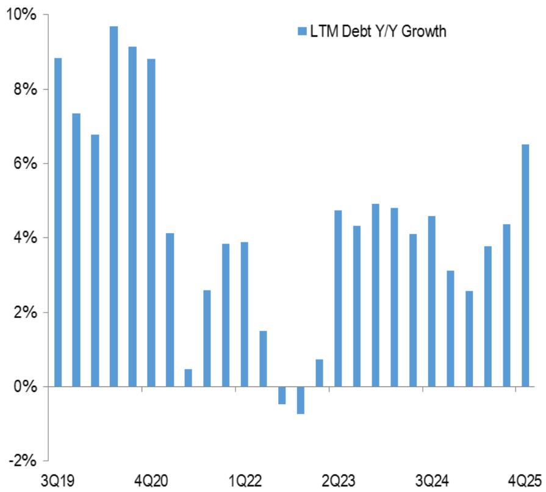

bar

| Quarter | LTM Debt Y/Y Growth |
| ------- | ------------------- |
| 3Q19    | 8.8%                |
| 4Q20    | 7.3%                |
| 1Q22    | 6.7%                |
| 2Q23    | 9.6%                |
| 3Q24    | 9.1%                |
| 4Q25    | 8.8%                |

Source for both: JPM

Y/Y change in debt for largest HG issuers: While debt is much higher for some, many are cutting too   
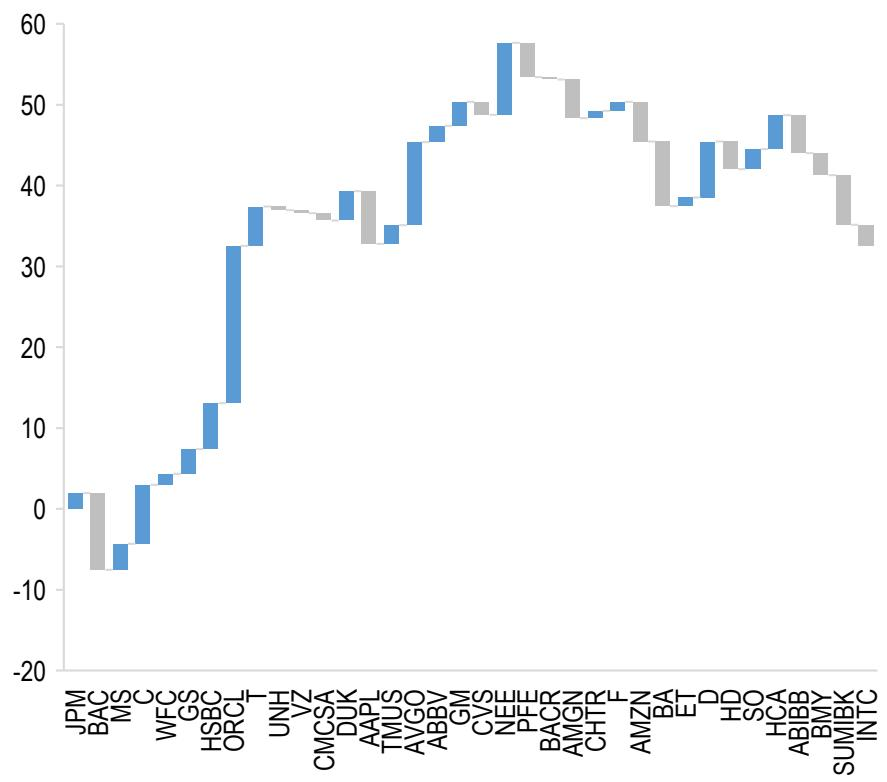

bar

| Entity | Value |
| :--- | :--- |
| JPM | 1 |
| BAC | -7 |
| MS | -5 |
| C | 3 |
| WFC | 4 |
| GS | 7 |
| HSBC | 13 |
| ORCL | 13 |
| T | 37 |
| UNH | 37 |
| VZ | 36 |
| CMCSA | 39 |
| DUK | 39 |
| AAPL | 34 |
| TMUS | 35 |
| AVGO | 45 |
| ABBV | 47 |
| GM | 50 |
| CVS | 50 |
| NEE | 58 |
| PFE | 57 |
| BACR | 53 |
| AMGN | 49 |
| CHTR | 50 |
| F | 50 |
| AMZN | 46 |
| BA | 38 |
| ET | 38 |
| D | 45 |
| HD | 45 |
| SO | 44 |
| HCA | 49 |
| ABIBB | 49 |
| BMY | 43 |
| SUMBK | 41 |
| INTC | 34 |

Leverage for higher rated names increased marginally while deteriorated more meaningfully for BBB rated issuers   
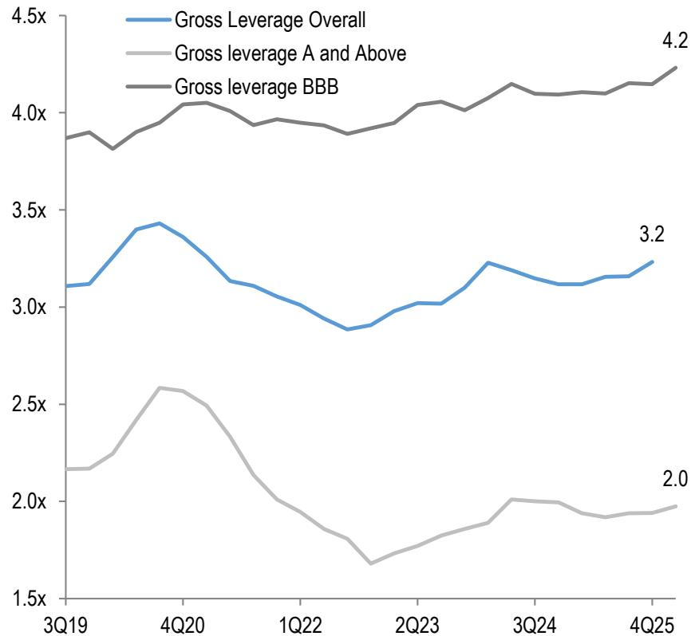

line

| Quarter | Gross Leverage Overall | Gross leverage A and Above | Gross leverage BBB |
| ------- | ---------------------- | -------------------------- | ------------------ |
| 3Q19    | 3.1x                   | 2.1x                       | 3.9x               |
| 4Q20    | 3.4x                   | 2.6x                       | 4.0x               |
| 1Q22    | 3.0x                   | 1.9x                       | 3.9x               |
| 2Q23    | 2.9x                   | 1.7x                       | 4.0x               |
| 3Q24    | 3.1x                   | 2.0x                       | 4.1x               |
| 4Q25    | 3.2x                   | 2.0x                       | 4.2x               |

Source for both: JPM

The cost of a downgrade within HG is low now with only a modest spread difference between ratings categories   
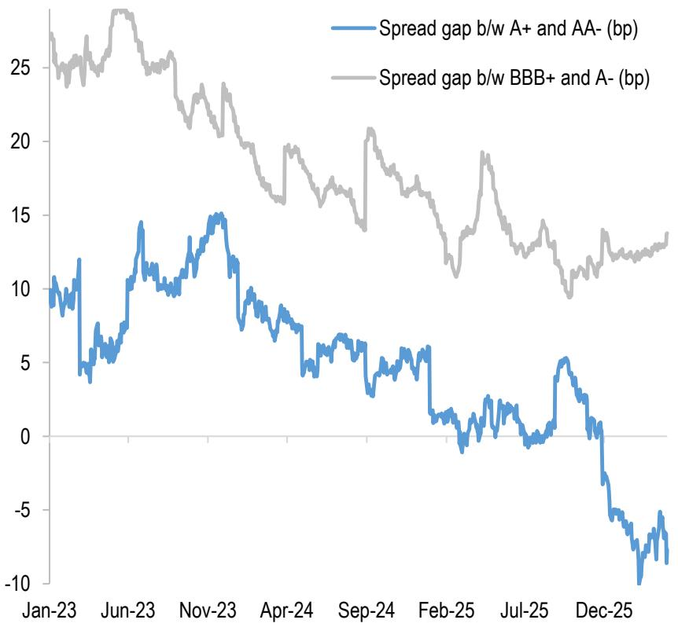

line

| Date   | Spread gap b/w A+ and AA- (bp) | Spread gap b/w BBB+ and A- (bp) |
|--------|----------------------------------|----------------------------------|
| Jan-23 | ~10                              | ~27                              |
| Jun-23 | ~14                              | ~28                              |
| Nov-23 | ~15                              | ~24                              |
| Apr-24 | ~8                               | ~19                              |
| Sep-24 | ~6                               | ~21                              |
| Feb-25 | ~1                               | ~11                              |
| Jul-25 | ~0                               | ~19                              |
| Dec-25 | ~-10                             | ~13                              |

# Fundamentals: Interest expense increased by 6.4% YoY, which was the 14th consecutive quarterly increase

Interest expense rose for the 14th consecutive quarter   
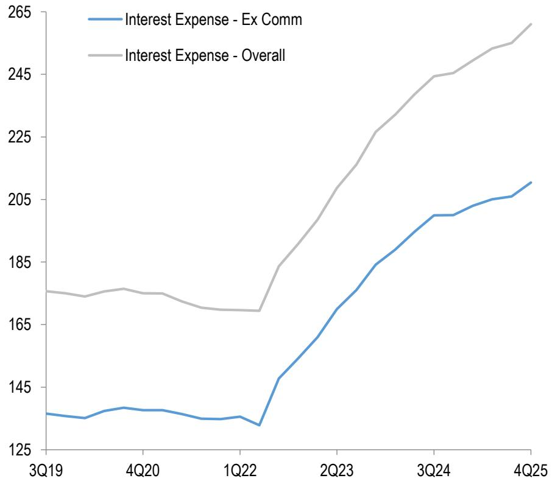

line

| Quarter | Interest Expense - Ex Comm | Interest Expense - Overall |
| ------- | -------------------------- | --------------------------- |
| 3Q19    | 132                        | 172                         |
| 4Q20    | 134                        | 173                         |
| 1Q22    | 130                        | 166                         |
| 2Q23    | 165                        | 205                         |
| 3Q24    | 198                        | 245                         |
| 4Q25    | 208                        | 258                         |

Source for both: JPM

Interest coverage ratio continued its decline but at a less rapid pace   
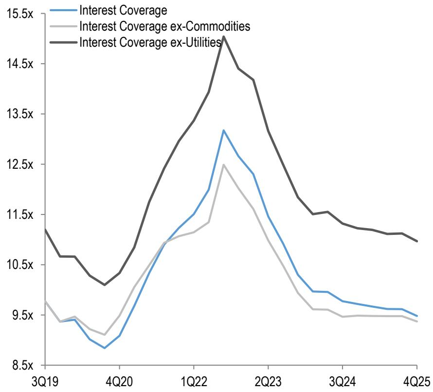

line

| Quarter | Interest Coverage | Interest Coverage ex-Commodities | Interest Coverage ex-Utilities |
| ------- | ----------------- | -------------------------------- | ------------------------------ |
| 3Q19    | 9.6x              | 9.7x                             | 11.0x                          |
| 4Q20    | 8.7x              | 8.8x                             | 9.8x                           |
| 1Q22    | 11.5x             | 11.8x                            | 13.5x                          |
| 2Q23    | 12.5x             | 12.0x                            | 14.0x                          |
| 3Q24    | 9.5x              | 9.4x                             | 11.5x                          |
| 4Q25    | 9.4x              | 9.3x                             | 11.0x                          |

# Fundamentals: The share of BBB- debt in the index is the lowest in 20 years as upgrades continue to exceed downgrades

The BBB- portion of the index is at a record low and BBB overall is also at a 14y low   
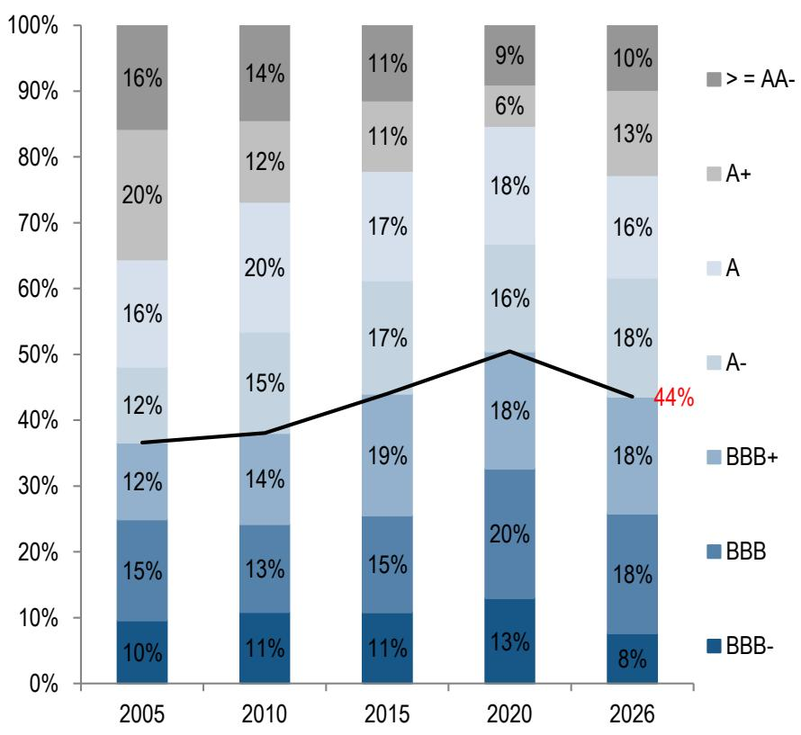

bar_stacked

| Year | BBB- (%) | BBB (%) | BBB+ (%) | A- (%) | A (%) | >= AA- (%) |
|---|---|---|---|---|---|---|
| 2005 | 10 | 15 | 12 | 16 | 20 | 16 |
| 2010 | 11 | 13 | 14 | 20 | 12 | 14 |
| 2015 | 11 | 15 | 17 | 17 | 11 | 11 |
| 2020 | 13 | 20 | 16 | 18 | 9 | 6 |
| 2026 | 8 | 18 | 18 | 16 | 13 | 10 |
The line graph indicates a trend from approximately 37% in 2005 to a peak of 50% in 2020, followed by a projected decline to 44% in 2026. The legend defines rating categories: BBB-, BBB, BBB+, A-, A, and >= AA-. The chart displays stacked bars for each rating category over time.

Source: JPM, Bloomberg Finance L.P.

The ratio of upgrades to downgrades in 1Q26 stands at 1.0x, the lowest since FY2020   
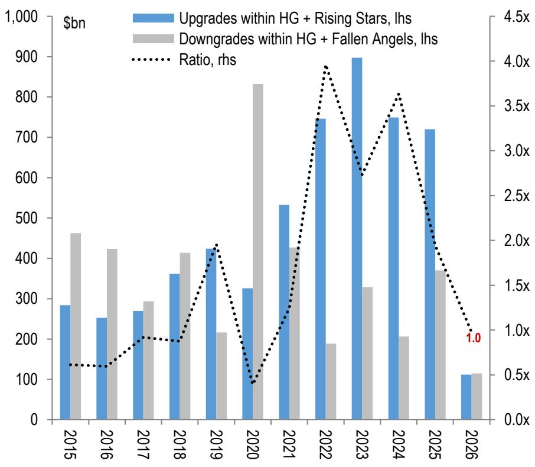

bar_line

| Year | Upgrades within HG + Rising Stars, lhs ($bn) | Downgrades within HG + Fallen Angels, lhs ($bn) | Ratio, rhs |
|------|---------------------------------------------|-----------------------------------------------|----------|
| 2015 | 280                                         | 460                                           | 1.0x     |
| 2016 | 250                                         | 420                                           | 1.0x     |
| 2017 | 270                                         | 300                                           | 1.0x     |
| 2018 | 360                                         | 410                                           | 1.0x     |
| 2019 | 420                                         | 210                                           | 1.5x     |
| 2020 | 320                                         | 830                                           | 0.5x     |
| 2021 | 530                                         | 420                                           | 1.5x     |
| 2022 | 750                                         | 190                                           | 3.5x     |
| 2023 | 900                                         | 320                                           | 3.0x     |
| 2024 | 750                                         | 200                                           | 3.5x     |
| 2025 | 720                                         | 370                                           | 3.0x     |
| 2026 | 110                                         | 110                                           | 1.0x     |

Source: JPM, Bloomberg Finance L.P.

2026-27 Rising Star Candidates   
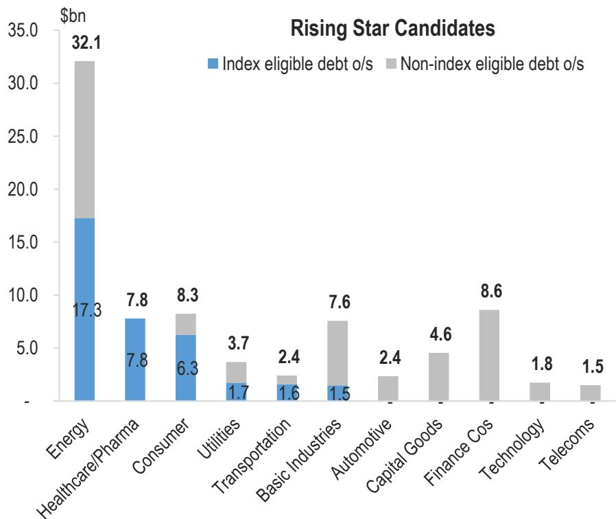

bar_stacked

| Sector           | Index eligible debt o/s | Non-index eligible debt o/s |
| ---------------- | ------------------------ | ---------------------------- |
| Energy           | 17.3                     | 8.3                          |
| Healthcare/Pharma | 7.8                      | -                            |
| Consumer         | 6.3                      | 2.4                          |
| Utilities        | 1.7                      | 3.7                          |
| Transportation   | 1.6                      | 2.4                          |
| Basic Industries | 1.5                      | 7.6                          |
| Automotive       | -                        | 2.4                          |
| Capital Goods    | -                        | 4.6                          |
| Finance Cos      | -                        | 8.6                          |
| Technology       | -                        | 1.8                          |
| Telecoms         | -                        | 1.5                          |

2026-27 Fallen Angel Candidates   
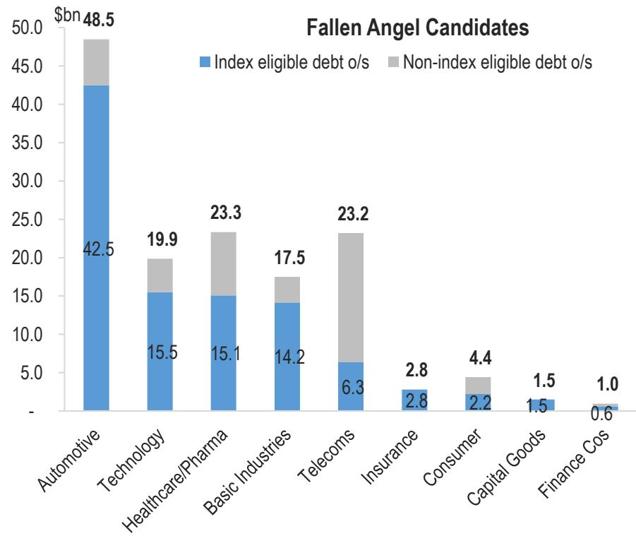

bar_stacked

| Category         | Index eligible debt o/s | Non-index eligible debt o/s |
| ---------------- | ------------------------ | ---------------------------- |
| Automotive       | 42.5                     | 19.9                         |
| Technology       | 15.5                     | 15.1                         |
| Healthcare/Pharma| 15.1                     | 17.5                         |
| Basic Industries | 14.2                     | 23.2                         |
| Telecoms         | 6.3                      | 23.2                         |
| Insurance        | 2.8                      | 4.4                          |
| Consumer         | 2.2                      | 1.5                          |
| Capital Goods    | 1.5                      | 0.6                          |
| Finance Cos      | 0.6                      | 0.0                          |

Source: JPM. As of 03/31/2026

# US HG Credit Sector recommendations – Long Banks and Healthcare vs. Short Cyclicals

<table><tr><td>Sector</td><td>Analyst</td><td>Recommendation</td><td>Spread</td><td>% weight</td></tr><tr><td>US Banks</td><td>Kabir Caprihan</td><td>OW</td><td>95</td><td>12.1%</td></tr><tr><td>Regional US Banks</td><td></td><td>N</td><td>103</td><td>2.1%</td></tr><tr><td>Large US Banks - Sen HoldCos</td><td></td><td>OW</td><td>91</td><td>8.2%</td></tr><tr><td>Large US Banks - Sub HoldCos</td><td></td><td>N</td><td>122</td><td>0.9%</td></tr><tr><td>Yankee Banks</td><td>Kabir Caprihan</td><td>OW</td><td>102</td><td>9.1%</td></tr><tr><td>UK Holdco</td><td></td><td>OW</td><td>113</td><td>2.1%</td></tr><tr><td>Japanese Banks</td><td></td><td>OW</td><td>90</td><td>1.5%</td></tr><tr><td>Euro Senior</td><td></td><td>OW</td><td>106</td><td>2.2%</td></tr><tr><td>Euro Sen Non Pref</td><td></td><td>N</td><td>77</td><td>0.1%</td></tr><tr><td>Australia/NZ Banks</td><td></td><td>OW</td><td>86</td><td>1.0%</td></tr><tr><td>Canadian Banks</td><td></td><td>UW</td><td>70</td><td>1.1%</td></tr><tr><td>Finance Companies</td><td>Kabir Caprihan</td><td>UW</td><td>120</td><td>3.9%</td></tr><tr><td>Insurance</td><td>Brett Gibson</td><td>UW</td><td>106</td><td>4.8%</td></tr><tr><td>Life Insurance</td><td></td><td>UW</td><td>113</td><td>3.0%</td></tr><tr><td>P&amp;C Insurance</td><td></td><td>N</td><td>97</td><td>1.8%</td></tr><tr><td>Automotive</td><td>Evan Piascik</td><td>UW</td><td>118</td><td>3.1%</td></tr><tr><td>Automotive Finance Co</td><td></td><td>UW</td><td>111</td><td>2.5%</td></tr><tr><td>Automotive Manufacturing</td><td></td><td>UW</td><td>156</td><td>0.4%</td></tr><tr><td>Automotive Suppliers</td><td></td><td>UW</td><td>92</td><td>0.2%</td></tr><tr><td>Basic Industries</td><td></td><td>UW</td><td>106</td><td>3.0%</td></tr><tr><td>Metals/Mining</td><td>Arjun Chandar</td><td>UW</td><td>92</td><td>0.9%</td></tr><tr><td>Paper/Packaging</td><td>Arjun Chandar</td><td>N</td><td>105</td><td>0.4%</td></tr><tr><td>Chemicals</td><td>Aaron Rosenthal</td><td>UW</td><td>123</td><td>1.0%</td></tr><tr><td>Capital Goods</td><td></td><td>N</td><td>81</td><td>4.8%</td></tr><tr><td>Aerospace/Defense</td><td>Yilma Abebe</td><td>OW</td><td>88</td><td>2.1%</td></tr><tr><td>Manufacturing</td><td>Evan Piascik</td><td>N</td><td>74</td><td>2.7%</td></tr><tr><td>Consumer</td><td>Carla Casella</td><td>N</td><td>88</td><td>6.3%</td></tr><tr><td>Tobacco</td><td></td><td>OW</td><td>102</td><td>1.2%</td></tr><tr><td>Food/Beverages</td><td></td><td>UW</td><td>87</td><td>3.6%</td></tr><tr><td>Consumer Products</td><td></td><td>UW</td><td>71</td><td>0.8%</td></tr></table>

<table><tr><td>Sector</td><td>Analyst</td><td>Recommendation</td><td>Spread</td><td>% weight</td></tr><tr><td>Energy</td><td>Matthew Anavy</td><td>N</td><td>104</td><td>7.2%</td></tr><tr><td>Pipelines/Midstream/MLP</td><td></td><td>N</td><td>115</td><td>3.5%</td></tr><tr><td>Integrated Energy</td><td></td><td>N</td><td>75</td><td>1.7%</td></tr><tr><td>Exploration/Production</td><td></td><td>UW</td><td>110</td><td>1.3%</td></tr><tr><td>Refiners</td><td></td><td>N</td><td>112</td><td>0.4%</td></tr><tr><td>Energy Services</td><td></td><td>UW</td><td>99</td><td>0.3%</td></tr><tr><td>Healthcare Pharmaceuticals</td><td>Brett Gibson</td><td>OW</td><td>88</td><td>10.2%</td></tr><tr><td>Large Cap Pharma</td><td></td><td>OW</td><td>73</td><td>3.6%</td></tr><tr><td>Medical Devices</td><td></td><td>N</td><td>76</td><td>1.3%</td></tr><tr><td>Biotech Generics</td><td></td><td>N</td><td>86</td><td>2.0%</td></tr><tr><td>Healthcare Services</td><td></td><td>OW</td><td>109</td><td>3.4%</td></tr><tr><td>Media Entertainment</td><td>Erica Spear</td><td>UW</td><td>132</td><td>2.9%</td></tr><tr><td>Cable/Satellite</td><td></td><td>UW</td><td>157</td><td>1.7%</td></tr><tr><td>Diversified Media</td><td></td><td>UW</td><td>99</td><td>1.3%</td></tr><tr><td>Property Real Estate</td><td>Mark Streeter</td><td>N</td><td>100</td><td>2.6%</td></tr><tr><td>Retail</td><td>Carla Casella</td><td>UW</td><td>80</td><td>2.6%</td></tr><tr><td>Food/Drug Retail</td><td></td><td>UW</td><td>91</td><td>0.7%</td></tr><tr><td>Non-Food Retail</td><td></td><td>UW</td><td>76</td><td>1.9%</td></tr><tr><td>Technology</td><td>Erica Spear</td><td>N</td><td>105</td><td>10.9%</td></tr><tr><td>Telecoms</td><td>Erica Spear</td><td>N</td><td>104</td><td>4.2%</td></tr><tr><td>Domestic Telecoms</td><td></td><td>N</td><td>103</td><td>3.3%</td></tr><tr><td>Yankee Telecoms</td><td></td><td>N</td><td>109</td><td>0.9%</td></tr><tr><td>Transportation</td><td>Mark Streeter</td><td>N</td><td>87</td><td>2.4%</td></tr><tr><td>Aviation</td><td></td><td>N</td><td>110</td><td>0.6%</td></tr><tr><td>Freight</td><td></td><td>N</td><td>92</td><td>0.6%</td></tr><tr><td>Railroads</td><td></td><td>UW</td><td>81</td><td>1.2%</td></tr><tr><td>Utilities</td><td>Kevin Kwan</td><td>N</td><td>97</td><td>9.9%</td></tr><tr><td>Utilities OpCos</td><td></td><td>N</td><td>95</td><td>6.4%</td></tr><tr><td>Utilities HoldCos</td><td></td><td>N</td><td>102</td><td>2.5%</td></tr><tr><td>Utilities Power Gencos</td><td></td><td>N</td><td>115</td><td>0.4%</td></tr></table>

High Grade - Activity up 17% y/y driven by CDX products, especially the CDX index 

<table><tr><td>$bn/day</td><td>2025</td><td>2024</td><td>2023</td><td>% chg since % chg since 2024</td><td>2023</td></tr><tr><td>Single names</td><td>47.1</td><td>43.1</td><td>35.1</td><td>9%</td><td>34%</td></tr><tr><td>Secondary bond</td><td>38.1</td><td>34.6</td><td>27.9</td><td>10%</td><td>36%</td></tr><tr><td>memo: y/y change in bond market size</td><td></td><td></td><td></td><td>5%</td><td>9%</td></tr><tr><td>Primary bond</td><td>6.6</td><td>6.0</td><td>4.8</td><td>9%</td><td>36%</td></tr><tr><td>Single name CDS</td><td>2.4</td><td>2.5</td><td>2.4</td><td>-1%</td><td>3%</td></tr><tr><td>CDX products</td><td>73.8</td><td>60.4</td><td>53.5</td><td>22%</td><td>38%</td></tr><tr><td>CDX.IG index</td><td>63.3</td><td>46.9</td><td>43.8</td><td>35%</td><td>45%</td></tr><tr><td>memo: CDX daily chg</td><td>0.9</td><td>0.8</td><td>1.4</td><td>14%</td><td>-34%</td></tr><tr><td>CDX.IG options</td><td>10.3</td><td>13.2</td><td>9.6</td><td>-22%</td><td>8%</td></tr><tr><td>CDX.IG tranches</td><td>0.2</td><td>0.3</td><td>0.2</td><td>-29%</td><td>10%</td></tr><tr><td>Macro cash</td><td>6.4</td><td>5.4</td><td>4.7</td><td>18%</td><td>36%</td></tr><tr><td>iBoxx TRS</td><td>0.1</td><td>0.1</td><td>0.1</td><td>-4%</td><td>7%</td></tr><tr><td>Credit Futures</td><td>0.4</td><td>0.1</td><td>0.0</td><td>314%</td><td>879%</td></tr><tr><td>ETF</td><td>5.4</td><td>4.6</td><td>4.0</td><td>18%</td><td>34%</td></tr><tr><td>ETF Options</td><td>0.5</td><td>0.6</td><td>0.5</td><td>-19%</td><td>-5%</td></tr><tr><td>Total</td><td>127.3</td><td>108.9</td><td>93.3</td><td>17%</td><td>36%</td></tr></table>

Source: JPM., Bloomberg Finance L.P., DTCC, SDR, FINRA, offTR = Off-the-run

High Yield trading - Activity up 26% driven by CDX and Macro cash 

<table><tr><td>$bn/day</td><td>2025</td><td>2024</td><td>2023</td><td>% chg since 2024</td><td>% chg since 2023</td></tr><tr><td>Single names</td><td>12.1</td><td>10.5</td><td>9.9</td><td>15%</td><td>21%</td></tr><tr><td>Secondary bond</td><td>10.1</td><td>8.5</td><td>8.3</td><td>18%</td><td>22%</td></tr><tr><td>memo: y/y change in bond market size</td><td></td><td></td><td></td><td>4%</td><td>3%</td></tr><tr><td>Primary bond</td><td>1.3</td><td>1.1</td><td>0.7</td><td>16%</td><td>88%</td></tr><tr><td>Single name CDS</td><td>0.6</td><td>0.8</td><td>0.9</td><td>-25%</td><td>-32%</td></tr><tr><td>CDX products</td><td>18.5</td><td>14.2</td><td>14.6</td><td>30%</td><td>27%</td></tr><tr><td>CDX.HY index</td><td>15.5</td><td>11.7</td><td>12.5</td><td>32%</td><td>24%</td></tr><tr><td>memo: CDX daily chg</td><td>4.9</td><td>4.1</td><td>7.6</td><td>20%</td><td>-35%</td></tr><tr><td>CDX.HY options</td><td>2.8</td><td>2.4</td><td>1.9</td><td>20%</td><td>48%</td></tr><tr><td>CDX.HY tranches</td><td>0.2</td><td>0.2</td><td>0.2</td><td>1%</td><td>-7%</td></tr><tr><td>Macro cash</td><td>8.8</td><td>6.5</td><td>7.8</td><td>35%</td><td>13%</td></tr><tr><td>iBoxx TRS</td><td>0.2</td><td>0.2</td><td>0.2</td><td>-4%</td><td>-9%</td></tr><tr><td>Credit Futures</td><td>0.3</td><td>0.1</td><td>0.0</td><td>273%</td><td>466%</td></tr><tr><td>ETF</td><td>4.6</td><td>3.9</td><td>4.4</td><td>18%</td><td>3%</td></tr><tr><td>ETF Options</td><td>3.8</td><td>2.3</td><td>3.1</td><td>62%</td><td>21%</td></tr><tr><td>Total</td><td>39.4</td><td>31.3</td><td>32.4</td><td>26%</td><td>22%</td></tr></table>

Source: JPM, Bloomberg Finance L.P., DTCC, SDR, FINRA, offTR = Off-the-run

Analyst Certification: The Research Analyst(s) denoted by an “AC” on the cover of this report certifies (or, where multiple Research Analysts are primarily responsible for this report, the Research Analyst denoted by an “AC” on the cover or within the document individually certifies, with respect to each security or issuer that the Research Analyst covers in this research) that: (1) all of the views expressed in this report accurately reflect the Research Analyst’s personal views about any and all of the subject securities or issuers; and (2) no part of any of the Research Analyst's compensation was, is, or will be directly or indirectly related to the specific recommendations or views expressed by the Research Analyst(s) in this report. For all Korea-based Research Analysts listed on the front cover, if applicable, they also certify, as per KOFIA requirements, that the Research Analyst’s analysis was made in good faith and that the views reflect the Research Analyst’s own opinion, without undue influence or intervention.

All authors named within this report are Research Analysts who produce independent research unless otherwise specified. In Europe, Sector Specialists (Sales and Trading) may be shown on this report as contacts but are not authors of the report or part of the Research Department.

# Important Disclosures

Company-Specific Disclosures: JPM does and seeks to do business with companies covered in its research reports. As a result, investors should be aware that the firm may have a conflict of interest that could affect the objectivity of this report. Investors should consider this report as only a single factor in making their investment decision. Important disclosures, including price charts and credit opinion history tables (if applicable), are available for compendium reports and all JPM-covered companies, and certain non-covered companies, by visiting https://www.jpmm.com/research/disclosures, calling 1-800-477-0406, or e-mailing research.disclosure.inquiries@JPM.com with your request.

# History of Investment Recommendations:

A history of JPM investment recommendations disseminated during the preceding 12 months can be accessed on the Research & Commentary page of http://www.JPMmarkets.com where you can also search by analyst name, sector or financial instrument.

# Explanation of Credit Research Valuation Methodology, Ratings and Risk to Ratings:

JPM uses a bond-level rating system that incorporates valuations (relative value) and our fundamental view on the security. Our fundamental credit view of an issuer is based on the company's underlying credit trends, overall creditworthiness and our opinion on whether the issuer will be able to service its debt obligations when they become due and payable. We analyze, among other things, the company's cash flow capacity and trends and standard credit ratios, such as gross and net leverage, interest coverage and liquidity ratios. We also analyze profitability, capitalization and asset quality, among other variables, when assessing financials. Analysts also rate the issuer, based on the rating of the benchmark or representative security. Unless we specify a different recommendation for the company's individual securities, an issuer recommendation applies to all of the bonds at the same level of the issuer's capital structure. We may also rate certain loans and preferred securities, as applicable. This report also sets out within it the material underlying assumptions used.

We use the following ratings for bonds (issues), issuers, loans, and preferred securities: Overweight (over the next three months, the recommended risk position is expected to outperform the relevant index, sector, or benchmark); Neutral (over the next three months, the recommended risk position is expected to perform in line with the relevant index, sector, or benchmark); and Underweight (over the next three months, the recommended risk position is expected to underperform the relevant index, sector, or benchmark).

For CDS, we use the following rating system: Long Risk (over the next three months, the credit return on the recommended position is expected to exceed the relevant index, sector or benchmark); Neutral (over the next three months, the credit return on the recommended position is expected to match the relevant index, sector or benchmark); and Short Risk (over the next three months, the credit return on the recommended position is expected to underperform the relevant index, sector or benchmark).

JPM Credit Research Ratings Distribution, as of April 04, 2026 

<table><tr><td></td><td>Overweight (buy)</td><td>Neutral (hold)</td><td>Underweight (sell)</td></tr><tr><td>Global Credit Research Universe*</td><td>27%</td><td>57%</td><td>16%</td></tr><tr><td>IB clients**</td><td>84%</td><td>84%</td><td>89%</td></tr></table>

\*Please note that the percentages may not add to 100% because of rounding.   
\*\*Percentage of subject companies within each of the "Overweight," "Neutral" and "Underweight" categories for which JPM has provided investment banking services within the previous 12 months. For purposes of FINRA ratings distribution rules only, our Overweight rating falls into a buy rating category; our Neutral rating falls into a hold rating category; and our Underweight rating falls into a sell rating category. The Credit Research Rating Distribution is at the issuer level. Issuers with an NR or an NC designation are not included in the table above. This information is current as of the end of the most recent calendar quarter.

Analysts' Compensation: The research analysts responsible for the preparation of this report receive compensation based upon various factors, including the quality and accuracy of research, client feedback, competitive factors, and overall firm revenues.

# Other Disclosures

JPM is a marketing name for investment banking businesses of JPM Chase & Co. and its subsidiaries and affiliates worldwide.

UK MIFID FICC research unbundling exemption: UK clients should refer to UK MIFID Research Unbundling exemption for details of JPM's implementation of the FICC research exemption and guidance on relevant FICC research categorisation.

Any long form nomenclature for references to China; Hong Kong; Taiwan; and Macau within this research material are Mainland China; Hong Kong SAR (China); Taiwan (China); and Macau SAR (China).

JPM may, from time to time, write on issuers or securities targeted by economic or financial sanctions imposed or administered by the governmental authorities of the U.S., EU, UK or other relevant jurisdictions (Sanctioned Securities). Nothing in this report is intended to be read or construed as encouraging, facilitating, promoting or otherwise approving investment or dealing in such Sanctioned Securities. Clients should be aware of their own legal and compliance obligations when making investment decisions.

Any digital or crypto assets discussed in this research report are subject to a rapidly changing regulatory landscape. For relevant regulatory advisories on crypto assets, including bitcoin and ether, please see https://www.JPM.com/disclosures/cryptoasset-disclosure.

The author(s) of this research report may not be licensed to carry on regulated activities in your jurisdiction and, if not licensed, do not hold themselves out as being able to do so.

Exchange-Traded Funds (ETFs): JPM Securities LLC (“JPMS”) acts as authorized participant for substantially all U.S.-listed ETFs. To the extent that any ETFs are mentioned in this report, JPMS may earn commissions and transaction-based compensation in connection with the distribution of those ETF shares and may earn fees for performing other trade-related services, such as securities lending to short sellers of the ETF shares. JPMS may also perform services for the ETFs themselves, including acting as

a broker or dealer to the ETFs. In addition, affiliates of JPMS may perform services for the ETFs, including trust, custodial, administration, lending, index calculation and/or maintenance and other services.

Options and Futures related research: If the information contained herein regards options- or futures-related research, such information is available only to persons who have received the proper options or futures risk disclosure documents. Please contact your JPM Representative or visit https://www.theocc.com/components/docs/riskstoc.pdf for a copy of the Option Clearing Corporation's Characteristics and Risks of Standardized Options or https://www.finra.org/sites/default/files/2020-08/Security\_Futures\_Risk\_Disclosure\_Statement\_2020.pdf for a copy of the Security Futures Risk Disclosure Statement.

Changes to Interbank Offered Rates (IBORs) and other benchmark rates: Certain interest rate benchmarks are, or may in the future become, subject to ongoing international, national and other regulatory guidance, reform and proposals for reform. For more information, please consult: https://www.JPM.com/global/disclosures/interbank\_offered\_rates

Private Bank Clients: Where you are receiving research as a client of the private banking businesses offered by JPM Chase & Co. and its subsidiaries (“JPM Private Bank”), research is provided to you by JPM Private Bank and not by any other division of JPM, including, but not limited to, the JPM Corporate and Investment Bank and its Global Research division.

Legal entity responsible for the production and distribution of research: The legal entity identified below the name of the Reg AC Research Analyst who authored this material is the legal entity responsible for the production of this research. Where multiple Reg AC Research Analysts authored this material with different legal entities identified below their names, these legal entities are jointly responsible for the production of this research. Where more than one legal entity is listed under an analyst's name, the first legal entity is responsible for the production unless stated otherwise. Research Analysts from various JPM affiliates may have contributed to the production of this material but may not be licensed to carry out regulated activities in your jurisdiction (and do not hold themselves out as being able to do so). Unless otherwise stated below in the legal entity disclosures, this material has been distributed by the legal entity responsible for production, or where more than one legal entity is listed under the analyst's name, the first legal entity will be responsible for distribution. If you have any queries, please contact the relevant Research Analyst in your jurisdiction or the entity in your jurisdiction that has distributed this research material.

# Legal Entities Disclosures and Country-/Region-Specific Disclosures:

Argentina: JPM Chase Bank N.A Sucursal Buenos Aires is regulated by Banco Central de la República Argentina (“BCRA”- Central Bank of Argentina) and Comisión Nacional de Valores (“CNV”- Argentinian Securities Commission - ALYC y AN Integral N°51).   
Australia: JPM Securities Australia Limited (“JPMSAL”) (ABN 61 003 245 234/AFS Licence No: 238066) is regulated by the Australian Securities and Investments Commission and is a Market Participant of ASX Limited, a Clearing and Settlement Participant of ASX Clear Pty Limited and a Clearing Participant of ASX Clear (Futures) Pty Limited. This material is issued and distributed in Australia by or on behalf of JPMSAL only to "wholesale clients" (as defined in section 761G of the Corporations Act 2001). A list of all financial products covered can be found by visiting https://www.jpmm.com/research/disclosures. JPM seeks to cover companies of relevance to the domestic and international investor base across all Global Industry Classification Standard (GICS) sectors, as well as across a range of market capitalisation sizes. If applicable, in the course of conducting public side due diligence on the subject company(ies), the Research Analyst team may at times perform such diligence through corporate engagements such as site visits, discussions with company representatives, management presentations, etc. Research issued by JPMSAL has been prepared in accordance with JPM Australia’s Research Independence Policy which can be found at the following link: JPM Australia - Research Independence Policy.   
Brazil: Banco JPM S.A. is regulated by the Comissao de Valores Mobiliarios (CVM) and by the Central Bank of Brazil. Ombudsman JPM: 0800-7700847 / 0800-7700810 (For Hearing Impaired) / ouvidoria.jp.morgan@jpmchase.com.   
Canada: JPM Securities Canada Inc. is a registered investment dealer, regulated by the Canadian Investment Regulatory Organization and the Ontario Securities Commission and is the participating member on Canadian exchanges. This material is distributed in Canada by or on behalf of JPM Securities Canada Inc.   
Chile: Inversiones JPM Limitada is an unregulated entity incorporated in Chile.   
China: JPM Securities (China) Company Limited has been approved by CSRC to conduct the securities investment consultancy business.

Colombia: Banco JPM Colombia S.A. is supervised by the Superintendencia Financiera de Colombia (SFC).

Dubai International Financial Centre (DIFC): JPM Chase Bank, N.A., Dubai Branch is regulated by the Dubai Financial Services Authority (DFSA) and its registered address is Dubai International Financial Centre - The Gate, West Wing, Level 3 and 9 PO Box 506551, Dubai, UAE. This material has been distributed by JPM Chase Bank, N.A., Dubai Branch to persons regarded as professional clients or market counterparties as defined under the DFSA rules.

European Economic Area (EEA): Unless specified to the contrary, research is distributed in the EEA by JPM SE (“JPM SE”), which is authorised as a credit institution by the Federal Financial Supervisory Authority (Bundesanstalt für Finanzdienstleistungsaufsicht, BaFin) and jointly supervised by the BaFin, the German Central Bank (Deutsche Bundesbank) and the European Central Bank (ECB). JPM SE is a company headquartered in Frankfurt with registered address at TaunusTurm, Taunustor 1, Frankfurt am Main, 60310, Germany. The material has been distributed in the EEA to persons regarded as professional investors (or equivalent) pursuant to Art. 4 para. 1 no. 10 and Annex II of MiFID II and its respective implementation in their home jurisdictions (“EEA professional investors”). This material must not be acted on or relied on by persons who are not EEA professional investors. Any investment or investment activity to which this material relates is only available to EEA relevant persons and will be engaged in only with EEA relevant persons.

Hong Kong: JPM Securities (Asia Pacific) Limited (CE number AAJ321) is regulated by the Hong Kong Monetary Authority and the Securities and Futures Commission in Hong Kong, and JPM Broking (Hong Kong) Limited (CE number AAB027) is regulated by the Securities and Futures Commission in Hong Kong. JPM Chase Bank, N.A., Hong Kong Branch (CE Number AAL996) is regulated by the Hong Kong Monetary Authority and the Securities and Futures Commission, is organized under the laws of the United States with limited liability. Where the distribution of this material is a regulated activity in Hong Kong, the material is distributed in Hong Kong by or through JPM Securities (Asia Pacific) Limited and/or JPM Broking (Hong Kong) Limited.
India: JPM India Private Limited (Corporate Identity Number - U67120MH1992FTC068724), having its registered office at JPM Tower, Off. C.S.T. Road, Kalina, Santacruz - East, Mumbai – 400098, is registered with the Securities and Exchange Board of India (SEBI) as a ‘Research Analyst’ having registration number INH000001873. JPM India Private Limited is also registered with SEBI as a member of the National Stock Exchange of India Limited and the Bombay Stock Exchange Limited (SEBI Registration Number – INZ000239730) and as a Merchant Banker (SEBI Registration Number - MB/INM000002970). Telephone: 91-22-6157 3000, Facsimile: 91-22-6157 3990 and Website: http://www.jpmipl.com. JPM Chase Bank, N.A. - Mumbai Branch is licensed by the Reserve Bank of India (RBI) (Licence No. 53/ Licence No. BY.4/94; SEBI - IN/CUS/014/ CDSL : IN-DP-CDSL-444-2008/ IN-DP-NSDL-285-2008/ INBI00000984/ INE231311239) as a Scheduled Commercial Bank in India, which is its primary license allowing it to carry on Banking business in India and other activities, which a Bank branch in India are permitted to undertake. For non-local research material, this material is not distributed in India by JPM India Private Limited. Compliance Officer: Prasanna Bandal; prasanna.bandal@jpmchase.com; +912261575159. Grievance Officer: Ramprasadh K, jpmipl.research.feedback@JPM.com; +912261573000. Registration granted by SEBI and certification from NISM in no way guarantee performance of the intermediary or provide any assurance of returns to investors. Please visit Terms and Conditions and Most Important Terms and Conditions (MITC). The annual Compliance audit report is available at http://www.jpmipl.com/#research.

Indonesia: PT JPM Sekuritas Indonesia is a member of the Indonesia Stock Exchange and is registered and supervised by the Otoritas Jasa Keuangan (OJK).

Korea: JPM Securities (Far East) Limited, Seoul Branch, is a member of the Korea Exchange (KRX). JPM Chase Bank, N.A., Seoul Branch, is licensed as a branch office of foreign bank (JPM Chase Bank, N.A.) in Korea. Both entities are regulated by the Financial Services Commission (FSC) and the Financial Supervisory Service (FSS). For non-macro research material, the material is distributed in Korea by or through JPM Securities (Far East) Limited, Seoul Branch.

Japan: JPM Securities Japan Co., Ltd. and JPM Chase Bank, N.A., Tokyo Branch are regulated by the Financial Services Agency in Japan.

Malaysia: This material is issued and distributed in Malaysia by JPM Securities (Malaysia) Sdn Bhd (18146-X), which is a Participating Organization of Bursa Malaysia Berhad and holds a Capital Markets Services License issued by the Securities Commission in Malaysia.

Mexico: JPM Casa de Bolsa, S.A. de C.V. and JPM Grupo Financiero are members of the Mexican Stock Exchange and are authorized to act as a broker dealer by the National Banking and Securities Exchange Commission.

New Zealand: This material is issued and distributed by JPMSAL in New Zealand only to "wholesale clients" (as defined in the Financial Markets Conduct Act 2013). JPMSAL is registered as a Financial Service Provider under the Financial Service providers (Registration and Dispute Resolution) Act of 2008.

Philippines: JPM Securities Philippines Inc. is a Trading Participant of the Philippine Stock Exchange and a member of the Securities Clearing Corporation of the Philippines and the Securities Investor Protection Fund. It is regulated by the Securities and Exchange Commission.

Singapore: This material is issued and distributed in Singapore by or through JPM Securities Singapore Private Limited (JPMSS) [MDDI (P) 057/08/2025 and Co. Reg.

No.: 199405335R], which is a member of the Singapore Exchange Securities Trading Limited, and/or JPM Chase Bank, N.A., Singapore branch (JPMCB Singapore), both of which are regulated by the Monetary Authority of Singapore. This material is issued and distributed in Singapore only to accredited investors, expert investors and institutional investors, as defined in Section 4A of the Securities and Futures Act, Cap. 289 (SFA). This material is not intended to be issued or distributed to any retail investors or any other investors that do not fall into the classes of “accredited investors,” “expert investors” or “institutional investors,” as defined under Section 4A of the SFA. Recipients of this material in Singapore are to contact JPMSS or JPMCB Singapore in respect of any matters arising from, or in connection with, the material.

South Africa: JPM Equities South Africa Proprietary Limited and JPM Chase Bank, N.A., Johannesburg Branch are members of the Johannesburg Securities Exchange and are regulated by the Financial Services Conduct Authority (FSCA).

Taiwan: JPM Securities (Taiwan) Limited is a participant of the Taiwan Stock Exchange (company-type) and regulated by the Taiwan Securities and Futures Bureau. Material relating to equity securities is issued and distributed in Taiwan by JPM Securities (Taiwan) Limited, subject to the license scope and the applicable laws and the regulations in Taiwan. To the extent that JPM Securities (Taiwan) Limited produces research materials on securities not listed on the Taiwan Stock Exchange or Taipei Exchange (“Non-Taiwan Listed Securities”), these materials shall not constitute securities recommendations for the purpose of applicable Taiwan regulations, and, for the avoidance of doubt, JPM Securities (Taiwan) Limited does not act as broker for Non-Taiwan Listed Securities. According to Paragraph 2, Article 7-1 of Operational Regulations Governing Securities Firms Recommending Trades in Securities to Customers (as amended or supplemented) and/or other applicable laws or regulations, please note that the recipient of this material is not permitted to engage in any activities in connection with the material that may give rise to conflicts of interests, unless otherwise disclosed in the “Important Disclosures” in this material.

Thailand: This material is issued and distributed in Thailand by JPM Securities (Thailand) Ltd., which is a member of the Stock Exchange of Thailand and is regulated by the Ministry of Finance and the Securities and Exchange Commission, and its registered address is 3rd Floor, 20 North Sathorn Road, Silom, Bangrak, Bangkok 10500.

UK: Research is produced in the UK by JPM Securities plc (“JPMS plc”) which is a member of the London Stock Exchange and is authorised by the Prudential Regulation Authority and regulated by the Financial Conduct Authority and the Prudential Regulation Authority or JPM Markets Limited (“JPMML Ltd”) which is authorised and regulated by the Financial Conduct Authority. Unless specified to the contrary, this material is distributed in the UK by JPMS plc and is directed in the UK only to: (a) persons having professional experience in matters relating to investments falling within article 19(5) of the Financial Services and Markets Act 2000 (Financial Promotion) (Order) 2005 (“the FPO”); (b) persons outlined in article 49 of the FPO (high net worth companies, unincorporated associations or partnerships, the trustees of high value trusts, etc.); or (c) any persons to whom this communication may otherwise lawfully be made; all such persons being referred to as "UK relevant persons". This material must not be acted on or relied on by persons who are not UK relevant persons. Any investment or investment activity to which this material relates is only available to UK relevant persons and will be engaged in only with UK relevant persons. A description of JPM EMEA’s policy for prevention and avoidance of conflicts of interest related to the production of Research can be found at the following link: JPM EMEA - Research Independence Policy.

U.S.: JPM Securities LLC (“JPMS”) is a member of the NYSE, FINRA, SIPC, and the NFA. JPM Chase Bank, N.A. is a member of the FDIC. Material published by non-U.S. affiliates is distributed in the U.S. by JPMS who accepts responsibility for its content.

General: Additional information is available upon request. The information in this material has been obtained from sources believed to be reliable. While all reasonable care has been taken to ensure that the facts stated in this material are accurate and that the forecasts, opinions and expectations contained herein are fair and reasonable, JPM Chase & Co. or its affiliates and/or subsidiaries (collectively JPM) make no representations or warranties whatsoever to the completeness or accuracy of the material provided, except with respect to any disclosures relative to JPM and the Research Analyst's involvement with the issuer that is the subject of the material. Accordingly, no reliance should be placed on the accuracy, fairness or completeness of the information contained in this material. There may be certain discrepancies with data and/or limited content in this material as a result of calculations, adjustments, translations to different languages, and/or local regulatory restrictions, as applicable. These discrepancies should not impact the overall investment analysis, views and/or recommendations of the subject company(ies) that may be discussed in the material. Artificial intelligence tools may have been used in the preparation of this material, including assisting in data analysis, pattern recognition, and content drafting for research material. JPM accepts no liability whatsoever for any loss arising from any use of this material or its contents, and neither JPM nor any of its respective directors, officers or employees, shall be in any way responsible for the contents hereof, apart from the liabilities and responsibilities that may be imposed on them by the relevant regulatory authority in the jurisdiction in question, or the regulatory regime thereunder. Opinions, forecasts or projections contained in this material represent JPM's current opinions or judgment as of the date of the material only and are therefore subject to change without notice. Periodic updates may be provided on companies/industries based on company-specific developments or announcements, market

conditions or any other publicly available information. There can be no assurance that future results or events will be consistent with any such opinions, forecasts or projections, which represent only one possible outcome. Furthermore, such opinions, forecasts or projections are subject to certain risks, uncertainties and assumptions that have not been verified, and future actual results or events could differ materially. The value of, or income from, any investments referred to in this material may fluctuate and/or be affected by changes in exchange rates. All pricing is indicative as of the close of market for the securities discussed, unless otherwise stated. Past performance is not indicative of future results. Accordingly, investors may receive back less than originally invested. This material is not intended as an offer or solicitation for the purchase or sale of any financial instrument. The opinions and recommendations herein do not take into account individual client circumstances, objectives, or needs and are not intended as recommendations of particular securities, financial instruments or strategies to particular clients. This material may include views on structured securities, options, futures and other derivatives. These are complex instruments, may involve a high degree of risk and may be appropriate investments only for sophisticated investors who are capable of understanding and assuming the risks involved. The recipients of this material must make their own independent decisions regarding any securities or financial instruments mentioned herein and should seek advice from such independent financial, legal, tax or other adviser as they deem necessary. JPM may trade as a principal on the basis of the Research Analysts' views and research, and it may also engage in transactions for its own account or for its clients' accounts in a manner inconsistent with the views taken in this material, and JPM is under no obligation to ensure that such other communication is brought to the attention of any recipient of this material. Others within JPM, including Strategists, Sales staff and other Research Analysts, may take views that are inconsistent with those taken in this material. Employees of JPM not involved in the preparation of this material may have investments in the securities (or derivatives of such securities) mentioned in this material and may trade them in ways different from those discussed in this material. This material is not an advertisement for or marketing of any issuer, its products or services, or its securities in any jurisdiction.

Confidentiality and Security Notice: This transmission may contain information that is privileged, confidential, legally privileged, and/or exempt from disclosure under applicable law. If you are not the intended recipient, you are hereby notified that any disclosure, copying, distribution, or use of the information contained herein (including any reliance thereon) is STRICTLY PROHIBITED. Although this transmission and any attachments are believed to be free of any virus or other defect that might affect any computer system into which it is received and opened, it is the responsibility of the recipient to ensure that it is virus free and no responsibility is accepted by JPM Chase & Co., its subsidiaries and affiliates, as applicable, for any loss or damage arising in any way from its use. If you received this transmission in error, please immediately contact the sender and destroy the material in its entirety, whether in electronic or hard copy format. This message is subject to electronic monitoring: https://www.JPM.com/disclosures/email

MSCI: Certain information herein (“Information”) is reproduced by permission of MSCI Inc., its affiliates and information providers (“MSCI”) ©2026. No reproduction or dissemination of the Information is permitted without an appropriate license. MSCI MAKES NO EXPRESS OR IMPLIED WARRANTIES (INCLUDING MERCHANTABILITY OR FITNESS) AS TO THE INFORMATION AND DISCLAIMS ALL LIABILITY TO THE EXTENT PERMITTED BY LAW. No Information constitutes investment advice, except for any applicable Information from MSCI ESG Research. Subject also to msci.com/disclaimer

Sustainalytics: Certain information, data, analyses and opinions contained herein are reproduced by permission of Sustainalytics and: (1) includes the proprietary information of Sustainalytics; (2) may not be copied or redistributed except as specifically authorized; (3) do not constitute investment advice nor an endorsement of any product or project; (4) are provided solely for informational purposes; and (5) are not warranted to be complete, accurate or timely. Sustainalytics is not responsible for any trading decisions, damages or other losses related to it or its use. The use of the data is subject to conditions available at https://www.sustainalytics.com/legal-disclaimers. ©2026 Sustainalytics. All Rights Reserved.

"Other Disclosures" last revised April 04, 2026.

Copyright 2026 JPM Chase & Co. All rights reserved. This material or any portion hereof may not be reprinted, sold or redistributed without the written consent of JPM. It is strictly prohibited to use or share without prior written consent from JPM any research material received from JPM or an authorized third-party (“JPM Data”) in any third-party artificial intelligence (“AI”) systems or models when such JPM Data is accessible by a third-party.