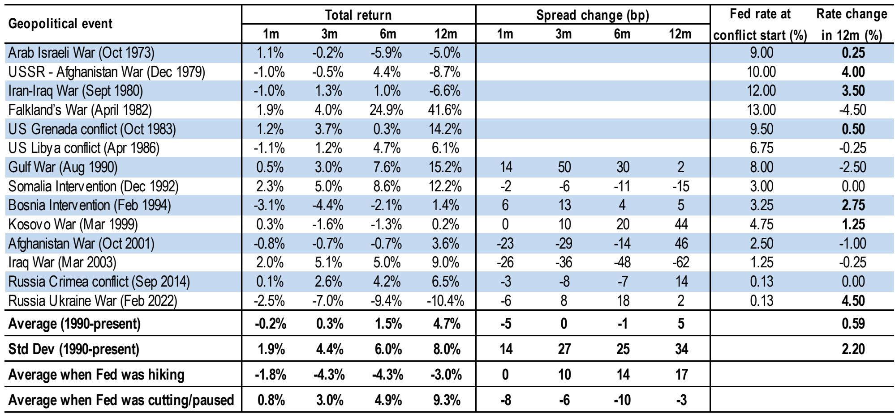
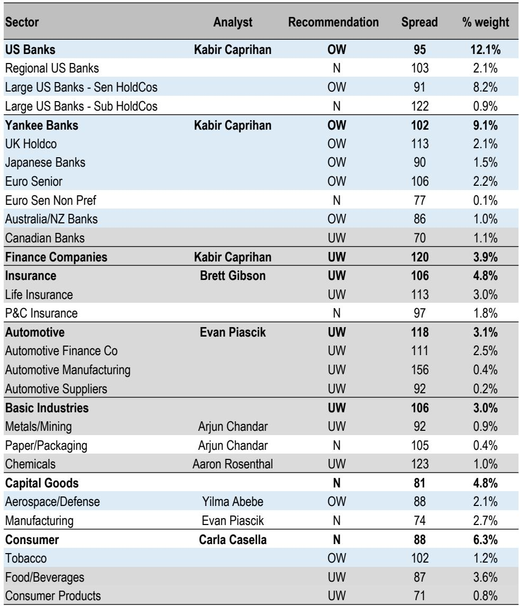
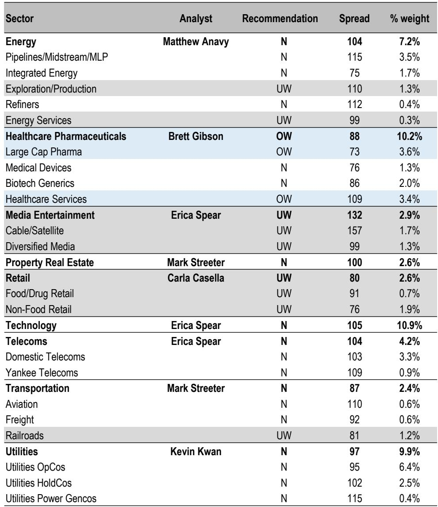

# US High Grade Credit Is Not a Carry Trade — It Is a Structural Scarce Asset

The conventional narrative in fixed income markets today holds that US high grade credit is expensive, that spreads are too tight relative to history, and that the asset class is a crowded trade waiting for a catalyst to break. This view is dangerously incomplete. A careful reading of the data — from market structure to issuance dynamics to the unprecedented funding needs of the AI buildout — suggests the opposite conclusion: US investment grade credit is becoming a structurally scarce asset, and spreads are more likely to tighten further than to widen meaningfully over the next twelve months.

The argument is not based on a benign macro forecast alone. It is grounded in three structural forces that are reshaping the high grade market from the inside out. First, the composition of the aggregate index is shifting in ways that mechanically compress corporate spreads. Second, the AI and data center buildout is creating a multi-year, investment-grade-quality capital demand that is unlike any sectoral wave in recent memory. Third, the supply-demand technicals for high grade bonds are the most favorable they have been in two decades, even as gross issuance reaches new highs.

This is not a call for complacency. Macro uncertainty is elevated, tariff policy is fluid, and geopolitical risk is real. But the report from a leading global investment bank makes clear that the balance of forces favors spread compression. The question for institutional investors is not whether to own high grade credit. The question is whether they are positioned to own it through the lens of structural scarcity rather than tactical carry.

## The Treasury Share of the Aggregate Index Is Rising, and That Mechanically Biases Corporate Spreads Tighter

One of the most overlooked structural trends in fixed income is the gradual but persistent increase in the share of US Treasuries within the Bloomberg Aggregate Index. Over the past decade, the Treasury component has risen from roughly 35 percent to over 45 percent of the index. This shift is not an accident of issuance patterns. It reflects a sustained increase in federal debt outstanding and a corresponding decline in the relative weight of agency MBS and other spread sectors.

The implication for corporate credit is direct and powerful. As Treasuries take up a larger share of the aggregate index, the overall index spread becomes more heavily influenced by the risk-free component. This mechanically compresses the measured spread of the index even if corporate spreads themselves remain unchanged. More importantly, it changes the behavior of the large pool of index-aware investors — including liability-driven investors, total return mandates, and insurance general accounts — who benchmark against the aggregate. As the index becomes more Treasury-heavy, the marginal buyer of corporate bonds becomes more price-insensitive, because the goal is to match index duration and sector weights rather than to express a view on credit.

This structural shift has been a tailwind for corporate spreads for years, and it shows no sign of reversing. The report projects that the Treasury share will continue to rise, which means that the same level of corporate spread today represents a tighter overall index spread than it would have a decade ago. Investors who compare current spreads to historical averages without adjusting for this compositional shift are comparing apples to oranges. The appropriate benchmark is not the level of spreads but the spread relative to the structural composition of the index.

## AI and Data Center Funding Is Not a Sector Theme — It Is a Capital Markets Mega-Event

The report identifies what may be the most important capital markets development of the decade: the data center and AI buildout is projected to require approximately $5.3 trillion in permanent financing by 2030. To put that number in context, it is roughly equivalent to the entire outstanding par value of the US high grade corporate bond market today. This is not a niche technology theme. It is a fundamental demand shock for investment grade debt.

The funding sources are diverse but the high grade bond market is expected to bear the largest share, with an estimated $1.5 trillion in issuance over the forecast period. This is already visible in the data. High grade data center issuance surged from $4 billion in 2024 to $44 billion in 2025, and the pace is accelerating. The report notes that the AI-related debt in the index now totals roughly 15 percent of the entire high grade market, making it effectively the largest single "sector" in the index, surpassing even US banks.

This has profound implications for spread dynamics. Unlike cyclical sectors that issue debt to fund share buybacks or working capital, AI-related issuance is funding long-dated, capital-intensive assets with high barriers to entry and strong secular demand. The credit quality of the issuers — primarily hyperscalers, regulated utilities, and technology companies — is among the highest in the index. This means that the incremental supply is coming from the most creditworthy part of the market, which limits the spread-widening impact of higher issuance.

Moreover, the report highlights a structural advantage for the high grade market relative to alternative funding sources. The high grade bond market has a weighted average life of over 10 years and a par outstanding of nearly $9 trillion, compared to less than $800 billion for ABS and private label CMBS. By structuring data center funding through the high grade market rather than asset-backed markets, issuers gain access to a deeper, more liquid, and more long-dated investor base. This is not a temporary substitution. It is a permanent shift in how infrastructure-scale capital is raised.

## The High Grade Market Is Growing at the Slowest Pace in 20 Years, and Maturities Are Elevated — A Powerful Technical Tailwind

The most underappreciated technical factor in the high grade market is not the level of gross issuance, which is high, but the net growth of the market, which is historically low. The report shows that the year-over-year change in the par amount of the high grade index is running at the slowest pace in two decades. This is a function of elevated maturities, rising stars, and a relatively low level of fallen angel activity.

When gross issuance is high but net supply is low, the market is effectively recycling capital. New bonds are issued to refinance maturing bonds, not to expand the overall pool of outstanding debt. This creates a structural bid for the market, because the marginal seller is often a natural holder — such as a pension fund or insurance company — that is reinvesting proceeds into new issuance. The report projects that net supply will be roughly $826 billion in 2026, but this is almost entirely absorbed by the combination of rising stars, fallen angels, and the structural demand from index investors.

The maturity wall is also a tailwind. With elevated maturities over the next five years, issuers are forced to come to market regularly, which provides a steady stream of new supply that investors can absorb at predictable spreads. This is the opposite of a supply shock. It is a supply schedule that the market can price efficiently. The risk is not that supply overwhelms demand, but that demand is so strong that spreads compress further as investors chase yield in a market that is not growing fast enough to accommodate all buyers.

The report does not fully explore one important implication: if the high grade market is growing slowly and AI-related issuance is absorbing an increasing share of that growth, then non-AI issuers may face a crowding-out effect. Spreads for non-AI sectors could widen relative to AI sectors, creating a two-tier market. This is a risk that investors should monitor, but it is also an opportunity for active managers who can rotate between sectors based on relative value.

## The Geopolitical Risk Framework Is Incomplete Without the Fed Regime Context

The report includes a detailed historical analysis of geopolitical events and their impact on high grade spreads. The finding is striking: the average spread change following geopolitical conflicts since 1990 is close to zero over a 12-month horizon. More importantly, the outcome depends almost entirely on the Federal Reserve's rate regime. When the Fed was hiking during a conflict, spreads widened by an average of 17 basis points over 12 months. When the Fed was cutting or on hold, spreads tightened by an average of 3 basis points.

This is a critical insight for the current environment. The Fed is currently on hold at 3.75 percent, and the report's economic forecast shows no rate changes through 2026. If the historical pattern holds, even a significant geopolitical event — such as further escalation in the Middle East — would not be a negative for spreads unless it triggers a Fed hiking cycle. The report's conclusion is that the Fed regime is the dominant variable, not the conflict itself.

What the report does not fully answer is how the tariff regime interacts with this framework. The effective tariff rate has risen sharply, and the report shows that static tariff rates using 2024 trade weights are significantly higher than floating rates calculated from actual duties. This gap creates uncertainty about the true economic impact of tariffs. If tariffs push core PCE above 3 percent for an extended period, the Fed may be forced to hike despite weak growth, which would be the worst-case scenario for spreads. The report acknowledges this risk but does not quantify it. Investors should stress-test their portfolios for a scenario where the Fed resumes hiking in 2027 due to tariff-driven inflation.

## A Decision Framework for Institutional Investors

The report provides a rich set of data points, but the real value is in how investors can translate these insights into portfolio decisions. A useful framework is to think of the high grade market as having three distinct drivers: structural, cyclical, and event-driven.

The structural driver is the most powerful but the slowest to change. It includes the rising Treasury share of the aggregate index, the AI funding wave, and the slow net growth of the market. These forces are directionally positive for spreads and will persist for years. Investors should overweight high grade credit relative to history, and they should favor long-duration, high-quality issuers that benefit from the AI buildout.

The cyclical driver is the macro outlook. The report forecasts steady growth, modest inflation, and a stable Fed. If this baseline holds, spreads will tighten toward the 85 basis point target. But the cyclical outlook is more uncertain than usual because of tariff policy and geopolitical risk. Investors should maintain flexibility to reduce duration or rotate into shorter-dated bonds if the macro data deteriorates.

The event-driven driver is the wildcard. Geopolitical conflicts, tariff announcements, and policy surprises can cause short-term spread widening, but the historical evidence suggests that these are buying opportunities if the Fed remains accommodative. Investors should have a pre-defined playbook for adding risk on spread widening, rather than reacting emotionally to headlines.

The open question that the report leaves for further analysis is how the AI funding wave will affect the credit quality of the aggregate index over time. If hyperscalers continue to issue at the current pace, their debt-to-EBITDA ratios will rise, and the market will eventually have to price in higher leverage for the largest issuers. The report does not model this scenario. Investors should monitor the leverage ratios of the top five AI-related issuers and be prepared to adjust sector allocations if credit metrics deteriorate.

## The Full Picture Requires the Original Charts and Data

The analysis in this article is based on a partial reading of a comprehensive report that contains dozens of charts, tables, and detailed forecasts that cannot be fully reproduced here. The report includes granular data on hyperscaler capital expenditure plans, sector-level AI debt exposure, tariff rate scenarios, and historical spread regressions that are essential for building a complete investment thesis. Readers who want to review the original charts and understand the full analytical framework should access the full report.

Join the community to read the full report and review the original charts.

*This article is for learning and discussion only and does not constitute investment advice.*

Personal reading notes and learning share only. Not investment advice.

