# Global Semiconductors & Hardware

# China Smartphone Tracker (April): Pressure spreading to mid-end & price hikes facing resistance

Mark Li

+852 2123 2645

mark.li@bernsteinsg.com

Stacy A. Rasgon, Ph.D.

+1 213 559 5917

stacy.rasgon@bernsteinsg.com

Mark C. Newman

+1 212 845 7822

mark.newman@bernsteinsg.com

Alex Wang, CFA

+852 2123 2613

alex.wang@bernsteinsg.com

Eunice Lee, CFA

+852 2123 2606

eunice.lee@bernsteinsg.com

Aleksander Peterc

+33 1 57 29 45 25

aleksander.peterc@bernsteinsg.com

Please download our smartphone monthly tracker data from here.

The impact of high memory costs spread to the mid-end segment & pressured the overall shipment to a 6-year low. In April, China smartphone sell-through declined 15% MoM and 10% YoY to 16M units. That marked the lowest point since Sep 2021 & brought 4M26 cumulative shipments to 7% drop YoY. On the other hand, some foundries & component suppliers have reported better-than-feared results. We wonder if there is inventory buildup & some delayed damage in 2H26 or 1H27. Mix-wise low-end segment continued to lag and premium segment still outperformed. The mid-range shipment reversed sharply from +16% YoY in March to -16% YoY in April, likely as price hikes gradually took place from late March.

High inventory level as the result of weak acceptance of price hikes? April ASP rose 16% YoY, extending YTD rise driven by both mix shift & like-for-like price increases. However, sell-through lagged notably behind sell-in for non-iPhone OEMs, suggesting that recent price hikes were not well accepted. With “618” promotions coming, we believe ASP rise is likely to moderate as OEMs balance price vs. volume.

Still no improvement to Huawei's premium shipment, & we wonder if LogicFolding & "Tau (τ) Scaling Law" can change that. Huawei's Mate 80 Pro Max model has Kirin 9030 made with SMIC "N+3" & is indicative of China's leading logic capability under export controls. Data showed the wait time for Pro Max has become shorter, but Huawei's premium segment shipment hardly rose. Further on 25 May, Huawei unveiled "LogicFolding" & "Tau (τ) Scaling Law", aiming to narrow the gap vs. TSMC to 3 years in 2031 (vs. c. 6 years now). We however believe they're vertical die stacking & corresponding design optimization that TSMC & the rest of the world have been mass-producing for years. We thus wonder how they can uniquely help Huawei so much more to narrow the gap.

We rate MediaTek Outperform (report, model). Smartphone will likely be a headwind in 2026, but AI ASIC should be more than enough to compensate. We raised our TPU revenue forecast to US\$2B, 15B & 22B for 2026-28, respectively and reiterate Outperform.

We rate Apple Outperform as strength continues and share gains play out (see Apple Deep Dive and recent APPLE TRACKER), helping supply chain including Luxshare (OP). Investor sentiment toward camera component makers (e.g., Sunny Optical, Largan) are improving as investors look past near-term memory headwinds and focus on companies' expansion into optical communications (e.g., CPO) in 2027-28.

Xiaomi's (OP) shipments declined by -23% YoY on a high base, with market share falling to 14.6%, down from 15.6% in March 2026 and 17.0% in April 2025. Shipments of high-end models (RMB 4k+) was largely flat in April 2026. In contrast, mid-range (RMB 2–4k) and low-end (<RMB 2k) segments saw sharper declines of -25% and -29% YoY, respectively, reflecting the company's strategic shift toward premium models amid rising memory prices.

BERNSTEIN TICKER TABLE 

<table><tr><td rowspan="2">Ticker</td><td rowspan="2">Rating</td><td colspan="4">4 Jun 2026</td><td rowspan="2">TTMRel.</td><td colspan="4">Reported EPS</td><td colspan="3">Reported P/E (x)</td></tr><tr><td>Cur</td><td>Closing Price</td><td>Price Target</td><td>Target Perf.</td><td>Cur</td><td>2025A</td><td>2026E</td><td>2027E</td><td>2025A</td><td>2026E</td><td>2027E</td></tr><tr><td>2454.TT (MediaTek)</td><td>O</td><td>TWD</td><td>4,430.00</td><td>4,380.00</td><td>198.2%</td><td>TWD</td><td>66.17</td><td>69.52</td><td>170.50</td><td>67.0</td><td>63.7</td><td>26.0</td><td></td></tr><tr><td>3034.TT (Novatek)</td><td>M</td><td>TWD</td><td>489.00</td><td>370.00</td><td>(50.6)%</td><td>TWD</td><td>26.87</td><td>24.21</td><td>25.10</td><td>18.2</td><td>20.2</td><td>19.5</td><td></td></tr><tr><td>QCOM (Qualcomm )</td><td>M</td><td>USD</td><td>250.01</td><td>140.00</td><td>41.2%</td><td>USD</td><td>12.03</td><td>10.64</td><td>9.77</td><td>20.8</td><td>23.5</td><td>25.6</td><td></td></tr><tr><td>SOI.FP (Soitec)</td><td>O</td><td>EUR</td><td>165.70</td><td>150.00</td><td>222.7%</td><td>EUR</td><td>2.56</td><td>(1.20)</td><td>0.69</td><td>64.7</td><td>(137.7)</td><td>240.2</td><td></td></tr><tr><td>002475.CH ( Luxshare )</td><td>O</td><td>CNY</td><td>74.59</td><td>86.00</td><td>92.9%</td><td>CNY</td><td>2.26</td><td>2.66</td><td>3.45</td><td>33.0</td><td>28.0</td><td>21.6</td><td></td></tr><tr><td>3008.TT (Largan)</td><td>M</td><td>TWD</td><td>3,825.00</td><td>2,600.00</td><td>15.6%</td><td>TWD</td><td>192.41</td><td>154.39</td><td>178.50</td><td>19.9</td><td>24.8</td><td>21.4</td><td></td></tr><tr><td>1810.HK (Xiaomi)</td><td>O</td><td>HKD</td><td>28.40</td><td>43.00</td><td>(73.4)%</td><td>CNY</td><td>1.62</td><td>1.02</td><td>1.77</td><td>1.1</td><td>1.0</td><td>0.8</td><td></td></tr><tr><td>AAPL (Apple )</td><td>O</td><td>USD</td><td>310.26</td><td>350.00</td><td>26.5%</td><td>USD</td><td>7.46</td><td>8.87</td><td>10.65</td><td>41.6</td><td>35.0</td><td>29.1</td><td></td></tr><tr><td>2382.HK (Sunny Optical)</td><td>O</td><td>HKD</td><td>82.30</td><td>76.00</td><td>(13.2)%</td><td>CNY</td><td>4.25</td><td>3.39</td><td>4.46</td><td>16.8</td><td>21.0</td><td>16.0</td><td></td></tr><tr><td>ASIAX</td><td></td><td></td><td>2,057.41</td><td></td><td></td><td></td><td></td><td></td><td></td><td></td><td></td><td></td><td></td></tr><tr><td>SPX</td><td></td><td></td><td>7,553.68</td><td></td><td></td><td></td><td></td><td></td><td></td><td></td><td></td><td></td><td></td></tr><tr><td>EDME</td><td></td><td></td><td>1,540.06</td><td></td><td></td><td></td><td></td><td></td><td></td><td></td><td></td><td></td><td></td></tr></table>

O - Outperform, M - Market-Perform, U - Underperform, NR - Not Rated, CS - Coverage Suspended   
QCOM, SOI.FP, AAPL estimate is Adjusted EPS; QCOM, SOI.FP, AAPL valuation is Adjusted P/E (x); 1810.HK valuation is EV/Sales (x); 3008.TT base year is 2024;   
Source: Bloomberg, Bernstein estimates and analysis.

# INVESTMENT IMPLICATIONS

MediaTek (OP, PT NT\$4,380.00): We rate MediaTek Outperform with PT NT\$4,380.00.

Novatek (MP, PT NT\$370.00): We rate Novatek Market-Perform with PT NT\$370.00.

Apple (OP, PT\$350): We rate AAPL Outperform with PT \$350.00.

QCOM (MP, \$140): Memory headwinds appear likely to pressure smartphone builds and numbers appear high; we shall see if datacenter dream is enough to attract buyers.

Luxshare (OP, PT RMB 86.00): We rate Luxshare Outperform with a RMB86.00 price target.

Sunny Optical (OP, PT HK\$76.00): We rate Sunny Optical Outperform with a HK\$76.00 price target.

Largan (MP, PT NT\$ 2,600.00): We rate Largan Market-Perform with a NT\$2,600.00 price target.

Soitec (Outperform, PT €150.00). We rate Soitec Outperform with a PT of €150.00. RF-SOI (60% of revenue) remains under pressure from foundry de-stocking; Soitec's core narrative is shifting to Photonics-SOI as the next primary source of growth.

Xiaomi (Outperform, PT HK\$43): We rate Xiaomi Outperform with price target for 1810.HK at HK\$43.00.

# DETAILS

This tracker is mainly based on the smartphone sell-through data that CINNO reports for the China market. We also compare that with the sell-in data published by CATR to help investors get a view on handset inventory. Additionally, we summarize shares of mobile SoC suppliers & the use of display panel technologies. Please find the details of our methodology in this and this report.

In April, the impact of high memory costs spread to the mid-end segment & pressured the overall shipment to a 6-year low.

- In April, China smartphone sell-through declined 15% MoM and 10% YoY to 16M units (Exhibit 1), making 4M26 cumulative shipment fall by 7% YoY. 16M units also marked the lowest point since Sep 2021.   
- We'd like to assess the impact of rising memory costs, but the anticipation of handset price increase & the resulting pull-forward purchases may make it difficult to isolate the effect of memory costs precisely. Fortunately, a closer look across price tiers reveals consistent and worsening pressure of high memory costs on smartphone market. Should we define low-tier segment as smartphones priced below RMB 2,000 (below c. US\$290), mid-tier as RMB 2,000-5,000 (c. US\$290-725) and high-tier as above RMB 5,000 (above c. US\$725), we find a clear divergence across these segments. The low-end segment continued to lag, with shipments down 22% YoY in April, materially worse than the overall market. The mid-tier segment reversed sharply from +16% YoY in March to -16% in April, likely reflecting the impact of handset price increases implemented in late March. In contrast, the high-end segment remained resilient, with shipment still up 23% YoY (Exhibit 2).   
- Premium OEMs like Huawei and Apple appeared unaffected by the memory cost pressure. Huawei capitalized on competitors scaling back entry-level models and brought forward the launch of its Enjoy 90 series by around one month, which drove a notable spike in Huawei's low-end shipment (Exhibit 4). In contrast, other OEMs saw their combined shipment decline $22\%$ YoY in April & their aggregated market share fall 9.8pts YoY (Exhibit 6 - Exhibit 7). Apple does not have presence in the low-tier segment at all (Exhibit 8).   
- We now forecast China smartphone market to 15% decline YoY this year (Smartphone and 5G Model). The April data also revealed the memory impact on handset shipment, but some foundries and component suppliers on the other hand have reported better-than-feared results thus far. We wonder if pulled-in inventory buildup may explain the divergence and delay the impact on foundries & upstream suppliers to 2H26 and 1H27, and will monitor the trend closely.

EXHIBIT 1: China smartphone sell-through shipment in April was down 15% MoM and 10% YoY.   
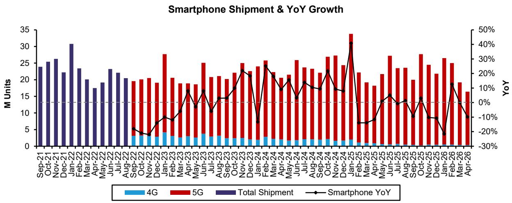  
Source: CINNO and Bernstein analysis

EXHIBIT 2: Low-tier smartphone shipment declined by 22% YoY in April, followed by mid-tier segment (-16% YoY). In comparison, high-tier segment grew 23% YoY.   
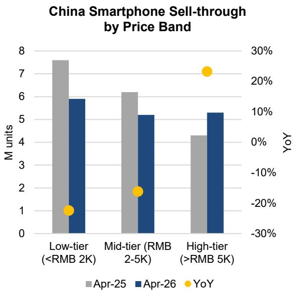

bar

| Price Band              | Apr-25 | Apr-26 | YoY   |
| ----------------------- | ------ | ------ | ----- |
| Low-tier (<RMB 2K)      | 7.5    | 5.8    | -10%  |
| Mid-tier (RMB 2-5K)     | 6.2    | 5.2    | -15%  |
| High-tier (>RMB 5K)     | 4.3    | 5.3    | 25%   |

Source: CINNO and Bernstein analysis

EXHIBIT 4: ...likely due to the launch of Huawei Enjoy 90 series, which led to a spike in Huawei's low-tier shipment.   
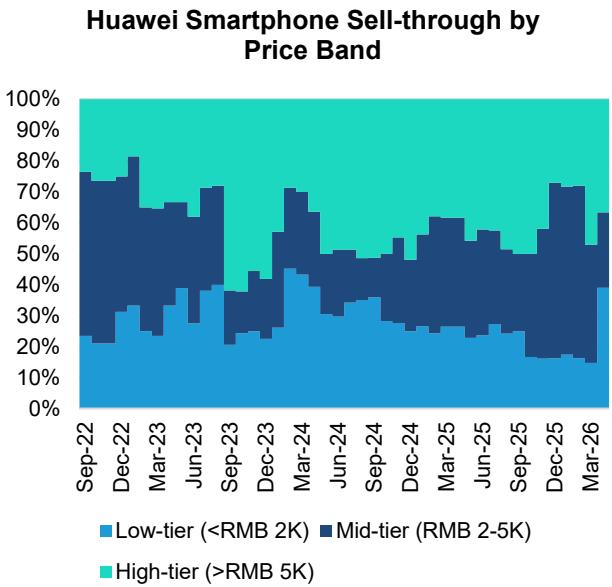

area_stacked

| Month   | Low-tier (<RMB 2K) | Mid-tier (RMB 2-5K) | High-tier (>RMB 5K) |
|---------|--------------------|---------------------|---------------------|
| Sep-22  | ~25%               | ~75%                | ~30%                |
| Dec-22  | ~30%               | ~80%                | ~35%                |
| Mar-23  | ~25%               | ~65%                | ~40%                |
| Jun-23  | ~35%               | ~70%                | ~35%                |
| Sep-23  | ~40%               | ~75%                | ~30%                |
| Dec-23  | ~45%               | ~70%                | ~35%                |
| Mar-24  | ~40%               | ~65%                | ~40%                |
| Jun-24  | ~35%               | ~50%                | ~45%                |
| Sep-24  | ~30%               | ~55%                | ~50%                |
| Dec-24  | ~25%               | ~60%                | ~55%                |
| Mar-25  | ~20%               | ~65%                | ~60%                |
| Jun-25  | ~15%               | ~70%                | ~65%                |
| Sep-25  | ~10%               | ~75%                | ~70%                |
| Dec-25  | ~15%               | ~80%                | ~75%                |
| Mar-26  | ~20%               | ~75%                | ~80%                |

Source: CINNO and Bernstein analysis

EXHIBIT 3: The contribution from low-end segment in the overall sales mix inched up slightly in April...   
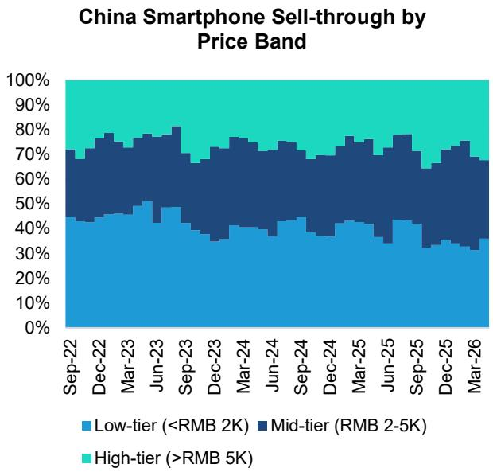

area_stacked

| Month    | Low-tier (<RMB 2K) | Mid-tier (RMB 2-5K) | High-tier (>RMB 5K) |
|----------|--------------------|---------------------|---------------------|
| Sep-22   | ~45%               | ~35%                | ~30%                |
| Dec-22   | ~40%               | ~35%                | ~35%                |
| Mar-23   | ~45%               | ~35%                | ~30%                |
| Jun-23   | ~50%               | ~35%                | ~30%                |
| Sep-23   | ~45%               | ~35%                | ~35%                |
| Dec-23   | ~40%               | ~35%                | ~40%                |
| Mar-24   | ~45%               | ~35%                | ~30%                |
| Jun-24   | ~40%               | ~35%                | ~35%                |
| Sep-24   | ~45%               | ~35%                | ~30%                |
| Dec-24   | ~40%               | ~35%                | ~35%                |
| Mar-25   | ~45%               | ~35%                | ~30%                |
| Jun-25   | ~40%               | ~35%                | ~35%                |
| Sep-25   | ~45%               | ~35%                | ~30%                |
| Dec-25   | ~40%               | ~35%                | ~35%                |
| Mar-26   | ~45%               | ~35%                | ~30%                |

Source: CINNO and Bernstein analysis

EXHIBIT 5: Apple has no exposure to low-end market, and thus best positioned among all brands.   
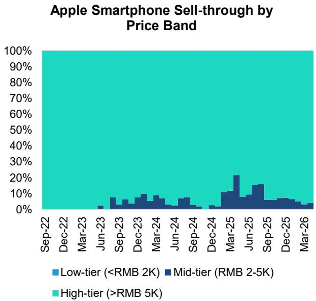

bar

| Date    | Low-tier (<RMB 2K) | Mid-tier (RMB 2-5K) | High-tier (>RMB 5K) |
|---------|--------------------|---------------------|---------------------|
| Sep-22  | 0%                 | 0%                  | 100%                |
| Dec-22  | 0%                 | 0%                  | 100%                |
| Mar-23  | 0%                 | 0%                  | 100%                |
| Jun-23  | 2%                 | 8%                  | 100%                |
| Sep-23  | 0%                 | 6%                  | 100%                |
| Dec-23  | 0%                 | 10%                 | 100%                |
| Mar-24  | 0%                 | 8%                  | 100%                |
| Jun-24  | 0%                 | 6%                  | 100%                |
| Sep-24  | 0%                 | 8%                  | 100%                |
| Dec-24  | 0%                 | 10%                 | 100%                |
| Mar-25  | 0%                 | 22%                 | 100%                |
| Jun-25  | 0%                 | 16%                 | 100%                |
| Sep-25  | 0%                 | 8%                  | 100%                |
| Dec-25  | 0%                 | 6%                  | 100%                |
| Mar-26  | 0%                 | 4%                  | 100%                |

Source: CINNO and Bernstein analysis

EXHIBIT 6: Other OEMs collectively shipped 22% less smartphones in April 2026 vs. April 2025 ...   
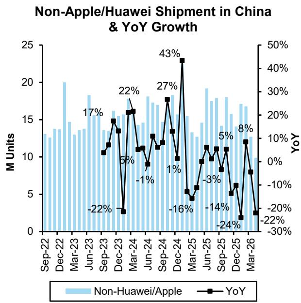

bar_line

Non-Apple/Huawei Shipment in China & YoY Growth
| Date | Non-Huawei/Apple (M Units) | YoY (%) |
| :--- | :--- | :--- |
| Sep-22 | 12.5 | |
| Dec-22 | 13.8 | |
| Mar-23 | 14.7 | |
| Jun-23 | 18.2 | 17 |
| Sep-23 | 13.5 | -22 |
| Dec-23 | 15.9 | 5 |
| Mar-24 | 17.8 | 22 |
| Jun-24 | 14.6 | -1 |
| Sep-24 | 17.3 | 27 |
| Dec-24 | 15.7 | 1 |
| Mar-25 | 13.0 | -16 |
| Jun-25 | 19.3 | -3 |
| Sep-25 | 17.9 | 5 |
| Dec-25 | 16.0 | -24 |
| Mar-26 | 10.0 | 8 |
| Sep-26 | 12.8 | -22 |

Source: CINNO and Bernstein analysis

EXHIBIT 7: ...and they collectively lost 9.8pts unit share YoY, mostly burdened by the drop of low-end segment shipment.   
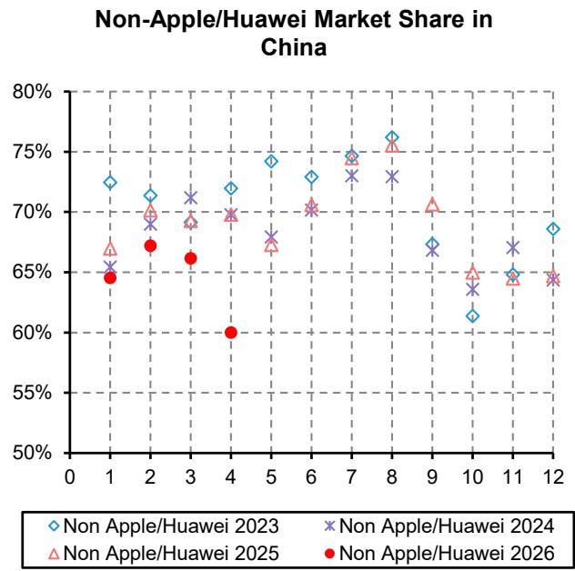

scatter

Non-Apple/Huawei Market Share in China
| Year | Non Apple/Huawei (%) | Non Apple/Huawei (%) |
| :--- | :--- | :--- |
| 2023 | 72.5 | 65.5 |
| 2024 | 71.0 | 68.5 |
| 2025 | 70.5 | 69.5 |
| 2026 | 64.5 | 64.5 |
| 2023 | 71.5 | 69.0 |
| 2024 | 71.0 | 71.5 |
| 2025 | 69.5 | 69.5 |
| 2026 | 66.0 | 60.0 |
| 2023 | 74.0 | 67.5 |
| 2024 | 73.0 | 70.5 |
| 2025 | 75.5 | 74.5 |
| 2026 | 76.0 | 75.5 |
| 2023 | 73.0 | 70.5 |
| 2024 | 73.0 | 73.0 |
| 2025 | 71.0 | 70.5 |
| 2023 | 67.0 | 67.0 |
| 2024 | 67.0 | 63.5 |
| 2025 | 65.0 | 64.5 |
| 2023 | 61.5 | — |
| 2024 | — | — |
| 2025 | — | — |
| 2023 | — | — |
| 2024 | — | — |
| 2025 | — | — |
| 2023 | — | — |
| 2024 | — | — |
| 2025 | — | — |
| 2023 | — | — |
| 2024 | — | — |
| 2025 | — | — |
| 2023 | — (Not labeled) | — |
| 2024 | — (Not labeled) | — |
| 2025 | — (Not labeled) | — |
| 2023 | — (Not labeled) | — |
| 2024 | — (Not labeled) | — |
| 2025 | — (Not labeled) | — |
| 2023 | — (Not labeled) | — |
| 2024 | — (Not labeled) | — |
| 2025 | — (Not labeled) | — |
| 2023: Not labeled; Non Apple/Huawei: Not labeled; Non Apple/Huawei: Not labeled; Non Apple/Huawei: Not labeled; Non Apple/Huawei: Not labeled; Non Apple/Huawei: Not labeled; Non Apple/Huawei: Not labeled; Non Apple/Huawei: Not labeled; Non Apple/Huawei: Not labeled; Non Apple/Huawei: Not labeled; Non Apple/Huawei: Not labeled; Non Apple/Huawei: Not labeled; Non Apple/Huawei, Not Applicable, Not Applicable, Not Applicable, Not Applicable, Not Applicable, Not Applicable, Not Applicable, Not Applicable, Not Applicable, Not Applicable, Not Applicable, Not Applicable, Not Applicable, Not Applicable, Not Applicable, Not Applicable, Not Applicable, Not Applicable, Not Applicable, Not Applicable, Not Applicable, Not Applicable, Not Applicable, Not Applicable, Not Applicable, Not Apperc, Not Apperc, Not Apperc, Not Apperc, Not Apperc, Not Apperc, Not Apperc, Not Apperc, Not Apperc, Not Apperc, Not Apperc, Not Apperc, Not Apperc, Not Apperc, Not Apperc, Not Apperc, Not Apperc, Not Apperc, Not Apperc, Not Apperc, Not Apperc, Not Apperc, Not Apperc, Not Apperc, Not Apperc, Not Appern, Not Apperc, Not Apperc, Not Apperc, Not Apperc, Not Apperc, Not Apperc, Not Apperc, Not Apperc, Not Apperc, Not Apperc, Not Apperc, Not Apperc, Not Apperc, Not Apperc, Not Apperc, Not Apperc, Not Apperc, Not Apperc, Not Apperc, Not Apperc, Not Apperc, Not Apperc, Not Apperc, Not Apperc, Not Apparc, Not Apperc, Not Apperc, Not Apperc, Not Apperc, Not Apperc, Not Apperc, Not Apperc, Not Apperc, Not Apperc, Not Apperc, Not Apperc, Not Apperc, Not Apperc, Not Apperc, Not Apperc, Not Apperc, Not Apperc, Not Apperc, Not Apperc, Not Apperc, Not Apperc, Not Apperc, Not Apperc, Not Apperc, Not AppcerooOoOoOoOoOoOoOoOoOoOoOoOoOoOoOoOoOoOoOoOoOoOoOoOoOoOoOoOoOoOoOoOoOoOoOoOoOoOoOoOoOoOoOoOoOoOoOoOoOoOo OoOoOoOoOoOoOoOoOoOoOoOoOoOoOoOoOoOoOoOoOoOoOoOoOoOoOoOoOoOoOoOoOoOoOoOoOoOoOoOoOoOoOoOoOoOoOoOoOoOo<nl>

Source: CINNO and Bernstein analysis

EXHIBIT 8: Sell-through of all OEMs decreased sequentially except for Huawei.   
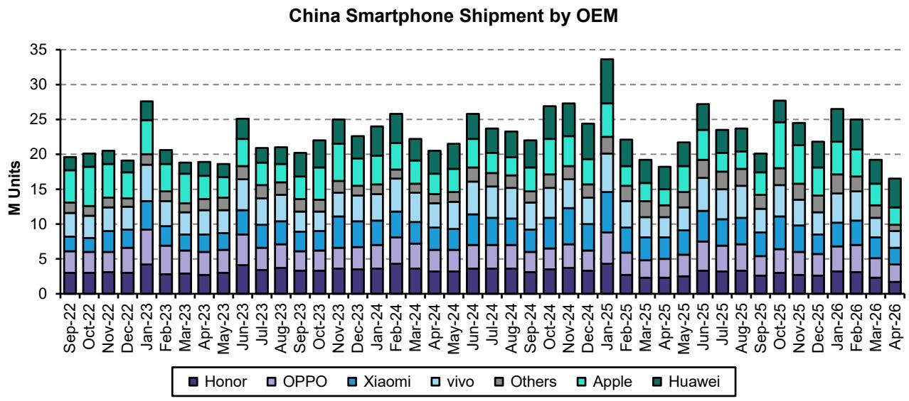  
Source: CINNO and Bernstein analysis

Apr still showed no improvement to Huawei's premium segment shipment. We wonder how LogicFolding and the "Tau (τ) Scaling Law" can change that.

\- Huawei's adoption of homegrown SoCs from late 2023 helped it regain share in higher-end segments, and other Chinese OEMs also moved upward and chipped away shares from the low-side of Apple's portfolio. With the size of flagship segment barely growing, Apple earlier lost share mainly to Huawei and, to a lesser extent, other OEMs (Exhibit 9 - Exhibit 11).

- Apple then has responded with more flexible pricing. At the iPhone 17 launch in September 2025, Apple priced the devices below RMB 6,000 & made them eligible for subsidies. The prices of the iPhone 16 series were also adjusted accordingly. Apple also expanded the use of seasonal promotions across various distribution channels. For example, it offered 50-Year Anniversary discounts in April, including RMB 300 discount on iPhone 17 and RMB 2,000 discount on iPhone Air. The flexible pricing, along with the launch of iPhone 17e, drove the 9% YoY shipment growth for Apple in April (Exhibit 16).   
- As for Huawei, the company launched Mate 80 series in last November. The Pro Max variant notably features a new home-grown SoC Kirin 9030 made with SMIC's “N+3” node without EUV. The shipment of this variant thus sheds light on the health of the supply of SMIC's “N+3” and the consumer appetite for the SoC too. We note since January Huawei has seen a pick-up in shipment. In April, Huawei further set a record and widened its share over Apple to c.10pts (Exhibit 12). These improvements were however thanks to strong shipment of lower-priced products such as Nova 15 launched in last December & Enjoy 90 released in April. They had little to do with the Pro Max model equipped with the “N+3” SoC (Exhibit 13). Though shorter wait time suggested better availability for the model & perhaps improving yield of SMIC “N+3” over the past few months, Huawei’s sales volume in this premium segment hardly rose (Exhibit 14). This suggests the volume was likely limited by demand, and possibly as consumers find the performance of Kirin 9030 underwhelming. This is probably not a surprise as a teardown report shows that SMIC “N+3” is similar to TSMC N6. As TSMC began to mass produce N6 in c. 2018 to 2020, this implies “N+3” is about 6 years behind N6 & equivalently Kirin 9030 is 6 years behind the top-notch mobile SoCs in the market now. Most importantly this also means that China lacking EUV puts Huawei’s handset business in a structural disadvantage vs. Apple or other handset OEMs whose smartphones are powered by superior chips made with EUV.   
- On 25 May, Huawei unveiled “LogicFolding” and “Tau ( $\tau$ ) scaling law”, aiming to advance its chips without EUV. The target is to bring to the market the first chip based on this new concept in autumn 2026, likely together with the new Mate 90 series, and then to eventually reach 1.4nm transistor density in 2031. This roadmap effectively narrows the gap vs. TSMC from the c. 6 years above to 3 years as TSMC is aiming to bring 1.4nm to mass production in 2028. We believe “LogicFolding” is essentially vertical die stacking, likely using hybrid bonding, & corresponding design optimization to take advantage of the short delays possibly achieved through vertical stacking. However, die stacking and corresponding design optimization is available to others too. TSMC has been working with major EDA partners (e.g. Cadence, Siemens, Synopsys) to optimize designs for 3D-IC (i.e. vertical stacking) structure since as early as 2010. Hybrid bonding has been volume-produced by TSMC on designs from AMD for years too. We hence wonder how “LogicFolding” & “Tau ( $\tau$ ) scaling law” can help Huawei uniquely so much more than rivals so that Huawei can narrow the gap to 3 years.

EXHIBIT 9: Apple focuses on flagship segment but the size of this segment hardly expanded.   
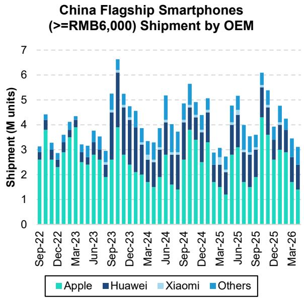

bar_stacked

China Flagship Smartphones (>=RMB6,000) Shipment by OEM
| Month | Apple (M units) | Huawei (M units) | Xiaomi (M units) | Others (M units) |
| :--- | :--- | :--- | :--- | :--- |
| Sep-22 | 3.1 | 0.5 | 0.1 | 0.4 |
| Dec-22 | 3.8 | 0.4 | 0.1 | 0.3 |
| Mar-23 | 3.7 | 0.5 | 0.1 | 0.4 |
| Jun-23 | 2.9 | 0.6 | 0.1 | 0.4 |
| Sep-23 | 3.9 | 1.8 | 0.1 | 0.6 |
| Dec-23 | 2.8 | 1.9 | 0.1 | 0.5 |
| Mar-24 | 2.1 | 1.1 | 0.1 | 0.4 |
| Jun-24 | 1.6 | 1.1 | 0.1 | 0.5 |
| Sep-24 | 2.6 | 1.3 | 0.1 | 0.5 |
| Dec-24 | 3.8 | 1.3 | 0.1 | 0.5 |
| Mar-25 | 1.5 | 0.7 | 0.1 | 0.4 |
| Jun-25 | 3.1 | 1.7 | 0.1 | 0.4 |
| Sep-25 | 4.3 | 1.8 | 0.1 | 0.4 |
| Dec-25 | 3.7 | 1.7 | 0.1 | 0.4 |
| Mar-26 | 3.0 | 1.3 | 0.1 | 0.4 |
| Total: Apple + Huawei + Xiaomi + Others = (RMB6,000) | ~4.5 | ~1.8 | ~0.1 | ~0.4 |

Source: CINNO and Bernstein analysis

EXHIBIT 10: In comparison, sub-flagship segment has been growing gradually.   
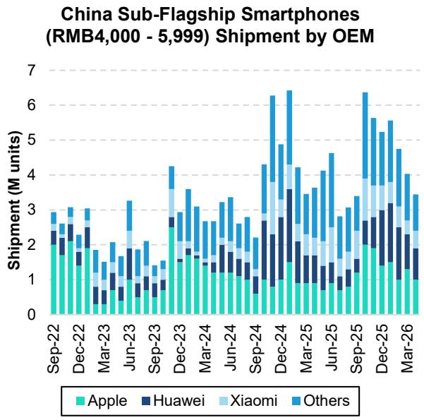

bar_stacked

China Sub-Flagship Smartphones (RMB4,000 - 5,999) Shipment by OEM
| Month | Apple (M units) | Huawei (M units) | Xiaomi (M units) | Others (M units) |
| :--- | :--- | :--- | :--- | :--- |
| Sep-22 | 1.8 | 0.7 | 0.3 | 0.3 |
| Dec-22 | 1.3 | 0.8 | 0.4 | 0.5 |
| Mar-23 | 0.4 | 0.5 | 0.6 | 0.6 |
| Jun-23 | 0.6 | 0.6 | 0.7 | 1.1 |
| Sep-23 | 0.5 | 0.5 | 0.6 | 0.6 |
| Dec-23 | 1.5 | 0.6 | 0.7 | 1.1 |
| Mar-24 | 1.2 | 0.5 | 0.6 | 0.8 |
| Jun-24 | 1.1 | 0.7 | 0.6 | 1.1 |
| Sep-24 | 1.0 | 0.6 | 0.7 | 1.1 |
| Dec-24 | 1.5 | 1.1 | 0.8 | 1.5 |
| Mar-25 | 1.0 | 0.7 | 0.6 | 1.1 |
| Jun-25 | 0.9 | 0.6 | 0.7 | 1.3 |
| Sep-25 | 1.2 | 0.8 | 0.9 | 1.3 |
| Dec-25 | 1.5 | 1.0 | 1.0 | 1.3 |
| Mar-26 | 1.2 | 0.8 | 0.9 | 1.3 |
| Total Shipment (M units) across all periods: Apple, Huawei, Xiaomi, Others; Total Shipment (M units) across all periods: Apple, Huawei, Xiaomi, Others; Total Shipment (M units) across all periods: Apple, Huawei, Xiaomi, Others; Total Shipment (M units) across all periods: Apple, Huawei, Xiaomi, Others; Total Shipment (M units) across all periods: Apple, Huawei, Xiaomi, Others; Total Shipment (M units) across all periods: Apple, Huawei, Xiaomi, Others; Total Shipment (N) is shown on the right axis.

Source: CINNO and Bernstein analysis

EXHIBIT 11: Apple was challenged by Huawei in the flagship segment & by other Chinese OEMs in the sub-flagship segment.   
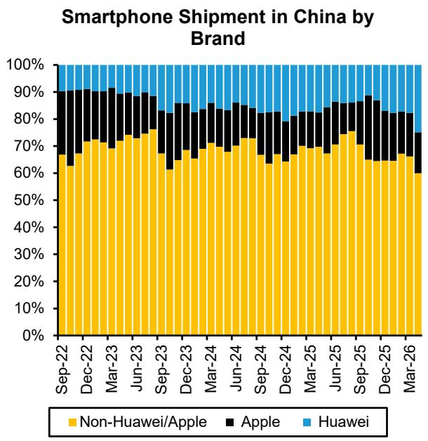

bar_stacked

Smartphone Shipment in China by Brand
| Month | Non-Huawei/Apple (%) | Apple (%) | Huawei (%) |
| :--- | :--- | :--- | :--- |
| Sep-22 | 67 | 23 | 10 |
| Dec-22 | 72 | 18 | 9 |
| Mar-23 | 70 | 19 | 10 |
| Jun-23 | 74 | 15 | 10 |
| Sep-23 | 76 | 13 | 10 |
| Dec-23 | 65 | 18 | 15 |
| Mar-24 | 70 | 15 | 15 |
| Jun-24 | 68 | 18 | 15 |
| Sep-24 | 73 | 14 | 15 |
| Dec-24 | 66 | 17 | 15 |
| Mar-25 | 70 | 15 | 15 |
| Jun-25 | 68 | 18 | 15 |
| Sep-25 | 74 | 14 | 15 |
| Dec-25 | 65 | 18 | 15 |
| Mar-26 | 66 | 17 | 15 |

Source: CINNO and Bernstein analysis

EXHIBIT 13: ...but that was primarily driven by the strong shipment in RMB2,000 and below segment, thanks to recent launch of Enjoy 90 series.   
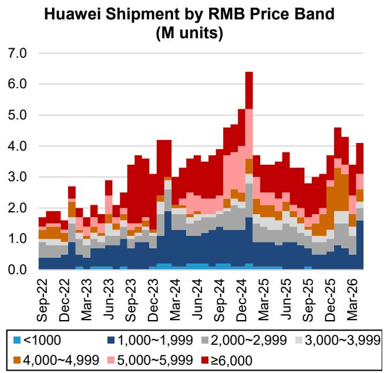

bar_stacked

Huawei Shipment by RMB Price Band (M units)
| Date | <1000 | 1,000~1,999 | 2,000~2,999 | 3,000~3,999 | 4,000~4,999 | 5,000~5,999 | ≥6,000 |
|---|---|---|---|---|---|---|---|
| Sep-22 | 0.0 | 0.3 | 0.4 | 0.5 | 0.4 | 0.3 | 1.7 |
| Dec-22 | 0.0 | 0.4 | 0.5 | 0.6 | 0.5 | 0.4 | 1.8 |
| Mar-23 | 0.0 | 0.5 | 0.6 | 0.7 | 0.6 | 0.5 | 1.9 |
| Jun-23 | 0.0 | 0.6 | 0.7 | 0.8 | 0.7 | 0.6 | 2.1 |
| Sep-23 | 0.0 | 0.7 | 0.8 | 0.9 | 0.8 | 0.7 | 2.3 |
| Dec-23 | 0.1 | 0.8 | 0.9 | 1.0 | 0.9 | 0.8 | 2.5 |
| Mar-24 | 0.1 | 0.9 | 1.0 | 1.1 | 1.0 | 0.9 | 2.7 |
| Jun-24 | 0.1 | 1.0 | 1.1 | 1.2 | 1.1 | 1.0 | 2.9 |
| Sep-24 | 0.1 | 1.1 | 1.2 | 1.3 | 1.2 | 1.1 | 3.1 |
| Dec-24 | 0.1 | 1.2 | 1.3 | 1.4 | 1.3 | 1.2 | 3.3 |
| Mar-25 | 0.1 | 1.3 | 1.4 | 1.5 | 1.4 | 1.3 | 3.5 |
| Jun-25 | 0.1 | 1.4 | 1.5 | 1.6 | 1.5 | 1.4 | 3.7 |
| Sep-25 | 0.1 | 1.5 | 1.6 | 1.7 | 1.6 | 1.5 | 3.9 |
| Dec-25 | 0.1 | 1.6 | 1.7 | 1.8 | 1.7 | 1.6 | 4.1 |
| Mar-26 | 0.1 | 1.7 | 1.8 | 1.9 | 1.8 | 1.7 | 4.3 |
The chart displays a stacked bar chart with the x-axis representing time periods and the y-axis representing shipment volume in millions of units for each RMB price band category (≥6,000, $5,000–$9,999, $4,000–$8,999, $3,000–$7,999, $2,000–$4,999, $1,000–$2,999). The data is presented as a stacked bar chart with color-coded bands indicating the distribution of shipments across these bands over time.

Source: CINNO and Bernstein analysis

EXHIBIT 12: Huawei's unit share jumped to c. $25\%$ in April and the lead over Apple's share widened to almost 10pts...   
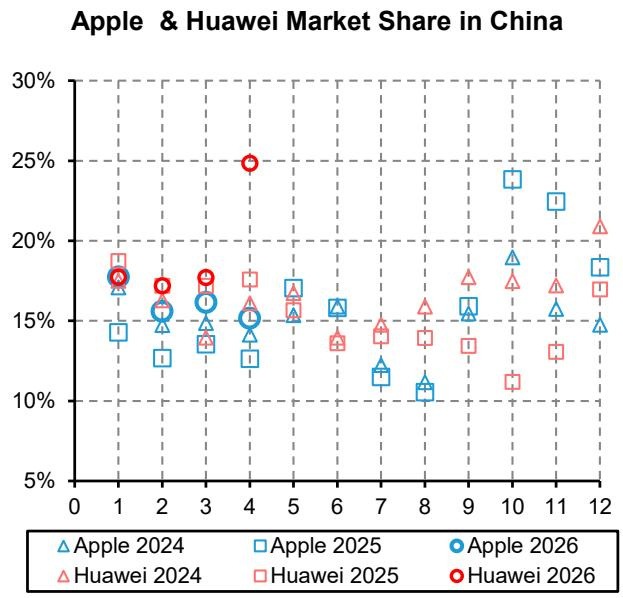

scatter

Apple & Huawei Market Share in China
| Year | Company | Apple (%) | Huawei (%) |
|---|---|---|---|
| 1 | Apple 2024 | 17.3 | 18.5 |
| 1 | Apple 2025 | 14.2 | 18.9 |
| 1 | Apple 2026 | 15.8 | 17.8 |
| 2 | Apple 2024 | 15.3 | 16.0 |
| 2 | Apple 2025 | 12.8 | 15.8 |
| 2 | Apple 2026 | 15.8 | 16.0 |
| 3 | Apple 2024 | 14.0 | 17.8 |
| 3 | Apple 2025 | 13.5 | 17.5 |
| 3 | Apple 2026 | 16.0 | 17.8 |
| 4 | Apple 2024 | 13.5 | 17.8 |
| 4 | Apple 2025 | 12.5 | 15.5 |
| 4 | Apple 2026 | 15.0 | 24.8 |
| 5 | Apple 2024 | 17.3 | 15.5 |
| 5 | Apple 2025 | 17.3 | 15.8 |
| 5 | Apple 2026 | 15.8 | 15.8 |
| 6 | Apple 2024 | 16.0 | 13.8 |
| 6 | Apple 2025 | 15.8 | 13.8 |
| 6 | Apple 2026 | 16.0 | 13.8 |
| 7 | Apple 2024 | 11.8 | 14.8 |
| 7 | Apple 2025 | 11.8 | 14.8 |
| 7 | Apple 2026 | 14.8 | 14.8 |
| 8 | Apple 2024 | 11.3 | 16.0 |
| 8 | Apple 2025 | 10.8 | 14.0 |
| 8 | Apple 2026 | 16.0 | 13.8 |
| 9 | Apple 2024 | 15.8 | 17.8 |
| 9 | Apple 2025 | 15.8 | 13.8 |
| 9 | Apple 2026 | 16.0 | 13.8 |
| 10 | Apple 2024 | 19.0 | 17.8 |
| 10 | Apple 2025 | 19.0 | 17.8 |
| 10 | Apple 2026 | 19.0 | 17.8 |
| 11 | Apple 2024 | 16.0 | 17.8 |
| 11 | Apple 2025 | 16.0 | 13.8 |
| 11 | Apple 2026 | 16.0 | 13.8 |
| 12 | Apple 2024 | 14.8 | 20.8 |
| 12 | Apple 2025 | 18.5 | 17.8 |
| 12 | Apple 2026 | 18.5 | 17.8 |
The chart displays a box plot comparing the market share percentages of Apple and Huawei for each year from January to December, with the Y-axis representing market share percentage and the X-axis representing months (Jan–Dec). The data is already in English.

Source: CINNO and Bernstein analysis

EXHIBIT 14: Though the wait time for the Pro Max model has become shorter, Huawei's premium segment volume however didn't improve.   
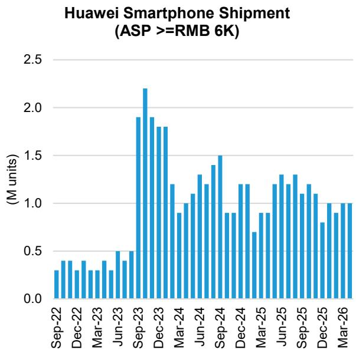

bar

| Month    | Shipment (M units) |
| -------- | ------------------ |
| Sep-22   | 0.3                |
| Dec-22   | 0.4                |
| Mar-23   | 0.3                |
| Jun-23   | 0.5                |
| Sep-23   | 1.9                |
| Dec-23   | 2.2                |
| Mar-24   | 1.8                |
| Jun-24   | 1.3                |
| Sep-24   | 1.5                |
| Dec-24   | 1.2                |
| Mar-25   | 0.7                |
| Jun-25   | 1.3                |
| Sep-25   | 1.1                |
| Dec-25   | 1.0                |
| Mar-26   | 1.0                |

Source: CINNO and Bernstein analysis

EXHIBIT 15: Huawei's shipment increased by $28\%$ YoY in April...   
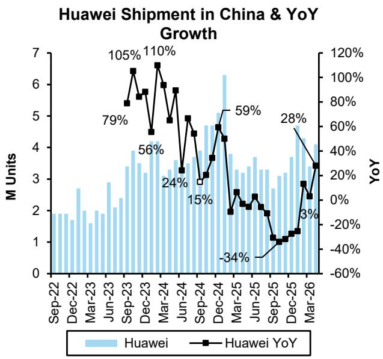

EXHIBIT 16: ... while Apple's shipment grew 9% YoY.   
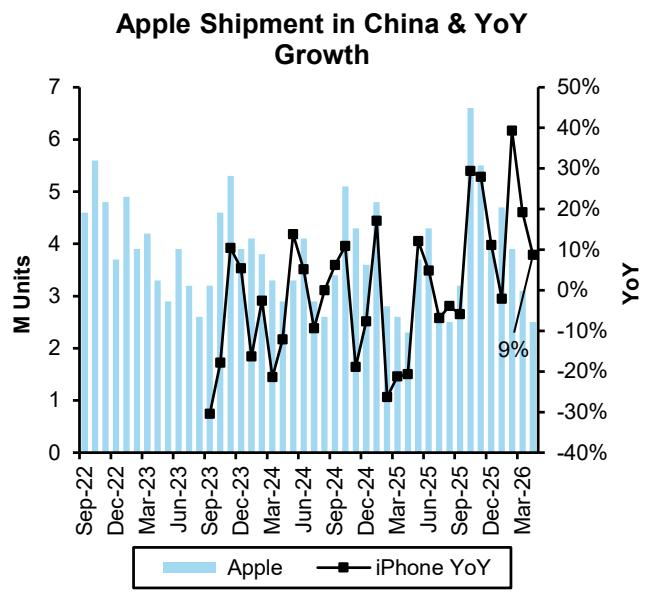

bar_line

Apple Shipment in China & YoY Growth
| Date | Apple (M Units) | iPhone YoY (%) |
| :--- | :--- | :--- |
| Sep-22 | 4.7 | 15 |
| Dec-22 | 4.8 | 13 |
| Mar-23 | 3.9 | 10 |
| Jun-23 | 3.3 | -10 |
| Sep-23 | 2.6 | -30 |
| Dec-23 | 5.3 | 15 |
| Mar-24 | 4.0 | -15 |
| Jun-24 | 3.8 | 10 |
| Sep-24 | 5.1 | 10 |
| Dec-24 | 4.8 | -15 |
| Mar-25 | 2.7 | -25 |
| Jun-25 | 4.3 | 10 |
| Sep-25 | 6.6 | 30 |
| Dec-25 | 4.7 | -10 |
| Mar-26 | 2.5 | -9 |
The chart displays a bar chart with light blue bars representing Apple shipments in millions of units and a black line with square markers indicating iPhone shipments as a percentage of year-over-year growth. The data is already in English. The chart is labeled 'Growth'.

Source: CINNO and Bernstein analysis   
Source: CINNO and Bernstein analysis

April sell-in was notably higher than sell-through. It suggested possible inventory pressure as OEMs may need to adjust portfolio & inventory dynamically to cope with high memory costs.

\- History shows that obsolescence may make sell-in above sell-through by around 5% and our analysis makes an adjustment to reflect that (more details here). With this adjustment, Exhibit 17 shows that April sell-in was notably higher than sell-through, more for Android brands (Exhibit 18) but less so for Apple (Exhibit 19). This likely reflects softer demand following OEMs' price hikes in late March. Elevated inventory level may weigh on OEMs' cash flow and hence drive them to offer more discounts ahead of the upcoming "618 Shopping Festival". For example, Xiaomi cut the price of Xiaomi15 Ultra by RMB 1.5K on 14 May, 2 days after the "618" pre-sale began. Huawei followed quickly by announcing RMB 1-3K discounts for its foldable flagship Mate X series the next day. We wonder if more OEMs may choose to do so later too, as OEMs are feeling the right tradeoff among cost, price, volume, market share, installed base, etc. & may need to adjust their product portfolio and inventory dynamically.

EXHIBIT 17: Adjusting the sell-in data from CATR for possible obsolescence, we find sell-in was notably higher than sell-through in April...   
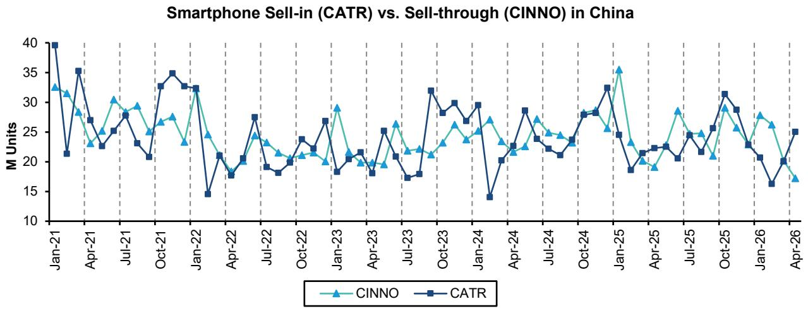

line

| Month   | CINNO | CATR |
|---------|-------|------|
| Jan-21  | 32.5  | 40.0 |
| Apr-21  | 28.0  | 35.5 |
| Jul-21  | 30.0  | 27.0 |
| Oct-21  | 27.0  | 35.0 |
| Jan-22  | 23.0  | 32.5 |
| Apr-22  | 24.5  | 14.5 |
| Jul-22  | 23.0  | 27.5 |
| Oct-22  | 21.0  | 24.0 |
| Jan-23  | 29.0  | 18.0 |
| Apr-23  | 19.5  | 21.5 |
| Jul-23  | 26.0  | 17.5 |
| Oct-23  | 21.5  | 31.5 |
| Jan-24  | 26.0  | 13.5 |
| Apr-24  | 27.0  | 28.5 |
| Jul-24  | 24.5  | 21.5 |
| Oct-24  | 28.0  | 28.0 |
| Jan-25  | 35.5  | 18.0 |
| Apr-25  | 19.0  | 21.5 |
| Jul-25  | 28.5  | 24.0 |
| Oct-25  | 29.0  | 31.5 |
| Jan-26  | 27.0  | 16.0 |
| Apr-26  | 17.0  | 25.0 |

Source: CINNO, CATR, and Bernstein analysis

EXHIBIT 18: ...especially for non-Apple brands likely due to their recent price adjustments.   
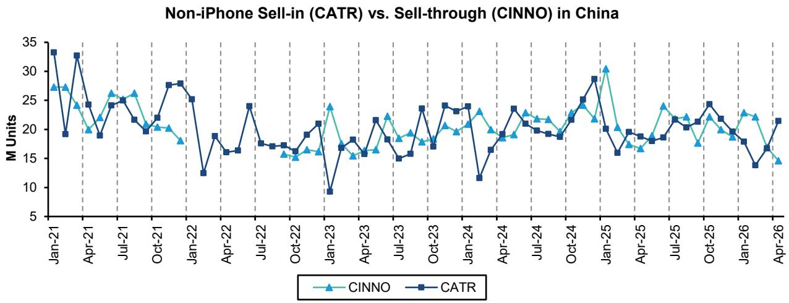

line

| Month   | CINNO | CATR |
|---------|-------|------|
| Jan-21  | 27    | 33   |
| Apr-21  | 20    | 19   |
| Jul-21  | 26    | 24   |
| Oct-21  | 20    | 28   |
| Jan-22  | 18    | 25   |
| Apr-22  | 16    | 16   |
| Jul-22  | 17    | 18   |
| Oct-22  | 16    | 17   |
| Jan-23  | 24    | 9    |
| Apr-23  | 16    | 18   |
| Jul-23  | 22    | 15   |
| Oct-23  | 18    | 24   |
| Jan-24  | 20    | 11   |
| Apr-24  | 19    | 17   |
| Jul-24  | 23    | 24   |
| Oct-24  | 21    | 19   |
| Jan-25  | 30    | 16   |
| Apr-25  | 17    | 19   |
| Jul-25  | 24    | 21   |
| Oct-25  | 20    | 25   |
| Jan-26  | 18    | 14   |
| Apr-26  | 15    | 21   |

Source: CINNO, CATR, and Bernstein analysis

EXHIBIT 19: iPhone also saw some inventory restocking, but at a relatively healthy level.   
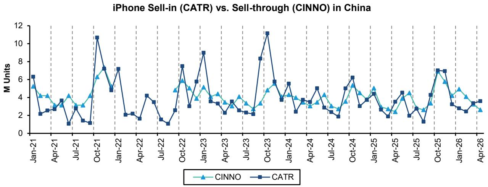

line

| Month   | CINNO | CATR |
|---------|-------|------|
| Jan-21  | 5.5   | 6.5  |
| Apr-21  | 4.0   | 2.5  |
| Jul-21  | 3.0   | 1.0  |
| Oct-21  | 6.5   | 10.5 |
| Jan-22  | 5.0   | 7.0  |
| Apr-22  | 2.0   | 4.0  |
| Jul-22  | 1.5   | 1.0  |
| Oct-22  | 6.0   | 7.5  |
| Jan-23  | 5.0   | 9.0  |
| Apr-23  | 4.0   | 3.0  |
| Jul-23  | 3.0   | 2.0  |
| Oct-23  | 5.0   | 11.0 |
| Jan-24  | 4.0   | 5.5  |
| Apr-24  | 3.5   | 3.5  |
| Jul-24  | 3.0   | 2.5  |
| Oct-24  | 5.0   | 6.0  |
| Jan-25  | 4.5   | 4.0  |
| Apr-25  | 2.5   | 1.5  |
| Jul-25  | 3.0   | 1.0  |
| Oct-25  | 7.0   | 7.0  |
| Jan-26  | 5.0   | 3.0  |
| Apr-26  | 3.0   | 3.5  |

Source: CINNO, CATR, and Bernstein analysis

# Smartphone ASP extended the notable YoY rise, driven by both low-tier model cancellation & like-for-like price hike.

- With 5G nearly fully adopted (Exhibit 20), many see smartphone market ex-growth and are hoping that Edge AI will create a replacement cycle, or stimulate a mix improvement and/or a semiconductor content increase per phone. Qualcomm and MediaTek both highlighted agentic AI as a key value driver in recent earnings calls. Qualcomm expects agentic AI to start impacting the premium segment in fiscal year 2027, potentially triggering a new upgrade cycle. MediaTek did not specify a timeline but emphasized that its next-generation 2nm flagship SoC will have meaningfully stronger AI capabilities. We hence monitor the mix of flagship ( $\geq$ US\$850 (RMB 6,000)) & sub-flagship (US\$560-850 (RMB 4,000-5,999)) segments, as well as the overall smartphone ASP, to gauge the momentum of Edge AI. Additionally, high memory cost is prompting OEMs to cut low-priced models and raise prices elsewhere. Both will affect ASP, and we monitor handset prices to get a feel on that too.   
- In early 2024 we were encouraged by the notably higher smartphone ASP in China vs. the same period in 2023. The trend became less visible in late 2024 & early 2025, but regained momentum since March 2025 likely as subsidies motivated consumers to trade up. In April 2026 ASP increased by 16% YoY, vs. up 15% in March, up 14% in February, and up 13% in January (Exhibit 21), and stood notably higher over the ASPs of prior years. We believe the higher ASP was driven by both the withdrawal of low-tier models and the like-for-like price hikes. In March, major OEMs canceled multiple entry-level handsets, including OPPO A series, vivo Y series, iQOO Z10x etc. On top of that, like-for-like price hikes for surviving models (mainly priced above RMB2,000) became effective from mid-March. We expect the upward trend to continue as the price revisions continue to flow through the distribution channel. However, we remain mindful of potential demand destruction from higher retail prices, which should ultimately cap the extent of further price hikes.   
- Zooming into non-Apple/Huawei OEMs, we find their sub-flagship shipment still represented 16% of the total shipment, but the absolute volume was down 20% YoY in April (Exhibit 22, Exhibit 23). Flagship non-Apple/Huawei sales volume was up 14% YoY but on a small volume (Exhibit 24, Exhibit 25). Overall for these OEMs it looks challenging to get sufficient revenue from flagship & sub-flagship segments to offset the loss in lower-end segments & keep the overall smartphone revenue as good as last year's.

EXHIBIT 20: 5G penetration has reached almost 100% in new smartphone sales in China.   
Smartphone Shipment & 5G Penetration   
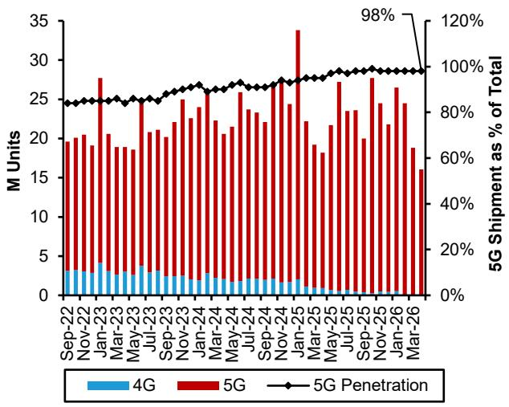

bar_line

| Month    | 4G   | 5G   | 5G Penetration |
|----------|------|------|----------------|
| Sep-22   | 3.0  | 10.0 | 80%            |
| Nov-22   | 3.0  | 10.0 | 80%            |
| Jan-23   | 4.0  | 18.0 | 80%            |
| Mar-23   | 3.0  | 10.0 | 80%            |
| May-23   | 3.0  | 10.0 | 80%            |
| Jul-23   | 3.0  | 10.0 | 80%            |
| Sep-23   | 3.0  | 10.0 | 80%            |
| Nov-23   | 3.0  | 10.0 | 80%            |
| Jan-24   | 3.0  | 10.0 | 80%            |
| Mar-24   | 3.0  | 10.0 | 80%            |
| May-24   | 3.0  | 10.0 | 80%            |
| Jul-24   | 3.0  | 10.0 | 80%            |
| Sep-24   | 3.0  | 10.0 | 80%            |
| Nov-24   | 3.0  | 10.0 | 80%            |
| Jan-25   | 3.0  | 18.0 | 80%            |
| Mar-25   | 3.0  | 10.0 | 80%            |
| May-25   | 3.0  | 10.0 | 80%            |
| Jul-25   | 3.0  | 10.0 | 80%            |
| Sep-25   | 3.0  | 10.0 | 80%            |
| Nov-25   | 3.0  | 10.0 | 80%            |
| Jan-26   | 3.0  | 10.0 | 80%            |
| Mar-26   | 3.0  | 10.0 | 80%            |

Source: CINNO and Bernstein analysis

EXHIBIT 21: Smartphone ASP increased by 16% YoY even without including subsidies.   
Smartphone Blended ASP in China (RMB)   
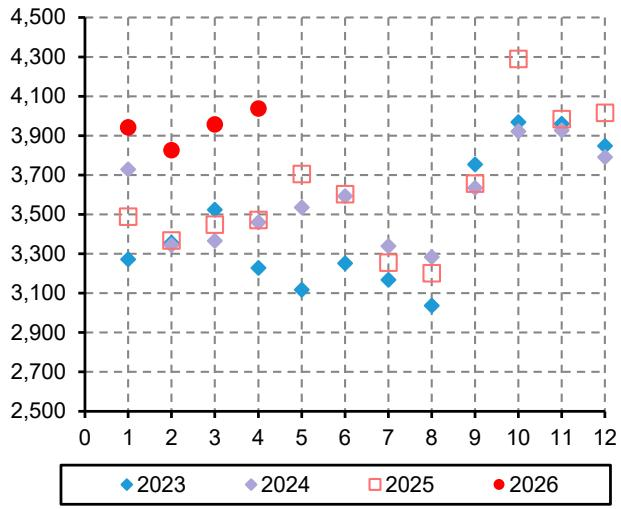

scatter

| Month | 2023 | 2024 | 2025 | 2026 |
|-------|------|------|------|------|
| 1     | 3,300 | 3,700 | 3,500 | 3,900 |
| 2     | -    | -    | 3,350 | 3,850 |
| 3     | 3,500 | 3,350 | -    | 3,950 |
| 4     | 3,250 | -    | 3,450 | 4,100 |
| 5     | 3,100 | 3,550 | 3,700 | -    |
| 6     | 3,250 | -    | 3,650 | -    |
| 7     | 3,150 | 3,350 | 3,250 | -    |
| 8     | 3,100 | 3,300 | 3,250 | -    |
| 9     | 3,750 | -    | 3,700 | -    |
| 10    | 3,950 | 3,950 | 4,300 | -    |
| 11    | 3,950 | 3,950 | 4,100 | -    |
| 12    | 3,850 | 3,850 | 4,100 | -    |

Source: CINNO and Bernstein analysis

EXHIBIT 22: Non-Apple/Huawei sub-flagship shipment was down 20% YoY in April.   
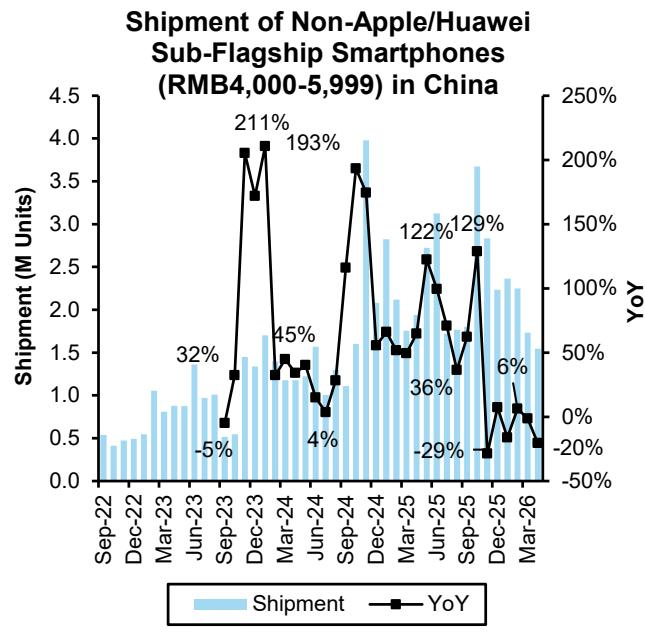

bar_line

Shipment of Non-Apple/Huawei Sub-Flagship Smartphones (RMB4,000-5,999) in China
| Month | Shipment (M Units) | YoY (%) |
| :--- | :--- | :--- |
| Sep-22 | 0.5 | - |
| Dec-22 | 0.4 | - |
| Mar-23 | 1.0 | - |
| Jun-23 | 0.9 | -5 |
| Sep-23 | 1.0 | 32 |
| Dec-23 | 1.4 | 211 |
| Mar-24 | 1.7 | 45 |
| Jun-24 | 1.6 | 4 |
| Sep-24 | 1.6 | 193 |
| Dec-24 | 4.0 | 36 |
| Mar-25 | 2.8 | 122 |
| Jun-25 | 3.1 | 36 |
| Sep-25 | 3.7 | 129 |
| Dec-25 | 2.3 | -29 |
| Mar-26 | 2.3 | 6 |
| Jun-26 | 1.7 | -20 |

Source: CINNO and Bernstein analysis

EXHIBIT 23: Sub-flagship segment took up 16% of non-Apple/Huawei shipment, flat YoY.   
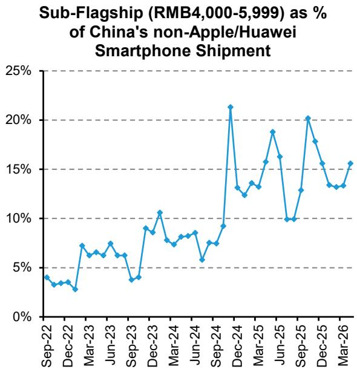

line

| Date    | Percentage |
|---------|----------|
| Sep-22  | ~4%      |
| Dec-22  | ~3%      |
| Mar-23  | ~7%      |
| Jun-23  | ~6%      |
| Sep-23  | ~8%      |
| Dec-23  | ~10%     |
| Mar-24  | ~7%      |
| Jun-24  | ~8%      |
| Sep-24  | ~13%     |
| Dec-24  | ~21%     |
| Mar-25  | ~13%     |
| Jun-25  | ~19%     |
| Sep-25  | ~10%     |
| Dec-25  | ~20%     |
| Mar-26  | ~15%     |

Source: CINNO and Bernstein analysis

EXHIBIT 24: Non-Apple/Huawei flagship shipment was up 14% YoY.   
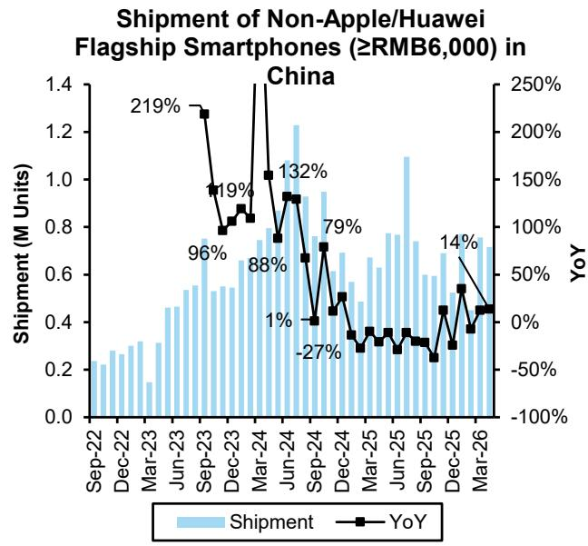

bar_line

Shipment of Non-Apple/Huawei Flagship Smartphones (≥RMB6,000) in China
| Date | Shipment (M Units) | YoY (%) |
| :--- | :--- | :--- |
| Sep-22 | 0.23 | |
| Dec-22 | 0.27 | |
| Mar-23 | 0.31 | |
| Jun-23 | 0.45 | 96 |
| Sep-23 | 0.55 | 19 |
| Dec-23 | 0.54 | 19 |
| Mar-24 | 0.80 | 88 |
| Jun-24 | 1.23 | 132 |
| Sep-24 | 0.95 | -27 |
| Dec-24 | 0.70 | 79 |
| Mar-25 | 0.65 | -10 |
| Jun-25 | 0.78 | -10 |
| Sep-25 | 0.60 | -14 |
| Dec-25 | 0.70 | 14 |
| Mar-26 | 0.73 | 14 |

Source: CINNO and Bernstein analysis

EXHIBIT 25: Flagship segment accounted for 7% of total non-Apple/Huawei shipment, vs. c. 5% one year ago.   
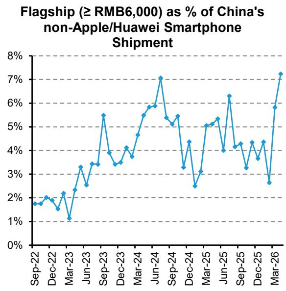

line

| Month   | Percentage |
|---------|----------|
| Sep-22  | 1.8%     |
| Dec-22  | 2.0%     |
| Mar-23  | 1.5%     |
| Jun-23  | 3.3%     |
| Sep-23  | 5.5%     |
| Dec-23  | 3.5%     |
| Mar-24  | 4.7%     |
| Jun-24  | 7.1%     |
| Sep-24  | 5.3%     |
| Dec-24  | 3.3%     |
| Mar-25  | 5.1%     |
| Jun-25  | 6.3%     |
| Sep-25  | 4.3%     |
| Dec-25  | 3.7%     |
| Mar-26  | 7.3%     |

Source: CINNO and Bernstein analysis

EXHIBIT 26: The share of Xiaomi's shipments priced above RMB 4k increased MoM to 21%, though modestly below the 22% in Apr 2025; Shipments in the RMB 2k-4k range reached 28%, vs. 37% in Mar 2026 and 25% in Apr 2025.   
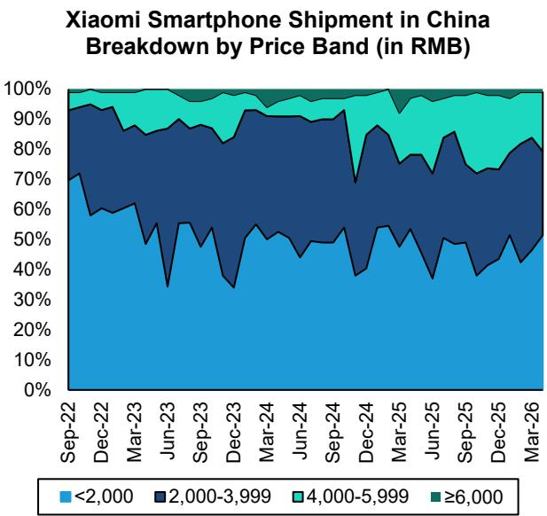

area_stacked

Xiaomi Smartphone Shipment in China Breakdown by Price Band (in RMB)
| Date | <2,000 | 2,000-3,999 | 4,000-5,999 | ≥6,000 |
|---|---|---|---|---|
| Sep-22 | 70% | 30% | 5% | 1% |
| Dec-22 | 65% | 35% | 5% | 1% |
| Mar-23 | 60% | 35% | 10% | 1% |
| Jun-23 | 35% | 45% | 10% | 1% |
| Sep-23 | 55% | 35% | 10% | 1% |
| Dec-23 | 35% | 45% | 10% | 1% |
| Mar-24 | 55% | 35% | 10% | 1% |
| Jun-24 | 50% | 35% | 10% | 1% |
| Sep-24 | 50% | 35% | 10% | 1% |
| Dec-24 | 85% | 35% | 10% | 1% |
| Mar-25 | 55% | 35% | 10% | 1% |
| Jun-25 | 40% | 40% | 10% | 1% |
| Sep-25 | 45% | 35% | 10% | 1% |
| Dec-25 | 40% | 40% | 10% | 1% |
| Mar-26 | 45% | 35% | 10% | 1% |

Source: CINNO and Bernstein analysis

EXHIBIT 27: In Apr 2026, Xiaomi's market share declined to $14.6\%$ from $15.6\%$ in Mar 2026 and $17.0\%$ in Apr 2025.   
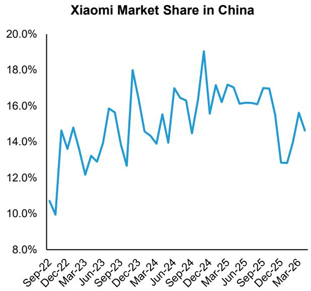

line

| Date    | Market Share |
|---------|--------------|
| Sep-22  | 10.5%        |
| Dec-22  | 14.5%        |
| Mar-23  | 13.0%        |
| Jun-23  | 15.5%        |
| Sep-23  | 12.5%        |
| Dec-23  | 18.0%        |
| Mar-24  | 14.0%        |
| Jun-24  | 17.0%        |
| Sep-24  | 16.5%        |
| Dec-24  | 19.0%        |
| Mar-25  | 16.0%        |
| Jun-25  | 17.0%        |
| Sep-25  | 16.5%        |
| Dec-25  | 17.0%        |
| Mar-26  | 15.5%        |

Source: CIINNO and Bernstein analysis

EXHIBIT 28: Xiaomi's yoy growth fell -23% YoY.   
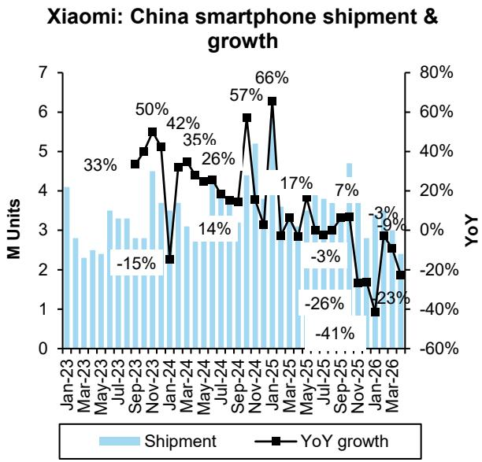

bar_line

Xiaomi: China smartphone shipment & growth
| Month | Shipment (M Units) | YoY growth (%) |
|---|---|---|
| Jan-23 | 4.1 | |
| Mar-23 | 2.5 | 33 |
| May-23 | 2.4 | |
| Jul-23 | 3.4 | -15 |
| Sep-23 | 2.8 | 50 |
| Nov-23 | 4.5 | 42 |
| Jan-24 | 3.7 | 35 |
| Mar-24 | 3.1 | 26 |
| May-24 | 2.7 | 14 |
| Jul-24 | 2.8 | 57 |
| Sep-24 | 5.2 | 66 |
| Nov-24 | 3.7 | 17 |
| Jan-25 | 2.9 | -3 |
| Mar-25 | 0.8 | -26 |
| May-25 | 3.8 | -3 |
| Jul-25 | 3.9 | 7 |
| Sep-25 | 4.7 | -41 |
| Nov-25 | 2.8 | -23 |
| Jan-26 | 3.4 | -3 |
| Mar-26 | 1.9 | -9 |

Source: CINNO and Bernstein analysis

# MediaTek's unit share declined by 2.9pts sequentially mainly as non-Apple/Huawei OEMs lost shares.

- In April, unit share of Qualcomm and MediaTek decreased by 2.8pts and 2.9pts QoQ, respectively, primarily as non-Apple/Huawei OEMs lost shares. On a YoY basis, Qualcomm lost 8.0pts market share, while HiSilicon gained 8.3pts (Exhibit 29 - Exhibit 30). MediaTek's shipment mix continued to improve slightly in April after plateauing for 2-3 quarters (Exhibit 31). The company expects further growth of its flagship SoC business driven by customers' oversea expansion as OEMs like OPPO and Xiaomi trying to sell more high-end phones outside China (more details in our Tech Tour notes). For example, Xiaomi's 17T - flagship specially targeting oversea markets was launched on 28 May & MediaTek benefits as its sole SoC supplier (i.e. Dimensity 8500 for Standard variant & Dimensity 9500 for Pro variant). It remains to be seen whether overseas markets can provide a sustained uplift to MediaTek's sales mix. Overall, we're cautious on MediaTek's smartphone business considering the pressure from high memory price & its higher exposure to mid- to low-end segments.   
- Finally, the latest data shows UNISOC's share remained well below 1% (Exhibit 32), implying the mobile SoC market in China remains a duopoly. Because China has the motivation to use the chips from Chinese suppliers, UNISOC's share staying so low in China attests that the company is not competitive in 5G.

EXHIBIT 29: In April, unit share of Qualcomm and MediaTek decreased by 2.8pts and 2.9pts QoQ, respectively...   
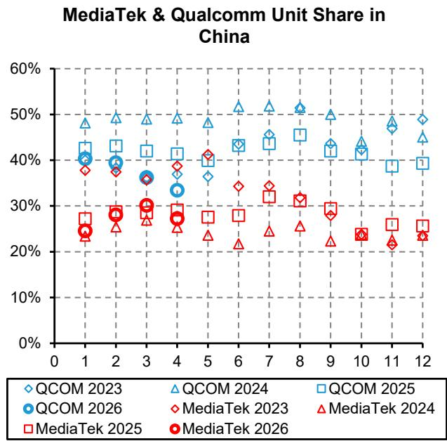

scatter

MediaTek & Qualcomm Unit Share in China
| Month | QCOM 2023 (%) | QCOM 2024 (%) | QCOM 2025 (%) | QCOM 2026 (%) | MediaTek 2023 (%) | MediaTek 2024 (%) | MediaTek 2025 (%) | MediaTek 2026 (%) |
| :--- | :--- | :--- | :--- | :--- | :--- | :--- | :--- | :--- |
| 1 | 40.5 | 48.5 | 43.5 | 40.5 | 37.5 | 37.5 | 27.5 | 24.5 |
| 2 | 41.0 | 49.5 | 43.0 | 39.5 | 37.0 | 37.0 | 28.0 | 25.0 |
| 3 | 36.0 | 49.5 | 42.0 | 36.0 | 37.5 | 37.5 | 29.0 | 29.5 |
| 4 | 36.5 | 49.5 | 41.5 | 33.5 | 38.5 | 38.5 | 28.0 | 27.0 |
| 5 | 36.5 | 48.5 | 41.0 | 33.0 | 40.5 | 40.5 | 27.5 | 26.5 |
| 6 | 43.0 | 51.5 | 43.5 | 33.0 | 34.0 | 34.0 | 28.0 | 21.5 |
| 7 | 45.0 | 51.5 | 44.0 | 33.0 | 33.5 | 33.5 | 31.0 | 24.5 |
| 8 | 44.0 | 51.5 | 44.5 | 31.5 | 31.0 | 31.0 | 31.0 | 25.5 |
| 9 | 43.0 | 50.0 | 42.5 | 28.5 | 29.0 | 29.0 | -1.0 | -1.0 |
| 10 | -1.0 | -1.0 | -1.0 | -1.0 | -1.0 | -1.0 | -1.0 | -1.0 |
| 11 | -1.0 | -1.0 | -1.0 | -1.0 | -1.0 | -1.0 | -1.0 | -1.0 |
| 12 | -1.0 | -1.0 | -1.0 | -1.0 | -1.0 | -1.0 | -1.0 | -1.0 |

EXHIBIT 30: ...primarily due to weaker share among non-Apple/Huawei OEMs.   
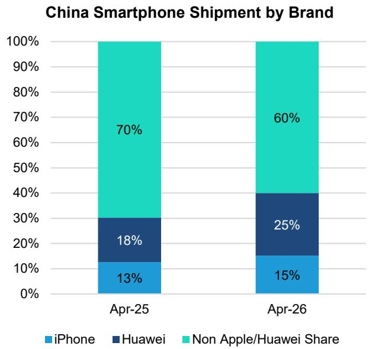

bar_stacked

China Smartphone Shipment by Brand
| Year | iPhone (%) | Huawei (%) | Non Apple/Huawei Share (%) |
| :--- | :--- | :--- | :--- |
| Apr-25 | 13 | 18 | 70 |
| Apr-26 | 15 | 25 | 60 |

Source: CINNO and Bernstein analysis   
Source: CINNO and Bernstein analysis

EXHIBIT 31: MediaTek's shipment mix continued to improve after plateauing for a while.   
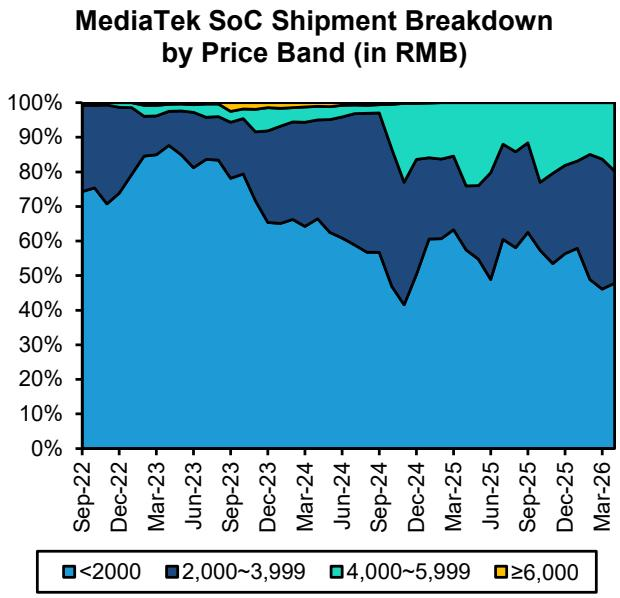

area

MediaTek SoC Shipment Breakdown by Price Band (in RMB)
| Date | <2000 (%) | 2,000~3,999 (%) | 4,000~5,999 (%) | ≥6,000 (%) |
|---|---|---|---|---|
| Sep-22 | 75 | 18 | 5 | 0 |
| Dec-22 | 70 | 15 | 5 | 0 |
| Mar-23 | 85 | 12 | 3 | 0 |
| Jun-23 | 80 | 10 | 3 | 0 |
| Sep-23 | 75 | 10 | 3 | 0 |
| Dec-23 | 65 | 15 | 5 | 0 |
| Mar-24 | 65 | 15 | 5 | 0 |
| Jun-24 | 60 | 15 | 5 | 0 |
| Sep-24 | 55 | 15 | 10 | 0 |
| Dec-24 | 40 | 25 | 30 | 0 |
| Mar-25 | 60 | 15 | 10 | 0 |
| Jun-25 | 50 | 15 | 15 | 0 |
| Sep-25 | 60 | 15 | 10 | 0 |
| Dec-25 | 55 | 15 | 10 | 0 |
| Mar-26 | 45 | 15 | 10 | 0 |

Source: CINNO and Bernstein analysis

EXHIBIT 32: UNISOC's share remained very small in China, indicating UNISOC is not competitive in 5G.   
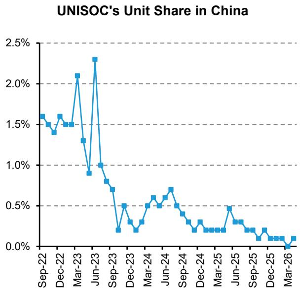

line

| Month    | Unit Share |
| -------- | ---------- |
| Sep-22   | 1.6%       |
| Dec-22   | 1.4%       |
| Mar-23   | 2.1%       |
| Jun-23   | 2.3%       |
| Sep-23   | 1.0%       |
| Dec-23   | 0.5%       |
| Mar-24   | 0.6%       |
| Jun-24   | 0.7%       |
| Sep-24   | 0.4%       |
| Dec-24   | 0.3%       |
| Mar-25   | 0.5%       |
| Jun-25   | 0.3%       |
| Sep-25   | 0.2%       |
| Dec-25   | 0.1%       |
| Mar-26   | 0.1%       |

Source: CINNO and Bernstein analysis

# OLED helps Novatek fend off the Chinese rivals, but the adoption has hit a ceiling. Foldable panel remained too small to move the needle.

\- After OLED panel penetration surpassed 80% of the smartphones shipped in China in late 2023, further penetration has been very gradual (Exhibit 33). In fact the penetration has been hovering around 90% for months. We believe that OLED is now a mainstream feature and penetration has come to a ceiling with very limited headroom left (Exhibit 34, Exhibit 35).

The growth of OLED panel and the supporting DDIC is thus bound to slow. Novatek has been a key beneficiary of the rising OLED adoption but plateauing OLED penetration may allow Chinese rivals to catch up. Going forward, Novatek will need to count on share gains especially at Apple & Samsung & the integration of touch function to OLED DDIC to sustain growth & its competitiveness vs. Chinese rivals.

\- Finally, foldable panel adoption remained below $5\%$ (Exhibit 36). We don't expect a meaningful pick-up in the penetration until late 2026 when iPhone Foldable is expected to debut.

EXHIBIT 33: The OLED penetration stood at c. 90% in April.   
China Smartphone Shipment Breakdown by Display Technology   
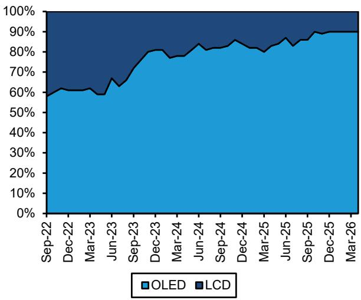

area

| Date    | OLED  | LCD  |
|---------|-------|------|
| Sep-22  | 60%   | 40%  |
| Dec-22  | 60%   | 40%  |
| Mar-23  | 60%   | 40%  |
| Jun-23  | 65%   | 35%  |
| Sep-23  | 70%   | 30%  |
| Dec-23  | 80%   | 25%  |
| Mar-24  | 80%   | 25%  |
| Jun-24  | 85%   | 25%  |
| Sep-24  | 85%   | 25%  |
| Dec-24  | 85%   | 25%  |
| Mar-25  | 85%   | 25%  |
| Jun-25  | 85%   | 25%  |
| Sep-25  | 85%   | 25%  |
| Dec-25  | 90%   | 20%  |
| Mar-26  | 90%   | 15%  |

Source: CINNO and Bernstein analysis

EXHIBIT 34: OLED penetration in non-Apple/Huawei smartphones remained at 88%.   
OLED Penetration in Non-Apple/Huawei Smartphones Shipment in China   
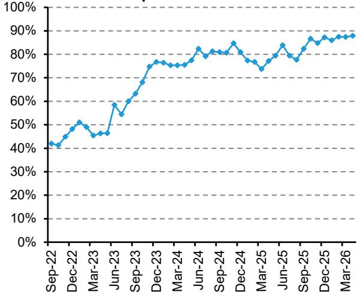

line

| Date    | Value |
|---------|-------|
| Sep-22  | 40%   |
| Dec-22  | 45%   |
| Mar-23  | 50%   |
| Jun-23  | 45%   |
| Sep-23  | 55%   |
| Dec-23  | 70%   |
| Mar-24  | 75%   |
| Jun-24  | 80%   |
| Sep-24  | 85%   |
| Dec-24  | 75%   |
| Mar-25  | 70%   |
| Jun-25  | 80%   |
| Sep-25  | 85%   |
| Dec-25  | 85%   |
| Mar-26  | 85%   |

Source: CINNO and Bernstein analysis

EXHIBIT 35: All OEMs shipped less OLED YoY in April except for Huawei and Apple.   
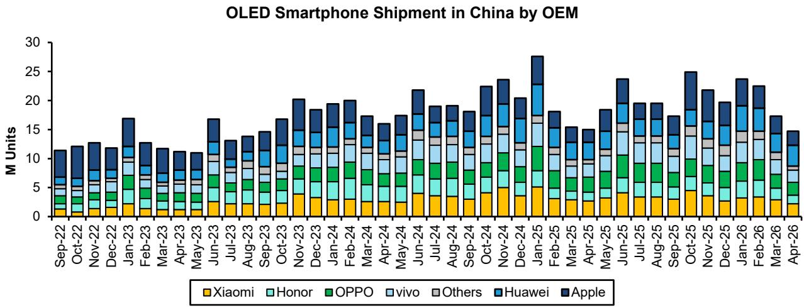  
Source: CINNO and Bernstein analysis

EXHIBIT 36: The adoption rate of foldable panel dropped to below 5% in April.   
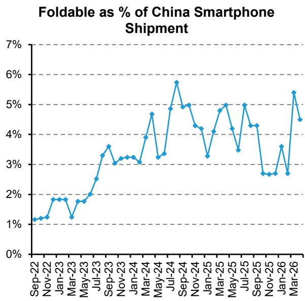

line

| Month    | Foldable as % of China Smartphone Shipment |
| -------- | ------------------------------------------ |
| Sep-22   | 1.1%                                       |
| Nov-22   | 1.2%                                       |
| Jan-23   | 1.8%                                       |
| Mar-23   | 1.3%                                       |
| May-23   | 1.8%                                       |
| Jul-23   | 2.5%                                       |
| Sep-23   | 3.6%                                       |
| Nov-23   | 3.1%                                       |
| Jan-24   | 3.2%                                       |
| Mar-24   | 3.9%                                       |
| May-24   | 4.7%                                       |
| Jul-24   | 3.3%                                       |
| Sep-24   | 5.8%                                       |
| Nov-24   | 5.0%                                       |
| Jan-25   | 4.3%                                       |
| Mar-25   | 4.8%                                       |
| May-25   | 5.0%                                       |
| Jul-25   | 3.5%                                       |
| Sep-25   | 5.0%                                       |
| Nov-25   | 4.3%                                       |
| Jan-26   | 2.7%                                       |
| Mar-26   | 3.6%                                       |
| May-26   | 5.5%                                       |
| Jul-26   | 4.5%                                       |

Source: CINNO and Bernstein analysis

# I. REQUIRED DISCLOSURES

References to "Bernstein" or the "Firm" in these disclosures relate to the following entities: Bernstein Institutional Services LLC (April 1, 2024 onwards), Bernstein & Co., LLC (pre April 1, 2024), Bernstein Autonomous LLP, BSG France S.A. (April 1, 2024 onwards), Bernstein (Hong Kong) Limited 盛博香港有限公司, Bernstein (Canada) Limited, Bernstein (India) Private Limited (SEBI registration no. INH000006378), Bernstein (Singapore) Private Limited, Bernstein Japan KK (サンフォード・C・バーンスタイン株式会社) and analysts employed by SG Africa Technologies & Services to produce Bernstein under a Global Services Agreement in place between Bernstein and SG.

Bernstein is part of a joint venture between SG (SG) and AllianceBernstein, L.P. (AB). Unless specifically noted otherwise, for purposes of these disclosures, references to Bernstein's “affiliates” relate to both SG and AB and their respective affiliates.

# VALUATION METHODOLOGY

This research publication covers six or more companies. For valuation methodology and other company disclosures:

Please visit: https://bernstein-autonomous.bluematrix.com/sellside/Disclosures.action.

Or, you can also write to the Director of Compliance, Bernstein Institutional Services LLC, 245 Park Avenue, New York, NY 10167.

# RISKS

This research publication covers six or more companies. For risks and other company disclosures:

Please visit: https://bernstein-autonomous.bluematrix.com/sellside/Disclosures.action.

Or, you can also write to the Director of Compliance, Bernstein Institutional Services LLC, 245 Park Avenue, New York, NY 10167.

# RATINGS DEFINITIONS, BENCHMARKS AND DISTRIBUTION

# EQUITY RATINGS DEFINITIONS

# Bernstein brand

The Bernstein brand rates stocks based on forecasts of relative performance for the next 12 months versus the S&P 500 for stocks listed on the U.S. and Canadian exchanges, versus the Bloomberg Europe Developed Markets Large and Mid Cap Price Return Index EUR (EDME) for stocks listed on the European exchanges and emerging markets exchanges outside of the Asia Pacific region, versus the Bloomberg Japan Large and Mid Cap Price Return Index USD (JPL) for stocks listed on the Japanese exchanges, and versus the Bloomberg Asia ex-Japan Large and Mid Cap Price Return Index (ASIAX) for stocks listed on the Asian (ex-Japan) exchanges -unless otherwise specified.

The Bernstein brand has three categories of ratings:

- Outperform: Stock will outpace the market index by more than 15 pp   
• Market-Perform: Stock will perform in line with the market index to within +/-15 pp   
• Underperform: Stock will trail the performance of the market index by more than 15 pp

Coverage Suspended: Coverage of a company under the Bernstein brand has been suspended. Ratings and price targets are suspended temporarily, are no longer current, and should therefore not be relied upon.

Not Rated: A rating assigned when the stock cannot be accurately valued, or the performance of the company accurately predicted, at the present time. The covering analyst may continue to publish research reports on the company to update investors on events and developments.

Not Covered (NC) denotes companies that are not under coverage.

Bernstein brand stock ratings are based on a 12-month time horizon.

# Autonomous brand – common stocks

The Autonomous brand rates common stocks as indicated below. As our benchmarks we use the Bloomberg Europe 500 Banks And Financial Services Index (BEBANKS) and Bloomberg Europe Dev Mkt Financials Large and Mid Cap Price Ret Index EUR (EDMFI) index for developed European banks and Payments, the Bloomberg Europe 500 Insurance Index (BEINSUR) for European insurers, the S&P 500 and S&P Financials for US banks and Payments coverage, S5LIFE for US Insurance, the S&P Insurance Select Industry (SPSIINS) for US Non-Life Insurers coverage, and the Bloomberg Emerging Markets Financials Large, Mid and Small Cap Price Return Index (EMLSF) for emerging market banks and insurers and Payments. Ratings are stated relative to the sector (not the market).

The Autonomous brand has three categories of common stock ratings:

- Outperform (OP): Stock will outpace the relevant index by more than 10 pp   
- Neutral (N): Stock will perform in line with the market index to within +/-10 pp   
• Underperform (UP): Stock will trail the performance of the relevant index by more than 10 pp

Coverage Suspended: Coverage of a company under the Autonomous research brand has been suspended. Ratings and price targets are suspended temporarily, are no longer current, and should therefore not be relied upon.

Not Rated: A rating assigned when the stock cannot be accurately valued, or the performance of the company accurately predicted, at the present time. The covering analyst may continue to publish research reports on the company to update investors on events and developments.

Those denoted as ‘Feature’ (e.g., Feature Outperform FOP, Feature Under Outperform FUP) are our core ideas.

Not Covered (NC) denotes companies that are not under coverage.

Autonomous brand common stock ratings are based on a 12-month time horizon.

# Autonomous brand – preferred stocks

The Autonomous brand has three categories of preferred stock ratings:

- Outperform (OP): The total return of the preferred instrument is expected to outperform preferred securities of other issuers operating in similar sectors or rating categories over the next six months.   
- Neutral (N): The total return of the preferred instrument is expected to perform in line with preferred securities of other issuers operating in similar sectors or rating categories over the next six months.   
- Underperform (UP): The total return of the preferred instrument is expected to underperform preferred securities of other issuers operating in similar sectors or rating categories over the next six months.

Autonomous preferred stock ratings are based on a 6-month time horizon.

# AUTONOMOUS CREDIT RESEARCH

Where this report contains investment recommendations for credit instruments, as defined in article 3(1)(35) of the Market Abuse Regulation, the information below is presented to comply with its disclosure requirements.

The report may also include reference(s) to published opinions by other Autonomous or Bernstein analysts covering the equity securities of the issuer(s) referenced herein. Please note an investment recommendation for credit instruments published by the author(s) of this report may differ from the published view of the analyst covering equity securities for the issuer(s) contained in this report and vice versa.

# CREDIT RATINGS DEFINITIONS

The Autonomous brand has three categories of credit ratings:

\- Credit Outperform (C-OP): The total return of the Reference Credit Instrument is expected to outperform the credit spread of bonds of other issuers operating in similar sectors or rating categories over the next six months.

- Credit Neutral (C-N): The total return of the Reference Credit Instrument is expected to perform in line with the credit spread of bonds of other issuers operating in similar sectors or rating categories over the next six months.   
- Credit Underperform (C-UP): The total return of the Reference Credit Instrument is expected to underperform the credit spread of bonds of other issuers operating in similar sectors or rating categories over the next six months.

Autonomous credit ratings are based on a 6-month time horizon.

A list of all investment recommendations produced by the author(s) of this report alongside credit ratings history are available upon request.

It is at the sole discretion of the Firm as to when to initiate, update and cease research coverage. The Firm has established, maintains and relies on information barriers to control the flow of information contained in one or more areas (i.e. the private side) within the Firm, and into other areas, units, groups or affiliates (i.e. public side) of the Firm

DISTRIBUTION OF EQUITY RATINGS/INVESTMENT BANKING SERVICES 

<table><tr><td>Equity Rating</td><td>Market Abuse Regulation (MAR) and FINRA Rating Category</td><td>Global Rating Distribution</td><td>Investment Banking Relationships*</td></tr><tr><td>Outperform</td><td>BUY</td><td>51.1%</td><td>16.5%</td></tr><tr><td>Market-Perform (Bernstein Brand) Neutral (Autonomous Brand)</td><td>HOLD</td><td>36.3%</td><td>17.8%</td></tr><tr><td>Underperform</td><td>SELL</td><td>12.6%</td><td>14.9%</td></tr></table>

\* These figures represent the percentage of companies within each equity rating category for which affiliates of Bernstein have provided investment banking services within the previous 12 months.

As of March 31, 2026. All figures are updated quarterly.

Prior to April 1, 2024, Bernstein & Co., LLC. issued the ratings and price target information in the graph(s) below for the following companies: Qualcomm Inc and Apple Inc.

# PRICE CHARTS/ RATINGS AND PRICE TARGET HISTORY

This research publication covers six or more companies. For price chart and other company disclosures, please visit https://bernstein-autonomous.bluematrix.com/sellside/Disclosures.action or you can write to the Director of Compliance, Bernstein Institutional Services LLC, 245 Park Avenue, New York, NY 10167.

# CONFLICTS OF INTEREST

All statements in this report attributable to Gartner represent Bernstein's interpretation of data, research opinion or viewpoints published as part of a syndicated subscription service by Gartner, Inc., and have not been reviewed by Gartner. Each Gartner publication speaks as of its original publication date (and not as of the date of this report). The opinions expressed in Gartner publications are not representations of fact, and are subject to change without notice.

Stacy A. Rasgon maintains long positions in various crypto currencies.

SG and/or its affiliates beneficially own 1% or more of a class of common equity securities of the following company: SOITEC.

Bernstein and/or affiliates have received compensation for investment banking services in the past twelve months from SOITEC.

Bernstein and/or affiliates have received compensation for non-investment banking securities-related products or services in the previous twelve months from the following clients: SOITEC and Apple Inc.

Bernstein has received compensation for non-investment banking securities-related products or services in the previous twelve months from the following clients: Apple Inc.

Bernstein and/or affiliates expect to receive or intend to seek compensation for investment banking services in the next three months from SOITEC.

Certain affiliates of Bernstein act as market maker or liquidity provider in the equities securities of: Qualcomm Inc, SOITEC and Apple Inc.

Bernstein and/or affiliates had an investment banking client relationship during the past twelve months with SOITEC.

# OTHER MATTERS

The legal entity(ies) employing the analyst(s) listed in this report, and their location, can be determined by the country code of their phone number, as follows:

+1 Bernstein Institutional Services LLC; New York, New York, USA

+44 Bernstein Autonomous LLP; London UK

+212 SG Africa Technologies & Services; Casablanca, Morocco

+33 BSG France S.A.; Paris, France

+34 BSG France S.A.; Madrid, Spain

+41 Bernstein Autonomous LLP; Geneva, Switzerland

+49 BSG France S.A.; Frankfurt, Germany

+91 Bernstein (India) Private Limited; Mumbai, India

+852 Bernstein (Hong Kong) Limited 盛博香港有限公司; Hong Kong, China

+65 Bernstein (Singapore) Private Limited; Singapore

+81 Bernstein Japan KK; Tokyo, Japan

Where this report has been prepared by research analyst(s) employed by a non-US affiliate, such analyst(s), is/are (unless otherwise expressly noted below) not registered as associated persons of Bernstein Institutional Services LLC or any other SEC-registered broker-dealer and are not licensed or qualified as research analysts with FINRA. Accordingly, such analyst(s) may not be subject to FINRA's restrictions regarding (among other things) communications by research analysts with a subject company, interactions between research analysts and investment banking personnel, participation by research analysts in solicitation and marketing activities relating to investment banking transactions, public appearances by research analysts, and trading securities held by a research analyst account.

Where this report has been prepared by research analyst(s) employed by SG Africa Technologies & Services (part of the SG group of companies), it has been prepared on behalf of a Bernstein company under a Global Services Agreement in place between Bernstein and SG.

# CERTIFICATION

Each research analyst listed in this report, who is primarily responsible for the preparation of the content of this report, certifies that all of the views expressed in this publication accurately reflect that analyst's personal views about any and all of the subject securities or issuers and that no part of that analyst's compensation was, is, or will be, directly or indirectly, related to the specific recommendations or views in this publication.

# II. ADDITIONAL GLOBAL CONFLICT DISCLOSURES

It is at the sole discretion of the Firm as to when to initiate, update and cease research coverage. The Firm has established, maintains and relies on information barriers to control the flow of information contained in one or more areas (i.e., the private side) within the Firm, and into other areas, units, groups or affiliates (i.e., public side) of the Firm.

# III. OTHER IMPORTANT INFORMATION AND DISCLOSURES

Separate branding is maintained for “Bernstein” and “Autonomous” research products.

- Bernstein produces a number of different types of research products including, among others, fundamental analysis and quantitative analysis under both the “Autonomous” and “Bernstein” brands. Recommendations contained within one type of research product may differ from recommendations contained within other types of research products, whether as a result of differing time horizons, methodologies or otherwise. Furthermore, views or recommendations within a research product issued under one brand may differ from views or recommendations under the same type of research product issued under the other brand. The Research Ratings System for the two brands and other information related to those Rating Systems are included in the previous section.   
- Autonomous operates as a separate business unit within the following entities: Bernstein Institutional Services LLC, Bernstein Autonomous LLP, Bernstein (Hong Kong) Limited 盛博香港有限公司 and Bernstein (India) Private Limited. For information relating to “Autonomous” branded products (including certain Sales materials) please visit: www.autonomous.com. For information relating to Bernstein branded products please visit: www.bernsteinresearch.com.

Analysts are compensated based on aggregate contributions to the research franchise as measured by account penetration, productivity and proactivity of investment ideas. No analysts are compensated based on performance in, or contributions to, generating investment banking revenues.

This report has been produced by an independent analyst as defined in Article 3 (1)(34)(i) of EU 596/2014 Market Abuse Regulation (“MAR”) and the same article of MAR as it forms part of United Kingdom domestic law by virtue of the European Union (Withdrawal) Act 2018.

To our readers in the United States: Bernstein Institutional Services LLC, a broker-dealer registered with the U.S. Securities and Exchange Commission (“SEC”) and a member of the U.S. Financial Industry Regulatory Authority, Inc. (“FINRA”) is distributing this publication in the United States and accepts responsibility for its contents. Where this material contains an analysis of debt product(s), such material is intended only for institutional investors and is not subject to the US independence and disclosure standards applicable to debt research prepared for retail investors.

Bernstein Institutional Services LLC may act as principal for its own account or as agent for another person (including an affiliate) in sales or purchases of any security which is a subject of this report. This report does not purport to meet the objectives or needs of any specific individuals, entities or accounts.

To our readers in Canada: If this publication pertains to a Canadian domiciled company, it is being distributed in Canada by Bernstein (Canada) Limited, which is licensed and regulated by the Canadian Investment Regulatory Organization. If the publication pertains to a non-Canadian domiciled company, it is being distributed by Bernstein Institutional Services LLC, which is licensed and regulated by both the SEC and FINRA, into Canada under the International Dealers Exemption.

This document may not be passed onto any person in Canada unless that person qualifies as "permitted client" as defined in Section 1.1 of NI 31-103.

To our readers in Brazil: This report has been prepared by Bernstein Institutional Services LLC, and Banco BTG Pactual S.A. ("BTG") is responsible for the distribution of this report in Brazil.

To readers in the United Kingdom: This publication has been issued or approved for issue in the United Kingdom by Bernstein Autonomous LLP, authorised and regulated by the Financial Conduct Authority and located at 60 London Wall, London EC2M 5SH, +44 (0)20-7170-5000. Registered in England & Wales No OC343985.

This document is for distribution only to persons who (i) have professional experience in matters relating to investments falling within Article 19(5) of the Financial Services and Markets Act 2000 (Financial Promotion) Order 2005 (as amended, the “Financial Promotion Order”), (ii) are persons falling within Article 49(2)(a) to (d) (“high net worth companies, unincorporated associations, etc.”) of the Financial Promotion Order, (iii) are outside the United Kingdom, or (iv) are persons to whom an invitation or inducement to engage in investment activity (within the meaning of section 21 of the FSMA) in connection with the issue or sale of any securities may otherwise lawfully be communicated or caused to be communicated (all such persons together being referred to as “relevant persons”). This document is directed only at relevant persons and must not be acted on or relied on by persons who are not relevant persons. Any investment or investment activity to which this document relates is available only to relevant persons and will be engaged in only with relevant persons.

To our readers in the member states of the EEA: This publication is being distributed by BSG France SA, which is authorised and regulated by the Autorité de Contrôle Prudentiel et de Résolution (ACPR) and Autorité des Marchés Financiers (AMF).

To our readers in Hong Kong: This publication is being distributed in Hong Kong by Bernstein (Hong Kong) Limited 盛博香港有限公司, which is licensed and regulated by the Hong Kong Securities and Futures Commission (Central Entity No. AXC846) to carry out Type 4 (Advising on Securities) regulated activities and subject to the licensing conditions mentioned in the SFC Public Register (https://www.sfc.hk/publicregWeb/corp/AXC846/details)). This publication is solely for professional investors, as defined in the Securities and Futures Ordinance (Cap. 571). The purpose of this report is solely to provide an analysis of the issuers referred to in this report and is not intended for any purpose contrary to the laws of Hong Kong.

To our readers in Singapore: This publication is being distributed in Singapore by Bernstein (Singapore) Private Limited, only to accredited investors or institutional investors, as defined in the Securities and Futures Act 2001 of Singapore ("SFA"). Recipients in Singapore should contact Bernstein (Singapore) Private Limited in respect of matters arising from, or in connection with, this publication. Bernstein (Singapore) Private Limited is regulated by the Monetary Authority of Singapore and licensed under the SFA as a capital markets services licence holder for dealing in capital markets products that are securities and collective investment schemes and an exempt financial adviser for advising on, issuing and promulgating analyses and reports on securities. Bernstein (Singapore) Private Limited is registered in Singapore with Company Registration No. 20213710W and located at One Raffles Quay, #27-11 South Tower, Singapore 048583, +65-6230-4612.

To our readers in the People's Republic of China: The securities referred to in this document are not being offered or sold and may not be offered or sold, directly or indirectly, in the People's Republic of China (for such purposes, not including the Hong Kong and Macau Special Administrative Regions or Taiwan, the “PRC”) in contravention of any applicable laws of the PRC.

This document does not constitute an offer to sell or the solicitation of an offer to buy any securities in the PRC to any person to whom it is unlawful to make the offer or solicitation in the PRC.

We do not represent that this document may be lawfully distributed, or that any securities may be lawfully offered, in compliance with any applicable registration or other requirements in the PRC, or pursuant to an exemption available thereunder, or assume any responsibility for facilitating any such distribution or offering. In particular, no action has been taken by us which would permit a public offering of any securities or distribution of this document in the PRC. Accordingly, the securities are not being offered or sold within the PRC by means of this document or any other document. Neither this document nor any advertisement or other offering material may be distributed or published in the PRC, except under circumstances that will result in compliance with any applicable laws and regulations.

To our readers in Japan: This publication is being distributed in Japan by Bernstein Japan KK (サンフォード・C・バーンスタイン株式会社), which is registered in Japan as a Financial Instruments Business Operator with the Kanto Local Finance Bureau (registration number: The Director-General of Kanto Local Finance Bureau (FIBO) No.3387) and regulated by the Financial Services Agency. It is also a member of Japan Investment Advisers Association. This publication is solely for qualified institutional investors in Japan only, as defined in Article 2, paragraph (3), items (i) of the Financial Instruments and Exchange Act.

For the institutional client readers in Japan who have been granted access to the Bernstein website by Daiwa Group Inc. ("Daiwa"), your access to this document should not be construed as meaning that Bernstein is providing you with investment advice for any purposes. Whilst Bernstein has prepared this document, your relationship is, and will remain with, Daiwa, and Bernstein has neither any contractual relationship with you nor any obligations towards you.

To our readers in Australia: Bernstein (Hong Kong) Limited 盛博香港有限公司 is responsible for distributing research in Australia. It is regulated by the Securities and Exchange Commission under U.S. laws, by the Financial Conduct Authority under U.K. laws, which differs from Australian laws. Bernstein (Hong Kong) Limited 盛博香港有限公司 is exempt from the requirement to hold an Australian financial services license under the Corporations Act 2001 in respect of the provision of the following financial services to wholesale clients:

• providing financial product advice;   
• dealing in a financial product;   
- making a market for a financial product; and   
• providing a custodial or depository service.

To our readers in India: This publication is being distributed in India by Bernstein (India) Private Limited (SCB India) which is licensed and regulated by Securities and Exchange Board of India ("SEBI") as a research analyst entity under the SEBI (Research Analyst) Regulations, 2014, having registration no. INH000006378 and as a stock broker having registration no. INZ000213537. SCB India is currently engaged in the business of providing research and stock broking services. Please refer to www.bernsteinresearch.in for more information.

\- SCB India is a Private limited company incorporated under the Companies Act, 2013, on April 12, 2017 bearing corporate identification number U65999MH2017FTC293762, and registered office at Level 3A, 4th Floor, First International Financial Centre, Plot Nos C-54 and C-55, G Block, Near CBI Office, Bandra Kurla Complex, Bandra (East), Mumbai 400098,

Maharashtra, India (Phone No: +91-22-68421401).

\- For details of Associates (i.e., affiliates/group companies) of SCB India, kindly email MUM-BERNSTEIN-InCompliance@bernsteinsg.com.

• SCB India does not have any disciplinary history as on the date of this report.

\- Except as noted above, SCB India and/or its Associates (i.e., affiliates/group companies), the Research Analysts authoring this report, and their relatives

• do not have any financial interest in the subject company   
• do not have actual/beneficial ownership of one percent or more in securities of the subject company;   
• is not engaged in any investment banking activities for Indian companies, as such;   
• have not managed or co-managed a public offering in the past twelve months for any Indian companies;

\- have not received any compensation for investment banking services or merchant banking services from the subject company in the past 12 months;

• have not received compensation for brokerage services from the subject company in the past twelve months;

\- have not received any compensation or other benefits from the subject company or third party related to the specific recommendations or views in this report; and

\- do not currently, but may in the future, act as a market maker in the financial instruments of the companies covered in the report.

• do not have any conflict of interest in the subject company as of the date of this report.

\- Except as noted above, the subject company has not been a client of SCB India during twelve months preceding the date of distribution of this research report. Neither SCB India nor its Associates (i.e., affiliates/group companies) have received compensation for products or services other than investment banking, merchant banking or brokerage services from the subject company in the past twelve months.

\- The principal research analyst(s) who prepared this report, members of the analysts' team, and members of their households are not an officer, director, employee or advisory board member of the companies covered in the report.

\- Our Compliance officer / Grievance officer is Ms. Rupal Talati, who can be reached at +91-22-68421451, or MUM-BERNSTEIN-InCompliance@bernsteinsg.com / Scbin-investorgrievance@bernsteinsg.com

\- The Research investor charter and Terms & Conditions of SCB India are available on its website and may be accessed at Bernstein (India) Private Limited (https://bernsteinresearch.in/) for your reference.

\- Disclaimer: Registration granted by SEBI, and certification from NISM, is in no way a guarantee of performance of the intermediary or provide any assurance of returns to investors. Investments in securities market are subject to market risks. Read all the related documents carefully before investing.

To our readers in Switzerland: This document is provided in Switzerland by or through Bernstein Autonomous LLP, and is provided only to qualified investors as defined in article 10 of the Swiss Collective Investment Scheme Act (“CISA”) and related provisions of the Collective Investment Scheme Ordinance and in strict compliance with applicable Swiss law and regulations. The products mentioned in this document may not be suitable for all types of investors. This document is based on the Directives on the Independence of Financial Research issued by the Swiss Bankers Association (SBA) in January 2008.

To our readers in the Middle East: Bernstein Autonomous LLP, DIFC branch has its principal office at Gate Village 06, DIFC, Dubai, UAE. Bernstein Autonomous LLP, DIFC branch is regulated by the Dubai Financial Services Authority (DFSA) with the registration number CL10040 and is provisioned for Arranging Deals in Investments and Advising on Financial Products. All communications and services are directed at Professional Clients and Market Counterparties only (as defined in the DFSA rulebook). Persons other than Professional Clients and Market Counterparties, such as Retail Clients, are not the intended

recipients of our communications or services.

# LEGAL

All research publications are disseminated to our clients through posting on the firm's password protected websites, bernsteinresearch.com and autonomous.com. Certain, but not all, research publications are also made available to clients through third-party vendors or redistributed to clients through alternate electronic means as a convenience.

This publication has been published and distributed in accordance with the Firm's policy for management of conflicts of interest in investment research, a copy of which is available from Bernstein Institutional Services LLC, Director of Compliance, 245 Park Avenue, New York, NY 10167. Additional disclosures and information regarding Bernstein's business are available on our website www.bernsteinresearch.com.

The securities described herein may not be eligible for sale in all jurisdictions or to certain categories of investors where that permission profile is not consistent with the licenses held by the entities noted herein. This document is for distribution only as may be permitted by law. This publication is not directed to, or intended for distribution to or use by, any person or entity who is a citizen or resident of, or located in any locality, state, country or other jurisdiction where such distribution, publication, availability or use would be contrary to law or regulation or which would subject any of the entities referenced herein or any of their subsidiaries or affiliates to any registration or licensing requirement within such jurisdiction. This publication is based upon public sources we believe to be reliable, but no representation is made by us that the publication is accurate or complete. We do not undertake to advise you of any change in the reported information or in the opinions herein. This publication was prepared and issued by entity referred to herein for distribution to eligible counterparties or professional clients. This publication is not an offer to buy or sell any security, and it does not constitute investment, legal or tax advice. The investments referred to herein may not be suitable for you. Investors must make their own investment decisions in consultation with their professional advisors in light of their specific circumstances. The value of investments may fluctuate, and investments that are denominated in foreign currencies may fluctuate in value as a result of exposure to exchange rate movements. Information about past performance of an investment is not necessarily a guide to, indicator of, or assurance of, future performance.

This report is directed to and intended only for our clients who are “eligible counterparties”, “professional clients”, “institutional investors” and/or “professional investors” as defined by the aforementioned regulators, and must not be redistributed to retail clients as defined by the aforementioned regulators. Retail clients who receive this report should note that the services of the entities noted herein are not available to them and should not rely on the material herein to make an investment decision. The result of such act will not hold the entities noted herein liable for any loss thus incurred as the entities noted herein are not registered/authorised/licensed to deal with retail clients and will not enter into any contractual agreement/arrangement with retail clients. This report is provided subject to the terms and conditions of any agreement that the clients may have entered into with the entities noted herein. All research reports are disseminated on a simultaneous basis to eligible clients through electronic publication to our client portal.

The information in this report was prepared by Bernstein solely for the internal business use of our clients. Clients may store, display, analyze, reformat and print the information in this report for this limited use only. Clients may not copy, alter, create derivative works, resell, reverse engineer, commercially exploit, share or distribute any part of the information contained herein for any purpose without Bernstein's express written consent. These restrictions include extracting data or using the content to develop indices or other products. Further, you may not use this report, or any portion of this report, to train or finetune any third-party machine learning or artificial intelligence system, or as a prompt or input into any such system. You also may not, without Bernstein's express written consent, do any of the foregoing in connection with your own internal machine learning or artificial intelligence system.

Bernstein may use artificial intelligence tools in the preparation of its materials. Any such materials are reviewed by Bernstein's research analysts prior to publication.

This report has been prepared for information purposes only and is based on current public information that we consider reliable, but the entities noted herein do not warrant or represent (express or implied) as to the sources of information or data contained herein are accurate, complete, not misleading or as to its fitness for the purpose intended even though the entities noted herein rely on reputable or trustworthy data providers, it should not be relied upon as such. Opinions expressed are the author(s)' current opinions as of the date appearing on the material only and we do not undertake to advise you of any change in the reported information or in the opinions herein.

This publication was prepared and issued by the entity referred to herein for distribution to eligible counterparties or professional clients. The information in this report is intended for general circulation and does not constitute an offer to buy or sell any security, investment, legal or tax advice nor a personal recommendation, as defined by any of the aforementioned regulators. It does not take into account the particular investment objectives, financial situations, or needs of individual investors. The report has not been reviewed by any of the aforementioned regulators and does not represent any official recommendation from the aforementioned regulators. The investments referred to herein may not be suitable for you. Investors must make their own investment decisions in consultation with advice sought from a financial adviser regarding the suitability of the investment product, taking into account the specific investment objectives, financial situation or particular needs of any recipient of the recommendation, before the recipient makes a commitment to purchase the investment product.

The analysis contained herein is based on numerous assumptions. Different assumptions could result in materially different results. The information in this report does not constitute, or form part of, any offer to sell or issue, or any offer to purchase or subscribe for shares, or to induce engage in any other investment activity. The value of any securities or financial instruments mentioned in this report may fluctuate subject to market conditions. Information about past performance of an investment is not necessarily a guide to, indicative of, or assurance of future performance. Estimates of future performance mentioned by the research analyst in this report are based on assumptions that may not be realized due to unforeseen factors like market volatility/fluctuation. In relation to securities or financial instruments denominated in a foreign currency other than the clients' home currency, movements in exchange rates will have an effect on the value, either favorable or unfavorable. Before acting on any recommendations in this report, recipients should consider the appropriateness of investing in the subject securities or financial instruments mentioned in this report and, if necessary, seek for independent professional advice.

The securities described herein may not be eligible for sale in all jurisdictions or to certain categories of investors where that permission profile is not consistent with the licenses held by the entities noted herein. This document is for distribution only as may be permitted by law. It is not directed to, or intended for distribution to or use by, any person or entity who is a citizen or resident of or located in any locality, state, country or other jurisdiction where such distribution, publication, availability or use would be contrary to law or regulation or would subject the entities noted herein to any regulation or licensing requirement within such jurisdiction.

Source: Bloomberg Index Services Limited. BLOOMBERG® is a trademark and service mark of Bloomberg Finance L.P. and its affiliates (collectively “Bloomberg”). Bloomberg or Bloomberg’s licensors own all proprietary rights in the Bloomberg Indices. Neither Bloomberg nor Bloomberg’s licensors approves or endorses this material, or guarantees the accuracy or completeness of any information herein, or makes any warranty, express or implied, as to the results to be obtained therefrom and, to the maximum extent allowed by law, neither shall have any liability or responsibility for injury or damages arising in connection therewith.

No part of this material may be reproduced, distributed or transmitted or otherwise made available without prior consent of the entities noted herein. Copyright Bernstein Institutional Services LLC Bernstein Autonomous LLP, BSG France S.A., Bernstein (Hong Kong) Limited 盛博香港有限公司, Bernstein (Canada) Limited, Bernstein (India) Private Limited (SEBI registration no. INH000006378), Bernstein (Singapore) Private Limited and Bernstein Japan KK (サンフォード・C・バーンスタイン株式会社). All rights reserved. The trademarks and service marks contained herein are the property of their respective owners. Any unauthorized use or disclosure is strictly prohibited. The entities noted herein may pursue legal action if the unauthorized use results in any defamation and/or reputational risk to the entities noted herein and research published under the Bernstein and Autonomous brands.