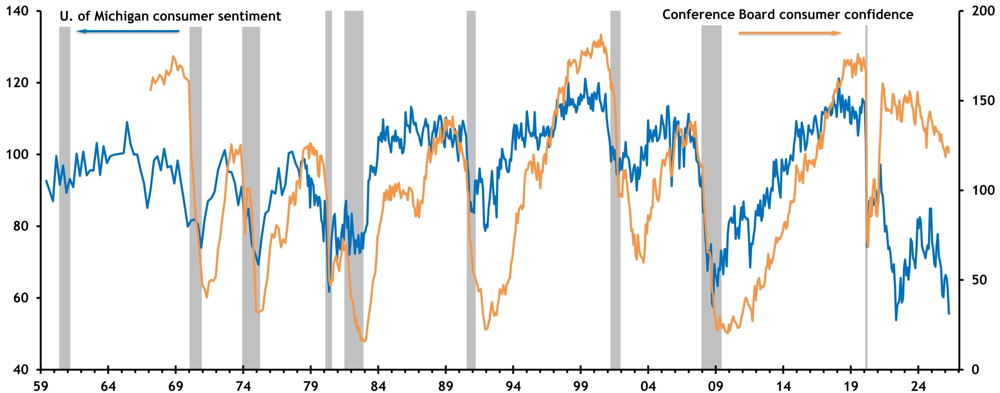
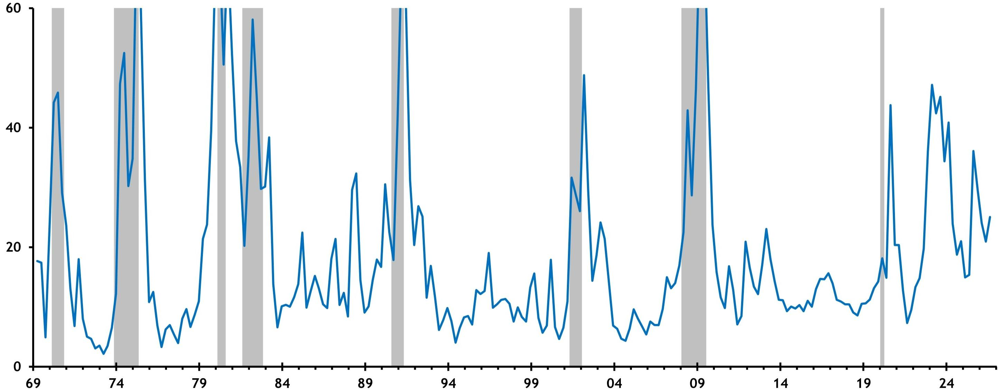
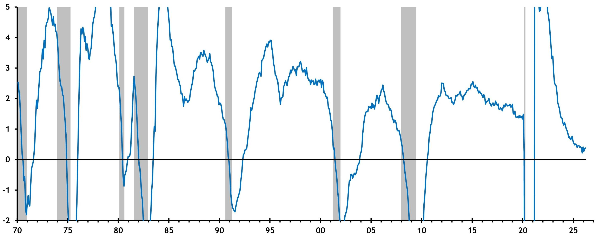

# 美国经济正在经历一场“数据悲观、基本面不差”的罕见错位

如果你只读新闻标题，2026年的美国经济几乎无可救药——政策不确定性指数飙升至540，消费者信心跌至半个世纪以来的最低点附近，专业预测者认为衰退的概率持续高企。然而，某外资投行最新发布的这份经济展望报告，却给出了一个与市场情绪几乎相反的核心判断：美国经济仍在增长，企业利润创下历史新高，而真正的结构性变量——生产率——正在经历互联网时代以来最好的表现。

这不是一个简单的“市场悲观过度”的故事。报告揭示了一个更深层的错位：宏观情绪指标与微观经济基本面之间的裂痕，正在重塑资产定价的逻辑。理解这个裂痕，比判断下一次降息时点更重要。

## 1. 消费者信心与真实支出之间的鸿沟，是2026年最被低估的宏观特征

报告用三张图表清晰地展示了这个矛盾。密歇根大学消费者信心指数在2024年调整了调查方法后，读数已跌至接近疫情初期的水平。Conference Board的消费者信心指数虽然相对温和，但整体方向同样指向悲观。与此同时，经济政策不确定性指数在2025年飙升至540，远超2020年疫情冲击时的500。

但报告紧接着展示了一个关键事实：实际GDP和国内私人最终销售（domestic private final sales）在过去两年持续正增长，且某外资投行预测这一趋势将继续，尽管同时承认衰退风险偏高。

这意味着什么？消费者“感觉”到的经济，与消费者“实际在做”的经济，出现了罕见的分裂。这种分裂不能简单用“统计滞后”来解释。更合理的解读是：消费者的悲观情绪主要来自对政策不确定性和通胀粘性的焦虑，而非实际收入或就业状况的恶化。报告中的就业成本指数（ECI）显示，工资增速虽然从2023年的5.1%高点回落至3.2%，但仍高于2019年水平，说明劳动力市场并未崩溃。

对于投资者而言，这个鸿沟的含义是：基于情绪指标的宏观交易策略，可能正在系统性地低估经济的真实韧性。如果信心修复只是时间问题，那么当前被压制的风险资产可能面临一次情绪驱动的重定价。

## 2. 生产率爆发正在改写“劳动力市场放缓必然导致经济减速”的传统叙事

报告中最引人注目的数据之一，是非农商业生产率增速。按12个季度年化计算，当前生产率增速已达到互联网时代以来的最高水平。与此同时，私人部门就业增长已放缓至0.5%（12个月同比），远低于2022年5%的高点。

传统宏观框架认为，就业放缓意味着产出增长乏力。但生产率的变化正在打破这个等式。报告明确指出，“最好的生产率增长（自互联网时代以来）帮助抵消了更慢的就业增长”。换句话说，同样的劳动力投入正在产生更多的产出。

这个转变对资产定价有两个深远影响。第一，它意味着美国经济的潜在增长率可能被系统性低估。如果生产率增速持续高于趋势，那么即使人口增长放慢、移民减少，实际GDP仍能维持2%左右的增速。第二，它改变了通胀与增长之间的传统权衡。更高的生产率意味着单位劳动成本下降，这为企业在维持利润的同时控制价格提供了空间——这正是报告显示企业利润率仍处于历史高位的重要原因。

但这里有一个关键问题报告没有完全展开：生产率提升的可持续性。当前的生产率爆发在多大程度上是AI投资驱动的暂时现象，多大程度上是结构性转变？报告的后续数据提供了线索，但未给出明确结论。

## 3. AI资本开支的“宏观幻觉”：巨额投资并未直接拉动GDP，真正的故事在别处

报告用一组对比数据揭示了一个容易被忽略的事实：尽管AI驱动的全球资本开支正在爆发式增长——2026年全球超大规模数据中心资本开支预计达到7800亿美元，同比增长74%——但这些投资对GDP增长的直接贡献仍然有限。

具体来看，2025年物理技术投资对GDP增长的贡献为0.6个百分点，但技术商品的净贸易逆差却拖累了0.8个百分点，两者相抵后，AI相关投资对GDP的净贡献几乎为零。这听起来反直觉，但逻辑很清楚：美国进口了大量AI相关硬件设备，这些进口在GDP核算中属于减项。

但这绝不意味着AI投资不重要。报告实际上在暗示：AI对经济的真正影响，不是通过投资本身，而是通过它正在推动的生产率提升。全球半导体销售额从2021年的约600亿美元跃升至2026年的约1300亿美元，这个数字背后是算力成本的快速下降和应用场景的扩展。而报告中的另一组数据——每天在工作中使用AI的美国人比例，在过去两年仅从9%上升到12.6%——恰恰说明，AI的渗透仍处于极早期阶段。

这意味着什么？当前市场对AI的定价，可能同时存在两种错误：一是高估了AI投资对短期GDP的拉动（这是宏观核算上的幻觉），二是低估了AI对长期生产率的潜在影响（这是渗透率数据揭示的空间）。对于产业决策者而言，真正的机会不在于追逐资本开支的短期脉冲，而在于理解生产率提升将如何重塑行业成本结构和竞争格局。

## 4. 通胀回落之路比预期更崎岖，但市场可能误读了美联储的反应函数

报告的核心通胀数据显示了一个令人不安的趋势：核心PCE通胀从2024年的3.0%回升至2026年的3.3%，核心PPI和核心非燃料进口价格也在同步上升。这与市场年初预期的“通胀平稳回落至2%”的叙事明显冲突。

更关键的是，市场对美联储利率路径的预期已经发生了根本性转变。报告中的“市场隐含联邦基金利率变化”图表显示，截至2026年5月29日，市场预期2027年9月之前将有一次加息，而在三个月前的2月27日，市场还预期2027年9月之前会有约70个基点的降息。从降息到加息的预期反转，只用了三个月。

但这里有一个值得深思的问题：如果通胀回升主要是由关税和供给侧冲击驱动的，而非需求过热，那么美联储的加息门槛可能比市场想象的要高。报告特别强调了油价的下行风险——中东冲突导致全球18%的原油和凝析油供应面临风险，这个数字远超历史上任何一次供应冲击。如果油价冲击导致通胀短暂上行，美联储更可能选择“看穿”而非立即加息。

某外资投行的预测是首次加息在2027年9月，这比市场当前定价的时间更晚。这个预测隐含的判断是：当前的通胀回升更多是供给侧因素，而非需求驱动，因此美联储有理由保持耐心。如果这个判断正确，那么当前市场定价中隐含的加息风险溢价可能被高估，这对利率敏感型资产是一个潜在的利好。

## 5. 报告尚未完全回答的关键问题：利润率的可持续性与生产率红利的分配

报告展示了美国非金融企业利润率处于历史高位，但并没有深入讨论这个利润率能否持续。当前利润率的支撑因素包括：生产率提升带来的单位成本下降、企业定价权的增强、以及劳动力成本压力缓解。但报告也暗示了几个潜在风险：关税成本正在上升，而企业能否继续将成本转嫁给消费者存在不确定性；如果通胀粘性迫使美联储最终加息，融资成本上升将侵蚀利润。

另一个报告没有完全展开的问题是：生产率提升的红利如何在不同部门之间分配。从历史经验看，互联网时代的生产率提升并未均匀惠及所有行业，而是高度集中在科技和可数字化的服务业。当前这一轮AI驱动的生产率提升，是否会重演这种不均衡？如果是，那么传统行业和劳动力密集型行业可能面临更大的利润压力，而科技平台和算力基础设施提供商将继续受益。

这些未解问题，恰恰是深入阅读完整报告的价值所在。报告中的数据图表提供了丰富的线索，但真正有洞察的判断，往往来自于对这些数据之间关系的重新组合和推演。

如果你对这些问题感兴趣——比如生产率的可持续性如何验证、AI投资何时能从“宏观幻觉”变为“真实拉动”、利润率的行业分化如何影响资产配置——欢迎来星球微信群里继续讨论。我们会在群内分享完整报告的原始图表和更多维度的交叉分析，也会持续跟踪这些关键假设的变化。

Personal reading notes and learning share only. Not investment advice.

