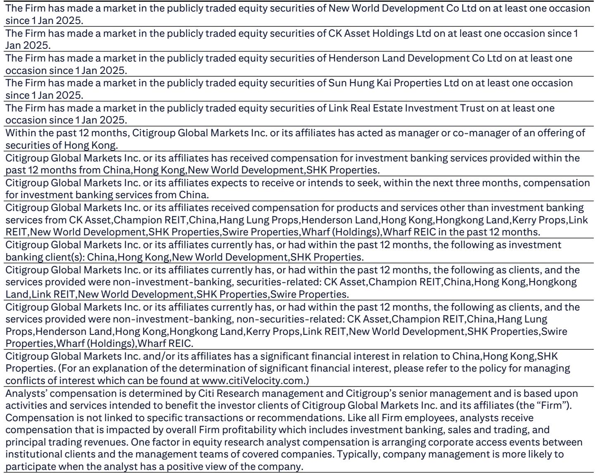
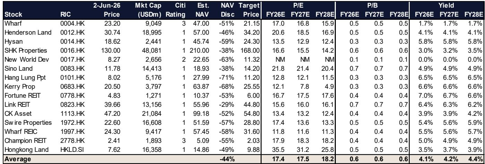
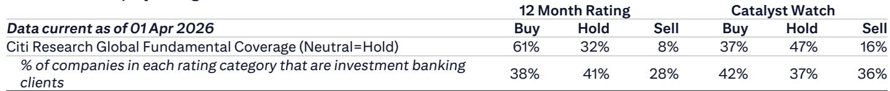

# Hong Kong Retail Is Not Recovering Uniformly — The Divergence Between Luxury and Necessity Is Reshaping Real Estate Strategy

Hong Kong's April 2026 retail sales grew 8.6% year-on-year. On the surface, this is a continuation of the recovery that began in late 2025, following a year of contraction. But the headline number conceals a structural shift that matters more for investors than the aggregate growth rate. The luxury segment, which had been the primary driver of the rebound, is decelerating. Supermarkets, long considered a lagging indicator of consumer stress, are finally stabilizing. And online retail, now accounting for 10% of total sales, has become too large to ignore as a channel dynamic rather than a mere trend.

This is not a story about whether Hong Kong retail is recovering. It is a story about which parts of the retail ecosystem are recovering, which are not, and what that means for the landlords, REITs, and developers whose fortunes are tied to physical space. The answer has direct implications for portfolio allocation across Hong Kong property stocks, and it forces a reconsideration of how to value real estate assets in a market where tenant mix is becoming the primary driver of rent stability.

The timing matters. May 2026 data will benefit from Golden Week tourism, with visitor arrivals up 8% year-on-year and mainland Chinese visitors up 10%. But the comparable base becomes significantly harder from late May onward, as the recovery in market sentiment that began in mid-2025 starts to compound. Sequential deceleration in year-on-year growth is almost certain. The question is whether the market has already priced that in, or whether the coming months will reveal a deeper structural slowdown that current valuations do not reflect.

Investors face a choice between two narratives. One says that Hong Kong retail is normalizing after a volatile period, and that stabilization in non-discretionary spending will support rents across the board. The other says that luxury spending is peaking, that the weaker Hong Kong dollar against the renminbi has already been absorbed into prices, and that the real story is the bifurcation between resilient necessity retail and vulnerable discretionary spending. The data supports the second narrative more than the first.

## The Deceleration in Luxury Spending Is Not a Blip — It Signals a Shift in Consumer Behavior and Base-Effect Dynamics

April 2026 luxury retail sales, proxied by jewelry, watches, and valuable gifts, grew 20% year-on-year. That is a strong number by any historical standard. But it represents a clear deceleration from the 28% growth recorded in the first quarter of 2026 and the 31% surge in January. The pattern is unmistakable: luxury spending is losing momentum even as the overall retail market remains positive.

The immediate explanation is a fading favorable base effect. The comparable period in 2025 was already showing recovery, so the year-on-year comparison is becoming less flattering. But that is only part of the story. Lower gold prices, which had been a tailwind for jewelry sales earlier in the year, are no longer providing the same boost. And the weaker Hong Kong dollar against the renminbi, which has depreciated 4% in the first five months of 2026, is a double-edged sword. It makes Hong Kong more attractive for mainland Chinese tourists, but it also means that the purchasing power of those tourists, when converted back to renminbi, is less impactful on a per-transaction basis.

The more significant implication is for retail landlords with heavy exposure to luxury tenants. The worry among investors has been that same-store sales growth for luxury brands will decelerate into the second half of 2026 as the base becomes even harder. That concern has already been a primary cause behind share price corrections for developers and REITs with luxury-heavy portfolios. The April data confirms that the deceleration is real, not merely a fear. For landlords such as Hang Lung Properties, whose 6.5% dividend yield has started to attract yield-seeking investors, the question is whether that yield is sustainable if luxury tenant sales continue to soften. Similarly, Wharf REIC's tenant sales at Harbour City have outperformed the broader market, but some investors flag reversion risk given company guidance. The divergence between current performance and forward expectations is where the real analytical challenge lies.

## Supermarket Stabilization Is the Most Underappreciated Signal in the Data — It Suggests That Non-Discretionary Rent Has Found a Floor

Supermarket sales grew 3% year-on-year in April, compared to 2% in the first quarter and essentially flat growth in the preceding months. This is not a dramatic acceleration, but it is a meaningful stabilization. After a prolonged period of weakness during which supermarkets were caught between rising costs and price-sensitive consumers, the category is showing signs of a floor.

The stabilization is partly supported by increased promotional activity from operators, which suggests that the pricing environment is becoming more rational rather than more destructive. When operators can afford to promote without destroying margins, it indicates that demand is firm enough to support volume growth even at discounted prices. That is a healthier dynamic than the deflationary spiral that characterized the supermarket segment in 2024 and early 2025.

For retail landlords, this is the most important data point in the entire report. Spot rent for non-discretionary retail space has begun to stabilize, and that stabilization is directly linked to sales stabilization in categories like supermarkets. If supermarket sales were still declining, landlords would face continuing pressure to offer rent concessions to keep anchor tenants in place. With stabilization, the bargaining power shifts slightly back toward landlords. This is why Link REIT, which has significant exposure to non-discretionary retail and supermarket tenants, has been upgraded to Buy. The pivot to a divestment-and-buyback model at Link is a strategic response to this environment, but it only works if the underlying rental income is stable.

The broader implication is that the Hong Kong retail property market is bifurcating. Luxury retail space, which commands the highest rents, faces the greatest risk of deceleration. Non-discretionary retail space, which has lower rents but higher occupancy stability, is becoming more attractive on a risk-adjusted basis. Investors who treat all retail exposure as a single asset class are missing this divergence.

## Online Retail Has Reached a Tipping Point — 10% Market Share Changes How Physical Space Should Be Valued

Online retail sales grew 31% year-on-year in April and now account for 10% of total retail sales value. This is not a new trend, but the scale has crossed a threshold that demands a reassessment of physical retail assets. When online penetration was 7% or 8%, it could be dismissed as a marginal channel. At 10%, it is a structural feature of the market.

The growth is being driven by shifted purchasing habits that appear to be permanent. The pandemic accelerated e-commerce adoption, but the sustained double-digit growth rates in 2025 and 2026 suggest that consumers have not reverted to pre-pandemic behavior. This has direct implications for how landlords should think about tenant mix, lease structures, and the role of physical stores.

For luxury retail, the threat from online is less direct, because high-end consumers still value the in-store experience. But for categories such as electronics, clothing, and even groceries, the shift to online is eroding foot traffic and reducing the need for physical square footage. Landlords who are not actively managing their tenant mix to reflect this reality will find themselves with vacant space and falling rents.

The 10% threshold also matters for valuation. When online penetration is below 10%, the impact on physical rents is still debatable. Above 10%, the historical correlation between retail sales growth and rent growth breaks down. Investors who continue to use historical rent growth as a proxy for future returns are likely to be disappointed. The value of physical retail space is no longer determined solely by total retail sales, but by the proportion of those sales that flow through physical stores.

## What the Report Does Not Fully Answer — The Interaction Between Currency, Tourism, and Structural Spending Shifts Remains an Open Question

The report identifies the weaker Hong Kong dollar against the renminbi as a tailwind for retail, noting a 4% depreciation in the first five months of 2026. The historical correlation between the exchange rate and retail sales is well established, and the current environment should, in theory, support continued growth in visitor spending.

But the correlation may be weakening. The 4% depreciation is significant, but it has not translated into a proportional acceleration in luxury spending, which is the category most sensitive to currency-driven tourism. This suggests that other factors, such as changing consumer preferences in mainland China, domestic competition, and the normalization of cross-border travel, are offsetting the currency benefit. Investors cannot assume that a weaker Hong Kong dollar will automatically boost retail sales, because the marginal impact of currency is diminishing as other variables become more dominant.

Similarly, the Golden Week tourism data shows 8% growth in visitor arrivals and 10% growth in mainland Chinese visitors, but the report does not break down spending per visitor. If arrival growth is being driven by lower-spending tourists, the impact on retail sales will be less than the headline numbers suggest. The May retail sales estimate of 5-8% year-on-year growth is reasonable, but it leaves open the question of whether the quality of tourism is deteriorating even as the quantity improves.

The report also does not fully address the implications of the shift toward online retail for property valuations. If online penetration continues to rise, the net absorption of physical retail space will decline, putting downward pressure on rents across the board. But the timing and magnitude of that impact are uncertain. Investors need to develop their own scenarios for how quickly online penetration will grow and what that means for different categories of retail real estate.

## A Decision Framework for Investors — How to Position Across Hong Kong Property Based on Retail Exposure and Rent Stability

The data from this report supports a clear decision framework for investors in Hong Kong property stocks. The framework has three dimensions: exposure to luxury versus non-discretionary retail, the stability of spot rents, and the ability to adapt to the online shift.

First, investors should favor landlords with significant exposure to non-discretionary retail and supermarket tenants, where rent stabilization is most evident. Link REIT fits this profile, and the upgrade to Buy reflects this logic. The divestment-and-buyback model at Link is a strategic response to the current environment, but it only works if the underlying rental income is stable. The supermarket stabilization data provides confidence that the income is indeed stabilizing.

Second, investors should be cautious about pure-play luxury retail landlords, where the deceleration in same-store sales growth is likely to continue into the second half of 2026. Hang Lung Properties and Wharf REIC offer attractive dividend yields, but those yields may be at risk if tenant sales continue to soften. The 6.5% yield at Hang Lung may look appealing, but it is also a signal that the market is pricing in risk. Investors need to decide whether that risk is adequately compensated.

Third, investors should consider developers and landlords that have the balance sheet flexibility to adapt to the structural shift toward online retail. This includes companies that can repurpose retail space, invest in omnichannel capabilities, or pivot to mixed-use developments that reduce reliance on pure retail income. Sun Hung Kai Properties, CK Asset Holdings, and Swire Properties are among the top picks in the sector, and their diversified business models provide some insulation from the retail-specific risks identified in this report.

Fourth, investors should monitor the currency and tourism data closely, but should not assume that the historical correlations will hold. The relationship between the Hong Kong dollar, renminbi, and retail sales is becoming more complex, and the marginal impact of currency depreciation is declining. Investors who rely solely on currency-driven tourism as a thesis for retail recovery are taking on more risk than they may realize.

The framework is not static. The May retail sales data, which will be released in the coming weeks, will provide the next test. If the sequential deceleration is sharper than the 5-8% estimate, the luxury deceleration narrative will be confirmed, and the case for non-discretionary retail exposure will strengthen. If the data surprises to the upside, the luxury recovery may have more room to run. Either way, the divergence between luxury and necessity is the central theme, and the framework provides a way to position for both outcomes.

Join the community to read the full report and review the original charts.

*This article is for learning and discussion only and does not constitute investment advice.*

Personal reading notes and learning share only. Not investment advice.

