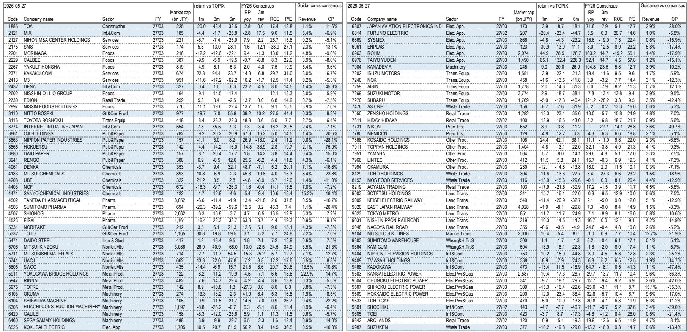
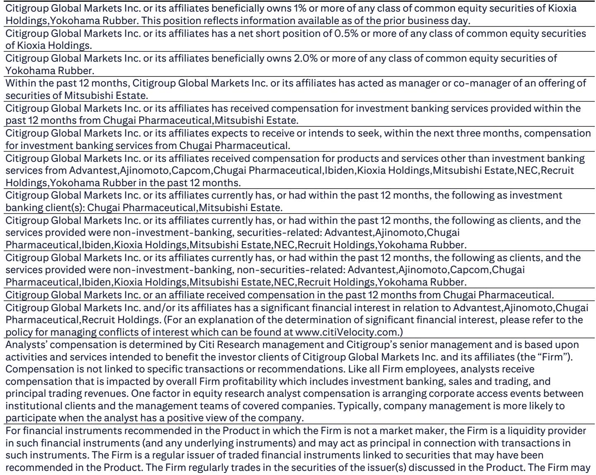
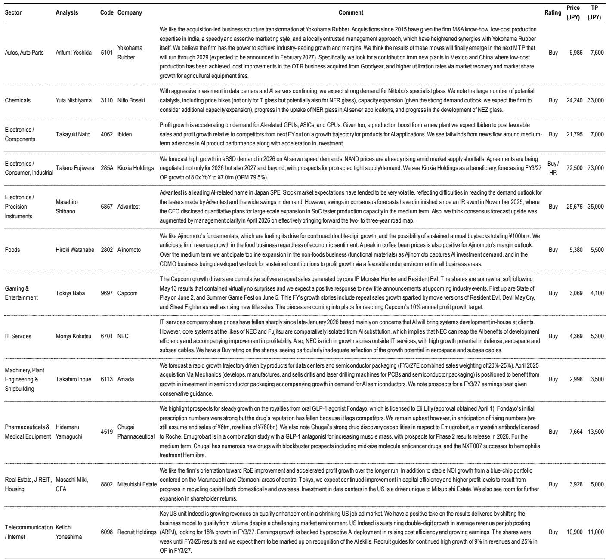

# 日经年底突破70000点：市场低估的不是需求，而是日本企业定价权的结构性转折

过去一个月，日本股市在短期调整中保持了韧性。日经225与TOPIX先后创下年内新高。但真正值得关注的，不是指数还能涨多少，而是支撑这一轮上涨的底层逻辑正在发生变化。

某外资投行最新发布的日本权益策略报告，给出了一个看似矛盾但逻辑自洽的判断：短期见顶，年底前日经225将突破70000点。这并非简单的看多口号，而是一个基于企业盈利韧性、估值重构和资金流向的结构性叙事。报告的核心主张是：市场尚未充分定价日本企业从“通缩生存模式”向“通胀定价模式”转换过程中，ROE中枢上移对估值的系统性拉动。

这不是一个关于周期复苏的故事。这是一个关于企业行为范式转移的故事。

## 1. 企业盈利指引的“保守”本身就是乐观信号

每年财报季，市场习惯性地将公司指引与共识预期之间的差距解读为“低于预期”或“高于预期”。但这份报告提供了一个更精细的观察框架：指引的“保守程度”本身就是一个关键信号。

数据显示，在FY2026（截至2027年3月）的公司计划中，TOPIX成分股营收增长目标为4.2%，净利润增长目标为7.6%。这些数字乍看并不惊艳。但放在当前宏观背景下——中东局势不确定、成本广泛上升——这样的指引实际上相当强劲。

更关键的发现藏在细节里。公司计划与共识预期之间的差距，无论是营收、营业利润还是净利润，都处于历史平均水平附近。这意味着，在高度不确定的宏观环境下，企业并没有采取比以往更保守的指引策略。这本身就暗示企业管理层对自身盈利能力的信心。

报告还揭示了一个重要结构：62%的公司营收指引超过了此前市场共识。这组数据直接指向一个判断——日本企业正在系统性地将成本上涨转嫁给下游客户。这不是个别行业的定价行为，而是覆盖食品、材料、机械、零售等多个部门的广泛现象。

所以问题不再是“日本企业能不能涨价”，而是“涨价能持续多久、能覆盖多少成本”。报告的分析暗示，市场可能低估了这种定价权对整体盈利的支撑力度。

## 2. 科技股的盈利贡献被高估，但非科技股的潜力被低估

市场对日本股市的关注点往往集中在科技和半导体板块。这可以理解，全球AI和半导体景气周期确实为相关公司带来了强劲的盈利增长。但报告提供的数据揭示了一个更均衡的图景。

从净利润增长的行业分解来看，FY2026（实际业绩）到FY2027（计划）的增量中，电气与精密仪器（包括半导体相关）贡献了约6.6万亿日元的增长，这确实是最主要的驱动因素。但与此同时，IT与服务、银行、批发贸易、零售等多个行业也贡献了可观的正增长。制造业整体的净利润增长计划高达19.5%，远高于非制造业的0.7%。

这意味着，日本股市的盈利韧性并非单点支撑，而是多点开花。科技股是发动机，但非科技板块也在提供动力。

报告进一步指出，如果中东局势不确定性下降，资金可能从集中的科技动量股扩散到其他滞后的动量板块——建筑、房地产、金融、国防、能源。而汽车板块，尽管因供应链瓶颈持续跑输，也具备短期反弹的实质空间。这提示读者：当前市场对日本股市的认知可能过于聚焦于科技主线，而忽略了更广泛的盈利改善正在发生。

## 3. 估值扩张的核心驱动力不是流动性，而是ROE的结构性改善

TOPIX当前12个月前瞻市盈率约为16.8倍，处于过去十多年区间的上沿。按照传统框架，这个估值水平意味着“不便宜”。但报告提出了一个更具说服力的视角：估值扩张的逻辑不是“更贵的盈利”，而是“更好的盈利”。

核心变量是ROE。日本企业的平均ROE长期低于全球主要市场，这也是日本股市长期被低估的根本原因之一。但这一格局正在发生系统性变化。报告指出，随着通胀环境下企业定价能力的改善、资本效率提升以及低ROE公司的逐步出清，TOPIX的ROE有望向11%-12%的区间靠拢。在此假设下，17.5倍的目标市盈率是合理的，对应的TOPIX目标价为4500点。

这一判断的支撑来自三个结构性的、而非周期性的因素：

第一，全球金融条件依然宽松，流动性环境对权益资产友好。第二，日本股市本身正在经历“可投资性”的提升——低于资本成本的低ROE公司数量在减少，市场整体质量在改善。第三，基于收益率差（yield spread）的估值指标显示，日本股票相对于全球其他市场仍然被低估，这会持续吸引海外资金流入。

所以，16.8倍的市盈率不是估值天花板，而是ROE改善过程中的一个中间站。市场真正需要回答的问题是：ROE改善的可持续性有多强？报告给出了积极判断，但这一判断仍需要未来几个季度的实际业绩来验证。

## 4. “利率上升”在日本不是风险，除非触碰到一条红线

5月中下旬，日本长期利率显著上升，高估值科技股出现抛售，市场一度担心“利率上升=股市下跌”的逻辑会在日本重演。但报告给出了一个重要的分析框架：不是所有利率上升都对股市不利。

关键在于区分“名义利率上升”和“实际利率上升”，以及利率上升的驱动因素。报告认为，在日本当前的经济结构下，出现“坏利率上升”（bad rate rise）的可能性较低。原因有三：日本股市中价值股权重较高，对利率上升的敏感度不同；日本经济本身长期具有通缩倾向，利率上升的空间天然受限；日本央行仍处于宽松倾向之中。

但报告也划出了一条需要警惕的红线：如果财政恶化担忧加剧，导致实际利率驱动的长期利率上升，并接近或超过潜在增长率，那么“坏利率上升”就可能成为现实。这一风险目前处于“需要关注但非基准情景”的层级。

这意味着，对于日本股市的投资者而言，真正需要监控的不是日本央行的政策会议，而是日本财政纪律的市场定价。这比大多数市场参与者想象的要重要得多。

## 5. 报告尚未完全回答的关键问题：动量市场的可持续性与轮动节奏

报告将“动量市场延续”作为基准情景，并预期在通胀压力和原油价格相对坚挺的背景下，具备独立增长因子（主题股、重组股、通胀受益股）的股票将继续跑赢。这是一个清晰的判断，但报告中隐含的几个关键假设尚未得到充分验证。

第一个未解问题是：动量股的“集中度”何时会达到临界点？当前资金高度集中于科技动量股，如果中东局势缓和不达预期，或者AI景气周期出现边际放缓，资金的扩散效应可能比报告预期的更慢。报告本身也承认，这种扩散取决于地缘政治风险的下降，而这一变量高度不确定。

第二个未解问题是：汽车等滞后板块的反弹空间是否真实？报告认为汽车板块因瓶颈问题持续跑输，具备短期反弹空间。但这一判断的前提是供应链瓶颈得到实质性缓解。从当前全球供应链的恢复节奏来看，这一假设仍面临挑战。

第三个关键问题是：ROE改善的持续性如何量化？报告给出了11%-12%的ROE目标区间，但这一目标高度依赖企业能将成本转嫁持续多久。随着通胀逐步回落，定价权的时间窗口可能比市场预期的更窄。报告没有对这一风险做充分的情景分析。

这些未解问题，恰恰是深入理解日本股市结构性转折的关键。它们不是报告的缺陷，而是报告为读者留下的思考空间——真正有价值的投资判断，往往就藏在这些需要进一步验证的假设里。

---

如果你对上述问题感兴趣，欢迎来我们的知识星球微信群继续讨论。我们会围绕这份报告的核心逻辑，结合更多行业数据，持续跟踪日本企业定价权、ROE改善和资金流向的变化，并在群内分享更详细的图表分析与情景推演。

Personal reading notes and learning share only. Not investment advice.

