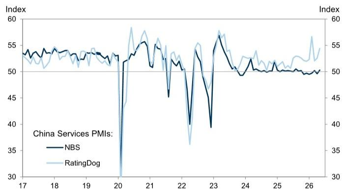

# China's Services PMI Surge Signals a Narrowing Recovery That Investors Cannot Afford to Ignore

The headline number is unambiguous: China's unofficial services PMI jumped to 54.4 in May from 52.6 in April, handily beating both the consensus forecast of 52.2 and the most optimistic sell-side estimate of 52.8. But for serious investors, the real story is not that services activity accelerated—it is that this acceleration reveals an increasingly lopsided recovery where pricing power remains elusive, employment is barely stabilizing, and the gap between domestic demand and external headwinds is widening. The data points to a services sector that is running faster but not running stronger, and the strategic question is whether this pace is sustainable without a broader reflation of corporate margins.

What makes the May print particularly noteworthy is the breadth of the improvement beneath the surface. The new business index rose to 53.3, the employment sub-index crossed back above the 50 boom-bust threshold to 50.4, and the outstanding business index climbed to 51.8. Even the new export orders sub-index, which had been contracting in April at 49.7, rebounded to 51.5. On the surface, this looks like a textbook broadening of the recovery. But when you examine the price data, a more concerning picture emerges: input prices rose to 52.0 while output prices barely budged to 49.9, still in contraction territory. This is the signature of a sector absorbing cost increases rather than passing them through.

The strategic implication is clear: China's services recovery is volume-driven, not pricing-driven. And volume-driven recoveries, while welcome, create fragile corporate fundamentals that can deteriorate quickly if demand softens even modestly.

## The divergence between input costs and output prices reveals a profit margin squeeze that is structural, not cyclical

The most important single insight from the May PMI release is the persistent gap between input and output price indices. Input prices rose to 52.0 from 51.1, while output prices edged up to only 49.9 from 49.7. This means service providers are facing higher costs for fuel, procurement, and labor, yet they are unable or unwilling to raise their selling prices. The surveyed companies explicitly attributed the cost increases to rising oil and fuel prices, higher procurement costs, and increased wages and other labor expenses. But they held charges broadly unchanged.

This is not a temporary phenomenon. The output price index has now been below 50 for multiple months, indicating that deflationary pressure in services pricing is persistent. For investors, this raises a critical question: if service companies cannot pass through cost increases in a recovery phase, what happens when demand inevitably slows? The answer is that margins will compress further, and companies with weaker balance sheets will face a choice between accepting lower profitability or cutting costs—which typically means reducing headcount or investment.

The employment sub-index at 50.4, while technically in expansion territory, is barely above the neutral line. This is consistent with a sector that is hiring cautiously because pricing power is absent. Companies are adding workers only when absolutely necessary, because they cannot be confident that the revenue from those new hires will cover the associated costs. For a recovery to be self-sustaining, employment needs to grow at a pace that generates rising household incomes and, in turn, supports consumption. The current employment reading does not provide that confidence.

## The rebound in new export orders is encouraging but masks a structural realignment of China's services trade

The new export orders sub-index rising to 51.5 from 49.7 is the most positive surprise in the May data. It suggests that foreign demand for Chinese services—which can include everything from tourism and logistics to software development and business process outsourcing—is recovering after a contractionary April. However, investors should be cautious about extrapolating this improvement into a sustained trend.

China's services export sector is undergoing a structural transformation that the PMI data alone cannot capture. The traditional drivers of services exports—inbound tourism and cross-border education—remain well below pre-pandemic levels. The growth in services exports is increasingly coming from digital services, including software exports, gaming, and platform-based services. These are higher-margin activities, but they are also more volatile and more exposed to geopolitical risks, including technology export controls and data localization requirements.

The May improvement in export orders may reflect a temporary catch-up effect after a weak April, or it may signal a genuine improvement in global demand for Chinese digital services. The data does not allow us to distinguish between these two possibilities. What we can say is that the composition of services exports is shifting in ways that make the aggregate PMI less informative than it used to be. Investors need to look beneath the headline to understand which sub-sectors are driving the export recovery and whether those sub-sectors have sustainable competitive advantages.

## The concurrent rise in both official and unofficial services PMIs confirms the recovery is real, but the official index lags for structural reasons

The May data shows that both the National Bureau of Statistics (NBS) services PMI and the RatingDog (formerly Caixin) services PMI rose in tandem. This convergence is important because the two surveys have different coverage: the NBS index tends to capture larger, state-owned enterprises, while the RatingDog index has a greater weighting toward smaller, private-sector service companies. When both indices move in the same direction, it suggests the recovery is broad-based across enterprise types.

However, the levels of the two indices often diverge, and the historical chart shows that the RatingDog index has been consistently higher than the NBS index in recent years. This is not a measurement error—it reflects the fact that private-sector service companies, which are more exposed to consumer demand and less reliant on government spending, have been growing faster than the state-dominated segments of the services economy. The gap between the two indices is itself a signal: when the gap widens, it suggests that private-sector dynamism is outpacing the state sector; when the gap narrows, it suggests the opposite.

In May, both indices rose, but the RatingDog index remains notably higher. This implies that the private-sector services recovery is leading, which is positive for overall economic dynamism but also creates a risk: if government policy shifts toward greater state intervention or if regulatory uncertainty returns, the private-sector-driven recovery could stall more quickly than an official-sector-driven one.

## What the report does not fully answer: the sustainability of the employment improvement and the trajectory of consumer confidence

The May PMI provides a snapshot of activity, but it does not answer the two questions that matter most for the medium-term outlook. First, is the improvement in the employment sub-index sustainable? At 50.4, the index is barely in expansion territory, and history shows that employment in services is often a lagging indicator. Companies may be hiring to meet current demand, but if the cost-price squeeze persists, those same companies may reverse course quickly. The PMI does not capture the quality of employment—whether new hires are full-time or part-time, permanent or temporary—which matters for income stability and consumption.

Second, the PMI does not directly measure consumer confidence or household spending intentions. The improvement in new business and new export orders suggests that demand is picking up, but we do not know whether this demand is coming from pent-up savings, government stimulus, or genuine income growth. Each source has different implications for sustainability. Pent-up demand tends to fade after a few months. Government stimulus can be withdrawn. Income growth is the most durable driver, but it requires sustained employment gains and rising wages—neither of which the current data convincingly demonstrates.

Investors should watch for supplementary data on retail sales, household savings rates, and consumer confidence indices to triangulate the PMI signal. Until those data points confirm that the demand improvement is income-driven rather than inventory-driven or policy-driven, caution is warranted.

## A decision framework for investors: how to position for a volume-driven, margin-constrained services recovery

For portfolio construction, the May services PMI suggests a clear but nuanced strategic direction. The core insight is that the recovery is real but fragile, and the fragility comes from the absence of pricing power. This has direct implications for sector allocation and risk management.

First, favor companies with structural pricing power or cost advantages. In a volume-driven recovery where margins are under pressure, the winners will be companies that can either maintain margins through superior cost management or that operate in segments where pricing is less elastic. This includes platform-based service companies with network effects that reduce marginal costs, logistics companies with scale advantages, and specialized business services where switching costs are high. Avoid companies in commoditized service segments where competition is primarily on price.

Second, overweight domestic-demand-exposed services relative to export-oriented services. The improvement in export orders is welcome, but it is more volatile and more exposed to external risks including trade policy and currency fluctuations. Domestic services, particularly those tied to consumption and healthcare, have more predictable demand drivers and are more likely to benefit from any fiscal or monetary policy support.

Third, maintain a barbell approach to duration and leverage. Companies with strong balance sheets and low leverage can weather the margin squeeze and may emerge stronger when pricing power eventually returns. Companies with high leverage and thin margins are at risk of distress if the recovery stalls. The PMI data supports a preference for quality and financial resilience over cyclical beta.

Fourth, watch the output price index as a leading indicator. If the output price index rises above 50 in the coming months, it would signal that pricing power is returning and that the recovery is becoming self-sustaining. That would be the clearest signal to increase exposure to more cyclical service sectors. Until then, the prudent strategy is to remain selective and focused on companies with demonstrated ability to protect margins.

## The unresolved analytical questions that make the full report essential reading

The May services PMI raises more questions than it answers. Is the employment improvement real or a statistical artifact of a low base? Will the export orders rebound continue, or is it a one-off adjustment? How much of the new business growth is driven by genuine demand versus pre-ordering ahead of potential price increases or policy changes? What is the trajectory of input costs, and will the recent stabilization in oil prices provide relief in the months ahead?

These are not academic questions. They have direct implications for earnings forecasts, valuation multiples, and asset allocation. The PMI data provides the starting point for analysis, but it is not sufficient for investment decisions. The full report from the global investment bank that produced this analysis includes detailed sub-sector breakdowns, historical comparisons, and scenario analysis that can help investors answer these questions.

Join the community to read the full report and review the original charts.

*This article is for learning and discussion only and does not constitute investment advice.*

Personal reading notes and learning share only. Not investment advice.

