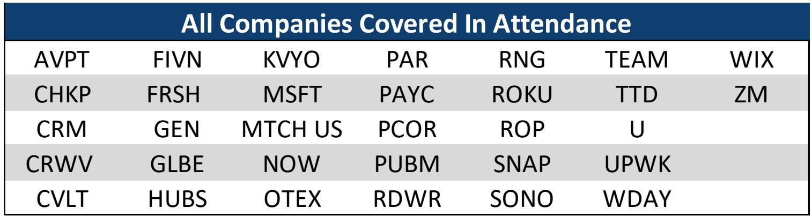
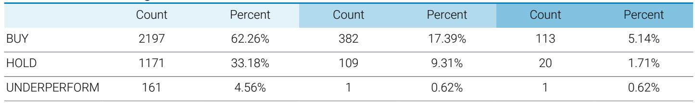

# The AI Infrastructure Buildout Is Real, But The Application Layer Has Not Yet Been Rewarded

The market is currently pricing a single story: that the hyperscaler data center buildout is durable and that the companies providing the picks and shovels for artificial intelligence will compound for years. This narrative is correct on the infrastructure side, but it is dangerously incomplete when applied to the software application layer. The divergence between these two segments is not just a sector rotation signal. It is a structural statement about where value is being created today versus where it will be captured tomorrow.

A recent industry conference hosted by a leading investment bank crystallized this divide. The conversations with public companies, private firms, venture capitalists, and industry experts all converged on the same observation: the winners of this cycle are those riding the "token path," meaning the companies whose revenue scales directly with the volume of AI inference queries. Data center operators, cloud infrastructure providers, and cybersecurity platforms serving the AI workload are seeing accelerating demand. Meanwhile, most enterprise application companies remain stuck in a pricing and product pivot that has not yet resolved.

This asymmetry matters because it forces a difficult strategic question for investors and operators alike. Is the application layer simply lagging, or is it structurally disadvantaged in an AI-first world? The conference evidence suggests the answer is more nuanced than either extreme. A handful of application companies are demonstrating that vertical depth, proprietary data moats, and AI-native product redesigns can still command premium growth. But the majority are still searching for a model that works. The next twelve months will separate the companies that successfully rebuilt their go-to-market and product architecture from those that merely added AI features to legacy stacks.

The following sections unpack the key arguments from the conference, identify the unresolved questions that will define the next phase of the cycle, and provide a decision framework for readers navigating this uneven landscape.

## The Infrastructure Layer Has A Multi-Year Visibility Backlog That Justifies Premium Valuations

The most straightforward conclusion from the conference is that the hyperscaler data center buildout has genuine multi-year visibility. A construction expert on site noted that the data center backlog is strong through 2027, and that the constraint is not demand but physical plant and equipment availability. This is not speculative capacity being built on hope. It is powered shell space being leased and filled before the concrete is dry.

A key example came from CoreWeave, a pure-play AI infrastructure provider. Management indicated that the majority of demand is now for inference workloads, not training. This is a critical distinction. Training demand can be lumpy and project-driven. Inference demand is recurring, usage-based, and tied to actual end-user adoption of AI applications. When CoreWeave reports that customers are seeing massive returns on AI projects, and that this is driving rising prices for H100s, A100s, and L40s, it signals that the infrastructure spending is not a capex bubble. It is a response to real downstream consumption.

CoreWeave also shared that its first self-built data center will come online in the next few quarters, with another in 2027. The company expects self-built facilities to represent a growing share of its portfolio because they provide operational and strategic control. This is a telling detail. It suggests that the most sophisticated infrastructure players are moving beyond simply leasing capacity from third parties. They are integrating backward into physical asset ownership to capture the margin and reliability benefits.

The financial mechanics of this business model are also becoming clearer. CoreWeave effectively locks in both revenue and a large portion of its cost structure at contract signing. It issues purchase orders for infrastructure and secures data center leases simultaneously with customer contracts. This creates highly predictable contribution margins once capacity is deployed. The company expects EBIT margins to reach low double digits by the end of 2026 as revenue ramps. Three new business lines, networking, CPU, and software, are each on track to exceed $100 million in annual recurring revenue by year-end 2026.

The so-what for investors is that the infrastructure thesis is not just about growth. It is about margin expansion and capital efficiency improvement. CoreWeave has reduced its weighted average cost of capital by approximately 600 basis points over the past few years and now holds an A- rating for investment-grade customer facilities. This narrowing cost of capital differential versus hyperscalers is a structural advantage that compounds over time.

## Cybersecurity and Observability Are The Uncontested Beneficiaries Of Agentic AI Workloads

If infrastructure is the foundation, cybersecurity and observability are the non-negotiable overhead that scales with every new AI workload. The conference made clear that the security implications of agent-driven architectures are only beginning to be understood, and that this creates a durable tailwind for companies in this space.

An expert hosted from Aviatrix, a cloud networking and security firm, delivered a sobering assessment. The agent-driven attack vector is real and underpriced. Many of the recent security breaches over the past five to six months have occurred via large language model-enabled credentialing. This represents a step-change in threat complexity. It is not simply that attackers have a new tool. It is that the attack surface itself has expanded in ways that traditional perimeter-based security cannot address.

The expert also noted that hyperscaler native tooling has meaningful gaps. Weak networking constructs and permissive default agent architecture create opportunities for third-party security vendors. This is not a temporary arbitrage. It is a structural feature of how cloud platforms are designed. The hyperscalers prioritize speed of deployment and ease of use. Security is often bolted on afterward. That pattern benefits specialized vendors who can offer deep integration and policy control.

The most important implication, however, is about budget behavior. As breaches become inevitable and undetectable at the point of entry, security spending shifts from prevention to containment and segmentation. This is a different budget category with different vendors and different margin profiles. Companies that can help enterprises contain a breach once it has occurred, rather than simply block it at the door, are likely to see incremental budget allocations that did not exist before.

On the observability side, the thesis is simpler but no less powerful. The surge in frontier AI model use increases the need for monitoring, logging, and debugging tools. Every inference call is a transaction that needs to be observed. Every agent workflow is a distributed system that can fail in unpredictable ways. Companies like Datadog, which were already benefiting from cloud complexity, now have an additional layer of demand driven by AI operations.

## Enterprise Application Companies Face An Existential Pricing And Product Pivot That Has Not Yet Resolved

The contrast between infrastructure and applications was the most striking theme of the conference. While infrastructure companies are enjoying clear demand signals and expanding margins, most enterprise application companies remain in what one participant described as a "tough spot." The unanswered questions are fundamental. How should AI features be priced? Should they be bundled into existing subscriptions or sold as premium add-ons? Do AI-native features cannibalize existing revenue or expand total addressable market?

The conference revealed that even the most optimistic application companies are still experimenting with pricing models. ServiceNow, for example, is seeing early success with credit-related monetization. When large customers exceed the credits included in their contracts, ServiceNow negotiates an early renewal that increases total contract value rather than charging one-time overage fees. This effectively raises the customer's three-year recurring revenue while baking higher credit availability into the base contract. It is clever financial engineering, but it also reveals that the pricing model is still being invented in real time.

The deeper concern is that application companies are structurally disadvantaged in the competition for AI talent. Infrastructure and platform companies can offer engineers the chance to work on frontier problems at massive scale. Application companies often cannot. This talent gap compounds over time. The companies that build the best AI models and the most efficient inference infrastructure will continue to improve their products faster than application companies that are trying to integrate AI as a feature.

There are exceptions, and they are instructive. Vertical software companies that own proprietary data sets and are deeply embedded in customer workflows appear more insulated. Procore, the construction management platform, noted that it is not worried about so-called "vibe coding" solutions because it has yet to see a user-friendly alternative. Half of Procore's customers' total construction volume sits on its platform, creating a data moat that is difficult to replicate. The company also benefits from being a system of record, not just a tool. That stickiness is a powerful defense against AI-driven disruption.

## The Most Interesting Bets Are On Companies That Are Rebuilding Their Product Architecture Around AI, Not Just Adding Features

The conference highlighted a small group of application companies that are taking a more aggressive approach. Instead of layering AI features onto existing products, they are rebuilding the product architecture itself. This is higher risk but potentially higher reward.

Wix is a case study in aggressive repositioning. The company is positioning itself as an AI-first organization and embracing AI across the entire business. Its Harmony product combines vibe coding with drag-and-drop website design, offering what management believes is a structural edge over both traditional competitors like WordPress and pure AI tools that require re-prompting for every change. Wix has built a proprietary large language model that drives inference costs to approximately 5% of third-party models. This cost advantage is durable and widens as usage scales.

The most ambitious bet is Base44, which expands Wix's total addressable market beyond websites into applications, dashboards, and workflow tools. Base44 already holds approximately 40% U.S. share in its category, and usage is surging across complex application builds. Management is investing aggressively in sales and marketing, with a target return on investment of seven to nine months. The trade-off is a near-term free cash flow step-down from approximately $650 million to $400 million in 2026. Management expects to recoup the full cost within roughly two and a half years.

The risk is that the market does not have the patience for this reinvestment cycle. Wix's stock has been pressured by fears that vibe coding commoditizes web building, even though the underlying fundamentals remain healthy. The question is whether the market will reward the long-term TAM expansion or punish the near-term margin compression.

Atlassian offers a different but equally instructive example. The company is executing on a massive enterprise opportunity, with 85% of the Fortune 500 as customers but representing only 10% of revenue from that cohort. The new CFO noted that one of the most surprising findings in his first few months was the diversity of the user base. Contrary to the bear thesis that most of Atlassian's users are developers at risk of displacement by AI, 65% to 77% of core Jira, Confluence, and JSM users are non-developers. This suggests that AI is more likely to expand the user base than contract it.

The most compelling product development is the Teamwork Graph and Teamwork Collection. In a demo at the company's user conference, Claude Code combined with Teamwork Graph produced a 44% higher quality answer using 48% fewer tokens compared to standalone Claude Code. Once customers are on the Teamwork Collection, management noted increased average revenue per user, 10x AI credit usage, and over 1,000 customers with more than 1 million seats. The challenge is that revenue is expected to trough in fiscal 2027 before accelerating in fiscal 2028, due to revenue recognition changes from large deals pulled forward into fiscal 2026.

## What The Report Does Not Fully Answer: The Timing And Magnitude Of Application Layer Monetization

For all the valuable data points the conference produced, it left several critical questions unresolved. The most important is timing. When will the application layer's AI investments translate into measurable revenue acceleration? The infrastructure layer has clear leading indicators, data center backlogs, chip orders, and inference volume growth. The application layer does not yet have comparable signals.

The second unresolved question is about pricing power. Will enterprise customers pay a premium for AI-enhanced software, or will they expect AI features to be included in existing subscription prices? The answer will determine whether application companies can expand margins or will face margin compression as they absorb the cost of AI inference and model development.

The third question is about competitive dynamics. Will the winners in the application layer be incumbent software companies that successfully pivot, or will new entrants built from scratch on AI-native architectures capture disproportionate value? The conference featured both incumbents like ServiceNow and Atlassian and newer platforms like Wix's Base44. The evidence so far suggests that incumbents with data moats and distribution advantages have an edge, but the sample size is still small.

These unanswered questions are not weaknesses of the conference. They are the natural result of a transition that is still in its early innings. The infrastructure buildout is visible and measurable. The application layer transformation is messier, more experimental, and harder to predict. That is precisely why it offers both higher risk and higher potential reward for those who can identify the companies that are executing the pivot correctly.

## A Decision Framework For Navigating The AI Cycle's Uneven Value Creation

For readers trying to translate this analysis into actionable strategy, a simple framework may help. The AI cycle can be divided into three layers, each with different risk-return characteristics and different leading indicators.

Layer one is infrastructure and hardware. The thesis here is straightforward: demand is visible, backlogs are long, and margins are improving. The risk is that the buildout peaks earlier than expected or that capital costs rise. The leading indicators to monitor are data center lease announcements, chip order backlogs, and hyperscaler capex guidance.

Layer two is cybersecurity and observability. This is the most defensible software segment in an AI world because security spending is non-discretionary and scales with every new workload. The risk is that hyperscalers eventually build competitive native solutions. The leading indicators are breach frequency data, security budget surveys, and the pace of agent deployment in enterprise environments.

Layer three is enterprise applications. This is the highest risk and highest potential reward layer. The thesis is that a small number of companies with proprietary data, vertical depth, and AI-native product architectures will emerge as winners. The risk is that most application companies fail to monetize AI effectively and face margin compression. The leading indicators are AI feature adoption rates, pricing model changes, and the ratio of AI-related revenue to total revenue.

The conference evidence suggests that the current market is correctly pricing layer one and layer two but may be underestimating the dispersion of outcomes in layer three. The infrastructure and security winners are relatively easy to identify. The application winners require more conviction and a longer time horizon.

## Join the community to read the full report and review the original charts.

The conference deck contains detailed financial projections, customer adoption metrics, and management commentary that could not be fully captured in this article. For readers who want to examine the original data and form their own conclusions, the full report is available to community members.

*This article is for learning and discussion only and does not constitute investment advice.*

Personal reading notes and learning share only. Not investment advice.

