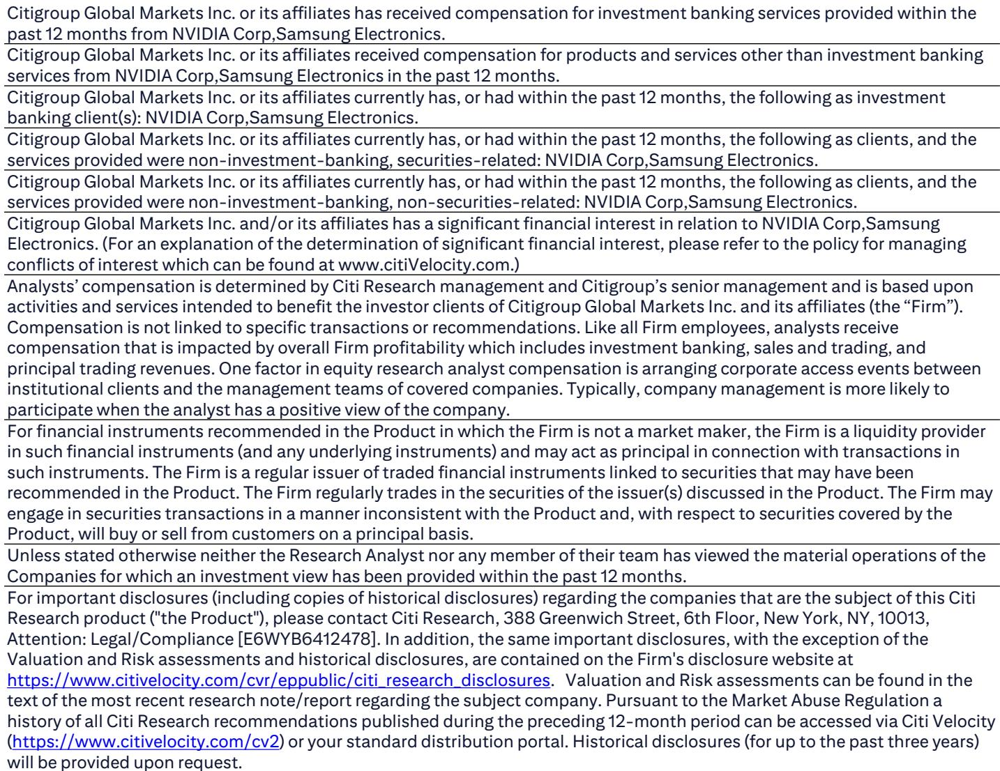
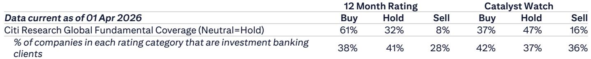
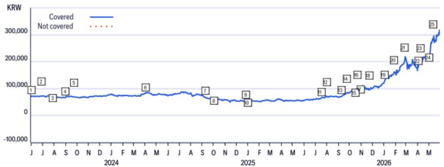

# 个人AI PC正在重塑存储器需求结构，而市场仍在用旧框架定价

Computex 2026 的展台上，英伟达没有发布新的数据中心GPU，却拿出了三款针对“个人”场景的AI硬件：RTX Spark迷你工作站、N1X芯片驱动的AI PC、以及搭载748GB内存的DGX Station桌面电脑。这些产品的共同点不是算力，而是内存容量——RTX Spark的128GB LPDDR5X内存，是传统笔记本电脑平均12GB的10倍以上；DGX Station的748GB总内存，甚至超过了普通服务器的600GB平均内存配置。

某外资投行在Computex后的第一时间发布了研判。这份报告的核心判断值得产业决策者认真对待：AI推理需求正从集中式数据中心向分布式终端扩散，而这一扩散的物理载体，不是算力芯片，而是存储器。市场当前对存储器板块的定价，仍然停留在“数据中心HBM驱动周期”的旧框架中，忽略了个人AI设备带来的结构性增量。

这不是一个简单的“量价齐升”故事。个人AI设备的DRAM含量是传统终端的10倍以上，但更大的变量在于，AI推理从GPU向CPU的扩展，正在创造一个新的服务器内存需求品类——SoCAMM2和服务器DDR5。这两个市场，此前几乎不在主流存储器分析框架的讨论范围内。

## 1. 个人AI终端的DRAM含量跃迁，正在改写存储器需求的基数

传统PC和笔记本电脑的DRAM含量在过去十年里增长缓慢，平均维持在12GB左右。即便是在高端游戏本上，32GB也已经是天花板。但英伟达在Computex上展示的RTX Spark，直接搭载了128GB LPDDR5X内存，是传统PC的10倍以上。

这个数字的意义需要放在一个更大的背景下来理解。RTX Spark的定位是“本地运行大模型和AI代理”，它可以支持高达1200亿参数的大模型在本地推理。这意味着，当AI应用从云端向终端迁移时，终端设备的内存需求不再是线性增长，而是指数级跃迁。

更值得注意的是DGX Station。这款桌面电脑搭载了252GB HBM3e和496GB LPDDR5X，合计748GB内存，可以运行高达1万亿参数的大模型。这个内存配置已经超过了普通服务器的平均水平。换句话说，一台桌面电脑的内存需求，已经追上了服务器。

这意味着什么？如果个人AI设备的渗透率在未来2-3年内达到PC市场的10%-20%，那么全球DRAM需求将出现一个此前未被充分定价的增量。这个增量不是来自数据中心扩建，而是来自每个人桌面上那台“AI工作站”。对于存储器供应商而言，这是一个比数据中心更分散、但总量可能更大的市场。

## 2. AI推理从GPU向CPU的扩散，正在创造新的服务器内存品类

报告中的一个关键信息容易被忽视：英伟达的Vera CPU已经进入全面生产阶段。这颗CPU搭载了88核的定制核心Olympus，LPDDR5X内存子系统带宽高达1.2TB/s。更重要的是，Vera的定位是AI推理场景下的“宿主CPU”，它正在承担一部分原本由GPU完成的推理任务。

这个变化对存储器需求的影响是结构性的。传统上，服务器内存以DDR5为主，而AI服务器的内存需求主要由HBM驱动。但Vera CPU的出现意味着，AI推理工作负载正在向CPU端迁移，这将直接拉动服务器DDR5和SoCAMM2的需求。

报告明确提到，“随着AI推理需求从GPU扩展到CPU，我们预计服务器DDR5和SoCAMM2的需求将进一步增长”。这是一个此前较少被讨论的增量市场。SoCAMM2是一种新的内存模组形态，专为AI推理场景设计，其容量和带宽介于传统DDR5和HBM之间。如果这一趋势成立，那么服务器内存市场的增长逻辑将从“HBM独大”转向“HBM+DDR5+SoCAMM2多轨并行”。

对于韩国存储器厂商而言，这个变化尤为重要。三星电子在DDR5和SoCAMM2领域都有较强的产能布局，而这一增量市场目前尚未被充分反映在估值中。报告对三星电子给出了46万韩元的目标价，基于SOTP估值法，其中存储器部门仅给予7.9倍EV/EBITDA。如果AI CPU驱动的服务器内存需求被市场重新定价，这一估值倍数有上修空间。

## 3. 物理AI的落地，正在拉长存储器结构性增长的时间轴

报告还提到了英伟达发布的Cosmos 3——一个面向物理AI的开放基础模型。这个模型可以理解并生成文本、图像、视频、声音和动作，其核心应用场景是机器人、自动驾驶和边缘计算。

物理AI对存储器的需求与生成式AI不同。生成式AI的核心是“训练”，需要大量的HBM和高速互联；而物理AI的核心是“实时推理”，需要在边缘设备上快速处理多模态数据。这意味着，物理AI对存储器的需求更分散、更持久，且对低延迟、高带宽的要求更高。

Cosmos 3的三个版本中，有一个专门针对边缘推理的“Cosmos 3 Edge”。边缘推理设备的DRAM含量虽然不如数据中心，但其数量级可能是数据中心设备的百倍甚至千倍。如果物理AI在未来3-5年内进入规模化部署阶段，那么存储器需求将获得一个比数据中心更持久的结构性增长动力。

报告将这一趋势概括为“AI内存需求从集中式计算向分布式计算扩展”。这个判断的核心含义是：存储器行业的增长不再依赖于单一的数据中心扩建周期，而是被多个终端场景同时驱动。这意味着，即便数据中心资本开支出现周期性波动，存储器需求的下行风险也会被分散化。

## 4. 报告尚未完全回答的关键问题：需求结构变化如何影响定价权

报告给出了清晰的判断——个人AI和物理AI将拉动DRAM需求的结构性增长——但有一个关键问题仍然悬而未决：需求结构的改变，会如何影响存储器厂商的定价权？

传统上，DRAM是一个周期性极强的行业，定价权取决于供需平衡。当需求主要来自数据中心时，HBM的定价权掌握在供应商手中，因为HBM的产能壁垒极高。但当需求来源变成个人AI设备和边缘推理设备时，情况会变得复杂。这些终端设备对DRAM的规格要求可能不如数据中心严格，但数量巨大。这意味着，DRAM厂商需要同时管理“高端定制化”和“中端规模化”两条产品线，而这两条线的定价逻辑完全不同。

另一个未解的问题是：个人AI设备的渗透率曲线。报告假设了个人AI设备会快速渗透，但这一假设的验证需要时间。如果个人AI设备的用户接受度低于预期，那么DRAM需求的增量可能会延迟。此外，个人AI设备对DRAM的“有效需求”是否真的能转化为“实际采购”，还取决于终端厂商的库存策略和备货节奏。

这些未解问题，恰恰是理解存储器板块未来定价逻辑的关键。如果市场开始对“需求结构变化”进行重新定价，那么存储器厂商的估值框架可能需要从“周期股”转向“成长股”。但这一转向何时发生、以何种方式发生，报告没有给出明确答案。

## 5. 一个实用的观察框架：从三个维度跟踪存储器需求的“结构变化”

基于报告的推断，我们可以建立一个简单的观察框架，帮助跟踪存储器需求的结构性变化是否正在发生。

第一个维度是“个人AI设备的DRAM含量趋势”。关注英伟达、AMD、英特尔等厂商在个人AI设备上的内存配置策略。如果未来12个月内，主流AI PC的平均DRAM含量从12GB提升到32GB以上，那么需求结构变化的信号就得到了初步验证。

第二个维度是“服务器DDR5和SoCAMM2的出货量增速”。如果AI CPU的渗透率提升，服务器DDR5的出货量增速应该会超过数据中心整体资本开支增速。同时，SoCAMM2作为一种新形态，其出货量从零到一的突破本身就是重要信号。

第三个维度是“存储器厂商的资本开支方向”。如果三星电子、SK海力士等厂商开始加大在DDR5和SoCAMM2上的产能投资，而不仅仅是HBM，那么说明产业自身也在押注需求结构的分散化。资本开支的方向，往往比短期财报更能反映产业的长期判断。

这三个维度都不需要复杂的模型，但能帮助决策者区分“周期性波动”和“结构性变化”。在当前的存储器定价中，市场可能仍然将需求增长归因于数据中心周期，而忽略了个人AI和物理AI带来的结构性增量。如果后者的趋势得到验证，那么存储器板块的估值中枢可能面临系统性上修。

---

报告的完整内容还包含了对英伟达和三星电子的详细估值模型、风险因素分析，以及关于AI内存需求从集中式向分布式扩展的深度讨论。这些内容对于理解“需求结构变化”的具体路径和节奏至关重要，但受限于篇幅，本文无法展开。

如果你对以下问题感兴趣——个人AI设备的渗透率假设是否合理？SoCAMM2的产能瓶颈在哪里？物理AI对存储器需求的时间表如何？——欢迎来我们的星球微信群里继续讨论。那里有完整的研报原文、估值模型拆解，以及更多产业一线的交叉验证信息。

Personal reading notes and learning share only. Not investment advice.

