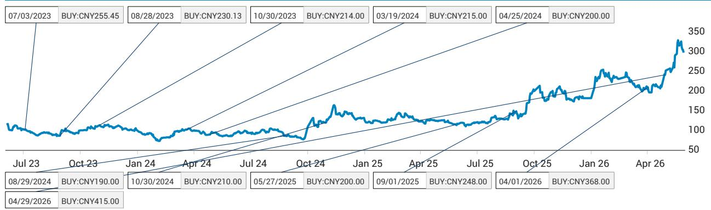
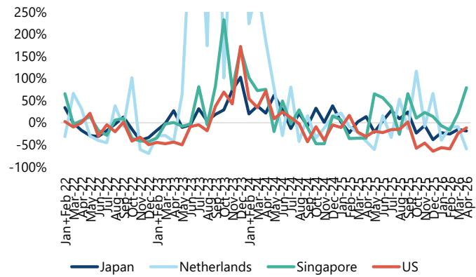
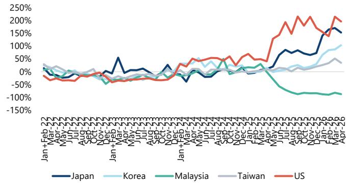

# China's Semiconductor Equipment Imports Are Bottoming, But the Real Story Is a Structural Transformation in Supply Chains

The narrative that China's wafer fabrication equipment (WFE) imports are in a prolonged downturn is only half the story. April data shows WFE imports fell 6% year-on-year, a continued decline that appears to confirm the bear case. But this headline masks a more consequential reality: the composition of those imports is shifting in ways that reveal a strategic pivot, not a retreat. Deposition equipment imports grew 36% and ion implanting rose 20%, while lithography and etching—the two most restricted categories—collapsed by 60% and 28% respectively. This is not random monthly noise. It is the signature of a market that is reconfiguring its spending around what it can reliably source and what it most urgently needs.

The timing matters. For four consecutive months through February, WFE imports had been declining by double digits. The April figure of negative 6% represents a meaningful moderation. More importantly, the broader semiconductor production equipment (SPE) complex—which includes testing and packaging tools—held flat at negative 4% year-on-year, a dramatic improvement from the double-digit contractions of late last year. Testing tool imports surged 21% and packaging tools jumped 42%. One month does not make a trend, but the pattern aligns with a deeper logic: China is preparing for a capacity expansion cycle that will require a different mix of equipment than what drove the previous boom.

The argument here is not that China's equipment procurement is about to snap back to prior highs. Rather, the thesis is that the bottom is forming, and the recovery will be driven by three structural forces that are already visible in the trade data. First, China's semiconductor trade deficit is widening again after years of compression, signalling that domestic production is not keeping pace with consumption. Second, AI-driven demand is creating a pull for advanced packaging and memory capacity that China cannot ignore. Third, forthcoming large memory IPOs will inject capital into a sector that has been starved of funding. Each of these forces independently would matter. Together, they point to a multi-year acceleration in semiconductor capex that will benefit not only domestic Chinese equipment vendors but also Japanese and select US suppliers who can navigate the regulatory landscape.

## The Widening Trade Deficit Is the Most Powerful Leading Indicator for Capex

China's semiconductor trade deficit expanded by 17% in the first four months of 2026, reversing the trend of declining or flat deficits that had persisted since 2021. This is not a marginal shift. It represents a structural rebalancing in which China's consumption of chips is growing faster than its ability to produce them, despite massive investments in domestic fabs. The deficit is being driven by sharply higher memory prices and price increases in CPUs, GPUs, power management ICs, and optical components—all categories where AI demand is creating pricing power for suppliers.

The strategic implication is straightforward: a widening trade deficit creates economic urgency. When a country imports more semiconductors, its leadership faces pressure to close the gap through domestic capacity expansion. This is not a theoretical observation. The historical pattern in China shows that periods of widening trade deficits have been followed by accelerated equipment procurement cycles. The data from 2020 through 2022 demonstrated this relationship clearly, and the current trajectory suggests a repeat.

What makes this cycle different is the constraint layer. China cannot simply order the most advanced lithography tools from the Netherlands and expect delivery. The 60% decline in lithography imports is not a demand problem; it is a supply problem. But the system is adapting. Deposition and ion implant equipment, which are less restricted and more widely available from multiple global suppliers, are seeing robust growth. The market is effectively voting with its wallet for the equipment categories that can be procured and deployed at scale.

## AI Demand and Advanced Packaging Are Reshaping the Equipment Mix in Real Time

The surge in testing and packaging tool imports is the most underappreciated signal in the April data. Packaging tool imports rose 42% year-on-year, and testing tools rose 21%. This coincided with Huawei's announcement of its "Tau" scaling law, which requires chip-to-chip hybrid bonding and through-silicon via (TSV) equipment to implement its "Logic Folding" technology. The coincidence is unlikely to be accidental.

The implications are significant for two reasons. First, advanced packaging is less exposed to the most stringent export controls than front-end lithography. This means China can build capability in this layer even while being blocked from leading-edge process nodes. Second, advanced packaging is becoming a bottleneck for AI chip performance regardless of node. If China can master hybrid bonding and 3D stacking, it can achieve meaningful performance gains without needing EUV lithography. This is not a substitute for node advancement, but it is a viable parallel path.

The equipment mix shift also tells us something about where capacity is being added. Deposition equipment now accounts for 29% of total WFE imports, the largest single category. Etching is 22% and lithography is 21%. This distribution reflects a focus on memory and mature logic, where deposition and etch are critical, rather than leading-edge logic where lithography dominates the cost structure. The message is clear: China is building out capacity in areas where it can compete, not where it is blocked.

## Singapore and Malaysia Are Emerging as Critical Nodes in the New Supply Chain Architecture

The geographic shift in China's equipment sourcing is perhaps the most strategic development in the data. Year-to-date, Singapore is the fastest-growing source of both SPE and WFE imports, with growth of 19% and 43% respectively. Singapore now accounts for 24% of China's total WFE imports, tying with Japan for the number one position and surpassing the Netherlands at 19%. This is a dramatic increase from Singapore's 16% share in 2025.

Malaysia's share has also risen, from 10% in 2025 to 12% year-to-date, though its growth rate has slowed from 113% last year to 16% currently. The slowing growth rate may indicate that the initial surge of rerouting through Malaysia is maturing, while Singapore's role is still expanding. The pattern suggests that multinational equipment vendors are increasingly using Singapore as a regional hub for servicing Chinese customers, potentially as a way to navigate compliance requirements while maintaining market access.

This geographic diversification has second-order implications for the global equipment supply chain. If Singapore and Malaysia become permanent nodes in China's procurement network, the traditional dominance of Japan, the Netherlands, and the US as direct suppliers will be structurally diminished. Equipment vendors with manufacturing or warehousing capacity in Southeast Asia will have a competitive advantage in serving the Chinese market. This is not a short-term workaround. It is a permanent reconfiguration of the supply chain that will outlast any single administration's export control policy.

## What the Report Does Not Fully Answer: The Sustainability of the Recovery and the Localization Rate Question

The data strongly supports the thesis that WFE imports are bottoming and poised for recovery. But several critical questions remain unresolved, and investors should be cautious about extrapolating a linear recovery.

First, the recovery is contingent on the assumption that export controls do not tighten further. The report notes that a recent political visit brought no change to US restrictions, but this is a fragile status quo. The regulatory environment can shift with minimal warning, and any new restrictions on deposition or ion implant equipment would directly undermine the categories that are currently driving growth. The market is pricing in a stable regulatory outlook. That assumption is not guaranteed.

Second, the relationship between China's WFE imports and its actual installed capacity is opaque. Import data measures equipment entering the country, not equipment that is successfully installed, qualified, and producing yield. There is evidence that some imported equipment faces delays in installation due to compliance reviews or supply chain bottlenecks. The gap between import volumes and productive capacity may be wider than the headline numbers suggest.

Third, the localization rate for WFE remains a critical unknown. China will try to increase its WFE localization rate, but the report acknowledges that foreign WFEs should play an important role in helping China ramp up capacity and yield quickly. The question is how quickly domestic vendors can close the gap. If localization accelerates faster than expected, the peak demand for foreign equipment may be lower than current projections imply. Conversely, if localization stalls, China's dependence on foreign WFE will deepen, creating a different set of risks and opportunities.

## A Decision Framework for Investors Navigating the China WFE Recovery

For investors trying to position for this cycle, the data supports a structured decision framework based on three dimensions: equipment category exposure, geographic sourcing exposure, and end-market alignment.

First, equipment category exposure. The data clearly favours deposition, ion implant, and advanced packaging tools over lithography and etching. Investors should overweight companies with strong positions in these categories and underweight those whose revenue is concentrated in the restricted segments. This is not a temporary trade. The structural shift in China's equipment mix will persist as long as export controls remain in place.

Second, geographic sourcing exposure. The rise of Singapore and Malaysia as sourcing hubs means that equipment vendors with manufacturing or logistics presence in Southeast Asia are better positioned to serve the Chinese market. Japanese vendors already have a strong position, but the data suggests that US and European vendors who can route through Singapore will maintain or grow their market share. Vendors who rely on direct shipments from the Netherlands or the US face higher regulatory risk and may see their share erode.

Third, end-market alignment. The widening trade deficit is concentrated in memory, AI chips, and power semiconductors. Equipment vendors whose tools are used in these segments will see stronger demand than those focused on mature logic or discrete devices. The upcoming memory IPOs in China will be a catalyst for this segment, and investors should monitor the IPO calendar as a leading indicator for equipment orders.

The framework is not static. Each dimension should be reassessed quarterly as the trade data and regulatory environment evolve. But the current data points to a clear overweight in deposition, Singapore-sourced, and memory-aligned equipment names.

## The Open Questions That Should Drive Your Next Move

The report raises more questions than it answers, which is precisely why it is worth reading in full. How quickly will China's domestic WFE vendors close the gap in deposition and etching? Will the packaging equipment surge sustain, or is it a one-time pull related to a specific technology ramp? Can Singapore's role as a sourcing hub expand further without triggering new regulatory scrutiny? And most importantly, what happens to the lithography and etching categories if export controls are relaxed or if China develops domestic alternatives faster than expected?

These are not academic questions. They will determine the magnitude and duration of the recovery cycle. The trade data provides the signal, but the full report provides the context and the charts that allow you to see the patterns for yourself.

Join the community to read the full report and review the original charts.

*This article is for learning and discussion only and does not constitute investment advice.*

Personal reading notes and learning share only. Not investment advice.

