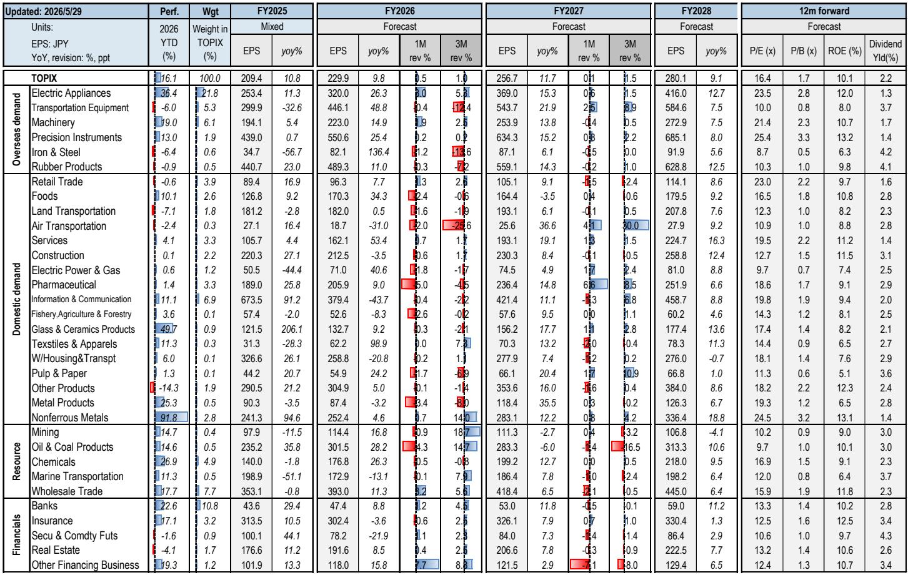
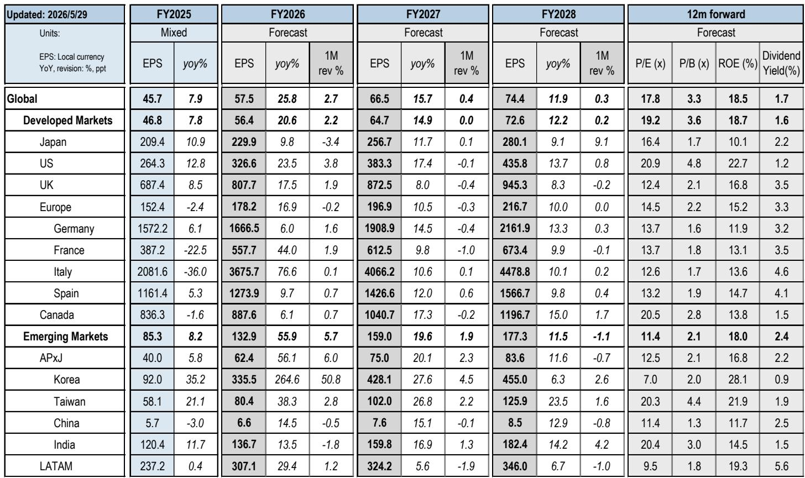
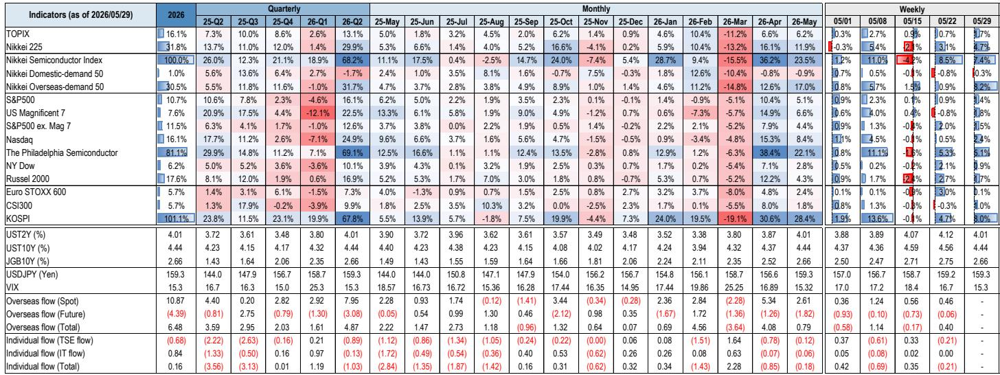

# Japan's Market Is No Longer a Single Story: The AI-Non-AI Divergence Is the Only Signal That Matters

The Nikkei 225 surged past 66,000 for the first time in May, while the TOPIX recovered to levels not seen since before the Middle East conflict. These headline numbers suggest a market firing on all cylinders. They are misleading. Beneath the surface, Japanese equities are splitting into two entirely different universes. AI semiconductor and infrastructure stocks are experiencing a parabolic rally, while domestic demand sectors—real estate, food, transportation, utilities—are actually declining. The gap between the Nikkei 225 and TOPIX has reached a record ratio of 16.8 times. This is not a broad-based bull market. It is a structural divergence that demands a fundamentally different investment approach.

The conventional framing of Japan as a single "reflation story" or "governance reform story" is no longer adequate. The market is now driven by a concentrated AI earnings cycle that is pulling a narrow set of stocks to valuations that look reasonable only because earnings forecasts are being revised upward even faster than prices. For everyone else, the macro headwinds of rising long-term interest rates, a supplementary budget, and persistent geopolitical risk are creating a drag that no amount of corporate governance improvement can offset. The question every serious investor must answer is not whether to be overweight Japan, but which Japan.

This report, drawn from a global investment bank's detailed monthly equity strategy, reveals that the May rally was largely a momentum-driven AI phenomenon. The Nikkei Semiconductor Index rose 23.5% in a single month. The overseas demand index gained 17.0%, while the domestic demand index fell 0.9%. The EPS contribution to the Nikkei's May performance was 4.1 points, while P/E expansion contributed 2.7 points. This means the rally was fundamentally supported by earnings revisions—but only for a specific cohort. For the rest of the market, earnings estimates for fiscal year 2026 were actually cut across food, pharmaceuticals, power, and transportation. The market is telling a bifurcated story, and the strategic implications are profound.

## The AI Earnings Cycle Is Masking a Valuation Trap for the Rest of the Market

When the Nikkei 225 hits a record high and the TOPIX lags significantly, the natural instinct is to assume that the broader market will eventually catch up. The data suggests the opposite. The divergence is not a temporary overshoot; it is the logical outcome of a structural earnings gap that is widening with each earnings season. For AI semiconductor stocks, consensus EPS growth for FY2026 is expected to be 60%. For the rest of the market, growth is in the single digits or negative. This is not a rotation story. It is a fundamental earnings divergence that is likely to persist as long as global AI capex remains elevated.

The risk is that non-AI stocks appear cheap on a P/E basis only because their earnings are stagnant or declining. The TOPIX 12-month forward P/E settled at 16.9 times at end-May, which looks reasonable relative to history. But that aggregate number masks a market where basic materials, chemicals, electric appliances, and trading companies are trading above their one-year average valuations, while energy, IT services, retail, food, and real estate are trading below. Low P/E in the latter group is not a value signal. It is a reflection of structural headwinds: rising rates, a strong yen, and a domestic economy that is not generating the earnings momentum needed to support higher multiples.

The critical insight is that the AI rally is actually deflating the broader market's apparent valuation risk. As AI stocks' earnings are revised upward, their P/E ratios compress, making the entire market look less frothy. The report notes that P/E ratios for AI semiconductor stocks declined to levels seen in November 2025, when concerns over excessive AI investment were at their peak. This creates a dangerous optical illusion. The overall market appears reasonably valued, but that is entirely due to the AI cohort. Strip out AI, and the rest of the market is trading at elevated multiples on declining earnings. Investors who buy the broad market are implicitly betting that the AI earnings cycle will eventually lift all boats. That bet is not supported by the data.

## Rising Long-Term Rates Are a Regime Change, Not a Temporary Headwind

The 10-year JGB yield briefly exceeded 2.8% in mid-May, reaching a 29-year high. This was triggered by news of the government's supplementary budget and the potential issuance of bridge JGBs to fund growth investments. The market reaction was instructive: AI semiconductor stocks sold off, and there was a brief rotation into banks and lagging domestic demand sectors. But that rotation lasted only as long as yields remained elevated. Once yields stabilized, the AI rally resumed with full force.

The conventional read is that rising rates are a risk to equities, but one that can be managed through sector rotation. This report suggests a deeper structural shift. The government's Basic Policy on Economic and Fiscal Management and Reform, to be announced in early July, will clarify the fiscal trajectory. The current administration has emphasized market credibility and delivered solid fiscal results, so an immediate negative reaction is unlikely. But the underlying dynamic is clear: Japan is entering a phase of structurally higher yields, and the equity market has not fully priced in the implications.

For domestic demand sectors, higher rates are a direct headwind. Real estate, utilities, and infrastructure stocks are sensitive to discount rates and borrowing costs. For financials, higher rates are a tailwind, but the benefit is contingent on the yield curve steepening, not just a parallel shift. The report notes that investors maintained overweight positions in financials, but the brief rotation in mid-May suggests that this trade is crowded and vulnerable to any dovish pivot from the Bank of Japan. With an 80% probability of a rate hike already priced in for the June BoJ Monetary Policy Meeting, the market is positioned for a hawkish outcome. Any disappointment could trigger a sharp reversal in financials and a renewed flight into AI momentum.

The strategic implication is that the rate regime is no longer a cyclical variable that can be hedged with sector allocation. It is a secular shift that will permanently alter the relative attractiveness of domestic versus external demand stocks. Investors who treat rising rates as a temporary scare are missing the point. The real question is whether the Japanese economy can generate enough nominal growth to justify these yields. If it cannot, the equity market will face a prolonged period of multiple compression outside the AI sector.

## The Flows Story Is More Fragile Than the Headlines Suggest

Overseas investors were net buyers of Japanese equities by 0.8 trillion yen in May, bringing year-to-date cumulative net buying to 6.24 trillion yen. This looks like a vote of confidence. But the breakdown reveals a more nuanced picture. Cash market net buying was 10.9 trillion yen, while futures net selling was 4.6 trillion yen. Foreign investors are buying Japanese stocks in the cash market while simultaneously hedging or shorting via futures. This is not the behavior of investors making a long-term strategic allocation to Japan. It is the behavior of momentum-driven, AI-focused funds that are hedging their beta exposure.

Trust banks, investment trusts, and retail investors were marginal net sellers in May. The QUICK survey shows that investors expanded overweight positions in electric machinery, precision instruments, steel, and machinery, while expanding underweight positions in autos and utilities. The positioning is extremely concentrated. The market is being driven by a narrow set of global AI thematic flows, not by a broad-based reassessment of Japanese equities. If the AI trade were to reverse—due to regulatory action, a slowdown in capex, or a geopolitical shock—the unwinding of these concentrated positions could be violent.

The report highlights that momentum, risk, and growth stocks outperformed in May, while quality, dividend, and EPS revision stocks lagged. This is the signature of a momentum-driven market, not a fundamentals-driven one. The risk is that when momentum reverses, it reverses hard. The NT ratio (Nikkei/TOPIX) is at a record high. That is not a sign of strength. It is a sign of extreme concentration. In any market, when a single theme dominates to this degree, the probability of a sharp mean reversion increases. The question is not whether the AI trade will eventually correct, but whether investors will have time to reposition before it does.

## What the Report Leaves Unanswered: The Sustainability of the AI Earnings Cycle

The report provides a detailed breakdown of which sectors are driving the AI rally—memory, wire and cable stocks are the primary contributors to the upward revision in FY2026 EPS consensus—but it does not fully answer the most important question: how sustainable is this earnings cycle? The report notes that P/E ratios for AI stocks have declined to levels seen during the peak of AI investment concerns in November 2025. This suggests that the market is pricing in a high degree of earnings growth. If that growth disappoints, the valuation support evaporates.

The report also notes that the performance gap between AI stocks and IT services/games, and between external demand and domestic demand stocks, continues to widen in one direction. The analysts are "closely monitoring the outlook for earnings at AI-related stocks and non-AI stocks." This is a diplomatic way of saying that the divergence is unsustainable in the long run. But the report does not provide a catalyst for convergence. Is it a slowdown in AI capex? A regulatory clampdown? A shift in BoJ policy? Or simply a natural maturation of the earnings cycle? These are the open questions that the full report likely addresses in greater depth.

For the strategic investor, the absence of a clear answer is itself a signal. If the best analysts at a global investment bank cannot confidently project the duration of the AI earnings cycle, then the prudent approach is to assume that the cycle is closer to its peak than its trough. The momentum is real, but the risk-reward is deteriorating. The report's data shows that the rally is being driven by earnings revisions, not by P/E expansion. That is a healthier foundation than a purely speculative rally. But it also means that any slowdown in earnings revisions will immediately translate into price weakness.

## A Decision Framework for Navigating the Bifurcated Market

Given the structural divergence between AI and non-AI stocks, and the uncertainty around the sustainability of the AI earnings cycle, investors need a clear decision framework. Based on the report's analysis, three questions should guide portfolio construction.

First, what is your conviction on the AI earnings cycle? If you believe that global AI capex will continue to accelerate for the next 12 to 18 months, then the optimal strategy is to maintain or increase exposure to the AI semiconductor and infrastructure cohort, while hedging the broader market risk through futures or options. The report's data shows that this cohort is generating real earnings growth, not just multiple expansion. The risk is not that the earnings are fake; it is that they are already priced in. If you have a lower conviction, the prudent move is to take profits on AI winners and rotate into sectors that have been left behind but have better risk-reward, such as financials on a yield curve steepening or select domestic demand stocks that are pricing in too much pessimism.

Second, how do you view the rate regime? If you believe that the BoJ will follow through with rate hikes and that the government's fiscal policy will be disciplined, then long-duration domestic demand stocks are structurally unattractive. The report shows that real estate, utilities, and food stocks declined in May on rising rates. This is not a cyclical dip; it is the beginning of a secular repricing. Financials, on the other hand, benefit from higher rates, but only if the yield curve steepens. Investors should monitor the BoJ's June decision and the government's July policy statement for clarity. If the yield curve remains flat or inverts, the financials trade will underperform.

Third, what is your tolerance for momentum risk? The report's flow data shows that the market is being driven by momentum traders, not long-term allocators. This creates a fragile equilibrium. If you have a low tolerance for drawdowns, the current environment argues for reducing exposure to the most crowded trades—AI semiconductors and financials—and increasing exposure to sectors that are under-owned and have catalysts for mean reversion. The report identifies IT services, retail, and real estate as sectors with low valuations relative to their one-year averages. These are not necessarily value traps if the macro environment stabilizes. But they require a catalyst, which the report does not clearly identify.

## The Full Report Holds the Charts That Make These Trends Visible

The data in this article is drawn from a detailed monthly equity strategy report that includes original charts on sector performance, EPS revision trends, flow dynamics, and valuation dispersion. These charts are not decorative; they are analytical tools that reveal patterns invisible in the text alone. The divergence between the Nikkei 225 and TOPIX, the concentration of foreign flows, the compression of AI stock P/E ratios—these are all trends that are best understood visually.

Join the community to read the full report and review the original charts. The report includes the specific sector-level EPS revision data, the breakdown of foreign investor positioning by sector, and the historical context for the current NT ratio. For any serious investor in Japanese equities, these charts are essential for making informed decisions in a market that is no longer a single story.

*This article is for learning and discussion only and does not constitute investment advice.*

Personal reading notes and learning share only. Not investment advice.

