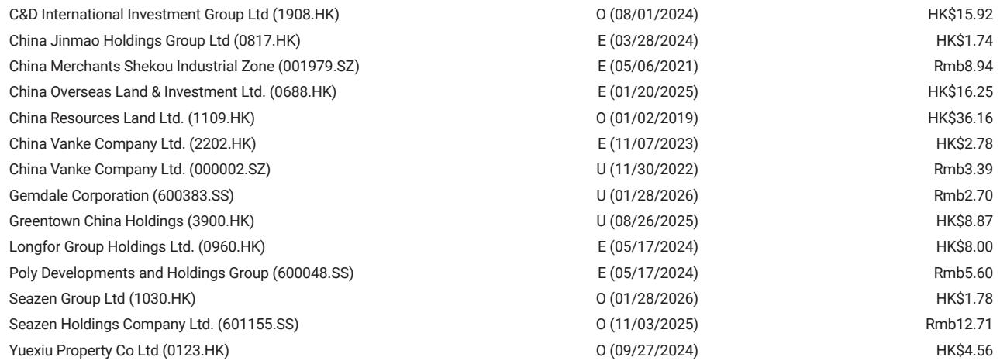
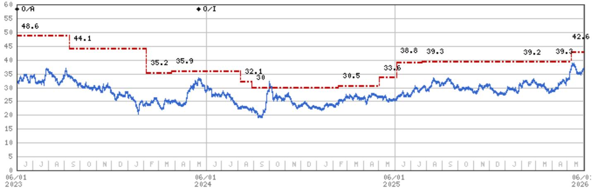
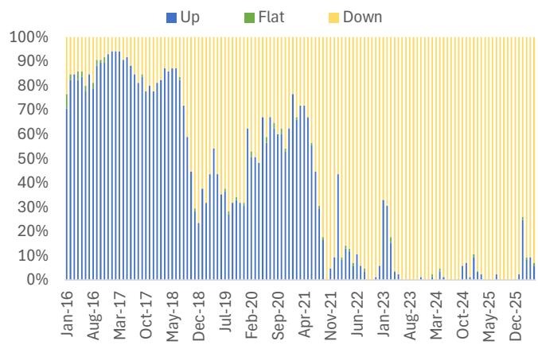

# 市场真正低估的不是房价，而是K型分化正在重塑估值逻辑

某外资投行在5月发布的这份中国房地产研报，表面在讲二手房价跌幅扩大，但真正值得关注的信号藏在标题里：**“Diverging Home Price Trends Continued in May”**。

这不是一篇简单的“楼市又跌了”的悲观报告。它揭示了一个正在加速的结构性现象——城市之间、产品之间、甚至同一城市内部不同板块之间，价格走势正在从普跌走向K型分化。而这种分化，恰恰是判断2026-2027年房地产投资机会的核心锚点。

报告的核心判断可以浓缩为一句话：**全国二手房价格仍在温和下行，但一线城市已经出现企稳苗头；真正决定未来走势的，不是政策刺激力度，而是供给侧的出清速度与需求的结构性转移。**

以下，我们拆解这份研报的五个关键洞察，并探讨那些报告尚未完全回答、但值得持续追踪的问题。

## 1. 全国二手房价格跌幅在扩大，但一线城市已企稳——这背后是“K型复苏”的早期信号

5月数据显示，85个样本城市二手房挂牌价环比下跌0.5%，较4月的-0.4%有所扩大，同比跌幅已深至-11.3%。93%的城市录得环比下跌，其中64%的城市跌幅在加速——这个数字在4月仅为19%。

表面看，数据在恶化。但真正有趣的结构性差异在于：**一线城市二手房价格环比仅下跌0.1%，基本持平。**

这意味着什么？

报告将其归因于一线城市更强的二手房成交——尤其是深圳、广州在4月底政策放松后的销售回暖。但更深层的含义是：在整体需求疲软的环境中，高能级城市凭借其人口流入、就业机会和相对有限的供给，正在成为唯一的“价格锚点”。

这不是一个普涨的信号，而是“K型分化”的早期形态——一线城市可能率先触底，而低能级城市仍在寻底过程中。对于投资者而言，这意味着未来房地产资产定价逻辑将从“板块轮动”转向“城市筛选”。

## 2. 二手房挂牌量不再激增——供给端最恐慌的阶段可能已经过去

与价格走势同样重要的是挂牌量的变化。5月约50个样本城市的总挂牌量环比仅微增0.1%，而新挂牌量继续下降（环比-4%，同比-10%）。更关键的是，67%的城市新挂牌量环比下降——这个比例在4月是96%。

换句话说，**新增抛压在显著收窄**。

这与2024年很多城市出现的“恐慌性挂牌”形成鲜明对比。当时，业主集中出货导致供给激增，进一步压低了价格。而现在，新增挂牌的减少意味着：最恐慌的卖盘可能已经释放完毕。

但报告同时指出，相比2025年底水平，仍有51%的城市总挂牌量在增加，31%的城市创下历史新高。这意味着存量库存依然庞大，去化需要时间。

对于市场而言，这是一个“供给端边际改善、但绝对量仍高”的中间状态。它不足以推动价格反转，但至少降低了价格进一步暴跌的风险。

## 3. 看房热度反常下滑——政策刺激的“脉冲效应”正在衰减

5月45个样本城市的门店看房量环比下降2%，而往年同期通常环比上升。这一反常现象发生在3-4月二手房成交强劲之后。

报告认为，这反映了政策刺激和积压需求释放后的自然衰减。更值得关注的是，**看房量下滑可能预示着6月成交将进一步放缓，甚至可能在第三季度同比转负。**

这里隐含了一个关键判断：此轮政策放松的效果正在边际递减。3-4月的成交放量更多是“积压需求的集中释放”，而非趋势性改善。一旦这个脉冲消退，市场将重新回到基本面主导的轨道上。

对于开发商和投资者而言，这意味着不能将短期成交数据线性外推。所谓“小阳春”或“红五月”，如果没有收入预期改善和杠杆意愿回升的支撑，很难持续。

## 4. 二手房正在抢占新房市场份额——价格竞争的结构性优势不可逆

报告提到一个重要趋势：**二手房凭借更具竞争力的定价和更低的单套总价，正在获得更多市场份额。**

这并非短期现象。在收入预期谨慎、加杠杆意愿有限的背景下，购房者更倾向于“用更少的钱买一个确定的房子”。二手房所见即所得、无需等待交付、价格可谈空间大，这些特征在当前环境下构成了对新房的结构性优势。

对于开发商而言，这意味着：即使新房销售出现月度环比改善，也很难回到过去的高光时刻。**二手房市场将成为未来住宅交易的主战场**，而新房市场将越来越依赖于改善型需求和核心地段的高端项目。

这个判断如果成立，将重新定义房地产行业的估值框架——开发商的土地储备价值、产品定位策略、甚至资本结构都需要据此调整。

## 5. 报告尚未完全回答的关键问题：一线城市的“温和上涨”能否持续？

报告预期2026-2027年全国房价将维持“广泛温和下行”，但部分一线城市可能出现“温和上涨”，支撑逻辑是“更好的去库存进展”。

这个判断方向正确，但细节仍有待验证：

第一，一线城市的去库存进展是否足够快？报告没有给出具体数据。从已知信息看，一线城市的库存去化周期确实低于全国平均水平，但绝对水平仍高于历史均值。

第二，温和上涨的“温和”是什么幅度？是环比0.1%还是0.5%？这个区间对投资决策的影响差异巨大。

第三，如果一线城市上涨，是否会重新引发政策收紧？这个风险报告没有讨论。

这些未解问题并不削弱报告的框架价值，而是提醒我们：在K型分化的初期，任何趋势都需要更多数据点来确认。**未来的关键观察窗口是6-8月——成交、价格、挂牌量、租金、交易结构这五个指标的变化，将决定市场是否正在形成真正的拐点。**

## 6. 给决策者的观察框架：未来三个月需要盯紧的五个指标

基于报告的框架，我们建议关注以下五组指标，以判断市场是否正在从“K型分化”走向“局部企稳”：

第一，**一线城市二手房成交量是否持续高于季节性均值**。如果6-8月成交仍能维持正增长，说明需求基础比预期坚实。

第二，**二手房挂牌价跌幅是否收窄**。如果一线城市环比跌幅从-0.1%收窄至0%甚至转正，将是重要的企稳信号。

第三，**新挂牌量是否继续下降**。如果更多城市的新挂牌量环比下降，说明供给端压力在系统性缓解。

第四，**一二手房成交比例变化**。如果二手房占比继续上升，将验证“结构性替代”的判断。

第五，**租金收益率是否企稳**。租金是房价的底层支撑，如果租金不再下跌，房价的底部将更加坚实。

这五个指标不需要等到官方数据发布，通过贝壳、安居客等平台的日度数据就可以跟踪。对于专业投资者而言，这些高频数据比月度统计局数据更具时效性和决策价值。

## 7. 在不确定性中寻找确定性：行业beta有限，但alpha个股仍有空间

报告在投资建议部分明确表达了谨慎态度：“尽管自5月中旬以来板块回调约10%，但行业风险回报仍偏向负面。” 它建议投资者关注6-8月的数据变化，以判断市场是否正在形成拐点。

在个股层面，报告维持华润置地为首选（Top Pick），建发国际为次选，逻辑是两者都具备“行业beta和自身alpha”的双重属性——即既有行业反弹的弹性，又有自身经营的确定性。

这个选股逻辑值得深思。在K型分化的市场中，**“确定性”将比“弹性”获得更高的估值溢价**。那些具备强大融资能力、核心城市土储、稳健经营记录的企业，即使行业整体低迷，也能通过市场份额提升和资产质量优势获得超额回报。

相反，那些高度依赖高杠杆、低能级城市、项目周转速度的开发商，即使行业出现短期反弹，也很难获得持续的资金青睐。

---

以上是我们基于这份研报的核心解读。但正如报告本身所暗示的，很多关键问题仍有待验证：一线城市的温和上涨能否持续？政策刺激的脉冲效应何时会完全消退？二手房市场份额的上升是否会倒逼开发商调整产品策略？这些问题在完整报告中都有更深入的数据拆解和情景分析。

我们会在社群中持续追踪6-8月的高频数据，并围绕这些未解问题进行讨论。欢迎来星球微信群里继续交流。

Personal reading notes and learning share only. Not investment advice.

