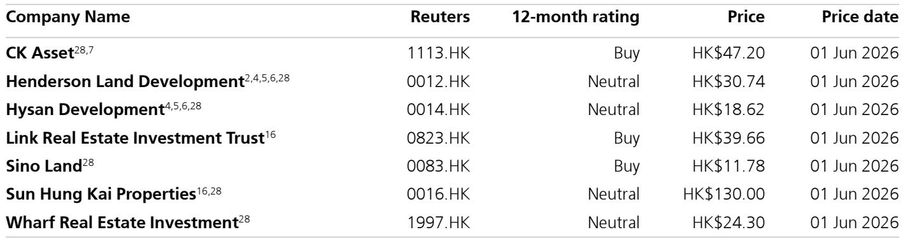
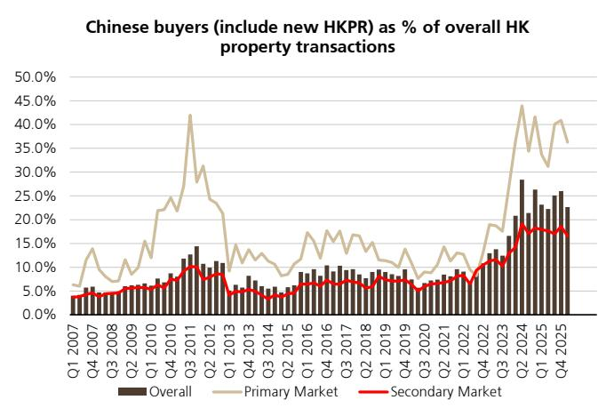
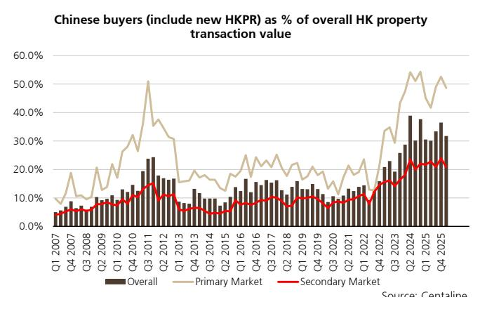

# China’s New Outbound Investment Rules Will Reshape Hong Kong’s Housing Market More Than Most Expect

The conventional wisdom that Hong Kong’s property market has already priced in China’s regulatory tightening is about to be tested. On 1 July 2026, China’s State Council will implement the new Regulations on Outbound Investment, and while the market has focused on the headline compliance requirements, the most consequential provision for Hong Kong real estate is buried in Article 32: the explicit extension of regulatory oversight to Hong Kong-related transactions. This is not a marginal compliance update. It represents a structural shift in the capital flows that have underpinned Hong Kong’s residential market recovery.

The numbers are stark. Mainland buyers, identified by surname spelling, accounted for 49 percent of primary market transaction value and 32 percent of total transaction value in the first quarter of 2026. During the 2017-2019 period, approximately 62 percent of mainland buyer transactions were subject to the Buyer’s Stamp Duty, meaning those purchases were made by non-Hong Kong permanent residents. That proportion is almost certainly higher today, given the removal of the BSD. The new regulations do not ban these flows, but they subject them to a level of scrutiny that will fundamentally alter the calculus for both buyers and developers.

This is not a short-term disruption. The regulations introduce pre-approval or filing requirements, ongoing information reporting, and comprehensive cross-border capital registration for outbound investments. Enforcement is severe: fines of 0.1 to 0.5 percent of the investment amount for non-compliance, escalating to 0.5 to 1.0 percent for failure to rectify, plus potential restrictions on outbound investment activities for one to three years. The implication is clear: the era of relatively frictionless capital movement from mainland China into Hong Kong property is ending.

The strategic question for investors is not whether this matters, but how to position for the consequences. The answer requires understanding which developers are most exposed, which buyers will be most affected, and what the second-order effects will be on pricing, volume, and the broader Hong Kong housing cycle.

## The New Rules Target the Marginal Buyer That Has Driven Hong Kong’s Primary Market Recovery

The most direct impact of the regulations will fall on the cohort of mainland buyers who are not Hong Kong permanent residents and who lack a clearly documented, legitimate source of offshore funding. This group has been the engine of the primary market’s resurgence. In Q1 2026, mainland buyers represented nearly half of all new home transaction value. To understand why this matters, consider the composition of that demand.

During the 2017-2019 period, when the BSD was in effect, 62 percent of mainland buyer transactions were by non-permanent residents. The BSD was removed in early 2024, and the proportion of non-permanent resident mainland buyers has almost certainly risen. These buyers are precisely the ones who will face the most intense scrutiny under the new regulations. They must now demonstrate that their investment capital has been properly approved, filed, and registered under Chinese outbound investment rules. For many, this will be a significant barrier.

The critical distinction is between mainland buyers who have become Hong Kong permanent residents and relinquished their mainland hukou, and those who have not. The former are largely outside the new rules. The latter, who likely constitute a majority of current mainland buyer activity in the primary market, are directly in the regulatory crosshairs. This creates a demand-side shock that the market has not yet fully discounted.

What makes this particularly consequential is the timing. Hong Kong’s primary market has been relying on this demand to absorb new supply. Developers have been pricing new projects with the expectation that mainland buyer participation would remain robust. If that expectation is disrupted, the impact on pricing power will be immediate and disproportionate in the primary market relative to the secondary market, where mainland buyer share is lower.

## Developers with High Leverage and Heavy Primary Market Exposure Face the Greatest Earnings Risk

The implications for Hong Kong developers are not uniform. The report identifies Sun Hung Kai Properties and Henderson Land as likely to underperform most, while developers with net cash positions such as CK Asset Holdings and Sino Land are expected to relatively outperform. This differentiation is not arbitrary. It reflects two distinct vulnerabilities.

First, developers with high leverage and large near-term project launches face a double squeeze. Lower mainland buyer participation will reduce pre-sales velocity and potentially force price concessions, compressing margins. At the same time, their balance sheet flexibility is constrained, limiting their ability to hold inventory and wait for demand to recover. The pressure to maintain sales volume will outweigh pricing discipline, accelerating the downward adjustment in primary market prices.

Second, the developers most exposed are those whose recent project launches have been disproportionately targeted at mainland buyer segments. This is not just about geography or project location. It is about marketing strategy, pricing architecture, and the composition of the buyer database. Developers that have built their recent sales momentum on cross-border capital inflows will need to rebuild their demand base from Hong Kong residents, a process that takes time and typically requires lower prices.

The net cash position of CK Asset and Sino Land provides a buffer that has strategic value beyond mere survival. It allows these developers to act counter-cyclically, acquiring land or distressed assets as weaker competitors are forced to sell. The regulatory shift may accelerate the long-anticipated consolidation in Hong Kong’s developer landscape, with balance sheet strength becoming the decisive competitive advantage.

## The Enforcement Mechanism Creates a New Layer of Operational Risk for Cross-Border Capital

The regulations are not merely a set of principles. They contain specific enforcement provisions that create material operational risk for any cross-border property transaction involving mainland capital. Article 27 sets out penalties that are both financial and structural. Fines of 0.1 to 0.5 percent of the investment amount may not seem prohibitive on a per-transaction basis, but the potential restriction on outbound investment activities for one to three years is a far more serious deterrent.

This restriction effectively bars non-compliant investors from making any future outbound investments, including property purchases, for a defined period. For a mainland buyer considering a Hong Kong property investment, the risk calculus has fundamentally changed. The cost of non-compliance is not just a fine. It is the loss of future investment optionality. This will drive a significant portion of demand toward full compliance, which is costly and time-consuming, or toward deferral of purchases until the compliance pathway is clear.

The operational implications for the property transaction process are equally significant. Real estate agents, law firms, and developers will need to verify the compliance status of buyer funding sources. This adds friction, delays transaction timelines, and increases transaction costs. In a market where speed and certainty of closing have been competitive advantages, this friction will reduce overall transaction volumes.

The question that remains unanswered is how rigorously the regulations will be enforced in practice. The report does not provide guidance on enforcement intensity, and this uncertainty itself is a headwind. Buyers and intermediaries will assume strict enforcement until evidence to the contrary emerges, which means the behavioral impact will precede any actual enforcement actions.

## What the Report Does Not Fully Answer: The Interaction with Hong Kong’s Own Policy Framework

The report focuses on the direct implications of the new Chinese outbound investment rules, but it leaves several critical questions unanswered. The most important is how these regulations will interact with Hong Kong’s own policy framework, particularly the tax and residency incentives that have been designed to attract mainland buyers.

Hong Kong has been actively adjusting its property market policies to support demand. The removal of the Buyer’s Stamp Duty was a deliberate policy choice to attract mainland capital. The new Chinese regulations are, in effect, working in the opposite direction. The tension between these two policy trajectories will determine the actual market outcome. If Hong Kong responds by further easing its own restrictions, it could partially offset the impact of the Chinese rules. If it does not, the combined effect could be a significant demand contraction.

A second unanswered question is the speed of the adjustment. The regulations take effect on 1 July 2026, but the behavioral response may begin much earlier. Buyers may accelerate purchases to avoid the new compliance requirements, creating a temporary surge in demand followed by a sharp decline. Developers may front-load project launches to capture this pre-regulation demand. The pattern of the adjustment matters as much as the magnitude for investment positioning.

Finally, the report does not address the potential for regulatory arbitrage or the development of new compliance structures. Will financial intermediaries create new vehicles that facilitate compliant cross-border property investment? Will there be a shift toward corporate purchases or trust structures that fall outside the individual-focused provisions of the regulations? These questions will determine whether the regulations represent a genuine structural barrier or a compliance hurdle that the market will learn to navigate.

## A Decision Framework for Positioning in Hong Kong Real Estate Through the Regulatory Transition

For investors, the new regulations create a clear decision framework organized around three variables: exposure to mainland buyer demand, balance sheet strength, and the timing of project launches.

The first variable is exposure. Investors should assess each developer’s recent primary market sales by buyer origin. Developers with mainland buyer shares above the market average of 49 percent in primary transactions face the highest demand risk. This is not a static assessment. The relevant metric is the share of upcoming project launches that are pre-sold or marketed to mainland buyers, as these are the transactions most vulnerable to disruption.

The second variable is balance sheet flexibility. Net cash positions allow developers to absorb slower sales velocity without distress. High leverage, particularly with near-term debt maturities, creates forced seller dynamics. The preference for net cash developers is not just about relative outperformance. It is about the ability to acquire assets at distressed prices as weaker developers face liquidity pressure.

The third variable is timing. The period between now and July 2026 is likely to see a demand pull-forward as buyers seek to complete transactions before the new rules take effect. Developers with projects ready to launch in the next six to twelve months may benefit from this temporary acceleration. Developers with projects scheduled for late 2026 or 2027 face the highest risk of demand disruption.

The combined framework suggests a barbell strategy: overweight developers with net cash and diversified buyer bases, underweight developers with high leverage and concentrated mainland buyer exposure, and position for a short-term pre-regulation surge followed by a structural demand slowdown.

## The Full Picture Requires Data the Report Only Begins to Map

The regulatory shift creates a new regime for Hong Kong’s housing market, but the full implications depend on data that is not yet available. How many mainland buyers are non-permanent residents? What is the actual compliance rate with existing outbound investment rules? How quickly will enforcement ramp up? These are empirical questions that will only be answered as the regulations take effect.

The report provides a critical starting point: the data on mainland buyer share of transaction value, the historical BSD proportions, and the specific enforcement provisions. But the strategic investor needs more. The full report contains the original charts that map the trajectory of mainland buyer participation over nearly two decades, the breakdown between primary and secondary market exposure, and the specific company-level data that underpins the stock recommendations.

Join the community to read the full report and review the original charts.

*This article is for learning and discussion only and does not constitute investment advice.*

Personal reading notes and learning share only. Not investment advice.

