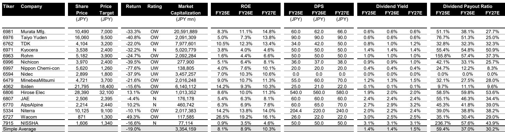
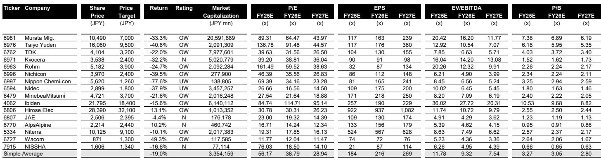
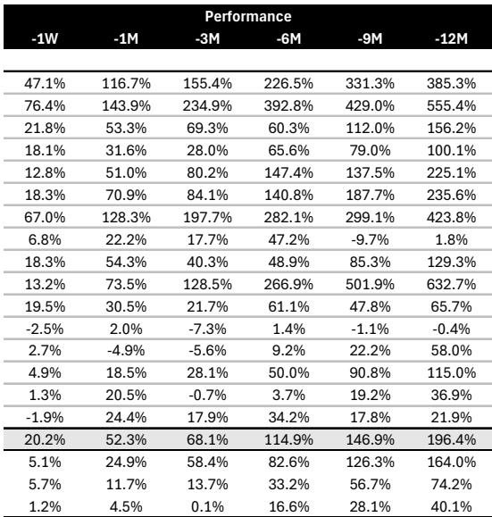

# The Storage Capacity Race Is Reordering the Supply Chain: Why Component Makers, Not Drive Assemblers, Will Capture the Next Wave of Value

The data center storage market is not merely growing. It is undergoing a structural transformation that is shifting competitive advantage away from drive manufacturers and toward the specialized component suppliers that enable higher-capacity architectures. According to the latest April 2026 shipment data from TechnoSystems Research, total capacity output from enterprise HDDs, nearline HDDs, and enterprise SSDs reached 192.9 exabytes, a 42% year-over-year increase. But the headline growth number obscures a more important pattern: the rate of capacity expansion is accelerating even as unit volumes plateau. This divergence signals that the industry is entering a phase where technological complexity, not production scale, determines who wins.

The strategic implication is clear. Investors focused on the storage theme must look beyond the familiar names in drive assembly and instead concentrate on the Japanese electronic component ecosystem that supplies the critical enabling technologies. The report identifies TDK as the top pick among HDD electronic component makers, and the reasoning extends well beyond one company. The entire supply chain is being reshaped by three simultaneous forces: the relentless push toward higher areal density in HDDs, the explosive capacity growth in enterprise SSDs, and the strategic capacity constraints being imposed by captive drive manufacturers.

This is not a cyclical upswing. It is a secular shift in how value is created and captured in the storage industry. The companies that own the bottleneck technologies--head assemblies for heat-assisted magnetic recording, high-layer-count substrates, advanced connectors--are positioned to extract disproportionate margins as the industry scrambles to meet hyperscaler demand.

## Nearline HDDs Are Not Declining; They Are Being Redefined by Capacity Concentration

The narrative that SSDs will inevitably displace HDDs in the data center is incomplete and potentially misleading for investment strategy. In April 2026, nearline HDD capacity output reached 154.8 exabytes, up 31% year-over-year, while production volume was essentially flat month-over-month at 6.8 million units. The average capacity per nearline drive hit 22.8 terabytes, a 15% increase from the prior year. This is the critical metric: the industry is shipping roughly the same number of drives but packing 31% more capacity into each one.

What is driving this concentration? Hyperscale data center operators are consolidating storage into higher-capacity drives to reduce floor space, power consumption, and management overhead. The report notes that demand for 26-terabyte and larger nearline HDDs remained solid in April, and drive manufacturers are actively "securing nearline components" and presenting "bullish production plans to component makers." This language from TSR is significant. It suggests that the bottleneck is not end-market demand but the availability of key components, particularly heads, media, and precision motors.

The strategic consequence is that HDD component suppliers are operating in a seller's market. Drive makers are competing for limited supply of advanced components, and they are doing so while simultaneously constraining their own internal head production capacity. This is not an accident. Captive manufacturers are deliberately suppressing increases in HDD head production and shifting existing capacity to heat-assisted magnetic recording. The effect is to create a structural supply deficit for conventional heads, which in turn accelerates the transition to HAMR and benefits independent component suppliers who can deliver the new technology at scale.

TDK's positioning is instructive. As a leading supplier of HDD heads to both captive and non-captive drive manufacturers, the company stands to gain market share as captive producers redirect their internal capacity toward HAMR and rely more heavily on external partners for conventional heads. The report's emphasis on TDK as the top pick is not a call on HDD volumes. It is a call on technological transition and supply chain realignment.

## Enterprise SSDs Are Growing at 117% Capacity Per Year, But the Profit Pool Is Shifting Upstream

The SSD data is even more dramatic. Enterprise and data center SSD capacity output reached 37.7 exabytes in April 2026, a 117% year-over-year increase. Average capacity per enterprise SSD rose to 6.6 terabytes, up 53% from the prior year. The maximum drive capacity, which had been stuck at 61.44 terabytes for an extended period, has now jumped to 122.88 terabytes and 245.76 terabytes, with TSR noting that these higher-capacity models are "now in full swing."

The unit economics of this shift are worth examining. Enterprise SSD unit volumes grew 42% year-over-year, but capacity grew at nearly three times that rate. This means the average revenue per drive is rising sharply, but so is the technical complexity required to produce these drives. Higher-capacity SSDs require more NAND layers, more advanced controllers, more sophisticated power management, and higher-layer-count substrates. The value capture in the SSD supply chain is migrating away from NAND commodity producers and toward the companies that solve the integration and reliability challenges of packing 245 terabytes into a single drive form factor.

For Japanese electronic component makers, this creates a dual opportunity. First, the PCB substrates used in enterprise SSDs are becoming more complex and higher-value as capacity increases. Second, the connectors, capacitors, and thermal management components required for these high-performance drives are subject to more stringent specifications and higher pricing. The report's stock performance table shows that Ibiden, a leading substrate supplier, has delivered a 12-month return of 632.7%, the highest among the 16 covered companies. This is not a coincidence. The substrate bottleneck in high-end packaging is one of the most persistent constraints in the semiconductor supply chain, and enterprise SSDs are adding to that demand pressure.

## The SSD Share of Total Data Center Storage Capacity Is Rising, But the Absolute HDD Capacity Growth Is Still Larger in Exabyte Terms

A careful reading of the data reveals a nuance that many market observers miss. The SSD share of total data center storage capacity (enterprise HDDs, nearline HDDs, and enterprise SSDs combined) rose to 19.5% in April 2026 from 12.8% a year earlier. This is a significant increase, and it supports the thesis that SSDs are gaining share. However, in absolute exabyte terms, the incremental capacity added by nearline HDDs in April was approximately 36.7 exabytes year-over-year (154.8 exabytes versus 118.1 exabytes implied from the 31% growth rate), while enterprise SSDs added approximately 20.4 exabytes year-over-year (37.7 exabytes versus 17.4 exabytes implied from the 117% growth rate).

The math is straightforward. HDDs are still adding more absolute capacity each year than SSDs, even though SSDs are growing at a faster percentage rate. This is a critical distinction for supply chain investors. The HDD component ecosystem will continue to generate substantial revenue growth for the foreseeable future, even as SSDs capture an increasing share of new deployments. The two technologies are not in a zero-sum competition at the component level. Both are creating demand for the same types of advanced components: precision mechanical parts for HDDs and high-performance substrates, capacitors, and connectors for SSDs.

The report's valuation table shows that the simple average price-to-earnings ratio for the 16 covered Japanese electronic component companies is 56.2 times for fiscal year 2025 estimates, falling to 38.8 times for fiscal 2026 and 28.9 times for fiscal 2027. This compression suggests that the market is pricing in a significant earnings recovery, but the current multiples still imply substantial upside if the earnings materialize as expected. The key question is whether the earnings growth is sustainable, and that depends on the durability of the capacity expansion cycle.

## What the Report Does Not Fully Answer: The Risk of Demand Pull-Forward and the Timing of the HAMR Transition

Any rigorous analysis must acknowledge the uncertainties that the report raises but does not fully resolve. The most significant open question is whether the current strength in nearline HDD demand reflects genuine structural growth or a pull-forward effect driven by hyperscalers securing storage capacity in advance of potential supply constraints. TSR's observation that "demand for nearline drives is still at a high level on the back of moves to secure storage upfront" is revealing. If a significant portion of current demand is precautionary inventory building, then a normalization period could follow once those inventories are established.

The second unresolved question concerns the timing and competitive dynamics of the HAMR transition. The report states that captive manufacturers are suppressing conventional head production capacity and shifting to HAMR, which benefits independent suppliers like TDK. However, the transition to HAMR is not without execution risk. HAMR heads are fundamentally different from conventional perpendicular recording heads, requiring new materials, new manufacturing processes, and new reliability qualification procedures. The pace at which HAMR ramps to volume production will determine how quickly the competitive dynamics shift and whether independent suppliers can maintain their pricing power.

The third question is about the SSD substrate supply chain. The report highlights Ibiden's extraordinary stock performance, but it does not address whether the substrate industry can add capacity fast enough to meet the demand from both enterprise SSDs and the broader AI semiconductor ecosystem. If substrate supply remains constrained, it could cap the growth rate of high-capacity enterprise SSDs and redirect some demand back toward HDDs. Conversely, if substrate capacity expands rapidly, it could accelerate the SSD share gain and compress margins for HDD component suppliers.

These are not weaknesses in the report. They are the natural boundaries of any forward-looking analysis, and they create the analytical tension that makes the full report worth reading.

## A Decision Framework for Investors Navigating the Storage Supply Chain

For investors who want to act on this analysis, the following framework can help translate the report's insights into portfolio decisions. The framework is built around three axes: technology exposure, supply chain position, and valuation.

First, technology exposure. Companies with direct exposure to the capacity upgrade cycle in both HDDs and SSDs are preferable to those tied to legacy technologies or consumer-oriented products. TDK's exposure to HAMR heads and HDD components, combined with its broader electronic materials business, gives it a dual growth driver. Ibiden's exposure to high-end substrates positions it to benefit from both enterprise SSD growth and the broader AI infrastructure buildout. Companies that are primarily exposed to consumer electronics components, such as capacitors for smartphones or connectors for laptops, are less directly leveraged to the data center storage theme.

Second, supply chain position. The most valuable positions in the supply chain are those where the component supplier has pricing power due to technical differentiation or capacity constraints. HDD heads, high-layer-count substrates, and precision connectors all exhibit these characteristics. Companies that supply commoditized components, such as standard capacitors or basic connectors, will benefit from volume growth but are unlikely to see margin expansion. The report's valuation table shows a wide dispersion in price-to-earnings ratios, from 11.8 times for Wacom to 161.5 times for Rohm, reflecting the market's attempt to differentiate between commodity and specialty exposures.

Third, valuation. The report provides consensus price-to-earnings and price-to-book ratios for each covered company. For fiscal year 2026, the simple average P/E is 38.8 times, but the range is from 12.0 times to 114.7 times. Investors should focus on companies where the valuation is supported by a clear path to earnings growth driven by the capacity expansion theme, rather than by general market enthusiasm for Japanese equities. The report's price targets imply significant upside for several names, but the returns are not uniform, and the dispersion reflects genuine differences in business quality and growth visibility.

## The Full Report Contains the Charts and Data That Make This Analysis Actionable

The analysis presented here is based on the April 2026 TSR data and the strategic framework developed in the full report. However, the charts that accompany the original research--including the detailed breakdown of HDD and SSD production by capacity tier, the trend lines for average capacity per drive, and the valuation heat maps--provide the granularity that serious investors need to make informed decisions. The stock performance table alone, which shows the 12-month returns and rankings for 16 Japanese electronic component companies, contains patterns that reward careful study.

Join the community to read the full report and review the original charts.

*This article is for learning and discussion only and does not constitute investment advice.*

Personal reading notes and learning share only. Not investment advice.

