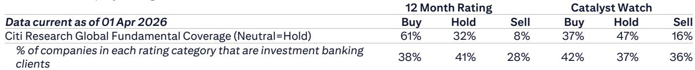

# The Silicon Valley Bus Tour Reveals a Structural Shift: Agentic AI Is Reshaping the Semiconductor Value Chain Faster Than Anticipated

The most critical insight to emerge from this year's Silicon Valley bus tour is not about a single product cycle or a quarterly beat. It is about a fundamental reordering of demand within the semiconductor industry. Agentic AI—the shift from simple chatbot inference to multi-step, autonomous workflows—has reached an inflection point that caught even the most optimistic management teams off guard. Multiple companies across the stack reported that demand spiked sharply in February and has continued to accelerate since. This is not a gradual ramp. It is a step-change in the architecture of compute.

For investors, the implications are profound. The traditional mental model of AI demand being driven primarily by GPU clusters for training is giving way to a more complex picture. CPUs, networking silicon, memory, and advanced packaging are all experiencing demand pull that is both broader and more persistent than the initial wave of large language model training. The semiconductor supply chain is now being reshaped by the requirements of orchestration, retrieval, and execution—functions that are fundamentally CPU-intensive and connectivity-dependent.

What follows is a structured analysis of what this shift means for different segments of the value chain, where the opportunities are most concentrated, and which questions remain unanswered.

## The CPU Renaissance Is Real, and It Is Driven by Agentic Workloads That Require Orchestration, Not Just Computation

For years, the narrative around AI has been dominated by GPUs. The bus tour meetings make it clear that this narrative is incomplete. One of the largest CPU designers reported that server revenue grew more than 50% in the first quarter alone, driven by an explosion in demand for general-purpose compute to support agentic AI. This is not a cyclical bounce. It is a structural change in how enterprises deploy AI.

Agentic AI requires multiple workload types to run simultaneously: orchestration, database retrieval, agent management, and execution. These are not tasks that map efficiently to GPU architectures. They are CPU workloads. The management team noted that 95% of their token spending is currently for software engineering, and that if their customers' bottom-up forecasts are accurate, their own total addressable market estimate of $120 billion is too low.

The competitive dynamics here are equally important. The traditional x86 versus ARM debate is being reframed by the requirements of agentic workloads. Security features, multithreading capability, and core-count flexibility are becoming decisive factors. One major CPU supplier has designed a product specifically to compete with ARM-based alternatives, developed in close collaboration with a leading hyperscaler. The implication is that the CPU market is not merely recovering—it is being reinvented.

The second-order effect is on pricing power. Server CPU gross margins are already healthy, and the mix shift toward higher-core-count products should support average selling price expansion. But management teams are signaling a strategic approach to pricing, preferring to share cost increases with customers rather than maximize short-term margin. This suggests that the competitive landscape is rational and that the focus is on long-term relationship building rather than market share grabs.

## Networking Silicon Is Becoming the Bottleneck, and the Shift to PCIe Gen 6 Creates a Multi-Billion Dollar Opportunity

If CPUs are the brains of agentic AI, networking is the nervous system. The bus tour meetings with a leading connectivity solutions provider reveal that the transition to PCIe Gen 6 is a defining catalyst for the networking segment. The company is already shipping in volume for this technology, and the content opportunity per XPU is substantial.

The numbers are striking. Content per XPU ranges from less than $100 for basic retimers to over $1,000 for the most advanced scale-up solutions. This is not a linear progression. It is a step-function increase in value per unit as the industry moves from simple connectivity to intelligent switching and memory expansion. The company estimates a $10 billion opportunity in scale-up switching alone, derived from bottom-up analysis of customer requirements.

The competitive landscape is evolving rapidly. While one player has historically commanded over 90% share in retimers, the switching market is more contested. Multiple hyperscalers and merchant GPU providers are engaged, and the company expects several design wins to convert to revenue in the coming quarters. The key question is whether the incumbent can maintain its position as the ecosystem shifts from copper to optics.

Photonics represents the next frontier. The consensus view from multiple management teams is that rack-to-rack connectivity will be the first to adopt optical solutions, with near-packaged optics becoming dominant by 2028. Co-packaged optics may not be production-ready until later. The critical insight is that customers want to stay on copper as long as possible, but the bandwidth requirements of next-generation XPUs will eventually force the transition. This creates a multi-year investment cycle for companies with optical capabilities.

## Memory and Materials Are Benefiting from Complexity, But the Nature of Cyclicality Is Changing

The memory and materials segment offers a different but equally important perspective. A leading equipment supplier reported that DRAM demand remains strong and that systems will grow more than 30% this year, with leading-edge NAND and DRAM growing even faster. The key insight from their management team is that the traditional cyclicality of the industry is breaking down.

The old pattern was simple: consumers bought PCs and phones every two years, creating a predictable replacement cycle. That cycle no longer exists. Instead, demand is being driven by the increasing complexity of chips. A CPU chip today requires 17 wiring layers; a GPU requires 21. Logic is transitioning to gate-all-around architectures and backside power delivery. DRAM is following the logic roadmap. Each of these transitions increases the number of manufacturing steps and, therefore, the demand for equipment.

This has profound implications for valuation. If the semiconductor equipment industry is no longer as cyclical as it once was, then the discount applied to these stocks relative to growth companies may be unwarranted. The management team noted that they have doubled their manufacturing footprint and can easily increase capacity further. This is not the behavior of an industry expecting a downturn.

The materials metrology provider reinforced this view. Their revenue grew 31% last year, and they outperformed wafer fab equipment growth by 96% over a five-year period. Advanced packaging is growing faster than front-end manufacturing, and they claim 100% market share in advanced packaging metrology. The key driver is complexity: the more difficult the process, the more valuable their measurement solutions become.

## The Full-Stack Data Center Model Is Gaining Traction, and It Changes the Profitability Equation

One of the most interesting developments from the bus tour is the emergence of a new business model in the server and infrastructure space. A leading system builder is increasingly focused on delivering complete data center building blocks—server, storage, switching, software, and services—rather than just individual components.

The numbers are compelling. The full-stack solution is expected to grow from low single digits to 15-20% of profits. This shift reduces revenue volatility because the company is selling integrated solutions rather than commodity boxes. It also creates a natural barrier to entry, as few competitors have the breadth of capabilities required.

The demand environment is being driven by agentic AI adoption across enterprises, sovereign entities, and neocloud providers. Importantly, enterprise customers are more focused on access to systems than on price, particularly in regulated industries like financial services and oil and gas. This pricing power is a direct result of supply constraints and the urgency of AI deployment.

The management team emphasized that vertical integration allows them to alleviate supply constraints and meet customer demand. They also stated that optimizing working capital is a priority and that capital raising is not required to meet growth expectations. This is a positive signal for investors concerned about dilution.

## What the Report Does Not Fully Answer: The Sustainability of the Agentic AI Demand Spike

The bus tour meetings are unanimous in their enthusiasm for agentic AI, but there are several critical questions that remain unanswered. First, the demand spike was described as occurring in February, triggered by an increase in model capability. Is this a one-time event, or does it represent a sustainable new demand baseline? The report does not provide enough data to distinguish between a step-change and a cyclical surge.

Second, the relationship between agentic AI and capital expenditure is unclear. If agentic workloads are more CPU-intensive than GPU-intensive, does this mean that hyperscaler capex will shift away from GPUs and toward CPUs and networking? Or is it additive? The management teams suggest the latter, but the report does not provide a quantitative framework for understanding the mix shift.

Third, the timeline for photonics adoption remains uncertain. Multiple management teams agree that optics will be necessary, but they disagree on when. The range of estimates for co-packaged optics spans from 2027 to beyond 2028. This uncertainty creates both opportunity and risk for investors trying to position for the next technology cycle.

Fourth, the competitive dynamics in networking are evolving rapidly. One company has historically dominated retimers, but the switching market is more fragmented. The report does not provide enough detail to assess whether the incumbent can maintain its market share as the technology transitions from Gen 5 to Gen 6 and beyond.

## A Decision Framework for Investors: Three Questions to Ask Before Committing Capital

Based on the insights from the bus tour, investors should evaluate semiconductor opportunities through a structured lens. The following framework is designed to help differentiate between companies that are benefiting from transient tailwinds and those that are positioned for structural growth.

First, assess exposure to agentic AI workloads. The key distinction is between companies that sell into training infrastructure and those that sell into inference and orchestration. The latter are likely to benefit from a longer and more diversified demand cycle. Companies that provide CPUs, networking silicon, and advanced packaging for inference are better positioned than those focused solely on GPU-adjacent markets.

Second, evaluate pricing power and margin structure. The bus tour revealed that companies with differentiated technology are able to pass through cost increases and maintain healthy margins. Companies that compete primarily on price are vulnerable to the inevitable normalization of supply. Look for companies with gross margins above 50% and operating margins above 25%, as these are indicators of sustainable competitive advantage.

Third, consider the balance sheet and capital requirements. Several management teams emphasized that they do not need to raise capital to meet growth expectations. Companies that require external funding to scale are taking on additional risk, particularly if interest rates remain elevated. Companies with strong free cash flow and manageable debt are better positioned to weather any cyclical downturn.

## The Unresolved Questions That Make This Story Worth Following

The bus tour provides a rich set of data points, but it also raises questions that only time and further analysis can answer. How much of the current demand is inventory building versus genuine consumption? Will the shift to agentic AI compress or extend the typical product cycle? Can the industry scale manufacturing capacity fast enough to meet demand without destroying pricing discipline?

These are not trivial questions. They will determine whether the current upcycle lasts for quarters or for years. The management teams are optimistic, but their optimism is based on assumptions about customer behavior that have not yet been tested in a downturn.

For serious investors, the path forward is clear. The companies that participated in the bus tour are at the center of a structural shift in computing. Understanding the nuances of their strategies, their competitive positions, and their financial profiles is essential to making informed investment decisions. The full report contains detailed meeting notes, financial projections, and competitive analysis that go far beyond what can be covered here.

Join the community to read the full report and review the original charts.

*This article is for learning and discussion only and does not constitute investment advice.*

Personal reading notes and learning share only. Not investment advice.

