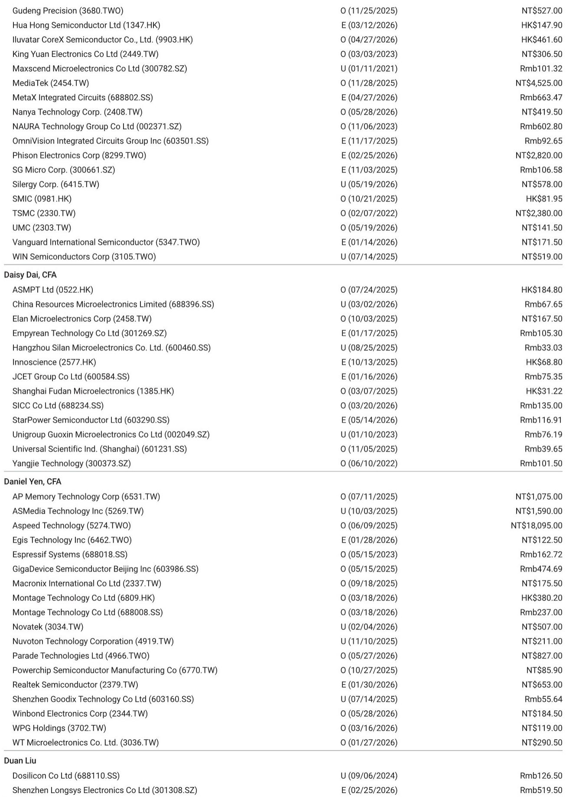
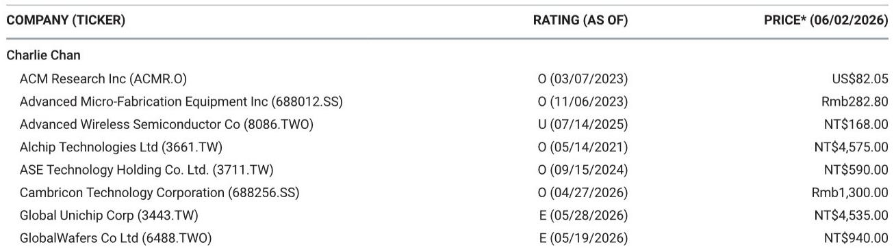
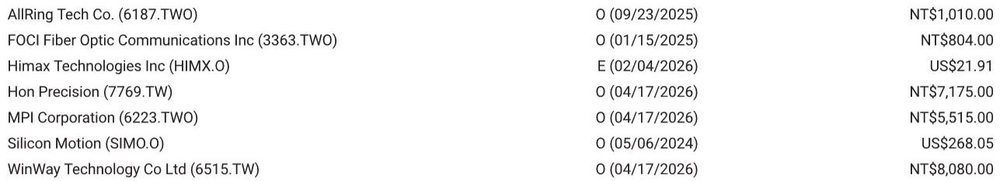

# Agentic AI Is Reshaping the Semiconductor Landscape: Computex 2026 Reveals a New Hierarchy of Winners

The 2026 Computex keynote sessions delivered a clear and decisive message: the semiconductor industry is no longer competing on GPU performance alone. The emergence of agentic AI—autonomous systems that can plan, reason, and execute tasks without continuous human prompting—is fundamentally rewiring the demand architecture across compute, connectivity, and packaging. At the center of this shift lies a three-part strategic question that every investor must answer: Who owns the agentic AI compute stack, who can secure the manufacturing capacity to meet exploding demand, and which edge devices will become the new battleground for AI inference?

According to a detailed research report from a leading global investment bank, the Computex discussions revealed that Nvidia's Vera CPU is now positioned as a serious contender in the server CPU market, TSMC's capacity appears sufficient to support robust growth through 2027, and the Nvidia-MediaTek partnership for AI PC chips is finally taking concrete shape. But beneath these headline takeaways lies a more complex and strategically consequential story. The report's analysis of Computex Day 1 suggests that the industry is entering a phase where supply chain positioning, not just product performance, will determine which companies capture the outsized returns from the agentic AI cycle.

This article synthesizes the report's key findings, extends its logic into second-order implications, and identifies the unresolved questions that will define the next phase of investment debate. For serious business readers, the goal is not to summarize what happened at Computex, but to understand what the pattern means for portfolio construction and strategic positioning in Greater China semiconductors.

## Agentic AI Compute Is Not Just About GPUs Anymore: Vera CPU Signals a Structural Shift in Server Architecture

The most underappreciated takeaway from Computex is that the agentic AI workload does not map neatly onto the traditional GPU-centric compute model. Nvidia, Arm, and Qualcomm all emphasized in their keynotes that Arm-based server CPUs will be essential to support future agentic AI demand. This is not a marginal observation. It represents a fundamental rethinking of how AI inference will be distributed across data center infrastructure.

The report highlights that Nvidia's Vera CPU, which the company discussed at an investor luncheon during Computex, is being prepared for volumes of 2.5 million to 4 million units based on supply chain checks. The performance data is striking: Vera delivers approximately 1.8 times the performance of the highest-performance x86 CPU in compilation and Python workloads. This is not incremental improvement. This is a structural displacement of the x86 architecture in AI server environments.

The strategic implication is clear. The agentic AI workload requires both the parallel processing capability of GPUs and the sequential reasoning capability of advanced CPUs. Vera is designed to serve both as a head node for AI servers and as a standalone CPU server. This dual role means that Nvidia is no longer just a GPU company. It is becoming a full-stack compute platform provider, and the Vera CPU is the key to that transformation.

What the report does not fully resolve is the question of market share displacement. If Vera can command higher prices than x86 alternatives, as management indicated, then the total addressable market for server CPUs is expanding, not just shifting. But the pace of x86 displacement will depend on enterprise software compatibility, ecosystem maturity, and the willingness of hyperscalers to adopt a vertically integrated Nvidia stack. These are open questions that will play out over the next 18 to 24 months.

## TSMC Capacity Is Sufficient for 2027, But the Real Question Is Allocation, Not Absolute Supply

One of the most debated topics in semiconductor investing over the past two years has been whether TSMC's capacity constraints would create a ceiling on AI semiconductor growth. The Computex discussions provided a surprisingly clear answer: Nvidia indicated it has sufficient TSMC capacity to support robust growth in 2027, and that even as supply expands, demand will likely still exceed supply.

This is a critical data point, but it requires careful interpretation. The report notes that Nvidia has convinced TSMC and other suppliers that demand remains strong. This is not merely a statement about current orders. It is a signal about the long-term visibility that Nvidia has into its own product roadmap and the confidence it has communicated to its manufacturing partners.

The more important question, which the report explicitly raises, is about allocation. In a market where demand exceeds supply, the ability to secure incremental allocation versus competitors becomes the primary competitive advantage. Nvidia's management emphasized that the AI semiconductor market is growing and does not represent a zero-sum competition. But this statement should be read strategically. It is true that the pie is expanding, but the distribution of that expansion is not uniform. Companies with stronger relationships with TSMC, more predictable product roadmaps, and higher-margin products will naturally command preferential allocation.

The second-order implication for investors is that the semiconductor supply chain is becoming more concentrated, not less. Companies like TSMC, ASE, and KYEC, which are identified in the report as key Nvidia supply chain partners, are likely to benefit from this concentration. But the risk is that smaller players without deep relationships may find themselves structurally underallocated as the market expands.

## The AI PC Is Finally Real, But the Volume Debate Is Just Beginning

The Nvidia-MediaTek partnership for AI PC chips, which the report flagged nine months ago, was formally announced at Computex under the RTX Sparks brand. The chip, which combines a Blackwell RTX GPU with a 20-core Grace CPU designed by MediaTek, represents the first serious attempt to bring agentic AI capability to the edge device.

The report provides specific volume estimates: approximately 5 million to 8 million units of N1X/N1 SoC shipments in 2026, contributing 5 to 10 percent of MediaTek's 2026 earnings per share, assuming an average $40 royalty fee per chip. These are not trivial numbers, but they are also not transformative for a company of MediaTek's scale. The strategic significance lies elsewhere.

The report raises the critical question: do we actually need a local LLM or agent on the edge device? This is not a rhetorical question. The answer determines whether the AI PC becomes a mass-market product or a niche high-end offering. The pricing data from the report suggests that AI PCs with the N1X chip will need to be priced at $2,899, while N1 models will be priced at $1,799. At these price points, the addressable market is limited to professional users, developers, and early adopters.

The unresolved analytical question is whether the use cases for edge AI—local inference, privacy-sensitive applications, low-latency agentic responses—are compelling enough to justify a $1,000 to $1,500 premium over standard PCs. If the answer is yes, then the 5 million to 8 million unit estimate for 2026 is conservative. If the answer is no, then the AI PC cycle may take longer to materialize than current expectations suggest.

## The Supply Chain Map Is Shifting: Greater China Semis Are Positioned Across Multiple Growth Vectors

The report provides a detailed mapping of Greater China semiconductor companies across the Nvidia AI GPU supply chain, the CPO supply chain, the CPU supply chain, and the WoA AI PC supply chain. This mapping is valuable because it reveals that the opportunity is not monolithic. Different companies are exposed to different parts of the agentic AI value chain, and those exposures have different risk-return profiles.

In the Nvidia AI GPU supply chain, TSMC (foundry), ASE (packaging), and KYEC (testing) are the primary beneficiaries. These are high-conviction positions because they are directly tied to Nvidia's volume growth. In the CPO supply chain, FOCI (FAU), Himax (WLO), and ASE (optical insertion testing) are positioned to benefit from the eventual transition to optical connectivity, though the report notes that Nvidia indicated it will adopt CPO only when necessary and rely on copper as long as possible. This creates a timing risk for CPO-related investments.

In the CPU supply chain, KYEC (Vera and Google CPU test) and Aspeed (general server BMC) are well-positioned. The Vera CPU volume estimates of 2.5 million to 4 million units provide a tangible revenue opportunity for testing and validation services. In the WoA AI PC supply chain, MediaTek (N1X and N1 chips) and Macronix (NOR Flash for AI PC) are the primary beneficiaries.

The strategic insight here is that the agentic AI opportunity is not a single trade. It is a portfolio of exposures that span foundry, packaging, testing, optical connectivity, and edge computing. Investors who treat the AI semiconductor theme as a monolithic bet are likely to miss the important differentiation between companies that are structurally positioned versus those that are cyclically exposed.

## What the Report Does Not Fully Answer: The Vera Volume Trajectory, Edge AI Adoption, and CPO Timing

Every good research report leaves unresolved questions, and this one is no exception. Three questions stand out as critical for future analysis.

First, what is the realistic volume trajectory for Vera CPU? The 2.5 million to 4 million unit estimate from supply chain checks is a useful baseline, but it does not clarify the pace of ramp. Vera is entering a market dominated by Intel and AMD, with deeply entrenched enterprise relationships. The displacement of x86 in server environments will take time, and the revenue contribution from Vera in 2027 and 2028 remains uncertain.

Second, will edge AI adoption accelerate or disappoint? The AI PC volume estimates are based on current pricing and product positioning, but the actual adoption curve will depend on software ecosystem maturity, enterprise deployment decisions, and consumer willingness to pay a premium for on-device AI. The report's estimates are reasonable, but they are also highly conditional.

Third, when will CPO become necessary? Nvidia's stated preference for copper over CPO suggests that the optical transition is not imminent. But the long-term trend toward higher bandwidth and lower power consumption will eventually make CPO unavoidable. The timing of this transition will determine whether current CPO supply chain investments are premature or prescient.

These unresolved questions create natural hooks for investors who want to dig deeper into the full report. The data, charts, and detailed supply chain analysis in the original research provide the context needed to form independent judgments on these critical variables.

## A Decision Framework for Investors: How to Position Across the Agentic AI Supply Chain

For investors seeking to translate the Computex takeaways into actionable portfolio decisions, a three-part framework is useful. This framework is derived from the report's analysis but extends it into a structured approach for capital allocation.

First, identify companies with structural rather than cyclical exposure. Structural exposure means that demand is driven by secular trends in AI compute architecture, not by inventory cycles or macroeconomic fluctuations. TSMC, ASE, and KYEC fall into this category. Their revenue is tied to the physical volume of AI chips being manufactured and packaged, which is growing regardless of short-term demand fluctuations.

Second, evaluate the timing of revenue realization. Companies like MediaTek, which are positioned for the AI PC cycle, have a more uncertain timeline. The revenue contribution in 2026 is modest, and the real inflection may not occur until 2027 or 2028. Investors with a longer time horizon can afford to be patient, but those with a shorter horizon may need to focus on companies with more immediate revenue visibility.

Third, assess the competitive moat. In the AI semiconductor supply chain, the strongest moats belong to companies with unique capabilities that are difficult to replicate. TSMC's manufacturing scale, ASE's packaging expertise, and KYEC's testing infrastructure are examples of capabilities that cannot be easily duplicated. Companies with weaker moats, such as those providing commodity components or services, will face margin pressure as competition intensifies.

This framework does not provide specific buy or sell recommendations. But it does provide a structured way to think about risk, return, and timing across the agentic AI supply chain. The full report contains the granular data and company-level analysis needed to apply this framework to specific investment decisions.

## The Next Phase of the AI Semiconductor Cycle Will Be Defined by Execution, Not Announcements

Computex 2026 has clarified the strategic direction of the AI semiconductor industry. Agentic AI is real, Vera CPU is a serious product, TSMC capacity is sufficient, and the AI PC is finally entering the market. But the easy part is over. The next phase of the cycle will be defined by execution: Can Nvidia ramp Vera production without delays? Can MediaTek convert AI PC hype into volume shipments? Can TSMC maintain allocation discipline as demand continues to outstrip supply?

These are questions that cannot be answered from keynote presentations. They require deep supply chain analysis, channel checks, and financial modeling. The original report from the global investment bank provides exactly this kind of analysis, with detailed exhibits on Vera performance, AI PC pricing, and supply chain mapping that are not fully captured in this article.

Join the community to read the full report and review the original charts.

*This article is for learning and discussion only and does not constitute investment advice.*

Personal reading notes and learning share only. Not investment advice.

