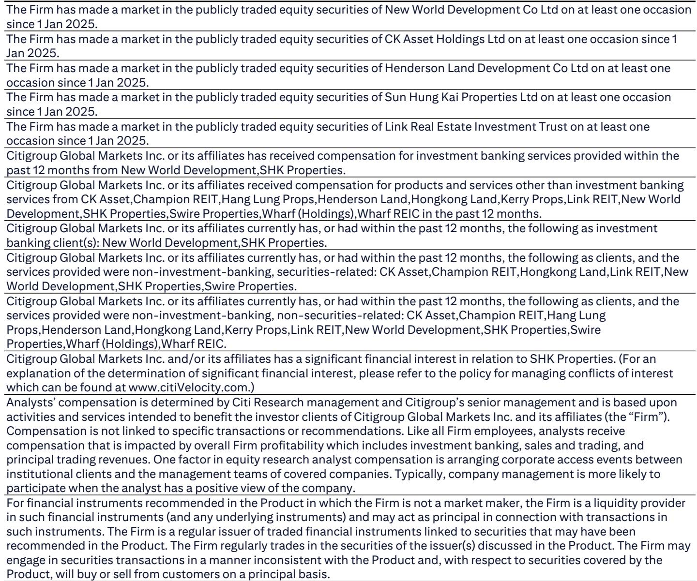
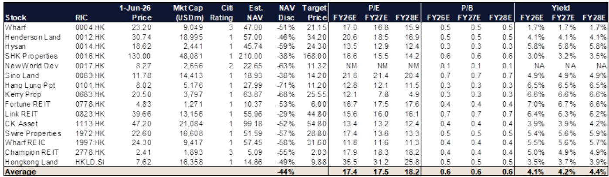

# China's Capital Controls Will Not Derail Hong Kong's Housing Market—But They Will Redraw the Buyer Map

The market reaction to China's tightened outbound investment rules has been swift and nervous, with Hong Kong developer shares selling off on the assumption that mainland capital flowing into local residential property will be choked off. That assumption is wrong in its scale, wrong in its target, and wrong in its understanding of how capital actually moves across borders. The real impact is confined to a narrow cohort of buyers who represent roughly 5.5 percent of transaction volume, not the 26 percent figure that headlines have seized upon. The more consequential story is not about demand destruction but about demand recomposition: wealthier buyers will remain largely unaffected, equity proceeds from forced sell-only rules may rotate into housing, and the regulatory shift could accelerate the very thing Beijing wants to encourage—Hong Kong residency formation among mainland professionals. The panic, in short, is a buying opportunity for those who can separate signal from noise.

This matters now because the policy environment is shifting in ways that create both risk and opportunity for investors who understand the structural plumbing of cross-border capital flows. The new rules governing outbound investment, announced on 1 June, come on the heels of tighter scrutiny on unauthorized offshore brokers announced on 22 May. Together, they represent the most significant regulatory tightening on capital outflows since the 2016-2017 cycle. But the 2016 precedent is instructive: capital controls alone did not move the needle on non-resident purchases back then. What did move the market was a combination of social unrest and policy uncertainty. The current sell-off, therefore, may reflect investor emotion more than fundamental risk.

To understand why the market is misreading the situation, one must disaggregate the buyer base. The 26 percent figure commonly cited for mainland purchasing activity is based on Hanyu Pinyin name registration—a blunt instrument that captures not only mainland buyers but also Hong Kong permanent residents of mainland origin and non-permanent residents admitted under talent schemes or study programs. These groups hold Hong Kong identity cards, earn Hong Kong dollar salaries, and have access to local banking and securities accounts. They are not the ones exposed to cross-border capital controls. The true exposed cohort is the 5.5 percent of residential transactions conducted by individual buyers who do not hold a Hong Kong Identity Card at all. That is the number that matters, and it is far smaller than the market fears.

## The Mass-Market Non-HKID Buyer Faces Genuine Headwinds, But Luxury Demand Remains Structurally Insulated

The distinction between buyer types is not merely academic—it determines which segments of the market are vulnerable and which are not. Non-HKID buyers of mass-market single units are the most exposed. These purchasers typically accumulate offshore funds through securities accounts or insurance products, remain subject to foreign exchange conversion and remittance quotas, and lack Hong Kong dollar-denominated income or assets to qualify for a local mortgage. For this group, the tightening of capital controls directly constrains their ability to move money into Hong Kong property. They are the marginal buyer in the mass market, and their absence will be felt.

But the luxury segment tells a different story. Buyers of high-end units or those purchasing mass units in bulk with large lump-sum considerations generally access capital through offshore dividend income, offshore family business structures, or vehicles managed by private banks. These channels are far less dependent on the retail foreign exchange quota system that the new rules target. The wealthy have always moved money through institutional structures rather than personal remittances, and those structures remain largely intact. The implication for investors is clear: developers with exposure to the luxury segment are better positioned than those reliant on mass-market mainland demand.

This bifurcation is not a temporary phenomenon. It reflects a structural reality about how cross-border capital flows actually work. The 2016-2017 experience confirms that capital controls primarily constrain the middle of the market, not the top. During that period, non-resident purchases as measured by Buyer's Stamp Duty data held steady at around 4.5 to 6.2 percent of total volume, dipping only in 2019 after the social unrest. The controls did not collapse the market; they merely shifted its composition.

## The Forced Sell-Only Rule Creates a Pool of Capital That Could Find Its Way Into Hong Kong Housing

One of the most underappreciated dynamics in the current regulatory shift is the forced sell-only rule. Under the new framework, certain offshore securities holdings must be liquidated, and the resulting Hong Kong dollar proceeds cannot be reinvested into equities. The compliant offshore investment products available to these investors are limited. This creates a pool of liquidity that needs a home, and Hong Kong residential property offers a compelling alternative.

The arithmetic is straightforward. Average residential yields in Hong Kong currently stand at approximately 3.45 percent, according to industry data. That is above the return available from Hong Kong dollar cash deposits or money market products. More importantly, it comes with the potential for capital appreciation—home prices have already risen 9.3 percent year-to-date in 2026. Real assets are less liquid than equities, but for investors facing a forced liquidation of equity positions, the liquidity trade-off may be acceptable given the yield advantage and the policy tailwind from Beijing's unwavering support for Hong Kong's property market.

This is not a speculative argument. It is a logical extension of the regulatory framework itself. When capital is forced out of one asset class and has limited compliant alternatives, the path of least resistance leads to assets that are permitted, familiar, and yield-accretive. Hong Kong residential property checks all three boxes. The net effect could be neutral to positive for transaction volumes, even as the composition of buyers shifts from non-HKID mass-market purchasers to HKID-holding residents and institutional capital.

## Accelerated Residency Formation Could Transform the Demand Base Over the Medium Term

The regulatory tightening may also produce an entirely unintended consequence: accelerating the formation of Hong Kong residency among mainland Chinese professionals. The logic is straightforward. Mainland residents who previously relied on offshore brokerage accounts and personal remittance channels to access Hong Kong markets now face higher friction. The most effective workaround is to obtain Hong Kong residency, which provides access to offshore brokerage, offshore bank accounts, and Hong Kong dollar funding.

This is not a theoretical possibility. The talent admission schemes that Hong Kong has aggressively expanded in recent years have already created a pipeline of mainland professionals who are natural candidates for residency conversion. The new capital controls increase the incentive to complete that conversion. Each new resident represents not just a one-time property purchase but an ongoing source of housing demand—rental, upgrade, and eventual purchase.

The medium-term implication is that the demand base for Hong Kong housing could become more diversified and more stable. Instead of relying on episodic waves of mainland capital that are vulnerable to regulatory shifts, the market could see a steady buildup of resident demand from a cohort that has both the financial means and the legal standing to participate fully. This would reduce the market's vulnerability to future capital control tightening and increase its correlation with Hong Kong's own economic fundamentals.

## What the Report Does Not Fully Answer: The Elasticity of Substitution Between Asset Classes

For all its analytical rigor, the report leaves one critical question unresolved. How elastic is the substitution between Hong Kong residential property and other offshore asset classes for mainland investors facing capital constraints? The report correctly identifies that luxury buyers have access to institutional channels that bypass retail controls, and that forced equity liquidation could rotate into housing. But it does not quantify the degree to which these flows might be diverted into other jurisdictions—Singapore, London, or even domestic Chinese markets—rather than into Hong Kong property.

This matters because the competitive landscape for offshore Chinese capital has intensified. Singapore's property market has its own appeal, particularly for high-net-worth families seeking political stability and a sophisticated financial ecosystem. London remains a destination for education-linked property investment. If the marginal mainland investor facing capital controls chooses to concentrate their limited offshore allocation in a single jurisdiction, Hong Kong's relative attractiveness compared to these alternatives will determine the actual flow impact.

The report also does not fully address the behavioral dimension. Mainland investors who have been burned by regulatory uncertainty in other markets may adopt a wait-and-see approach, deferring property decisions until the new rules are fully understood and tested. This could create a temporary lull in transaction volumes that is unrelated to the fundamental demand picture. The distinction between a structural decline in demand and a temporary pause in decision-making is crucial for investors trying to time entry points, but the available data does not yet allow a clean separation.

## A Decision Framework for Investors: Three Questions to Determine Exposure

For investors trying to navigate this landscape, the analytical task is to translate the regulatory shift into actionable portfolio decisions. Three questions provide a useful framework.

First, what is the developer's exposure to the mass-market non-HKID buyer? Developers whose primary market is first-time homebuyers in the mass segment are most exposed to any slowdown in mainland demand. Those focused on the luxury segment or on repeat buyers with Hong Kong residency are far less vulnerable. The valuation dispersion across Hong Kong developers—with some trading at 38 percent discounts to net asset value and others at 71 percent—reflects in part the market's attempt to price this differentiation, but the market may have overcorrected.

Second, does the developer have a pipeline of projects that benefit from the forced equity rotation? Developers with projects that offer attractive yields relative to cash and money market products are better positioned to capture the redirected capital flows. The 3.45 percent average residential yield is a benchmark; developers who can offer higher yields through rental guarantees or structured products may see disproportionate demand.

Third, what is the developer's exposure to the talent-driven residency formation trend? Developers with projects near major employment centers, universities, and infrastructure nodes that serve the incoming professional cohort are likely to benefit from the structural shift toward resident demand. This is a medium-term theme, not a short-term catalyst, but it has the potential to reshape demand patterns over a multi-year horizon.

The report's sector top picks—Sun Hung Kai Properties, CK Asset Holdings, Swire Properties, and Link REIT—reflect a portfolio that is weighted toward developers with diversified revenue streams, luxury exposure, and strong recurring income components. That positioning makes strategic sense in the current environment, but investors should conduct their own analysis based on the specific risk exposures of their holdings.

## The Market's Fear Is Overstated, But Complacency Would Be a Mistake

The sell-off in Hong Kong developer shares following the announcement of tighter capital controls is understandable but exaggerated. The real exposed cohort is 5.5 percent of transaction volume, not 26 percent. The luxury segment is structurally insulated. The forced equity liquidation could create new demand. And the acceleration of residency formation could transform the demand base over the medium term.

But none of this means that the regulatory shift is irrelevant. It will change the composition of demand, create winners and losers among developers, and add a layer of complexity to cross-border capital movements that will require ongoing monitoring. Investors who treat the current sell-off as a simple buying opportunity without understanding the nuances of buyer segmentation and capital flow mechanics risk being caught offside if the regulatory environment tightens further or if the substitution effects prove weaker than expected.

The full report contains detailed charts on transaction volumes by buyer type, historical comparisons to the 2016-2017 capital control cycle, and valuation screens that allow investors to identify which developers are most and least exposed. It also includes a quant screen on investor positioning that reveals which stocks have seen the most significant short crowding and long crowding in recent weeks—information that can help investors identify where the market may have overreacted.

Join the community to read the full report and review the original charts.

*This article is for learning and discussion only and does not constitute investment advice.*

Personal reading notes and learning share only. Not investment advice.

