# Australia Consumer | Asia Pacific

# A sharper housing downturn creates earnings risk

A sharper housing downturn, with national prices expected to fall 5-10% and turnover down 20-30%, creates downside risk to FY27 discretionary earnings. We downgrade our Consumer industry view to Cautious, trim housing-exposed SSSg and margins, and continue to prefer staples over discretionary.

# Key Takeaways

Housing is now a demand headwind, with prices forecast down 5–10% and turnover down 20–30%.   
■ Lower house prices weigh on consumer confidence and category spend, while lower turnover reduces renovation and move-related demand.   
Hardware has the most direct exposure, with MTS more sensitive than WES to trade and renovation softness.   
- Big-ticket consumer electronics and housing-related categories, including appliances, flooring and outdoor, face weaker demand.   
We downgrade our Consumer industry view from In-Line to Cautious, cut FY27e SSSg/margins, and continue to prefer staples over discretionary.

Industry downgrade to Cautious: Our Macro team forecast national house prices to fall 5–10% and turnover to decline 20–30% (see here), driven by tax changes that disincentivise property investment at a time when rates remain restrictive. Falling house prices compound headwinds for discretionary retail, and the consumer more broadly. We downgrade our industry view from In-Line to Cautious.

Hardware most exposed to the housing reset: WES (Bunnings) and MTS (IHG)

carry the most direct exposure to declining prices, lower turnover and softer construction activity. Within hardware, we see commercial/trade as more vulnerable than DIY, given its sensitivity to construction activity and weaker incentive to spend as house prices and turnover soften.

Big-ticket discretionary demand to soften: JBH and HVN are exposed through weaker consumer confidence from falling house prices and lower turnover reducing move-related purchasing across consumer electronics, white goods and furniture/outdoor categories. Within JBH, TGG is more exposed, while HVN's broader housing-related category exposure increases sensitivity to weaker housing activity.

Ratings and estimates: We cut FY27e SSSg and margin assumptions across hardware and big-ticket categories, with EPS and PT cuts across WES, MTS, JBH and HVN. We continue to prefer staples (OW COL / SIG / BGA) over discretionary (UW JBH, SUL, AX1) with a softer housing outlook compounding an already weak consumer outlook.

MS AUSTRALIA LIMITED+

Melinda K Baxter

Equity Analyst

Melinda.Baxter@morganstanley.com +61 2 9770-1176

Mac Ross, CFA

Equity Analyst

Mac.Ross@morganstanley.com +61 2 9770-1579

Julia M de Sterke

Equity Analyst

Julia.De.Sterke@morganstanley.com +61 2 9770-1658

text_image

Asia Summer School 2026

text_image

India Investment Forum 2026

AUSTRALIA CONSUMER 

<table><tr><td colspan="2">Asia Pacific Industry View</td><td>Cautious</td></tr><tr><td colspan="3">WHAT&#x27;S CHANGED</td></tr><tr><td>Australia Consumer Industry View</td><td>From In-Line</td><td>To Cautious</td></tr><tr><td>JB Hi-Fi Ltd (JBH.AX) Price Target</td><td>From A$68.80</td><td>To A$66.50</td></tr><tr><td>Metcash Ltd (MTS.AX) Price Target</td><td>From A$3.40</td><td>To A$3.20</td></tr><tr><td>Harvey Norman Holdings Ltd (HVN.AX) Price Target</td><td>From A$5.40</td><td>To A$4.70</td></tr><tr><td>Wesfarmers Ltd (WES.AX) Price Target</td><td>From A$79.30</td><td>To A$78.70</td></tr></table>

<table><tr><td>Stock</td><td>FY27e EPS Change</td><td>MSe FY27 EPS vs VA. Cons</td></tr><tr><td>WES</td><td>0.3%</td><td>-1.3%</td></tr><tr><td>MTS</td><td>-1.9%</td><td>-0.2%</td></tr><tr><td>HVN</td><td>-5.7%</td><td>-4.7%</td></tr><tr><td>JBH</td><td>-3.2%</td><td>-6.0%</td></tr></table>

MS does and seeks to do business with companies covered in MS. As a result, investors should be aware that the firm may have a conflict of interest that could affect the objectivity of MS. Investors should consider MS as only a single factor in making their investment decision.

For analyst certification and other important disclosures, refer to the Disclosure Section, located at the end of this report.

+= Analysts employed by non-U.S. affiliates are not registered with FINRA, may not be associated persons of the member and may not be subject to FINRA restrictions on communications with a subject company, public appearances and trading securities held by a research analyst account.

# MS Housing View: What It Means for Consumer

Housing has shifted from a tailwind to a domestic demand risk: We use the expected housing reset, detailed in our Macro team's Australia Macro+ Insight (The Game Has Changed for Housing, 20 May 2026), as the framework for reviewing consumer discretionary names with the clearest housing sensitivity: WES, MTS, JBH and HVN.

Falling prices undermine the wealth backdrop for discretionary spending: We expect house prices to fall 5–10% as weaker investor demand meets a market already losing momentum from RBA rate hikes. This would dampen spending appetite, with hardware, electronics, appliances and furniture among the most sensitive categories.

# Lower turnover is the more direct transmission channel for housing-related spend:

Historically, 5-10% price falls led to 20-30% declines in turnover. Fewer transactions mean less renovation activity, weaker trade demand, and reduced purchasing of large household items. This flows directly through to hardware, building products and retail.

Weaker construction activity adds a further layer of pressure: Policy changes favour new supply, but higher rates, elevated costs and softer pre-sales are likely to weigh on approvals and activity near term, reinforcing the headwind for hardware / trade volumes.

The macro backdrop compounds the category-level drag: We expect domestic demand growth to slow well below trend through FY27, with housing and consumption the primary adjustment channels. Higher rates, less supportive fiscal policy, and elevated essential costs are squeezing disposable income, impacting broader discretionary spend.

Current consumer earnings assumptions may not fully reflect this: Consensus estimates across our coverage still imply resilient demand conditions. A housing-led domestic slowdown would put these assumptions under pressure, particularly where stocks are exposed to both turnover and wealth-effect channels simultaneously.

WES and MTS most directly exposed, but JBH and HVN also impacted: Slower turnover, softer approvals, and weaker renovation demand are all negative for WES (Bunnings) and MTS (IHG). For JBH and HVN, the transmission is through weaker housing-related spend on electronics, appliances, and furniture, compounded by softer consumer sentiment.

Exhibit 1: Expected impacts across the housing market 

<table><tr><td colspan="2"></td><td>Near-term Outlook</td><td>Medium-term Outlook</td><td>Comments</td></tr><tr><td></td><td>Housing Prices</td><td></td><td> $\rightarrow$ </td><td>House prices to adjust 5-10% lower as investor demand reduces sharply and rate hikes pressure.</td></tr><tr><td></td><td>Rents</td><td>[mmol]</td><td> $\rightarrow$ </td><td>Rents rise modestly, but most of the expected increase in rental yields comes from prices falling.</td></tr><tr><td></td><td>Housing Turnover</td><td>[boe/d]</td><td> $\downarrow$ </td><td>Housing turnover slows near term as price declines and uncertainty weigh. Composition shifts away from investors.</td></tr><tr><td></td><td>Residential Construction</td><td>[boe/d]</td><td> $\uparrow$ </td><td>Rate rises, price declines and cost increases constrain construction near term. Medium term favourable factors remain.</td></tr><tr><td></td><td>Housing Credit Growth</td><td>[boe/d]</td><td> $\downarrow$ </td><td>Weaker housing prices and turnover both impact housing credit, as well as a medium-term shift away from investor activity.</td></tr></table>

Source: MS

# Key charts - housing

Exhibit 2: Driven by recent tax changes we expect national house prices to come under pressures   
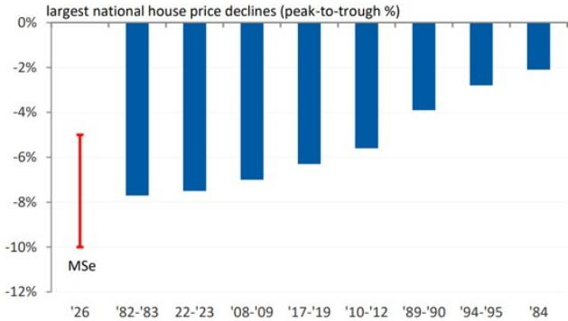

bar

largest national house price declines (peak-to-trough %)
| Period | Decline (%) |
| :--- | :--- |
| '26 | -5.0 |
| '82-'83 | -7.5 |
| '22-'23 | -7.5 |
| '08-'09 | -7.0 |
| '17-'19 | -6.5 |
| '10-'12 | -5.5 |
| '89-'90 | -3.5 |
| '94-'95 | -2.5 |
| '84 | -2.0 |
MSe

Source: Cotality, MS

Exhibit 4: Adjustment will take time - housing sales and building approvals typically lead changes in price growth, while credit growth is a laggard   
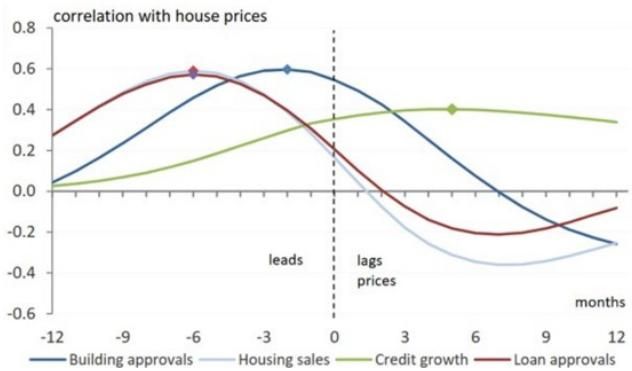

line

| months | Building approvals | Housing sales | Credit growth | Loan approvals |
| ------ | ------------------ | ------------- | ------------- | -------------- |
| -12    | 0.0                | 0.0           | 0.0           | 0.3            |
| -9     | 0.2                | 0.1           | 0.1           | 0.5            |
| -6     | 0.4                | 0.3           | 0.2           | 0.6            |
| -3     | 0.6                | 0.4           | 0.3           | 0.5            |
| 0      | 0.6                | 0.3           | 0.4           | 0.3            |
| 3      | 0.4                | 0.1           | 0.4           | 0.1            |
| 6      | 0.2                | -0.1          | 0.4           | -0.2           |
| 9      | 0.0                | -0.3          | 0.3           | -0.1           |
| 12     | -0.2               | -0.4          | 0.3           | -0.1           |

Source: ABS, Cotality, RBA, MS

Exhibit 6: Falling house prices will have significant wealth effects on households – an important channel to slow demand   
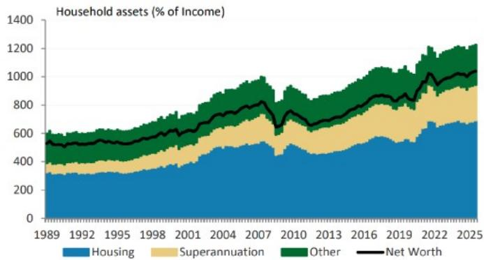

bar_stacked

Household assets (% of Income)
| Year | Housing (%) | Superannuation (%) | Other (%) | Net Worth (%) |
|---|---|---|---|---|
| 1989 | 300 | 100 | 100 | 500 |
| 1992 | 310 | 110 | 110 | 510 |
| 1995 | 320 | 120 | 120 | 520 |
| 1998 | 340 | 130 | 130 | 530 |
| 2001 | 360 | 140 | 140 | 540 |
| 2004 | 380 | 150 | 150 | 550 |
| 2007 | 400 | 160 | 160 | 560 |
| 2010 | 350 | 140 | 170 | 540 |
| 2013 | 370 | 150 | 180 | 550 |
| 2016 | 400 | 160 | 190 | 560 |
| 2019 | 420 | 170 | 200 | 570 |
| 2022 | 450 | 180 | 210 | 580 |
| 2025 | 470 | 190 | 220 | 590 |

Source: APRA, RBA, MS

Exhibit 3: Our expectation of a decline in housing prices suggests that a sharp near-term slowing in turnover is likely, even before direct policy impacts   
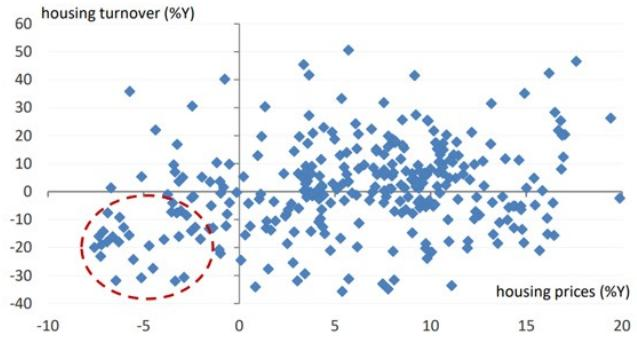

scatter

| housing prices (%Y) | housing turnover (%Y) |
| ------------------- | --------------------- |
| -10                 | -20                   |
| -5                  | -10                   |
| 0                   | 0                     |
| 5                   | 10                    |
| 10                  | 20                    |
| 15                  | 30                    |
| 20                  | 40                    |

Source: Cotality, ABS, MS

Exhibit 5: Even before these tax changes, forward housing indicators were pointing to price declines in response to rate hikes   
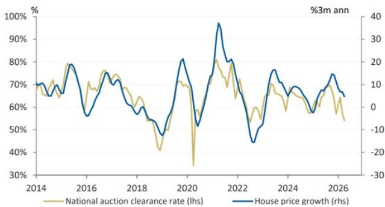

line

| Year | National auction clearance rate (lhs) | House price growth (rhs) |
|------|----------------------------------------|--------------------------|
| 2014 | ~70%                                   | ~10                      |
| 2015 | ~80%                                   | ~15                      |
| 2016 | ~75%                                   | ~5                       |
| 2017 | ~70%                                   | ~10                      |
| 2018 | ~60%                                   | ~5                       |
| 2019 | ~40%                                   | ~-10                     |
| 2020 | ~70%                                   | ~30                      |
| 2021 | ~80%                                   | ~40                      |
| 2022 | ~70%                                   | ~-10                     |
| 2023 | ~60%                                   | ~-5                      |
| 2024 | ~70%                                   | ~10                      |
| 2025 | ~65%                                   | ~5                       |
| 2026 | ~55%                                   | ~15                      |

Source: Cotality, MS

Exhibit 7: Lower asset prices will put upward pressure on savings rates and thus spending   
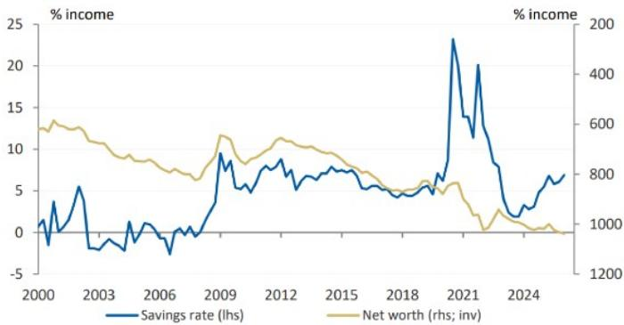

line

| Year | Savings rate (lhs) | Net worth (rhs; inv) |
|------|---------------------|------------------------|
| 2000 | ~1.5                | ~1300                  |
| 2003 | ~-2.5               | ~1100                  |
| 2006 | ~-3.5               | ~900                   |
| 2009 | ~9.5                | ~1150                  |
| 2012 | ~7.5                | ~1050                  |
| 2015 | ~6.5                | ~850                   |
| 2018 | ~5.5                | ~750                   |
| 2021 | ~23.5               | ~600                   |
| 2024 | ~6.5                | ~100                   |

Source: APRA, RBA, MS

# WES / MTS - Hardware: Most Exposed to the Housing Reset

Within our consumer coverage, WES and MTS have the most direct exposure to housing activity through Bunnings and IHG respectively, with both businesses closely linked to residential construction, renovation activity and trade.

Demand across hardware, building products, and DIY categories is typically correlated with dwelling approvals, renovations, and housing turnover, making the near-term outlook for construction activity important.

While repair and maintenance spending is generally more resilient, larger renovation projects and trade activity tend to weaken as housing turnover, approvals and consumer confidence slow.

We lower our SSS growth estimates for hardware exposed names (WES / MTS) and see increasing risk to FY27e consensus expectations.

WES: For WES, \~60% of group profit is attributable to Bunnings. Within Bunnings, \~40% of sales is linked to trade, while \~60% of sales is linked to DIY. Historically DIY has been more resilient vs. trade in periods of housing market weakness. During the last two periods of residential weakness (FY19 and FY23), SSS growth in Bunnings slowed materially vs. prior years. In FY19 SSS growth slowed to 3.9% (vs. the prior 3yr average of \~8%). Likewise, in FY23 SSS growth slowed to 1.8% (vs. the prior 3yr average of \~10%).

MTS: For MTS, \~33% of group profit is attributable to the hardware division. Within hardware, \~60% of sales is linked to trade, while \~40% of sales is linked to DIY, making it more vulnerable vs. Bunnings to a turnover and construction slowdown. For MTS's hardware division (IHG), banner SSS growth slowed to +3.0% in FY19 from +7.4% in FY18. Likewise, in FY23 MTS trade SSS growth slowed to +3.8% from +12.7% in FY22.

Exhibit 8: Bunning SSSg (FY17-27e)   
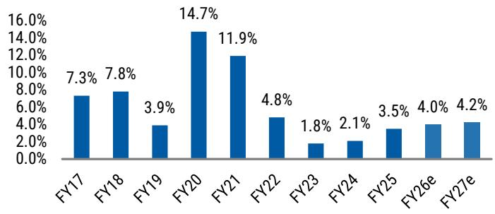

bar

| Fiscal Year | Value (%) |
| :--- | :--- |
| FY17 | 7.3 |
| FY18 | 7.8 |
| FY19 | 3.9 |
| FY20 | 14.7 |
| FY21 | 11.9 |
| FY22 | 4.8 |
| FY23 | 1.8 |
| FY24 | 2.1 |
| FY25 | 3.5 |
| FY26e | 4.0 |
| FY27e | 4.2 |

Source: Company data, e = Visible Alpha consensus estimates.

Exhibit 9: Hardware Category Spending vs. National House Value Growth (Fiscal Half YoY %)   
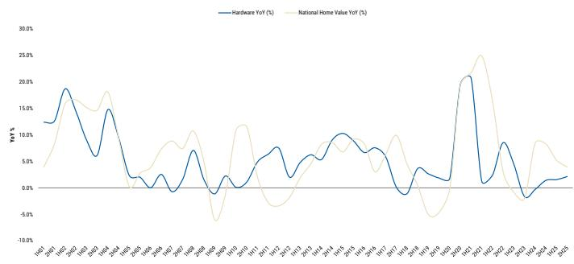  
Source: ABS, CoreLogic, MS

# WES: EW rated; PT A\$78.70/shr

Earnings changes: Given our expectation for house prices and housing-related activity (i.e. turnover, approvals), we trim our FY27e Bunnings SSS growth to 2.0% from 4.0%. We also trim our Bunnings FY27e EBIT margin (now flat YoY) to reflect softening top-line momentum, leaving our FY27e Bunnings EBIT \~2.5% below VA consensus. Bunnings downgrades are offset by upgrades to our WESCEF EBIT estimates (+15% FY27e EBIT) driven by higher fertilizer and ammonia prices (+10-20% YTD).

EW Thesis: We maintain our EW rating on WES. Cyclical weakness in housing is likely to weigh on earnings growth in Bunnings; however, we expect the group's other key exposures (K-MART / WESCEF) to continue to perform strongly. WESCEF should benefit from higher fertilizer and ammonia prices while K-MART remains a trade-down beneficiary in a weaker consumer environment. Valuation remains above mid-cycle at 30x FY27e P/E.

Valuation: We lower our PT marginally from A\$79.30/shr to A\$78.70/shr. Our PT is derived from our equally weighted methodology. SOTP PT based on market multiples is now A\$66.50/shr (vs. A\$68.80/shr previously), with a lower applied target multiple (25x to 24x FY27e P/E) reflective of market multiple declines. Our DCF valuation is now A\$90.90/shr (vs. A\$89.90/shr previously), core assumptions unchanged.

Exhibit 10: WES earnings changes 

<table><tr><td rowspan="2">(A$m)</td><td colspan="3">FY26E</td><td colspan="3">FY27e</td><td colspan="3">FY28e</td></tr><tr><td>Old</td><td>New</td><td>chg</td><td>Old</td><td>New</td><td>chg</td><td>Old</td><td>New</td><td>chg</td></tr><tr><td>Revenue</td><td>47,276</td><td>47,239</td><td>-0.1%</td><td>49,559</td><td>49,507</td><td>-0.1%</td><td>52,112</td><td>51,765</td><td>-0.7%</td></tr><tr><td>EBIT</td><td>4,496</td><td>4,460</td><td>-0.8%</td><td>4,835</td><td>4,849</td><td>0.3%</td><td>5,236</td><td>5,209</td><td>-0.5%</td></tr><tr><td>NPAT</td><td>2,850</td><td>2,825</td><td>-0.9%</td><td>3,072</td><td>3,082</td><td>0.3%</td><td>3,327</td><td>3,308</td><td>-0.6%</td></tr><tr><td>EPS</td><td>251</td><td>249</td><td>-0.9%</td><td>271</td><td>272</td><td>0.3%</td><td>293</td><td>292</td><td>-0.6%</td></tr></table>

Source: e = MS estimates

Exhibit 11: WES 10 year DCF valuation 

<table><tr><td></td><td>FY26e</td><td>FY27e</td><td>FY28e</td><td>FY29e</td><td>FY30e</td><td>FY31e</td><td>FY32e</td><td>FY33e</td><td>FY34e</td><td>FY35e</td></tr><tr><td>Sales</td><td>49,507</td><td>51,765</td><td>54,271</td><td>56,442</td><td>58,699</td><td>61,047</td><td>63,489</td><td>66,029</td><td>68,670</td><td>71,417</td></tr><tr><td>Growth</td><td>4.8%</td><td>4.6%</td><td>4.8%</td><td>4.0%</td><td>4.0%</td><td>4.0%</td><td>4.0%</td><td>4.0%</td><td>4.0%</td><td>4.0%</td></tr><tr><td>EBIT</td><td>4,849</td><td>5,209</td><td>5,588</td><td>5,868</td><td>6,162</td><td>6,408</td><td>6,664</td><td>6,931</td><td>7,208</td><td>7,496</td></tr><tr><td>Growth</td><td>8.7%</td><td>7.4%</td><td>7.3%</td><td>5.0%</td><td>5.0%</td><td>4.0%</td><td>4.0%</td><td>4.0%</td><td>4.0%</td><td>4.0%</td></tr><tr><td>Margin</td><td>9.8%</td><td>10.1%</td><td>10.3%</td><td>10.4%</td><td>10.5%</td><td>10.5%</td><td>10.5%</td><td>10.5%</td><td>10.5%</td><td>10.5%</td></tr><tr><td>Less: Tax</td><td>-1,455</td><td>-1,563</td><td>-1,676</td><td>-1,760</td><td>-1,848</td><td>-1,922</td><td>-1,999</td><td>-2,079</td><td>-2,162</td><td>-2,249</td></tr><tr><td>Less: AASB16 Int exp</td><td>-289</td><td>-294</td><td>-299</td><td>-308</td><td>-318</td><td>-327</td><td>-337</td><td>-347</td><td>-358</td><td>-368</td></tr><tr><td>Add: D&amp;A ex ROA</td><td>718</td><td>746</td><td>776</td><td>799</td><td>823</td><td>847</td><td>873</td><td>899</td><td>926</td><td>954</td></tr><tr><td>Add: Working capital</td><td>-165</td><td>-164</td><td>-182</td><td>-20</td><td>-3</td><td>-3</td><td>-3</td><td>-3</td><td>-4</td><td>-4</td></tr><tr><td>Working capital/Sales</td><td>-0.3%</td><td>-0.3%</td><td>-0.3%</td><td>0.0%</td><td>0.0%</td><td>0.0%</td><td>0.0%</td><td>0.0%</td><td>0.0%</td><td>0.0%</td></tr><tr><td>Less: Net Capex</td><td>-1,104</td><td>-1,128</td><td>-1,159</td><td>-1,016</td><td>-1,027</td><td>-1,038</td><td>-1,048</td><td>-1,056</td><td>-1,064</td><td>-1,071</td></tr><tr><td>- Capex/D&amp;A</td><td>-153.7%</td><td>-151.2%</td><td>-149.4%</td><td>-127.2%</td><td>-124.9%</td><td>-122.5%</td><td>-120.0%</td><td>-117.5%</td><td>-114.9%</td><td>-112.3%</td></tr><tr><td>- Capex/Sales</td><td>-2.2%</td><td>-2.2%</td><td>-2.1%</td><td>-1.8%</td><td>-1.8%</td><td>-1.7%</td><td>-1.7%</td><td>-1.6%</td><td>-1.6%</td><td>-1.5%</td></tr><tr><td>Free Cash Flow</td><td>2,556</td><td>2,806</td><td>3,047</td><td>3,562</td><td>3,788</td><td>3,965</td><td>4,150</td><td>4,344</td><td>4,546</td><td>4,758</td></tr><tr><td>Growth</td><td>-10%</td><td>10%</td><td>9%</td><td>17%</td><td>6%</td><td>5%</td><td>5%</td><td>5%</td><td>5%</td><td>5%</td></tr><tr><td colspan="2">Discounted free cash flow</td><td colspan="9">Key assumptions</td></tr><tr><td>Total discounted free cash flow</td><td>26,780</td><td colspan="3">Risk free rate</td><td>5%</td><td colspan="3">Tax rate</td><td colspan="2">30.0%</td></tr><tr><td>PV of perpetual free cashflow</td><td>81,899</td><td colspan="3">Equity market risk premium</td><td>5%</td><td colspan="3">Cost of debt (after tax)</td><td colspan="2">3.5%</td></tr><tr><td>Total PV free cash flows</td><td>108,679</td><td colspan="3">Net debt/net debt + equity ratio</td><td>30%</td><td colspan="3">WACC</td><td colspan="2">7.2%</td></tr><tr><td>Net Debt</td><td>-5,491</td><td colspan="3">Equity beta</td><td>76%</td><td colspan="3">Terminal growth rate</td><td colspan="2">4.0%</td></tr><tr><td>Total Company equity value</td><td>103,188</td><td colspan="3">Cost of equity</td><td>9%</td><td colspan="3"></td><td colspan="2"></td></tr><tr><td>Number of shs on issue</td><td>1,135</td><td colspan="9"></td></tr><tr><td>NPV per share</td><td>90.9</td><td colspan="9"></td></tr></table>

Source: e = MS estimates

Exhibit 12: WES 12M Fwd Cons P/E of 29x, is +1Std above mid-cycle   
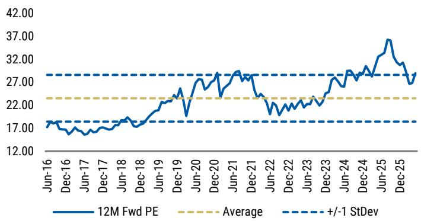

line

| Date    | 12M Fwd PE | Average | +/-1 StDev |
|---------|------------|---------|------------|
| Jun-16  | 17.00      | 22.00   | 27.00      |
| Dec-16  | 16.50      | 22.00   | 27.00      |
| Jun-17  | 16.80      | 22.00   | 27.00      |
| Dec-17  | 17.20      | 22.00   | 27.00      |
| Jun-18  | 17.50      | 22.00   | 27.00      |
| Dec-18  | 18.00      | 22.00   | 27.00      |
| Jun-19  | 20.00      | 22.00   | 27.00      |
| Dec-19  | 22.00      | 22.00   | 27.00      |
| Jun-20  | 24.00      | 22.00   | 27.00      |
| Dec-20  | 26.00      | 22.00   | 27.00      |
| Jun-21  | 28.00      | 22.00   | 27.00      |
| Dec-21  | 26.00      | 22.00   | 27.00      |
| Jun-22  | 24.00      | 22.00   | 27.00      |
| Dec-22  | 26.00      | 22.00   | 27.00      |
| Jun-23  | 28.00      | 22.00   | 27.00      |
| Dec-23  | 30.00      | 22.00   | 27.00      |
| Jun-24  | 32.00      | 22.00   | 27.00      |
| Dec-24  | 34.00      | 22.00   | 27.00      |
| Jun-25  | 36.00      | 22.00   | 27.00      |
| Dec-25  | 34.00      | 22.00   | 27.00      |

Source: Factset, IBES Consensus Estimates, MS

Exhibit 13: WES 12M Fwd Cons ASX200 Index Financial relative P/E is 143%, greater than +1 Std above mid-cycle   
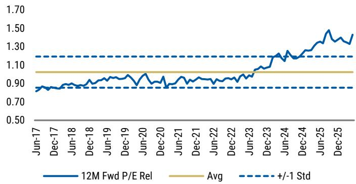

line

| Date    | 12M Fwd P/E Rel | Avg  | +/-1 Std |
|---------|-----------------|------|----------|
| Jun-17  | 0.85            | 0.95 | 1.15     |
| Dec-17  | 0.88            | 0.95 | 1.15     |
| Jun-18  | 0.90            | 0.95 | 1.15     |
| Dec-18  | 0.92            | 0.95 | 1.15     |
| Jun-19  | 0.94            | 0.95 | 1.15     |
| Dec-19  | 0.96            | 0.95 | 1.15     |
| Jun-20  | 0.98            | 0.95 | 1.15     |
| Dec-20  | 0.96            | 0.95 | 1.15     |
| Jun-21  | 0.98            | 0.95 | 1.15     |
| Dec-21  | 0.96            | 0.95 | 1.15     |
| Jun-22  | 0.98            | 0.95 | 1.15     |
| Dec-22  | 0.96            | 0.95 | 1.15     |
| Jun-23  | 1.00            | 0.95 | 1.15     |
| Dec-23  | 1.05            | 0.95 | 1.15     |
| Jun-24  | 1.10            | 0.95 | 1.15     |
| Dec-24  | 1.15            | 0.95 | 1.15     |
| Jun-25  | 1.20            | 0.95 | 1.15     |
| Dec-25  | 1.30            | 0.95 | 1.15     |

Source: Factset, IBES Consensus Estimates, MS

# MTS: EW rated; PT A\$3.20/shr

Earnings changes: FY26 is de-risked given recently issued guidance. We expect FY27 to prove more challenging for hardware, with uncertainty around the margin rebuild profile presenting downside risk to divisional earnings. We trim FY27–28e hardware divisional sales growth and margin assumptions, lowering Group EPS by 1.9% and 4.5%, respectively.

EW thesis: Negative housing sentiment and lower expected house prices and turnover push out the cycle recovery in housing-related construction activity, weighing on hardware earnings. We expect competitive pressures to remain in Food & Liquor. We reiterate our EW rating as these risks are reflected in the current valuation. MTS is trading at a 12mth fwd P/E of 12x, 1-SD below mid-cycle valuations.

Valuation: We lower our PT to A\$3.20/shr (from A\$3.40/shr), derived from our equally weighted methodology. P/E-based valuation of A\$3.10/shr (old A\$3.4/shr), where we lower the applied target multiple from 13x to 12x, slightly above –1s.d. below mid-cycle, reflective of a softer housing outlook. DCF-based PT of A\$3.40/shr (from A\$3.50/shr), core assumptions unchanged.

Exhibit 14: MTS earnings changes 

<table><tr><td rowspan="2">A$m</td><td colspan="3">FY26e</td><td colspan="3">FY27e</td><td colspan="3">FY28e</td></tr><tr><td>Old</td><td>New</td><td>Chg.</td><td>Old</td><td>New</td><td>Chg.</td><td>Old</td><td>New</td><td>Chg.</td></tr><tr><td>Sales</td><td>19,651</td><td>19,629</td><td>-0.1%</td><td>20,248</td><td>20,156</td><td>-0.5%</td><td>20,777</td><td>20,678</td><td>-0.5%</td></tr><tr><td>Group EBIT</td><td>502</td><td>503</td><td>0.1%</td><td>528</td><td>524</td><td>-0.7%</td><td>570</td><td>554</td><td>-2.9%</td></tr><tr><td>NPAT</td><td>268</td><td>269</td><td>0.3%</td><td>288</td><td>283</td><td>-1.9%</td><td>317</td><td>303</td><td>-4.5%</td></tr><tr><td>EPS</td><td>24.4</td><td>24.4</td><td>0.25%</td><td>26.1</td><td>25.6</td><td>-1.9%</td><td>28.8</td><td>27.5</td><td>-4.5%</td></tr></table>

Source: e = MS estimates

Exhibit 15: MTS 10 year DCF valuation 

<table><tr><td colspan="2">DCF Valuation</td><td>FY26e</td><td>FY27e</td><td>FY28e</td><td>FY29e</td><td>FY30e</td><td>FY31e</td><td>FY32e</td><td>FY33e</td><td>FY34e</td><td>FY35e</td><td>FY36e</td></tr><tr><td>Sales</td><td></td><td>19,629</td><td>20,156</td><td>20,678</td><td>21,216</td><td>21,762</td><td>22,321</td><td>22,894</td><td>23,482</td><td>24,086</td><td>24,705</td><td>25,340</td></tr><tr><td>growth%</td><td></td><td>0.7%</td><td>2.7%</td><td>2.6%</td><td>2.6%</td><td>2.6%</td><td>2.6%</td><td>2.6%</td><td>2.6%</td><td>2.6%</td><td>2.6%</td><td>2.6%</td></tr><tr><td>EBIT</td><td></td><td>503</td><td>524</td><td>554</td><td>610</td><td>627</td><td>644</td><td>660</td><td>677</td><td>694</td><td>712</td><td>731</td></tr><tr><td>margin %</td><td></td><td>2.6%</td><td>2.6%</td><td>2.7%</td><td>2.9%</td><td>2.9%</td><td>2.9%</td><td>2.9%</td><td>2.9%</td><td>2.9%</td><td>2.9%</td><td>2.9%</td></tr><tr><td>growth%</td><td></td><td>-1.0%</td><td>4.3%</td><td>5.7%</td><td>10.1%</td><td>2.9%</td><td>2.6%</td><td>2.6%</td><td>2.6%</td><td>2.6%</td><td>2.6%</td><td>2.6%</td></tr><tr><td>Less tax</td><td></td><td>(109)</td><td>(116)</td><td>(124)</td><td>(140)</td><td>(145)</td><td>(193)</td><td>(198)</td><td>(203)</td><td>(208)</td><td>(214)</td><td>(219)</td></tr><tr><td>Less: AASB16 Int exp</td><td></td><td>(54)</td><td>(56)</td><td>(58)</td><td>(59)</td><td>(61)</td><td>(63)</td><td>(65)</td><td>(67)</td><td>(69)</td><td>(71)</td><td>(73)</td></tr><tr><td>Add: D&amp;A ex ROA</td><td></td><td>105</td><td>108</td><td>111</td><td>114</td><td>117</td><td>120</td><td>124</td><td>128</td><td>132</td><td>136</td><td>140</td></tr><tr><td>Less working capital chg</td><td></td><td>(7)</td><td>(18)</td><td>(18)</td><td>(18)</td><td>(19)</td><td>(19)</td><td>(20)</td><td>(20)</td><td>(21)</td><td>(21)</td><td>(22)</td></tr><tr><td>Working capital/Sales</td><td></td><td>0.0%</td><td>-0.1%</td><td>-0.1%</td><td>-0.1%</td><td>-0.1%</td><td>-0.1%</td><td>-0.1%</td><td>-0.1%</td><td>-0.1%</td><td>-0.1%</td><td>-0.1%</td></tr><tr><td>Less: Capex</td><td></td><td>(170)</td><td>(200)</td><td>(200)</td><td>(200)</td><td>(200)</td><td>(206)</td><td>(212)</td><td>(219)</td><td>(225)</td><td>(232)</td><td>(239)</td></tr><tr><td>Capex/D&amp;A</td><td></td><td>1.6x</td><td>1.8x</td><td>1.8x</td><td>1.8x</td><td>1.7x</td><td>1.7x</td><td>1.7x</td><td>1.7x</td><td>1.7x</td><td>1.7x</td><td>1.7x</td></tr><tr><td>CapEx/Sales</td><td></td><td>0.9%</td><td>1.0%</td><td>1.0%</td><td>0.9%</td><td>0.9%</td><td>0.9%</td><td>0.9%</td><td>0.9%</td><td>0.9%</td><td>0.9%</td><td>0.9%</td></tr><tr><td>Free cash flow</td><td></td><td>269</td><td>243</td><td>265</td><td>306</td><td>319</td><td>283</td><td>289</td><td>296</td><td>303</td><td>310</td><td>318</td></tr><tr><td>Total discounted free cash flows</td><td>1,799</td><td colspan="11">Key assumptions</td></tr><tr><td>PV of perpetual free cash flow</td><td>2,570</td><td colspan="3">Risk free rate</td><td>5.0%</td><td></td><td colspan="3">Cost of debt (before tax)</td><td>5.0%</td><td></td><td></td></tr><tr><td>Total present value free cash flow</td><td>4,369</td><td colspan="3">Equity market risk premium</td><td>5.0%</td><td></td><td colspan="3">Tax rate</td><td>30.0%</td><td></td><td></td></tr><tr><td>Net Debt / (net cash)</td><td>627</td><td colspan="3">Net debt/net debt + equity ratio</td><td>20.0%</td><td></td><td colspan="3">Cost of debt (after tax)</td><td>3.5%</td><td></td><td></td></tr><tr><td>Less minority interest</td><td>(0)</td><td colspan="3">Equity Beta</td><td>1</td><td></td><td colspan="3">WACC</td><td>8.9%</td><td></td><td></td></tr><tr><td>Total company Equity Value</td><td>3,741</td><td colspan="3">Cost of equity</td><td>10.3%</td><td></td><td colspan="3">Terminal growth rate</td><td>3.0%</td><td></td><td></td></tr><tr><td>Number of shs issue</td><td>1,102</td><td></td><td></td><td></td><td></td><td></td><td></td><td></td><td></td><td></td><td></td><td></td></tr><tr><td>Value at 12 Months</td><td>3.4</td><td></td><td></td><td></td><td></td><td></td><td></td><td></td><td></td><td></td><td></td><td></td></tr></table>

Source: e = MS estimates

Exhibit 16: MTS 12M Fwd Cons P/E of 11.8x, is -1Std above mid-cycle   
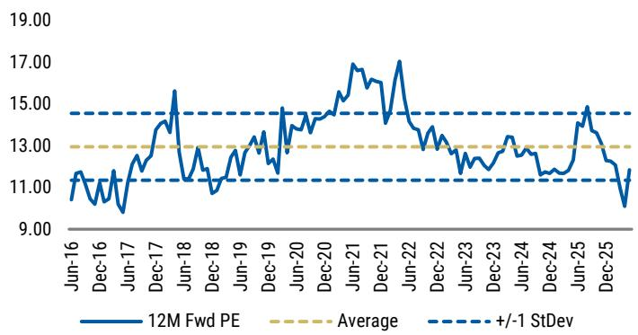

line

| Date    | 12M Fwd PE | Average | +/-1 StDev |
|---------|------------|---------|------------|
| Jun-16  | ~11.5      | 13.0    | 15.0       |
| Dec-16  | ~11.0      | 13.0    | 15.0       |
| Jun-17  | ~10.5      | 13.0    | 15.0       |
| Dec-17  | ~13.5      | 13.0    | 15.0       |
| Jun-18  | ~15.5      | 13.0    | 15.0       |
| Dec-18  | ~11.5      | 13.0    | 15.0       |
| Jun-19  | ~12.5      | 13.0    | 15.0       |
| Dec-19  | ~13.5      | 13.0    | 15.0       |
| Jun-20  | ~14.5      | 13.0    | 15.0       |
| Dec-20  | ~15.5      | 13.0    | 15.0       |
| Jun-21  | ~17.0      | 13.0    | 15.0       |
| Dec-21  | ~16.5      | 13.0    | 15.0       |
| Jun-22  | ~17.5      | 13.0    | 15.0       |
| Dec-22  | ~13.5      | 13.0    | 15.0       |
| Jun-23  | ~12.5      | 13.0    | 15.0       |
| Dec-23  | ~13.0      | 13.0    | 15.0       |
| Jun-24  | ~12.5      | 13.0    | 15.0       |
| Dec-24  | ~13.5      | 13.0    | 15.0       |
| Jun-25  | ~14.5      | 13.0    | 15.0       |
| Dec-25  | ~9.5       | 13.0    | 15.0       |

Source: Factset, IBES Consensus Estimates, MS

Exhibit 17: MTS 12M Fwd Cons ASX200 Ind ex Financial relative P/E is 58%, in-line with mid-cycle   
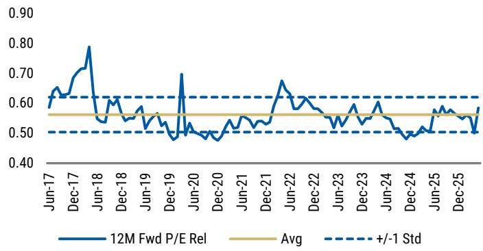

line

| Date    | 12M Fwd P/E Rel | Avg  | +/-  Std |
|---------|-----------------|------|----------|
| Jun-17  | ~0.65           | ~0.55| ~0.50    |
| Dec-17  | ~0.70           | ~0.55| ~0.50    |
| Jun-18  | ~0.80           | ~0.55| ~0.50    |
| Dec-18  | ~0.55           | ~0.55| ~0.50    |
| Jun-19  | ~0.55           | ~0.55| ~0.50    |
| Dec-19  | ~0.70           | ~0.55| ~0.50    |
| Jun-20  | ~0.50           | ~0.55| ~0.50    |
| Dec-20  | ~0.50           | ~0.55| ~0.50    |
| Jun-21  | ~0.65           | ~0.55| ~0.50    |
| Dec-21  | ~0.65           | ~0.55| ~0.50    |
| Jun-22  | ~0.60           | ~0.55| ~0.50    |
| Dec-22  | ~0.60           | ~0.55| ~0.50    |
| Jun-23  | ~0.60           | ~0.55| ~0.50    |
| Dec-23  | ~0.60           | ~0.55| ~0.50    |
| Jun-24  | ~0.60           | ~0.55| ~0.50    |
| Dec-24  | ~0.50           | ~0.55| ~0.50    |
| Jun-25  | ~0.60           | ~0.55| ~0.50    |
| Dec-25  | ~0.60           | ~0.55| ~0.50    |

Source: Factset, IBES Consensus Estimates, MS

# JBH / HVN - Big ticket discretionary: Housing cycle a headwind for demand

JBH and HVN are exposed to the downstream consumer and wealth effect channels of housing. Both benefit from appliance and electronics demand associated with house moves, renovations and elevated discretionary spending - all of which we see coming under pressure.

Likewise, HVN is also exposed to the furniture and bedding categories, which are tied to household formation and housing turnover.

More broadly, softer housing prices and weaker turnover are likely to weigh on consumer sentiment and household wealth perceptions, which historically has translated into weaker demand across discretionary retail categories.

We lower our SSS growth estimates for big ticket / housing-linked discretionary retailers (JBH / HVN) and see increasing risk to FY27e consensus expectations.

JBH: During the last two periods of residential weakness (FY19 and FY23), SSS growth in The Good Guys was weak (+0.9% and +0.8%). JBH Australia showed a similar decelerating trend in FY19 (+2.8% vs. the prior 3yr average of \~7%), but was relatively resilient in FY23 (+4.8%, driven by elevated demand for electronics post-Covid).

HVN: Over-indexes to housing-related categories including white goods, flooring and outdoor furniture, giving it both a direct turnover channel and wealth-effect exposure. For HVN, similar trends to JBH were observed in the last housing downturn. In FY19, domestic SSS growth slowed to -0.9% (vs. the prior 3-year average of \~4%). Likewise, in FY23 SSS growth slowed to -5.1% (vs. the prior 3-year average of \~7%).

Exhibit 18: JBH Australia; TGG and HVN SSS growth   
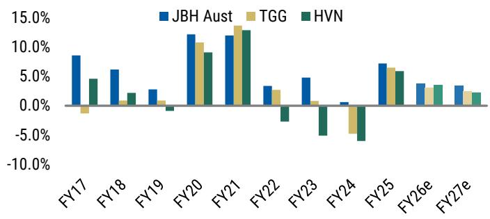

bar

| Fiscal Year | JBH Aust | TGG   | HVN   |
|-------------|----------|-------|-------|
| FY17        | 8.5%     | -2.0% | 4.5%  |
| FY18        | 6.0%     | 1.0%  | 2.0%  |
| FY19        | 2.5%     | 0.5%  | -1.0% |
| FY20        | 12.0%    | 10.5% | 9.0%  |
| FY21        | 11.5%    | 13.5% | 12.5% |
| FY22        | 3.0%     | 2.5%  | -3.0% |
| FY23        | 4.5%     | 0.5%  | -5.0% |
| FY24        | 0.5%     | -5.0% | -6.0% |
| FY25        | 7.0%     | 6.0%  | 5.5%  |
| FY26e       | 3.5%     | 2.5%  | 3.0%  |
| FY27e       | 3.0%     | 2.0%  | 1.5%  |

Source: Company data, e = Visible Alpha consensus estimates

Exhibit 19: Discretionary Category Spending vs. National House Value Growth (Fiscal Half YoY %)   
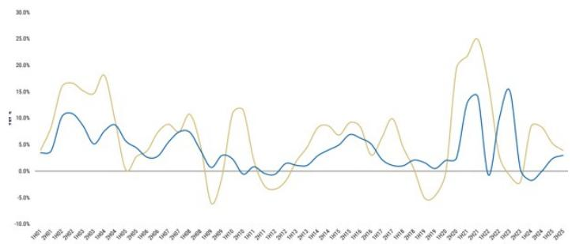

line

| Year | Series 1 | Series 2 |
|------|----------|----------|
| 1997 | 3.0%     | 4.0%     |
| 1998 | 6.0%     | 10.0%    |
| 1999 | 8.0%     | 12.0%    |
| 2000 | 5.0%     | 8.0%     |
| 2001 | 7.0%     | 15.0%    |
| 2002 | 10.0%    | 18.0%    |
| 2003 | 6.0%     | 16.0%    |
| 2004 | 8.0%     | 14.0%    |
| 2005 | 4.0%     | 10.0%    |
| 2006 | 3.0%     | 8.0%     |
| 2007 | 5.0%     | 12.0%    |
| 2008 | 7.0%     | 15.0%    |
| 2009 | 3.0%     | 8.0%     |
| 2010 | 2.0%     | 5.0%     |
| 2011 | 1.0%     | 3.0%     |
| 2012 | 2.0%     | 4.0%     |
| 2013 | 3.0%     | 6.0%     |
| 2014 | 4.0%     | 8.0%     |
| 2015 | 5.0%     | 10.0%    |
| 2016 | 6.0%     | 8.0%     |
| 2017 | 4.0%     | 6.0%     |
| 2018 | 3.0%     | 4.0%     |
| 2019 | 2.0%     | 3.0%     |
| 2020 | 1.0%     | 2.0%     |
| 2021 | 15.0%    | 25.0%    |
| 2022 | -1.0%    | -5.0%    |
| 2023 | -3.0%    | -8.0%    |

Source: ABS, CoreLogic, MS

# JBH: UW rated; PT A\$66.50/shr

Earnings changes: Given our expectation for weaker house prices and the wealth-effect drag on discretionary spending, we trim our FY27e JBH Australia SSS growth to 2.5% from 4.0% and TGG SSS growth to 1.5% from 3.0%. We also trim FY27e divisional EBIT margins. Combined, this puts our FY27e EBIT \~4.0% below VA Cons.

UW Thesis: Valuation is still above mid-cycle averages, which we see as not adequately reflecting two compounding risks: a housing-led demand slowdown weighing on volumes across both banners, and surging memory component costs driving ASP inflation across electronics, pressuring both volumes and GP margins. Reiterate UW rating.

Earnings changes & valuation: We lower our PT from A\$68.80/shr to A\$66.50/shr. Our PT is derived from our equally weighted methodology (50/50 P/E and DCF valuation). P/E valuation is now A\$54.60/shr (vs A\$56.60/shr previously), our applied target multiple remains unchanged at 12.5x, -1std below mid-cycle. Our DCF valuation reduced to A \$78.40/shr (old A\$81.00/shr), driven by earning changes outlined below. Core assumptions remain unchanged.

Exhibit 20: JBH earnings changes 

<table><tr><td rowspan="2"></td><td rowspan="2">Unit</td><td colspan="3">FY26e</td><td colspan="3">FY27e</td><td colspan="3">FY28e</td></tr><tr><td>Old</td><td>New</td><td>Chg</td><td>Old</td><td>New</td><td>Chg</td><td>Old</td><td>New</td><td>Chg</td></tr><tr><td>Sales</td><td>A$m</td><td>11,133</td><td>11,133</td><td>0.0%</td><td>11,549</td><td>11,444</td><td>-0.9%</td><td>12,034</td><td>11,925</td><td>-0.9%</td></tr><tr><td>EBITDA</td><td>A$m</td><td>1,012</td><td>1,012</td><td>0.0%</td><td>1,021</td><td>998</td><td>-2.3%</td><td>1,066</td><td>1,042</td><td>-2.2%</td></tr><tr><td>EBIT</td><td>A$m</td><td>744</td><td>744</td><td>0.0%</td><td>746</td><td>723</td><td>-3.1%</td><td>783</td><td>759</td><td>-3.1%</td></tr><tr><td>NPAT</td><td>A$m</td><td>496</td><td>496</td><td>0.0%</td><td>496</td><td>480</td><td>-3.2%</td><td>521</td><td>504</td><td>-3.2%</td></tr><tr><td>EPS</td><td>(c)</td><td>452</td><td>452</td><td>0.0%</td><td>452</td><td>437</td><td>-3.2%</td><td>475</td><td>460</td><td>-3.2%</td></tr></table>

Source: e = MS estimates

Exhibit 21: JBH 10 year DCF valuation 

<table><tr><td></td><td>FY27E</td><td>FY28E</td><td>FY29E</td><td>FY30E</td><td>FY31E</td><td>FY32E</td><td>FY33E</td><td>FY34E</td><td>FY35E</td><td>FY36E</td></tr><tr><td>Sales</td><td>11,444</td><td>11,925</td><td>12,343</td><td>12,775</td><td>13,222</td><td>13,685</td><td>14,164</td><td>14,659</td><td>15,172</td><td>15,703</td></tr><tr><td>- growth</td><td>2.8%</td><td>4.2%</td><td>3.5%</td><td>3.5%</td><td>3.5%</td><td>3.5%</td><td>3.5%</td><td>3.5%</td><td>3.5%</td><td>3.5%</td></tr><tr><td>EBIT</td><td>723</td><td>759</td><td>786</td><td>814</td><td>842</td><td>871</td><td>902</td><td>934</td><td>966</td><td>1,000</td></tr><tr><td>growth</td><td>-3%</td><td>5.1%</td><td>3.5%</td><td>3.5%</td><td>3.5%</td><td>3.5%</td><td>3.5%</td><td>3.5%</td><td>3.5%</td><td>3.5%</td></tr><tr><td>margin</td><td>6.3%</td><td>6.4%</td><td>6.4%</td><td>6.4%</td><td>6.4%</td><td>6.4%</td><td>6.4%</td><td>6.4%</td><td>6.4%</td><td>6.4%</td></tr><tr><td>Less: Tax</td><td>(207)</td><td>(217)</td><td>(228)</td><td>(244)</td><td>(253)</td><td>(261)</td><td>(271)</td><td>(280)</td><td>(290)</td><td>(300)</td></tr><tr><td>Less: AASB16 int exp</td><td>(40)</td><td>(41)</td><td>(42)</td><td>(44)</td><td>(45)</td><td>(46)</td><td>(48)</td><td>(49)</td><td>(51)</td><td>(52)</td></tr><tr><td>Add: D&amp;A (ex right of use D&amp;A)</td><td>78</td><td>85</td><td>92</td><td>95</td><td>98</td><td>101</td><td>104</td><td>107</td><td>110</td><td>113</td></tr><tr><td>Less: Working capital chg</td><td>(19)</td><td>(27)</td><td>(29)</td><td>(30)</td><td>(31)</td><td>(32)</td><td>(33)</td><td>(34)</td><td>(35)</td><td>(36)</td></tr><tr><td>- Working capital/Sales</td><td>-0.2%</td><td>-0.2%</td><td>-0.2%</td><td>-0.2%</td><td>-0.2%</td><td>-0.2%</td><td>-0.2%</td><td>-0.2%</td><td>-0.2%</td><td>-0.2%</td></tr><tr><td>Less: Capex</td><td>(97)</td><td>(101)</td><td>(106)</td><td>(109)</td><td>(112)</td><td>(115)</td><td>(119)</td><td>(122)</td><td>(126)</td><td>(130)</td></tr><tr><td>- Capex/D&amp;A</td><td>1.2x</td><td>1.2x</td><td>1.1x</td><td>1.1x</td><td>1.1x</td><td>1.1x</td><td>1.1x</td><td>1.1x</td><td>1.1x</td><td>1.1x</td></tr><tr><td>Free Cash Flow</td><td>438</td><td>457</td><td>473</td><td>482</td><td>499</td><td>517</td><td>536</td><td>555</td><td>574</td><td>595</td></tr><tr><td>- growth</td><td>-0.5%</td><td>4.4%</td><td>3.6%</td><td>1.9%</td><td>3.6%</td><td>3.6%</td><td>3.6%</td><td>3.6%</td><td>3.6%</td><td>3.6%</td></tr><tr><td>Total discounted free cash flow</td><td>3,385</td><td colspan="9">Key assumptions</td></tr><tr><td>PV of perpetual free cash flow</td><td>4,951</td><td colspan="3">Risk free rate</td><td>5.0%</td><td colspan="4">Cost of debt (before tax)</td><td>5.0%</td></tr><tr><td>Total present value free cash flow</td><td>8,336</td><td colspan="3">Equity market risk premium</td><td>5.0%</td><td colspan="4">Tax rate</td><td>30.0%</td></tr><tr><td>Net Debt</td><td>(273)</td><td colspan="3">Net debt/net debt + equity ratio</td><td>15.0%</td><td colspan="4">Cost of debt (after tax)</td><td>3.5%</td></tr><tr><td>Less minority interest</td><td>-</td><td colspan="3">Equity beta</td><td>1.0</td><td colspan="4">WACC</td><td>9.0%</td></tr><tr><td>Total company Equity Value</td><td>8,608</td><td colspan="3">Cost of equity</td><td>10.0%</td><td colspan="4">Terminal growth rate</td><td>3.5%</td></tr><tr><td>Number of shs on issue</td><td>110</td><td colspan="9"></td></tr><tr><td>NPV per share</td><td>78.4</td><td colspan="9"></td></tr></table>

Source: e = MS estimates

Exhibit 22: JBH 12M Fwd Cons P/E of 16.1x, is +1Std above mid-cycle   
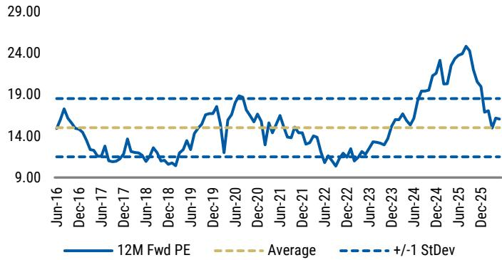

line

| Date    | 12M Fwd PE | Average | +/-1 StDev |
|---------|------------|---------|------------|
| Jun-16  | 18.0       | 14.0    | 19.0       |
| Dec-16  | 14.0       | 14.0    | 19.0       |
| Jun-17  | 13.0       | 14.0    | 19.0       |
| Dec-17  | 13.5       | 14.0    | 19.0       |
| Jun-18  | 13.0       | 14.0    | 19.0       |
| Dec-18  | 12.5       | 14.0    | 19.0       |
| Jun-19  | 13.5       | 14.0    | 19.0       |
| Dec-19  | 17.0       | 14.0    | 19.0       |
| Jun-20  | 19.0       | 14.0    | 19.0       |
| Dec-20  | 16.0       | 14.0    | 19.0       |
| Jun-21  | 14.5       | 14.0    | 19.0       |
| Dec-21  | 13.5       | 14.0    | 19.0       |
| Jun-22  | 12.5       | 14.0    | 19.0       |
| Dec-22  | 13.0       | 14.0    | 19.0       |
| Jun-23  | 13.5       | 14.0    | 19.0       |
| Dec-23  | 15.0       | 14.0    | 19.0       |
| Jun-24  | 17.0       | 14.0    | 19.0       |
| Dec-24  | 20.0       | 14.0    | 19.0       |
| Jun-25  | 24.0       | 14.0    | 19.0       |
| Dec-25  | 15.0       | 14.0    | 19.0       |

Source: Factset, IBES Consensus Estimates, MS

Exhibit 23: JBH 12M Fwd Cons ASX200 Ind ex Financial relative P/E is 79%, +1Std above mid-cycle   
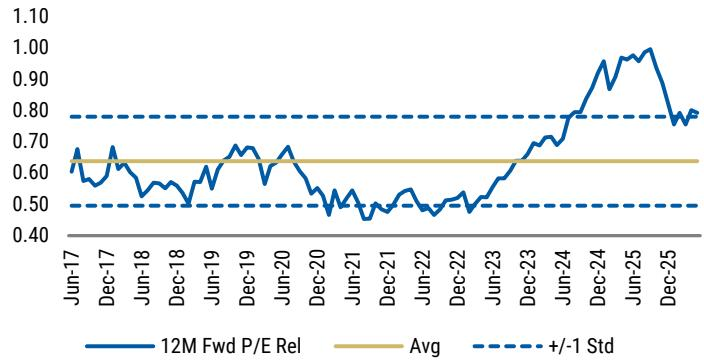

line

| Date    | 12M Fwd P/E Rel | Avg  | +/- Std |
|---------|-----------------|------|---------|
| Jun-17  | 0.65            | 0.65 | 0.80    |
| Dec-17  | 0.60            | 0.65 | 0.80    |
| Jun-18  | 0.55            | 0.65 | 0.80    |
| Dec-18  | 0.50            | 0.65 | 0.80    |
| Jun-19  | 0.60            | 0.65 | 0.80    |
| Dec-19  | 0.65            | 0.65 | 0.80    |
| Jun-20  | 0.60            | 0.65 | 0.80    |
| Dec-20  | 0.55            | 0.65 | 0.80    |
| Jun-21  | 0.45            | 0.65 | 0.80    |
| Dec-21  | 0.50            | 0.65 | 0.80    |
| Jun-22  | 0.45            | 0.65 | 0.80    |
| Dec-22  | 0.50            | 0.65 | 0.80    |
| Jun-23  | 0.60            | 0.65 | 0.80    |
| Dec-23  | 0.70            | 0.65 | 0.80    |
| Jun-24  | 0.80            | 0.65 | 0.80    |
| Dec-24  | 1.00            | 0.65 | 0.80    |
| Jun-25  | 1.10            | 0.65 | 0.80    |
| Dec-25  | 0.75            | 0.65 | 0.80    |

Source: Factset, IBES Consensus Estimates, MS

# HVN: EW rated; PT A\$4.70/shr

Earnings changes: Given our expectation for weaker house prices and lower housing turnover, which directly impacts demand across HVN's housing-related categories (white goods, flooring, furniture), we trim our FY27e domestic SSS growth to +1.5% from +3.8%. We also trim Australia divisional margins to reflect an increase in Franchisee support. Combined, this sees our FY27e EBIT \~4% below VA Cons.

Equal weight thesis: Valuation is closer to trough-cycle multiples, reflecting a historically volatile earnings profile through housing downturns. This limits absolute downside but does not remove the earnings risk, with some additional margin pressure from component cost inflation across electronics. Property earnings account for \~30% of Group EBIT and provide a partial offset.

Valuation: We lower our PT to A\$4.70/shr from A\$5.40/shr. Our PT is derived from our equally weighted methodology (50/50 P/E and DCF valuation). P/E valuation is lowered to A\$3.94/shr (vs. A\$4.26/shr previously), and our applied target multiple remains 11x, which is -1 Std below mid-cycle. Our DCF valuation is lowered to A\$5.40/shr (vs. A\$6.60/shr previously), driven by our earnings downgrades. Core assumptions unchanged.

Exhibit 24: HVN earning changes 

<table><tr><td rowspan="2"></td><td rowspan="2">Unit</td><td colspan="3">FY26e</td><td colspan="3">FY27e</td><td colspan="3">FY28e</td></tr><tr><td>Old</td><td>New</td><td>Chg</td><td>Old</td><td>New</td><td>Chg</td><td>Old</td><td>New</td><td>Chg</td></tr><tr><td>Total Revenue</td><td>A$m</td><td>4820</td><td>4811</td><td>-0.2%</td><td>4797</td><td>4673</td><td>-2.6%</td><td>4965</td><td>4841</td><td>-2.5%</td></tr><tr><td>Total EBIT (ex-reval)</td><td>A$m</td><td>803</td><td>785</td><td>-2.2%</td><td>832</td><td>773</td><td>-7.1%</td><td>868</td><td>814</td><td>-6.2%</td></tr><tr><td>NPAT</td><td>A$m</td><td>449</td><td>437</td><td>-2.6%</td><td>474</td><td>447</td><td>-5.7%</td><td>499</td><td>478</td><td>-4.4%</td></tr><tr><td>EPS</td><td>(c)</td><td>36</td><td>35</td><td>-2.6%</td><td>38</td><td>36</td><td>-5.7%</td><td>40</td><td>38</td><td>-4.4%</td></tr></table>

Source: e = MS estimates

Exhibit 25: HVN 10 year DCF valuation 

<table><tr><td></td><td>FY27E</td><td>FY28E</td><td>FY29E</td><td>FY30E</td><td>FY31E</td><td>FY32E</td><td>FY33E</td><td>FY34E</td><td>FY35E</td><td>FY36E</td></tr><tr><td>Sales</td><td>4673</td><td>4841</td><td>5009</td><td>5184</td><td>5366</td><td>5553</td><td>5748</td><td>5949</td><td>6157</td><td>6373</td></tr><tr><td>- growth</td><td>-2.9%</td><td>3.6%</td><td>3.5%</td><td>3.5%</td><td>3.5%</td><td>3.5%</td><td>3.5%</td><td>3.5%</td><td>3.5%</td><td>3.5%</td></tr><tr><td>EBIT</td><td>773</td><td>814</td><td>843</td><td>872</td><td>903</td><td>934</td><td>967</td><td>1001</td><td>1036</td><td>1072</td></tr><tr><td>- growth</td><td>-1.5%</td><td>5.3%</td><td>3.5%</td><td>3.5%</td><td>3.5%</td><td>3.5%</td><td>3.5%</td><td>3.5%</td><td>3.5%</td><td>3.5%</td></tr><tr><td>Less: Tax</td><td>-247</td><td>-260</td><td>-270</td><td>-279</td><td>-289</td><td>-299</td><td>-309</td><td>-320</td><td>-331</td><td>-343</td></tr><tr><td>Less: AAS16 Adjustment</td><td>-71</td><td>-73</td><td>-75</td><td>-78</td><td>-80</td><td>-82</td><td>-85</td><td>-87</td><td>-90</td><td>-93</td></tr><tr><td>Add back: D&amp;A (ex Lease adjustment)</td><td>109</td><td>112</td><td>114</td><td>118</td><td>122</td><td>126</td><td>131</td><td>135</td><td>140</td><td>145</td></tr><tr><td>Working Capital</td><td>99</td><td>-43</td><td>-45</td><td>-45</td><td>-45</td><td>-45</td><td>-45</td><td>-45</td><td>-45</td><td>-45</td></tr><tr><td>Capex</td><td>-206</td><td>-212</td><td>-219</td><td>-226</td><td>-234</td><td>-242</td><td>-251</td><td>-260</td><td>-269</td><td>-278</td></tr><tr><td>- Capex/D&amp;A</td><td>1.9x</td><td>1.9x</td><td>1.9x</td><td>1.9x</td><td>1.9x</td><td>1.9x</td><td>1.9x</td><td>1.9x</td><td>1.9x</td><td>1.9x</td></tr><tr><td>Free Cash Flow</td><td>456</td><td>338</td><td>348</td><td>362</td><td>377</td><td>392</td><td>408</td><td>424</td><td>441</td><td>458</td></tr><tr><td>- growth</td><td>81.5%</td><td>-26.0%</td><td>3.2%</td><td>4.1%</td><td>4.0%</td><td>4.0%</td><td>4.0%</td><td>4.0%</td><td>4.0%</td><td>4.0%</td></tr><tr><td>Total discounted free cash flow</td><td>2,656</td><td></td><td colspan="8">Key assumptions</td></tr><tr><td>PV of perpetual free cash flow</td><td>4,689</td><td></td><td colspan="3">Risk Free Rate</td><td>5.0%</td><td></td><td colspan="2">Cost of Debt (Pre-tax)</td><td>5.0%</td></tr><tr><td>Total present value free cash flow</td><td>7,345</td><td></td><td colspan="3">Market Risk Premium</td><td>5.0%</td><td></td><td colspan="2">Tax Rate</td><td>32%</td></tr><tr><td>Net Debt</td><td>-703</td><td></td><td colspan="3">Net debt/ net debt + equity ratio</td><td>30%</td><td></td><td colspan="2">Cost of Debt (After tax)</td><td>3.4%</td></tr><tr><td>Less minority interest</td><td>0</td><td></td><td colspan="3">Equity Beta</td><td>1.0</td><td></td><td colspan="2">WACC</td><td>8.0%</td></tr><tr><td>Other</td><td>0</td><td></td><td colspan="3">Cost of Equity</td><td>10.0%</td><td></td><td colspan="2">Terminal Growth Rate</td><td>3.5%</td></tr><tr><td>Total company Equity Value</td><td>6,641</td><td></td><td></td><td></td><td></td><td></td><td></td><td></td><td></td><td></td></tr><tr><td>Number of shares on issue</td><td>1,248</td><td></td><td></td><td></td><td></td><td></td><td></td><td></td><td></td><td></td></tr><tr><td>DCF Value at 12 Months</td><td>5.40</td><td></td><td></td><td></td><td></td><td></td><td></td><td></td><td></td><td></td></tr></table>

Source: e = MS estimates

Exhibit 26: HVN 12M Fwd Cons P/E of 12.1x, is -1Std above mid-cycle   
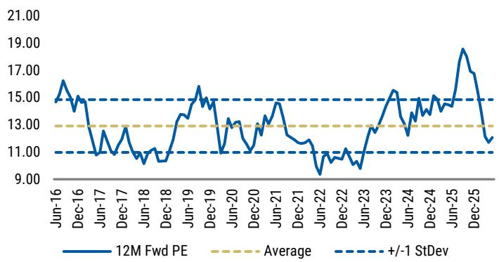

line

| Date    | 12M Fwd PE | Average | +/-1 StDev |
|---------|------------|---------|------------|
| Jun-16  | 15.0       | 13.0    | 15.0       |
| Dec-16  | 14.5       | 13.0    | 15.0       |
| Jun-17  | 11.0       | 13.0    | 15.0       |
| Dec-17  | 13.0       | 13.0    | 15.0       |
| Jun-18  | 10.5       | 13.0    | 15.0       |
| Dec-18  | 11.0       | 13.0    | 15.0       |
| Jun-19  | 14.0       | 13.0    | 15.0       |
| Dec-19  | 15.5       | 13.0    | 15.0       |
| Jun-20  | 13.0       | 13.0    | 15.0       |
| Dec-20  | 12.5       | 13.0    | 15.0       |
| Jun-21  | 14.5       | 13.0    | 15.0       |
| Dec-21  | 13.0       | 13.0    | 15.0       |
| Jun-22  | 9.5        | 13.0    | 15.0       |
| Dec-22  | 10.5       | 13.0    | 15.0       |
| Jun-23  | 12.0       | 13.0    | 15.0       |
| Dec-23  | 15.5       | 13.0    | 15.0       |
| Jun-24  | 13.0       | 13.0    | 15.0       |
| Dec-24  | 14.5       | 13.0    | 15.0       |
| Jun-25  | 18.5       | 13.0    | 15.0       |
| Dec-25  | 12.0       | 13.0    | 15.0       |

Source: Factset, IBES Consensus Estimates, MS

Exhibit 27: HVN 12M Fwd Cons ASX200 Ind ex Financial relative P/E is 60%, between +1Std and mid-cycle   
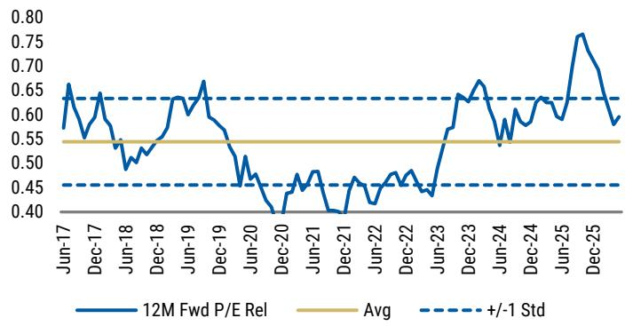

line

| Date    | 12M Fwd P/E Rel | Avg  | +/- 1 Std |
|---------|-----------------|------|-----------|
| Jun-17  | 0.65            | 0.55 | 0.65      |
| Dec-17  | 0.60            | 0.55 | 0.65      |
| Jun-18  | 0.55            | 0.55 | 0.65      |
| Dec-18  | 0.60            | 0.55 | 0.65      |
| Jun-19  | 0.65            | 0.55 | 0.65      |
| Dec-19  | 0.60            | 0.55 | 0.65      |
| Jun-20  | 0.50            | 0.55 | 0.65      |
| Dec-20  | 0.45            | 0.55 | 0.65      |
| Jun-21  | 0.40            | 0.55 | 0.65      |
| Dec-21  | 0.45            | 0.55 | 0.65      |
| Jun-22  | 0.40            | 0.55 | 0.65      |
| Dec-22  | 0.45            | 0.55 | 0.65      |
| Jun-23  | 0.40            | 0.55 | 0.65      |
| Dec-23  | 0.65            | 0.55 | 0.65      |
| Jun-24  | 0.60            | 0.55 | 0.65      |
| Dec-24  | 0.65            | 0.55 | 0.65      |
| Jun-25  | 0.75            | 0.55 | 0.65      |
| Dec-25  | 0.60            | 0.55 | 0.65      |

Source: Factset, IBES Consensus Estimates, MS

# WES Financial Summary

Exhibit 28: WES Financial Summary 

<table><tr><td colspan="6">Income Statement</td></tr><tr><td>A$m</td><td>2024a</td><td>2025a</td><td>2026e</td><td>2027e</td><td>2028e</td></tr><tr><td>Revenue</td><td>44,189</td><td>45,700</td><td>47,239</td><td>49,507</td><td>51,765</td></tr><tr><td>Bunnings</td><td>18,968</td><td>19,595</td><td>20,415</td><td>21,047</td><td>22,189</td></tr><tr><td>Officeworks</td><td>3,434</td><td>3,565</td><td>3,730</td><td>3,845</td><td>3,960</td></tr><tr><td>Kmart Group</td><td>11,107</td><td>11,429</td><td>11,855</td><td>12,355</td><td>12,877</td></tr><tr><td>Catch</td><td>227</td><td>167</td><td>-</td><td>-</td><td>-</td></tr><tr><td>Industrial &amp; Safety</td><td>2,022</td><td>1,998</td><td>1,598</td><td>1,638</td><td>1,679</td></tr><tr><td>CEF</td><td>2,747</td><td>2,962</td><td>2,895</td><td>3,427</td><td>3,476</td></tr><tr><td>Lithium</td><td></td><td>102</td><td>286</td><td>412</td><td>532</td></tr><tr><td>Health</td><td>5,624</td><td>5,933</td><td>6,408</td><td>6,728</td><td>6,997</td></tr><tr><td>Other</td><td>60</td><td>51</td><td>53</td><td>54</td><td>56</td></tr><tr><td>EBITDA</td><td>5,789</td><td>6,019</td><td>6,253</td><td>6,716</td><td>7,138</td></tr><tr><td>D&amp;A</td><td>(1,800)</td><td>(1,833)</td><td>(1,793)</td><td>(1,866)</td><td>(1,929)</td></tr><tr><td>Divisional EBT</td><td>3,753</td><td>3,931</td><td>4,184</td><td>4,565</td><td>4,919</td></tr><tr><td>Bunnings</td><td>2,251</td><td>2,336</td><td>2,455</td><td>2,532</td><td>2,681</td></tr><tr><td>Officeworks</td><td>208</td><td>212</td><td>129</td><td>156</td><td>170</td></tr><tr><td>Kmart Group</td><td>958</td><td>1,046</td><td>1,119</td><td>1,193</td><td>1,258</td></tr><tr><td>Catch</td><td>(96)</td><td>(62)</td><td>-</td><td>-</td><td>-</td></tr><tr><td>Industrial &amp; Safety</td><td>109</td><td>104</td><td>67</td><td>70</td><td>71</td></tr><tr><td>CEF</td><td>463</td><td>458</td><td>471</td><td>652</td><td>665</td></tr><tr><td>Lithium</td><td></td><td>(59)</td><td>13</td><td>28</td><td>116</td></tr><tr><td>Health</td><td>50</td><td>64</td><td>79</td><td>96</td><td>114</td></tr><tr><td>Other</td><td>(167)</td><td>(168)</td><td>(149)</td><td>(162)</td><td>(156)</td></tr><tr><td>Group Net Interest Expense</td><td>(402)</td><td>(412)</td><td>(433)</td><td>(454)</td><td>(493)</td></tr><tr><td>Profit before tax</td><td>3,587</td><td>4,053</td><td>4,027</td><td>4,395</td><td>4,716</td></tr><tr><td>Income Tax</td><td>(1,030)</td><td>(1,127)</td><td>(1,203)</td><td>(1,312)</td><td>(1,408)</td></tr><tr><td>Normalised NPAT</td><td>2,557</td><td>2,647</td><td>2,825</td><td>3,082</td><td>3,308</td></tr><tr><td>Reported NPAT</td><td>2,557</td><td>2,926</td><td>2,825</td><td>3,082</td><td>3,308</td></tr><tr><td>EPS - Underlying (c)</td><td>226</td><td>233</td><td>249</td><td>272</td><td>292</td></tr><tr><td>EPS - Reported (c)</td><td>225</td><td>258</td><td>249</td><td>272</td><td>292</td></tr><tr><td>DPS (c)</td><td>198</td><td>206</td><td>220</td><td>240</td><td>257</td></tr><tr><td>Shares on issue</td><td>1,134</td><td>1,134</td><td>1,135</td><td>1,135</td><td>1,135</td></tr></table>

<table><tr><td colspan="6">Cash Flow Statement</td></tr><tr><td>A$m</td><td>2024a</td><td>2025a</td><td>2026e</td><td>2027e</td><td>2028e</td></tr><tr><td>EBIT</td><td>3,989</td><td>4,186</td><td>4,460</td><td>4,849</td><td>5,209</td></tr><tr><td>D&amp;A</td><td>1,800</td><td>1,833</td><td>1,793</td><td>1,866</td><td>1,929</td></tr><tr><td>Tax paid</td><td>(1,030)</td><td>(1,127)</td><td>(1,203)</td><td>(1,312)</td><td>(1,408)</td></tr><tr><td>Other income &amp; expenses</td><td>(402)</td><td>(412)</td><td>(433)</td><td>(454)</td><td>(493)</td></tr><tr><td>Less Depreciation on lease liabiliti</td><td>(1,119)</td><td>(1,129)</td><td>(1,100)</td><td>(1,145)</td><td>(1,183)</td></tr><tr><td>Gross Cashflow</td><td>3,238</td><td>3,351</td><td>3,518</td><td>3,804</td><td>4,053</td></tr><tr><td>(Inc)/dec in working cap</td><td>(118)</td><td>(651)</td><td>157</td><td>(165)</td><td>(164)</td></tr><tr><td>Other including abnormals</td><td>355</td><td>739</td><td>22</td><td>-</td><td>-</td></tr><tr><td>Operating cashflow</td><td>3,475</td><td>3,439</td><td>3,697</td><td>3,639</td><td>3,889</td></tr><tr><td>Capital expenditure</td><td>(1,015)</td><td>(1,099)</td><td>(840)</td><td>(1,104)</td><td>(1,128)</td></tr><tr><td>Divestments Acquisitions</td><td>(321)</td><td>(103)</td><td>(289)</td><td>-</td><td>-</td></tr><tr><td>Free cashflow</td><td>2,139</td><td>2,237</td><td>2,567</td><td>2,535</td><td>2,761</td></tr><tr><td>Dividends paid</td><td>(2,200)</td><td>(2,291)</td><td>(2,872)</td><td>(2,827)</td><td>(2,836)</td></tr><tr><td>Net free cashflow</td><td>(61)</td><td>(54)</td><td>(304)</td><td>(292)</td><td>(75)</td></tr><tr><td>Equity raised</td><td>-</td><td>-</td><td>-</td><td>-</td><td>-</td></tr><tr><td>Debt servicing &amp; other</td><td>-</td><td>(2,267)</td><td>-</td><td>-</td><td>-</td></tr><tr><td>Change in net debt</td><td>317</td><td>(158)</td><td>395</td><td>200</td><td>100</td></tr></table>

<table><tr><td colspan="6">Balance Sheet</td></tr><tr><td>A$m</td><td>2024a</td><td>2025a</td><td>2026e</td><td>2027e</td><td>2028e</td></tr><tr><td>Current assets</td><td>9,414</td><td>9,933</td><td>9,766</td><td>10,047</td><td>10,470</td></tr><tr><td>Net plant &amp; equipment</td><td>4,783</td><td>4,869</td><td>5,297</td><td>5,680</td><td>6,063</td></tr><tr><td>Net intangibles</td><td>5,051</td><td>4,957</td><td>4,938</td><td>4,938</td><td>4,938</td></tr><tr><td>Other non current assets</td><td>8,061</td><td>8,222</td><td>8,794</td><td>8,867</td><td>8,914</td></tr><tr><td>Total assets</td><td>27,309</td><td>27,981</td><td>28,795</td><td>29,532</td><td>30,384</td></tr><tr><td>Current liabilities</td><td>8,213</td><td>8,328</td><td>8,739</td><td>9,020</td><td>9,300</td></tr><tr><td>Borrowings</td><td>4,756</td><td>4,719</td><td>5,719</td><td>5,919</td><td>6,019</td></tr><tr><td>Other non current liabilities</td><td>5,755</td><td>5,745</td><td>6,444</td><td>6,444</td><td>6,444</td></tr><tr><td>Total liabilities</td><td>18,724</td><td>18,792</td><td>20,902</td><td>21,383</td><td>21,763</td></tr><tr><td>Shareholders&#x27; funds</td><td>8,585</td><td>9,189</td><td>7,893</td><td>8,149</td><td>8,621</td></tr><tr><td>Net debt</td><td>3,921</td><td>4,081</td><td>5,491</td><td>5,856</td><td>5,978</td></tr><tr><td>Capital employed</td><td>12,506</td><td>13,270</td><td>13,384</td><td>14,005</td><td>14,598</td></tr></table>

<table><tr><td>Growth &amp; Margins (%)</td><td>2024a</td><td>2025a</td><td>2026e</td><td>2027e</td><td>2028e</td></tr><tr><td>Growth (%)</td><td></td><td></td><td></td><td></td><td></td></tr><tr><td>Revenue</td><td>20.0</td><td>3.4</td><td>3.4</td><td>4.8</td><td>4.6</td></tr><tr><td>EBIT</td><td>12.8</td><td>4.7</td><td>6.4</td><td>9.1</td><td>7.8</td></tr><tr><td>EBITDA</td><td>11.2</td><td>4.0</td><td>3.9</td><td>7.4</td><td>6.3</td></tr><tr><td>Normalised NPAT</td><td>8.7</td><td>3.5</td><td>6.7</td><td>9.1</td><td>7.3</td></tr><tr><td>Reported NPAT</td><td>8.7</td><td>14.4</td><td>(3.5)</td><td>9.1</td><td>7.3</td></tr><tr><td>EPS</td><td>8.7</td><td>3.4</td><td>6.6</td><td>9.1</td><td>7.3</td></tr><tr><td>Margins (%)</td><td></td><td></td><td></td><td></td><td></td></tr><tr><td>EBITDA</td><td>13.1</td><td>13.2</td><td>13.2</td><td>13.6</td><td>13.8</td></tr><tr><td>EBIT</td><td>9.0</td><td>9.2</td><td>9.4</td><td>9.8</td><td>10.1</td></tr><tr><td>NPAT</td><td>5.8</td><td>5.8</td><td>6.0</td><td>6.2</td><td>6.4</td></tr></table>

<table><tr><td>Key metrics</td><td>2024a</td><td>2025a</td><td>2026e</td><td>2027e</td><td>2028e</td></tr><tr><td>Bunnings LFL sales growth</td><td>2.1%</td><td>3.5%</td><td>3.9%</td><td>2.0%</td><td>4.0%</td></tr><tr><td>Bunnings EBIT margin</td><td>12.5%</td><td>12.6%</td><td>12.7%</td><td>12.8%</td><td>12.8%</td></tr><tr><td>Kmart LFL sales growth</td><td>6.4%</td><td>4.0%</td><td>5.0%</td><td>5.0%</td><td>5.0%</td></tr><tr><td>Kmart EBIT margin</td><td>10.4%</td><td>10.4%</td><td>10.4%</td><td>10.4%</td><td>10.4%</td></tr><tr><td>ROFE</td><td>30.3%</td><td>30.5%</td><td>31.4%</td><td>33.3%</td><td>34.4%</td></tr><tr><td>EBIT to net interest (x)</td><td>9.3</td><td>9.5</td><td>9.7</td><td>10.0</td><td>10.0</td></tr><tr><td>Capex-to-D&amp;A</td><td>0.6</td><td>0.6</td><td>0.5</td><td>0.6</td><td>0.6</td></tr><tr><td>Capex-to-sales</td><td>2.3%</td><td>2.4%</td><td>1.8%</td><td>2.2%</td><td>2.2%</td></tr><tr><td>Net Debt/EBITDA</td><td>0.7</td><td>0.7</td><td>0.9</td><td>0.9</td><td>0.8</td></tr><tr><td>Net Debt/EBITDA (inc AASB16 le</td><td>1.8</td><td>1.7</td><td>2.0</td><td>1.9</td><td>1.8</td></tr><tr><td>Fixed charges cover</td><td>4.0</td><td>3.9</td><td>3.8</td><td>14.8</td><td>14.5</td></tr><tr><td>Net debt/equity</td><td>45.7%</td><td>44.4%</td><td>69.6%</td><td>71.9%</td><td>69.3%</td></tr><tr><td>NTA/share</td><td>3.1</td><td>3.7</td><td>2.6</td><td>2.8</td><td>3.3</td></tr><tr><td>Price/NTA</td><td>25.4</td><td>21.2</td><td>30.6</td><td>28.1</td><td>24.5</td></tr><tr><td>NAV/share</td><td>7.6</td><td>8.1</td><td>7.0</td><td>7.2</td><td>7.6</td></tr><tr><td>Price/NAV</td><td>10.4</td><td>9.8</td><td>11.4</td><td>11.1</td><td>10.5</td></tr><tr><td>Valuation metrics</td><td>2024a</td><td>2025a</td><td>2026e</td><td>2027e</td><td>2028e</td></tr><tr><td>P/E (x)</td><td>35.1</td><td>33.9</td><td>31.8</td><td>29.1</td><td>27.1</td></tr><tr><td>EV/EBIT (x)</td><td>25.0</td><td>23.9</td><td>22.9</td><td>21.1</td><td>19.6</td></tr><tr><td>EV/EBITDA (x)</td><td>16.2</td><td>15.6</td><td>15.3</td><td>14.3</td><td>13.5</td></tr><tr><td>Dividend yield (%)</td><td>2.5%</td><td>2.6%</td><td>2.8%</td><td>3.0%</td><td>3.3%</td></tr><tr><td>Dividend payout (%)</td><td>83%</td><td>87%</td><td>88%</td><td>88%</td><td>88%</td></tr></table>

Source: e = MS estimates, Company data

# MTS Financial summary

Exhibit 29: MTS Financial Summary 

<table><tr><td colspan="5">Income Statement</td></tr><tr><td>A$m</td><td>2025a</td><td>2026e</td><td>2027e</td><td>2028e</td></tr><tr><td>Revenue</td><td>19,489</td><td>19,629</td><td>20,156</td><td>20,678</td></tr><tr><td>EBITDA</td><td>748</td><td>772</td><td>800</td><td>837</td></tr><tr><td>D&amp;A</td><td>(240)</td><td>(269)</td><td>(276)</td><td>(283)</td></tr><tr><td colspan="5">DIVISIONAL EBIT</td></tr><tr><td>F&amp;G</td><td>248</td><td>261</td><td>270</td><td>277</td></tr><tr><td>Liquor</td><td>104</td><td>100</td><td>101</td><td>102</td></tr><tr><td>Hardware</td><td>189</td><td>177</td><td>191</td><td>213</td></tr><tr><td>Other</td><td>(34)</td><td>(35)</td><td>(37)</td><td>(38)</td></tr><tr><td>Total EBIT</td><td>508</td><td>503</td><td>524</td><td>554</td></tr><tr><td>Net Interest Expense</td><td>(122)</td><td>(120)</td><td>(124)</td><td>(125)</td></tr><tr><td>Profit before tax</td><td>385</td><td>382</td><td>400</td><td>429</td></tr><tr><td>Income Tax</td><td>(110)</td><td>(111)</td><td>(116)</td><td>(124)</td></tr><tr><td>Minorities</td><td>(0)</td><td>(2)</td><td>(2)</td><td>(2)</td></tr><tr><td>NPAT before sig. items</td><td>276</td><td>269</td><td>283</td><td>303</td></tr><tr><td>Reported NPAT</td><td>283</td><td>288</td><td>283</td><td>303</td></tr><tr><td>EPS - normalised (c)</td><td>25</td><td>24</td><td>26</td><td>27</td></tr><tr><td>EPS - reported (c)</td><td>26</td><td>26</td><td>26</td><td>27</td></tr><tr><td>DPS (c)</td><td>18</td><td>17</td><td>18</td><td>19</td></tr><tr><td>Weighted shares</td><td>1,096</td><td>1,099</td><td>1,099</td><td>1,099</td></tr></table>

<table><tr><td colspan="5">Cash Flow Statement</td></tr><tr><td>A$m</td><td>2025a</td><td>2026e</td><td>2027e</td><td>2028e</td></tr><tr><td>EBIT</td><td>508</td><td>519</td><td>524</td><td>554</td></tr><tr><td>D&amp;A</td><td>240</td><td>269</td><td>276</td><td>283</td></tr><tr><td>Tax paid</td><td>(102)</td><td>(109)</td><td>(116)</td><td>(124)</td></tr><tr><td>Net interest paid</td><td>(122)</td><td>(120)</td><td>(124)</td><td>(125)</td></tr><tr><td>Gross Cashflow</td><td>523</td><td>560</td><td>560</td><td>588</td></tr><tr><td>(Inc)/dec in working cap</td><td>3</td><td>(7)</td><td>(18)</td><td>(18)</td></tr><tr><td>Other</td><td>13</td><td>(32)</td><td>0</td><td>0</td></tr><tr><td>Operating cashflow</td><td>539</td><td>521</td><td>542</td><td>570</td></tr><tr><td>Capital expenditure</td><td>(149)</td><td>(170)</td><td>(200)</td><td>(200)</td></tr><tr><td>Free cashflow</td><td>391</td><td>351</td><td>342</td><td>370</td></tr><tr><td>Net dividends paid</td><td>(167)</td><td>(205)</td><td>(197)</td><td>(211)</td></tr><tr><td>Net free Cashflow</td><td>224</td><td>146</td><td>145</td><td>159</td></tr><tr><td>Acquisitions / Divestments</td><td>(404)</td><td>(50)</td><td>(25)</td><td>(25)</td></tr><tr><td>Change in net debt / other</td><td>12</td><td>(51)</td><td>(2)</td><td>(11)</td></tr></table>

<table><tr><td>Divisional metrics</td><td>2025a</td><td>2026e</td><td>2027e</td><td>2028e</td></tr><tr><td>Food Sales gth</td><td>-2.1%</td><td>-3.0%</td><td>3.4%</td><td>2.9%</td></tr><tr><td>Food EBIT margin</td><td>2.3%</td><td>2.3%</td><td>2.3%</td><td>2.3%</td></tr><tr><td>Hardware Revenue gth (inc TTH)</td><td>2.4%</td><td>4.2%</td><td>3.0%</td><td>3.9%</td></tr><tr><td>Hardware EBIT margin (inc TTH)</td><td>5.3%</td><td>4.8%</td><td>5.0%</td><td>5.4%</td></tr><tr><td>TTH Network Sales gth</td><td>4.1%</td><td>7.9%</td><td>-0.1%</td><td>4.1%</td></tr><tr><td>TTH EBIT margin</td><td>11.2%</td><td>10.7%</td><td>11.0%</td><td>11.5%</td></tr></table>

<table><tr><td colspan="6">Balance Sheet</td></tr><tr><td>A$m</td><td>2024a</td><td>2025a</td><td>2026e</td><td>2027e</td><td>2028e</td></tr><tr><td>Current assets</td><td>3,263</td><td>3,778</td><td>3,849</td><td>3,949</td><td>4,057</td></tr><tr><td>Net plant &amp; equipment</td><td>340</td><td>397</td><td>328</td><td>277</td><td>219</td></tr><tr><td>Net intangibles</td><td>1,062</td><td>1,452</td><td>1,486</td><td>1,486</td><td>1,486</td></tr><tr><td>Other NC assets</td><td>1,132</td><td>1,265</td><td>1,226</td><td>1,226</td><td>1,226</td></tr><tr><td>Total assets</td><td>5,796</td><td>6,892</td><td>6,890</td><td>6,938</td><td>6,988</td></tr><tr><td>Current liabilities</td><td>2,889</td><td>3,635</td><td>3,639</td><td>3,719</td><td>3,797</td></tr><tr><td>Borrowings</td><td>349</td><td>662</td><td>763</td><td>813</td><td>863</td></tr><tr><td>Other</td><td>1,030</td><td>959</td><td>770</td><td>602</td><td>430</td></tr><tr><td>Total liabilities</td><td>4,268</td><td>5,256</td><td>5,172</td><td>5,134</td><td>5,090</td></tr><tr><td>OEI</td><td>12</td><td>11</td><td>5</td><td>7</td><td>9</td></tr><tr><td>Equity</td><td>1,517</td><td>1,626</td><td>1,712</td><td>1,798</td><td>1,889</td></tr><tr><td>Net debt (hedged)</td><td>252</td><td>577</td><td>627</td><td>675</td><td>714</td></tr><tr><td>Capital employed</td><td>1,769</td><td>2,203</td><td>2,340</td><td>2,473</td><td>2,603</td></tr></table>

<table><tr><td>Ratio Analysis</td><td>2024a</td><td>2025a</td><td>2026e</td><td>2027e</td><td>2028e</td></tr><tr><td colspan="6">Growth (%)</td></tr><tr><td>Revenue Growth</td><td>0.7</td><td>7.2</td><td>0.7</td><td>2.7</td><td>2.6</td></tr><tr><td>EBIT</td><td>(0.9)</td><td>2.3</td><td>(1.0)</td><td>4.3</td><td>5.7</td></tr><tr><td>Normalised NPAT</td><td>(8.2)</td><td>(2.4)</td><td>(2.3)</td><td>5.0</td><td>7.2</td></tr><tr><td>Reported NPAT</td><td>(0.7)</td><td>10.1</td><td>1.8</td><td>(2.0)</td><td>7.2</td></tr><tr><td>EPS</td><td>(11.0)</td><td>(11.3)</td><td>(2.5)</td><td>5.0</td><td>7.2</td></tr><tr><td colspan="6">Key metrics</td></tr><tr><td>EBITDA margin</td><td>3.8%</td><td>3.8%</td><td>3.9%</td><td>4.0%</td><td>4.0%</td></tr><tr><td>EBIT margin</td><td>2.7%</td><td>2.6%</td><td>2.6%</td><td>2.6%</td><td>2.7%</td></tr><tr><td>NPAT margin</td><td>1.6%</td><td>1.4%</td><td>1.4%</td><td>1.4%</td><td>1.5%</td></tr><tr><td colspan="6">Other Value Drivers % unless stated</td></tr><tr><td>ROFE</td><td>31.1%</td><td>25.6%</td><td>22.1%</td><td>21.8%</td><td>21.8%</td></tr><tr><td>EBIT to net interest (x)</td><td>5.4</td><td>4.1</td><td>4.2</td><td>4.2</td><td>4.4</td></tr><tr><td>Capex-to-D&amp;A</td><td>0.7</td><td>0.6</td><td>0.6</td><td>0.7</td><td>0.7</td></tr><tr><td>Capex-to-sales</td><td>0.7%</td><td>0.8%</td><td>0.9%</td><td>1.0%</td><td>1.0%</td></tr><tr><td>D&amp;A-to-sales</td><td>1.1%</td><td>1.2%</td><td>1.4%</td><td>1.4%</td><td>1.4%</td></tr><tr><td>Net debt to EBITDA ex ROA d</td><td>0.4</td><td>1.0</td><td>1.0</td><td>0.8</td><td>0.9</td></tr><tr><td>Gearing ND / (ND+E)</td><td>14%</td><td>26%</td><td>27%</td><td>27%</td><td>27%</td></tr><tr><td>Valuation metrics</td><td>2024a</td><td>2025a</td><td>2026e</td><td>2027e</td><td>2028e</td></tr><tr><td>P/E (x)</td><td>10.7</td><td>12.0</td><td>12.3</td><td>11.7</td><td>11.0</td></tr><tr><td>EV/EBITDA (x)</td><td>4.7</td><td>5.2</td><td>5.1</td><td>5.0</td><td>4.8</td></tr><tr><td>Dividend yield (%)</td><td>6.5%</td><td>6.0%</td><td>5.7%</td><td>6.0%</td><td>6.4%</td></tr><tr><td>Dividend payout (%)</td><td>69%</td><td>72%</td><td>70%</td><td>70%</td><td>70%</td></tr></table>

Source: e = MS estimates, Company data

# JBH Financial Summary

Exhibit 30: JBH Financial Summary 

<table><tr><td>P&amp;L</td><td></td><td>2024a</td><td>2025a</td><td>2026e</td><td>2027e</td><td>2028e</td></tr><tr><td>Revenue</td><td>A$m</td><td>9,592</td><td>10,555</td><td>11,133</td><td>11,444</td><td>11,925</td></tr><tr><td>JBH - Aus</td><td>A$m</td><td>6,610</td><td>7,103</td><td>7,462</td><td>7,685</td><td>8,029</td></tr><tr><td>JBH - NZ (A$m)</td><td>A$m</td><td>303</td><td>361</td><td>441</td><td>477</td><td>500</td></tr><tr><td>The Good Guys</td><td>A$m</td><td>2,679</td><td>2,865</td><td>2,954</td><td>2,999</td><td>3,104</td></tr><tr><td>EBITDA</td><td>A$m</td><td>884</td><td>967</td><td>1,012</td><td>998</td><td>1,042</td></tr><tr><td>D&amp;A</td><td>A$m</td><td>(237)</td><td>(259)</td><td>(268)</td><td>(275)</td><td>(282)</td></tr><tr><td>JBH - Aus</td><td>A$m</td><td>491</td><td>530</td><td>562</td><td>551</td><td>578</td></tr><tr><td>JBH - NZ (A$m)</td><td>A$m</td><td>(2)</td><td>(0)</td><td>4</td><td>6</td><td>9</td></tr><tr><td>The Good Guys</td><td>A$m</td><td>158</td><td>174</td><td>175</td><td>163</td><td>169</td></tr><tr><td>EBIT</td><td>A$m</td><td>647</td><td>708</td><td>744</td><td>723</td><td>759</td></tr><tr><td>Net Interest Expense</td><td>A$m</td><td>(20)</td><td>(26)</td><td>(33)</td><td>(36)</td><td>(37)</td></tr><tr><td>Profit before tax</td><td>A$m</td><td>627</td><td>668</td><td>711</td><td>687</td><td>722</td></tr><tr><td>Income Tax</td><td>A$m</td><td>(189)</td><td>(205)</td><td>(214)</td><td>(207)</td><td>(217)</td></tr><tr><td>NPAT before sig. items</td><td>A$m</td><td>439</td><td>476</td><td>496</td><td>480</td><td>504</td></tr><tr><td>Reported NPAT</td><td>A$m</td><td>439</td><td>462</td><td>496</td><td>480</td><td>504</td></tr><tr><td>EPS</td><td>Cents</td><td>401</td><td>434</td><td>452</td><td>437</td><td>460</td></tr><tr><td>DPS</td><td>Cents</td><td>341</td><td>375</td><td>349</td><td>338</td><td>355</td></tr></table>

<table><tr><td>Cash flow</td><td></td><td>2024a</td><td>2025a</td><td>2026e</td><td>2027e</td><td>2028e</td></tr><tr><td>EBIT</td><td>A$m</td><td>647</td><td>708</td><td>744</td><td>723</td><td>759</td></tr><tr><td>D&amp;A</td><td>A$m</td><td>237</td><td>259</td><td>268</td><td>275</td><td>282</td></tr><tr><td>Tax paid</td><td>A$m</td><td>(189)</td><td>(205)</td><td>(214)</td><td>(207)</td><td>(217)</td></tr><tr><td>Net Interest</td><td>A$m</td><td>(20)</td><td>(26)</td><td>(33)</td><td>(36)</td><td>(37)</td></tr><tr><td>Gross Cashflow</td><td>A$m</td><td>676</td><td>735</td><td>765</td><td>755</td><td>787</td></tr><tr><td>(Inc)/dec in working cap</td><td>A$m</td><td>19</td><td>(91)</td><td>(33)</td><td>(19)</td><td>(27)</td></tr><tr><td>Others</td><td>A$m</td><td>58</td><td>81</td><td>27</td><td>-</td><td>-</td></tr><tr><td>Operating cashflow</td><td>A$m</td><td>753</td><td>725</td><td>758</td><td>736</td><td>760</td></tr><tr><td>Capital expenditure</td><td>A$m</td><td>(75)</td><td>(82)</td><td>(89)</td><td>(97)</td><td>(101)</td></tr><tr><td>Free cashflow</td><td>A$m</td><td>678</td><td>643</td><td>669</td><td>639</td><td>658</td></tr><tr><td>Dividends paid</td><td>A$m</td><td>(299)</td><td>(386)</td><td>(448)</td><td>(372)</td><td>(382)</td></tr><tr><td>Net free Cashflow</td><td>A$m</td><td>380</td><td>257</td><td>221</td><td>267</td><td>276</td></tr><tr><td>Equity raised</td><td>A$m</td><td>-</td><td>-</td><td>-</td><td>-</td><td>-</td></tr><tr><td>Other financing</td><td>A$m</td><td>(205)</td><td>(220)</td><td>(232)</td><td>(211)</td><td>(218)</td></tr><tr><td>Change in net debt</td><td>A$m</td><td>(35)</td><td>(16)</td><td>-</td><td>-</td><td>-</td></tr></table>

<table><tr><td colspan="2">JB Hi Fi (Aus) metrics</td><td>2024a</td><td>2025a</td><td>2026e</td><td>2027e</td><td>2028e</td></tr><tr><td>JB Hi Fi (Aus) LFL sales</td><td>%</td><td>0.6%</td><td>7.2%</td><td>3.6%</td><td>2.5%</td><td>4.0%</td></tr><tr><td>GM - Aus</td><td>%</td><td>22.2%</td><td>22.0%</td><td>22.0%</td><td>21.8%</td><td>21.8%</td></tr><tr><td>EBIT margin - Aus</td><td>%</td><td>7.4%</td><td>7.5%</td><td>7.5%</td><td>7.2%</td><td>7.2%</td></tr><tr><td>Space growth</td><td>%</td><td>2.4%</td><td>2.7%</td><td>2.0%</td><td>1.4%</td><td>0.8%</td></tr><tr><td>Period end stores</td><td>k</td><td>224</td><td>229</td><td>234</td><td>236</td><td>238</td></tr></table>

<table><tr><td colspan="2">The Good Guys metrics</td><td>2024a</td><td>2025a</td><td>2026e</td><td>2027e</td><td>2028e</td></tr><tr><td>The Good Guys LFL sales</td><td>%</td><td>-4.8%</td><td>6.5%</td><td>3.0%</td><td>1.5%</td><td>3.5%</td></tr><tr><td>Gross Margin</td><td>%</td><td>23.2%</td><td>23.5%</td><td>23.4%</td><td>23.1%</td><td>23.1%</td></tr><tr><td>EBIT margin</td><td>%</td><td>5.9%</td><td>6.1%</td><td>5.9%</td><td>5.4%</td><td>5.5%</td></tr><tr><td>Space growth</td><td>%</td><td>0.0%</td><td>0.5%</td><td>0.5%</td><td>0.0%</td><td>0.0%</td></tr><tr><td>Period end stores</td><td>k</td><td>106</td><td>107</td><td>107</td><td>107</td><td>107</td></tr></table>

<table><tr><td colspan="2">Balance Sheet</td><td>2024a</td><td>2025a</td><td>2,026</td><td>2027e</td><td>2028e</td></tr><tr><td>Current assets</td><td>A$m</td><td>1,586</td><td>1,816</td><td>1,871</td><td>1,974</td><td>2,100</td></tr><tr><td>Net plant &amp; equipment</td><td>A$m</td><td>197</td><td>225</td><td>240</td><td>260</td><td>276</td></tr><tr><td>Net intangibles</td><td>A$m</td><td>1,031</td><td>1,081</td><td>1,081</td><td>1,081</td><td>1,081</td></tr><tr><td>Other non current assets</td><td>A$m</td><td>672</td><td>762</td><td>791</td><td>805</td><td>825</td></tr><tr><td>Total assets</td><td>A$m</td><td>3,487</td><td>3,883</td><td>3,983</td><td>4,119</td><td>4,281</td></tr><tr><td>Current liabilities</td><td>A$m</td><td>1,311</td><td>1,551</td><td>1,614</td><td>1,643</td><td>1,682</td></tr><tr><td>Borrowings</td><td>A$m</td><td>15</td><td>-</td><td>-</td><td>-</td><td>-</td></tr><tr><td>Other non current liabilities</td><td>A$m</td><td>602</td><td>710</td><td>718</td><td>718</td><td>718</td></tr><tr><td>Total liabilities</td><td>A$m</td><td>1,928</td><td>2,261</td><td>2,332</td><td>2,361</td><td>2,400</td></tr><tr><td>Outside equity interests</td><td>A$m</td><td>-</td><td>5</td><td>6</td><td>6</td><td>7</td></tr><tr><td>Shareholders&#x27; funds</td><td>A$m</td><td>1,559</td><td>1,617</td><td>1,645</td><td>1,752</td><td>1,874</td></tr><tr><td>Net debt</td><td>A$m</td><td>(303)</td><td>(284)</td><td>(273)</td><td>(328)</td><td>(387)</td></tr><tr><td>Capital employed</td><td>A$m</td><td>1,256</td><td>1,333</td><td>1,372</td><td>1,424</td><td>1,488</td></tr></table>

<table><tr><td colspan="2">Ratio Analysis</td><td>2024a</td><td>2025a</td><td>2026e</td><td>2027e</td><td>2028e</td></tr><tr><td colspan="7">Growth (%)</td></tr><tr><td>Revenue</td><td>%</td><td>(0.4)</td><td>10.0</td><td>5.5</td><td>2.8</td><td>4.2</td></tr><tr><td>EBIT</td><td>%</td><td>(15.8)</td><td>9.4</td><td>5.1</td><td>(2.8)</td><td>5.1</td></tr><tr><td>EBITDA</td><td>%</td><td>(11.0)</td><td>9.3</td><td>4.7</td><td>(1.4)</td><td>4.4</td></tr><tr><td>Normalised NPAT</td><td>%</td><td>(16.4)</td><td>8.5</td><td>4.2</td><td>(3.4)</td><td>5.2</td></tr><tr><td>Reported NPAT</td><td>%</td><td>(16.4)</td><td>5.4</td><td>7.3</td><td>(3.4)</td><td>5.2</td></tr><tr><td>EPS</td><td>%</td><td>(16.1)</td><td>8.3</td><td>4.2</td><td>(3.4)</td><td>5.2</td></tr><tr><td colspan="7">Margins (%)</td></tr><tr><td>Gross Margin</td><td>%</td><td>22.3%</td><td>22.4%</td><td>22.4%</td><td>22.1%</td><td>22.1%</td></tr><tr><td>CODB Margin</td><td>%</td><td>13.1%</td><td>13.2%</td><td>13.3%</td><td>13.4%</td><td>13.4%</td></tr><tr><td>EBITDA margin</td><td>%</td><td>9.2%</td><td>9.2%</td><td>9.1%</td><td>8.7%</td><td>8.7%</td></tr><tr><td>EBIT margin</td><td>%</td><td>6.7%</td><td>6.7%</td><td>6.7%</td><td>6.3%</td><td>6.4%</td></tr><tr><td>NPAT margin</td><td>%</td><td>4.6%</td><td>4.5%</td><td>4.5%</td><td>4.2%</td><td>4.2%</td></tr><tr><td colspan="7">Other Value Drivers</td></tr><tr><td>ROFE</td><td>%</td><td>50.8%</td><td>54.7%</td><td>55.0%</td><td>51.7%</td><td>52.2%</td></tr><tr><td>EBIT to net interest</td><td>x</td><td>33</td><td>27</td><td>23</td><td>20</td><td>20</td></tr><tr><td>Capex-to-D&amp;A</td><td>x</td><td>0.3</td><td>0.3</td><td>0.3</td><td>0.4</td><td>0.4</td></tr><tr><td>Capex-to-sales</td><td>%</td><td>0.8%</td><td>0.8%</td><td>0.8%</td><td>0.9%</td><td>0.9%</td></tr><tr><td>D&amp;A-to-sales</td><td>%</td><td>2.5%</td><td>2.5%</td><td>2.4%</td><td>2.4%</td><td>2.4%</td></tr><tr><td>Net debt/equity</td><td>x</td><td>-19.4%</td><td>-17.6%</td><td>-16.6%</td><td>-18.7%</td><td>-20.6%</td></tr><tr><td>Net debt/(Net debt + Equity)</td><td>x</td><td>-24.1%</td><td>-21.3%</td><td>-19.9%</td><td>-23.0%</td><td>-26.0%</td></tr><tr><td>NTA/share</td><td>A$m</td><td>4.8</td><td>4.9</td><td>5.2</td><td>6.2</td><td>7.3</td></tr><tr><td>Price/NTA</td><td>A$m</td><td>14.7</td><td>14.4</td><td>13.7</td><td>11.5</td><td>9.7</td></tr><tr><td>NAV/share</td><td>A$m</td><td>14.2</td><td>14.7</td><td>15.0</td><td>16.0</td><td>17.1</td></tr><tr><td>Price/NAV</td><td>A$m</td><td>5.0</td><td>4.8</td><td>4.7</td><td>4.4</td><td>4.2</td></tr></table>

<table><tr><td>Valuation metrics</td><td>2024a</td><td>2025a</td><td>2026e</td><td>2027e</td><td>2028e</td></tr><tr><td>P/E (x)</td><td>17.7</td><td>16.4</td><td>15.7</td><td>16.3</td><td>15.5</td></tr><tr><td>EV/EBITDA (x)</td><td>8.8</td><td>8.0</td><td>7.7</td><td>7.8</td><td>7.5</td></tr><tr><td>EV/EBIT (x)</td><td>12.0</td><td>11.2</td><td>10.4</td><td>10.7</td><td>10.2</td></tr><tr><td>EV/Sales (x)</td><td>0.81</td><td>0.74</td><td>0.70</td><td>0.68</td><td>0.65</td></tr><tr><td>Dividend yield (%)</td><td>4.8%</td><td>5.3%</td><td>4.9%</td><td>4.8%</td><td>5.0%</td></tr></table>

Source: e = MS estimates, Company data

# HVN Financial Summary

Exhibit 31: HVN Financial Summary 

<table><tr><td colspan="6">Income Statement</td></tr><tr><td>A$m</td><td>2024a</td><td>2025a</td><td>2026e</td><td>2027e</td><td>2028e</td></tr><tr><td>Sales Revenue</td><td></td><td></td><td></td><td></td><td></td></tr><tr><td>Franchising Sales</td><td>6,060</td><td>6,430</td><td>6,626</td><td>6,726</td><td>6,927</td></tr><tr><td>Franchising Operations</td><td>971</td><td>1,043</td><td>1,084</td><td>1,086</td><td>1,117</td></tr><tr><td>New Zealand</td><td>982</td><td>980</td><td>1,005</td><td>1,030</td><td>1,056</td></tr><tr><td>Asia</td><td>728</td><td>767</td><td>822</td><td>826</td><td>867</td></tr><tr><td>Slovenia</td><td>220</td><td>236</td><td>266</td><td>270</td><td>278</td></tr><tr><td>Ireland</td><td>702</td><td>738</td><td>792</td><td>784</td><td>808</td></tr><tr><td>Other Non-Franchised Retail</td><td>247</td><td>240</td><td>245</td><td>250</td><td>255</td></tr><tr><td>Total Retail</td><td>2,879</td><td>2,962</td><td>3,192</td><td>3,232</td><td>3,357</td></tr><tr><td>Property (ex reval)</td><td>322</td><td>346</td><td>365</td><td>380</td><td>392</td></tr><tr><td>Equity Investments/Other</td><td>-60</td><td>-73</td><td>74</td><td>-25</td><td>-25</td></tr><tr><td>Total Company Revenue</td><td>4,118</td><td>4,436</td><td>4,811</td><td>4,673</td><td>4,841</td></tr><tr><td>EBITDA</td><td>893</td><td>967</td><td>1,045</td><td>1,040</td><td>1,090</td></tr><tr><td>Depreciation</td><td>-78</td><td>-87</td><td>-88</td><td>-90</td><td>-92</td></tr><tr><td>Amortisation</td><td>-19</td><td>-18</td><td>-18</td><td>-19</td><td>-21</td></tr><tr><td>Divisional EBIT</td><td></td><td></td><td></td><td></td><td></td></tr><tr><td>Franchising Operations</td><td>318</td><td>392</td><td>424</td><td>404</td><td>423</td></tr><tr><td>New Zealand</td><td>73</td><td>71</td><td>82</td><td>82</td><td>84</td></tr><tr><td>Asia</td><td>43</td><td>49</td><td>59</td><td>57</td><td>61</td></tr><tr><td>Slovenia</td><td>6</td><td>8</td><td>12</td><td>11</td><td>11</td></tr><tr><td>Ireland</td><td>23</td><td>11</td><td>17</td><td>20</td><td>29</td></tr><tr><td>Other Non-Franchised Retail</td><td>-15</td><td>-13</td><td>-21</td><td>-21</td><td>-22</td></tr><tr><td>Total Retail</td><td>447</td><td>518</td><td>573</td><td>552</td><td>587</td></tr><tr><td>Property (ex reval)</td><td>190</td><td>199</td><td>209</td><td>218</td><td>225</td></tr><tr><td>Equity Investments/Other</td><td>10</td><td>-4</td><td>3</td><td>2</td><td>3</td></tr><tr><td>Property revaluation</td><td>5</td><td>158</td><td>96</td><td>0</td><td>0</td></tr><tr><td>Total EBIT</td><td>653</td><td>871</td><td>881</td><td>773</td><td>814</td></tr><tr><td>Total EBIT ex reval</td><td>647</td><td>713</td><td>785</td><td>773</td><td>814</td></tr><tr><td>Net Interest Expense</td><td>-111</td><td>-118</td><td>-121</td><td>-124</td><td>-121</td></tr><tr><td>Profit before tax</td><td>542</td><td>753</td><td>760</td><td>649</td><td>693</td></tr><tr><td>Income Tax</td><td>-184</td><td>-228</td><td>-219</td><td>-195</td><td>-208</td></tr><tr><td>Normalised NPAT</td><td>347</td><td>404</td><td>437</td><td>447</td><td>478</td></tr><tr><td>Reported NPAT</td><td>352</td><td>518</td><td>533</td><td>447</td><td>478</td></tr><tr><td>Shares outstanding</td><td>1,246</td><td>1,246</td><td>1,246</td><td>1,246</td><td>1,246</td></tr><tr><td>EPS - Basic as Reported (c)</td><td>28</td><td>41</td><td>43</td><td>36</td><td>38</td></tr><tr><td>EPS (c) ex property reval.</td><td>27.8</td><td>32.4</td><td>35.0</td><td>35.8</td><td>38.3</td></tr><tr><td>DPS (c)</td><td>22</td><td>27</td><td>27</td><td>28</td><td>30</td></tr></table>

<table><tr><td colspan="6">Cash Flow Statement</td></tr><tr><td>A$m</td><td>2024a</td><td>2025a</td><td>2026e</td><td>2027e</td><td>2028e</td></tr><tr><td>EBIT (ex-property reval)</td><td>647</td><td>713</td><td>785</td><td>773</td><td>814</td></tr><tr><td>D&amp;A</td><td>246</td><td>255</td><td>260</td><td>267</td><td>276</td></tr><tr><td>Tax paid</td><td>-184</td><td>-228</td><td>-219</td><td>-195</td><td>-208</td></tr><tr><td>Other</td><td>-88</td><td>-10</td><td>-33</td><td>-131</td><td>-129</td></tr><tr><td>Operating cashflow</td><td>621</td><td>730</td><td>794</td><td>714</td><td>753</td></tr><tr><td>(Inc)/dec in working cap</td><td>65</td><td>-35</td><td>-120</td><td>99</td><td>-43</td></tr><tr><td>Operating cashflow</td><td>687</td><td>694</td><td>674</td><td>813</td><td>710</td></tr><tr><td>Capital expenditure</td><td>-323</td><td>-265</td><td>-200</td><td>-206</td><td>-212</td></tr><tr><td>Asset sales</td><td>0</td><td>0</td><td>0</td><td>0</td><td>1</td></tr><tr><td>Free cashflow</td><td>363</td><td>429</td><td>474</td><td>607</td><td>498</td></tr><tr><td>Proceeds from share issue</td><td>0</td><td>0</td><td>0</td><td>0</td><td>0</td></tr><tr><td>Net acquisitions/Investments</td><td>-1</td><td>-1</td><td>0</td><td>0</td><td>0</td></tr><tr><td>Dividends paid</td><td>-274</td><td>-299</td><td>-361</td><td>-341</td><td>-357</td></tr><tr><td>Lease payments</td><td>-151</td><td>-158</td><td>-158</td><td>-158</td><td>-158</td></tr><tr><td>Net free Cashflow</td><td>-63</td><td>-29</td><td>-46</td><td>108</td><td>-17</td></tr></table>

<table><tr><td colspan="6">Balance Sheet</td></tr><tr><td>A$m</td><td>2024a</td><td>2025a</td><td>2026e</td><td>2027e</td><td>2028e</td></tr><tr><td>Current assets</td><td>1,836</td><td>1,888</td><td>1,975</td><td>2,017</td><td>2,031</td></tr><tr><td>Net plant &amp; equipment</td><td>4,597</td><td>4,945</td><td>5,057</td><td>5,173</td><td>5,294</td></tr><tr><td>Net intangibles</td><td>74</td><td>85</td><td>67</td><td>73</td><td>78</td></tr><tr><td>Total assets</td><td>7,928</td><td>8,373</td><td>8,558</td><td>8,722</td><td>8,856</td></tr><tr><td>Current liabilities</td><td>712</td><td>792</td><td>804</td><td>810</td><td>823</td></tr><tr><td>ST Borrowings</td><td>84</td><td>580</td><td>580</td><td>630</td><td>630</td></tr><tr><td>LT Borrowings</td><td>860</td><td>358</td><td>358</td><td>358</td><td>358</td></tr><tr><td>Other non current liabilities</td><td>1,734</td><td>1,799</td><td>1,799</td><td>1,799</td><td>1,799</td></tr><tr><td>Total liabilities</td><td>3,391</td><td>3,529</td><td>3,541</td><td>3,597</td><td>3,610</td></tr><tr><td>Outside equity interests</td><td>36</td><td>42</td><td>42</td><td>42</td><td>42</td></tr><tr><td>Equity</td><td>4,501</td><td>4,803</td><td>4,976</td><td>5,083</td><td>5,205</td></tr><tr><td>Net debt</td><td>671</td><td>659</td><td>703</td><td>619</td><td>660</td></tr><tr><td>Capital employed</td><td>5,172</td><td>5,461</td><td>5,679</td><td>5,702</td><td>5,865</td></tr><tr><td>Ratio Analysis</td><td>2024a</td><td>2025a</td><td>2026e</td><td>2027e</td><td>2028e</td></tr><tr><td>EBIT Growth (%)</td><td></td><td></td><td></td><td></td><td></td></tr><tr><td>Franchising Operations</td><td>(22.5)</td><td>23.3</td><td>8.0</td><td>(4.8)</td><td>4.7</td></tr><tr><td>New Zealand</td><td>(14.6)</td><td>(2.5)</td><td>15.5</td><td>0.6</td><td>2.5</td></tr><tr><td>Asia</td><td>(7.7)</td><td>14.3</td><td>21.6</td><td>(3.5)</td><td>6.9</td></tr><tr><td>Slovenia</td><td>(38.0)</td><td>39.2</td><td>51.9</td><td>(10.7)</td><td>3.1</td></tr><tr><td>Ireland</td><td>10.5</td><td>(51.6)</td><td>55.9</td><td>15.6</td><td>47.0</td></tr><tr><td>Total Retail</td><td>(20.8)</td><td>15.8</td><td>10.7</td><td>(3.7)</td><td>6.2</td></tr><tr><td>Property (ex reval)</td><td>5.9</td><td>4.7</td><td>5.1</td><td>4.4</td><td>3.1</td></tr><tr><td>Growth (%)</td><td></td><td></td><td></td><td></td><td></td></tr><tr><td>Revenue</td><td>-3.7%</td><td>7.7%</td><td>8.4%</td><td>-2.9%</td><td>3.6%</td></tr><tr><td>EBIT</td><td>-24.8%</td><td>33.4%</td><td>1.1%</td><td>-12.3%</td><td>5.3%</td></tr><tr><td>EBITDA</td><td>-11.8%</td><td>8.3%</td><td>8.1%</td><td>-0.5%</td><td>4.8%</td></tr><tr><td>Normalised NPAT</td><td>-17.5%</td><td>16.4%</td><td>8.3%</td><td>2.1%</td><td>6.9%</td></tr><tr><td>EPS</td><td>-17.5%</td><td>16.4%</td><td>8.3%</td><td>2.1%</td><td>6.9%</td></tr><tr><td>EBIT Margins (%)</td><td></td><td></td><td></td><td></td><td></td></tr><tr><td>Franchising Operations</td><td>5.25</td><td>6.10</td><td>6.40</td><td>6.00</td><td>6.10</td></tr><tr><td>New Zealand</td><td>7.40</td><td>7.23</td><td>8.14</td><td>7.99</td><td>7.99</td></tr><tr><td>Asia</td><td>5.88</td><td>6.37</td><td>7.23</td><td>6.95</td><td>7.07</td></tr><tr><td>Slovenia</td><td>2.56</td><td>3.33</td><td>4.48</td><td>3.94</td><td>3.95</td></tr><tr><td>Ireland</td><td>3.24</td><td>1.49</td><td>2.17</td><td>2.53</td><td>3.61</td></tr><tr><td>Total Retail</td><td>15.54</td><td>17.49</td><td>17.97</td><td>17.09</td><td>17.47</td></tr><tr><td>Property (ex reval)</td><td>58.97</td><td>57.51</td><td>57.29</td><td>57.36</td><td>57.40</td></tr><tr><td>Group (ex reval)</td><td>15.72</td><td>16.06</td><td>16.32</td><td>16.54</td><td>16.81</td></tr><tr><td>Other Value Drivers % unless stated</td><td></td><td></td><td></td><td></td><td></td></tr><tr><td>Property value per share</td><td>3.69</td><td>3.97</td><td>4.06</td><td>4.15</td><td>4.25</td></tr><tr><td>NTA per share ($)</td><td>3.58</td><td>3.82</td><td>3.97</td><td>4.05</td><td>4.15</td></tr><tr><td>ROFE (%)</td><td>14.6%</td><td>12.2%</td><td>12.8%</td><td>13.8%</td><td>13.4%</td></tr><tr><td>Capex/dep (x)</td><td>3.3</td><td>2.5</td><td>1.9</td><td>1.9</td><td>1.9</td></tr><tr><td>EBIT to net interest (x)</td><td>5.8</td><td>6.0</td><td>6.5</td><td>6.2</td><td>6.7</td></tr><tr><td>Debt/Equity</td><td>21%</td><td>20%</td><td>19%</td><td>19%</td><td>19%</td></tr><tr><td>Net Debt/EBITDA</td><td>0.8</td><td>0.7</td><td>0.7</td><td>0.6</td><td>0.6</td></tr><tr><td>Valuation metrics</td><td>2024a</td><td>2025a</td><td>2026e</td><td>2027e</td><td>2028e</td></tr><tr><td>P/E (ex property reval)</td><td>16.2</td><td>13.9</td><td>12.8</td><td>12.6</td><td>11.8</td></tr><tr><td>EV/EBIT</td><td>9.7</td><td>8.8</td><td>8.0</td><td>8.1</td><td>7.7</td></tr><tr><td>EV/EBITDA</td><td>7.0</td><td>6.5</td><td>6.0</td><td>6.0</td><td>5.8</td></tr><tr><td>Dividend yield (%)</td><td>4.9%</td><td>5.9%</td><td>6.0%</td><td>6.1%</td><td>6.6%</td></tr><tr><td>Dividend payout (%)</td><td>77.9%</td><td>63.9%</td><td>63.3%</td><td>77.1%</td><td>77.1%</td></tr></table>

Source: e = MS estimates, Company data

# Comps table

Exhibit 32: Comps table 

<table><tr><td rowspan="2" colspan="2">Discretionary</td><td rowspan="2">Rating</td><td rowspan="2">Price Target (AUD)</td><td rowspan="2">Last Price</td><td rowspan="2">Market Cap</td><td colspan="3">P/E</td><td colspan="3">3 Year CAGR (FY25-28e)</td><td rowspan="2">PEG Ratio</td></tr><tr><td>FY26e</td><td>FY27e</td><td>FY28e</td><td>Sales</td><td>EBIT</td><td>EPS</td></tr><tr><td>A2M-AU</td><td>A2 Milk Company Limited</td><td>OW</td><td>9.90 AUD</td><td>$5.48</td><td>3,937</td><td>24.0x</td><td>19.7x</td><td>16.2x</td><td>4.1%</td><td>14.4%</td><td>10.0%</td><td>2.0x</td></tr><tr><td>BRG-AU</td><td>Breville Group Limited</td><td>OW</td><td>38.20</td><td>$28.55</td><td>4,179</td><td>30.4x</td><td>26.5x</td><td>23.2x</td><td>9.2%</td><td>8.9%</td><td>9.3%</td><td>2.9x</td></tr><tr><td>CKF-AU</td><td>Collins Foods Limited</td><td>EW</td><td>9.70</td><td>$8.33</td><td>996</td><td>13.8x</td><td>12.0x</td><td>11.0x</td><td>5.8%</td><td>8.9%</td><td>14.2%</td><td>0.8x</td></tr><tr><td>DMP-AU</td><td>Domino&#x27;S Pizza Enterprises Limited</td><td>UW</td><td>14.80</td><td>$16.55</td><td>1,666</td><td>13.2x</td><td>12.1x</td><td>10.9x</td><td>-0.5%</td><td>5.1%</td><td>6.3%</td><td>1.9x</td></tr><tr><td>GYG-AU</td><td>Guzman Y Gomez Ltd.</td><td>OW</td><td>26.30</td><td>$19.79</td><td>2,044</td><td>90.5x</td><td>42.6x</td><td>30.9x</td><td>20.2%</td><td>60.5%</td><td>67.2%</td><td>nm</td></tr><tr><td>HVN-AU</td><td>Harvey Norman Holdings Ltd</td><td>EW</td><td>4.70</td><td>$4.50</td><td>5,719</td><td>11.9x</td><td>11.8x</td><td>10.9x</td><td>3.2%</td><td>5.7%</td><td>8.4%</td><td>1.4x</td></tr><tr><td>IEL-AU</td><td>Idp Education Ltd.</td><td>EW</td><td>5.50</td><td>$2.25</td><td>660</td><td>9.5x</td><td>7.8x</td><td>6.0x</td><td>3.5%</td><td>13.1%</td><td>17.7%</td><td>0.4x</td></tr><tr><td>JBH-AU</td><td>Jb Hi-Fi Limited</td><td>UW</td><td>66.50</td><td>$71.05</td><td>8,214</td><td>15.8x</td><td>15.3x</td><td>14.5x</td><td>4.6%</td><td>4.3%</td><td>5.1%</td><td>3.0x</td></tr><tr><td>TWE-AU</td><td>Treasury Wine Estates Limited</td><td>EW</td><td>4.86</td><td>$4.11</td><td>3,407</td><td>13.0x</td><td>12.3x</td><td>10.5x</td><td>-5.2%</td><td>-10.9%</td><td>-12.3%</td><td>-1.0x</td></tr><tr><td>WES-AU</td><td>Wesfarmers Limited</td><td>EW</td><td>78.70</td><td>$79.15</td><td>90,539</td><td>31.8x</td><td>29.0x</td><td>26.8x</td><td>4.2%</td><td>7.9%</td><td>8.1%</td><td>3.6x</td></tr><tr><td colspan="2">Domestic Average (market cap weighted)</td><td colspan="4"></td><td>29.4x</td><td>26.2x</td><td>23.9x</td><td>4.3%</td><td>8.2%</td><td>8.5%</td><td>3.1x</td></tr><tr><td colspan="2">Domestic Simple Average</td><td colspan="4"></td><td>25.4x</td><td>18.9x</td><td>16.1x</td><td>4.9%</td><td>11.8%</td><td>13.4%</td><td>1.7x</td></tr><tr><td rowspan="2" colspan="2">Discretionary - Mid/small</td><td rowspan="2">Rating</td><td rowspan="2">Price Target (AUD)</td><td rowspan="2">Last Price</td><td rowspan="2">Market Cap</td><td colspan="3">P/E</td><td colspan="3">3 Year CAGR (FY25-28e)</td><td rowspan="2">PEG Ratio</td></tr><tr><td>FY26e</td><td>FY27e</td><td>FY28e</td><td>Sales</td><td>EBIT</td><td>EPS</td></tr><tr><td>AX1-AU</td><td>Accent Group Ltd</td><td>UW</td><td>0.55</td><td>$0.58</td><td>370</td><td>9.8x</td><td>7.5x</td><td>6.2x</td><td>5.2%</td><td>0.1%</td><td>-2.8%</td><td>-2.6x</td></tr><tr><td>LOV-AU</td><td>Lovisa Holdings Ltd.</td><td>OW</td><td>32.50</td><td>$22.48</td><td>2,558</td><td>27.7x</td><td>22.1x</td><td>18.4x</td><td>14.8%</td><td>16.3%</td><td>16.1%</td><td>1.4x</td></tr><tr><td>MYR-AU</td><td>Myer Holdings Limited</td><td>OW</td><td>0.55</td><td>$0.24</td><td>433</td><td>6.7x</td><td>4.8x</td><td>3.8x</td><td>3.4%</td><td>20.0%</td><td>29.9%</td><td>0.2x</td></tr><tr><td>PMV-AU</td><td>Premier Investments Limited</td><td>OW</td><td>15.90</td><td>$12.71</td><td>2,026</td><td>13.1x</td><td>12.2x</td><td>11.3x</td><td>2.1%</td><td>1.6%</td><td>7.9%</td><td>nm</td></tr><tr><td>SUL-AU</td><td>Super Retail Group Limited</td><td>UW</td><td>10.90</td><td>$11.44</td><td>2,613</td><td>12.8x</td><td>11.3x</td><td>10.4x</td><td>3.6%</td><td>2.8%</td><td>2.2%</td><td>5.2x</td></tr><tr><td>TPW-AU</td><td>Temple &amp; Webster Group Ltd</td><td>OW</td><td>8.00</td><td>$5.06</td><td>624</td><td>nm</td><td>nm</td><td>nm</td><td>10.5%</td><td>41.0%</td><td>31.9%</td><td>N/A</td></tr><tr><td colspan="2">Domestic Average (market cap weighted)</td><td colspan="4"></td><td>16.0x</td><td>13.4x</td><td>11.7x</td><td>7.1%</td><td>10.0%</td><td>11.0%</td><td>1.9x</td></tr><tr><td colspan="2">Domestic Simple Average</td><td colspan="4"></td><td>14.0x</td><td>11.6x</td><td>10.0x</td><td>6.6%</td><td>13.6%</td><td>14.2%</td><td>1.0x</td></tr><tr><td rowspan="2" colspan="2">Staples</td><td rowspan="2">Rating</td><td rowspan="2">Price Target (AUD)</td><td rowspan="2">Last Price</td><td rowspan="2">Market Cap</td><td colspan="3">P/E</td><td colspan="3">3 Year CAGR (FY25-28e)</td><td rowspan="2">PEG Ratio</td></tr><tr><td>FY26e</td><td>FY27e</td><td>FY28e</td><td>Sales</td><td>EBIT</td><td>EPS</td></tr><tr><td>BGA-AU</td><td>Bega Cheese Limited</td><td>OW</td><td>6.70</td><td>$5.39</td><td>1,668</td><td>23.8x</td><td>21.8x</td><td>18.4x</td><td>4.7%</td><td>12.2%</td><td>20.9%</td><td>1.0x</td></tr><tr><td>EDV-AU</td><td>Endeavour Group Ltd</td><td>EW</td><td>3.20</td><td>$2.84</td><td>5,190</td><td>14.0x</td><td>13.7x</td><td>12.2x</td><td>2.0%</td><td>-0.1%</td><td>-0.6%</td><td>-21.4x</td></tr><tr><td>COL-AU</td><td>Coles Group Ltd.</td><td>OW</td><td>23.90</td><td>$21.55</td><td>29,160</td><td>23.3x</td><td>21.3x</td><td>19.8x</td><td>3.2%</td><td>7.8%</td><td>10.5%</td><td>2.0x</td></tr><tr><td>MTS-AU</td><td>Metcash Limited</td><td>EW</td><td>3.20</td><td>$3.01</td><td>3,376</td><td>11.7x</td><td>11.0x</td><td>9.7x</td><td>1.9%</td><td>7.0%</td><td>8.6%</td><td>1.3x</td></tr><tr><td>SIG-AU</td><td>Sigma Healthcare Ltd</td><td>OW</td><td>3.30</td><td>$2.87</td><td>33,708</td><td>44.3x</td><td>37.2x</td><td>32.0x</td><td>11.8%</td><td>18.2%</td><td>15.4%</td><td>2.4x</td></tr><tr><td>WOW-AU</td><td>Woolworths Group Ltd</td><td>EW</td><td>33.10</td><td>$34.41</td><td>42,829</td><td>27.3x</td><td>24.5x</td><td>21.7x</td><td>4.0%</td><td>9.4%</td><td>11.8%</td><td>2.1x</td></tr><tr><td colspan="2">Domestic Average (market cap weighted)</td><td colspan="4"></td><td>30.1x</td><td>26.5x</td><td>23.4x</td><td>5.9%</td><td>11.1%</td><td>12.0%</td><td>1.1x</td></tr><tr><td colspan="2">Domestic Simple Average</td><td colspan="4"></td><td>24.1x</td><td>21.6x</td><td>19.0x</td><td>4.6%</td><td>9.1%</td><td>11.1%</td><td>-2.1x</td></tr></table>

Source: Factset consensus estimates, last price 2 June, 2026

# Risk Reward – Wesfarmers Ltd (WES.AX)

Weaker outlook for Bunnings

# PRICE TARGET A\$78.70

# Average of DCF and SOTP valuations:

DCF valuation of A\$90.90 - WACC of 7.7%, derived from a cost of equity of 9% and a cost of debt of 5%.

SOTP valuation of A\$66.50 - We apply an EV/EBIT multiple to each of WES's reporting divisions, in which the multiple applied to each division is derived from the mid cycle multiple of a subset of listed comps.

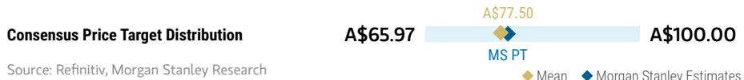

bar_line

| Consensus Price Target Distribution | Value    |
| ----------------------------------- | -------- |
| A$65.97                             | 65.97    |
| A$77.50                             | 77.50    |
| A$100.00                            | 100.00   |

RISK REWARD CHART AND OPTIONS IMPLIED PROBABILITIES (12M)   
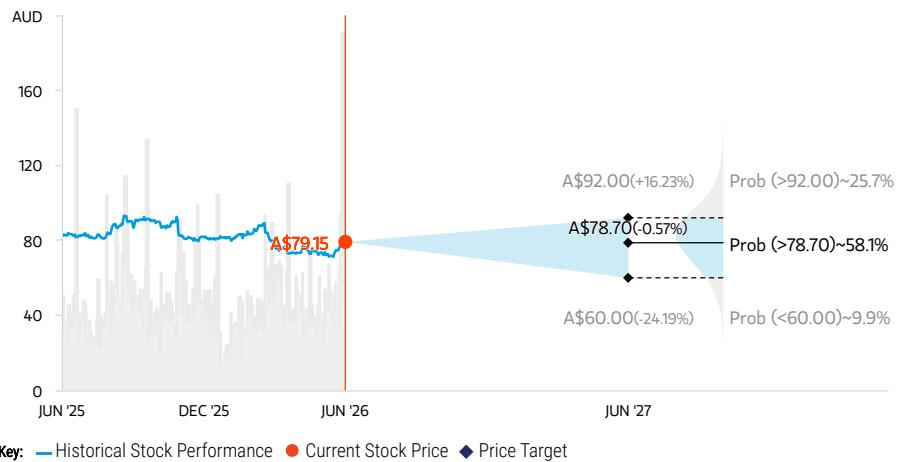

line

| Date    | Historical Stock Performance | Current Stock Price | Price Target |
|---------|-------------------------------|---------------------|--------------|
| JUN '25 | ~80                           | -                   | -            |
| DEC '25 | ~85                           | -                   | -            |
| JUN '26 | $79.15                        | $79.15              | -            |
| JUN '27 | -                             | -                   | $60.00       |
| Prob (>92.00)~25.7% | -                             | -                   | $92.00       |
| Prob (>78.70)~58.1% | -                             | -                   | $78.70       |
| Prob (<60.00)~9.9% | -                             | -                   | $60.00       |

Source: Refinitiv, MS, MS Institutional Equities Division. The probabilities of our Bull, Base, and Bear case scenarios playing out were estimated with implied volatility data from the options market as of 2 Jun 2026. All figures are approximate risk-neutral probabilities of the stock reaching beyond the scenario price in either three-months' or one-years' time. View explanation of Options Probabilities methodology here

# EQUAL-WEIGHT THESIS

■ Consumer remains under pressure with rate uncertainty, extended housing cycle recovery despite resilient labour markets.   
■ Bunnings exposed to expected near term slow down in housing activity.   
■ We forecast M-HSD growth in FY27 earnings, driven by i) slowing sales momentum in Bunnings; ii) ongoing sales momentum in Kmart; and iii) higher WESCEF earnings.   
■ Stretched valuation (>1SD above midcycle) keeps us EW.   
■ Upside risks: M&A, a more resilient-than-anticipated consumer and/or property market. Downside risks: more muted than expected consumer.

Consensus Rating Distribution   
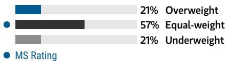

bar

| Category      | Value |
| ------------- | ----- |
| Overweight    | 21%   |
| Equal-weight  | 57%   |
| Underweight   | 21%   |

Source: Refinitiv, MS

# BULL CASE

# A\$92.00

# BASE CASE

# A\$78.70

# BEAR CASE

# A\$60.00

# Strong consumer, improved operating leverage

Bunnings LFL growth MSD-HSD% (FY27e) driven by a more resilient consumer and housing market. Operating leverage sees Kmart margins grow by >20bpts in FY26e. WesCEF ex. lithium earnings supported by a more-favorable-than-expected commodity complex. Lithium pricing ahead of our estimates.

# Momentum continues from discretionary spend growth

Bunnings delivers FY27e 2.0% LFL sales growth. Kmart continues to do well given a consumer shift to value with moderate operating leverage coming through. Lithium production aligns with management guidance. WESCEF benefits from higher Ammonia pricing.

# Weak consumer; housing market sluggish

A more protracted decline in domestic property and a greater slowdown than forecast in discretionary spending results in a greater contraction in FY26-28e LFL growth, with no operating leverage in retail businesses. Lithium pricing below our estimates.

# Risk Reward – Wesfarmers Ltd (WES.AX)

KEY EARNINGS INPUTS 

<table><tr><td>Drivers</td><td>2025</td><td>2026e</td><td>2027e</td><td>2028e</td></tr><tr><td>Bunnings LFL sales growth (%)</td><td>3.5</td><td>3.9</td><td>2.0</td><td>4.0</td></tr><tr><td>Bunnings EBIT margin (%)</td><td>12.6</td><td>12.7</td><td>12.8</td><td>12.8</td></tr><tr><td>Kmart LFL sales growth (%)</td><td>4.0</td><td>5.0</td><td>5.0</td><td>5.0</td></tr><tr><td>Kmart EBIT margin (%)</td><td>10.4</td><td>10.4</td><td>10.4</td><td>10.4</td></tr></table>

# INVESTMENT DRIVERS

- Bunnings store rollout, LFL sales growth and margins   
• Kmart LFL sales growth and margin   
- WesCEF earnings and lithium's eventual earnings contribution

# GLOBAL REVENUE EXPOSURE

100%

APAC, ex Japan, Mainland China and India

Source: MS Estimate View explanation of regional hierarchies here

# MS ALPHA MODELS

4/5

MOST

3 Month

Horizon

Source: Refinitiv, FactSet, MS; 1 is the highest favored Quintile and 5 is the least favored Quintile

# RISKS TO PT/RATING

# RISKS TO UPSIDE

• Utilisation of balance sheet to execute on M&A   
• More resilient-than-anticipated consumer   
• Reacceleration of lithium prices

# RISKS TO DOWNSIDE

- Softer-than-expected sales growth in Bunnings / Kmart   
• Lithium production delays   
• Sustained Catch losses

# OWNERSHIP POSITIONING

Inst. Owners, % Active

37.3%

Source: Refinitiv, MS

# MS ESTIMATES VS. CONSENSUS

FY Jun 2027e

<table><tr><td rowspan="2">Sales / Revenue (A$, mn)</td><td>48,612</td><td>49,507</td><td>50,314</td></tr><tr><td></td><td>49,463</td><td></td></tr></table>

<table><tr><td rowspan="2">EBITDA(A$, mn)</td><td>6,504</td><td>6,716</td><td>7,059</td></tr><tr><td></td><td>6,784</td><td></td></tr></table>

<table><tr><td rowspan="2">Net income (A$, mn)</td><td>2,982</td><td>3,082</td><td>3,405</td></tr><tr><td></td><td>3,138</td><td></td></tr></table>

<table><tr><td rowspan="2">EPS (A$)</td><td>2.63</td><td>2.72</td><td>3.00</td></tr><tr><td></td><td>2.77</td><td></td></tr></table>

Source: Refinitiv, MS

# Risk Reward – Metcash Ltd (MTS.AX)

Challenging Conditions in Hardware Cap Outperformance

# PRICE TARGET A\$3.20

Average of DCF valuation (A\$3.4, WACC 8.9%, terminal growth rate 3%) and P/E relative valuation (A\$3.1, 12x NTM, set at half-way between mid-cycle and -1Std, which we view as appropriate given increased competitive pressures in Grocery, Liquor and Hardware and a delayed recovery in hardware category spend.

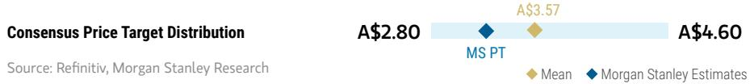

bar_line

| Consensus Price Target Distribution | Value  |
| ----------------------------------- | ------ |
| A$2.80                              | 2.80   |
| A$3.57                              | 3.57   |
| A$4.60                              | 4.60   |

RISK REWARD CHART   
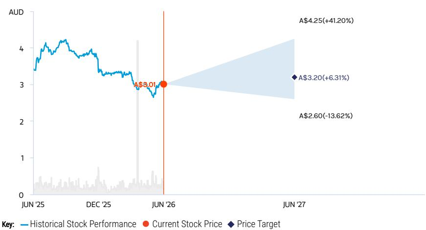

line

| Date    | Historical Stock Performance | Current Stock Price | Price Target |
|---------|-------------------------------|---------------------|--------------|
| JUN '25 | ~4.0                          | -                   | -            |
| DEC '25 | ~3.5                          | -                   | -            |
| JUN '26 | $3.01                         | $3.01               | -            |
| JUN '27 | -                             | $4.25(+41.20%)     | $3.20(+6.31%) |

Source: Refinitiv, MS

# EQUAL-WEIGHT THESIS

■ Challenging operating conditions in Hardware are the key constraint on outperformance. Weak housing activity, cost inflation and poor earnings visibility are compressing margins across the division. A cyclical recovery in the building cycle should deliver operating leverage over time, but the timing & pace of margin rebuild remain uncertain.   
■ Food & Liquor provide a stable earnings base, but competitive pressures continue to build. Investment from majors in supply chain, convenience and eCommerce pressures the independent channel over the longer term, limiting scope for meaningful earnings upside outside of Hardware.   
■ We see limited catalyst for a re-rate until Hardware margins stabilise.

Consensus Rating Distribution   
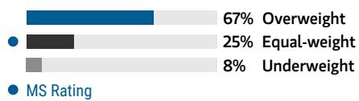

bar

| Category      | Value |
| ------------- | ----- |
| Overweight    | 67%   |
| Equal-weight  | 25%   |
| Underweight   | 8%    |

Source: Refinitiv, MS

# Risk Reward Themes

Self-help: Positive

View descriptions of Risk Rewards Themes here

# BULL CASE

# A\$4.25

# BASE CASE

# A\$3.20

# BEAR CASE

# A\$2.60

# Hardware cycle recovery drives re-rate

Performance in Hardware results in Group long-term EBIT margins increasing to 3.5%. We apply a peak cycle P/E multiple of 17x, reflecting higher growth and margins.

# De-rated, but limited catalyst

Food & Liquor provide a stable earnings base, but competitive pressures continue to build. Challenging conditions in Hardware are well flagged, and the stock has de-rated accordingly. Timing of a cyclical recovery remains uncertain.

# Market share loss in Grocery

Competition in grocery intensifies, which we capture in our terminal growth rate of 2.5% vs. our base case terminal growth rate of 3%. Hardware cycle recovery is pushed out further. Pressures result in long-term EBIT margins of 2.8%. We apply a P/E of \~10x, which is -1 SD below mid-cycle.

# Risk Reward – Metcash Ltd (MTS.AX)

KEY EARNINGS INPUTS 

<table><tr><td>Drivers</td><td>2025</td><td>2026e</td><td>2027e</td><td>2028e</td></tr><tr><td>Food &amp; Grocery EBIT Margins (%)</td><td>2.3</td><td>2.3</td><td>2.3</td><td>2.3</td></tr><tr><td>Liquor EBIT Margins (%)</td><td>2.0</td><td>1.9</td><td>1.9</td><td>1.9</td></tr><tr><td>Hardware EBIT Margins (%)</td><td>5.3</td><td>4.8</td><td>5.0</td><td>5.4</td></tr></table>

# INVESTMENT DRIVERS

- Independent retailer sales performance and wider supermarket sales performance   
- Growth in hardware   
• Overall level of Australian food inflation

# GLOBAL REVENUE EXPOSURE

  
100%

APAC, ex Japan, Mainland China and India

Source: MS Estimate View explanation of regional hierarchies here

# MS ALPHA MODELS

2/5 MOST

3 Month Horizon

Source: Refinitiv, FactSet, MS; 1 is the highest favored Quintile and 5 is the least favored Quintile

# RISKS TO PT/RATING

# RISKS TO UPSIDE

- Hardware category spending rebounds sooner than expected and margins improve.   
• Grocery gains wallet share/market share.

# RISKS TO DOWNSIDE

- Coles and Woolworths engage in more competitive pricing behavior; Aldi accelerates store rollout.   
- Hardware category spending deteriorates materially.   
• Further operational deleverage in Hardware takes place.

# OWNERSHIP POSITIONING

Inst. Owners, % Active

44.2%

Source: Refinitiv, MS

# MS ESTIMATES VS. CONSENSUS

FY Apr 2027e

Sales / Revenue (A\$, mn) 17,494 20,156
18,742 20,248

EBITDA (A\$, mn) 758 800 814
786

Net income (A\$, mn) 272 283 327
289

EPS (A\$) 0.25 0.26 0.27

Mean

◆ M

organ Stanley Estimates

Source: Refinitiv, MS

# Risk Reward – JB Hi-Fi Ltd (JBH.AX)

Best-in-class retailer but valuation looks full

# PRICE TARGET A\$66.50

Average of P/E and DCF.

- P/E valuation of A\$54.6, \~12.5x our NTM EPS. We use ASX200 Ind ex Fins relative P/E, and apply a P/E multiple halfway between mid and -1Std, driven by: 1) fragile consumer backdrop, 2) consumer sentiment weakness, given recent rate hike, 3) management execution and cost discipline, and 4) capital management initiatives.   
- DCF valuation of A\$78.4 - based on WACC of 9.0% and terminal growth rate of 3.5%.

Consensus Price Target Distribution

Source: Refinitiv, MS

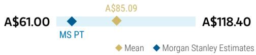

bar_line

| Category       | Value   |
| -------------- | ------- |
| MS PT          | $61.00  |
| A$85.09        | $85.09  |
| A$118.40       | $118.40 |

RISK REWARD CHART   
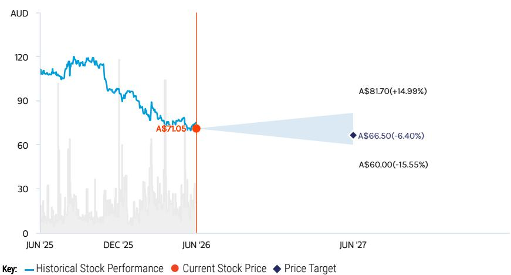

line

| Date    | Historical Stock Performance | Current Stock Price | Price Target |
|---------|-------------------------------|---------------------|--------------|
| JUN '25 | ~115                          | -                   | -            |
| DEC '25 | ~100                          | -                   | -            |
| JUN '26 | $71.05                        | $71.05              | -            |
| JUN '27 | -                             | $66.50              | $60.00       |
|       | -                             | +14.99%             | -            |

Source: Refinitiv, MS

# UNDERWEIGHT THESIS

■ We think JBH is a best-in-class retailer with market-leading positioning and attractive store economics.   
However, a softer housing outlook weighs on big-ticket categories and spend tied to housing activity. AI-driven memory inflation is an additional second-derivative risk, with potential demand headwinds from PC category inflation, an increasingly fragile consumer, and pass-through margin risk for retailers.   
■ Valuation keeps us cautious, trading above mid-cycle on a 12-month forward P/E basis.

Consensus Rating Distribution   
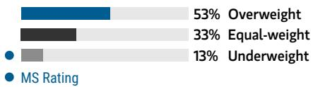

bar

| Category | Value (%) |
|---|---|
| Overweight | 53 |
| Equal-weight | 33 |
| Underweight | 13 |
| MS Rating | - |

Source: Refinitiv, MS

# Risk Reward Themes

Self-help:

Positive

View descriptions of Risk Rewards Themes here

# BULL CASE

# A\$81.70

# Stronger consumer

Greater-than-forecast consumer spending, pass-through of higher costs to consumers. Which results in market share gains. P/E multiple remains elevated thanks to cyclical upswing in consumer spending.

# BASE CASE

# Stable but fragile consumer

Cautious outlook for consumer discretionary spending given recent rate hike, potential margin pressure from categories exposed to memory inflation. Stretched valuation (above mid-cycle) leads us to maintain our cautious view.

# A\$66.50

# BEAR CASE

# A\$60.00

# Consumer pressure

Consumer pressures drive negative comp growth and operating de-leverage, with P/E de-rating to 1-SD below mean.

# Risk Reward – JB Hi-Fi Ltd (JBH.AX)

KEY EARNINGS INPUTS 

<table><tr><td>Drivers</td><td>2025</td><td>2026e</td><td>2027e</td><td>2028e</td></tr><tr><td>JBH AU LFL sales growth (%)</td><td>7.2</td><td>3.6</td><td>2.5</td><td>4.0</td></tr><tr><td>The Good Guys LFL sales growth (%)</td><td>6.5</td><td>3.0</td><td>1.5</td><td>3.5</td></tr><tr><td>JBH AU EBIT margin (%)</td><td>7.5</td><td>7.5</td><td>7.2</td><td>7.2</td></tr><tr><td>The Good Guys EBIT margin (%)</td><td>6.1</td><td>5.9</td><td>5.4</td><td>5.5</td></tr></table>

# INVESTMENT DRIVERS

• Market share gains and overall consumer electronics/home appliances performance   
• Australian macroeconomic conditions   
• Rational competitive market set   
• Capital management initiatives   
• Amazon's success in the Australian market

# GLOBAL REVENUE EXPOSURE

100%

APAC, ex Japan, Mainland China and India

Source: MS Estimate View explanation of regional hierarchies here

# MS ALPHA MODELS

3/5

MOST

3 Month

Horizon

Source: Refinitiv, FactSet, MS; 1 is the highest favored Quintile and 5 is the least favored Quintile

# RISKS TO PT/RATING

# RISKS TO UPSIDE

- Better-than-expected sales growth and greater retention of Covid margin lift   
• Continued rational industry pricing   
- Category innovation accelerating

# RISKS TO DOWNSIDE

- Worse-than-expected LFL sales growth, driven by housing downturn.   
- Abnormal level of discounting, leading to gross margin deterioration   
• CODB pressures above forecast

# OWNERSHIP POSITIONING

Inst. Owners, % Active

11.4%

Source: Refinitiv, MS

# MS ESTIMATES VS. CONSENSUS

FY Jun 2026e

<table><tr><td rowspan="2">Sales / Revenue(A$, mn)</td><td>11,085</td><td>11,133</td><td>11,244</td></tr><tr><td></td><td>11,137</td><td></td></tr></table>

<table><tr><td rowspan="2">EBITDA(A$, mn)</td><td>981</td><td>1,012</td><td>1,030</td></tr><tr><td></td><td>1,010</td><td></td></tr></table>

<table><tr><td rowspan="2">Net income (A$, mn)</td><td>475</td><td>496</td><td>1,020</td></tr><tr><td colspan="3">526</td></tr></table>

<table><tr><td rowspan="2">EPS (A$)</td><td>4.33</td><td>4.52</td><td>4.65</td></tr><tr><td></td><td>4.50</td><td></td></tr></table>

Mean

◆ N

lorga

n Sta

nley

Estir

Source: Refinitiv, MS

# Risk Reward – Harvey Norman Holdings Ltd (HVN.AX)

Growing headwinds from memory inflation and a more challenging consumer backdrop

# PRICE TARGET A\$4.70

Average of P/E and DCF.

- P/E valuation of A\$3.94, we apply a \~11x tgt P/E multiple which is -1Std below mid-cycle, reflective of the challenging outlook for the consumer.   
- DCF of A\$5.40/shr based on WACC of 8.0% and terminal growth rate of 3.5%.

Consensus Price Target Distribution

Source: Refinitiv, MS

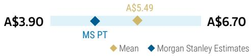

bar_line

| Category       | Value  |
| -------------- | ------ |
| MS PT          | $3.90  |
| MS | $5.49  |
| Mean           | $6.70  |

RISK REWARD CHART   
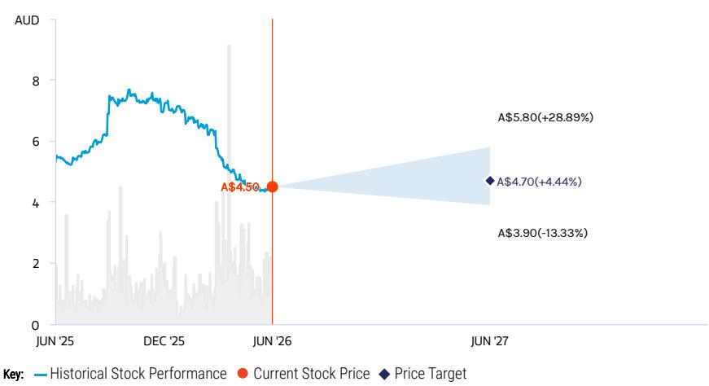

line

| Date    | Historical Stock Performance | Current Stock Price | Price Target |
|---------|-------------------------------|---------------------|--------------|
| JUN '25 | ~5.5                          | -                   | -            |
| DEC '25 | ~7.5                          | -                   | -            |
| JUN '26 | $4.50                         | $4.50               | -            |
| JUN '27 | -                             | $5.80(+28.89%)     | $3.90(-13.33%) |

Source: Refinitiv, MS

# EQUAL-WEIGHT THESIS

■ Housing cycle is a direct headwind. HVN's category skew to white goods, furniture, and outdoor is most levered to property transaction driven demand. Lower housing turnover and softer price growth are expected to weigh on category spend.   
■ AI driven memory inflation is an emerging second derivative risk. PC category inflation, an increasingly fragile consumer, and pass through margin risk present headwinds. However, HVN's higher exposure to white goods, furniture, and outdoor makes it less exposed.   
- \~30% of earnings from owned property offsets cyclical retail risk. Combined with the stock trading 1 Std below mid cycle P/E, this supports a balanced rather than negative stance.

Consensus Rating Distribution   
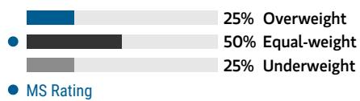

bar

| Category      | Value |
| ------------- | ----- |
| Overweight    | 25%   |
| Equal-weight  | 50%   |
| Underweight   | 25%   |

Source: Refinitiv, MS

# Risk Reward Themes

Disruption: Negative

View descriptions of Risk Rewards Themes here

# BULL CASE

# A\$5.80

# Stronger consumer backdrop

Greater than forecast operational leverage resulting in 5% upside to FY27e EPS. P/E multiple re-rates to be elevated thanks to cyclical upswing in consumer spending.

# BASE CASE

# Challenging outlook

Benign SSSg with domestic retail margins expected to face pressure from increased franchisee support and a tough operating environment. We apply 11x P/E, 1 Std below mid cycle, to reflect the fragile consumer backdrop and rising downside risk.

# A\$4.70

# BEAR CASE

# A\$3.90

# Consumer under pressure

Earnings for FY27e 5% below base case scenario, with P/E de-rating greater than 1-SD below mean.

# Risk Reward – Harvey Norman Holdings Ltd (HVN.AX)

KEY EARNINGS INPUTS 

<table><tr><td>Drivers</td><td>2025</td><td>2026e</td><td>2027e</td><td>2028e</td></tr><tr><td>Australia EBIT margin (%)</td><td>6.1</td><td>6.4</td><td>6.0</td><td>6.1</td></tr><tr><td>New Zealand EBIT margin (%)</td><td>7.2</td><td>8.1</td><td>8.0</td><td>8.0</td></tr><tr><td>Asia EBIT margin (%)</td><td>6.4</td><td>7.2</td><td>6.9</td><td>7.1</td></tr><tr><td>Slovenia EBIT margin (%)</td><td>3.3</td><td>4.5</td><td>3.9</td><td>3.9</td></tr><tr><td>Ireland EBIT margin (%)</td><td>4.2</td><td>4.7</td><td>4.5</td><td>4.5</td></tr></table>

# INVESTMENT DRIVERS

• Australian franchise LFL sales growth   
- Franchisee margins   
- Material change in pricing trends in key categories

# GLOBAL REVENUE EXPOSURE

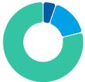

0-10% Europe ex UK   
10-20% UK   
70-80% APAC, ex Japan, Mainland China and India

Source: MS Estimate View explanation of regional hierarchies here

# MS ALPHA MODELS

4/5

MOST

3 Month

Horizon

Source: Refinitiv, FactSet, MS; 1 is the highest favored Quintile and 5 is the least favored Quintile

# RISKS TO PT/RATING

# RISKS TO UPSIDE

• Stronger-than-anticipated sales trends for electrical, furniture and home goods categories   
- Greater-than-anticipated margin recovery associated with accelerating top line sales

# RISKS TO DOWNSIDE

- Material deterioration in retail sales due to weaker economy and or slower rate-cutting path   
- Sharper deacceleration in the Australian housing market

# OWNERSHIP POSITIONING

Inst. Owners, % Active

10.7%

Source: Refinitiv, MS

# MS ESTIMATES VS. CONSENSUS

FY Jun 2026e

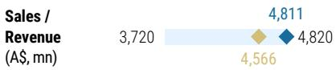

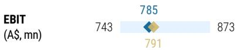

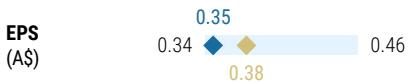

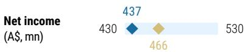

Mean

organ Stanley Estimates

Source: Refinitiv, MS

# Risk Reward Reference links

1. View explanation of Options Probabilities methodology -   
Options\_Probabilities\_Exhibit\_Link.pdf   
2. View descriptions of Risk Rewards Themes - RR\_Themes\_Exhibit\_Link.pdf   
3. View explanation of regional hierarchies - GEG\_Exhibit\_Link.pdf   
4. View explanation of Theme/Exposure methodology -   
ESG\_Sustainable\_Solutions\_External\_Link.pdf   
5. View explanation of HERS methodology - ESG\_HERS\_External\_Link.pdf

# Disclosure Section

The information and opinions in MS were prepared or are disseminated by MS Asia Limited (which accepts the responsibility for its contents) and/or MS Asia (Singapore) Pte. (Registration number 199206298Z) and/or MS Asia (Singapore) Securities Pte Ltd (Registration number 200008434H), regulated by the Monetary Authority of Singapore (which accepts legal responsibility for its contents and should be contacted with respect to any matters arising from, or in connection with, MS), and/or MS Taiwan Limited and/or MS & Co International plc, Seoul Branch, and/or MS Australia Limited (A.B.N. 67 003 734 576, holder of Australian financial services license No. 233742, which accepts responsibility for its contents), and/or MS Wealth Management Australia Pty Ltd (A.B.N. 19 009 145 555, holder of Australian financial services license No. 240813, which accepts responsibility for its contents), and/or MS India Company Private Limited having Corporate Identification No (CIN) U22990MH1998PTC115305, regulated by the Securities and Exchange Board of India ("SEBI") and holder of licenses as a Research Analyst (SEBI Registration No. INH000001105); Stock Broker (SEBI Stock Broker Registration No. INZ000244438), Merchant Banker (SEBI Registration No. INM000011203), and depository participant with National Securities Depository Limited (SEBI Registration No. IN-DP-NSDL-567-2021) having registered office at Altimus, Level 39 & 40, Pandurang Budhkar Marg, Worli, Mumbai 400018, India; Telephone no. +91-22-61181000; Compliance Officer Details: Mr. Tejarshi Hardas, Tel. No.: +91-22-61181000 or Email: tejarshi.hardas@morganstanley.com; Grievance officer details: Mr. Tejarshi Hardas, Tel. No.: +91-22-61181000 or Email: msic-compliance@morganstanley.com which accepts the responsibility for its contents and should be contacted with respect to any matters arising from, or in connection with, MS, and their affiliates (collectively, "MS"). MS India Company Private Limited (MSICPL) may use AI tools in providing research services. All recommendations contained herein are made by the duly qualified research analysts.

For important disclosures, stock price charts and equity rating histories regarding companies that are the subject of this report, please see the MS Disclosure Website at www.morganstanley.com/eqr/disclosures/webapp/generalresearch, or contact your investment representative or MS at 1585 Broadway, (Attention: Research Management), New York, NY, 10036 USA.

For valuation methodology and risks associated with any recommendation, rating or price target referenced in this research report, please contact the Client Support Team as follows: US/Canada +1 800 303-2495; Hong Kong +852 2848-5999; Latin America +1 718 754-5444 (U.S.); London +44 (0)20-7425-8169; Singapore +65 6834-6860; Sydney +61 (0)2-9770-1505; Tokyo +81 (0)3-6836-9000. Alternatively you may contact your investment representative or MS at 1585 Broadway, (Attention: Research Management), New York, NY 10036 USA.

# Analyst Certification

The following analysts hereby certify that their views about the companies and their securities discussed in this report are accurately expressed and that they have not received and will not receive direct or indirect compensation in exchange for expressing specific recommendations or views in this report: Melinda K Baxter; Mac Ross, CFA; Julia M de Sterke.

# Global Research Conflict Management Policy

MS has been published in accordance with our conflict management policy, which is available at www.morganstanley.com/institutional/research/conflictpolicies. A Portuguese version of the policy can be found at www.morganstanley.com.br

# Important Regulatory Disclosures on Subject Companies

As of April 30, 2026, MS beneficially owned 1% or more of a class of common equity securities of the following companies covered in MS: IDP Education Ltd, JB Hi-Fi Ltd, Metcash Ltd, Temple & Webster Group Ltd, Treasury Wine Estates LTD.

In the next 3 months, MS expects to receive or intends to seek compensation for investment banking services from Bega Cheese Ltd, Breville Group Ltd., Coles Group Limited, Domino's Pizza Enterprises LTD, Endeavour Group Ltd, Guzman y Gomez Ltd, IDP Education Ltd, Metcash Ltd, Premier Investments, Sigma Healthcare Ltd, Temple & Webster Group Ltd, Wesfarmers Ltd, Woolworths Group Ltd.

Within the last 12 months, MS has received compensation for products and services other than investment banking services from Wesfarmers Ltd.

Within the last 12 months, MS has provided or is providing investment banking services to, or has an investment banking client relationship with, the following company: Bega Cheese Ltd, Breville Group Ltd., Coles Group Limited, Domino's Pizza Enterprises LTD, Endeavour Group Ltd, Guzman y Gomez Ltd, IDP Education Ltd, Metcash Ltd, Premier Investments, Sigma Healthcare Ltd, Temple & Webster Group Ltd, Wesfarmers Ltd, Woolworths Group Ltd.

Within the last 12 months, MS has either provided or is providing non-investment banking, securities-related services to and/or in the past has entered into an agreement to provide services or has a client relationship with the following company: Guzman y Gomez Ltd, Temple & Webster Group Ltd, Wesfarmers Ltd.

The equity research analysts or strategists principally responsible for the preparation of MS have received compensation based upon various factors, including quality of research, investor client feedback, stock picking, competitive factors, firm revenues and overall investment banking revenues. Equity Research analysts' or strategists' compensation is not linked to investment banking or capital markets transactions performed by MS or the profitability or revenues of particular trading desks.

MS and its affiliates do business that relates to companies/instruments covered in MS, including market making, providing liquidity, fund management, commercial banking, extension of credit, investment services and investment banking. MS sells to and buys from customers the securities/instruments of companies covered in MS on a principal basis. MS may have a position in the debt of the Company or instruments discussed in this report. MS trades or may trade as principal in the debt securities (or in related derivatives) that are the subject of the debt research report.

Certain disclosures listed above are also for compliance with applicable regulations in non-US jurisdictions.

# STOCK RATINGS

MS uses a relative rating system using terms such as Overweight, Equal-weight, Not-Rated or Underweight (see definitions below). MS does not assign ratings of Buy, Hold or Sell to the stocks we cover. Overweight, Equal-weight, Not-Rated and Underweight are not the equivalent of buy, hold and sell. Investors should carefully read the definitions of all ratings used in MS. In addition, since MS contains more complete information concerning the analyst's views, investors should carefully read MS, in its entirety, and not infer the contents from the rating alone. In any case, ratings (or research) should not be used or relied upon as investment advice. An investor's decision to buy or sell a stock should depend on individual circumstances (such as the investor's existing holdings) and other considerations.

# Global Stock Ratings Distribution

(as of May 31, 2026)

The Stock Ratings described below apply to MS's Fundamental Equity Research and do not apply to Debt Research produced by the Firm.

For disclosure purposes only (in accordance with FINRA requirements), we include the category headings of Buy, Hold, and Sell alongside our ratings of Overweight, Equal-weight, Not-Rated and Underweight. MS does not assign ratings of Buy, Hold or Sell to the stocks we cover. Overweight, Equal-weight, Not-Rated and Underweight are not the equivalent of buy, hold, and sell but represent recommended relative weightings (see definitions below). To satisfy regulatory requirements, we correspond Overweight, our most positive stock rating, with a buy recommendation; we correspond Equal-weight and Not-Rated to hold and Underweight to sell recommendations, respectively.

<table><tr><td></td><td colspan="2">Coverage Universe</td><td colspan="3">Investment Banking Clients (IBC)</td><td colspan="2">Other Material Investment ServicesClients (MISC)</td></tr><tr><td>Stock RatingCategory</td><td>Count</td><td>% of Total</td><td>Count</td><td>% of Total IBC</td><td>% of RatingCategory</td><td>Count</td><td>% of Total OtherMISC</td></tr><tr><td>Overweight/Buy</td><td>1542</td><td>42%</td><td>465</td><td>51%</td><td>30%</td><td>707</td><td>43%</td></tr><tr><td>Equal-weight/Hold</td><td>1571</td><td>43%</td><td>369</td><td>40%</td><td>23%</td><td>723</td><td>44%</td></tr><tr><td>Not-Rated/Hold</td><td>3</td><td>0%</td><td>0</td><td>0%</td><td>0%</td><td>1</td><td>0%</td></tr><tr><td>Underweight/Sell</td><td>551</td><td>15%</td><td>86</td><td>9%</td><td>16%</td><td>201</td><td>12%</td></tr><tr><td>Total</td><td>3,667</td><td></td><td>920</td><td></td><td></td><td>1632</td><td></td></tr></table>

Data include common stock and ADRs currently assigned ratings. Investment Banking Clients are companies from whom MS received investment banking compensation in the last 12 months. Due to rounding off of decimals, the percentages provided in the "% of total" column may not add up to exactly 100 percent.

# Analyst Stock Ratings

Overweight (O). The stock's total return is expected to exceed the average total return of the analyst's industry (or industry team's) coverage universe, on a risk-adjusted basis, over the next 12-18 months.

Equal-weight (E). The stock's total return is expected to be in line with the average total return of the analyst's industry (or industry team's) coverage universe, on a risk-adjusted basis, over the next 12-18 months.

Not-Rated (NR). Currently the analyst does not have adequate conviction about the stock's total return relative to the average total return of the analyst's industry (or industry team's) coverage universe, on a risk-adjusted basis, over the next 12-18 months.

Underweight (U). The stock's total return is expected to be below the average total return of the analyst's industry (or industry team's) coverage universe, on a risk-adjusted basis, over the next 12-18 months.

Unless otherwise specified, the time frame for price targets included in MS is 12 to 18 months.

# Analyst Industry Views

Attractive (A): The analyst expects the performance of his or her industry coverage universe over the next 12-18 months to be attractive vs. the relevant broad market benchmark, as indicated below.

In-Line (I): The analyst expects the performance of his or her industry coverage universe over the next 12-18 months to be in line with the relevant broad market benchmark, as indicated below. Cautious (C): The analyst views the performance of his or her industry coverage universe over the next 12-18 months with caution vs. the relevant broad market benchmark, as indicated below. Benchmarks for each region are as follows: North America - S&P 500; Latin America - relevant MSCI country index or MSCI Latin America Index; Europe - MSCI Europe; Japan - TOPIX; Asia - relevant MSCI country index or MSCI sub-regional index or MSCI AC Asia Pacific ex Japan Index.

# Important Disclosures for MS Smith Barney LLC Customers

Important disclosures regarding any material conflict of interest that can reasonably be expected to have influenced MS Smith Barney LLC's choice of a third-party research provider or the subject company of a third-party research report, are available on the MS Wealth Management disclosure website at www.morganstanley.com/online/researchdisclosures. For MS specific disclosures, you may refer to https://www.morganstanley.com/eqr/disclosures/webapp/generalresearch.

Each MS report is reviewed and approved on behalf of MS Smith Barney LLC. This review and approval is conducted by the same person who reviews the research report on behalf of MS. This could create a conflict of interest.

# Other Important Disclosures

MS policy is to update research reports as and when the Research Analyst and Research Management deem appropriate, based on developments with the issuer, the sector, or the market that may have a material impact on the research views or opinions stated therein. In addition, certain Research publications are intended to be updated on a regular periodic basis (weekly/monthly/quarterly/annual) and will ordinarily be updated with that frequency, unless the Research Analyst and Research Management determine that a different publication schedule is appropriate based on current conditions.

MS is not acting as a municipal advisor and the opinions or views contained herein are not intended to be, and do not constitute, advice within the meaning of Section 975 of the Dodd-Frank Wall Street Reform and Consumer Protection Act.

MS produces an equity research product called a "Tactical Idea." Views contained in a "Tactical Idea" on a particular stock may be contrary to the recommendations or views expressed in research on the same stock. This may be the result of differing time horizons, methodologies, market events, or other factors. For all research available on a particular stock, please contact your sales representative or go to Matrix at http://www.morganstanley.com/matrix.

MS is provided to our clients through our proprietary research portal on Matrix and also distributed electronically by MS to clients. Certain, but not all, MS products are also made available to clients through third-party vendors or redistributed to clients through alternate electronic means as a convenience. For access to all available MS, please contact your sales representative or go to Matrix at http://www.morganstanley.com/matrix.

Any access and/or use of MS is subject to MS's Terms of Use (http://www.morganstanley.com/terms.html). By accessing and/or using MS, you are indicating that you have read and agree to be bound by our Terms of Use (http://www.morganstanley.com/terms.html). In addition you consent to MS processing your personal data and using cookies in accordance with our Privacy Policy and our Global Cookies Policy (http://www.morganstanley.com/privacy\_pledge.html), including for the purposes of setting your preferences and to collect readership data so that we can deliver better and more personalized service and products to you. To find out more information about how MS processes personal data, how we use cookies and how to reject cookies see our Privacy Policy and our Global Cookies Policy (http://www.morganstanley.com/privacy\_pledge.html). Please use the provided link to review the Terms and Conditions and Most Important Terms and Conditions for MS India Company Private Limited (https://www.morganstanley.com/assets/pdfs/about-us-global-offices/india/Terms\_and\_conditions.pdf) and the following link to review the audit report (https://ny.matrix.ms.com/eqr/research/webapp/researchdocs/MSICPL\_Morgan\_Stanley\_Research\_Audit\_Report.pdf).

If you do not agree to our Terms of Use and/or if you do not wish to provide your consent to MS processing your personal data or using cookies please do not access our research. MS does not provide individually tailored investment advice. MS has been prepared without regard to the circumstances and objectives of those who receive it. MS recommends that investors independently evaluate particular investments and strategies, and encourages investors to seek the advice of a financial adviser. The appropriateness of an investment or strategy will depend on an investor's circumstances and objectives. The securities, instruments, or strategies discussed in MS may not be suitable for all investors, and certain investors may not be eligible to purchase or participate in some or all of them. MS is not an offer to buy or sell or the solicitation of an offer to buy or sell any security/instrument or to participate in any particular trading strategy. The value of and income from your investments may vary because of changes in interest rates, foreign exchange rates, default rates, prepayment rates, securities/instruments prices, market indexes, operational or financial conditions of companies or other factors. There may be time limitations on the exercise of options or other rights in securities/instruments transactions. Past performance is not necessarily a guide to future performance. Estimates of future performance are based on assumptions that may not be realized. If provided, and unless otherwise stated, the closing price on the cover page is that of the primary exchange for the subject company's securities/instruments.

The fixed income research analysts, strategists or economists principally responsible for the preparation of MS have received compensation based upon various factors, including quality, accuracy and value of research, firm profitability or revenues (which include fixed income trading and capital markets profitability or revenues), client feedback and competitive factors. Fixed Income Research analysts', strategists' or economists' compensation is not linked to investment banking or capital markets transactions performed by MS or the profitability or revenues of particular trading desks.

The "Important Regulatory Disclosures on Subject Companies" section in MS lists all companies mentioned where MS owns 1% or more of a class of common equity securities of the companies. For all other companies mentioned in MS, MS may have an investment of less than 1% in securities/instruments or derivatives of securities/instruments of companies and may trade them in ways different from those discussed in MS. Employees of MS not involved in the preparation of MS may have investments in securities/instruments or derivatives of securities/instruments of companies mentioned and may trade them in ways different from those discussed in MS. Derivatives may be issued by MS or associated persons.

With the exception of information regarding MS, MS is based on public information. MS makes every effort to use reliable, comprehensive information, but we make no representation that it is accurate or complete. We have no obligation to tell you when opinions or information in MS change apart from when we intend to discontinue equity research coverage of a subject company. Facts and views presented in MS have not been reviewed by, and may not reflect information known to, professionals in other MS business areas, including investment banking personnel.

MS personnel may participate in company events such as site visits and are generally prohibited from accepting payment by the company of associated expenses unless pre-approved by authorized members of Research management.

MS may make investment decisions that are inconsistent with the recommendations or views in this report.

To our readers based in Taiwan or trading in Taiwan securities/instruments: Information on securities/instruments that trade in Taiwan is distributed by MS Taiwan Limited ("MSTL"). Such information is for your reference only. The reader should independently evaluate the investment risks and is solely responsible for their investment decisions. MS may not be distributed to the public media or quoted or used by the public media without the express written consent of MS. Any non-customer reader within the scope of Article 7-1 of the Taiwan Stock Exchange Recommendation Regulations accessing and/or receiving MS is not permitted to provide MS to any third party (including but not limited to related parties, affiliated companies and any other third parties) or engage in any activities regarding MS which may create or give the appearance of creating a conflict of interest. Information on securities/instruments that do not trade in Taiwan is for informational purposes only and is not to be construed as a recommendation or a solicitation to trade in such securities/instruments. MSTL may not execute transactions for clients in these securities/instruments.

Certain information in MS was sourced by employees of the Shanghai Representative Office of MS Asia Limited for the use of MS Asia Limited. MS is not incorporated under PRC law and the research in relation to this report is conducted outside the PRC. MS does not constitute an offer to sell or the solicitation of an offer to buy any securities in the PRC. PRC investors shall have the relevant qualifications to invest in such securities and shall be responsible for obtaining all relevant approvals, licenses, verifications and/or registrations from the relevant governmental authorities themselves. Neither this report nor any part of it is intended as, or shall constitute, provision of any consultancy or advisory service of securities investment as defined under PRC law. Such information is provided for your reference only.

MS is disseminated in Brazil by MS C.T.V.M. S.A. located at Av. Brigadeiro Faria Lima, 3600, 6th floor, São Paulo - SP, Brazil; and is regulated by the Comissão de Valores Mobiliários; in Mexico by MS México, Casa de Bolsa, S.A. de C.V which is regulated by Comision Nacional Bancaria y de Valores. Paseo de los Tamarindos 90, Torre 1, Col. Bosques de las Lomas Floor 29, 05120 Mexico City; in Japan by MS MUFG Securities Co., Ltd. and, for Commodities related research reports only, MS Capital Group Japan Co., Ltd; in Hong Kong by MS Asia Limited (which accepts responsibility for its contents) and by MS Bank Asia Limited; in Singapore by MS Asia (Singapore) Pte. (Registration number 199206298Z) and/or MS Asia (Singapore) Securities Pte Ltd (Registration number 200008434H), regulated by the Monetary Authority of Singapore (which accepts legal responsibility for its contents and should be contacted with respect to any matters arising from, or in connection with, MS) and by MS Bank Asia Limited, Singapore Branch (Registration number T14FC0118J); in Australia to "wholesale clients" within the meaning of the Australian Corporations Act by MS Australia Limited A.B.N. 67 003 734 576, holder of Australian financial services license No. 233742, which accepts responsibility for its contents; in Australia to "wholesale clients" and "retail clients" within the meaning of the Australian Corporations Act by MS Wealth Management Australia Pty Ltd (A.B.N. 19 009 145 555, holder of Australian financial services license No. 240813, which accepts responsibility for its contents; in Korea by MS & Co International plc, Seoul Branch; in India by MS India Company Private Limited having Corporate Identification No (CIN) U22990MH1998PTC115305, regulated by the Securities and Exchange Board of India ("SEBI") and holder of licenses as a Research Analyst (SEBI Registration No. INH000001105); Stock Broker (SEBI Stock Broker Registration No. INZ000244438), Merchant Banker (SEBI Registration No. INM000011203), and depository participant with National Securities Depository Limited (SEBI Registration No. IN-DP-NSDL-567-2021) having registered office at Altimus, Level 39 & 40, Pandurang Budhkar Marg, Worli, Mumbai 400018, India; Telephone no. +91-22-61181000; Compliance Officer Details: Mr. Tejarshi Hardas, Tel. No.: +91-22-61181000 or Email: tejarshi.hardas@morganstanley.com; Grievance officer details: Mr. Tejarshi Hardas, Tel. No.: +91-22-61181000 or Email: msic-compliance@morganstanley.com. MS India Company Private Limited (MSICPL) may use AI tools in providing research services. All recommendations contained herein are made by the duly qualified research analysts; in Canada by MS Canada Limited; in Germany and the European Economic Area where required by MS Europe S.E., authorised and regulated by Bundesanstalt fuer Finanzdienstleistungsaufsicht (BaFin) under the reference number 149169; in the US by MS & Co. LLC, which accepts responsibility for its contents. MS & Co. International plc, authorized by the Prudential Regulation Authority and regulated by the Financial Conduct Authority and the Prudential Regulation Authority, disseminates in the UK research that it has prepared, and research which has been prepared by any of its affiliates, only to persons who (i) are investment professionals falling within Article 19(5) of the Financial Services and Markets Act 2000 (Financial Promotion) Order 2005 (as amended, the "Order"); (ii) are persons who are high net worth entities falling within Article 49(2)(a) to (d) of the Order; or (iii) are persons to whom an invitation or inducement to engage in investment activity (within the meaning of section 21 of the Financial Services and Markets Act 2000, as amended) may otherwise lawfully be communicated or caused to be communicated. RMB MS Proprietary Limited is a member of the JSE Limited and A2X (Pty) Ltd. RMB MS Proprietary Limited is a joint venture owned equally by MS International Holdings Inc. and RMB Investment Advisory (Proprietary) Limited, which is wholly owned by FirstRand Limited. The information in MS is being disseminated by MS Saudi Arabia, regulated by the Capital Market Authority in the Kingdom of Saudi Arabia, and is directed at Sophisticated investors only.

The information in MS is being communicated by MS & Co. International plc (DIFC Branch), regulated by the Dubai Financial Services Authority (the DFSA) or by MS & Co. International plc (ADGM Branch), regulated by the Financial Services Regulatory Authority Abu Dhabi (the FSRA), and is directed at Professional Clients only, as defined by the DFSA or the FSRA, respectively. The financial products or financial services to which this research relates will only be made available to a customer who we are satisfied meets the regulatory criteria of a Professional Client. A distribution of the different MS Research ratings or recommendations, in percentage terms for Investments in each sector covered, is available upon request from your sales representative.

The information in MS is being communicated by MS & Co. International plc (QFC Branch), regulated by the Qatar Financial Centre Regulatory Authority (the QFCRA), and is directed at business customers and market counterparties only and is not intended for Retail Customers as defined by the QFCRA.

As required by the Capital Markets Board of Turkey, investment information, comments and recommendations stated here, are not within the scope of investment advisory activity. Investment advisory service is provided exclusively to persons based on their risk and income preferences by the authorized firms. Comments and recommendations stated here are general in nature. These opinions may not fit to your financial status, risk and return preferences. For this reason, to make an investment decision by relying solely to this information stated here may not bring about outcomes that fit your expectations.

The trademarks and service marks contained in MS are the property of their respective owners. Third-party data providers make no warranties or representations relating to the accuracy, completeness, or timeliness of the data they provide and shall not have liability for any damages relating to such data. The Global Industry Classification Standard (GICS) was developed by and is the exclusive property of MSCI and S&P.

MS, or any portion thereof may not be reprinted, sold or redistributed without the written consent of MS.

Indicators and trackers referenced in MS may not be used as, or treated as, a benchmark under Regulation EU 2016/1011, or any other similar framework.

The issuers and/or fixed income products recommended or discussed in certain fixed income research reports may not be continuously followed. Accordingly, investors should regard those fixed income research reports as providing stand-alone analysis and should not expect continuing analysis or additional reports relating to such issuers and/or individual fixed income products. MS may hold, from time to time, material financial and commercial interests regarding the company subject to the Research report.

Registration granted by SEBI and certification from the National Institute of Securities Markets (NISM) in no way guarantee performance of the intermediary or provide any assurance of returns to investors. Investment in securities market are subject to market risks. Read all the related documents carefully before investing.

INDUSTRY COVERAGE: Australia Consumer 

<table><tr><td>COMPANY (TICKER)</td><td>RATING (AS OF)</td><td>PRICE* (06/01/2026)</td></tr><tr><td colspan="3">Julia M de Sterke</td></tr><tr><td>A2 Milk Company Ltd (ATM.NZ)</td><td>O (10/28/2025)</td><td>NZ$6.55</td></tr><tr><td>A2 Milk Company Ltd (A2M.AX)</td><td>O (10/28/2025)</td><td>A$5.32</td></tr><tr><td>Bega Cheese Ltd (BGA.AX)</td><td>O (05/22/2026)</td><td>A$5.46</td></tr><tr><td>Myer Holdings Ltd (MYR.AX)</td><td>O (03/05/2025)</td><td>A$0.25</td></tr><tr><td>Premier Investments (PMV.AX)</td><td>O (01/24/2023)</td><td>A$12.69</td></tr><tr><td colspan="3">Mac Ross, CFA</td></tr><tr><td>Accent Group Ltd (AX1.AX)</td><td>U (11/24/2025)</td><td>A$0.62</td></tr><tr><td>Collins Foods (CKF.AX)</td><td>E (06/01/2026)</td><td>A$8.43</td></tr><tr><td>Metcash Ltd (MTS.AX)</td><td>E (04/03/2024)</td><td>A$3.07</td></tr><tr><td>Super Retail Group Ltd (SUL.AX)</td><td>U (01/30/2024)</td><td>A$11.57</td></tr><tr><td colspan="3">Melinda K Baxter</td></tr><tr><td>Coles Group Limited (COL.AX)</td><td>O (03/12/2025)</td><td>A$21.71</td></tr><tr><td>Domino&#x27;s Pizza Enterprises LTD (DMP.AX)</td><td>U (10/28/2025)</td><td>A$17.58</td></tr><tr><td>Endeavour Group Ltd (EDV.AX)</td><td>E (07/18/2025)</td><td>A$2.89</td></tr><tr><td>Guzman y Gomez Ltd (GYG.AX)</td><td>O (08/08/2024)</td><td>A$20.19</td></tr><tr><td>Harvey Norman Holdings Ltd (HVN.AX)</td><td>E (09/15/2025)</td><td>A$4.59</td></tr><tr><td>IDP Education Ltd (IEL.AX)</td><td>E (06/03/2025)</td><td>A$2.37</td></tr><tr><td>JB Hi-Fi Ltd (JBH.AX)</td><td>U (06/29/2023)</td><td>A$75.13</td></tr><tr><td>Sigma Healthcare Ltd (SIG.AX)</td><td>O (05/02/2025)</td><td>A$2.92</td></tr><tr><td>Treasury Wine Estates LTD (TWE.AX)</td><td>E (08/13/2025)</td><td>A$4.22</td></tr><tr><td>Wesfarmers Ltd (WES.AX)</td><td>E (09/15/2025)</td><td>A$79.75</td></tr><tr><td>Woolworths Group Ltd (WOW.AX)</td><td>E (08/28/2025)</td><td>A$35.06</td></tr></table>

Stock Ratings are subject to change. Please see latest research for each company.   
\* Historical prices are not split adjusted.

© 2026 MS