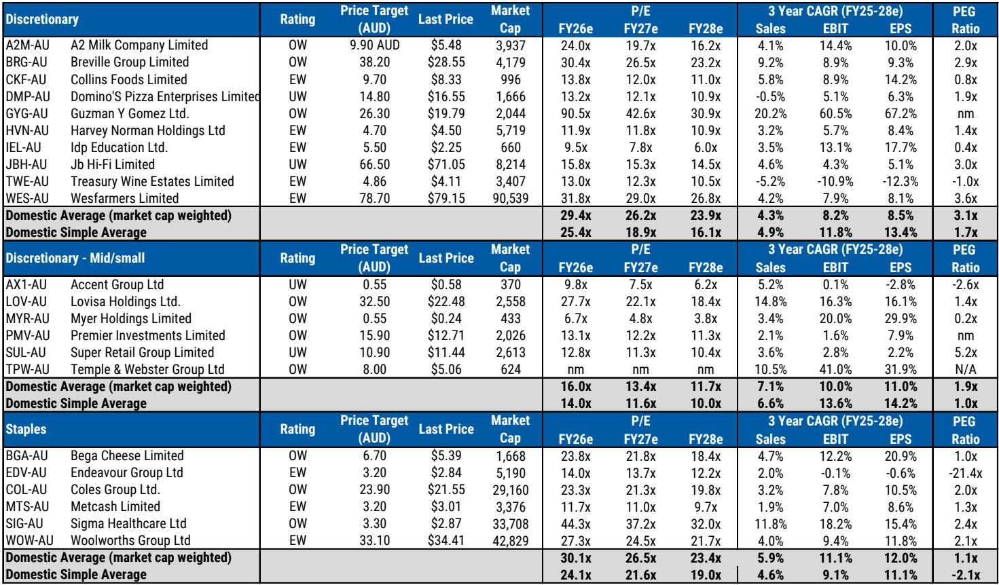
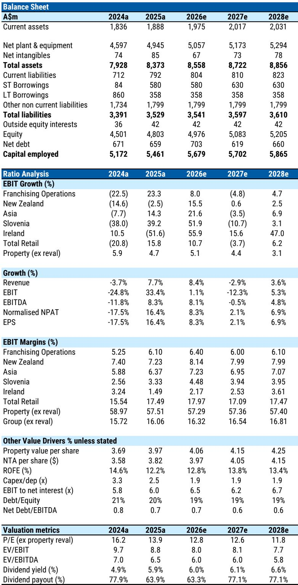
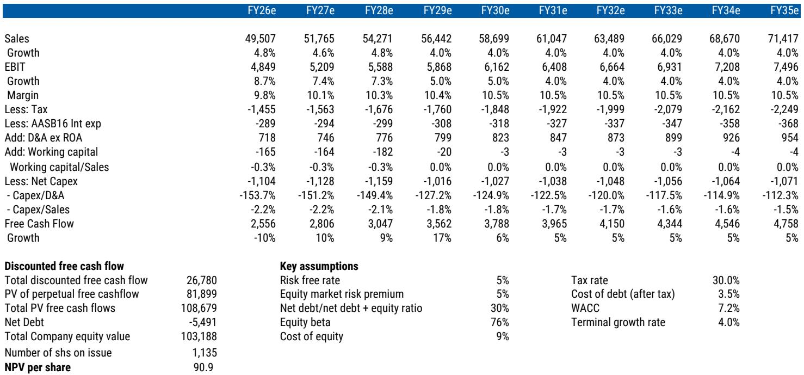

# Australia's Housing Downturn Is Not a Consumer Sideshow — It Is the Main Earnings Risk for Discretionary Retail

The Australian housing market is entering a correction that will reshape consumer spending patterns more sharply than the market currently prices. A global investment bank report projects national house prices to fall 5 to 10 percent and housing turnover to decline 20 to 30 percent, driven by tax changes that disincentivize property investment at a time when interest rates remain restrictive. This is not merely a macro concern for economists. It is a direct earnings risk for the consumer discretionary sector, and the consensus earnings assumptions embedded in current valuations do not fully reflect it.

The transmission mechanism is clear and powerful. Lower house prices erode household wealth and consumer confidence, which directly reduces discretionary spending appetite. Lower turnover means fewer transactions, which means less renovation activity, weaker trade demand, and reduced purchasing of large household items. These channels are not theoretical. They have been observed in prior housing downturns, and the current setup amplifies them because the macro backdrop is already squeezing disposable income through higher rates, less supportive fiscal policy, and elevated essential costs.

The report downgrades the Australia Consumer industry view from In-Line to Cautious, cuts FY27 same-store sales growth and margin assumptions across hardware and big-ticket categories, and prefers staples over discretionary. The logic is sound, but the implications run deeper than the report itself fully explores. The housing downturn is not a single risk factor. It is a structural shift in the demand environment that will separate winners from losers based on category exposure, business model resilience, and balance sheet flexibility.

## Hardware Retailers Carry the Most Direct Exposure, but the Risk Is Not Uniform

Wesfarmers and Metcash hold the most direct exposure to the housing reset through their Bunnings and IHG hardware divisions, respectively. Bunnings accounts for approximately 60 percent of Wesfarmers group profit, while hardware contributes about 33 percent of Metcash group profit. The difference in their sales mix matters enormously for how each will weather the downturn.

Within Bunnings, roughly 40 percent of sales is linked to trade customers and 60 percent to DIY. Historically, DIY has been more resilient during housing market weakness. In FY19, when residential activity slowed, Bunnings same-store sales growth decelerated to 3.9 percent from a prior three-year average of roughly 8 percent. In FY23, it slowed to 1.8 percent from a prior three-year average of roughly 10 percent. These are meaningful decelerations, but they still represent positive growth.

For Metcash, the hardware division has the opposite mix: approximately 60 percent trade and 40 percent DIY. This makes it structurally more vulnerable to a turnover and construction slowdown. In FY19, IHG banner same-store sales growth slowed to 3.0 percent from 7.4 percent in FY18. In FY23, trade same-store sales growth slowed to 3.8 percent from 12.7 percent in FY22. The deceleration is sharper because trade demand is more cyclical and more sensitive to construction activity and renovation project starts.

The report cuts its FY27 Bunnings same-store sales growth estimate to 2.0 percent from 4.0 percent and expects flat year-on-year EBIT margins. For Metcash, the FY27 EPS cut is 1.9 percent. These adjustments are prudent, but they may still prove optimistic if the housing downturn is sharper or more prolonged than the base case assumes. The critical question is whether trade demand will recover quickly once housing turnover stabilizes or whether the structural shift away from investor activity will permanently reduce the addressable market for hardware retailers.

## Big-Ticket Discretionary Retailers Face a Double Squeeze from Wealth Effects and Transaction Volumes

JB Hi-Fi and Harvey Norman face a different but equally challenging dynamic. Their exposure to the housing downturn operates through two channels: the wealth effect from falling house prices, which reduces consumer confidence and willingness to spend on large discretionary items, and the transaction effect from lower turnover, which reduces move-related purchasing across consumer electronics, white goods, furniture, and outdoor categories.

The wealth effect is particularly relevant for big-ticket categories because these purchases are often financed or require a higher level of consumer confidence. When households see the value of their most significant asset declining, they become more cautious about taking on new debt or making large discretionary commitments. This is not a linear relationship. The marginal propensity to consume out of housing wealth is higher for non-essential categories than for essentials, which means the earnings impact is disproportionately concentrated in the discretionary names the report downgrades.

Within JB Hi-Fi, The Good Guys carries more exposure to housing-related categories than the core JB Hi-Fi business. For Harvey Norman, the broader housing-related category exposure across appliances, flooring, and furniture increases sensitivity to weaker housing activity. The report cuts JB Hi-Fi's FY27 EPS by 3.2 percent and Harvey Norman's by 5.7 percent, with price target reductions of 3.3 percent and 13.0 percent respectively. The larger cut to Harvey Norman reflects its higher proportional exposure to housing-related categories and its more pronounced earnings sensitivity to turnover declines.

The question that remains unanswered is how much of the current consensus earnings for these names already embeds a housing recovery that will not materialize. If the housing downturn lasts longer than the base case assumes, the earnings cuts may need to be deeper, and the valuation support from lower interest rate expectations may not arrive in time to offset the fundamental deterioration.

## The Macro Backdrop Compounds the Category-Level Drag in Ways the Market May Underestimate

The housing downturn is not occurring in isolation. It is unfolding against a macro backdrop that is already challenging for consumer discretionary spending. Domestic demand growth is expected to slow well below trend through FY27, with housing and consumption serving as the primary adjustment channels. Higher interest rates are compressing disposable income. Fiscal policy is becoming less supportive. Essential costs, including energy, insurance, and rent, remain elevated relative to history.

This combination creates a compounding effect that is greater than the sum of its parts. The housing downturn reduces the wealth that supports discretionary spending. The macro backdrop reduces the income that supports discretionary spending. Both forces are pushing in the same direction simultaneously, which is unusual in the Australian context. Historically, housing downturns have often been accompanied by policy easing that provided a counterbalancing support to consumer spending. That counterbalance is not present today.

The report notes that consensus estimates across its coverage still imply resilient demand conditions. This is the critical gap. If the housing downturn and macro headwinds are both worse than expected, the earnings risk is not linear. It is convex. The downside to earnings could be meaningfully larger than the base case adjustments suggest, particularly for names with high operating leverage and limited ability to cut costs quickly.

This is where the report's preference for staples over discretionary becomes more than a sector call. It is a structural positioning choice based on the recognition that staples have lower housing sensitivity, more predictable demand, and better earnings visibility in a downturn. The report is overweight Coles, Sigma Healthcare, and Bega Cheese, and underweight JB Hi-Fi, Super Retail Group, and Accent Group. The logic is defensible, but the magnitude of the underweight may need to increase if the housing downturn deepens.

## What the Report Does Not Fully Answer: The Duration, the Second-Order Effects, and the Valuation Threshold

Every good report identifies what it knows and leaves room for what it does not. This report is no exception. Three questions remain unresolved, and they are the questions that will determine whether the cautious view is prescient or premature.

First, how long will the housing downturn last? The report provides a near-term outlook for prices to fall 5 to 10 percent and turnover to decline 20 to 30 percent, but it does not specify the duration of the adjustment. If the decline is front-loaded and recovery begins within 12 months, the earnings impact may be manageable. If the adjustment is prolonged over two to three years, the cumulative earnings damage will be substantially larger, and the valuation support from lower interest rates may not be sufficient to offset it.

Second, what are the second-order effects on trade and construction activity? The report notes that policy changes favor new supply, but higher rates, elevated costs, and softer pre-sales are likely to weigh on approvals and activity near term. The interaction between these forces is complex. If construction activity slows more than expected, the hardware retailers face a deeper and longer demand decline. If construction activity holds up better than expected, the downside may be contained. The range of outcomes is wide, and the report does not narrow it.

Third, what is the valuation threshold at which the risk is fully priced? The report maintains an Equal-Weight rating on Wesfarmers despite the housing headwinds, partly because other group exposures like Kmart and WESCEF provide offsetting support. But at 30 times FY27 price-to-earnings, Wesfarmers trades above mid-cycle valuation. If the housing downturn is worse than expected, the multiple may compress further, creating downside beyond the earnings impact. The same logic applies to the other names. The report cuts price targets, but it does not specify the conditions under which those targets would prove too high.

These open questions are not weaknesses in the analysis. They are the natural boundaries of what any single report can address. They are also the questions that make the full report worth reading, because the charts and data provide the foundation for investors to form their own views on the duration, second-order effects, and valuation thresholds.

## A Decision Framework for Investors: Three Tests to Determine Which Names Can Weather the Housing Downturn

The report provides a clear analytical framework, but it can be translated into a practical decision framework for investors who need to act on the analysis. The framework consists of three tests that separate the names that can weather the downturn from those that cannot.

The first test is category exposure. Names with high exposure to housing-related categories, particularly hardware, building products, and big-ticket discretionary items, face the most direct earnings risk. Names with exposure to staples, essential services, or trade-down beneficiaries face less direct risk. This test is the most straightforward and the most important. The report passes this test clearly by downgrading the industry and cutting estimates for the most exposed names.

The second test is business model resilience. Within the exposed categories, the names with higher DIY exposure, stronger balance sheets, and more flexible cost structures will perform better than those with higher trade exposure, weaker balance sheets, and less flexibility. Wesfarmers passes this test better than Metcash because of its higher DIY mix and stronger balance sheet. Harvey Norman fails this test relative to JB Hi-Fi because of its higher housing-related category exposure and weaker earnings momentum.

The third test is valuation support. Even if a name passes the first two tests, it may still be vulnerable if its valuation does not adequately reflect the housing risk. The report does not provide a clear valuation threshold, but investors can apply their own. If a name trades at a premium to its historical average despite facing a housing downturn, the risk-reward is unfavorable. If a name trades at a discount that more than compensates for the housing risk, the risk-reward is favorable.

The decision framework does not provide binary answers. It provides a structured way to think about the trade-offs. The report's cautious view is a call to apply this framework rigorously, not a call to sell everything. The names that pass all three tests may be worth holding or even adding to on weakness. The names that fail one or more tests may need to be reduced or avoided entirely.

## The Housing Downturn Is a Test of Earnings Quality That Will Separate the Resilient from the Vulnerable

The report's downgrade of the Australia Consumer industry to Cautious is not a dramatic call. It is a prudent recognition that the housing downturn creates earnings risk that the market has not fully priced. The magnitude of the risk depends on the duration of the downturn, the second-order effects on trade and construction, and the valuation threshold at which the risk is fully discounted.

For investors, the key insight is that the housing downturn is not a single risk factor. It is a structural shift in the demand environment that will test the earnings quality of every consumer discretionary name. The names with low housing exposure, resilient business models, and attractive valuations will pass the test. The names with high housing exposure, vulnerable business models, and expensive valuations will fail it.

The report provides the analytical foundation for making this distinction. The full report includes the charts and data that support the analysis, including historical relationships between house prices, turnover, and retail spending, as well as the specific earnings changes for each covered name. Investors who want to apply the decision framework rigorously should review the original material.

Join the community to read the full report and review the original charts.

*This article is for learning and discussion only and does not constitute investment advice.*

Personal reading notes and learning share only. Not investment advice.

