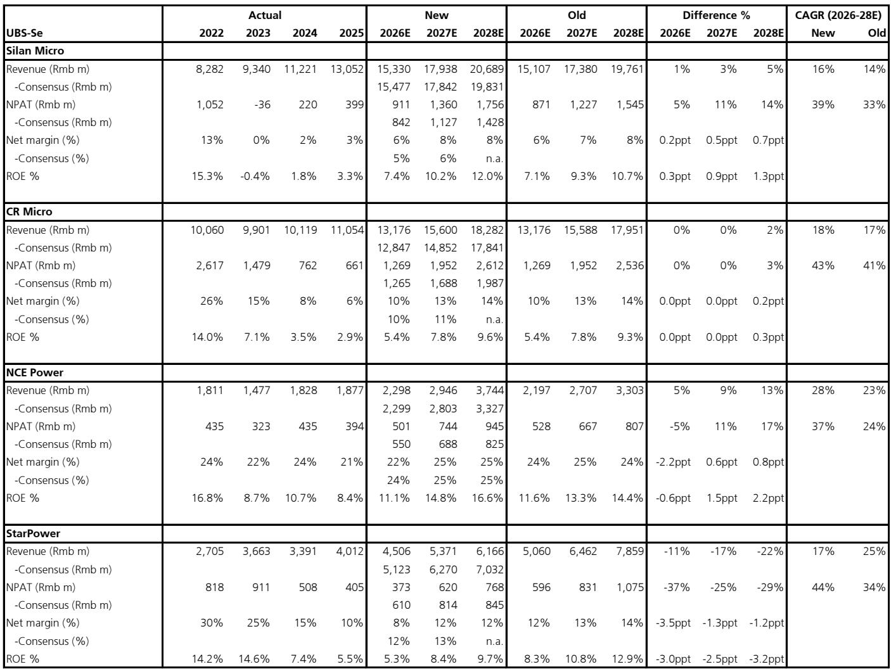
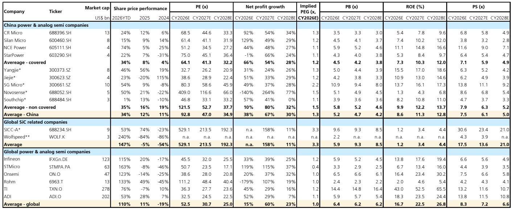

# 市场真正低估的不是需求，而是供给侧的再定价

过去六个月，全球功率半导体股票平均上涨了135%。中国功率半导体公司同期仅上涨34%，其中华润微、士兰微等功率IDM的涨幅更是只有15%-24%。这不是中国公司基本面更差，而是市场正在用一个过时的框架来定价这个周期。

某外资投行最新发布的China Power Semiconductor研报提出一个核心判断：本轮功率半导体周期与以往最大的不同，在于供给侧的结构性收紧。这不是一个短期的供需错配，而是一个“tighter-for-longer”的格局——供给将比市场预期的更长时间处于紧张状态。报告因此上调了多家中国功率IDM的盈利预测和目标价，并将士兰微从中性上调至买入。

这个判断的关键在于，市场习惯性地将功率半导体的周期视为需求驱动的，但这一次，真正驱动利润率扩张和估值重估的变量在供给侧。如果这一框架成立，那么当前中国功率IDM的估值折价，就不是一个简单的“补涨”机会，而是一个系统性重估的开始。

## 1. 供给收紧不是短期现象，而是结构性变化的结果

报告指出，全球功率半导体供应链正在经历一个“tighter-for-longer”的供给格局，背后有两个相互强化的驱动力。

第一个是资本开支的纪律性。功率IDM在2023-2025年显著放缓了资本开支。这不是因为企业对需求悲观，而是在经历了上一轮产能过剩的教训后，整个行业对扩产变得更加谨慎。这种资本纪律在全球范围内是一致的——从英飞凌到TI，从台积电到中国IDM，扩产节奏都在放缓。

第二个是产能的结构性转移。台积电宣布将逐步把部分8英寸和12英寸晶圆产能转换为先进封装，英飞凌也在将部分闲置的IGBT产能转向领先制程的MOSFET。这意味着，即使总晶圆产能没有减少，可用于传统功率器件的产能也在被压缩。

这两个因素叠加，导致的结果是：即使需求没有爆发式增长，供给端的约束也会让产能利用率持续走高。报告数据显示，中国功率IDM的产能利用率已经进一步改善，华润微和士兰微的产能都已处于满产状态。

这里的含义是明确的：市场如果还在用“需求能不能起来”来评估这个周期，那就错过了真正的结构性变量。供给侧的约束，才是本轮利润率扩张的基础。

## 2. 功率IDM是供给收紧的最大受益者，fabless的弹性反而有限

在供给收紧的背景下，不同商业模式的公司受益程度存在显著差异。报告明确提出偏好功率IDM，而不是fabless或fab-lite公司。

原因很简单。当产能紧张时，拥有自有产能的IDM可以确保供应、控制成本，并在价格回升中获得更高的利润率弹性。而fabless公司虽然也能受益于价格上涨，但它们的晶圆成本也会随之上升，利润率的扩张幅度天然受限。

报告给出的数据清晰地展示了这一点。预计华润微和士兰微的净利润率在2025-2028E期间将扩张5-8个百分点，而fab-lite/fabless的斯达半导和新洁能仅扩张2-4个百分点。ROE的改善路径同样分化：士兰微的ROE预计从2025年的3.3%提升至2028E的12.0%，华润微从2.9%提升至9.6%，而fabless公司虽然ROE也在改善，但起点和斜率都不同。

这引出一个重要的投资框架：在供给收紧的周期中，投资者应该优先关注IDM，因为它们的利润率弹性最大。而fabless公司的价值更多体现在产品组合和市场份额增长上，而不是周期弹性。

## 3. SiC渗透率正在加速，但市场可能低估了它的二阶效应

报告对SiC（碳化硅）的展望比此前更加乐观，核心驱动力是价格-性能比的持续改善。经过多年的价格下降，SiC在电动汽车、储能系统和AI数据中心等多个下游领域的渗透率正在上升。

这一趋势已经反映在全球供应链的评论中，也体现在华润微和士兰微的SiC产线已处于满产状态。报告覆盖的公司中，斯达半导和士兰微的SiC收入敞口最高，分别为<15%和<10%。

但这里需要进一步拆解的是，SiC加速渗透对行业竞争格局的二阶影响。SiC不仅是一个新的产品品类，它还可能改变功率半导体行业的竞争边界。传统上，硅基IGBT和MOSFET的竞争格局相对稳定，但SiC的进入门槛更高——从衬底到外延到器件设计，整个价值链都需要重新建立。这意味着，在SiC领域有先发优势的公司，可能获得比硅基时代更强的竞争壁垒。

报告没有完全展开的一个问题是：SiC的渗透是否会加速硅基产品的价格下行？如果SiC在汽车和AI数据中心等高端应用领域快速替代硅基IGBT，那么传统IGBT的产能可能会被释放到其他市场，从而对整体功率器件的价格产生下行压力。这个动态目前尚未在报告的分析中充分体现，但对投资判断至关重要。

## 4. 中国功率IDM的估值折价，反映的是框架错位而非基本面问题

报告最引人注目的数据之一是估值对比：全球功率半导体股票年初至今平均上涨135%，中国同行仅上涨34%，而中国功率IDM如士兰微和华润微的涨幅更是只有15%-24%。

这种估值折价的背后，是市场对中国功率半导体周期的定价框架存在偏差。报告指出，投资者可能忽略了本轮周期的核心驱动力是供给收紧，而功率IDM在供给收紧的环境下具有更强的利润率前景。

用估值数据来检验这一判断：华润微和士兰微的NTM PB均低于2020年以来的历史平均水平。考虑到它们的产能已经满产、利润率正在改善、ROE有望在未来三年持续提升，当前的估值水平显然没有充分反映这一基本面变化。

报告给出的目标价也反映了这一重估逻辑。士兰微的目标价从29.80元上调至46.20元，对应5.2x 2027-28E平均目标PB，参考其2020年以来的历史平均PB。华润微的目标价从68.50元上调至83.40元，对应4.1x 2027-28E平均目标PB，参考其在2023年ROE达7%时的峰值估值。

## 5. 报告尚未完全回答的关键问题：fab-lite转型的成本与收益如何平衡

在报告覆盖的四家公司中，斯达半导是唯一一家被下调盈利预测的。报告将斯达半导2026-28E EPS下调了25-37%，原因是fab-lite转型带来的更高折旧负担，以及对汽车IGBT价格更为谨慎的展望。

但报告同时维持斯达半导的买入评级，目标价从121.40元上调至166.60元，理由是其在SiC和新应用领域的研发能力将驱动增长。预计斯达半导2026-28E的EPS CAGR为44%，高于此前预测的34%。

这里存在一个尚未完全回答的问题：fab-lite转型的折旧负担是短期的一次性冲击，还是长期的结构性成本上升？斯达半导从fabless转向fab-lite，意味着它正在从轻资产模式转向重资产模式。在供给收紧的背景下，拥有自有产能确实能带来供应保障和利润率弹性，但折旧成本的增加也会压缩短期利润。报告没有详细拆解，斯达半导的折旧负担何时会开始下降，以及SiC业务的增长能否在中期内完全抵消这一成本。

这个问题对于理解斯达半导的投资价值至关重要。如果折旧负担是暂时的，那么当前的下调反而是买入机会；如果折旧成本将持续压制利润率，那么当前估值提供的安全边际可能并不像表面看起来那么高。

## 6. 一个观察框架：如何评估中国功率半导体公司的重估空间

基于报告的框架，可以提炼出一个评估中国功率半导体公司重估空间的观察框架。

第一个维度是产能利用率。满产是利润率扩张的前提条件。华润微和士兰微已经处于满产状态，这是它们利润率改善的基础。新洁能和斯达半导的产能利用率也在改善，但作为fabless/fab-lite公司，它们对产能的掌控力不如IDM。

第二个维度是产品组合。在供给收紧的周期中，产品组合越偏向高端、越有定价权的公司，利润率弹性越大。报告特别提到，MOSFET的竞争格局比IGBT更为良性，这意味着新洁能可能在MOSFET领域获得更好的利润率表现。

第三个维度是SiC的敞口和进展。SiC是未来几年功率半导体行业最大的增长驱动力，但不同公司的布局深度不同。士兰微和斯达半导的SiC收入敞口较高，且SiC产线已处于满产状态，这意味着它们已经进入了收获期。华润微的SiC敞口较低（<3%），但拥有6英寸SiC产线，后续的扩张值得关注。

第四个维度是估值框架的合理性。报告对IDM和fabless使用了不同的估值方法：对IDM使用P/B，对fabless使用P/E。这种区分是合理的，因为IDM的重资产特性使得P/B更能反映其资产质量和ROE改善潜力，而fabless的轻资产特性使得P/E更能反映其盈利增长。但投资者需要问的是：当前使用的估值倍数是否合理？报告对华润微和士兰微的目标PB参考了历史均值，但历史均值是否包含了当前供给收紧这一新变量？如果供给收紧是结构性的，那么合理的估值倍数可能应该高于历史均值。

---

以上分析基于报告的框架和数据，但有几个关键问题尚未得到充分回答。供给收紧的格局能持续多久？SiC渗透加速是否会改变传统IGBT的定价？斯达半导的fab-lite转型最终是增厚还是稀释了股东价值？这些问题在报告中有提及但未完全展开，而它们恰恰是判断投资机会的核心。

欢迎来星球微信群里继续讨论。我们将基于完整报告，进一步拆解这些未解问题，包括各公司的SiC产能扩张节奏、折旧曲线的拐点判断，以及不同情景下的估值敏感性分析。这些内容在公开报告中难以完全呈现，但社群讨论可以帮助我们更深入地理解这个正在发生结构性变化的行业。

Personal reading notes and learning share only. Not investment advice.

