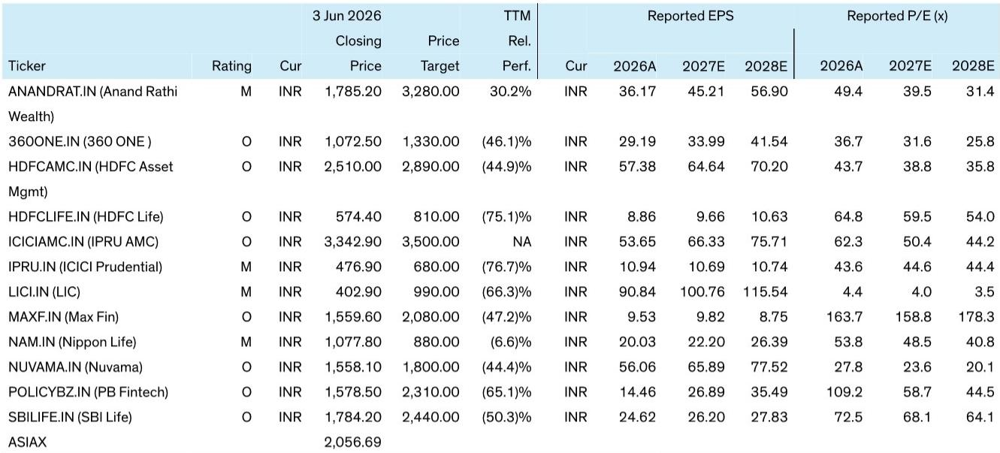
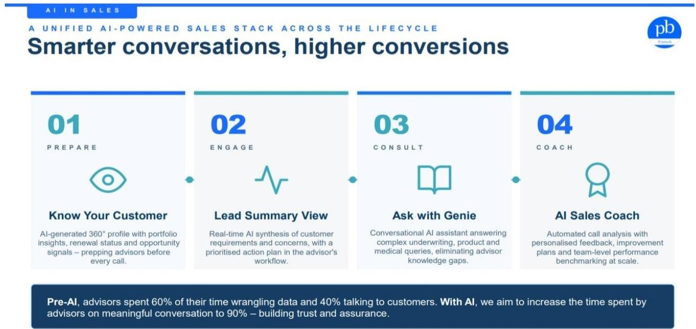
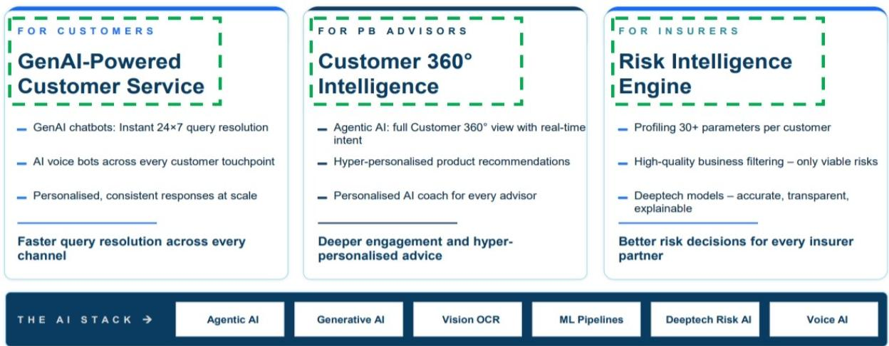

# AI冲击保险分销：市场低估的不是需求，而是分销成本的重新定价

印度保险科技行业正在经历一个被多数投资者忽视的结构性拐点。过去十年，线上保险分销的竞争格局一直由PB Fintech（PolicyBazaar的母公司）主导，其核心壁垒是品牌信任与一支庞大的电话顾问团队。但一份来自某外资投行的最新研报揭示了一个正在逼近的变量：AI语音代理正在改变“人”这个环节的成本结构与可复制性。

这份报告的核心判断并非“AI将颠覆保险分销”，这过于简单。真正值得关注的信号是：AI正在同时从两个方向挤压PB Fintech的护城河——一方面降低了挑战者建立分销能力的门槛，另一方面又给PB Fintech自身提供了大幅改善单位经济模型的机会。市场目前对这两个方向的定价都不充分。

报告以PB Fintech为分析样本，但其结论的适用范围远超单一公司。它实际上在回答一个更根本的问题：当“人工顾问”这个金融分销中最昂贵、最难规模化的环节，开始被AI解构时，哪些商业模式会受益，哪些会受损？

以下是我们从这份研报中提炼出的五个层次洞察，以及一个尚未完全解答的关键追问。

## 1. 保险分销的真正护城河不是技术，而是“人+信任”的运营飞轮

理解AI冲击的前提，是理解PB Fintech现有模式为何难以复制。报告明确指出，过去挑战者未能撼动其地位，原因不在于技术差距，而在于两个进入壁垒：品牌信任的建立成本极高，以及管理一支大规模电话顾问团队的运营复杂度。

PB Fintech的模式本质上是“线上获客+人工成交”。其网站生成大量“温线索”（warm leads），然后由训练有素的电话顾问完成从产品选择、文档填写到理赔咨询的全流程服务。这个“人”的环节，恰恰是保险这类复杂金融产品区别于标准化产品（如定期存款、基金）的核心——消费者在购买保险时，需要更高程度的信任与手把手的指导。

报告提供了一个关键数据：PB Fintech的电话顾问目前只有约40%的工作时间用于与客户直接通话，其余60%消耗在数据整理、流程管理等非增值环节。这既是效率瓶颈，也是未来优化的空间。但反过来看，这40%的“有效通话时间”所产生的销售转化率，正是PB Fintech的核心竞争力所在。任何挑战者要想复制这个模型，不仅要承担高昂的顾问薪酬成本，还要面对管理数千人销售团队的巨大挑战。

这意味着，保险分销领域的竞争，本质上是一场关于“单位有效通话时间”的成本与转化效率的竞赛。谁能在保持或提升转化率的前提下，降低每单位有效通话时间的成本，谁就能获得结构性优势。

## 2. AI语音代理正在从成本端改写竞争规则，挑战者的窗口正在打开

报告揭示了一个关键的成本对比：PB Fintech目前支付给电话顾问的薪酬成本约为每分钟10.5印度卢比（基于月薪5万卢比、25个工作日、8小时工作日的假设）。而AI语音机器人（使用前沿模型）的运营成本约为每分钟4-5卢比，如果使用更便宜的模型或开源模型，成本还能进一步降低。

仅从成本/分钟的角度看，AI已经具备显著优势。但报告没有简单得出“AI将取代人”的结论，而是提出了一个更精细的分析框架：成本/分钟的优势并不等同于成本/销售的优势。当前AI语音机器人的销售转化率远低于人类顾问，这意味着在“成本/销售”这个最终指标上，人类仍然占优。

然而，这个平衡正在被打破。随着AI模型在自然度、理解能力和对话流畅性上的持续进步，转化率差距在缩小。报告提到，像Zyra AI这样的初创公司正在构建“AI原生”的保险购买体验，用户可以直接与AI顾问对话并完成购买决策。更多挑战者也在计划利用AI驱动的呼叫中心来进入这个市场。

关键洞察在于：AI语音代理降低了挑战者跨越“管理大型电话顾问团队”这一运营门槛的难度。过去，挑战者需要同时解决品牌获客和人力管理两个难题。现在，AI至少可以帮助他们解决后者。即使AI暂时无法完全替代人类顾问，它也能让挑战者以更低的成本启动“辅助销售”模式，从而对PB Fintech的现有业务形成实质性竞争压力。

这意味着，PB Fintech过去赖以成功的“人海战术”壁垒，正在被技术侵蚀。挑战者不再需要复制一个同样规模的电话顾问团队，他们只需要一个高效的AI语音层。

## 3. PB Fintech最大的机会不是防守，而是用AI将单位成本砍半

竞争压力只是故事的一面。报告同样强调了PB Fintech自身利用AI进行效率提升的巨大空间。如果PB Fintech能够成功实施其AI战略，将电话顾问的有效通话时间从40%提升到90%，那么其每分钟有效通话时间的薪酬成本将从10.5卢比降至约4.6卢比——几乎与AI语音机器人的成本持平。

这意味着什么？意味着PB Fintech可以在不牺牲其核心优势（人类顾问的高转化率）的前提下，大幅降低运营成本。报告估算，呼叫中心薪酬成本目前约占PB Fintech核心业务收入的40%。如果这个数字能够显著下降，将直接转化为贡献利润率的提升，且这种提升是结构性的、可持续的。

这是一个“人机协同”的最优解：AI负责处理数据整理、客户画像生成、产品推荐辅助等非核心环节，将人类顾问解放出来，专注于最需要信任和同理心的沟通环节。报告中的Exhibit 1详细展示了PB Fintech的AI销售栈，包括AI生成的客户360度画像、实时需求综合、对话式AI助手以及AI销售教练。这套系统旨在让顾问在通话前就已充分了解客户，在通话中能即时回答复杂问题，在通话后获得个性化反馈。

更值得关注的是，报告指出这一效率提升对PB Fintech的时机意义。该公司正面临监管层面可能压缩其佣金率的压力。AI驱动的成本优化，恰好可以成为对冲监管风险、维持利润率的关键手段。如果执行得当，PB Fintech不仅能守住阵地，还能在竞争中进一步扩大利润优势。

## 4. 更大的战场：AI对金融分销“单位经济模型”的通用改造

报告的分析框架并不局限于保险分销。其核心逻辑——通过AI提升客户接触型岗位的生产效率——可以推广到几乎所有的金融分销场景。

对于财富管理机构，AI可以赋能客户经理（RM）管理更多客户。每位客户经理管理的客户数量增加，意味着人均资产管理规模（AUM）的提升，进而带来人均收入和利润的增长。由于成本基础不会与收入同步增长，利润率将自然扩张。对于共同基金分销商，AI可以增强技术平台，提升客户转化率和个性化推荐能力。对于银行，AI可以优化网点柜员和客户经理的生产效率。对于保险公司，AI可以提升代理人渠道的销售效率。

这是一个“通用杠杆”：任何以客户互动为核心环节的金融分销业务，都可以通过AI实现“单位员工服务更多客户”的目标，从而改善单位经济模型。报告没有展开的是，这种改造对不同类型金融机构的竞争格局可能产生何种影响。例如，大型银行和财富管理公司拥有更丰富的数据和更强的IT能力，可能更快地实现AI赋能，从而进一步拉大与中小型机构之间的效率差距。

这意味着，AI对金融分销的影响将是一个“赢家通吃”或至少是“大者恒大”的过程。那些拥有客户基础、数据资产和技术投入能力的机构，将有机会利用AI巩固甚至扩大其领先地位。

## 5. 报告尚未完全回答的关键问题：转化率的“黑箱”与监管的“达摩克利斯之剑”

尽管报告的分析框架清晰有力，但有两个关键变量尚未被完全解答，而这恰恰是投资者需要持续跟踪的。

第一个变量是AI语音代理的转化率究竟能达到什么水平。报告坦诚地指出，当前AI的成本/分钟优势尚未转化为成本/销售优势，因为转化率差距过大。但报告没有给出具体的数据或模型来量化这个差距，也没有预测转化率何时能够缩小到足以改变竞争格局的程度。这是一个“黑箱”问题。转化率的提升不仅取决于AI技术本身（语音自然度、理解能力、情感识别），还取决于消费者对AI顾问的信任接受度——这是一个更慢、更难以预测的文化变量。如果消费者始终对“机器卖保险”心存疑虑，AI的冲击可能被高估。

第二个变量是监管。报告提到了监管可能压缩佣金率的风险，但没有深入分析监管对AI分销模式的影响。例如，监管机构是否会对AI销售金融产品设置更严格的合规要求？是否要求必须有“人类在环”才能完成销售？这些监管变量可能从根本上改变AI分销的可行性。在印度这样一个监管环境快速演变的市场上，这可能是比技术本身更重要的不确定性。

这两个问题——转化率的真实演进路径和监管的潜在干预——构成了这份报告最值得追问的伏笔。它们决定了AI冲击是“渐进式优化”还是“颠覆式重构”。

---

以上分析只是基于这份研报核心逻辑的提炼与推演。报告中还有更多关于PB Fintech的估值框架、竞争格局的详细数据，以及Exhibit 1中展示的AI销售栈具体运作方式，这些细节无法在一篇文章中完全展开。

如果你对以下问题感兴趣——AI语音代理的转化率数据是否有更具体的测算？PB Fintech的AI实施已经达到了什么阶段？监管风险的具体情景分析是什么？——欢迎来我们的星球微信群里继续讨论。我们会分享完整的研报解读，以及更多关于金融科技AI应用的深度分析。

Personal reading notes and learning share only. Not investment advice.

