# U.S. IT Hardware

# APPLE TRACKER (April): iPhone revenue up 6% YoY in a shrinking market

Mark C. Newman

+1 212 845 7822

mark.newman@bernsteinsg.com

Mark Li

+852 2123 2645

mark.li@bernsteinsg.com

Alex Wang, CFA

+852 2123 2613

alex.wang@bernsteinsg.com

Stacy A. Rasgon, Ph.D.

+1 213 559 5917

stacy.rasgon@bernsteinsg.com

David Dai, CFA

+852 2918 5704

david.dai@bernsteinsg.com

April Li

+1 917 344 8339

april.li@bernsteinsg.com

Phoebe Sun

+1 917 344 8481

phoebe.sun@bernsteinsg.com

Edward Hou, CFA

+852 2123 2623

edward.hou@bernsteinsg.com

Yipin Cai, CFA

+852 2123 2669

yipin.cai@bernsteinsg.com

Shirley Yang, CFA

+852 2123 2660

shirley.yang@bernsteinsg.com

Ethan Xu

+852 2123 2634

ethan.xu@bernsteinsg.com

Alrick Shaw

+1 917 344 8454

alrick.shaw@bernsteinsg.com

Arpad von Nemes

+1 917 344 8461

arpad.vonnemes@bernsteinsg.com

The Apple Tracker breaks down the latest data on iPhone sales and services from Counterpoint and Sensor Tower, and analyzes what this means for Apple and the supply chain. For more on our Apple views see our Apple Deep Dive.

Global iPhone April sell-through revenue grew 5.6% YoY, with unit volumes up 2.5% and ASP up 3%. Although YoY growth appears to slow this is somewhat due to tough comps in April 2025 (tariff announcements), and is remarkable performance in a shrinking market. Counterpoint estimates global smartphone sales will decline by 14% in 2026.

We do not expect Apple to hike price intra-cycle like peers, but rather to continue driving ASP uplift through mix shift toward higher-end Pro, Pro Max models, and larger storage configurations. In the US, April iPhone sales declined 7% YoY, with unit shipments down 13% and ASP increasing 6%. The YoY weakness in US primarily reflects a tough comp due to demand pull-forward in April 2025. In China, iPhone sales rose 5.6% YoY in April, driven entirely by higher ASPs, with unit volumes largely flat.

Despite a solid start, 17e demand has trailed 16e during the first seven weeks, partly due to less aggressive North American carrier promotions and a prepaid channel that remains more concentrated around the 16e. However, when considering total iPhone “e”-series sales (16e plus 17e), the last two months since the 17e launch are up vs. same period last year.

Sell-in and sell-through units were up 3% YoY, reflecting a strong iPhone 17 cycle. Inventory units increased MoM due to sell-through units below sell-in, and we see a meaningful uptick in inventory weeks.

For foundry/TSMC: weaker performance of iPhone 17e dragged the momentum of TSMC's N3P, but we believe overall Apple still holds up better vs. its smartphone peers. Even if Apple or any mobile customers release leading-node capacity, the capacity will be refilled by AI applications and TSMC won't experience revenue loss.

For Memory: the DRAM content YoY increase was 26% in April, vs. 20% increase from 2024 to 2025 on full-year basis. We will monitor how recent memory price hike affects the trend in the future.

For the rest of Apple's supply chain: channel check suggests the shipment of foldable phone is likely to be delayed, while the product launch is still targeted in Sep. Despite that, we still expect suppliers to Apple will outperform Android's this year, benefiting Luxshare. For Sony, however, there will likely be no upgrades in CIS this year, and we see higher risk of share loss to Samsung in 2027. For Qualcomm, strong performance from iPhone 17 base and pro models may be helpful in the near term, though Android performance appears to be suffering on the back of rising memory prices and Apple share gains (neither of which is positive, especially as Apple increasingly internalizes over time).

BERNSTEIN TICKER TABLE 

<table><tr><td rowspan="2">Ticker</td><td rowspan="2">Rating</td><td colspan="4">2 Jun 2026</td><td rowspan="2">TTMRel.</td><td colspan="4">Reported EPS</td><td colspan="3">Reported P/E (x)</td></tr><tr><td>Cur</td><td>Closing Price</td><td>Price Target</td><td>Target Perf.</td><td>Cur</td><td>2025A</td><td>2026E</td><td>2027E</td><td>2025A</td><td>2026E</td><td>2027E</td></tr><tr><td>AAPL (Apple )</td><td>O</td><td>USD</td><td>315.20</td><td>350.00</td><td>26.9%</td><td>USD</td><td>7.46</td><td>8.87</td><td>10.65</td><td>42.3</td><td>35.5</td><td>29.6</td><td></td></tr><tr><td>SNDK (SanDisk)</td><td>O</td><td>USD</td><td>1,716.36</td><td>1,700.00</td><td>4313.7%</td><td>USD</td><td>2.99</td><td>64.73</td><td>200.47</td><td>574.0</td><td>26.5</td><td>8.6</td><td></td></tr><tr><td>QCOM (Qualcomm )</td><td>M</td><td>USD</td><td>240.84</td><td>140.00</td><td>33.5%</td><td>USD</td><td>12.03</td><td>10.64</td><td>9.77</td><td>20.0</td><td>22.6</td><td>24.6</td><td></td></tr><tr><td>AVGO (Broadcom)</td><td>O</td><td>USD</td><td>481.57</td><td>525.00</td><td>59.3%</td><td>USD</td><td>6.82</td><td>11.38</td><td>17.73</td><td>70.6</td><td>42.3</td><td>27.2</td><td></td></tr><tr><td>2330.TT (TSMC)</td><td>O</td><td>TWD</td><td>2,425.00</td><td>2,780.00</td><td>104.5%</td><td>TWD</td><td>66.25</td><td>101.62</td><td>124.63</td><td>11.6</td><td>8.6</td><td>6.6</td><td></td></tr><tr><td>TSM (TSMC)</td><td>O</td><td>USD</td><td>446.69</td><td>430.00</td><td>97.8%</td><td>USD</td><td>10.50</td><td>16.11</td><td>19.75</td><td>13.5</td><td>10.0</td><td>7.6</td><td></td></tr><tr><td>000660.KS (SK hynix)</td><td>O</td><td>KRW</td><td>2,324,000</td><td>1,150,000</td><td>969.2%</td><td>KRW</td><td>60,341</td><td>286,732</td><td>385,594</td><td>38.5</td><td>8.1</td><td>6.0</td><td></td></tr><tr><td>005930.KS (SEC- Samsung)</td><td>O</td><td>KRW</td><td>362,500</td><td>225,000</td><td>487.4%</td><td>KRW</td><td>6,611.53</td><td>35,740</td><td>49,548</td><td>54.8</td><td>10.1</td><td>7.3</td><td></td></tr><tr><td>005935.KS (SEC-Pref - Samsung)</td><td>O</td><td>KRW</td><td>231,500</td><td>191,250</td><td>348.7%</td><td>KRW</td><td>6,611.53</td><td>35,740</td><td>49,548</td><td>35.0</td><td>6.5</td><td>4.7</td><td></td></tr><tr><td>SMSN.LI (Samsung)</td><td>O</td><td>USD</td><td>5,905.00</td><td>3,888.00</td><td>427.5%</td><td>USD</td><td>116.15</td><td>617.62</td><td>856.24</td><td>50.8</td><td>9.6</td><td>6.9</td><td></td></tr><tr><td>MU (Micron)</td><td>O</td><td>USD</td><td>1,064.10</td><td>510.00</td><td>912.5%</td><td>USD</td><td>8.29</td><td>62.53</td><td>121.03</td><td>128.4</td><td>17.0</td><td>8.8</td><td></td></tr><tr><td>2454.TT (MediaTek)</td><td>O</td><td>TWD</td><td>4,545.00</td><td>4,380.00</td><td>205.7%</td><td>TWD</td><td>66.17</td><td>69.52</td><td>170.50</td><td>68.7</td><td>65.4</td><td>26.7</td><td></td></tr><tr><td>SONY (Sony )</td><td>M</td><td>USD</td><td>22.79</td><td>22.00</td><td>(40.9)%</td><td>USD</td><td>1.08</td><td>1.25</td><td>1.30</td><td>21.2</td><td>18.3</td><td>17.5</td><td></td></tr><tr><td>6758.JP (Sony)</td><td>M</td><td>JPY</td><td>3,619.00</td><td>3,500.00</td><td>(46.6)%</td><td>JPY</td><td>171.30</td><td>198.75</td><td>207.66</td><td>21.1</td><td>18.2</td><td>17.4</td><td></td></tr><tr><td>3008.TT (Largan)</td><td>M</td><td>TWD</td><td>3,985.00</td><td>2,600.00</td><td>26.3%</td><td>TWD</td><td></td><td></td><td></td><td></td><td></td><td></td><td></td></tr><tr><td>002475.CH ( Luxshare )</td><td>O</td><td>CNY</td><td>74.80</td><td>86.00</td><td>95.9%</td><td>CNY</td><td>2.26</td><td>2.66</td><td>3.45</td><td>33.1</td><td>28.1</td><td>21.7</td><td></td></tr><tr><td>2382.HK (Sunny Optical)</td><td>O</td><td>HKD</td><td>84.35</td><td>76.00</td><td>(10.8)%</td><td>CNY</td><td>4.25</td><td>3.39</td><td>4.46</td><td>17.1</td><td>21.5</td><td>16.3</td><td></td></tr><tr><td>SPX</td><td></td><td></td><td>7,609.78</td><td></td><td></td><td></td><td></td><td></td><td></td><td></td><td></td><td></td><td></td></tr><tr><td>ASIAX</td><td></td><td></td><td>2,056.69</td><td></td><td></td><td></td><td></td><td></td><td></td><td></td><td></td><td></td><td></td></tr><tr><td>EM</td><td></td><td></td><td>1,904.43</td><td></td><td></td><td></td><td></td><td></td><td></td><td></td><td></td><td></td><td></td></tr><tr><td>JPL</td><td></td><td></td><td>2,575.72</td><td></td><td></td><td></td><td></td><td></td><td></td><td></td><td></td><td></td><td></td></tr></table>

O - Outperform, M - Market-Perform, U - Underperform, NR - Not Rated, CS - Coverage Suspended   
AAPL, SNDK, QCOM, AVGO, MU estimate is Adjusted EPS; AAPL, SNDK, QCOM, AVGO, MU valuation is Adjusted P/E (x); 2330.TT, TSM valuation is P/B (x); 3008.TT base year is 1999;   
Source: Bloomberg, Bernstein estimates and analysis.

# INVESTMENT IMPLICATIONS

Apple: As the gateway to the Intelligence revolution benefiting from stronger than expected iPhone 17 demand, we rate AAPL Outperform with a price target of \$350.

SanDisk: We rate SNDK Outperform with a price target of \$1700.

Samsung Electronics: We rate Samsung Electronics Outperform with price target of KRW225,000.

SK hynix : We rate SK hynix Outperform with price target of KRW1,150,000.

Micron: We rate Micron Outperform with price target of US\$510.00.

TSMC: We rate TSMC Outperform with price target of NT\$2,780.00.

MediaTek: We rate MediaTek Outperform with price target of NT\$4,380.00.

Sunny Optical: We rate Sunny Optical Outperform, with PT = HK\$76.00.

Luxshare: We rate Luxshare Outperform, with PT = RMB86.00.

Largan: We rate Largan Market-Perform, with PT = HK\$2,600.00.

Sony: We rate Sony (6748.JP) Market-Perform, PT = JPY 3,500.00.

QCOM (MP, \$140): Memory headwinds appear likely to pressure smartphone builds and numbers appear high; cheap valuation may not be enough to attract buyers.

AVGO (OP, \$525): A strong 2025 AI trajectory seems set to accelerate into 2026 and beyond, bolstered by software, cash deployment, and superb margins & FCF.

# Table Of Contents

1. iPhone Performance remained solid: Global revenue rose 5.6% YoY, unit volumes Up 2.5% YoY, and ASP up 3%....4   
2. iPhone 17e's performance is weakening vs iPhone 16e in YoY comparison....8   
3. Channel Inventory elevated....10   
4: Foundry & Memory - Positive for demand and content.... 12   
Foundry....12   
Memory....13   
5. iPhone demand by region....17

# DETAILS

# 1. IPHONE PERFORMANCE REMAINED SOLID: GLOBAL REVENUE ROSE 5.6% YOY, UNIT VOLUMES UP 2.5% YOY, AND ASP UP 3%.

State of the Union - Counterpoint's latest Smartphone Market Outlook Tracker now forecasts full-year 2026 shipments to decline $13.9\%$ YoY to 1.08 billion units, a further downgrade from the $12.4\%$ contraction projected in February. The weakness is skewed toward lower-end devices, where demand and viability are deteriorating most sharply.

Globally, smartphone wholesale prices rose 14% in Q1, with upward pressure expected to persist as pre-shock inventory is depleted. Several sub-\$150 price tiers are facing what appears to be a structural, potentially permanent exit from the market. In contrast, the premium segment is proving more resilient. Apple and Samsung remain best positioned, supported by integrated supply chains and established premiumization strategies. Apple, in particular, is unlikely to raise prices mid-cycle, instead relying on a continued mix shift toward higher-end Pro and Pro Max models, including larger memory configurations. In April, iPhone performance remained solid: global sell-through revenue rose 5.6% YoY, unit volumes increased 2.5% YoY, and ASPs climbed 3%.

In the US, April iPhone sales declined 7% YoY, with unit shipments down 13% and ASP increasing 6%. The YoY weakness primarily reflects a tough comp due to demand pull-forward in April 2025. iPhone 17e performance has been solid, but promotional activity has been less aggressive relative to the 16e last year, contributing to the decline. Promotions from both Verizon and T-Mobile on Apple and Samsung devices have moderated. In prepaid, demand continues to consolidate around the iPhone 16e as sales of older models such as the iPhone 14 and 15 slow further. Cricket shifted away from promoting the iPhone 13 in April and is now featuring the 16e as its flagship Apple offering. The 17e remains primarily positioned in postpaid, though it is expected to see broader prepaid distribution later in the year.

In China, iPhone sales rose 5.6% YoY in April, driven entirely by higher ASPs, with unit volumes largely flat. There were no major Apple-led discount events in the market, though the national trade-in and recycling subsidy program remained active. For the upcoming 618 festival, promotions began around May 15, 2026, including an RMB 1,000 price cut on the iPhone 17 Pro across platforms such as JD.com and Tmall.

EXHIBIT 1: Sell-thru Units (mn) in the first 8 months of launch - iPhone 17 vs. Past Cycles   
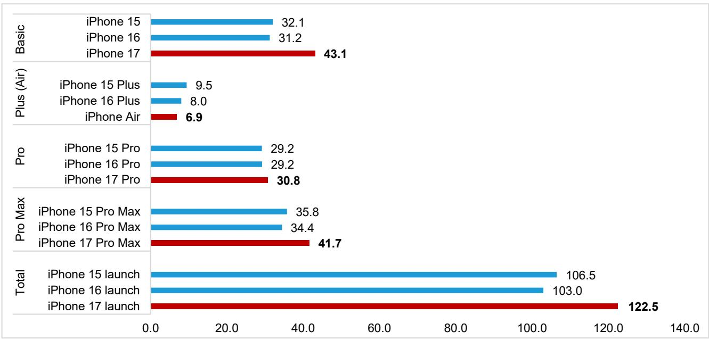

bar

| Category | iPhone Model | Value |
| :--- | :--- | :--- |
| Basic | iPhone 15 | 32.1 |
| Basic | iPhone 16 | 31.2 |
| Basic | iPhone 17 | 43.1 |
| Plus (Air) | iPhone 15 Plus | 9.5 |
| Plus (Air) | iPhone 16 Plus | 8.0 |
| Plus (Air) | iPhone Air | 6.9 |
| Pro | iPhone 15 Pro | 29.2 |
| Pro | iPhone 16 Pro | 29.2 |
| Pro | iPhone 17 Pro | 30.8 |
| Pro Max | iPhone 15 Pro Max | 35.8 |
| Pro Max | iPhone 16 Pro Max | 34.4 |
| Pro Max | iPhone 17 Pro Max | 41.7 |
| Total | iPhone 15 launch | 106.5 |
| Total | iPhone 16 launch | 103.0 |
| Total | iPhone 17 launch | 122.5 |

Source: Counterpoint, Bernstein Analysis

EXHIBIT 2: Global iPhone revenue, units, ASP   
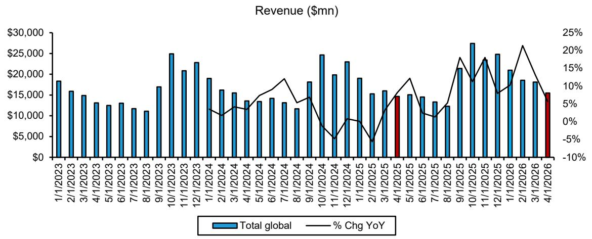

bar_line

Revenue ($mn)
| Date | Total global ($mn) | % Chg YoY (%) |
|---|---|---|
| 1/1/2023 | 18500 | 1.5 |
| 2/1/2023 | 16000 | 1.4 |
| 3/1/2023 | 14800 | 1.3 |
| 4/1/2023 | 13200 | 1.2 |
| 5/1/2023 | 12900 | 1.1 |
| 6/1/2023 | 13100 | 1.0 |
| 7/1/2023 | 11800 | 0.9 |
| 8/1/2023 | 11200 | 0.8 |
| 9/1/2023 | 17000 | 1.6 |
| 10/1/2023 | 25000 | 2.5 |
| 11/1/2023 | 20800 | 2.4 |
| 12/1/2023 | 23000 | 2.3 |
| 1/1/2024 | 19000 | 4.5 |
| 2/1/2024 | 16500 | 3.5 |
| 3/1/2024 | 15500 | 4.5 |
| 4/1/2024 | 13500 | 5.5 |
| 5/1/2024 | 13800 | 7.5 |
| 6/1/2024 | 14200 | 9.5 |
| 7/1/2024 | 13300 | 11.5 |
| 8/1/2024 | 11800 | 6.5 |
| 9/1/2024 | 18500 | 7.5 |
| 10/1/2024 | 24800 | -3.5 |
| 11/1/2024 | 20000 | -5.5 |
| 12/1/2024 | 23000 | -1.5 |
| 1/1/2025 | 19500 | -1.5 |
| 2/1/2025 | 15500 | -4.5 |
| 3/1/2025 | 16000 | -3.5 |
| 4/1/2025 | 14800 | -6.5 |
| 5/1/2025 | 15500 | -4.5 |
| 6/1/2025 | 14800 | -3.5 |
| 7/1/2025 | 13500 | -3.5 |
| 8/1/2025 | 12800 | -4.5 |
| 9/1/2025 | 21800 | 17.5 |
| 10/1/2025 | 27800 | 13.5 |
| 11/1/2025 | 24800 | 17.5 |
| 12/1/2025 | 25500 | 9.5 |
| 1/1/2026 | 21500 | 9.5 |
| 2/1/2026 | 18800 | 21.5 |
| 3/1/2026 | 18500 | 9.5 |
| 4/1/2026 | 16800 | -7.5 |

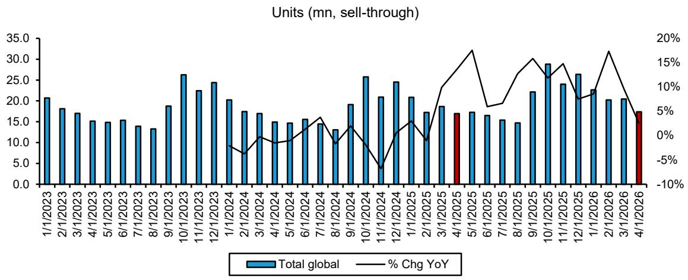

bar_line

Units (mn, sell-through)
| Date | Total global (mn) | % Chg YoY (%) |
|---|---|---|
| 1/1/2023 | 20.5 | |
| 2/1/2023 | 18.0 | |
| 3/1/2023 | 17.0 | |
| 4/1/2023 | 15.0 | |
| 5/1/2023 | 14.5 | |
| 6/1/2023 | 15.0 | |
| 7/1/2023 | 13.5 | |
| 8/1/2023 | 13.0 | |
| 9/1/2023 | 18.5 | |
| 10/1/2023 | 26.0 | |
| 11/1/2023 | 22.5 | |
| 12/1/2023 | 24.5 | |
| 1/1/2024 | 20.0 | |
| 2/1/2024 | 17.5 | |
| 3/1/2024 | 16.5 | |
| 4/1/2024 | 14.5 | |
| 5/1/2024 | 14.5 | |
| 6/1/2024 | 15.5 | |
| 7/1/2024 | 14.5 | |
| 8/1/2024 | 13.0 | |
| 9/1/2024 | 19.0 | |
| 10/1/2024 | 26.0 | |
| 11/1/2024 | 20.5 | |
| 12/1/2024 | 24.5 | |
| 1/1/2025 | 20.5 | |
| 2/1/2025 | 17.0 | |
| 3/1/2025 | 18.5 | |
| 4/1/2025 | 17.0 | |
| 5/1/2025 | 16.5 | |
| 6/1/2025 | 16.0 | |
| 7/1/2025 | 15.0 | |
| 8/1/2025 | 14.5 | |
| 9/1/2025 | 22.0 | |
| 10/1/2025 | 29.0 | |
| 11/1/2025 | 24.5 | |
| 12/1/2025 | 26.5 | |
| 1/1/2026 | 23.0 | |
| 2/1/2026 | 20.0 | |
| 3/1/2026 | 20.5 | |
| 4/1/2026 | 17.0 | |

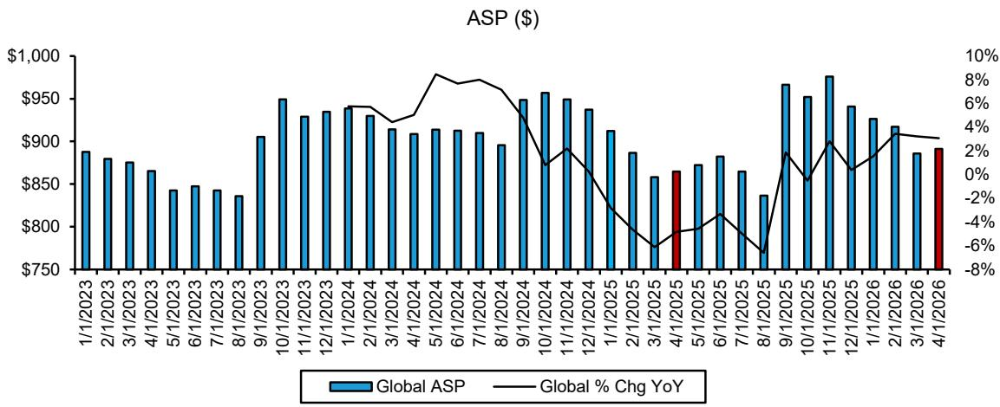

bar_line

ASP ($)
| Date | Global ASP ($) | Global % Chg YoY (%) |
|---|---|---|
| 1/1/2023 | 890 | |
| 2/1/2023 | 880 | |
| 3/1/2023 | 875 | |
| 4/1/2023 | 865 | |
| 5/1/2023 | 845 | |
| 6/1/2023 | 850 | |
| 7/1/2023 | 845 | |
| 8/1/2023 | 835 | |
| 9/1/2023 | 905 | |
| 10/1/2023 | 950 | |
| 11/1/2023 | 930 | |
| 12/1/2023 | 935 | |
| 1/1/2024 | 940 | |
| 2/1/2024 | 935 | |
| 3/1/2024 | 915 | |
| 4/1/2024 | 910 | |
| 5/1/2024 | 915 | |
| 6/1/2024 | 910 | |
| 7/1/2024 | 910 | |
| 8/1/2024 | 895 | |
| 9/1/2024 | 950 | |
| 10/1/2024 | 955 | |
| 11/1/2024 | 950 | |
| 12/1/2024 | 940 | |
| 1/1/2025 | 915 | |
| 2/1/2025 | 885 | |
| 3/1/2025 | 860 | |
| 4/1/2025 | 865 | |
| 5/1/2025 | 875 | |
| 6/1/2025 | 885 | |
| 7/1/2025 | 865 | |
| 8/1/2025 | 835 | |
| 9/1/2025 | 965 | |
| 10/1/2025 | 955 | |
| 11/1/2025 | 975 | |
| 12/1/2025 | 945 | |
| 1/1/2026 | 930 | |
| 2/1/2026 | 915 | |
| 3/1/2026 | 885 | |
| 4/1/2026 | 895 | |

Source: Counterpoint, Bernstein Analysis

EXHIBIT 3: Global ASP % Change YoY   
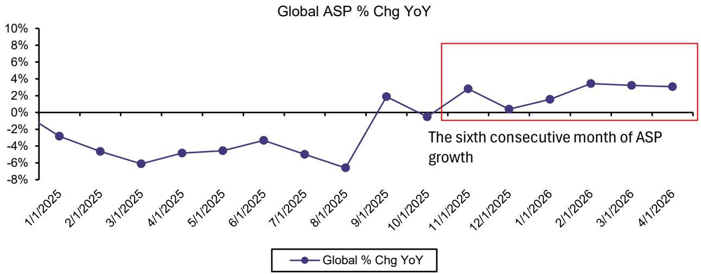

line

| Date       | Global % Chg YoY |
| ---------- | ---------------- |
| 1/1/2025   | -2%              |
| 2/1/2025   | -4%              |
| 3/1/2025   | -6%              |
| 4/1/2025   | -4%              |
| 5/1/2025   | -4%              |
| 6/1/2025   | -3%              |
| 7/1/2025   | -5%              |
| 8/1/2025   | -7%              |
| 9/1/2025   | 2%               |
| 10/1/2025  | -1%              |
| 11/1/2025  | 3%               |
| 12/1/2025  | 0%               |
| 1/1/2026   | 1%               |
| 2/1/2026   | 3%               |
| 3/1/2026   | 3%               |
| 4/1/2026   | 3%               |

Source: Counterpoint, Bernstein analysis

EXHIBIT 4: ASP % Change YoY By Region   
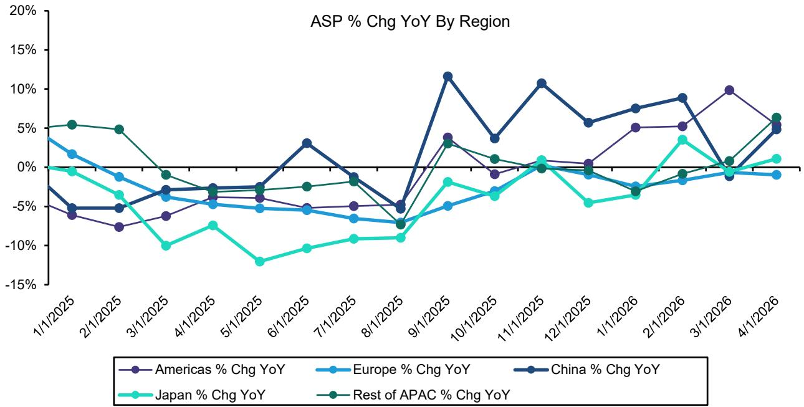

line

| Date     | Americas % Chg YoY | Europe % Chg YoY | China % Chg YoY | Japan % Chg YoY | Rest of APAC % Chg YoY |
|----------|--------------------|------------------|-----------------|-----------------|-------------------------|
| 1/1/2025 | -6.0%              | 3.5%             | -4.0%           | -1.0%           | 5.5%                    |
| 2/1/2025 | -7.5%              | 1.5%             | -5.0%           | -3.0%           | 5.0%                    |
| 3/1/2025 | -8.0%              | -1.0%            | -4.5%           | -10.0%          | -1.0%                   |
| 4/1/2025 | -6.5%              | -4.0%            | -3.0%           | -7.5%           | -3.0%                   |
| 5/1/2025 | -4.0%              | -5.0%            | -3.5%           | -12.5%          | -3.5%                   |
| 6/1/2025 | -4.5%              | -5.5%            | 3.0%            | -10.0%          | -3.0%                   |
| 7/1/2025 | -4.5%              | -6.0%            | -1.5%           | -9.0%           | -2.5%                   |
| 8/1/2025 | -4.5%              | -6.5%            | -5.0%           | -9.0%           | -7.5%                   |
| 9/1/2025 | 4.0%               | -5.5%            | 11.5%           | -2.0%           | 3.0%                    |
| 10/1/2025| -1.0%              | -4.0%            | 3.5%            | -3.5%           | 1.0%                    |
| 11/1/2025| 0.5%               | 0.0%             | 10.5%           | 1.0%            | 0.5%                    |
| 12/1/2025| 0.5%               | -1.5%            | 5.5%            | -4.5%           | -1.0%                   |
| 1/1/2026 | 5.0%               | -3.0%            | 7.5%            | -3.5%           | -3.0%                   |
| 2/1/2026 | 5.0%               | -2.0%            | 8.5%            | 3.5%            | -1.0%                   |
| 3/1/2026 | 10.0%              | -1.0%            | -1.5%           | -1.0%           | 1.0%                    |
| 4/1/2026 | 4.5%               | -1.5%            | 4.5%            | 1.0%            | 6.0%                    |

Source: Counterpoint, Bernstein analysis

EXHIBIT 5: Sell-thru units % chg by region   
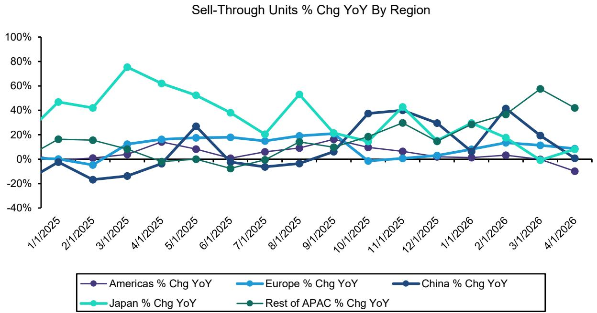

line

| Date     | Americas % Chg YoY | Europe % Chg YoY | China % Chg YoY | Japan % Chg YoY | Rest of APAC % Chg YoY |
|----------|--------------------|------------------|-----------------|-----------------|-------------------------|
| 1/1/2025 | ~0%                | ~0%              | ~-10%           | ~30%            | ~15%                    |
| 2/1/2025 | ~0%                | ~-5%             | ~-20%           | ~45%            | ~15%                    |
| 3/1/2025 | ~5%                | ~10%             | ~-15%           | ~75%            | ~10%                    |
| 4/1/2025 | ~10%               | ~15%             | ~-5%            | ~60%            | ~0%                     |
| 5/1/2025 | ~10%               | ~15%             | ~25%            | ~50%            | ~0%                     |
| 6/1/2025 | ~5%                | ~15%             | ~-10%           | ~35%            | ~-10%                   |
| 7/1/2025 | ~5%                | ~15%             | ~-10%           | ~20%            | ~-5%                    |
| 8/1/2025 | ~10%               | ~15%             | ~-5%            | ~50%            | ~15%                    |
| 9/1/2025 | ~15%               | ~15%             | ~5%             | ~20%            | ~10%                    |
| 10/1/2025| ~10%               | ~15%             | ~35%            | ~15%            | ~15%                    |
| 11/1/2025| ~5%                | ~10%             | ~40%            | ~40%            | ~30%                    |
| 12/1/2025| ~5%                | ~5%              | ~30%            | ~30%            | ~15%                    |
| 1/1/2026 | ~0%                | ~5%              | ~5%             | ~40%            | ~30%                    |
| 2/1/2026 | ~0%                | ~10%             | ~40%            | ~15%            | ~35%                    |
| 3/1/2026 | ~0%                | ~10%             | ~-5%            | ~-5%            | ~60%                    |
| 4/1/2026 | ~-10%              | ~10%             | ~-5%            | ~10%            | ~40%                    |

Source: Counterpoint, Bernstein analysis

# 2. IPHONE 17E'S PERFORMANCE IS WEAKENING VS IPHONE 16E IN YOY COMPARISON

While the iPhone 17e initially appeared to be tracking ahead of the iPhone 16e on a daily unit basis in the early weeks of launch, the inclusion of April data points to weaker relative performance versus the 16e. In April 2026, 17e units came in at 1.6mn, below the 1.8mn for the 16e in April 2025, which brings the 17e average daily units to 60k across March-April 2026, below the 16e's 64.29k across its February-April 2025 launch window, implying a 6.7% decline. Despite a solid start, 17e demand has trailed the 16e during the first seven weeks, partly due to less aggressive North American carrier promotions and a prepaid channel that remains more concentrated around the 16e.

However, on a combined basis, iPhone e-series sales were higher in March and April 2026 than in the same period of 2025, with 16e and 17e combined sell-through reaching 4.2m units in 2026 versus 3.7m units last year, or roughly 14% year-over-year growth. Importantly, 2025 only had the 16e in market, while 2026 includes both the 16e and 17e, giving consumers a choice across two models; therefore, looking only at 17e versus 16e can understate underlying demand, whereas combined e-series sales suggest 2026 is the stronger cycle, with 4.2m units sold in March-April versus 3.7m in the prior year.

EXHIBIT 6: iPhone 17e vs iPhone 16e Sell-Through in M   
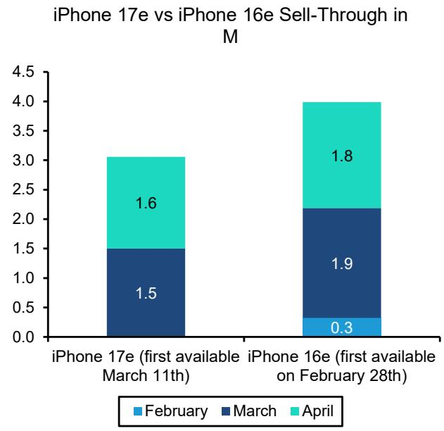

bar_stacked

iPhone 17e vs iPhone 16e Sell-Through in M
| iPhone 17e (first available March 11th) | February | March | April |
|---|---|---|---|
| iPhone 17e (first available March 11th) | 0.0 | 1.5 | 1.6 |
| iPhone 16e (first available on February 28th) | 0.3 | 1.9 | 1.8 |

Source: Counterpoint, Bernstein analysis

EXHIBIT 7: iPhone 17e vs iPhone 16e Daily units in K   
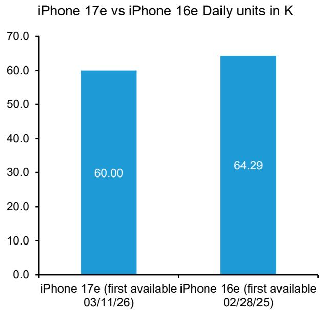

bar

iPhone 17e vs iPhone 16e Daily units in K
| Device | Daily Units (K) |
| :--- | :--- |
| iPhone 17e (first available) | 60.00 |
| iPhone 16e (first available) | 64.29 |

Source: Counterpoint, Bernstein analysis

EXHIBIT 8: Across March and April, the iPhone e-series had a total of 4.2m units in 2026 and 3.7m units in 2025, with 2026 outperforming   
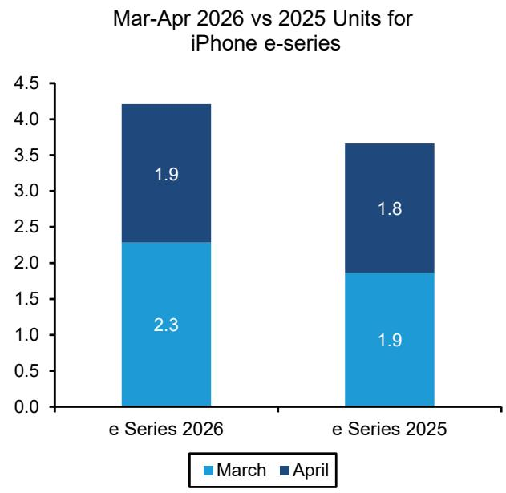

bar_stacked

Mar-Apr 2026 vs 2025 Units for iPhone e-series
| Year | March | April |
| :--- | :--- | :--- |
| e Series 2026 | 2.3 | 1.9 |
| e Series 2025 | 1.9 | 1.8 |

Source: Counterpoint, Bernstein analysis

# 3. CHANNEL INVENTORY ELEVATED

Global iPhone sell-in and sell-through units dropped sequentially in April, but units are still up 3% YoY, reflecting a strong iPhone 17 cycle. Inventory units increased MoM due to weaker sell-through than sell-in. Moreover, we see a meaningful uptick in inventory weeks.

iPhone units declined MoM, but both sell-in and sell-through in April rose by 3% YoY. In April, Global iPhone sell-in units declined by 20% while sell-through decreased by 15% MoM. However, both sell-in and sell-through units rose by 3% compared to April 25 (Exhibit 9). Despite the MoM decline, it appears that the iPhone 17 series remains the key growth driver with continued momentum adding to YoY growth.

Inventory weeks increased meaningfully in April. With sell-in of 18.0mn running modestly above sell-through of 17.4mn, channel inventory units rose 2% MoM to 41.4mn (Exhibit 9-Exhibit 11), while inventory weeks climbed to 10.3x from 8.6x in March and versus 8.7x in April 2025 (Exhibit 12). Although some increase in inventory weeks from March to April is consistent with normal seasonality, the magnitude of this year's step-up appears relatively large relative to prior years and is more notable given that April 2025 likely already had higher inventory from tariff-related buffering. The elevated inventory weeks were driven primarily by weaker sell-through, as sell-through declined 15% MoM while channel inventory units increased only 2% MoM.

EXHIBIT 9: Channel Inventory mn Units   
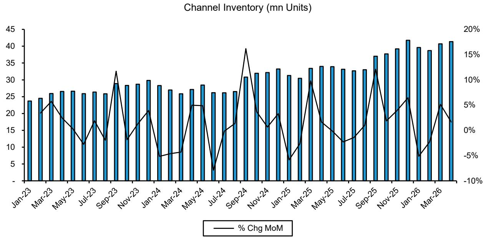

bar_line

Channel Inventory (mn Units)
| Month | Channel Inventory (mn Units) | % Chg MoM (%) |
|---|---|---|
| Jan-23 | 23.5 | 1.8 |
| Feb-23 | 24.5 | 3.5 |
| Mar-23 | 25.8 | 5.0 |
| Apr-23 | 26.7 | 4.0 |
| May-23 | 26.6 | 2.5 |
| Jun-23 | 25.9 | -1.0 |
| Jul-23 | 26.3 | 1.5 |
| Aug-23 | 25.9 | -1.5 |
| Sep-23 | 25.8 | 1.0 |
| Oct-23 | 28.8 | 10.0 |
| Nov-23 | 28.4 | 1.5 |
| Dec-23 | 28.8 | 3.0 |
| Jan-24 | 28.4 | 1.0 |
| Feb-24 | 27.0 | -1.0 |
| Mar-24 | 26.0 | -1.0 |
| Apr-24 | 27.0 | -1.0 |
| May-24 | 27.5 | 1.5 |
| Jun-24 | 28.5 | 1.5 |
| Jul-24 | 26.0 | -7.0 |
| Aug-24 | 26.0 | -6.0 |
| Sep-24 | 30.8 | 10.0 |
| Oct-24 | 39.5 | 15.0 |
| Nov-24 | 31.8 | 1.0 |
| Dec-24 | 31.8 | -1.0 |
| Jan-25 | 33.0 | 1.5 |
| Feb-25 | 31.5 | -4.0 |
| Mar-25 | 30.5 | -1.0 |
| Apr-25 | 33.5 | 10.0 |
| May-25 | 34.0 | 1.0 |
| Jun-25 | 33.5 | -1.0 |
| Jul-25 | 33.0 | -1.0 |
| Aug-25 | 33.0 | -1.0 |
| Sep-25 | 37.0 | 15.0 |
| Oct-25 | 37.8 | 1.5 |
| Nov-25 | 39.5 | 3.0 |
| Dec-25 | 41.8 | 6.0 |
| Jan-26 | 40.0 | -6.0 |
| Feb-26 | 39.5 | -1.0 |
| Mar-26 | 41.0 | 4.0 |
| Apr-26 | 41.5 | 1.5 |

Source: Counterpoint, Bernstein analysis

EXHIBIT 10: Global Sell-in vs Sell-thru (mn Units)   
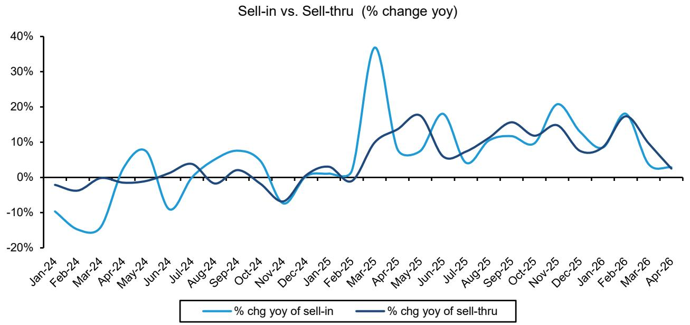

line

| Month    | % chg yoy of sell-in | % chg yoy of sell-thru |
|----------|----------------------|------------------------|
| Jan-24   | -10%                 | -5%                    |
| Feb-24   | -15%                 | -3%                    |
| Mar-24   | -18%                 | -2%                    |
| Apr-24   | 0%                   | 0%                     |
| May-24   | 8%                   | 0%                     |
| Jun-24   | -10%                 | 0%                     |
| Jul-24   | 0%                   | 3%                     |
| Aug-24   | 5%                   | 0%                     |
| Sep-24   | 7%                   | 2%                     |
| Oct-24   | 5%                   | 0%                     |
| Nov-24   | -5%                  | -5%                    |
| Dec-24   | 0%                   | 0%                     |
| Jan-25   | 0%                   | 3%                     |
| Feb-25   | 0%                   | 0%                     |
| Mar-25   | 35%                  | 10%                    |
| Apr-25   | 5%                   | 15%                    |
| May-25   | 18%                  | 17%                    |
| Jun-25   | 18%                  | 5%                     |
| Jul-25   | 5%                   | 10%                    |
| Aug-25   | 10%                  | 15%                    |
| Sep-25   | 10%                  | 15%                    |
| Oct-25   | 10%                  | 12%                    |
| Nov-25   | 20%                  | 15%                    |
| Dec-25   | 10%                  | 7%                     |
| Jan-26   | 10%                  | 10%                    |
| Feb-26   | 18%                  | 17%                    |
| Mar-26   | 5%                   | 10%                    |
| Apr-26   | 0%                   | 3%                     |

Source: Counterpoint, Bernstein analysis

EXHIBIT 11: Global Sell-in vs. Sell-thru (mn Units)   
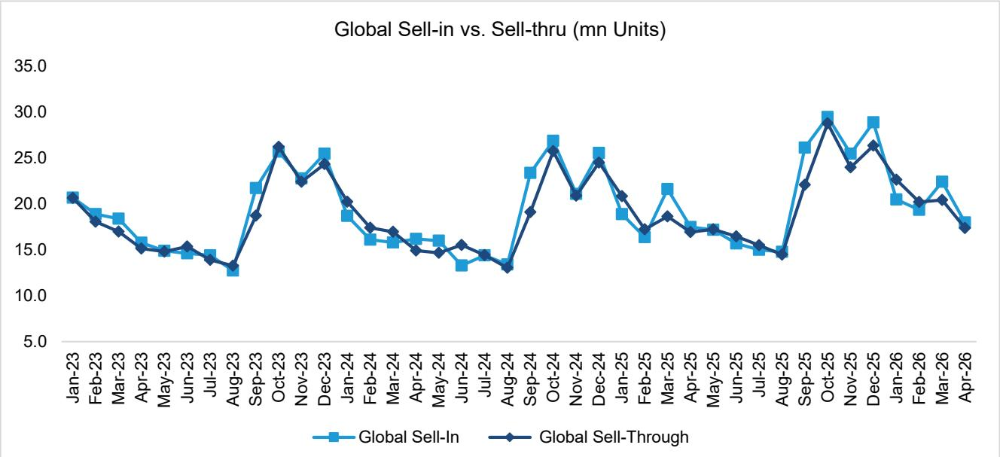

line

| Month    | Global Sell-In | Global Sell-Through |
| -------- | -------------- | ------------------- |
| Jan-23   | 21.0           | 20.5                |
| Feb-23   | 19.0           | 18.0                |
| Mar-23   | 18.5           | 17.5                |
| Apr-23   | 16.0           | 15.0                |
| May-23   | 15.0           | 14.5                |
| Jun-23   | 14.5           | 15.5                |
| Jul-23   | 14.0           | 13.5                |
| Aug-23   | 12.5           | 13.0                |
| Sep-23   | 22.0           | 18.5                |
| Oct-23   | 26.0           | 26.5                |
| Nov-23   | 23.0           | 22.5                |
| Dec-23   | 25.5           | 24.0                |
| Jan-24   | 18.5           | 20.0                |
| Feb-24   | 16.0           | 17.0                |
| Mar-24   | 15.5           | 16.5                |
| Apr-24   | 16.0           | 15.0                |
| May-24   | 16.0           | 14.5                |
| Jun-24   | 13.0           | 15.5                |
| Jul-24   | 14.0           | 14.5                |
| Aug-24   | 13.0           | 13.0                |
| Sep-24   | 23.5           | 19.0                |
| Oct-24   | 27.0           | 26.0                |
| Nov-24   | 21.0           | 20.5                |
| Dec-24   | 25.5           | 24.0                |
| Jan-25   | 18.5           | 20.5                |
| Feb-25   | 16.0           | 17.0                |
| Mar-25   | 21.5           | 18.5                |
| Apr-25   | 17.5           | 17.0                |
| May-25   | 17.0           | 16.5                |
| Jun-25   | 15.5           | 16.0                |
| Jul-25   | 15.0           | 14.5                |
| Aug-25   | 14.5           | 14.0                |
| Sep-25   | 26.0           | 22.0                |
| Oct-25   | 30.0           | 29.0                |
| Nov-25   | 25.5           | 24.0                |
| Dec-25   | 29.0           | 26.5                |
| Jan-26   | 20.5           | 23.0                |
| Feb-26   | 19.5           | 20.0                |
| Mar-26   | 22.5           | 20.5                |
| Apr-26   | 18.0           | 17.0                |

Source: Counterpoint, Bernstein analysis

EXHIBIT 12: Inventory Weeks   
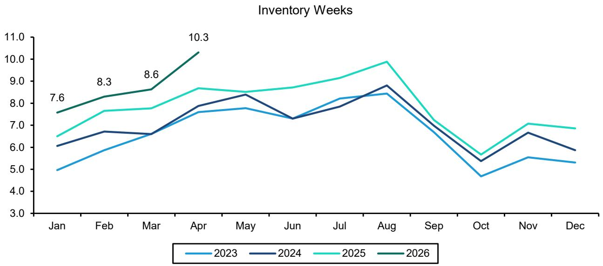

line

| Month | 2023 | 2024 | 2025 | 2026 |
|-------|------|------|------|------|
| Jan   | 5.0  | 6.1  | 6.5  | 7.6  |
| Feb   | 5.8  | 6.7  | 7.7  | 8.3  |
| Mar   | 6.5  | 6.6  | 7.8  | 8.6  |
| Apr   | 7.6  | 7.9  | 8.7  | 10.3 |
| May   | 7.8  | 8.4  | 8.6  |      |
| Jun   | 7.3  | 7.3  | 8.7  |      |
| Jul   | 8.2  | 7.9  | 9.1  |      |
| Aug   | 8.4  | 8.8  | 10.0 |      |
| Sep   | 7.0  | 7.0  | 7.2  |      |
| Oct   | 4.7  | 5.5  | 5.7  |      |
| Nov   | 5.6  | 6.7  | 7.1  |      |
| Dec   | 5.3  | 5.9  | 6.9  |      |

Source: Counterpoint, Bernstein analysis

# 4: FOUNDRY & MEMORY - POSITIVE FOR DEMAND AND CONTENT

# FOUNDRY

Exhibit 13 summarizes how monthly iPhone sales volume changed over years, and more importantly for TSMC how this volume changed for the process nodes used by iPhones. The “M” on the x-axis denotes the month when a main node first entered the market but possible enhancements over the main node (e.g. N5P in 2021 & N4 in 2022 over N5 in 2020) are also distinguished by their respective launch years, so that investors can get an idea how the momentum in each year differed from in prior years. Generally, sales volume experienced a significant surge in the first quarter following the initial delivery, then gradually declined eventually to below 1M units per month over c. 4 years. When a processor node or its variants was used across multiple iPhone generations, sales volume often saw a resurgence later. For instance, the 2022 N5 variant (i.e. N4P) was introduced first with the iPhone 14 Pro & Pro Max in Sept. 2022, and then used again in the iPhone 15 & 15 Plus released in Sept. 2023, and that resulted in a reversal of the declining trend 12 months after the initial launch (M+12).

Zooming to iPhone 17, we first find that the new iPhone 17 series & iPhone Air are all built on the same generation of N3 node (reportedly N3P). This is hence most comparable to 2024 when all iPhone 16 models launched in late 2024 were all on the generation (reportedly N3E) prior to N3P. Comparing these cycles, iPhone 17 initially showed a solid ramp, outrunning iPhone 16 in volume at the same stage. However, weaker-than-expected sales of the iPhone 17e versus the 16e have made the iPhone 17 (N3P) cycle roughly equal to the iPhone 16 (N3E) one.

Exhibit 14 presents a similar comparison of iPhone sales trends, but broken down by mobile processor. "M" on the x-axis again denotes the month when each processor was first released & delivered with product. The data indicates that the weakness is concentrated in the A19 (used in iPhone 17e), while sales volume of the A19 Pro in Pro & Air models remains ahead of that of A18 Pro.

Looking into 2H26, iPhone processors will migrate wafer node from N3 to N2 and packaging technology from InFO (Integrated Fan-Out) to WMCM (Wafer-Level Multi-Chip Module). Both should allow TSMC to enjoy a content increase. TSMC flagged the softening smartphone demand due to elevated memory price, but revised up its 2026 revenue guidance from “close to 30%” to “over 30%” as the “step-up” in AI demand is more than enough to offset the shortfall. Our channel checks suggest that Apple is exploring Intel Foundry for chip production. We see the likelihood of Apple becoming a customer of Intel Foundry, but we believe it’s mainly on geopolitical considerations. Samsung foundry gain some traction on the fundamental side, but on a bit older technology generations. As a result, TSMC is expected to remain the exclusive foundry for iPhone processors for the foreseeable future.

# MEMORY

Exhibit 16 summarizes the DRAM size of all iPhone models since iPhone 11, including 8GB of iPhone 17e that Apple launched not long ago. Likely with the need to support on-device AI, Apple appears to be adding DRAM content at an accelerating pace and we will monitor closely if this trend will be affected the recent memory price increase. Apple upgraded Pro models to 8GB DRAM starting iPhone 15 series and then all models to 8GB DRAM in iPhone 16 series. With iPhone 17 series, most models received another 50% boost to 12GB. For the first 8 months of 2025, over 80% of the iPhone sales was equipped with 8GB as the majority of the sales was iPhone 16 series. After the launch of iPhone 17 series in September 2025, the portion of iPhones shipped with 12GB DRAM increased quickly to nearly 50% of the total iPhone shipment (Exhibit 17). In terms of the average DRAM content, 2024 saw solid 18% growth, thanks to the upgrade from iPhone 16 series. 2025 saw another 20% growth to 8.4GB, thanks to another material upgrade to 12GB for the Pro and Air models.

In April, mix of 12GB models increased slightly to 42% of the overall iPhone shipment, though it remained lower than levels prior to Feb, due to the inclusion of iPhone 17e in the mix starting Mar. Models with 8GB+ DRAM stayed at 95% of the total shipment. The average DRAM content was at 9.5GB, flattish MoM but still kept the YoY increase at 26% (Exhibit 18). Starting from Sep this year, the high base starting in Sep 2025 may make the YoY growth rate moderate. Beyond that, we also wonder whether the high memory price will affect memory content increase.

We estimate 2025 overall smartphone content growth was close to 10% (see our DRAM industry model here). As iPhone contributed to around 15% of all smartphone DRAM demand (thus \~5% of the entire DRAM demand), our current model implicitly assumes non-iPhone smartphones had a slower content increase, a bit under 8%, in 2025. For 2026 our current projection has \~8% DRAM content growth for all smartphones, slower than 2025 due to considerably higher memory cost.

What's perhaps more relevant now is how smartphone demand may be impacted due to price increase as a result of memory cost increase. YTD, iPhone shipment YoY growth remained very robust with Jan-Apr up $9\%$ YoY. We believe the memory cost to pressure on many smartphone OEMs, but iPhone will be more resilient, in light of its high profitability to absorb cost increases.

EXHIBIT 13: Weak sales performance of iPhone 17e dragged the shipment of N3P.   
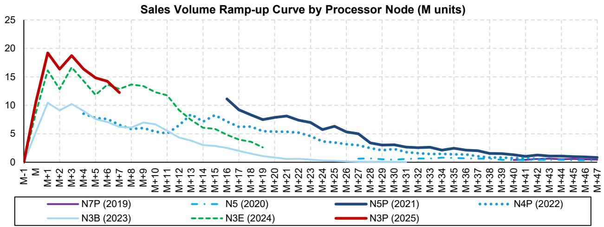

line

| Year | N3B (2023) | N3E (2024) | N4P (2022) | N5P (2021) | N7P (2019) |
|------|------------|------------|------------|------------|------------|
| M-1  | 10.0       | 16.0       | 10.0       | 10.0       | 10.0       |
| M+1  | 10.0       | 16.0       | 10.0       | 10.0       | 10.0       |
| M+2  | 10.0       | 16.0       | 10.0       | 10.0       | 10.0       |
| M+3  | 10.0       | 16.0       | 10.0       | 10.0       | 10.0       |
| M+4  | 8.0        | 14.0       | 8.0        | 8.0        | 8.0        |
| M+5  | 7.0        | 12.0       | 7.0        | 7.0        | 7.0        |
| M+6  | 6.0        | 14.0       | 6.0        | 6.0        | 6.0        |
| M+7  | 6.0        | 13.0       | 6.0        | 6.0        | 6.0        |
| M+8  | 6.0        | 13.0       | 6.0        | 6.0        | 6.0        |
| M+9  | 6.0        | 13.0       | 6.0        | 6.0        | 6.0        |
| M+10 | 6.0        | 12.0       | 6.0        | 6.0        | 6.0        |
| M+11 | 5.0        | 11.0       | 5.0        | 5.0        | 5.0        |
| M+12 | 4.0        | 10.0       | 4.0        | 4.0        | 4.0        |
| M+13 | 3.0        | 9.0        | 3.0        | 3.0        | 3.0        |
| M+14 | 2.5        | 8.0        | 2.5        | 2.5        | 2.5        |
| M+15 | 2.5        | 7.0        | 2.5        | 2.5        | 2.5        |
| M+16 | 2.5        | 6.0        | 2.5        | 2.5        | 2.5        |
| M+17 | 2.5        | 5.5        | 2.5        | 2.5        | 2.5        |
| M+18 | 2.5        | 5.0        | 2.5        | 2.5        | 2.5        |
| M+19 | 2.5        | 4.5        | 2.5        | 2.5        | 2.5        |
| M+20 | 2.5        | 4.0        | 2.5        | 2.5        | 2.5        |
| M+21 | 2.5        | 3.5        | 2.5        | 2.5        | 2.5        |
| M+22 | 2.5        | 3.0        | 2.5        | 2.5        | 2.5        |
| M+23 | 2.5        | 2.5        | 2.5        | 2.5        | 2.5        |
| M+24 | 2.5        | 2.0        | 2.5        | 2.5        | 2.5        |
| M+25 | 2.5        | 1.5        | 2.5        | 2.5        | 2.5        |
| M+26 | 2.5        | 1.0        | 2.5        | 2.5        | 2.5        |
| M+27 | 2.5        | 0.5        | 2.5        | 2.5        | 2.5        |
| M+28 | 2.5        | 0.5        | 2.5        | 2.5        | 2.5        |
| M+29 | 2.5        | 0.5        | 2.5        | 2.5        | 2.5        |
| M+30 | 2.5        | 0.5        | 2.5        | 2.5        | 2.5        |
| M+31 | 2.5        | 0.5        | 2.5        | 2.5        | 2.5        |
| M+32 | 2.5        | 0.5        | 2.5        | 2.5        | 2.5        |
| M+33 | 2.5        | 0.5        | 2.5        | 2.5        | 2.5        |
| M+34 | 2.5        | 0.5        | 2.5        | 2.5        | 2.5        |
| M+35 | 2.5        | 0.5        | 2.5        | 2.5        | 2.5        |
| M+36 | 2.5        | 0.5        | 2.5        | 2.5        | 2.5        |
| M+37 | 2.5        | 0.5        | 2.5        | 2.5        | 2.5        |
| M+38 | 2.5        | 0.5        | 2.5        | 2.5        | 2.5        |
| M+39 | 2.5        | 0.5        | 2.5        | 2.5        | 2.5        |
| M+40 | 2.5        | 0.5        | 2.5        | 2.5        | 2.5        |
| M+41 | 2.5        | 0.5        | 2.5        | 2.5        | 2.5        |
| M+42 | 2.5        | 0.5        | 2.5        | 2.5        | 2.5        |
| M+43 | 2.5        | 0.5        | 2.5        | 2.5        | 2.5        |
| M+44 | 2.5        | 0.5        | 2.5        | 2.5        | 2.5        |
| M+45 | 2.5        | 0.5        | 2.5        | 2.5        | 2.5        |
| M+46 + M+47<fcel>

Source: Counterpoint, Bernstein Analysis and Estimates

EXHIBIT 14: A similar comparison on iPhone mobile processors shows that the weakness mainly came from A19, while A19 Pro for Pro SKU remained resilient.   
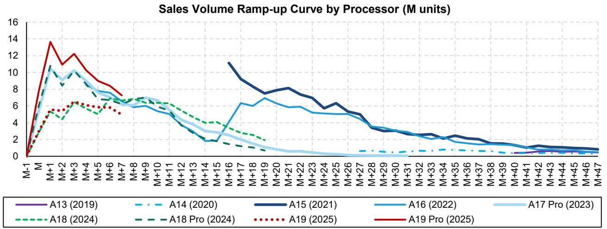  
Source: Counterpoint, Bernstein Analysis and Estimates

EXHIBIT 15: Summary of iPhone processors and their respective technology node 

<table><tr><td>Model</td><td>First Delivery Time(YYYY-MM-DD)</td><td>Processor</td><td>Node</td></tr><tr><td>iPhone 17e</td><td>2026-03-11</td><td>A19</td><td>N3P</td></tr><tr><td>iPhone 17 Pro Max</td><td>2025-09-19</td><td>A19 Pro</td><td>N3P</td></tr><tr><td>iPhone 17 Pro</td><td>2025-09-19</td><td>A19 Pro</td><td>N3P</td></tr><tr><td>iPhone Air</td><td>2025-09-19</td><td>A19 Pro</td><td>N3P</td></tr><tr><td>iPhone 17</td><td>2025-09-19</td><td>A19</td><td>N3P</td></tr><tr><td>iPhone 16e</td><td>2025-02-28</td><td>A18</td><td>N3E</td></tr><tr><td>iPhone 16 Pro Max</td><td>2024-09-20</td><td>A18 Pro</td><td>N3E</td></tr><tr><td>iPhone 16 Pro</td><td>2024-09-20</td><td>A18 Pro</td><td>N3E</td></tr><tr><td>iPhone 16 Plus</td><td>2024-09-20</td><td>A18</td><td>N3E</td></tr><tr><td>iPhone 16</td><td>2024-09-20</td><td>A18</td><td>N3E</td></tr><tr><td>iPhone 15 Pro Max</td><td>2023-09-22</td><td>A17 Pro</td><td>N3B</td></tr><tr><td>iPhone 15 Pro</td><td>2023-09-22</td><td>A17 Pro</td><td>N3B</td></tr><tr><td>iPhone 15 Plus</td><td>2023-09-22</td><td>A16</td><td>N4P</td></tr><tr><td>iPhone 15</td><td>2023-09-22</td><td>A16</td><td>N4P</td></tr><tr><td>iPhone 14 Pro Max</td><td>2022-09-16</td><td>A16</td><td>N4P</td></tr><tr><td>iPhone 14 Pro</td><td>2022-09-16</td><td>A16</td><td>N4P</td></tr><tr><td>iPhone 14 Plus</td><td>2022-10-07</td><td>A15</td><td>N5P</td></tr><tr><td>iPhone 14</td><td>2022-09-16</td><td>A15</td><td>N5P</td></tr><tr><td>iPhone SE 2022</td><td>2022-03-18</td><td>A15</td><td>N5P</td></tr><tr><td>iPhone 13 Pro Max</td><td>2021-09-24</td><td>A15</td><td>N5P</td></tr><tr><td>iPhone 13 Pro</td><td>2021-09-24</td><td>A15</td><td>N5P</td></tr><tr><td>iPhone 13</td><td>2021-09-24</td><td>A15</td><td>N5P</td></tr><tr><td>iPhone 13 Mini</td><td>2021-09-24</td><td>A15</td><td>N5P</td></tr><tr><td>iPhone 12 Pro Max</td><td>2020-11-13</td><td>A14</td><td>N5</td></tr><tr><td>iPhone 12 Pro</td><td>2020-10-23</td><td>A14</td><td>N5</td></tr><tr><td>iPhone 12</td><td>2020-10-23</td><td>A14</td><td>N5</td></tr><tr><td>iPhone 12 Mini</td><td>2020-11-13</td><td>A14</td><td>N5</td></tr><tr><td>iPhone SE 2020</td><td>2020-04-24</td><td>A13</td><td>N7P</td></tr><tr><td>iPhone 11 Pro Max</td><td>2019-09-20</td><td>A13</td><td>N7P</td></tr><tr><td>iPhone 11 Pro</td><td>2019-09-20</td><td>A13</td><td>N7P</td></tr><tr><td>iPhone 11</td><td>2019-09-20</td><td>A13</td><td>N7P</td></tr></table>

Source: Company websites, Bernstein analysis

EXHIBIT 16: Most of iPhone 17 models feature 12GB DRAM vs. 8GB for iPhone 16 series, likely to better support on-device AI.   
iPhone DRAM Size (GB)   
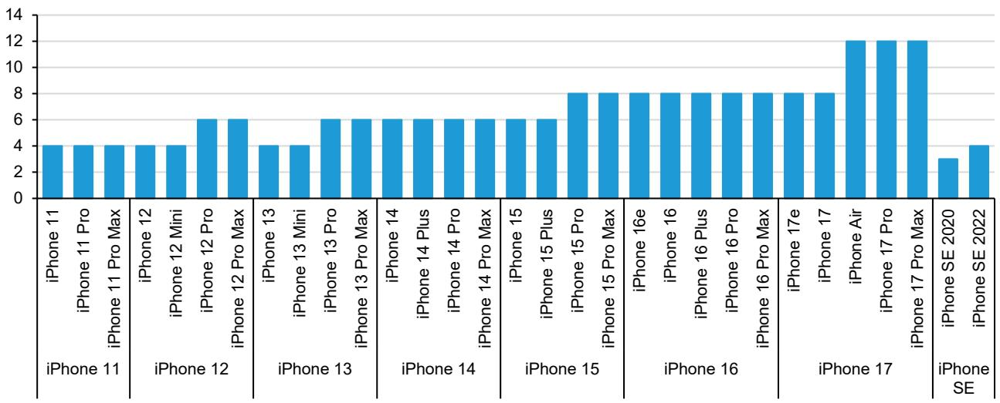

bar

| Device | Category | Value |
| :--- | :--- | :--- |
| iPhone 11 | iPhone 11 | 4 |
| iPhone 11 | iPhone 11 Pro | 4 |
| iPhone 11 | iPhone 11 Pro Max | 4 |
| iPhone 12 | iPhone 12 | 4 |
| iPhone 12 | iPhone 12 Mini | 4 |
| iPhone 12 | iPhone 12 Pro | 6 |
| iPhone 12 | iPhone 12 Pro Max | 6 |
| iPhone 13 | iPhone 13 | 4 |
| iPhone 13 | iPhone 13 Mini | 4 |
| iPhone 13 | iPhone 13 Pro | 6 |
| iPhone 13 | iPhone 13 Pro Max | 6 |
| iPhone 14 | iPhone 14 | 6 |
| iPhone 14 | iPhone 14 Plus | 6 |
| iPhone 14 | iPhone 14 Pro | 6 |
| iPhone 14 | iPhone 14 Pro Max | 6 |
| iPhone 15 | iPhone 15 | 6 |
| iPhone 15 | iPhone 15 Plus | 6 |
| iPhone 15 | iPhone 15 Pro | 8 |
| iPhone 15 | iPhone 15 Pro Max | 8 |
| iPhone 16 | iPhone 16e | 8 |
| iPhone 16 | iPhone 16 | 8 |
| iPhone 16 | iPhone 16 Plus | 8 |
| iPhone 16 | iPhone 16 Pro | 8 |
| iPhone 16 | iPhone 16 Pro Max | 8 |
| iPhone 17e | iPhone 17e | 8 |
| iPhone 17 | iPhone 17 | 8 |
| iPhone Air | iPhone Air | 12 |
| iPhone Air | iPhone Air Pro | 12 |
| iPhone Air | iPhone Air Max | 12 |
| iPhone SE | iPhone SE SE 2020 | 3 |
| iPhone SE | iPhone SE SE 2022 | 4 |

Source: iFixit, GSMArena and Bernstein analysis

EXHIBIT 17: iPhone models with 12GB DRAM improved slightly MoM to 42% of the overall shipment.   
iPhone Shipment Mix by DRAM Size   
  
Source: Counterpoint, iFixit and Bernstein analysis

EXHIBIT 18: The average DRAM content per phone still remained largely steady MoM at 9.5GB in Apr, still up meaningfully YoY by 26%.   
iPhone Average DRAM   

bar_line

| Month    | Average DRAM per Phone (GB) | YoY  |
|----------|------------------------------|------|
| Jan-23   | 5.5                          | -    |
| Feb-23   | 5.5                          | -    |
| Mar-23   | 5.5                          | -    |
| Apr-23   | 5.5                          | -    |
| May-23   | 5.5                          | -    |
| Jun-23   | 5.5                          | -    |
| Jul-23   | 5.5                          | -    |
| Aug-23   | 5.5                          | -    |
| Sep-23   | 6.2                          | -    |
| Oct-23   | 6.6                          | -    |
| Nov-23   | 6.7                          | -    |
| Dec-23   | 6.8                          | -    |
| Jan-24   | 6.9                          | 22%  |
| Feb-24   | 6.8                          | 21%  |
| Mar-24   | 6.7                          | 20%  |
| Apr-24   | 6.7                          | 19%  |
| May-24   | 6.8                          | 18%  |
| Jun-24   | 6.9                          | 17%  |
| Jul-24   | 6.8                          | 16%  |
| Aug-24   | 6.7                          | 15%  |
| Sep-24   | 7.3                          | 14%  |
| Oct-24   | 7.5                          | 13%  |
| Nov-24   | 7.5                          | 13%  |
| Dec-24   | 7.6                          | 13%  |
| Jan-25   | 7.6                          | 13%  |
| Feb-25   | 7.6                          | 13%  |
| Mar-25   | 7.6                          | 14%  |
| Apr-25   | 7.7                          | 14%  |
| May-25   | 7.7                          | 15%  |
| Jun-25   | 7.7                          | 14%  |
| Jul-25   | 7.7                          | 13%  |
| Aug-25   | 7.7                          | 14%  |
| Sep-25   | 9.0                          | 30%  |
| Oct-25   | 9.8                          | 31%  |
| Nov-25   | 9.8                          | 30%  |
| Dec-25   | 9.8                          | 29%  |
| Jan-26   | 9.8                          | 28%  |
| Feb-26   | 9.7                          | 28%  |
| Mar-26   | 9.6                          | 27%  |
| Apr-26   | 9.6                          | 26%  |

Source: Counterpoint, iFixit and Bernstein analysis

# 5. IPHONE DEMAND BY REGION

EXHIBIT 19: Americas iPhone total revenue, units and ASP

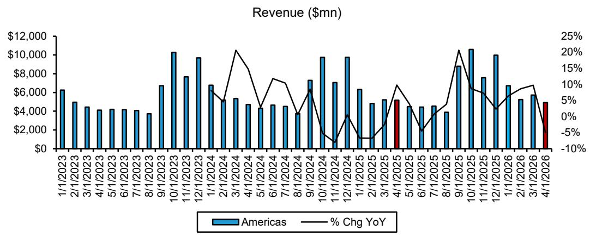

bar_line

Revenue ($mn)
| Date | Americas ($) | % Chg YoY (%) |
|---|---|---|
| 1/1/2023 | 6200 | 5.0 |
| 2/1/2023 | 4900 | 4.5 |
| 3/1/2023 | 4400 | 4.0 |
| 4/1/2023 | 4200 | 3.5 |
| 5/1/2023 | 4300 | 3.0 |
| 6/1/2023 | 4200 | 2.5 |
| 7/1/2023 | 4100 | 2.0 |
| 8/1/2023 | 3700 | 1.5 |
| 9/1/2023 | 6800 | 1.0 |
| 10/1/2023 | 10300 | 0.5 |
| 11/1/2023 | 7700 | 0.0 |
| 12/1/2023 | 9800 | -0.5 |
| 1/1/2024 | 6800 | -1.0 |
| 2/1/2024 | 5100 | -1.5 |
| 3/1/2024 | 5400 | -2.0 |
| 4/1/2024 | 4800 | -2.5 |
| 5/1/2024 | 4400 | -3.0 |
| 6/1/2024 | 4600 | -3.5 |
| 7/1/2024 | 4500 | -4.0 |
| 8/1/2024 | 3700 | -4.5 |
| 9/1/2024 | 7300 | -5.0 |
| 10/1/2024 | 9900 | -5.5 |
| 11/1/2024 | 7100 | -6.0 |
| 12/1/2024 | 9800 | -6.5 |
| 1/1/2025 | 6300 | -7.0 |
| 2/1/2025 | 4800 | -7.5 |
| 3/1/2025 | 5300 | -8.0 |
| 4/1/2025 | 5300 | -8.5 |
| 5/1/2025 | 4500 | -9.0 |
| 6/1/2025 | 4600 | -9.5 |
| 7/1/2025 | 4700 | -10.0 |
| 8/1/2025 | 4100 | -11.5 |
| 9/1/2025 | 8700 | -13.5 |
| 10/1/2025 | 10600 | -16.5 |
| 11/1/2025 | 7600 | -18.5 |
| 12/1/2025 | 9900 | -21.5 |
| 1/1/2026 | 6800 | -23.5 |
| 2/1/2026 | 5300 | -26.5 |
| 3/1/2026 | 5800 | -31.5 |
| 4/1/2026 | 4900 | -38.5 |

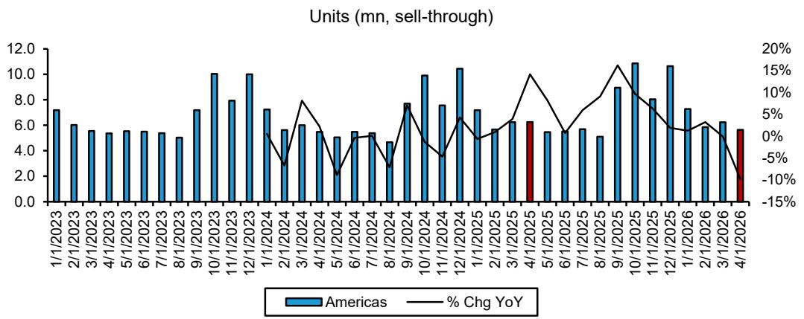

bar_line

Units (mn, sell-through)
| Date | Americas (mn) | % Chg YoY (%) |
|---|---|---|
| 1/1/2023 | 7.2 | |
| 2/1/2023 | 6.0 | |
| 3/1/2023 | 5.6 | |
| 4/1/2023 | 5.5 | |
| 5/1/2023 | 5.5 | |
| 6/1/2023 | 5.5 | |
| 7/1/2023 | 5.4 | |
| 8/1/2023 | 5.0 | |
| 9/1/2023 | 7.2 | |
| 10/1/2023 | 10.0 | |
| 11/1/2023 | 8.0 | |
| 12/1/2023 | 10.0 | |
| 1/1/2024 | 7.2 | |
| 2/1/2024 | 5.6 | -3.5 |
| 3/1/2024 | 6.0 | 8.0 |
| 4/1/2024 | 5.5 | 5.0 |
| 5/1/2024 | 5.0 | -2.5 |
| 6/1/2024 | 5.5 | 5.0 |
| 7/1/2024 | 5.3 | 5.0 |
| 8/1/2024 | 4.7 | -3.5 |
| 9/1/2024 | 7.7 | 7.5 |
| 10/1/2024 | 9.9 | -4.5 |
| 11/1/2024 | 7.6 | -4.5 |
| 12/1/2024 | 10.4 | 6.5 |
| 1/1/2025 | 7.1 | -0.5 |
| 2/1/2025 | 5.7 | 5.5 |
| 3/1/2025 | 6.3 | 6.5 |
| 4/1/2025 | 6.3 | 10.0 |
| 5/1/2025 | 5.5 | -4.5 |
| 6/1/2025 | 5.7 | -4.5 |
| 7/1/2025 | 5.7 | -4.5 |
| 8/1/2025 | 5.1 | -4.5 |
| 9/1/2025 | 8.9 | 16.5 |
| 10/1/2025 | 10.9 | 16.5 |
| 11/1/2025 | 8.0 | 8.5 |
| 12/1/2025 | 10.6 | 4.5 |
| 1/1/2026 | 7.3 | -1.5 |
| 2/1/2026 | 6.0 | -3.5 |
| 3/1/2026 | 6.3 | -4.5 |
| 4/1/2026 | 5.7 | -13.5 |

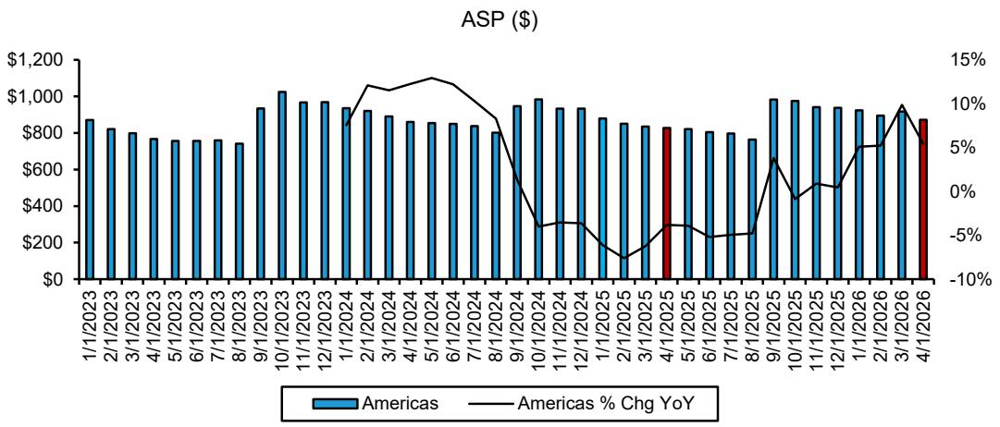

bar_line

ASP ($)
| Date | Americas ($) | Americas % Chg YoY (%) |
|---|---|---|
| 1/1/2023 | 875 | |
| 2/1/2023 | 825 | |
| 3/1/2023 | 795 | |
| 4/1/2023 | 765 | |
| 5/1/2023 | 760 | |
| 6/1/2023 | 765 | |
| 7/1/2023 | 760 | |
| 8/1/2023 | 745 | |
| 9/1/2023 | 930 | |
| 10/1/2023 | 1040 | |
| 11/1/2023 | 970 | |
| 12/1/2023 | 970 | |
| 1/1/2024 | 940 | |
| 2/1/2024 | 930 | |
| 3/1/2024 | 890 | |
| 4/1/2024 | 860 | |
| 5/1/2024 | 850 | |
| 6/1/2024 | 850 | |
| 7/1/2024 | 840 | |
| 8/1/2024 | 810 | |
| 9/1/2024 | 950 | |
| 10/1/2024 | 980 | |
| 11/1/2024 | 940 | |
| 12/1/2024 | 940 | |
| 1/1/2025 | 880 | |
| 2/1/2025 | 850 | |
| 3/1/2025 | 840 | |
| 4/1/2025 | 830 | |
| 5/1/2025 | 810 | |
| 6/1/2025 | 800 | |
| 7/1/2025 | 790 | |
| 8/1/2025 | 765 | |
| 9/1/2025 | 995 | |
| 10/1/2025 | 995 | |
| 11/1/2025 | 960 | |
| 12/1/2025 | 955 | |
| 1/1/2026 | 945 | |
| 2/1/2026 | 935 | |
| 3/1/2026 | 935 | |
| 4/1/2026 | 875 | -8.5%

Source: Counterpoint, Bernstein Analysis

EXHIBIT 20: Europe iPhone revenue, units and ASP   
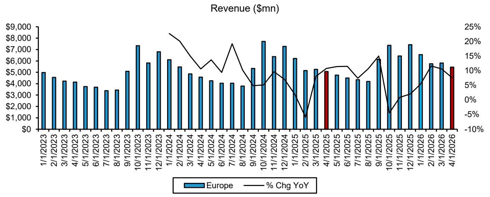

bar_line

Revenue ($mn)
| Date | Europe ($mn) | % Chg YoY (%) |
|---|---|---|
| 1/1/2023 | 5000 | 10 |
| 2/1/2023 | 4500 | 8 |
| 3/1/2023 | 4200 | 7 |
| 4/1/2023 | 4100 | 6 |
| 5/1/2023 | 3800 | 5 |
| 6/1/2023 | 3700 | 4 |
| 7/1/2023 | 3400 | 3 |
| 8/1/2023 | 3500 | 2 |
| 9/1/2023 | 5000 | 10 |
| 10/1/2023 | 7300 | 15 |
| 11/1/2023 | 5800 | 12 |
| 12/1/2023 | 6800 | 14 |
| 1/1/2024 | 6100 | 16 |
| 2/1/2024 | 5400 | 14 |
| 3/1/2024 | 4800 | 11 |
| 4/1/2024 | 4500 | 9 |
| 5/1/2024 | 4300 | 8 |
| 6/1/2024 | 4100 | 7 |
| 7/1/2024 | 4000 | 6 |
| 8/1/2024 | 3800 | 5 |
| 9/1/2024 | 5300 | 6 |
| 10/1/2024 | 7700 | 9 |
| 11/1/2024 | 6300 | 11 |
| 12/1/2024 | 7200 | 13 |
| 1/1/2025 | 6200 | 11 |
| 2/1/2025 | 5100 | -8 |
| 3/1/2025 | 5300 | 9 |
| 4/1/2025 | 5000 | 11 |
| 5/1/2025 | 4700 | 11 |
| 6/1/2025 | 4500 | 9 |
| 7/1/2025 | 4300 | 7 |
| 8/1/2025 | 4200 | 6 |
| 9/1/2025 | 6300 | 14 |
| 10/1/2025 | 7300 | -6 |
| 11/1/2025 | 6400 | -3 |
| 12/1/2025 | 7400 | 3 |
| 1/1/2026 | 6600 | 6 |
| 2/1/2026 | 5700 | 13 |
| 3/1/2026 | 5800 | 13 |
| 4/1/2026 | 5500 | 9 |

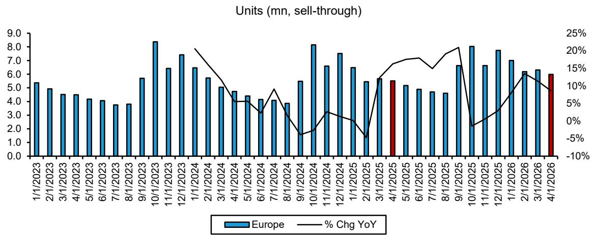

bar_line

Units (mn, sell-through)
| Date | Europe (mn) | % Chg YoY (%) |
|---|---|---|
| 1/1/2023 | 5.4 | 10.8 |
| 2/1/2023 | 4.9 | 10.7 |
| 3/1/2023 | 4.5 | 10.5 |
| 4/1/2023 | 4.4 | 10.4 |
| 5/1/2023 | 4.2 | 10.3 |
| 6/1/2023 | 4.1 | 10.2 |
| 7/1/2023 | 3.8 | 9.9 |
| 8/1/2023 | 3.8 | 9.8 |
| 9/1/2023 | 5.7 | 10.5 |
| 10/1/2023 | 8.4 | 19.6 |
| 11/1/2023 | 6.5 | 18.7 |
| 12/1/2023 | 7.5 | 18.5 |
| 1/1/2024 | 6.5 | 17.8 |
| 2/1/2024 | 5.8 | 16.5 |
| 3/1/2024 | 5.0 | 14.8 |
| 4/1/2024 | 4.7 | 13.9 |
| 5/1/2024 | 4.4 | 13.8 |
| 6/1/2024 | 4.1 | 10.6 |
| 7/1/2024 | 4.0 | 9.7 |
| 8/1/2024 | 3.8 | 8.9 |
| 9/1/2024 | 5.5 | 8.6 |
| 10/1/2024 | 8.2 | 19.6 |
| 11/1/2024 | 6.7 | 17.9 |
| 12/1/2024 | 7.6 | 17.6 |
| 1/1/2025 | 6.5 | 16.7 |
| 2/1/2025 | 5.4 | -3.7 |
| 3/1/2025 | 5.7 | -6.9 |
| 4/1/2025 | 5.5 | -6.9 |
| 5/1/2025 | 5.1 | -6.9 |
| 6/1/2025 | 4.9 | -6.9 |
| 7/1/2025 | 4.7 | -6.9 |
| 8/1/2025 | 4.5 | -6.9 |
| 9/1/2025 | 6.7 | -6.9 |
| 10/1/2025 | 8.1 | -9.8 |
| 11/1/2025 | 6.7 | -3.7 |
| 12/1/2025 | 7.8 | -3.7 |
| 1/1/2026 | 7.1 | -3.7 |
| 2/1/2026 | 6.3 | -3.7 |
| 3/1/2026 | 6.4 | -3.7 |
| 4/1/2026 | 6.0 | -3.7 |

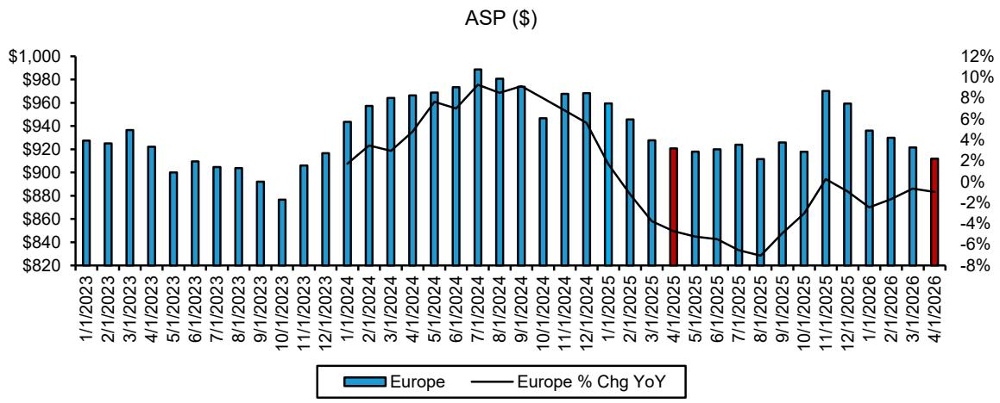

bar_line

ASP ($)
| Date | Europe ($) | Europe % Chg YoY (%) |
|---|---|---|
| 1/1/2023 | 928 | 2.5 |
| 2/1/2023 | 925 | 3.0 |
| 3/1/2023 | 937 | 3.5 |
| 4/1/2023 | 923 | 3.0 |
| 5/1/2023 | 900 | -1.0 |
| 6/1/2023 | 911 | 1.5 |
| 7/1/2023 | 906 | -1.5 |
| 8/1/2023 | 905 | -1.5 |
| 9/1/2023 | 892 | -3.0 |
| 10/1/2023 | 875 | -5.0 |
| 11/1/2023 | 906 | -1.5 |
| 12/1/2023 | 917 | -1.5 |
| 1/1/2024 | 943 | 2.0 |
| 2/1/2024 | 958 | 3.5 |
| 3/1/2024 | 964 | 3.0 |
| 4/1/2024 | 967 | 5.5 |
| 5/1/2024 | 971 | 6.5 |
| 6/1/2024 | 975 | 6.0 |
| 7/1/2024 | 987 | 9.5 |
| 8/1/2024 | 981 | 8.5 |
| 9/1/2024 | 974 | 8.5 |
| 10/1/2024 | 947 | 6.5 |
| 11/1/2024 | 968 | 6.0 |
| 12/1/2024 | 970 | 5.5 |
| 1/1/2025 | 958 | 3.5 |
| 2/1/2025 | 945 | -3.5 |
| 3/1/2025 | 928 | -5.5 |
| 4/1/2025 | 920 | -6.5 |
| 5/1/2025 | 917 | -6.5 |
| 6/1/2025 | 919 | -6.5 |
| 7/1/2025 | 924 | -6.5 |
| 8/1/2025 | 913 | -7.5 |
| 9/1/2025 | 926 | -4.5 |
| 10/1/2025 | 918 | -3.5 |
| 11/1/2025 | 970 | -0.5 |
| 12/1/2025 | 960 | -1.5 |
| 1/1/2026 | 943 | -3.0 |
| 2/1/2026 | 934 | -1.5 |
| 3/1/2026 | 920 | -0.5 |
| 4/1/2026 | 914 | -1.5 |

Source: Counterpoint, Bernstein Analysis

EXHIBIT 21: China iPhone revenue, units and ASP   
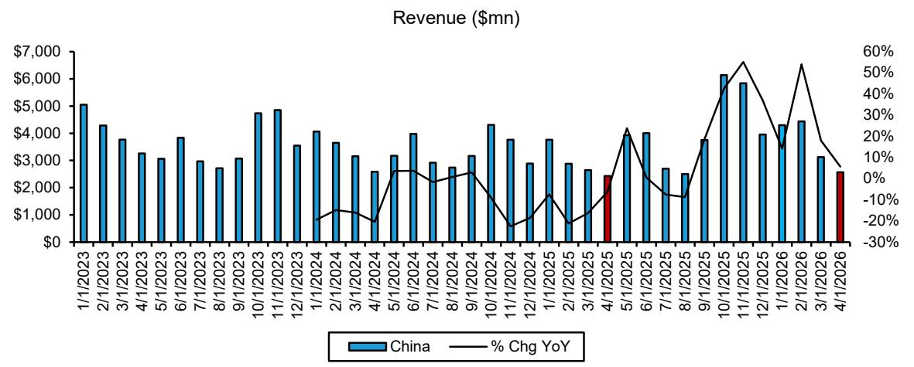

bar_line

Revenue ($mn)
| Date | China ($mn) | % Chg YoY (%) |
|---|---|---|
| 1/1/2023 | 5000 | 35 |
| 2/1/2023 | 4200 | 30 |
| 3/1/2023 | 3700 | 25 |
| 4/1/2023 | 3200 | 20 |
| 5/1/2023 | 3000 | 15 |
| 6/1/2023 | 3800 | 10 |
| 7/1/2023 | 2900 | 5 |
| 8/1/2023 | 2600 | -5 |
| 9/1/2023 | 3000 | -10 |
| 10/1/2023 | 4700 | -15 |
| 11/1/2023 | 4800 | -10 |
| 12/1/2023 | 3500 | -5 |
| 1/1/2024 | 4100 | -15 |
| 2/1/2024 | 3600 | -10 |
| 3/1/2024 | 3100 | -15 |
| 4/1/2024 | 2500 | -25 |
| 5/1/2024 | 3100 | -15 |
| 6/1/2024 | 4000 | -5 |
| 7/1/2024 | 2800 | -10 |
| 8/1/2024 | 2700 | -5 |
| 9/1/2024 | 3100 | -5 |
| 10/1/2024 | 4300 | -15 |
| 11/1/2024 | 3700 | -25 |
| 12/1/2024 | 2800 | -5 |
| 1/1/2025 | 3700 | -15 |
| 2/1/2025 | 2800 | -15 |
| 3/1/2025 | 2600 | -5 |
| 4/1/2025 | 2400 | -5 |
| 5/1/2025 | 4100 | -5 |
| 6/1/2025 | 4000 | -5 |
| 7/1/2025 | 2600 | -15 |
| 8/1/2025 | 2400 | -15 |
| 9/1/2025 | 3700 | -15 |
| 10/1/2025 | 6100 | -5 |
| 11/1/2025 | 5800 | -5 |
| 12/1/2025 | 3900 | -5 |
| 1/1/2026 | 4300 | -15 |
| 2/1/2026 | 4400 | -5 |
| 3/1/2026 | 3100 | -15 |
| 4/1/2026 | 2500 | -5 |

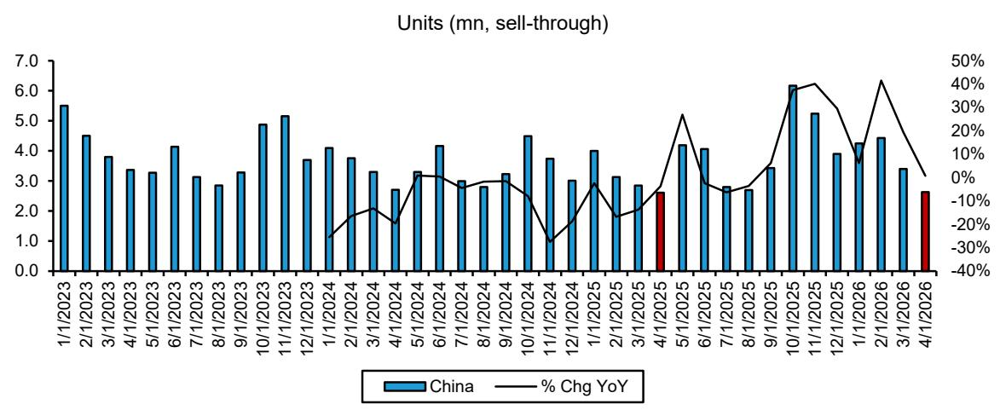

bar_line

Units (mn, sell-through)
| Date | China (mn) | % Chg YoY (%) |
|---|---|---|
| 1/1/2023 | 5.5 | - |
| 2/1/2023 | 4.5 | - |
| 3/1/2023 | 3.8 | - |
| 4/1/2023 | 3.4 | - |
| 5/1/2023 | 3.3 | - |
| 6/1/2023 | 4.1 | - |
| 7/1/2023 | 3.1 | - |
| 8/1/2023 | 2.9 | - |
| 9/1/2023 | 3.3 | - |
| 10/1/2023 | 4.9 | - |
| 11/1/2023 | 5.1 | - |
| 12/1/2023 | 3.7 | - |
| 1/1/2024 | 4.1 | -10% |
| 2/1/2024 | 3.8 | -5% |
| 3/1/2024 | 3.3 | -10% |
| 4/1/2024 | 2.7 | -15% |
| 5/1/2024 | 3.3 | -5% |
| 6/1/2024 | 4.1 | -5% |
| 7/1/2024 | 2.9 | -5% |
| 8/1/2024 | 2.8 | -5% |
| 9/1/2024 | 3.2 | -5% |
| 10/1/2024 | 4.5 | -5% |
| 11/1/2024 | 3.7 | -10% |
| 12/1/2024 | 3.0 | -5% |
| 1/1/2025 | 4.0 | -5% |
| 2/1/2025 | 3.1 | -5% |
| 3/1/2025 | 2.9 | -5% |
| 4/1/2025 | 2.6 | -5% |
| 5/1/2025 | 4.1 | -5% |
| 6/1/2025 | 4.0 | -5% |
| 7/1/2025 | 2.8 | -5% |
| 8/1/2025 | 2.7 | -5% |
| 9/1/2025 | 3.4 | -5% |
| 10/1/2025 | 6.1 | -5% |
| 11/1/2025 | 5.2 | -5% |
| 12/1/2025 | 3.9 | -5% |
| 1/1/2026 | 4.3 | -5% |
| 2/1/2026 | 4.4 | -5% |
| 3/1/2026 | 3.4 | -5% |
| 4/1/2026 | 2.6 | -5% |

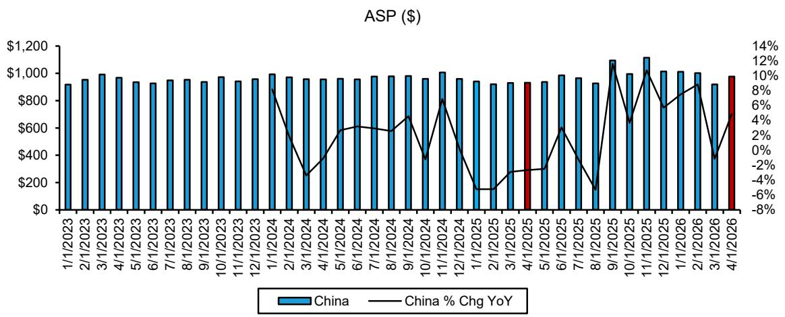

bar_line

ASP ($)
| Date | China ($) | China % Chg YoY (%) |
|---|---|---|
| 1/1/2023 | 900 | 8.5 |
| 2/1/2023 | 950 | 8.7 |
| 3/1/2023 | 1000 | 9.0 |
| 4/1/2023 | 950 | 8.8 |
| 5/1/2023 | 920 | 8.6 |
| 6/1/2023 | 910 | 8.5 |
| 7/1/2023 | 930 | 8.7 |
| 8/1/2023 | 940 | 8.8 |
| 9/1/2023 | 920 | 8.6 |
| 10/1/2023 | 960 | 9.0 |
| 11/1/2023 | 930 | 8.7 |
| 12/1/2023 | 940 | 8.8 |
| 1/1/2024 | 1000 | 9.5 |
| 2/1/2024 | 970 | 6.5 |
| 3/1/2024 | 950 | -3.5 |
| 4/1/2024 | 960 | -3.0 |
| 5/1/2024 | 960 | -2.5 |
| 6/1/2024 | 970 | -2.3 |
| 7/1/2024 | 980 | -2.4 |
| 8/1/2024 | 990 | -2.5 |
| 9/1/2024 | 980 | -3.5 |
| 10/1/2024 | 950 | -4.5 |
| 11/1/2024 | 1010 | -7.5 |
| 12/1/2024 | 960 | -4.5 |
| 1/1/2025 | 930 | -6.5 |
| 2/1/2025 | 910 | -6.8 |
| 3/1/2025 | 920 | -6.5 |
| 4/1/2025 | 930 | -6.5 |
| 5/1/2025 | 940 | -6.5 |
| 6/1/2025 | 980 | -4.5 |
| 7/1/2025 | 970 | -4.8 |
| 8/1/2025 | 910 | -6.8 |
| 9/1/2025 | 1100 | -7.5 |
| 10/1/2025 | 1000 | -4.5 |
| 11/1/2025 | 1130 | -7.5 |
| 12/1/2025 | 1030 | -6.5 |
| 1/1/2026 | 1030 | -6.8 |
| 2/1/2026 | 1030 | -7.5 |
| 3/1/2026 | 910 | -3.5 |
| 4/1/2026 | 1000 | -4.5 |

Source: Counterpoint, Bernstein Analysis

EXHIBIT 22: Rest of Apac iPhone revenue, units, ASP   
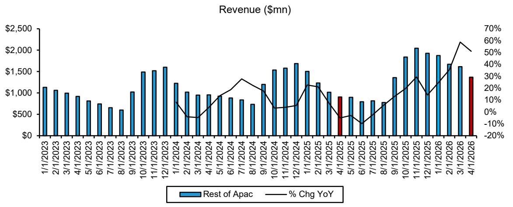

bar_line

Revenue ($mn)
| Date | Rest of Apac ($) | % Chg YoY (%) |
| :--- | :--- | :--- |
| 1/1/2023 | 1150 | 18 |
| 2/1/2023 | 1050 | 17 |
| 3/1/2023 | 1000 | 16 |
| 4/1/2023 | 900 | 15 |
| 5/1/2023 | 800 | 14 |
| 6/1/2023 | 750 | 13 |
| 7/1/2023 | 650 | 12 |
| 8/1/2023 | 600 | 11 |
| 9/1/2023 | 1050 | 19 |
| 10/1/2023 | 1450 | 25 |
| 11/1/2023 | 1500 | 26 |
| 12/1/2023 | 1600 | 27 |
| 1/1/2024 | 1250 | 14 |
| 2/1/2024 | 1050 | -5 |
| 3/1/2024 | 950 | -7 |
| 4/1/2024 | 950 | -7 |
| 5/1/2024 | 950 | -7 |
| 6/1/2024 | 850 | -6 |
| 7/1/2024 | 850 | -6 |
| 8/1/2024 | 750 | -7 |
| 9/1/2024 | 1200 | -13 |
| 10/1/2024 | 1550 | -5 |
| 11/1/2024 | 1600 | -4 |
| 12/1/2024 | 1700 | -3 |
| 1/1/2025 | 1500 | -13 |
| 2/1/2025 | 1250 | -13 |
| 3/1/2025 | 1050 | -19 |
| 4/1/2025 | 950 | -7 |
| 5/1/2025 | 900 | -8 |
| 6/1/2025 | 800 | -13 |
| 7/1/2025 | 850 | -9 |
| 8/1/2025 | 850 | -9 |
| 9/1/2025 | 1350 | -7 |
| 10/1/2025 | 1850 | -4 |
| 11/1/2025 | 2050 | -3 |
| 12/1/2025 | 1950 | -13 |
| 1/1/2026 | 1850 | -9 |
| 2/1/2026 | 1700 | -4 |
| 3/1/2026 | 1650 | -3 |
| 4/1/2026 | 1350 | -7 |
% Chg YoY
Revenue ($mn)
| Month | Revenue ($mn) |
| :--- | :--- |
| Jan-23e | |
| Feb-23e | |
| Mar-23e | |
| Apr-23e | |
| May-23e | |
| Jun-23e | |
| Jul-23e | |
| Aug-23e | |
| Sep-23e | |
| Oct-23e | |
| Nov-23e | |
| Dec-23e | |
| Jan-24e | |
| Feb-24e | |
| Mar-24e | |
| Apr-24e | |
| May-24e | |
| Jun-24e | |
| Jul-24e | |
| Aug-24e | |
| Sep-24e | |
| Oct-24e | |
| Nov-24e | |
| Dec-24e | |
| Jan-25e | |
| Feb-25e | |
| Mar-25e | |
| Apr-25e | |
| May-25e | |
| Jun-25e | |
| Jul-25e | |
| Aug-25e | |
| Sep-25e | |
| Oct-25e | |
| Nov-25e | |
| Dec-25e | |
|
| Jan-26e | |
|
| Feb-26e | |
|
| Mar-26e | |
|
| Apr-26e | (estimated) ~$3,500 (estimated) ~(estimated) ~(estimated) ~(estimated) ~(estimated) ~(estimated) ~(estimated) ~(estimated) ~(estimated) ~(estimated) ~(estimated) ~(estimated) ~(estimated) ~(estimated) ~(estimated) ~(estimated) ~(estimated) ~(estimated) ~(estimated) ~(estimated) ~(estimated) ~(estimated) ~(estimated) ~(estimated) ~(estimated) ~(estimated) ~<nl>

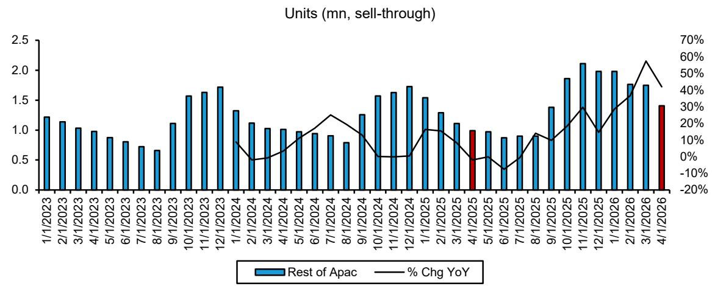

bar_line

Units (mn, sell-through)
| Date | Rest of Apac (mn) | % Chg YoY (%) |
|---|---|---|
| 1/1/2023 | 1.25 | |
| 2/1/2023 | 1.15 | |
| 3/1/2023 | 1.05 | |
| 4/1/2023 | 0.98 | |
| 5/1/2023 | 0.88 | |
| 6/1/2023 | 0.78 | |
| 7/1/2023 | 0.70 | |
| 8/1/2023 | 0.65 | |
| 9/1/2023 | 1.10 | |
| 10/1/2023 | 1.58 | |
| 11/1/2023 | 1.63 | |
| 12/1/2023 | 1.72 | |
| 1/1/2024 | 1.35 | |
| 2/1/2024 | 1.12 | -5.6 |
| 3/1/2024 | 1.03 | -4.4 |
| 4/1/2024 | 1.01 | -4.4 |
| 5/1/2024 | 0.97 | -4.4 |
| 6/1/2024 | 0.94 | -4.4 |
| 7/1/2024 | 0.90 | -4.4 |
| 8/1/2024 | 0.78 | -4.4 |
| 9/1/2024 | 1.27 | -8.8 |
| 10/1/2024 | 1.57 | -5.6 |
| 11/1/2024 | 1.63 | -5.6 |
| 12/1/2024 | 1.75 | -5.6 |
| 1/1/2025 | 1.53 | -5.6 |
| 2/1/2025 | 1.30 | -8.8 |
| 3/1/2025 | 1.10 | -8.8 |
| 4/1/2025 | 0.97 | -8.8 |
| 5/1/2025 | 0.93 | -8.8 |
| 6/1/2025 | 0.86 | -8.8 |
| 7/1/2025 | 0.89 | -8.8 |
| 8/1/2025 | 0.93 | -8.8 |
| 9/1/2025 | 1.38 | -8.8 |
| 10/1/2025 | 1.87 | -8.8 |
| 11/1/2025 | 2.13 | -8.8 |
| 12/1/2025 | 2.00 | -8.8 |
| 1/1/2026 | 2.00 | -8.8 |
| 2/1/2026 | 1.76 | -8.8 |
| 3/1/2026 | 1.76 | -8.8 |
| 4/1/2026 | 1.40 | -8.8 |
Units (mn, sell-through)

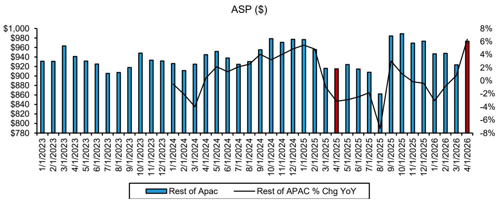

bar_line

ASP ($)
| Date | Rest of Apac ($) | Rest of APAC % Chg YoY (%) |
|---|---|---|
| 1/1/2023 | 935 | |
| 2/1/2023 | 934 | |
| 3/1/2023 | 965 | |
| 4/1/2023 | 945 | |
| 5/1/2023 | 935 | |
| 6/1/2023 | 930 | |
| 7/1/2023 | 905 | |
| 8/1/2023 | 908 | |
| 9/1/2023 | 918 | |
| 10/1/2023 | 950 | |
| 11/1/2023 | 935 | |
| 12/1/2023 | 934 | |
| 1/1/2024 | 930 | |
| 2/1/2024 | 910 | |
| 3/1/2024 | 928 | |
| 4/1/2024 | 948 | |
| 5/1/2024 | 955 | |
| 6/1/2024 | 940 | |
| 7/1/2024 | 930 | |
| 8/1/2024 | 935 | |
| 9/1/2024 | 955 | |
| 10/1/2024 | 978 | |
| 11/1/2024 | 975 | |
| 12/1/2024 | 978 | |
| 1/1/2025 | 978 | |
| 2/1/2025 | 960 | |
| 3/1/2025 | 915 | |
| 4/1/2025 | 918 | |
| 5/1/2025 | 930 | |
| 6/1/2025 | 918 | |
| 7/1/2025 | 910 | |
| 8/1/2025 | 860 | |
| 9/1/2025 | 985 | |
| 10/1/2025 | 988 | |
| 11/1/2025 | 970 | |
| 12/1/2025 | 975 | |
| 1/1/2026 | 948 | |
| 2/1/2026 | 948 | |
| 3/1/2026 | 930 | |
| 4/1/2026 | 975 | -8%

Source: Counterpoint, Bernstein Analysis

EXHIBIT 23: Japan iPhone revenue, units, ASP   
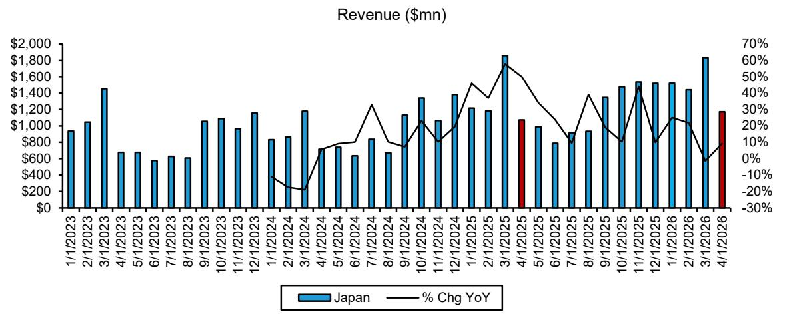

bar_line

Revenue ($mn)
| Date | Japan ($) | % Chg YoY (%) |
|---|---|---|
| 1/1/2023 | 950 | - |
| 2/1/2023 | 1050 | - |
| 3/1/2023 | 1450 | - |
| 4/1/2023 | 680 | - |
| 5/1/2023 | 690 | - |
| 6/1/2023 | 570 | - |
| 7/1/2023 | 630 | - |
| 8/1/2023 | 610 | - |
| 9/1/2023 | 1080 | - |
| 10/1/2023 | 1100 | - |
| 11/1/2023 | 980 | - |
| 12/1/2023 | 1150 | - |
| 1/1/2024 | 830 | -18 |
| 2/1/2024 | 860 | -24 |
| 3/1/2024 | 1180 | -24 |
| 4/1/2024 | 700 | 8 |
| 5/1/2024 | 730 | 8 |
| 6/1/2024 | 640 | 8 |
| 7/1/2024 | 840 | 33 |
| 8/1/2024 | 670 | 8 |
| 9/1/2024 | 1140 | 7 |
| 10/1/2024 | 1340 | 25 |
| 11/1/2024 | 1080 | 13 |
| 12/1/2024 | 1390 | 25 |
| 1/1/2025 | 1230 | 48 |
| 2/1/2025 | 1190 | 39 |
| 3/1/2025 | 1850 | 63 |
| 4/1/2025 | 1090 | 55 |
| 5/1/2025 | 990 | 37 |
| 6/1/2025 | 770 | 17 |
| 7/1/2025 | 870 | 9 |
| 8/1/2025 | 940 | 39 |
| 9/1/2025 | 1340 | 17 |
| 10/1/2025 | 1480 | 9 |
| 11/1/2025 | 1530 | 46 |
| 12/1/2025 | 1530 | 9 |
| 1/1/2026 | 1530 | 26 |
| 2/1/2026 | 1440 | 24 |
| 3/1/2026 | 1840 | -3 |
| 4/1/2026 | 1180 | 17 |

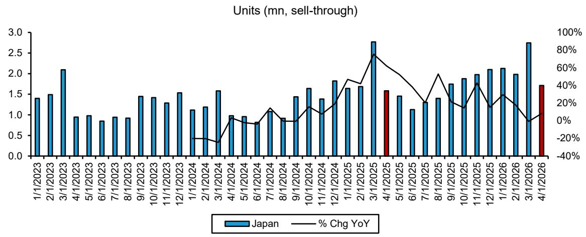

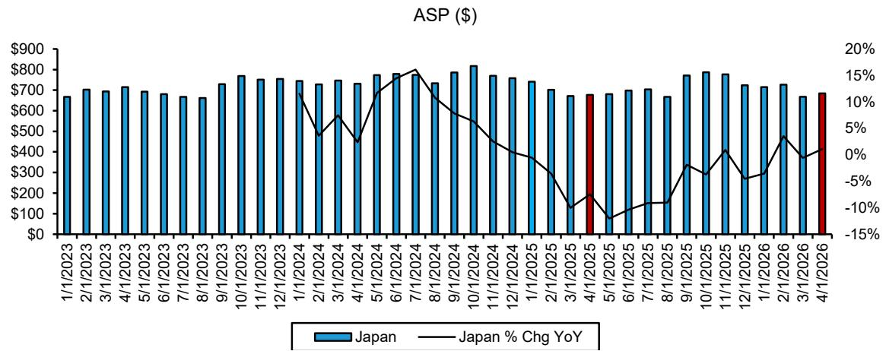  
Source: Counterpoint, Bernstein Analysis

# I. REQUIRED DISCLOSURES

References to "Bernstein" or the "Firm" in these disclosures relate to the following entities: Bernstein Institutional Services LLC (April 1, 2024 onwards), Bernstein & Co., LLC (pre April 1, 2024), Bernstein Autonomous LLP, BSG France S.A. (April 1, 2024 onwards), Bernstein (Hong Kong) Limited 盛博香港有限公司, Bernstein (Canada) Limited, Bernstein (India) Private Limited (SEBI registration no. INH000006378), Bernstein (Singapore) Private Limited, Bernstein Japan KK (サンフォード・C・バーンスタイン株式会社) and analysts employed by SG Africa Technologies & Services to produce Bernstein under a Global Services Agreement in place between Bernstein and SG.

Bernstein is part of a joint venture between SG (SG) and AllianceBernstein, L.P. (AB). Unless specifically noted otherwise, for purposes of these disclosures, references to Bernstein's “affiliates” relate to both SG and AB and their respective affiliates.

# VALUATION METHODOLOGY

This research publication covers six or more companies. For valuation methodology and other company disclosures:

Please visit: https://bernstein-autonomous.bluematrix.com/sellside/Disclosures.action.

Or, you can also write to the Director of Compliance, Bernstein Institutional Services LLC, 245 Park Avenue, New York, NY 10167.

# RISKS

This research publication covers six or more companies. For risks and other company disclosures:

Please visit: https://bernstein-autonomous.bluematrix.com/sellside/Disclosures.action.

Or, you can also write to the Director of Compliance, Bernstein Institutional Services LLC, 245 Park Avenue, New York, NY 10167.

# RATINGS DEFINITIONS, BENCHMARKS AND DISTRIBUTION

# EQUITY RATINGS DEFINITIONS

# Bernstein brand

The Bernstein brand rates stocks based on forecasts of relative performance for the next 12 months versus the S&P 500 for stocks listed on the U.S. and Canadian exchanges, versus the Bloomberg Europe Developed Markets Large and Mid Cap Price Return Index EUR (EDME) for stocks listed on the European exchanges and emerging markets exchanges outside of the Asia Pacific region, versus the Bloomberg Japan Large and Mid Cap Price Return Index USD (JPL) for stocks listed on the Japanese exchanges, and versus the Bloomberg Asia ex-Japan Large and Mid Cap Price Return Index (ASIAX) for stocks listed on the Asian (ex-Japan) exchanges -unless otherwise specified.

The Bernstein brand has three categories of ratings:

- Outperform: Stock will outpace the market index by more than 15 pp   
• Market-Perform: Stock will perform in line with the market index to within +/-15 pp   
• Underperform: Stock will trail the performance of the market index by more than 15 pp

Coverage Suspended: Coverage of a company under the Bernstein brand has been suspended. Ratings and price targets are suspended temporarily, are no longer current, and should therefore not be relied upon.

Not Rated: A rating assigned when the stock cannot be accurately valued, or the performance of the company accurately predicted, at the present time. The covering analyst may continue to publish research reports on the company to update investors on events and developments.

Not Covered (NC) denotes companies that are not under coverage.

Bernstein brand stock ratings are based on a 12-month time horizon.

# Autonomous brand – common stocks

The Autonomous brand rates common stocks as indicated below. As our benchmarks we use the Bloomberg Europe 500 Banks And Financial Services Index (BEBANKS) and Bloomberg Europe Dev Mkt Financials Large and Mid Cap Price Ret Index EUR (EDMFI) index for developed European banks and Payments, the Bloomberg Europe 500 Insurance Index (BEINSUR) for European insurers, the S&P 500 and S&P Financials for US banks and Payments coverage, S5LIFE for US Insurance, the S&P Insurance Select Industry (SPSIINS) for US Non-Life Insurers coverage, and the Bloomberg Emerging Markets Financials Large, Mid and Small Cap Price Return Index (EMLSF) for emerging market banks and insurers and Payments. Ratings are stated relative to the sector (not the market).

The Autonomous brand has three categories of common stock ratings:

- Outperform (OP): Stock will outpace the relevant index by more than 10 pp   
- Neutral (N): Stock will perform in line with the market index to within +/-10 pp   
• Underperform (UP): Stock will trail the performance of the relevant index by more than 10 pp

Coverage Suspended: Coverage of a company under the Autonomous research brand has been suspended. Ratings and price targets are suspended temporarily, are no longer current, and should therefore not be relied upon.

Not Rated: A rating assigned when the stock cannot be accurately valued, or the performance of the company accurately predicted, at the present time. The covering analyst may continue to publish research reports on the company to update investors on events and developments.

Those denoted as ‘Feature’ (e.g., Feature Outperform FOP, Feature Under Outperform FUP) are our core ideas.

Not Covered (NC) denotes companies that are not under coverage.

Autonomous brand common stock ratings are based on a 12-month time horizon.

# Autonomous brand – preferred stocks

The Autonomous brand has three categories of preferred stock ratings:

- Outperform (OP): The total return of the preferred instrument is expected to outperform preferred securities of other issuers operating in similar sectors or rating categories over the next six months.   
- Neutral (N): The total return of the preferred instrument is expected to perform in line with preferred securities of other issuers operating in similar sectors or rating categories over the next six months.   
- Underperform (UP): The total return of the preferred instrument is expected to underperform preferred securities of other issuers operating in similar sectors or rating categories over the next six months.

Autonomous preferred stock ratings are based on a 6-month time horizon.

# AUTONOMOUS CREDIT RESEARCH

Where this report contains investment recommendations for credit instruments, as defined in article 3(1)(35) of the Market Abuse Regulation, the information below is presented to comply with its disclosure requirements.

The report may also include reference(s) to published opinions by other Autonomous or Bernstein analysts covering the equity securities of the issuer(s) referenced herein. Please note an investment recommendation for credit instruments published by the author(s) of this report may differ from the published view of the analyst covering equity securities for the issuer(s) contained in this report and vice versa.

# CREDIT RATINGS DEFINITIONS

The Autonomous brand has three categories of credit ratings:

\- Credit Outperform (C-OP): The total return of the Reference Credit Instrument is expected to outperform the credit spread of bonds of other issuers operating in similar sectors or rating categories over the next six months.

- Credit Neutral (C-N): The total return of the Reference Credit Instrument is expected to perform in line with the credit spread of bonds of other issuers operating in similar sectors or rating categories over the next six months.   
- Credit Underperform (C-UP): The total return of the Reference Credit Instrument is expected to underperform the credit spread of bonds of other issuers operating in similar sectors or rating categories over the next six months.

Autonomous credit ratings are based on a 6-month time horizon.

A list of all investment recommendations produced by the author(s) of this report alongside credit ratings history are available upon request.

It is at the sole discretion of the Firm as to when to initiate, update and cease research coverage. The Firm has established, maintains and relies on information barriers to control the flow of information contained in one or more areas (i.e. the private side) within the Firm, and into other areas, units, groups or affiliates (i.e. public side) of the Firm

DISTRIBUTION OF EQUITY RATINGS/INVESTMENT BANKING SERVICES 

<table><tr><td>Equity Rating</td><td>Market Abuse Regulation (MAR) and FINRA Rating Category</td><td>Global Rating Distribution</td><td>Investment Banking Relationships*</td></tr><tr><td>Outperform</td><td>BUY</td><td>51.1%</td><td>16.5%</td></tr><tr><td>Market-Perform (Bernstein Brand) Neutral (Autonomous Brand)</td><td>HOLD</td><td>36.3%</td><td>17.8%</td></tr><tr><td>Underperform</td><td>SELL</td><td>12.6%</td><td>14.9%</td></tr></table>

\* These figures represent the percentage of companies within each equity rating category for which affiliates of Bernstein have provided investment banking services within the previous 12 months.

As of March 31, 2026. All figures are updated quarterly.

Prior to April 1, 2024, Bernstein & Co., LLC. issued the ratings and price target information in the graph(s) below for the following companies: Apple Inc, Qualcomm Inc and Broadcom Inc.

# PRICE CHARTS/ RATINGS AND PRICE TARGET HISTORY

This research publication covers six or more companies. For price chart and other company disclosures, please visit https://bernstein-autonomous.bluematrix.com/sellside/Disclosures.action or you can write to the Director of Compliance, Bernstein Institutional Services LLC, 245 Park Avenue, New York, NY 10167.

# CONFLICTS OF INTEREST

All statements in this report attributable to Gartner represent Bernstein's interpretation of data, research opinion or viewpoints published as part of a syndicated subscription service by Gartner, Inc., and have not been reviewed by Gartner. Each Gartner publication speaks as of its original publication date (and not as of the date of this report). The opinions expressed in Gartner publications are not representations of fact, and are subject to change without notice.

Stacy A. Rasgon maintains long positions in various crypto currencies.

Bernstein Autonomous LLP or BSG France SA, beneficially, has either a net long or short position of 0.5% or more of the total issued share capital of a class of common equity securities of the following MiFID eligible securities: Broadcom Inc.

Bernstein has received compensation for non-investment banking securities-related products or services in the previous twelve months from the following clients: Apple Inc and Samsung Electronics Co Ltd.

Bernstein and/or affiliates have received compensation for non-investment banking securities-related products or services in the previous twelve months from the following clients: Apple Inc, SK Hynix Inc, Samsung Electronics Co Ltd and Sony Group Corp.

Certain affiliates of Bernstein act as market maker or liquidity provider in the equities securities of: Apple Inc, Qualcomm Inc, Broadcom Inc and Micron Technology Inc.

Certain affiliates of Bernstein act as market maker or liquidity provider in the debt securities of: Broadcom Inc and SK Hynix Inc.

# OTHER MATTERS

The legal entity(ies) employing the analyst(s) listed in this report, and their location, can be determined by the country code of their phone number, as follows:

+1 Bernstein Institutional Services LLC; New York, New York, USA

+44 Bernstein Autonomous LLP; London UK

+212 SG Africa Technologies & Services; Casablanca, Morocco

+33 BSG France S.A.; Paris, France

+34 BSG France S.A.; Madrid, Spain

+41 Bernstein Autonomous LLP; Geneva, Switzerland

+49 BSG France S.A.; Frankfurt, Germany

+91 Bernstein (India) Private Limited; Mumbai, India

+852 Bernstein (Hong Kong) Limited 盛博香港有限公司; Hong Kong, China

+65 Bernstein (Singapore) Private Limited; Singapore

+81 Bernstein Japan KK; Tokyo, Japan

Where this report has been prepared by research analyst(s) employed by a non-US affiliate, such analyst(s), is/are (unless otherwise expressly noted below) not registered as associated persons of Bernstein Institutional Services LLC or any other SEC-registered broker-dealer and are not licensed or qualified as research analysts with FINRA. Accordingly, such analyst(s) may not be subject to FINRA's restrictions regarding (among other things) communications by research analysts with a subject company, interactions between research analysts and investment banking personnel, participation by research analysts in solicitation and marketing activities relating to investment banking transactions, public appearances by research analysts, and trading securities held by a research analyst account.

Where this report has been prepared by research analyst(s) employed by SG Africa Technologies & Services (part of the SG group of companies), it has been prepared on behalf of a Bernstein company under a Global Services Agreement in place between Bernstein and SG.

# CERTIFICATION

Each research analyst listed in this report, who is primarily responsible for the preparation of the content of this report, certifies that all of the views expressed in this publication accurately reflect that analyst's personal views about any and all of the subject securities or issuers and that no part of that analyst's compensation was, is, or will be, directly or indirectly, related to the specific recommendations or views in this publication.

# II. ADDITIONAL GLOBAL CONFLICT DISCLOSURES

It is at the sole discretion of the Firm as to when to initiate, update and cease research coverage. The Firm has established, maintains and relies on information barriers to control the flow of information contained in one or more areas (i.e., the private side) within the Firm, and into other areas, units, groups or affiliates (i.e., public side) of the Firm.

# III. OTHER IMPORTANT INFORMATION AND DISCLOSURES

Separate branding is maintained for “Bernstein” and “Autonomous” research products.

\- Bernstein produces a number of different types of research products including, among others, fundamental analysis and quantitative analysis under both the “Autonomous” and “Bernstein” brands. Recommendations contained within one type of research product may differ from recommendations contained within other types of research products, whether as a result of differing time horizons, methodologies or otherwise. Furthermore, views or recommendations within a research product issued under one brand may differ from views or recommendations under the same type of research product issued under the other brand. The Research Ratings System for the two brands and other information related to those Rating Systems are included in the previous section.

\- Autonomous operates as a separate business unit within the following entities: Bernstein Institutional Services LLC, Bernstein Autonomous LLP, Bernstein (Hong Kong) Limited 盛博香港有限公司 and Bernstein (India) Private Limited. For information relating to “Autonomous” branded products (including certain Sales materials) please visit: www.autonomous.com. For information relating to Bernstein branded products please visit: www.bernsteinresearch.com.

Analysts are compensated based on aggregate contributions to the research franchise as measured by account penetration, productivity and proactivity of investment ideas. No analysts are compensated based on performance in, or contributions to, generating investment banking revenues.

This report has been produced by an independent analyst as defined in Article 3 (1)(34)(i) of EU 596/2014 Market Abuse Regulation (“MAR”) and the same article of MAR as it forms part of United Kingdom domestic law by virtue of the European Union (Withdrawal) Act 2018.

To our readers in the United States: Bernstein Institutional Services LLC, a broker-dealer registered with the U.S. Securities and Exchange Commission (“SEC”) and a member of the U.S. Financial Industry Regulatory Authority, Inc. (“FINRA”) is distributing this publication in the United States and accepts responsibility for its contents. Where this material contains an analysis of debt product(s), such material is intended only for institutional investors and is not subject to the US independence and disclosure standards applicable to debt research prepared for retail investors.

Bernstein Institutional Services LLC may act as principal for its own account or as agent for another person (including an affiliate) in sales or purchases of any security which is a subject of this report. This report does not purport to meet the objectives or needs of any specific individuals, entities or accounts.

To our readers in Canada: If this publication pertains to a Canadian domiciled company, it is being distributed in Canada by Bernstein (Canada) Limited, which is licensed and regulated by the Canadian Investment Regulatory Organization. If the publication pertains to a non-Canadian domiciled company, it is being distributed by Bernstein Institutional Services LLC, which is licensed and regulated by both the SEC and FINRA, into Canada under the International Dealers Exemption.

This document may not be passed onto any person in Canada unless that person qualifies as "permitted client" as defined in Section 1.1 of NI 31-103.

To our readers in Brazil: This report has been prepared by Bernstein Institutional Services LLC, and Banco BTG Pactual S.A. ("BTG") is responsible for the distribution of this report in Brazil.

To readers in the United Kingdom: This publication has been issued or approved for issue in the United Kingdom by Bernstein Autonomous LLP, authorised and regulated by the Financial Conduct Authority and located at 60 London Wall, London EC2M 5SH, +44 (0)20-7170-5000. Registered in England & Wales No OC343985.

This document is for distribution only to persons who (i) have professional experience in matters relating to investments falling within Article 19(5) of the Financial Services and Markets Act 2000 (Financial Promotion) Order 2005 (as amended, the “Financial Promotion Order”), (ii) are persons falling within Article 49(2)(a) to (d) (“high net worth companies, unincorporated associations, etc.”) of the Financial Promotion Order, (iii) are outside the United Kingdom, or (iv) are persons to whom an invitation or inducement to engage in investment activity (within the meaning of section 21 of the FSMA) in connection with the issue or sale of any securities may otherwise lawfully be communicated or caused to be communicated (all such persons together being referred to as “relevant persons”). This document is directed only at relevant persons and must not be acted on or relied on by persons who are not relevant persons. Any investment or investment activity to which this document relates is available only to relevant persons and will be engaged in only with relevant persons.

To our readers in the member states of the EEA: This publication is being distributed by BSG France SA, which is authorised and regulated by the Autorité de Contrôle Prudentiel et de Résolution (ACPR) and Autorité des Marchés Financiers (AMF).

To our readers in Hong Kong: This publication is being distributed in Hong Kong by Bernstein (Hong Kong) Limited 盛博香港有限公司, which is licensed and regulated by the Hong Kong Securities and Futures Commission (Central Entity No. AXC846) to carry out Type 4 (Advising on Securities) regulated activities and subject to the licensing conditions mentioned in the SFC Public Register (https://www.sfc.hk/publicregWeb/corp/AXC846/details)). This publication is solely for professional investors, as defined in the Securities and Futures Ordinance (Cap. 571). The purpose of this report is solely to provide an analysis of the issuers referred to in this report and is not intended for any purpose contrary to the laws of Hong Kong.

To our readers in Singapore: This publication is being distributed in Singapore by Bernstein (Singapore) Private Limited, only to accredited investors or institutional investors, as defined in the Securities and Futures Act 2001 of Singapore ("SFA"). Recipients in Singapore should contact Bernstein (Singapore) Private Limited in respect of matters arising from, or in connection with, this publication. Bernstein (Singapore) Private Limited is regulated by the Monetary Authority of Singapore and licensed under the SFA as a capital markets services licence holder for dealing in capital markets products that are securities and collective investment schemes and an exempt financial adviser for advising on, issuing and promulgating analyses and reports on securities. Bernstein (Singapore) Private Limited is registered in Singapore with Company Registration No. 20213710W and located at One Raffles Quay, #27-11 South Tower, Singapore 048583, +65-6230-4612.

To our readers in the People's Republic of China: The securities referred to in this document are not being offered or sold and may not be offered or sold, directly or indirectly, in the People's Republic of China (for such purposes, not including the Hong Kong and Macau Special Administrative Regions or Taiwan, the "PRC") in contravention of any applicable laws of the PRC.

This document does not constitute an offer to sell or the solicitation of an offer to buy any securities in the PRC to any person to whom it is unlawful to make the offer or solicitation in the PRC.

We do not represent that this document may be lawfully distributed, or that any securities may be lawfully offered, in compliance with any applicable registration or other requirements in the PRC, or pursuant to an exemption available thereunder, or assume any responsibility for facilitating any such distribution or offering. In particular, no action has been taken by us which would permit a public offering of any securities or distribution of this document in the PRC. Accordingly, the securities are not being offered or sold within the PRC by means of this document or any other document. Neither this document nor any advertisement or other offering material may be distributed or published in the PRC, except under circumstances that will result in compliance with any applicable laws and regulations.

To our readers in Japan: This publication is being distributed in Japan by Bernstein Japan KK (サンフォード・C・バーンスタイン株式会社), which is registered in Japan as a Financial Instruments Business Operator with the Kanto Local Finance Bureau (registration number: The Director-General of Kanto Local Finance Bureau (FIBO) No.3387) and regulated by the Financial Services Agency. It is also a member of Japan Investment Advisers Association. This publication is solely for qualified institutional investors in Japan only, as defined in Article 2, paragraph (3), items (i) of the Financial Instruments and Exchange Act.

For the institutional client readers in Japan who have been granted access to the Bernstein website by Daiwa Group Inc. ("Daiwa"), your access to this document should not be construed as meaning that Bernstein is providing you with investment advice for any purposes. Whilst Bernstein has prepared this document, your relationship is, and will remain with, Daiwa, and Bernstein has neither any contractual relationship with you nor any obligations towards you.

To our readers in Australia: Bernstein (Hong Kong) Limited 盛博香港有限公司 is responsible for distributing research in Australia. It is regulated by the Securities and Exchange Commission under U.S. laws, by the Financial Conduct Authority under U.K. laws, which differs from Australian laws. Bernstein (Hong Kong) Limited 盛博香港有限公司 is exempt from the requirement to hold an Australian financial services license under the Corporations Act 2001 in respect of the provision of the following financial services to wholesale clients:

• providing financial product advice;   
• dealing in a financial product;   
• making a market for a financial product; and   
• providing a custodial or depository service.

To our readers in India: This publication is being distributed in India by Bernstein (India) Private Limited (SCB India) which is licensed and regulated by Securities and Exchange Board of India ("SEBI") as a research analyst entity under the SEBI (Research Analyst) Regulations, 2014, having registration no. INH000006378 and as a stock broker having registration no. INZ000213537. SCB India is currently engaged in the business of providing research and stock broking services. Please refer to www.bernsteinresearch.in for more information.

\- SCB India is a Private limited company incorporated under the Companies Act, 2013, on April 12, 2017 bearing corporate identification number U65999MH2017FTC293762, and registered office at Level 3A, 4th Floor, First International Financial Centre, Plot Nos C-54 and C-55, G Block, Near CBI Office, Bandra Kurla Complex, Bandra (East), Mumbai 400098, Maharashtra, India (Phone No: +91-22-68421401).

- For details of Associates (i.e., affiliates/group companies) of SCB India, kindly email MUM-BERNSTEIN-InCompliance@bernsteinsg.com.   
• SCB India does not have any disciplinary history as on the date of this report.   
- Except as noted above, SCB India and/or its Associates (i.e., affiliates/group companies), the Research Analysts authoring this report, and their relatives

• do not have any financial interest in the subject company   
• do not have actual/beneficial ownership of one percent or more in securities of the subject company;   
- is not engaged in any investment banking activities for Indian companies, as such;   
• have not managed or co-managed a public offering in the past twelve months for any Indian companies;

\- have not received any compensation for investment banking services or merchant banking services from the subject company in the past 12 months;

• have not received compensation for brokerage services from the subject company in the past twelve months;

\- have not received any compensation or other benefits from the subject company or third party related to the specific recommendations or views in this report; and

\- do not currently, but may in the future, act as a market maker in the financial instruments of the companies covered in the report.

\- do not have any conflict of interest in the subject company as of the date of this report.

- Except as noted above, the subject company has not been a client of SCB India during twelve months preceding the date of distribution of this research report. Neither SCB India nor its Associates (i.e., affiliates/group companies) have received compensation for products or services other than investment banking, merchant banking or brokerage services from the subject company in the past twelve months.   
- The principal research analyst(s) who prepared this report, members of the analysts' team, and members of their households are not an officer, director, employee or advisory board member of the companies covered in the report.   
- Our Compliance officer / Grievance officer is Ms. Rupal Talati, who can be reached at +91-22-68421451, or MUM-BERNSTEIN-InCompliance@bernsteinsg.com / Scbin-investorgrievance@bernsteinsg.com   
- The Research investor charter and Terms & Conditions of SCB India are available on its website and may be accessed at Bernstein (India) Private Limited (https://bernsteinresearch.in/) for your reference.   
- Disclaimer: Registration granted by SEBI, and certification from NISM, is in no way a guarantee of performance of the intermediary or provide any assurance of returns to investors. Investments in securities market are subject to market risks. Read all the related documents carefully before investing.

To our readers in Switzerland: This document is provided in Switzerland by or through Bernstein Autonomous LLP, and is provided only to qualified investors as defined in article 10 of the Swiss Collective Investment Scheme Act (“CISA”) and related provisions of the Collective Investment Scheme Ordinance and in strict compliance with applicable Swiss law and regulations. The products mentioned in this document may not be suitable for all types of investors. This document is based on the Directives on the Independence of Financial Research issued by the Swiss Bankers Association (SBA) in January 2008.

To our readers in the Middle East: Bernstein Autonomous LLP, DIFC branch has its principal office at Gate Village 06, DIFC, Dubai, UAE. Bernstein Autonomous LLP, DIFC branch is regulated by the Dubai Financial Services Authority (DFSA) with the registration number CL10040 and is provisioned for Arranging Deals in Investments and Advising on Financial Products. All communications and services are directed at Professional Clients and Market Counterparties only (as defined in the DFSA rulebook). Persons other than Professional Clients and Market Counterparties, such as Retail Clients, are not the intended recipients of our communications or services.

# LEGAL

All research publications are disseminated to our clients through posting on the firm's password protected websites, bernsteinresearch.com and autonomous.com. Certain, but not all, research publications are also made available to clients through third-party vendors or redistributed to clients through alternate electronic means as a convenience.

This publication has been published and distributed in accordance with the Firm's policy for management of conflicts of interest in investment research, a copy of which is available from Bernstein Institutional Services LLC, Director of Compliance, 245 Park Avenue, New York, NY 10167. Additional disclosures and information regarding Bernstein's business are available on our website www.bernsteinresearch.com.

The securities described herein may not be eligible for sale in all jurisdictions or to certain categories of investors where that permission profile is not consistent with the licenses held by the entities noted herein. This document is for distribution only as may be permitted by law. This publication is not directed to, or intended for distribution to or use by, any person or entity who is a citizen or resident of, or located in any locality, state, country or other jurisdiction where such distribution, publication, availability or use would be contrary to law or regulation or which would subject any of the entities referenced herein or any of their subsidiaries or affiliates to any registration or licensing requirement within such jurisdiction. This publication is based upon public sources we believe to be reliable, but no representation is made by us that the publication is accurate or complete. We do not undertake to advise you of any change in the reported information or in the opinions herein. This publication was prepared and issued by entity referred to herein for distribution to eligible counterparties or professional clients. This publication is not an offer to buy or sell any security, and it does not constitute investment, legal or tax advice. The investments referred to herein may not be suitable for you. Investors must make their own investment decisions in consultation with their professional advisors in light of their specific circumstances. The value of investments may fluctuate, and investments that are denominated in foreign currencies may fluctuate in value as a result of exposure to exchange rate movements. Information about past performance of an investment is not necessarily a guide to, indicator of, or assurance of, future performance.

This report is directed to and intended only for our clients who are “eligible counterparties”, “professional clients”, “institutional investors” and/or “professional investors” as defined by the aforementioned regulators, and must not be redistributed to retail clients as defined by the aforementioned regulators. Retail clients who receive this report should note that the services of the entities noted herein are not available to them and should not rely on the material herein to make an investment decision. The result of such act will not hold the entities noted herein liable for any loss thus incurred as the entities noted herein are not registered/authorised/licensed to deal with retail clients and will not enter into any contractual agreement/arrangement with retail clients. This report is provided subject to the terms and conditions of any agreement that the clients may have entered into with the entities noted herein. All research reports are disseminated on a simultaneous basis to eligible clients through electronic publication to our client portal.

The information in this report was prepared by Bernstein solely for the internal business use of our clients. Clients may store, display, analyze, reformat and print the information in this report for this limited use only. Clients may not copy, alter, create derivative works, resell, reverse engineer, commercially exploit, share or distribute any part of the information contained herein for any purpose without Bernstein's express written consent. These restrictions include extracting data or using the content to develop indices or other products. Further, you may not use this report, or any portion of this report, to train or finetune any third-party machine learning or artificial intelligence system, or as a prompt or input into any such system. You also may not, without Bernstein's express written consent, do any of the foregoing in connection with your own internal machine learning or artificial intelligence system.

Bernstein may use artificial intelligence tools in the preparation of its materials. Any such materials are reviewed by Bernstein's research analysts prior to publication.

This report has been prepared for information purposes only and is based on current public information that we consider reliable, but the entities noted herein do not warrant or represent (express or implied) as to the sources of information or data contained herein are accurate, complete, not misleading or as to its fitness for the purpose intended even though the entities noted herein rely on reputable or trustworthy data providers, it should not be relied upon as such. Opinions expressed are the author(s)' current opinions as of the date appearing on the material only and we do not undertake to advise you of any change in the reported information or in the opinions herein.

This publication was prepared and issued by the entity referred to herein for distribution to eligible counterparties or professional clients. The information in this report is intended for general circulation and does not constitute an offer to buy or sell any security, investment, legal or tax advice nor a personal recommendation, as defined by any of the aforementioned regulators. It does not take into account the particular investment objectives, financial situations, or needs of individual investors. The report has not been reviewed by any of the aforementioned regulators and does not represent any official recommendation from the aforementioned regulators. The investments referred to herein may not be suitable for you. Investors must make their own investment decisions in consultation with advice sought from a financial adviser regarding the suitability of the investment product, taking into account the specific investment objectives, financial situation or particular needs of any recipient of the recommendation, before the recipient

makes a commitment to purchase the investment product.

The analysis contained herein is based on numerous assumptions. Different assumptions could result in materially different results. The information in this report does not constitute, or form part of, any offer to sell or issue, or any offer to purchase or subscribe for shares, or to induce engage in any other investment activity. The value of any securities or financial instruments mentioned in this report may fluctuate subject to market conditions. Information about past performance of an investment is not necessarily a guide to, indicative of, or assurance of future performance. Estimates of future performance mentioned by the research analyst in this report are based on assumptions that may not be realized due to unforeseen factors like market volatility/fluctuation. In relation to securities or financial instruments denominated in a foreign currency other than the clients' home currency, movements in exchange rates will have an effect on the value, either favorable or unfavorable. Before acting on any recommendations in this report, recipients should consider the appropriateness of investing in the subject securities or financial instruments mentioned in this report and, if necessary, seek for independent professional advice.

The securities described herein may not be eligible for sale in all jurisdictions or to certain categories of investors where that permission profile is not consistent with the licenses held by the entities noted herein. This document is for distribution only as may be permitted by law. It is not directed to, or intended for distribution to or use by, any person or entity who is a citizen or resident of or located in any locality, state, country or other jurisdiction where such distribution, publication, availability or use would be contrary to law or regulation or would subject the entities noted herein to any regulation or licensing requirement within such jurisdiction.

Source: Bloomberg Index Services Limited. BLOOMBERG® is a trademark and service mark of Bloomberg Finance L.P. and its affiliates (collectively “Bloomberg”). Bloomberg or Bloomberg’s licensors own all proprietary rights in the Bloomberg Indices. Neither Bloomberg nor Bloomberg’s licensors approves or endorses this material, or guarantees the accuracy or completeness of any information herein, or makes any warranty, express or implied, as to the results to be obtained therefrom and, to the maximum extent allowed by law, neither shall have any liability or responsibility for injury or damages arising in connection therewith.

No part of this material may be reproduced, distributed or transmitted or otherwise made available without prior consent of the entities noted herein. Copyright Bernstein Institutional Services LLC Bernstein Autonomous LLP, BSG France S.A., Bernstein (Hong Kong) Limited 盛博香港有限公司, Bernstein (Canada) Limited, Bernstein (India) Private Limited (SEBI registration no. INH000006378), Bernstein (Singapore) Private Limited and Bernstein Japan KK (サンフォード・C・バーンスタイン株式会社). All rights reserved. The trademarks and service marks contained herein are the property of their respective owners. Any unauthorized use or disclosure is strictly prohibited. The entities noted herein may pursue legal action if the unauthorized use results in any defamation and/or reputational risk to the entities noted herein and research published under the Bernstein and Autonomous brands.