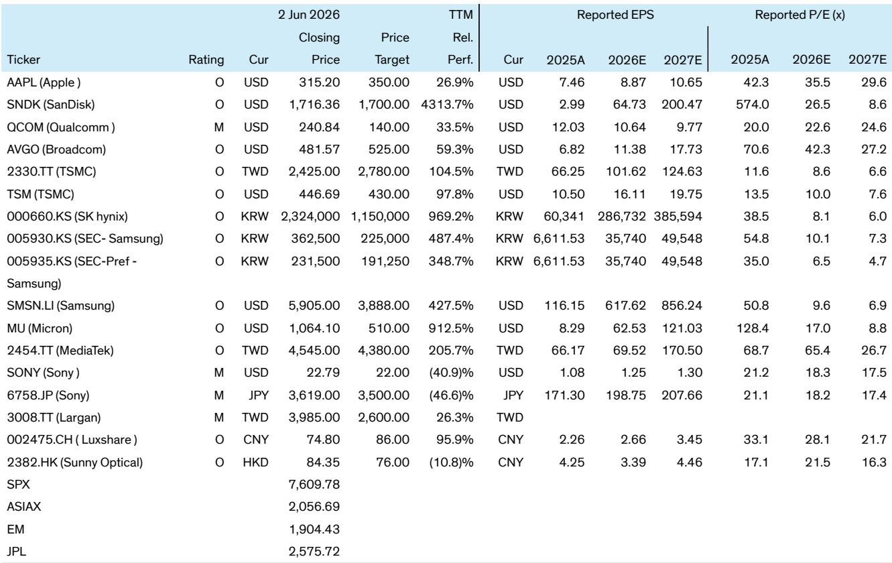
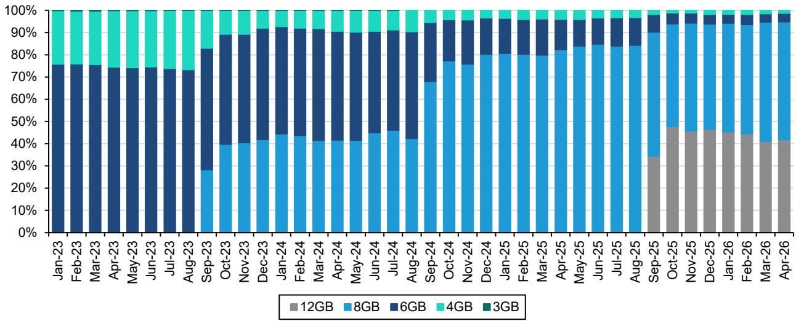
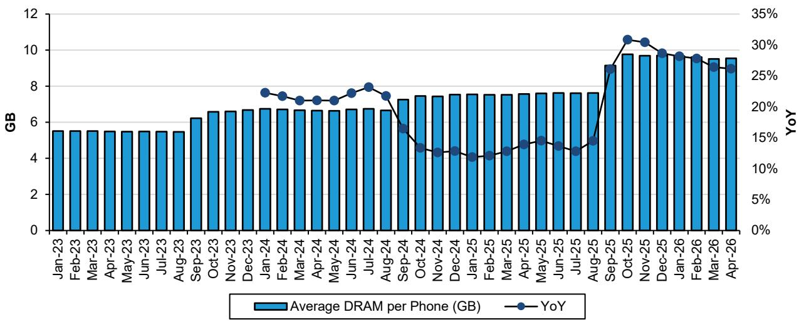

# Apple Is Winning the Premium War in a Shrinking Market — But the Supply Chain Tells a Different Story

The global smartphone market is contracting at its fastest rate in years, with full-year 2026 shipments now expected to decline by nearly 14%. Yet Apple's iPhone revenue grew 5.6% year-over-year in April, driven by a 2.5% increase in unit volumes and a 3% rise in average selling prices. This divergence is not a statistical anomaly. It is the clearest signal yet that the smartphone industry is bifurcating into two distinct economies: one for premium devices that can sustain pricing power, and another for the rest of the market that is facing structural contraction.

The conventional narrative has been that Apple is simply more resilient than its Android peers during downturns. That framing is too narrow. What the April data reveals is that Apple is actively reshaping the competitive dynamics of the supply chain, forcing a re-evaluation of which suppliers will thrive and which face obsolescence. The iPhone 17 cycle is proving stronger than its predecessors, with cumulative sell-through in the first eight months reaching 122.5 million units versus 106.5 million for the iPhone 15 and 103 million for the iPhone 16. But beneath this headline strength, critical shifts are underway — in inventory dynamics, in the performance of the lower-priced "e" series, and in the competitive positioning of key component suppliers.

The most important question for investors is not whether Apple can continue to grow in a shrinking market. The evidence strongly suggests it can. The real question is which parts of the Apple supply chain are positioned to capture value from this cycle, and which are being structurally disadvantaged by Apple's strategic choices. The April tracker data provides the raw material for that analysis, but the conclusions require connecting dots that the report itself only partially draws.

## iPhone 17's Aggregate Strength Conceals a Growing Divergence Between Premium and Entry-Level Models

The headline numbers for the iPhone 17 cycle are impressive. Global sell-through revenue rose 5.6% year-over-year in April, with units up 2.5% and ASPs up 3%. The iPhone 17 Pro and Pro Max models are outperforming their predecessors, with sell-through of 30.8 million and 41.7 million units respectively in the first eight months of launch, compared to 29.2 million and 35.8 million for the iPhone 15 equivalents. This is meaningful because it confirms that Apple's strategy of driving ASP through mix shift toward higher-end configurations is working, even in a contracting market.

But the "e" series tells a more cautionary story. The iPhone 17e has underperformed the iPhone 16e during the first seven weeks of availability, with demand trailing its predecessor. The primary cause appears to be less aggressive carrier promotions in North America. Verizon and T-Mobile have both moderated their promotional activity on Apple devices compared to last year. In the prepaid channel, the iPhone 16e remains the dominant offering, with Cricket Wireless shifting away from the iPhone 13 to position the 16e as its flagship Apple device. The 17e remains primarily focused on postpaid, though broader prepaid distribution is expected later in the year.

The so-what here is critical. The "e" series was designed to capture price-sensitive consumers who might otherwise defect to Android. If the 17e is underperforming its predecessor, it suggests that Apple's ability to defend its market share at the lower end of its product line is weakening precisely when the broader market is contracting most sharply at the low end. The total "e" series sales (16e plus 17e) are up year-over-year, but that is largely because two models are now selling simultaneously. On a like-for-like basis, the trajectory is concerning.

This divergence creates a strategic tension. Apple's premium models are thriving, but the entry point to the ecosystem is losing momentum. If the 17e continues to lag, Apple may face a longer-term challenge in onboarding new users who will eventually upgrade to premium models. The immediate financial impact is limited because the Pro and Pro Max models generate disproportionate revenue and profit. But the ecosystem effect is real and worth monitoring.

## Channel Inventory Builds Signal That Sell-Through Momentum May Be Peaking

One of the most analytically revealing data points in the April tracker is the inventory dynamic. Sell-in and sell-through units both increased 3% year-over-year, but inventory units increased month-over-month because sell-through units fell below sell-in. This has resulted in a meaningful uptick in inventory weeks.

This matters because inventory build is often a leading indicator of production adjustments. If sell-through momentum softens in the coming months, Apple and its suppliers may need to recalibrate production plans. The April data already shows a deceleration in year-over-year revenue growth compared to earlier months, though the report attributes this partly to tough comparisons with April 2025, when tariff announcements drove demand pull-forward.

The US market is particularly instructive. April iPhone sales in the US declined 7% year-over-year, with unit shipments down 13% and ASP increasing 6%. The year-over-year weakness is largely attributed to the demand pull-forward in April 2025, but the magnitude of the decline warrants attention. If US demand is softening more than anticipated, it could pressure the entire supply chain in the second half of the year.

The inventory build also has implications for Apple's pricing strategy. The report explicitly states that Apple is unlikely to raise prices mid-cycle, unlike some Android peers. This is consistent with Apple's historical approach of using mix shift rather than price increases to drive ASP. But if inventory continues to build, Apple may need to use promotional pricing to clear channel stock, which could compress margins for both Apple and its distributors.

For supply chain investors, the inventory dynamic is a critical variable to track. If inventory weeks continue to rise, component orders may be cut in subsequent quarters. Conversely, if sell-through accelerates during the 618 festival in China or the back-to-school season in the US, the inventory build could prove to be a temporary phenomenon. The data is not yet conclusive, but the direction of travel warrants caution.

## The Foundry and Memory Stories Are Diverging in Ways That Reshape Supplier Exposure

The April tracker provides granular data on two of the most important segments of the Apple supply chain: foundry (primarily TSMC) and memory. The stories are moving in different directions, and the implications for individual suppliers are significant.

For foundry, the weaker performance of the iPhone 17e has dragged on the momentum of TSMC's N3P node, which is used for the "e" series chips. This is a tactical headwind, but the strategic picture remains favorable. The report's analysis is clear: even if Apple or any mobile customer releases leading-node capacity, that capacity will be refilled by AI applications, and TSMC will not experience revenue loss. This is a powerful statement about the structural demand for leading-edge semiconductor manufacturing. TSMC's capacity is effectively fully utilized across multiple end markets, and any slack from mobile will be absorbed by AI.

The implication for investors is that TSMC's Apple-related revenue may be less cyclical than in previous cycles, because the foundry's overall capacity utilization is being supported by non-mobile demand. This is a structural change that reduces the beta of TSMC's Apple exposure. Even if iPhone volumes disappoint, TSMC's revenue from Apple may hold up better than in past downturns because the capacity cannot easily be redeployed elsewhere.

For memory, the story is more nuanced but potentially more consequential. The DRAM content per iPhone increased 26% year-over-year in April, compared to a 20% increase on a full-year basis from 2024 to 2025. This acceleration in content growth is driven by the higher memory configurations in premium models. However, the report flags a critical risk: recent memory price hikes may affect this trend in the future. If DRAM prices continue to rise, Apple may optimize its memory configurations to manage bill-of-materials costs, which could slow content growth.

The competitive dynamics in memory are also shifting. The report notes that strong iPhone 17 base and Pro model performance may be helpful for Qualcomm in the near term, but Android performance is suffering due to rising memory prices and Apple share gains. Neither of these factors is positive for Qualcomm, especially as Apple increasingly internalizes components over time. This is a structural headwind for Qualcomm that goes beyond any single product cycle.

## What the Report Does Not Fully Answer: The Foldable Delay and the Sony Risk

The April tracker contains two critical data points that are mentioned but not fully analyzed, and both have significant second-order implications for the supply chain.

First, the foldable phone launch is likely to be delayed, though the product launch is still targeted for September. This is a classic supply chain tension: the product is not ready for mass production, but the launch date is being maintained. The risk is that Apple either launches a product that is not fully ready, or that initial supply is severely constrained. For suppliers like Luxshare, which is expected to be a key beneficiary of the foldable, a delay or constrained launch would defer revenue and potentially compress margins if production ramps are rushed.

Second, the report states that there will likely be no upgrades in the camera image sensor (CIS) this year, and that Sony faces higher risk of share loss to Samsung in 2027. This is a significant competitive development. Sony has been the dominant supplier of CIS for Apple's iPhones, and any share loss would have material revenue implications. The report does not specify the mechanism for Samsung's potential gain — whether through technology, pricing, or capacity — but the directional risk is clear. For investors in Sony, this is a headwind that is not yet fully priced in.

These two data points together suggest that the Apple supply chain is entering a period of supplier rotation. Luxshare may benefit from foldable assembly, but the timing is uncertain. Sony may lose CIS share, but the timeline is multi-year. The report provides the raw data but does not fully integrate these dynamics into a coherent investment thesis for the supply chain.

## A Decision Framework for Navigating the Apple Supply Chain in a Shrinking Market

For investors trying to translate the April tracker into actionable decisions, a structured framework is essential. Based on the data and analysis, three dimensions matter most.

First, assess exposure to premium versus entry-level models. Suppliers that are heavily leveraged to the "e" series face headwinds from weaker 17e demand and less aggressive carrier promotions. Suppliers that are leveraged to the Pro and Pro Max models benefit from stronger sell-through and higher ASPs. The divergence between these two segments is likely to widen as the overall market contracts.

Second, evaluate the structural demand backdrop for each supplier's core technology. TSMC benefits from AI demand that absorbs any mobile capacity slack. Memory suppliers benefit from rising content per phone but face risk from price increases that may cause Apple to optimize configurations. CIS suppliers face potential share loss. The structural demand profile is as important as the Apple-specific volume outlook.

Third, monitor inventory dynamics as a leading indicator. The April data shows inventory building. If this trend continues, production cuts may follow. Suppliers with high fixed costs and low capacity flexibility are most exposed. Suppliers with diversified end-market exposure are better positioned.

The most important unresolved question is whether the foldable launch will proceed as planned in September. If it does, Luxshare and other assembly-related suppliers could see a significant revenue catalyst. If it is delayed, the supply chain may face a gap in new product momentum heading into 2027.

## The Open Questions That Make the Full Report Worth Reading

The April Apple Tracker provides a wealth of data, but the most valuable insights lie in the questions it raises rather than the answers it provides. Three open questions are particularly worth exploring in the full report.

First, how sustainable is the premium mix shift if the broader market continues to contract? The data shows that ASP growth is being driven by Pro and Pro Max models, but there is a limit to how much mix shift can compensate for volume declines. The report's analysis of regional trends — particularly the US decline and the China resilience — provides important context for this question.

Second, what is the trajectory of memory content growth if DRAM prices continue to rise? The report flags this risk but does not model the impact. The full report likely contains more detailed analysis of Apple's memory procurement strategy and the implications for suppliers like Micron, SK hynix, and Samsung.

Third, what is the competitive timeline for Sony's CIS position? The report mentions 2027 as the risk horizon for share loss to Samsung, but the mechanism and probability are not fully explored. The full report likely provides deeper analysis of the technology roadmaps and competitive dynamics in the CIS market.

Join the community to read the full report and review the original charts.

*This article is for learning and discussion only and does not constitute investment advice.*

Personal reading notes and learning share only. Not investment advice.

