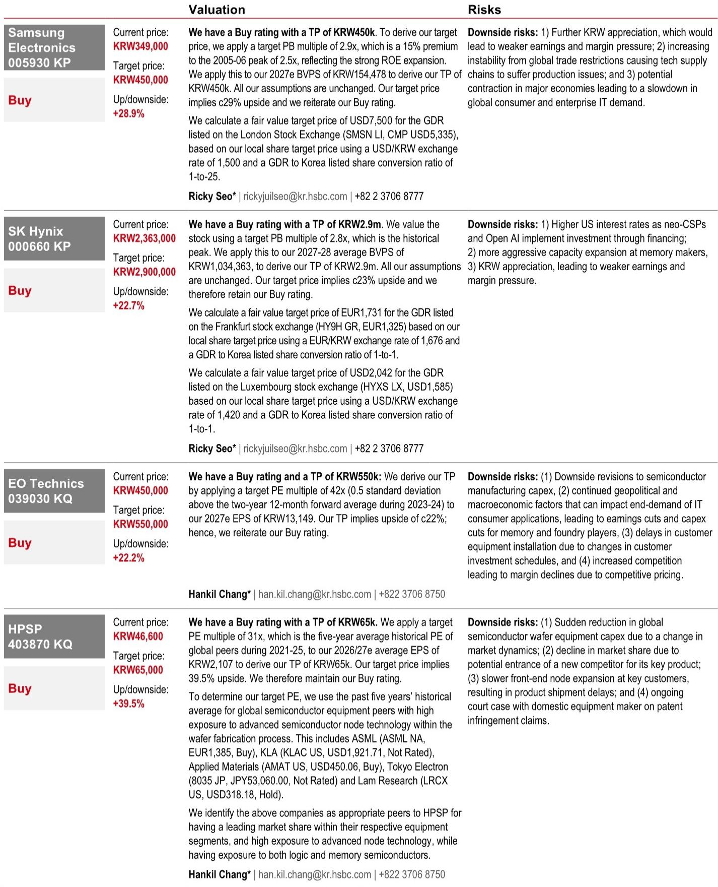
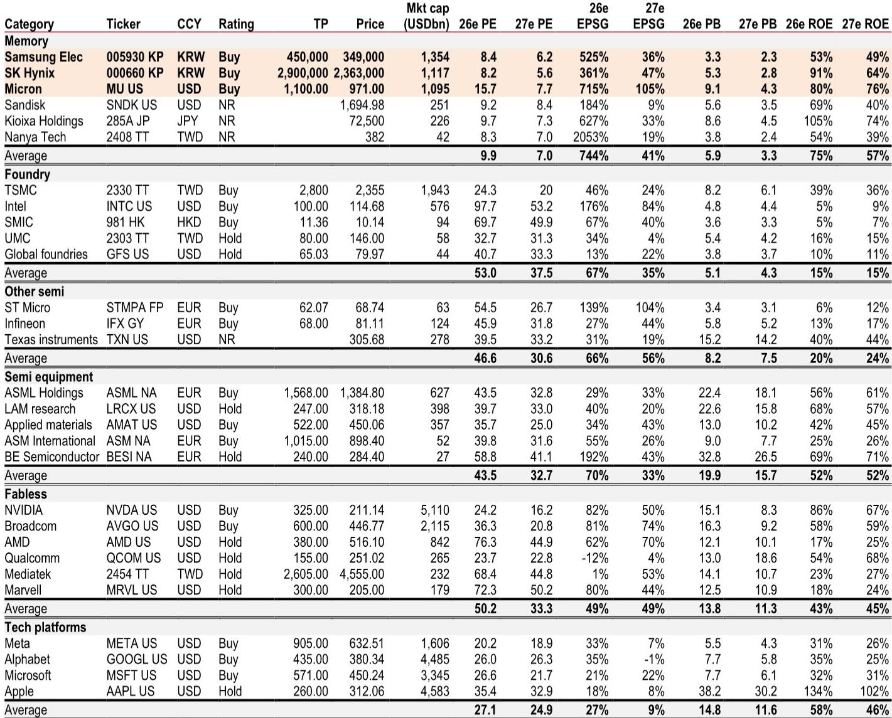
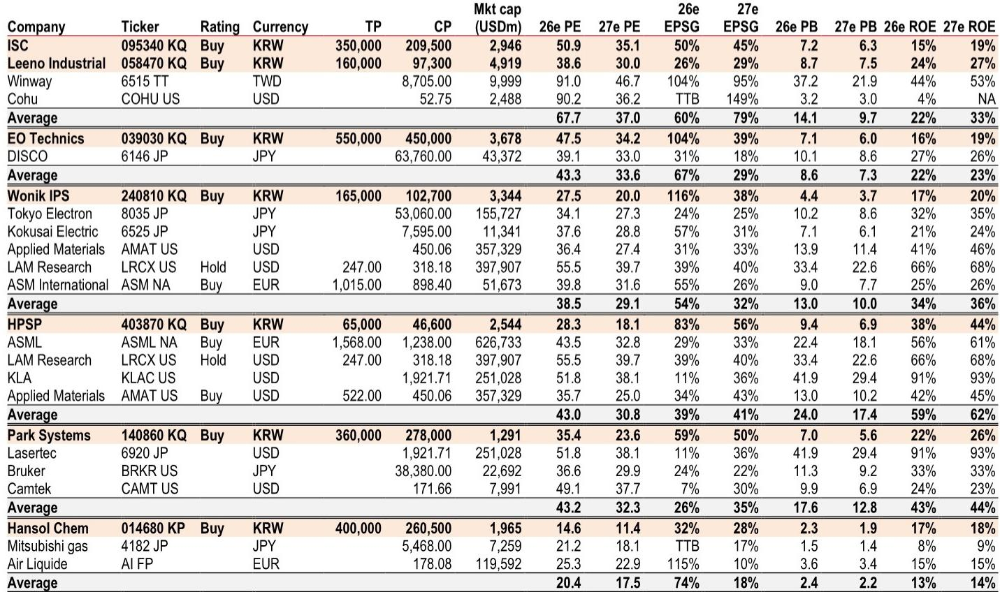

# 韩国科技供应链的真正拐点：从GPU算力竞赛转向Agentic AI的全面落地

市场对AI基础设施的讨论，大多仍停留在“算力需求持续增长”这一层面。但某外资投行最新发布的韩国科技产业链调研报告，揭示了一个更为关键的转折：AI的投资逻辑正在从“训练更大的模型”转向“运行更多的智能体”。这一转变对产业链的影响，远比单纯增加算力投入更为深远。

报告基于2026年5月底对14家韩国科技公司的实地调研，覆盖存储器、半导体设备与材料、技术硬件供应链。这些公司的共同判断是：CSP（云服务提供商）的资本开支正在加速向Agentic AI倾斜，而这一趋势正在重塑整个供应链的定价权、需求结构和利润分配。

真正重要的不是AI需求会不会继续增长，而是增长的结构性变化如何重新定义谁在产业链中拥有议价权。

## 1. 存储器市场的最大变量不是HBM，而是CPU驱动的服务器DRAM重新定价

市场对存储器的关注长期集中在HBM（高带宽存储器）上，但报告揭示了一个被低估的结构性变化：CPU客户正在成为新的需求驱动力。

核心逻辑在于，Agentic AI的部署比单纯的大模型训练更依赖CPU集群。x86和ARM架构的CPU需求强劲增长，直接推高了服务器DRAM和移动DRAM的价格。报告预计，ARM CPU在整体CPU市场的渗透率将从2025年的13%快速攀升至2028年的40%，这意味着服务器DRAM的单机容量将同步增长。

更值得关注的信号是HBM3e的定价走势。报告指出，HBM3e价格将上涨，以缩小与普通DRAM的价差。这听起来反直觉——通常HBM作为高端产品，价格应该远高于普通DRAM。但这里的逻辑是：普通DRAM因CPU需求激增而涨价更快，导致两者价差收窄。这意味着存储器厂商的利润结构正在发生变化，不再完全依赖HBM的溢价。

对于投资者而言，这意味着存储器公司的估值逻辑需要重新审视。如果普通DRAM的利润贡献开始追赶HBM，那么市场对三星电子等综合存储器厂商的估值折价应该收窄。报告明确表示看好三星电子，认为它不仅能在HBM4上缩小技术差距，在普通DRAM上同样有追赶空间。

## 2. 封装基板正在从“被动配套”变为“主动稀缺”，长协与共投成为新常态

FC-BGA（倒装芯片球栅阵列）封装基板是本次调研中另一个被反复提及的亮点。报告用了一个关键表述：高端FC-BGA需求正在超过供给，信号是产能利用率高企、交货周期延长。

这背后有三个结构性驱动力：基板尺寸更大、层数更多；硅电容嵌入技术开始应用；玻璃芯基板正在成为下一代材料。这些变化共同提升了单机价值量，支撑一个多年的增长周期。

但真正值得关注的不是需求增长本身，而是客户行为的转变。报告提到，客户正在主动寻求长期协议（LTA）和共投资（co-investment）来确保产能。这在封装基板行业历史上并不常见——过去这更多是一个买方市场，基板厂商需要争夺订单。现在，供需关系逆转，基板厂商开始拥有定价权。

这一变化对产业链的含义是：封装基板不再只是芯片制造的“配套环节”，而是正在成为一个具有独立议价能力的稀缺资源环节。那些能够率先扩张产能并锁定长协的厂商，将在未来2-3年享受利润率的持续改善。

## 3. 半导体设备与材料：真正的增长动力来自“内容扩张”，而非单纯的产能增加

设备与材料板块的调研结论，指向一个比市场预期更强的增长前景。但驱动因素并非简单的资本开支增长，而是“内容扩张”——即每单位晶圆产出所需的设备与材料价值在增加。

以EO Technics为例，其激光设备正在从传统的PCB钻孔向HBM领域的全切割工艺扩展，同时还在与领先代工厂合作开发去键合（debonder）设备。这意味着同一家设备厂商的每台设备价值量在提升，应用场景在拓宽。

HPSP正在获得新的DRAM客户，预计在2026年三季度实现，同时还在与NAND客户接触。Park Systems的原子力显微镜（AFM）正在混合键合和先进封装检测领域获得认可。Hansol Chemical则在推进前驱体材料，瞄准2026年底铪基高K前驱体专利到期后的市场机会。

这些案例的共同点是：设备与材料厂商的增长，正在从“跟随产能扩张”转向“通过技术迭代获取更高单机价值”。这意味着一部分设备与材料公司，其业绩增长可以独立于存储器出货量的波动。报告明确表示，更看好具有“护城河和定价权”的公司，因为它们的盈利增长更有支撑。

## 4. 报告尚未完全回答的关键问题：Agentic AI的利润分配最终会流向谁？

尽管报告对产业链各环节的景气度判断清晰，但它也留下了一个尚未完全回答的问题：Agentic AI带来的利润增量，最终会更多地流向算力提供商（GPU厂商）、存储器厂商、封装基板厂商，还是设备与材料公司？

报告提供了一些线索。例如，GPU租赁价格在经历了2024年的下降后，在2026年一季度出现反弹。同时，AI服务提供商的毛利率正在改善——Anthropic的毛利率从2025年中的60%提升到了2026年4月的70%。这些数据暗示，下游的AI应用层正在变得越来越有利可图。

但产业链内部的利润分配并不透明。GPU厂商、存储器厂商、封装基板厂商都在宣称自己拥有定价权，但谁能在长期内维持这一地位，取决于技术迭代的速度和竞争格局的变化。报告没有给出明确的答案，这需要投资者持续跟踪每个环节的供需动态和竞争壁垒。

## 5. 一个更值得思考的观察框架：从“算力密度”转向“智能体密度”

综合报告的调研结论，可以提炼出一个更有价值的观察框架：市场正在从关注“算力密度”（每平方毫米的晶体管数量、每瓦的算力输出）转向关注“智能体密度”（每单位基础设施能够支持多少个AI智能体的运行）。

这一转变意味着，投资分析的焦点应该从芯片本身的性能指标，转向整个基础设施的协同效率。具体来说，可以关注三个维度：

第一，内存带宽与CPU之间的匹配效率。Agentic AI的瓶颈往往不在GPU算力，而在内存带宽和数据传输速度。因此，HBM和服务器DRAM的容量与速度升级，比单纯追求GPU算力提升更具实际意义。

第二，封装与互连技术的演进。FC-BGA基板、硅桥接、混合键合等技术的进步，直接决定了多芯片系统的集成效率。这些“看不见的基础设施”正在成为决定系统性能的关键因素。

第三，设备与材料的技术壁垒。当产能扩张不再是稀缺资源时，能够通过技术迭代持续提升单机价值的设备与材料公司，将拥有更持久的竞争优势。

## 6. 顺着这些未解问题继续读完整报告

这份调研报告的价值，不仅在于它提供了14家韩国科技公司的第一手反馈，更在于它揭示了AI投资逻辑正在发生的结构性转变。但报告受限于篇幅和分析框架，还有一些深层次问题没有完全展开：例如，CSP资本开支的持续增长是否可持续？AI服务提供商的盈利改善能否传导到上游？ARM CPU的渗透加速对存储器价格的影响是否被充分定价？

这些问题的答案，可能需要结合更多数据源和交叉验证才能形成判断。如果你对这些未解问题感兴趣，欢迎来星球微信群里继续讨论，我们会定期分享更多产业链调研的原始数据和深度分析。

Personal reading notes and learning share only. Not investment advice.

