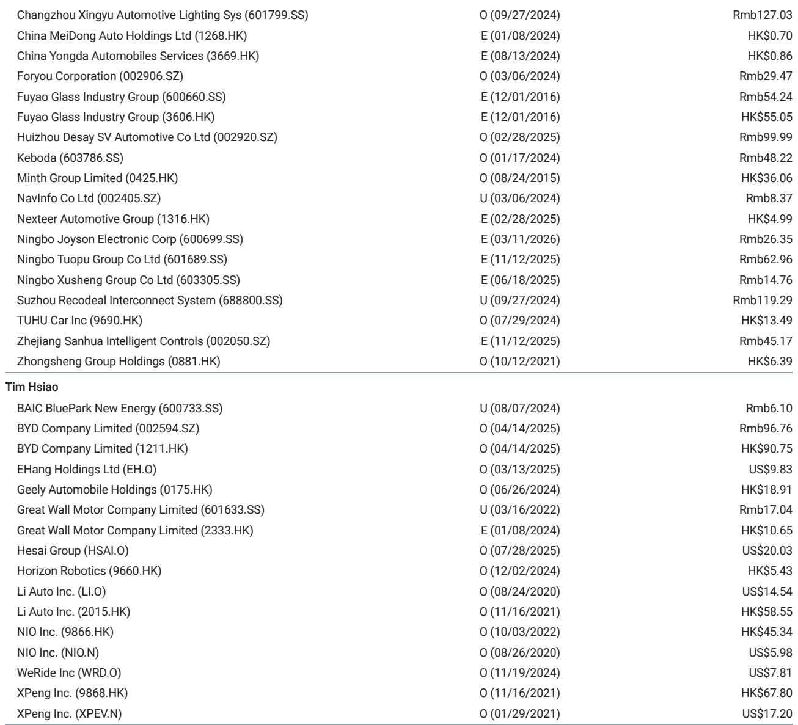
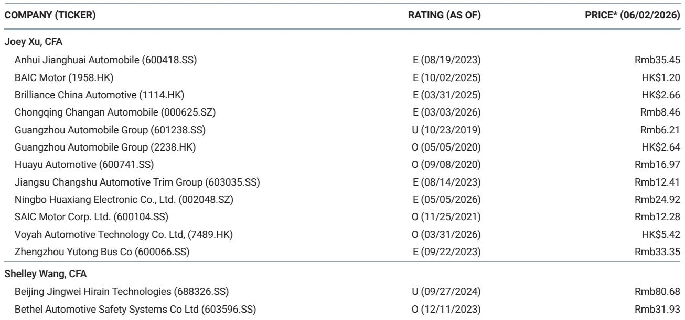
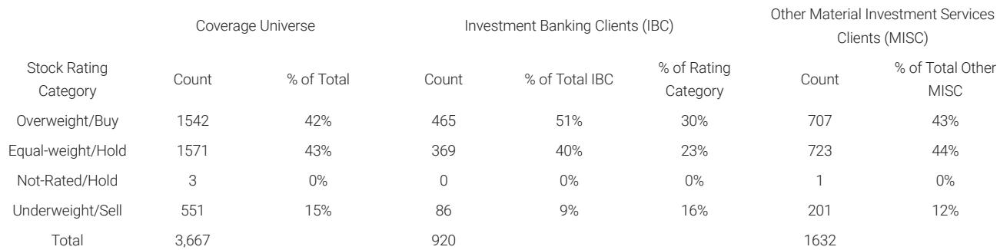

# China’s EV Market Is No Longer a Growth Story—It Is a Product-Cycle Survival Test

The Chinese electric vehicle market has entered a new phase where aggregate demand growth is no longer the primary driver of investor returns. The dominant force shaping competitive outcomes today is the product cycle—specifically, the ability of each manufacturer to launch a model that generates a sudden, massive, and concentrated spike in weekly orders. According to the latest weekly order data from a global investment bank report covering the period ending May 31, the divergence between winners and laggards has become so extreme that it can no longer be explained by brand strength, pricing, or distribution scale. It is being driven almost entirely by the timing and reception of new vehicle launches.

Consider the numbers. NIO recorded weekly orders of approximately 47.5 to 47.7 thousand units, a staggering 392% increase week-over-week and a 705% increase year-over-year. Aito posted 28 to 28.2 thousand units, up 419% week-over-week and 268% year-over-year. In both cases, the catalyst was the same: the pre-order conversion of a single new model—the ES9 for NIO and the M9 for Aito. Meanwhile, established players like BYD, which still commands the highest absolute volume at 76.2 to 76.7 thousand units, saw a much more modest 35% week-over-week gain and an 11% year-over-year decline. Li Auto, long considered a bellwether for the premium segment, managed only 7.8 to 8 thousand units, down 10% week-over-week and 29% year-over-year.

This is not a market where everyone is rising with the tide. It is a market where the tide has become irrelevant. What matters is whether you have a new product that captures the imagination of the consumer at the precise moment of its release. The strategic implication is clear: in China’s EV sector, the ability to sustain momentum between product cycles has become the single most important determinant of long-term value creation.

## The Data Confirms That New Model Launches Are the Only Reliable Demand Catalyst, While Incumbent Lineups Are Stagnating

The weekly order data reveals a pattern that is difficult to dismiss as noise. Across the board, companies that did not have a major new model in the conversion phase during the last week of May experienced flat or declining orders. Geely Galaxy saw orders drop 27% week-over-week and 32% month-over-month, as the initial spike from the Starshine 7 launch normalized. XPeng recorded an 34% weekly decline, with GX orders fading from their launch peak. ZEEKR fell 9% week-over-week and 42% month-over-month. Even Tesla China, which benefits from global brand recognition and a loyal customer base, posted flat weekly orders and a 22% month-over-month decline.

The so-what here is profound. The EV market in China has matured to a point where the installed base of existing models no longer generates organic demand growth. Consumers are not upgrading or switching brands based on incremental improvements. They are waiting for the next big thing. This behavior is rational: with so many competitive options at similar price points, the marginal utility of buying a model that has been on the market for six months is significantly lower than the excitement of reserving a newly unveiled vehicle.

This creates a structural challenge for every manufacturer. The revenue and margin profile of an EV company is becoming increasingly lumpy. Instead of a smooth, predictable growth curve, companies are experiencing sharp peaks followed by valleys. The question for investors is no longer whether a company can grow its market share over a twelve-month period. The question is whether it can manage the transition from one product cycle to the next without losing momentum, and whether it can sustain profitability during the troughs.

## The Divergence Between NIO and Li Auto Reveals a Strategic Fork in the Road for Premium EV Players

Perhaps the most instructive comparison in the data is between NIO and Li Auto. Both companies target the premium segment. Both have strong brand recognition and loyal customer bases. Both have access to capital and manufacturing capacity. Yet their weekly order trajectories could not be more different.

NIO’s 392% weekly surge, driven by the ES9, suggests that the company has successfully executed on a product that resonates with its target demographic. The year-over-year increase of 705% is not just a reflection of the ES9’s appeal; it also indicates that NIO’s broader brand ecosystem—including its battery-swapping network, its service model, and its community engagement—has created a foundation that allows a new model to achieve rapid adoption. In contrast, Li Auto’s 29% year-over-year decline suggests that its existing lineup, while still competitive, is losing its edge. The L8 launch scheduled for late June will be a critical test. If Li Auto can replicate the kind of order surge that NIO and Aito have achieved, it may regain its footing. If not, the company may face a prolonged period of stagnation.

The strategic lesson is that brand equity alone is insufficient. In a market where product cycles dominate, the ability to execute on a new launch—from design and engineering to marketing and supply chain—is what separates winners from also-rans. NIO has demonstrated that it can do this. Li Auto has yet to prove it can sustain the momentum. For investors, the divergence between these two companies is not just a data point. It is a signal that the premium segment is becoming a winner-take-most environment, where the rewards of a successful launch are enormous, but the penalties for a miss are severe.

## The Data Raises Unanswered Questions About the Sustainability of Order Spikes and the Role of Policy Stimulus

While the weekly order data provides a clear snapshot of current demand, it leaves several critical questions unresolved. The most important of these is sustainability. Can NIO maintain its current order run rate after the initial conversion wave of the ES9 subsides? History suggests that most new model spikes are followed by a normalization. The question is whether the plateau will be higher than the pre-launch baseline. For NIO, the 705% year-over-year increase is so large that even a 50% decline from the peak would still leave the company in a strong position. But for Aito, which also posted a 419% weekly surge, the risk of a sharp correction is higher, given that its absolute volumes are smaller and its brand recognition is less established.

Another unresolved question is the role of policy stimulus. The report notes that some investors have speculated about potential additional government incentives to boost EV demand. The report’s authors view this as unlikely, and the data supports that view. If the market were truly dependent on policy support, we would expect to see more uniform demand patterns across players. Instead, we see extreme divergence, which suggests that company-specific factors, not macro policy, are driving outcomes. However, the absence of policy stimulus in the near term could become a headwind for weaker players who lack the product firepower to generate their own demand.

A third open question is the trajectory of BYD. Despite its absolute volume leadership, BYD’s 11% year-over-year decline in weekly orders is concerning. The company has long been the dominant player in China’s EV market, but its growth is increasingly coming from overseas markets and from new model launches. If BYD’s domestic order book continues to soften, the company may need to accelerate its international expansion or risk losing its position as the market leader. The data does not provide a clear answer on whether BYD’s current slowdown is cyclical or structural, but it is a question that every investor in the sector should be monitoring.

## A Decision Framework for Investors: How to Evaluate EV Companies in a Product-Cycle-Driven Market

Given the dominance of product cycles, investors need a new framework for evaluating EV companies. Traditional metrics like market share, revenue growth, and gross margin are still relevant, but they must be supplemented with indicators that capture the dynamics of product launches and order conversion.

First, measure the order spike magnitude relative to the company’s baseline. A 400% weekly increase is impressive, but it means little if the baseline is negligible. Investors should calculate the ratio of the launch week orders to the average weekly orders over the preceding three months. This ratio provides a normalized view of the launch’s impact. For NIO, the ratio is extreme. For XPeng, the ratio is positive but much smaller, suggesting that the GX launch has not yet achieved the same level of resonance.

Second, track the decay rate. After the initial spike, how quickly do orders decline? A slow decay suggests that the model has staying power and is attracting repeat buyers and word-of-mouth referrals. A rapid decay suggests that the launch was a one-time event driven by early adopters and hype. Investors should look for companies that can sustain orders at 50% or more of the peak level for at least four to six weeks.

Third, evaluate the pipeline. A company that has a strong current launch but no visible next model on the horizon is a one-hit wonder. Investors should assess the product roadmap for the next twelve to eighteen months. Companies like BYD and NIO, which have multiple models in development, are better positioned to manage the transition between cycles than companies that rely on a single hit.

Fourth, assess the overseas buffer. The report highlights that some of the demand recovery in May was supported by overseas exposure. Companies that have diversified their revenue streams across multiple geographies are less vulnerable to the domestic product cycle risk. BYD and NIO are both expanding internationally, but the pace and scale of their overseas operations vary significantly. Investors should factor this into their valuation models.

Finally, monitor the competitive response. When one company launches a successful model, competitors often respond with price cuts or accelerated launches. This can compress margins across the industry. Investors should be alert to signs of a price war in the segments where new models are generating the most buzz.

## The Full Report Contains Granular Data and Original Charts That Are Essential for Understanding the Nuances of This Divergence

The weekly order data presented here is just the tip of the iceberg. The original report from which this analysis is drawn contains detailed channel feedback, historical comparisons, and charts that visualize the order trends across multiple time horizons. These materials are essential for any investor who wants to move beyond headlines and build a data-driven understanding of China’s EV market.

The report also includes specific commentary on the outlook for each major player, including the expected impact of upcoming launches like Li Auto’s L8. It provides a framework for estimating second-quarter results, which the report suggests are likely to beat guidance for some companies. And it offers a candid assessment of the policy environment, including the view that additional stimulus is unlikely.

For serious investors, reading the full report is not optional. It is the only way to access the level of detail needed to make informed decisions in a market that is increasingly driven by product-cycle dynamics rather than macro trends. Join the community to read the full report and review the original charts.

*This article is for learning and discussion only and does not constitute investment advice.*

Personal reading notes and learning share only. Not investment advice.

