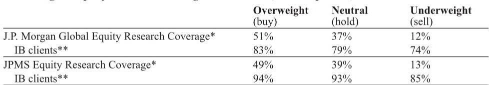

# The Next Material Bottleneck in AI Infrastructure Is Not a Chip—It’s a Polymer

The semiconductor materials supply chain is quietly becoming the most consequential battleground for AI infrastructure scaling, and the market is only beginning to price in the implications. A recent business briefing from AGC, a Japanese materials conglomerate with deep exposure to both electronics and performance chemicals, reveals a company that is targeting a doubling of semiconductor-related revenue every five years—from roughly ¥100 billion in fiscal 2025 to ¥200 billion by fiscal 2030. That target alone is noteworthy. What makes it strategically urgent, however, is the underlying shift in what AI hardware actually demands. The conventional narrative focuses on wafer fabrication equipment, advanced packaging, and high-bandwidth memory. But the briefing points to a less visible, equally critical layer: the specialized materials that enable extreme electrical performance, thermal stability, and process compatibility at the sub-nanometer scale. The most telling signal came not from the revenue targets but from a single market reaction: when speculation emerged that PTFE, a fluoropolymer, could replace low-dielectric glass in next-generation backplane substrates, shares of AGC rose 9% in a single day, while shares of low-dielectric glass specialists fell by roughly 10% each. That divergence is not noise. It is a compressed expression of a structural debate about which materials will define the AI data center of 2030.

The timing of this debate matters because the industry is approaching a decision point. The Rubin Ultra architecture, expected to be the next major platform for accelerated computing, requires a backplane material that can handle signal integrity at speeds that push beyond the limits of current-generation laminates. The conventional progression from M7 to M8 to M9 specifications is no longer sufficient. The market is now actively testing M10-grade materials, and PTFE-based solutions are emerging as a credible alternative to the incumbent low-dielectric glass. AGC, which holds significant positions in both PTFE and low-dielectric glass through its Nippon Electric Glass affiliate, is uniquely positioned to benefit regardless of which path wins. But the fact that the market is even debating this substitution indicates that the material science behind AI hardware is entering a phase of discontinuous change. The report from a global investment bank that analyzed this briefing makes clear that the final decision on backplane materials may not come until August, when ongoing testing is expected to conclude. Until then, the market will be pricing in scenarios that have very different implications for the competitive landscape in specialty materials.

## AGC’s Semiconductor Revenue Trajectory Implies That Materials Are Becoming a Higher-Share, Higher-Barrier Segment of the AI Value Chain

The headline number from the briefing is straightforward: AGC aims to grow semiconductor-related revenue from ¥100 billion in fiscal 2025 to ¥200 billion by fiscal 2030, representing a compound annual growth rate of approximately 15%. But the strategic significance lies in the composition of that growth. Roughly 65% of current revenue comes from the Electronics segment, which includes EUV mask blanks, copper-clad laminates, CMP slurry, and lens materials for lithography tools. The remaining 35% comes from Performance Chemicals, which includes high-barrier fluorinated products such as FFKM, ETFE, CYTOP, and PTFE. Management expects both segments to double over the next five years. That is not a trivial assumption, because it implies that the materials intensity of semiconductor manufacturing is increasing faster than the unit growth of chips themselves. The implication is that as AI architectures become more complex, the materials required to build them become a larger fraction of total cost and a more binding constraint on performance.

The report highlights that within Electronics, EUV mask blanks are the largest revenue contributor, and AGC already expects to update its record-high sales level of over ¥40 billion in fiscal 2024 as early as fiscal 2026. That recovery is driven by both a rebound at key customers and an expansion of the customer base. But the more interesting growth vector is in copper-clad laminates, where AGC has developed a new product line called the ELL Series. By combining glass cloth with a proprietary resin developed in-house, the company can deliver comparable electrical performance using glass cloth that is one grade lower than what competitors typically require. This is a classic example of materials substitution that creates a cost advantage without sacrificing performance. The company is currently targeting adoption in 224G applications, primarily for switches and routers, and plans to address areas that would normally require quartz glass by pairing its materials with lower-grade NER glass. If successful, this strategy could expand the addressable market for AGC’s laminates well beyond the current applications.

## The Materials Debate Between PTFE and Low-Dielectric Glass Is Not a Binary Choice—It Reflects a Deeper Structural Tension in Backplane Architecture

The most dramatic market reaction to the briefing was triggered by a relatively simple question: could PTFE replace low-dielectric glass in the backplane of the Rubin Ultra architecture? The answer, based on the report’s analysis, is more nuanced than a simple yes or no. The report states that the likelihood of adopting M9-grade materials has diminished, and testing efforts have accelerated toward M10. M10 offers electrical characteristics similar to PTFE while demonstrating better compatibility with board manufacturers. This is a critical distinction. The choice is not just about electrical performance; it is about manufacturability, supply chain readiness, and the ability to integrate with existing fabrication processes. PTFE has excellent dielectric properties, but it is notoriously difficult to process. Low-dielectric glass, particularly the materials produced by Nippon Electric Glass and Nittobo, has been the incumbent solution because it offers a balance of performance and processability that the industry has optimized for over multiple generations.

The report notes that AGC acknowledged strong interest in fluorinated materials for backplane applications and stated that it is currently making progress on development efforts. This suggests that the company is hedging its bets. AGC has exposure to both PTFE and low-dielectric glass through its corporate structure, so the outcome of the testing process is likely to benefit the company either way. But for investors focused on pure-play materials suppliers, the divergence in stock prices on the day of the briefing was a clear signal that the market is treating this as a winner-take-most dynamic. The report does not provide a definitive answer on which material will prevail, and it explicitly states that a final decision may not come until August. That uncertainty creates a window for analysis but also for mispricing. The key insight is that the backplane material decision is not a one-time event. It will set a precedent for subsequent architectures. If PTFE gains adoption in the Rubin Ultra, it will likely cascade into future designs. If low-dielectric glass holds, the incumbents will have reinforced their position for another cycle.

## The Performance Chemicals Segment Reveals a Recurring Revenue Model That the Market May Be Underappreciating

One of the most strategically important aspects of the briefing is the detail on AGC’s Performance Chemicals segment, particularly the fluorinated product portfolio. The report highlights FFKM, a resin used for sealing in CVD and etch tools, as a consumable that is typically replaced quarterly. This is a recurring revenue stream tied directly to equipment utilization rates. As deposition and etch intensity rises with increasing layer counts in advanced chips, the demand for deposition and etch tools is expected to grow faster than the broader wafer fabrication equipment market, which is projected to grow approximately 20% year-over-year or more in 2026 and 2027. That means AGC’s consumable materials business will benefit from both the installation of new tools and the ongoing operation of existing tools. The report does not disclose the exact revenue contribution of FFKM within the segment, but it likely accounts for a significant share. This is important because it means that AGC’s semiconductor exposure is not purely cyclical. The consumable portion provides a base level of demand that is less sensitive to capital expenditure cycles.

Beyond FFKM, the portfolio includes ETFE, for which AGC holds the number one global market share, and CYTOP, which is used as a pellicle raw material for ArF and KrF lithography. The company also produces PTFE, which is the material at the center of the backplane debate. The report states that AGC aims to further expand sales of process materials going forward, including ETFE and pellicle-related materials. The strategic implication is that the Performance Chemicals segment is becoming a more important driver of overall semiconductor revenue growth. The report estimates that roughly 35% of current semiconductor-related revenue comes from this segment, and management expects it to double by 2030. If that target is achieved, it would imply that Performance Chemicals contributes approximately ¥70 billion in revenue by 2030, up from roughly ¥35 billion today. Given the high barriers to entry in fluorinated materials, the profit contribution from this segment could be disproportionately high.

## What the Report Does Not Fully Answer: The Timing and Magnitude of Upside from Backend-Process Materials

The report identifies several potential upside drivers that could push AGC’s revenue growth beyond the “doubling every five years” target, but it does not provide sufficient detail to assess their probability or timing. Specifically, the report mentions that if backend-process materials such as glass core substrates, optoelectronic co-packaging, and glass interposers ramp earlier than expected, this could provide upside to the revenue plan. These are all emerging applications that address the growing bottleneck in data movement between chips and within packages. Glass-based substrates and interposers offer superior electrical performance and thermal stability compared to organic alternatives, and they are increasingly seen as necessary for the next generation of high-performance computing and AI accelerators.

However, the report does not quantify the potential revenue contribution from these applications, nor does it provide a timeline for commercialization. The briefing itself appears to have been light on details regarding these emerging opportunities, which suggests that AGC is still in the early stages of development or that the company is not yet ready to disclose specific targets. This is a meaningful gap for investors trying to model the company’s long-term growth trajectory. The base case of doubling revenue by 2030 may already be priced in to some extent. The upside case, driven by backend-process materials, could be substantial but remains highly uncertain. The report does not attempt to resolve this uncertainty, which is appropriate given the early stage of these technologies. But it does create a clear analytical question: which of these emerging applications is most likely to commercialize within the next three to five years, and what would that mean for AGC’s revenue mix and profitability?

## A Decision Framework for Investors Evaluating Materials Exposure in the AI Supply Chain

For investors trying to navigate the semiconductor materials landscape, the AGC briefing provides a useful framework for thinking about risk and opportunity. The first dimension is material type. The industry is moving toward materials that can handle higher frequencies, lower dielectric loss, and greater thermal stability. This favors fluoropolymers, high-purity glass, and advanced resin systems. The second dimension is revenue model. Companies with consumable or recurring revenue streams, such as FFKM seals or pellicle materials, offer more stability and visibility than those dependent on one-time equipment sales or capital expenditure cycles. The third dimension is competitive position. AGC’s strength lies in its ability to serve multiple material categories and to develop proprietary formulations that create barriers to entry. The ELL Series in copper-clad laminates is a good example: by combining in-house resin development with a lower-grade glass cloth, the company achieves performance parity while maintaining a cost advantage.

The fourth dimension is optionality. AGC’s exposure to both PTFE and low-dielectric glass means that the company benefits regardless of which material wins the backplane debate. This is a structural advantage that pure-play suppliers do not have. The report suggests that the market is beginning to recognize this, but the full implications may not be priced in until the August testing results are released. Investors should monitor not only the outcome of that testing but also the broader trend toward material substitution in AI infrastructure. The Rubin Ultra backplane decision is a single data point, but it is indicative of a larger pattern: as chip architectures become more demanding, the materials that enable them become more specialized, more proprietary, and more valuable. The companies that control those materials will capture an increasing share of the value created by AI infrastructure investment.

Join the community to read the full report and review the original charts.

*This article is for learning and discussion only and does not constitute investment advice.*

Personal reading notes and learning share only. Not investment advice.

