# Investor Presentation | Asia Pacific

# Asia Summer School: China Software and IT Services

MS ASIA LIMITED+

Yang Liu

Equity Analyst

Yang.Liu@morganstanley.com +852 2239-1911

Lydia Lin

Equity Analyst

Lydia.Lin@morganstanley.com +852 2239-1572

text_image

Asia Summer School 2026

text_image

India Investment Forum 2026

GREATER CHINA IT SERVICES AND SOFTWARE

Asia Pacific

Industry View

In-Line

MS does and seeks to do business with companies covered in MS. As a result, investors should be aware that the firm may have a conflict of interest that could affect the objectivity of MS. Investors should consider MS as only a single factor in making their investment decision.

For analyst certification and other important disclosures, refer to the Disclosure Section, located at the end of this report.

+= Analysts employed by non-U.S. affiliates are not registered with FINRA, may not be associated persons of the member and may not be subject to FINRA restrictions on communications with a subject company, public appearances and trading securities held by a research analyst account.

# Asia Summer School

# Enterprise Software Overview

# Industry Drivers

# Supply

- New technology: cloud -> AI   
- Delivery   
- Any software must run on some hardware

natural_image

Two gray arrows pointing in opposite directions (no text or symbols)

# Demand

• Nominal GDP growth with late-cycle effect   
• Efficiency improvement to hedge rising labor costs   
- Government's requirement on digitization and IT localization   
- Industry cycle: hardware/infra vs. software/IT services

# Industry Growth: Reported Numbers

Industry revenue (qtly growth)   
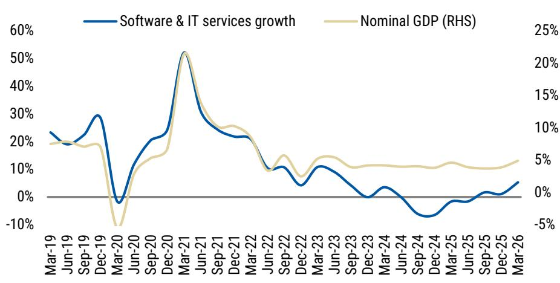

line

| Date    | Software & IT services growth | Nominal GDP (RHS) |
|---------|-------------------------------|-------------------|
| Mar-19  | ~20%                          | ~8%               |
| Jun-19  | ~25%                          | ~7%               |
| Sep-19  | ~30%                          | ~6%               |
| Dec-19  | ~0%                           | ~-5%              |
| Mar-20  | ~-5%                          | ~-10%             |
| Jun-20  | ~10%                          | ~5%               |
| Sep-20  | ~20%                          | ~10%              |
| Dec-20  | ~25%                          | ~15%              |
| Mar-21  | ~50%                          | ~25%              |
| Jun-21  | ~30%                          | ~20%              |
| Sep-21  | ~25%                          | ~15%              |
| Dec-21  | ~20%                          | ~10%              |
| Mar-22  | ~15%                          | ~5%               |
| Jun-22  | ~10%                          | ~0%               |
| Sep-22  | ~5%                           | ~5%               |
| Dec-22  | ~0%                           | ~10%              |
| Mar-23  | ~5%                           | ~15%              |
| Jun-23  | ~0%                           | ~10%              |
| Sep-23  | ~0%                           | ~10%              |
| Dec-23  | ~0%                           | ~10%              |
| Mar-24  | ~5%                           | ~10%              |
| Jun-24  | ~0%                           | ~10%              |
| Sep-24  | ~-5%                          | ~10%              |
| Dec-24  | ~0%                           | ~10%              |
| Mar-25  | ~0%                           | ~10%              |
| Jun-25  | ~0%                           | ~10%              |
| Sep-25  | ~0%                           | ~10%              |
| Dec-25  | ~0%                           | ~10%              |
| Mar-26  | ~5%                           | ~10%              |

MIIT industry revenue vs nominal GDP growth   
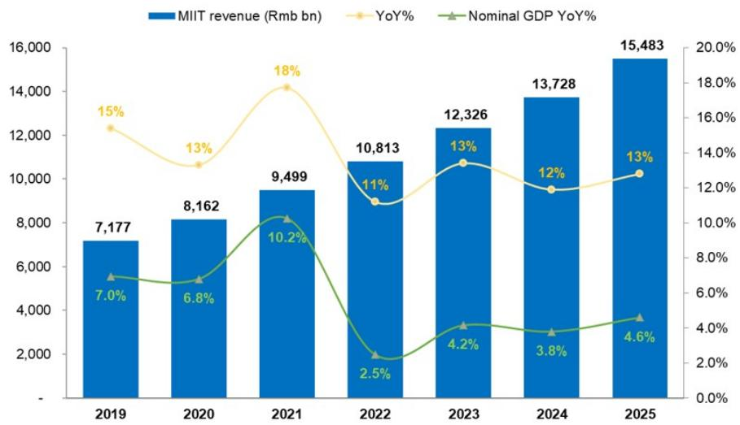  
Source: CEIC, MIIT, MS.

# Industry Growth: China CIO Survey Results

2026 external IT spending growth expectations by sector   
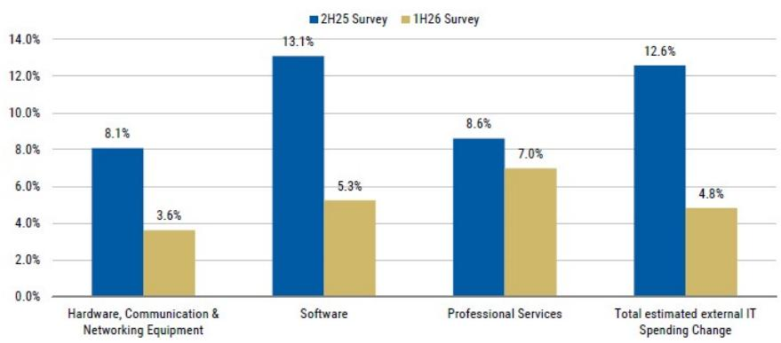

bar

| Category | 2H25 Survey (%) | 1H26 Survey (%) |
|---|---|---|
| Hardware, Communication & Networking Equipment | 8.1 | 3.6 |
| Software | 13.1 | 5.3 |
| Professional Services | 8.6 | 7.0 |
| Total estimated external IT Spending Change | 12.6 | 4.8 |

Expectations of potential IT budget revisions this year   
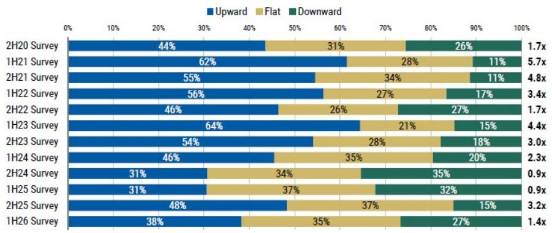

bar_stacked

| Survey | Upward (%) | Flat (%) | Downward (%) |
| :--- | :--- | :--- | :--- |
| 2H20 Survey | 44 | 31 | 26 |
| 1H21 Survey | 62 | 28 | 11 |
| 2H21 Survey | 55 | 34 | 11 |
| 1H22 Survey | 56 | 27 | 17 |
| 2H22 Survey | 46 | 26 | 27 |
| 1H23 Survey | 64 | 21 | 15 |
| 2H23 Survey | 54 | 28 | 18 |
| 1H24 Survey | 46 | 35 | 20 |
| 2H24 Survey | 31 | 34 | 35 |
| 1H25 Survey | 31 | 37 | 32 |
| 2H25 Survey | 48 | 37 | 15 |
| 1H26 Survey | 38 | 35 | 27 |
1H27 Survey (x) = 1.7x; 1H28 Survey (x) = 5.7x; 1H29 Survey (x) = 4.8x; 1H30 Survey (x) = 3.4x; 1H31 Survey (x) = 1.7x; 1H32 Survey (x) = 4.4x; 1H33 Survey (x) = 3.0x; 1H34 Survey (x) = 2.3x; 1H35 Survey (x) = 0.9x; 1H36 Survey (x) = 0.9x; 1H37 Survey (x) = 3.2x; 1H38 Survey (x) = 1.4x.

Overall external IT spending growth expectations   
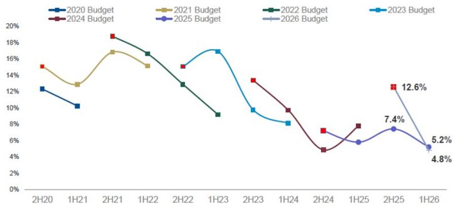

line

| Period | 2020 Budget (%) | 2021 Budget (%) | 2022 Budget (%) | 2023 Budget (%) | 2024 Budget (%) | 2025 Budget (%) | 2026 Budget (%) |
|---|---|---|---|---|---|---|---|
| 2H20 | 12.3 | 15.1 | - | - | - | - | - |
| 1H21 | 10.3 | 12.9 | - | - | - | - | - |
| 2H21 | - | 16.8 | 18.7 | - | 18.8 | - | - |
| 1H22 | - | 15.3 | 16.5 | - | - | - | - |
| 2H22 | - | - | 13.0 | - | 15.1 | - | - |
| 1H23 | - | - | 9.3 | 17.0 | - | - | - |
| 2H23 | - | - | - | 9.9 | 13.5 | - | - |
| 1H24 | - | - | - | 8.1 | 9.9 | - | - |
| 2H24 | - | - | - | - | 4.8 | 7.3 | - |
| 1H25 | - | - | - | - | 7.9 | 5.9 | - |
| 2H25 | - | - | - | - | 12.6 | 7.4 | 12.6 |
| 1H26 | - | - | - | - | 5.2 | 4.8 | 5.2 |

IT spending as a % of total revenue in the next 3 years   
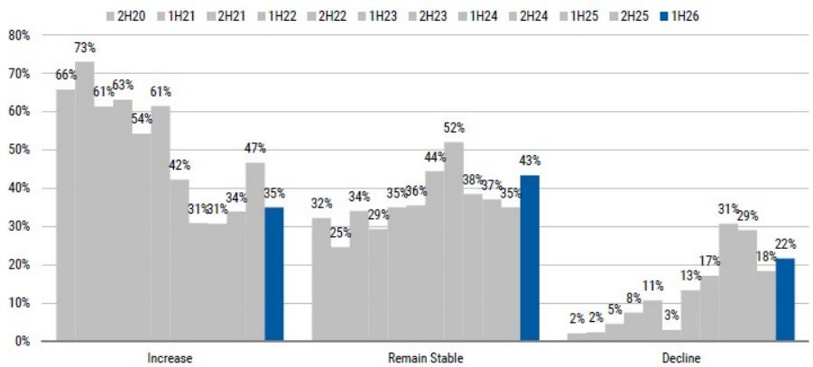  
Source: AlphaWise, MS.

# Global Comparison

US vs. China enterprise IT spending comparison   
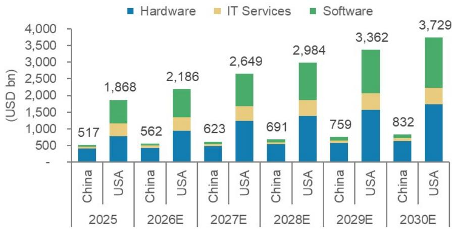

bar_stacked

| Year | Country | Hardware (USD bn) | IT Services (USD bn) | Software (USD bn) |
| :--- | :--- | :--- | :--- | :--- |
| 2025 | China | 471 | 17 | 0 |
| 2025 | USA | 768 | 39 | 668 |
| 2026E | China | 452 | 15 | 0 |
| 2026E | USA | 954 | 39 | 786 |
| 2027E | China | 482 | 15 | 0 |
| 2027E | USA | 1184 | 39 | 849 |
| 2028E | China | 561 | 15 | 0 |
| 2028E | USA | 1364 | 39 | 984 |
| 2029E | China | 579 | 15 | 0 |
| 2029E | USA | 1564 | 39 | 1062 |
| 2030E | China | 632 | 15 | 0 |
| 2030E | USA | 1694 | 39 | 1179 |
The chart displays a stacked bar chart with three categories: Hardware, IT Services, and Software. The values in parentheses are explicitly labeled on each segment.

Software & IT spending market share: China at 4.9%

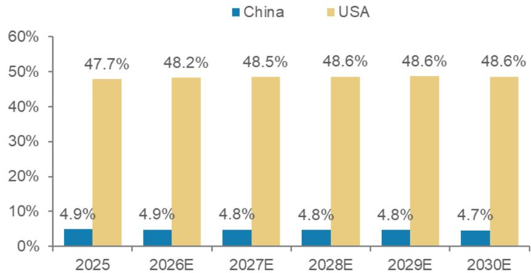

bar

| Year | China (%) | USA (%) |
| :--- | :--- | :--- |
| 2025 | 4.9 | 47.7 |
| 2026E | 4.9 | 48.2 |
| 2027E | 4.8 | 48.5 |
| 2028E | 4.8 | 48.6 |
| 2029E | 4.8 | 48.6 |
| 2030E | 4.7 | 48.6 |

Source: IDC, FactSet, MS. E = IDC estimates.

Software & IT services as a % of total IT spending   
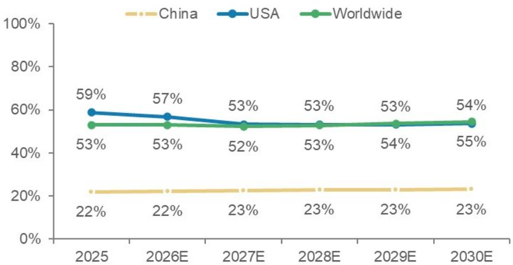

line

| Year | China (%) | USA (%) | Worldwide (%) |
|---|---|---|---|
| 2025 | 22 | 59 | 53 |
| 2026E | 22 | 57 | 53 |
| 2027E | 23 | 53 | 52 |
| 2028E | 23 | 53 | 53 |
| 2029E | 23 | 53 | 54 |
| 2030E | 23 | 54 | 55 |

Software & IT services spending as % of 2025 nominal GDP

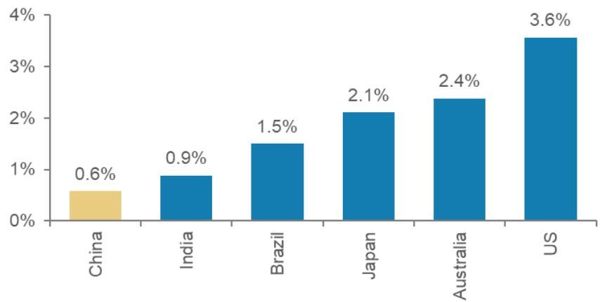

bar

| Country | Value (%) |
| :--- | :--- |
| China | 0.6 |
| India | 0.9 |
| Brazil | 1.5 |
| Japan | 2.1 |
| Australia | 2.4 |
| US | 3.6 |

Software Segments by Product   
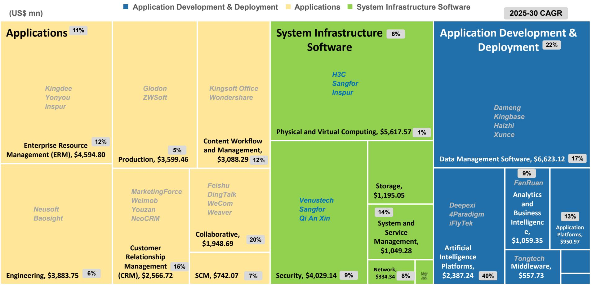

treemap

| Category | Sub-category | Value ($) | CAGR (%) |
| :--- | :--- | :--- | :--- |
| Applications | Application Development & Deployment | 2025-30 | 11 |
| Kingdee Yonyou Inspur | Applications | 4,594.80 | 12 |
| Enterprise Resource Management (ERM), Engineering, Neusoft Baosight | Applications | 3,883.75 | 6 |
| Glodon ZWSoft | Applications | 3,599.46 | 5 |
| Production | Applications | 3,088.29 | 12 |
| MarketingForce Weimob Youzan NeoCRM | Applications | 2,566.72 | 15 |
| Customer Relationship Management (CRM), Engineering, CeMoR | Applications | 2,566.72 | 15 |
| Kingsoft Office Wondershare | Applications | 3,088.29 | 12 |
| Feishu DingTalk WeCom Weaver | Applications | 1,948.69 | 20 |
| Collaborative, SCM, Security | Applications | 742.07 | 7 |
| System Workflow and Management, Venustech Sangfor Qi An Xin | System Infrastructure Software | 5,617.57 | 6 |
| H3C Sangfor Inspur | Physical and Virtual Computing | 5,617.57 | 1 |
| Storage, Network, Security, Network, Deepexi iFlyTek | System Infrastructure Software | 1,195.05 | 9 |
| System and Service Management, System and Services Management, Network, Nanjing Tech, Data Management Software, Artificial Intelligence Platforms, Tongtech Middleware, FanRuan Analytics and Business Intelligence e, Application Platforms, Data Management Software, Data Management Software, Data Management Software, Data Management Software, Data Management Software, Data Management Software, Data Management Software, Data Management Software, Data Management Software, Data Management Software, Data Management Software, Data Management Software, Data Management Software, Data Management Software, Data Management Software, Data Management Software, Data Management Software, Data Management Software, Data Management Software, Data Management Software, Data Management Software, Data Management Software, Data Management Software, Data Management Software, Data Management Software, Data Management software, Data Management software, Data Management software, Data Management software, Data Management software, Data Management software, Data Management software, Data Management software, Data Management software, Data Management software, Data Management software, Data Management software, Data Management software, Data Management software, Data Management software, Data Management software, Data Management software, Data Management software, Data Management software, Data Management software, Data Management software, Data Management software, Data Management software, Data Management software, Data Management software, Data ManagementSoftware, Data Management software, Data Management software, Data Management software, Data Management software, Data Management software, Data Management software, Data Management software, Data Management software, Data Management software, Data Management software, Data Management software, Data Management software, Data Management software, Data Management software, Data Management software, Data Management software, Data Management software, Data Management software, Data Management software, Data Management software, Data Management software, Data Management software, Data Management software, Data Management software, Data Management Software, Data Management Software, Data Management Software, Data Management Software, Data Management Software, Data Management Software, Data Management Software, Data Management Software, Data Management Software, Data Management Software, Data Management Software, Data Management Software, Data Management Software, Data Management Software, Data Management Software, Data Management Software, Data Management Software, Data Management Software, Data Management Software, Data Management Software, Data Management Software, Data Management Software, Data Management Software, Data Management Software, Data ManagementSoftware,

Source: IDC, MS. E = IDC estimates.

# Growth Outlook

IDC estimates software market to rise at a 13.9% four-year CAGR to 2028   
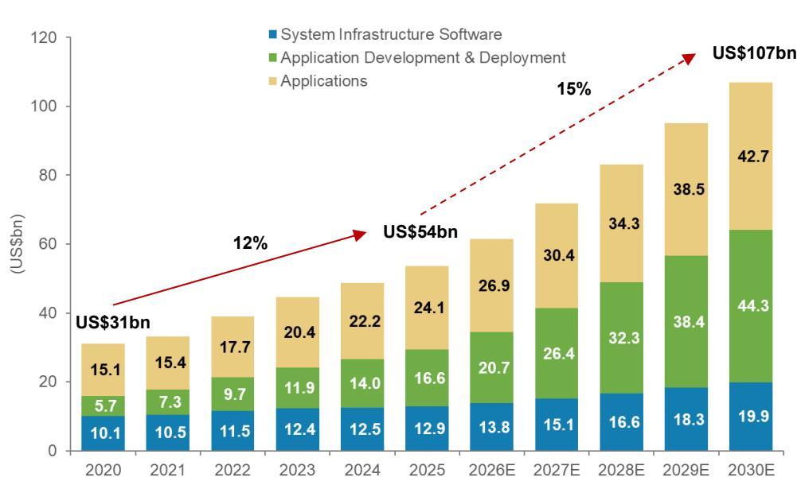

bar_stacked

| Year | System Infrastructure Software (US$bn) | Application Development & Deployment (US$bn) | Applications (US$bn) |
| :--- | :--- | :--- | :--- |
| 2020 | 10.1 | 5.7 | 15.1 |
| 2021 | 10.5 | 7.3 | 15.4 |
| 2022 | 11.5 | 9.7 | 17.7 |
| 2023 | 12.4 | 11.9 | 20.4 |
| 2024 | 12.5 | 14.0 | 22.2 |
| 2025 | 12.9 | 16.6 | 24.1 |
| 2026E | 13.8 | 20.7 | 26.9 |
| 2027E | 15.1 | 26.4 | 30.4 |
| 2028E | 16.6 | 32.3 | 34.3 |
| 2029E | 18.3 | 38.4 | 38.5 |
| 2030E | 19.9 | 44.3 | 42.7 |
The chart includes a red dashed line indicating growth from US$31bn in 2020 to US$107bn in 2030E, with an annotation showing a 12% growth rate between the two years.

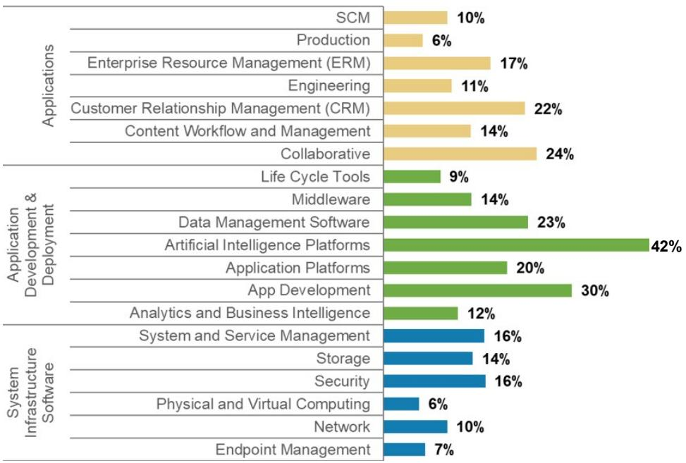

bar

| Category | Application Development & Deployment (%) | System Infrastructure Software (%) |
| :--- | :--- | :--- |
| Applications | SCM | 10 |
| Applications | Production | 6 |
| Applications | Enterprise Resource Management (ERM) | 17 |
| Applications | Engineering | 11 |
| Applications | Customer Relationship Management (CRM) | 22 |
| Applications | Content Workflow and Management | 14 |
| Applications | Collaborative | 24 |
| Application Development & Deployment | Life Cycle Tools | 9 |
| Application Development & Deployment | Middleware | 14 |
| Application Development & Deployment | Data Management Software | 23 |
| Application Development & Deployment | Artificial Intelligence Platforms | 42 |
| Application Development & Deployment | Application Platforms | 20 |
| Application Development & Deployment | App Development | 30 |
| Application Development & Deployment | Analytics and Business Intelligence | 12 |
| System Infrastructure Software | System and Service Management | 16 |
| System Infrastructure Software | Storage | 14 |
| System Infrastructure Software | Security | 16 |
| System Infrastructure Software | Physical and Virtual Computing | 6 |
| System Infrastructure Software | Network | 10 |
| System Infrastructure Software | Endpoint Management | 7 |

Source: IDC, MS. E = IDC estimates.

# AI Cloud Infra

# AI: The 5-layer Cake

# THE AI 5-LAYER CAKE THEORY

# BUILDING THE AI STACK FROM THE GROUND UP

AI is built in layers. Each layer depends on the one below it. Together, they form the full AI stack that powers every AI application we use today.

THE IDEA   

Like a cake, every layer has a purpose. Remove one, and the whole thing can't stand.

# WHY IT MATTERS

Each layer represents a massive opportunity.

The layers work together to deliver end-to-end AI.

The higher the layer, the closer you are to end-user value.

# THE TAKEAWAY

A strong foundation powers everything above it.

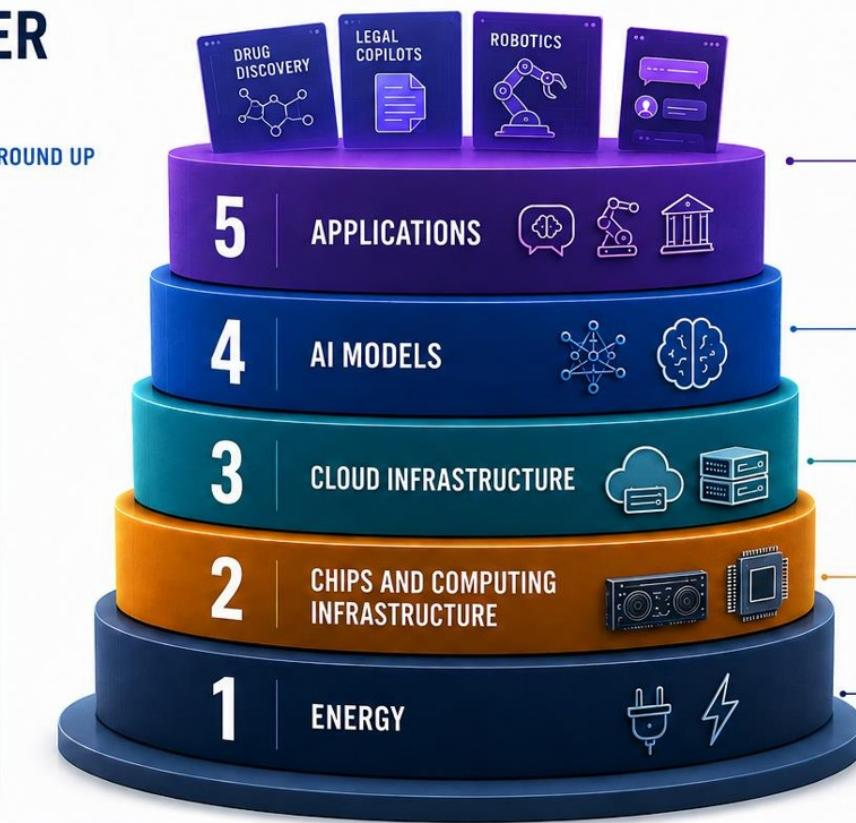

flowchart

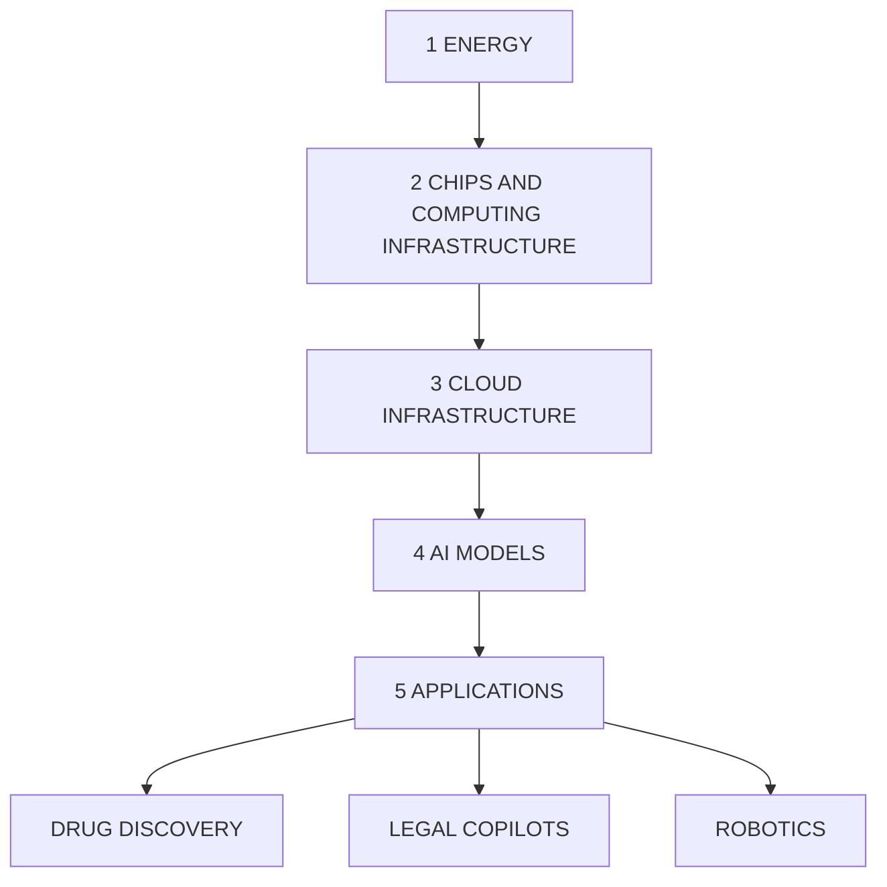
```mermaid
graph TD
    A["1 ENERGY"] --> B["2 CHIPS AND COMPUTING INFRASTRUCTURE"]
    B --> C["3 CLOUD INFRASTRUCTURE"]
    C --> D["4 AI MODELS"]
    D --> E["5 APPLICATIONS"]
    E --> F["DRUG DISCOVERY"]
    E --> G["LEGAL COPILOTS"]
    E --> H["ROBOTICS"]
```

Each layer is a multi-billion dollar opportunity.

All layers are interdependent and critical.

The highest layers deliver the closest value to users.

# MS

# 5 APPLICATIONS

The top layer where actual economic value and real-world solutions (such as drug discovery, legal copilots, and robotics) are delivered to end users.

# 4 AI MODELS

The foundation models (like LLMs) that sit on top of the infrastructure. This is where most people think "AI" lives.

# 3 CLOUD INFRASTRUCTURE The data centers, hyperscalers, and orchestration that tie the chips together.

# 2 CHIPS AND COMPUTING INFRASTRUCTURE

The hardware layer, which includes GPUs and memory.

# 1 ENERGY

The foundational layer. AI processing and intelligence are generated in real time, which requires massive amounts of power.

Source: MS

# Cloud infra: Data Centers

China data center capacity   
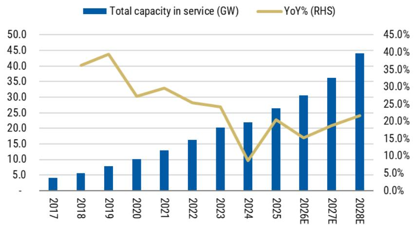

bar_line

| Year   | Total capacity in service (GW) | YoY% (RHS) |
| ------ | ------------------------------ | ---------- |
| 2017   | 4.0                            | -          |
| 2018   | 5.0                            | -          |
| 2019   | 7.0                            | -          |
| 2020   | 10.0                           | -          |
| 2021   | 13.0                           | -          |
| 2022   | 16.0                           | -          |
| 2023   | 20.0                           | -          |
| 2024   | 22.0                           | -          |
| 2025E  | 27.0                           | -          |
| 2026E  | 31.0                           | -          |
| 2027E  | 36.0                           | -          |
| 2028E  | 44.0                           | -          |

China hyperscalers' capex (GPU leasing not included)

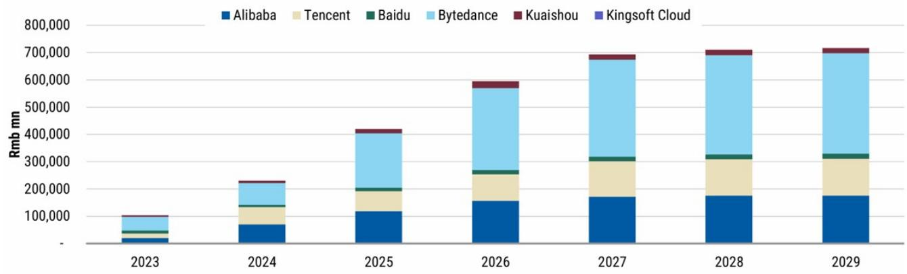

bar_stacked

| Year | Alibaba (Rmb mn) | Tencent (Rmb mn) | Baidu (Rmb mn) | Bytedance (Rmb mn) | Kuaishou (Rmb mn) | Kingsoft Cloud (Rmb mn) |
|---|---|---|---|---|---|---|
| 2023 | 25000 | 10000 | 10000 | 40000 | 5000 | 0 |
| 2024 | 70000 | 40000 | 15000 | 60000 | 10000 | 0 |
| 2025 | 115000 | 55000 | 15000 | 145000 | 15000 | 0 |
| 2026 | 155000 | 85000 | 15000 | 275000 | 25000 | 0 |
| 2027 | 175000 | 115000 | 15000 | 365000 | 35000 | 0 |
| 2028 | 185000 | 125000 | 15000 | 385000 | 35000 | 1500 |
| 2029 | 185000 | 135000 | 15000 | 395000 | 35000 | 150 |

Source: Company data, MS estimates.

# Cloud infra: Data Centers

Data centers in cloud era vs. AI era 

<table><tr><td></td><td>Cloud era</td><td>AI era</td></tr><tr><td>Rack density</td><td>5kW</td><td>10-30kW now, higher in future</td></tr><tr><td>Hyperscale order</td><td>5-20MW</td><td>50MW+</td></tr><tr><td>Preferred location</td><td>Tier 1 markets for low latency</td><td>Remote areas for scale and low cost</td></tr><tr><td>CSPs&#x27; In-house strategy</td><td>Outsource in tier 1 markets;In-house in remote sites</td><td>Prefer outsourcing for time-to-market andflexibility</td></tr><tr><td>Move-in speed</td><td>Usually 1-2 yearsdepending on the demand</td><td>As fast as 6 months</td></tr><tr><td>Delivery time</td><td>Usually 1-2 years of construction</td><td>6-9 months construction through pre-fabmodel</td></tr><tr><td>Supply side</td><td>Power quota scheme; tight in tier 1market, loose in remote areas</td><td>Large DC clusters must be in East DataWest Computation nodes;NDRC strictly controlling the supplythrough construction permit</td></tr><tr><td>Cost of capital</td><td>High due to high interest rate and lack ofalternate financing vehicle</td><td>Low interest environment and availabilityof REITs for alternative financing</td></tr></table>

Source: Company data, MS.

# Key IDC players

Tier 1 market players

Remote players

奥飞数据

www.ofide.com

GDS万国数据

CHINDATA GROUP

秦淮数据集团

光环新网

SINNET

世纪互联
VNET

CICC數據

CENTRIN DATA

润泽科技

宝信软件

BAOSIGHT

DATA

中联数据

# Cloud infra: Data Centers

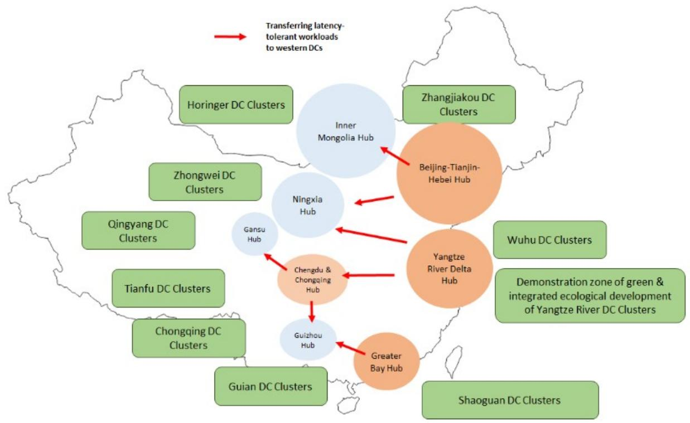

flowchart

```mermaid
graph TD
    A["Inner Mongolia Hub"] --> B["Beijing-Tianjin-Hebei Hub"]
    A --> C["Ningxia Hub"]
    A --> D["Yangtze River Delta Hub"]
    A --> E["Gansu Hub"]
    A --> F["Chengdu & Chongqing Hub"]
    A --> G["Guizhou Hub"]
    A --> H["Greater Bay Hub"]
    I["Horinger DC Clusters"] --> A
    J["Zhangjiakou DC Clusters"] --> A
    K["Wuhu DC Clusters"] --> A
    L["Demonstration zone of green & integrated ecological development of Yangtze River DC Clusters"] --> A
    M["Zhongwei DC Clusters"] --> A
    N["Tianfu DC Clusters"] --> A
    O["Chongqing DC Clusters"] --> A
    P["Guian DC Clusters"] --> A
    Q["Shaoguan DC Clusters"] --> A
    R["Qingyang DC Clusters"] --> A
    S["Inner Mongolia Hub"] --> T["Beijing-Tianjin-Hebei Hub"]
    S --> U["Yangtze River Delta Hub"]
    S --> V["Gansu Hub"]
    S --> W["Chengdu & Chongqing Hub"]
    S --> X["Guizhou Hub"]
    S --> Y["Greater Bay Hub"]
    Z["Transferring latency-tolerant workloads to western DCs"] --> AA["Outer lines"]
```

Source: MS

# AI Cloud

How the AI era differs from traditional cloud 

<table><tr><td></td><td>Cloud era</td><td>AI era</td></tr><tr><td>Datacenter</td><td>CPUbasedTier 1 cities</td><td>GPUbasedRemote area</td></tr><tr><td>IaaS</td><td>ComputingStorageNetworking</td><td>Model trainingModel inferencing</td></tr><tr><td>PaaS/MaaS</td><td>DatabaseMiddlewareOperating system</td><td>Vector databaseMaaS</td></tr><tr><td>SaaS</td><td>ERPOffice softwareCRM</td><td>ChatbotCoding agent</td></tr></table>

Public cloud spending related to AI (mix by CIO)   
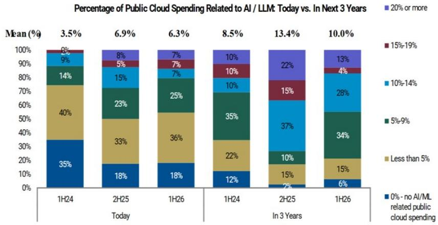

bar_stacked

Percentage of Public Cloud Spending Related to AI / LLM: Today vs. In Next 3 Years
| Period | Time | 0% - no AI/ML related public cloud spending (%) | Less than 5% (%) | 5%-9% (%) | 10%-14% (%) | 15%-19% (%) | 20% or more (%) |
| :--- | :--- | :--- | :--- | :--- | :--- | :--- | :--- |
| Today | 1H24 | 35 | 40 | 14 | 9 | 0 | 3.5 |
| Today | 2H25 | 18 | 33 | 23 | 15 | 5 | 8.9 |
| Today | 1H26 | 18 | 36 | 25 | 7 | 7 | 6.3 |
| In 3 Years | 1H24 | 12 | 22 | 35 | 10 | 10 | 8.5 |
| In 3 Years | 2H25 | 7 | 15 | 37 | 10 | 15 | 13.4 |
| In 3 Years | 1H26 | 6 | 15 | 34 | 28 | 4 | 10.0 |

Source: AlphaWise, MS

AI to take a rising share of IaaS + PaaS in China   
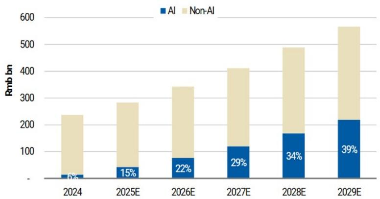

bar_stacked

| Year | AI (%) | Non-AI (%) |
|---|---|---|
| 2024 | 5 | 238 |
| 2025E | 15 | 276 |
| 2026E | 22 | 338 |
| 2027E | 29 | 398 |
| 2028E | 34 | 484 |
| 2029E | 39 | 564 |

Public deployment to pick up   
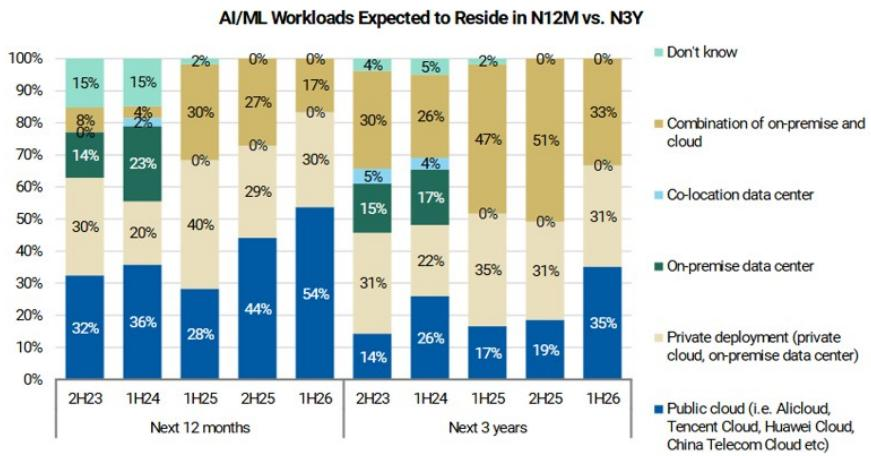

# AI Cloud

GenAI IaaS by workload type   
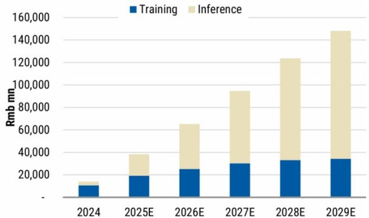

bar_stacked

| Year | Training (Rmb mn) | Inference (Rmb mn) |
|---|---|---|
| 2024 | 10,000 | 3,000 |
| 2025E | 18,000 | 16,000 |
| 2026E | 24,000 | 37,000 |
| 2027E | 29,000 | 58,000 |
| 2028E | 33,000 | 84,000 |
| 2029E | 34,000 | 115,000 |

Public cloud vendors in China   
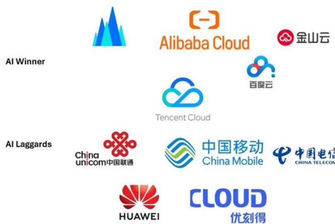

text_image

Al Winner
Alibaba Cloud
金山云
百度云
Tencent Cloud
AI Laggards
China unicom中国联通
中国移动 China Mobile
中国电信 CHINA TELECOM
HUAWEI
CLOUD 优刻得

Business model of AI cloud   
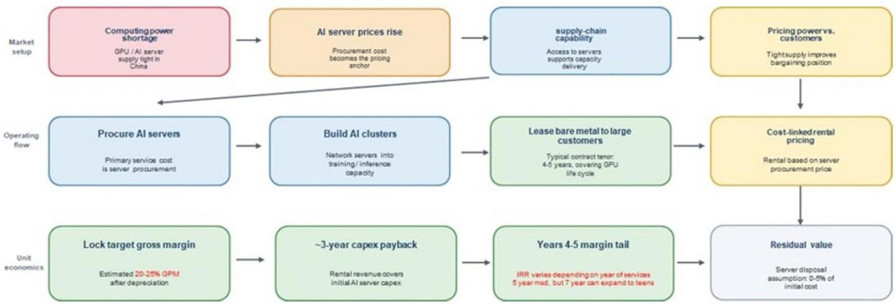

flowchart

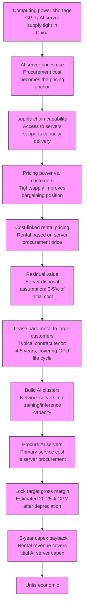
```mermaid
graph TD
    A["Computing power shortage\nGPU / AI server\nsupply tight in\nChina"] --> B["AI server prices rise\nProcurement cost\nbecomes the pricing\nanchor"]
    B --> C["supply-chain capability\nAccess to servers\nsupports capacity\ndelivery"]
    C --> D["Pricing power vs. customers\nTightsupply improves\nbargaining position"]
    D --> E["Cost-linked rental pricing\nRental based on server\nprocurement price"]
    E --> F["Residual value\nServer disposal\nassumption: 0-5% of\ninitial cost"]
    F --> G["Lease bare metal to large customers\nTypical contract tenor:\n4-5 years, covering GPU\nlife cycle"]
    G --> H["Build AI clusters\nNetwork servers into\ntraining/inference\ncapacity"]
    H --> I["Procure AI servers\nPrimary service cost\nis server procurement"]
    I --> J["Lock target gross margin\nEstimated 20-25% GPM\nafter depreciation"]
    J --> K["~3-year capex payback\nRental revenue covers\ntitial AI server capex"]
    K --> L["Units economic"]
    style A fill:#f9f,stroke:#333
    style B fill:#f9f,stroke:#333
    style C fill:#f9f,stroke:#333
    style D fill:#f9f,stroke:#333
    style E fill:#f9f,stroke:#333
    style F fill:#f9f,stroke:#333
    style G fill:#f9f,stroke:#333
    style H fill:#f9f,stroke:#333
    style I fill:#f9f,stroke:#333
    style J fill:#f9f,stroke:#333
    style K fill:#f9f,stroke:#333
    style L fill:#f9f,stroke:#333
```

Source: IDC, MS. E = IDC estimates.

# AI Cloud

Key factors determining the EBIT margin   
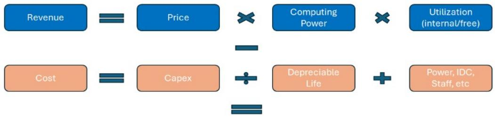

flowchart

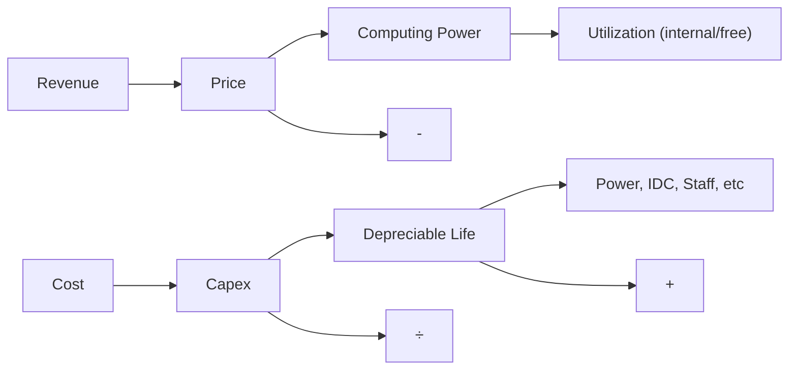
```mermaid
graph LR
    A["Revenue"] --> B["Price"]
    B --> C["Computing Power"]
    C --> D["Utilization (internal/free)"]
    E["Cost"] --> F["Capex"]
    F --> G["Depreciable Life"]
    G --> H["Power, IDC, Staff, etc"]
    B --> I["-"]
    F --> J["÷"]
    G --> K["+"]
```

Cloud Margin

How training differs from inference workloads   
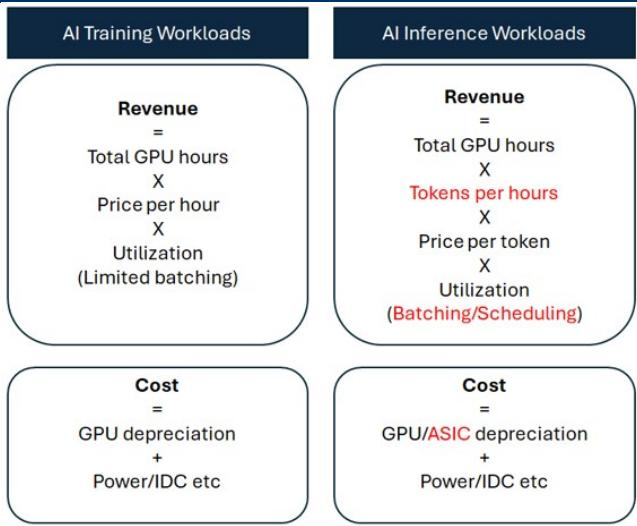

flowchart

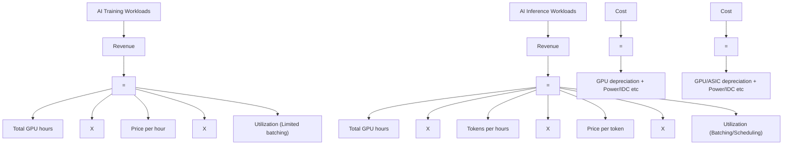
```mermaid
graph TD
    A["AI Training Workloads"] --> B["Revenue"]
    B --> C["="]
    C --> D["Total GPU hours"]
    C --> E["X"]
    C --> F["Price per hour"]
    C --> G["X"]
    C --> H["Utilization (Limited batching)"]
    I["AI Inference Workloads"] --> J["Revenue"]
    J --> K["="]
    K --> L["Total GPU hours"]
    K --> M["X"]
    K --> N["Tokens per hours"]
    K --> O["X"]
    K --> P["Price per token"]
    K --> Q["X"]
    K --> R["Utilization (Batching/Scheduling)"]
    S["Cost"] --> T["="]
    T --> U["GPU depreciation + Power/IDC etc"]
    V["Cost"] --> W["="]
    W --> X["GPU/ASIC depreciation + Power/IDC etc"]
```

Source: MS

# AI Cloud

Unit metrics of AI NeoCloud 

<table><tr><td>Year</td><td>0</td><td>1</td><td>2</td><td>3</td><td>4</td><td>5</td><td>6</td><td>Total</td></tr><tr><td>Capex</td><td>71</td><td></td><td></td><td></td><td></td><td></td><td></td><td></td></tr><tr><td>LTC</td><td>80%</td><td></td><td></td><td></td><td></td><td></td><td></td><td></td></tr><tr><td>Interest rate</td><td>3.5%</td><td></td><td></td><td></td><td></td><td></td><td></td><td></td></tr><tr><td>Debt</td><td>57</td><td></td><td></td><td></td><td></td><td></td><td></td><td></td></tr><tr><td>Equity</td><td>14</td><td></td><td></td><td></td><td></td><td></td><td></td><td></td></tr><tr><td>Tax rate</td><td>15.0%</td><td></td><td></td><td></td><td></td><td></td><td></td><td></td></tr><tr><td>Revenue</td><td></td><td>22.0</td><td>22.0</td><td>22.0</td><td>22.0</td><td>22.0</td><td>22.0</td><td>110</td></tr><tr><td>Opex</td><td></td><td>3.5</td><td>3.5</td><td>3.5</td><td>3.5</td><td>3.5</td><td>3.5</td><td>21</td></tr><tr><td>EBITDA</td><td></td><td>18.5</td><td>18.5</td><td>18.5</td><td>18.5</td><td>18.5</td><td>18.5</td><td>93</td></tr><tr><td>Margin</td><td></td><td>84%</td><td>84%</td><td>84%</td><td>84%</td><td>84%</td><td>84%</td><td></td></tr><tr><td>Depreciation</td><td></td><td>14.3</td><td>14.3</td><td>14.3</td><td>14.3</td><td>14.3</td><td>-</td><td>71</td></tr><tr><td>EBIT</td><td></td><td>4.2</td><td>4.2</td><td>4.2</td><td>4.2</td><td>4.2</td><td>18.5</td><td>21</td></tr><tr><td>Margin</td><td></td><td>19%</td><td>19%</td><td>19%</td><td>19%</td><td>19%</td><td>84%</td><td></td></tr><tr><td>Interest expense</td><td></td><td>2.0</td><td>2.0</td><td>2.0</td><td>2.0</td><td>2.0</td><td>2.0</td><td>10</td></tr><tr><td>Tax expense</td><td></td><td>0.63</td><td>0.63</td><td>0.63</td><td>0.63</td><td>0.63</td><td>2.78</td><td></td></tr><tr><td>Net profit</td><td></td><td>1.59</td><td>1.59</td><td>1.59</td><td>1.59</td><td>1.59</td><td>13.73</td><td>8</td></tr><tr><td>Margin</td><td></td><td>7%</td><td>7%</td><td>7%</td><td>7%</td><td>7%</td><td>62%</td><td>7%</td></tr><tr><td>Gross asset yield</td><td></td><td>31%</td><td>31%</td><td>31%</td><td>31%</td><td>31%</td><td>31%</td><td></td></tr><tr><td>Payback years</td><td>3.86</td><td></td><td></td><td></td><td></td><td></td><td></td><td></td></tr><tr><td colspan="9">If 5 years</td></tr><tr><td>Unleveraged cashflow</td><td>(71)</td><td>18.5</td><td>18.5</td><td>18.5</td><td>18.5</td><td>18.5</td><td></td><td></td></tr><tr><td>IRR (pre-tax)</td><td>9%</td><td></td><td></td><td></td><td></td><td></td><td></td><td></td></tr><tr><td colspan="9">If 6 years</td></tr><tr><td>Unleveraged cashflow</td><td>(71)</td><td>18.5</td><td>18.5</td><td>18.5</td><td>18.5</td><td>18.5</td><td>18.5</td><td></td></tr><tr><td>IRR (pre-tax)</td><td>14%</td><td></td><td></td><td></td><td></td><td></td><td></td><td></td></tr><tr><td colspan="9">If prepaid 1 year</td></tr><tr><td>Unleveraged cashflow</td><td>(52.9)</td><td>18.5</td><td>18.5</td><td>18.5</td><td>18.5</td><td></td><td></td><td></td></tr><tr><td>IRR (pre-tax)</td><td>15%</td><td></td><td></td><td></td><td></td><td></td><td></td><td></td></tr><tr><td colspan="9">If 50% leased</td></tr><tr><td>Lease payment</td><td>-</td><td>(8.0)</td><td>(8.0)</td><td>(8.0)</td><td>(8.0)</td><td>(8.0)</td><td></td><td></td></tr><tr><td>Unleveraged cashflow</td><td>(35.7)</td><td>10.5</td><td>10.5</td><td>10.5</td><td>10.5</td><td>10.5</td><td></td><td></td></tr><tr><td>IRR (pre-tax)</td><td>15%</td><td></td><td></td><td></td><td></td><td></td><td></td><td></td></tr></table>

Source: MS

# AI Cloud

Silicon Data H100 Rental Index   
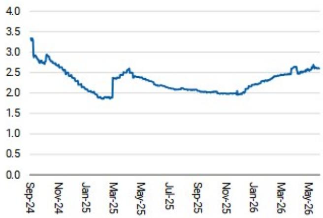

line

| Date   | Value |
|--------|-------|
| Sep-24 | 3.4   |
| Nov-24 | 2.9   |
| Jan-25 | 2.0   |
| Mar-25 | 1.8   |
| May-25 | 2.5   |
| Jul-25 | 2.1   |
| Sep-25 | 2.0   |
| Nov-25 | 1.9   |
| Jan-26 | 2.1   |
| Mar-26 | 2.5   |
| May-26 | 2.7   |

Recent cloud price hikes globally 

<table><tr><td>Time</td><td>Product /Company</td><td>Key events</td></tr><tr><td>Dec-25</td><td>CPU/Memory</td><td>Financial Times reported major server OEMs are increasing server prices citing CPU and memory costs as major driver.</td></tr><tr><td rowspan="4">Jan-26</td><td>AWS</td><td>AWS raised EC2 Machine Learning Capacity Block prices by ~15%, mainly affecting AI heavy workloads</td></tr><tr><td>CPU</td><td>Multiple reports indicated that cost of servers have been driving up by higher CPU, memory and motherboards prices</td></tr><tr><td>Google Cloud</td><td>Announced higher data transfer pricing effective from May 2026</td></tr><tr><td>Wangsu</td><td>Announced price hike for CDN products by 35-40% effective from Feb 1st</td></tr><tr><td>Feb-26</td><td>Ucloud</td><td>Announced price hike for cloud product line effective from March 1st for all contract renewals and new signing.</td></tr><tr><td rowspan="3">Mar-26</td><td>Tencent</td><td>Raised the token prices for a series of models on its MaaS platform.</td></tr><tr><td>Alicloud</td><td>Raised the pricing for AI computing related offerings by 5-34% effective from Apr 18th.</td></tr><tr><td>Baidu</td><td>Raised AI computing related offerings by 5-30% effective from Apr 18th.</td></tr><tr><td rowspan="2">Apr-26</td><td>Tencent</td><td>Raised the prices for AI computing related product effective from May 9th.</td></tr><tr><td>Alicloud</td><td>Raised prices for some server prices effective from May 15th.</td></tr></table>

Source: Bloomberg, MS

# AI Applications

# From Chatbot to Agent

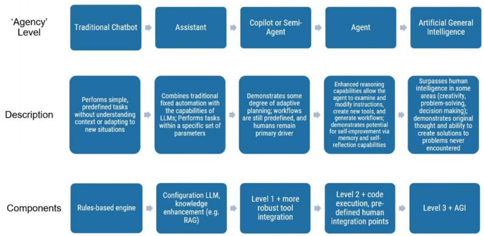

flowchart

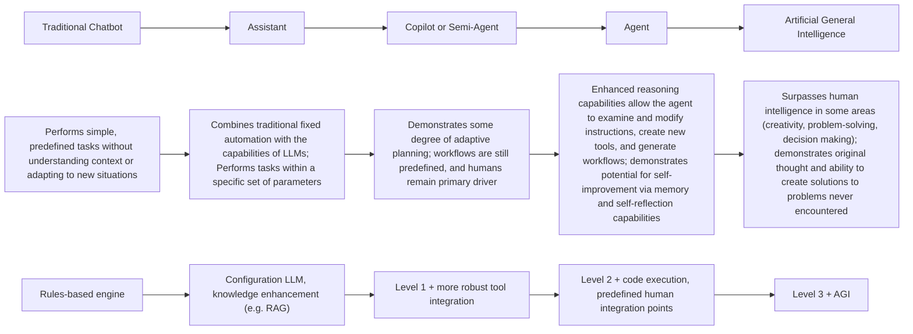
```mermaid
graph LR
    A["Traditional Chatbot"] --> B["Assistant"]
    B --> C["Copilot or Semi-Agent"]
    C --> D["Agent"]
    D --> E["Artificial General Intelligence"]

    F["Performs simple, predefined tasks without understanding context or adapting to new situations"] --> G["Combines traditional fixed automation with the capabilities of LLMs; Performs tasks within a specific set of parameters"]
    G --> H["Demonstrates some degree of adaptive planning; workflows are still predefined, and humans remain primary driver"]
    H --> I["Enhanced reasoning capabilities allow the agent to examine and modify instructions, create new tools, and generate workflows; demonstrates potential for self-improvement via memory and self-reflection capabilities"]
    I --> J["Surpasses human intelligence in some areas (creativity, problem-solving, decision making); demonstrates original thought and ability to create solutions to problems never encountered"]

    K["Rules-based engine"] --> L["Configuration LLM, knowledge enhancement (e.g. RAG)"]
    L --> M["Level 1 + more robust tool integration"]
    M --> N["Level 2 + code execution, predefined human integration points"]
    N --> O["Level 3 + AGI"]
```

Source: MS, Adapted from S&P Global Market Intelligence 451 Research

# What do China CIOs say?

China enterprise CIOs generally delayed first AI projects   
Timeframe to Have First AI / LLM Project in Production   
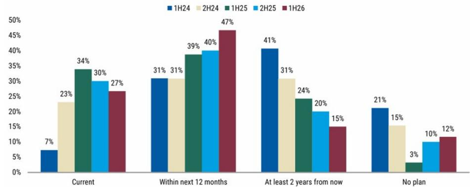

bar

| Category | 1H24 (%) | 2H24 (%) | 1H25 (%) | 2H25 (%) | 1H26 (%) |
|---|---|---|---|---|---|
| Current | 7 | 23 | 34 | 30 | 27 |
| Within next 12 months | 31 | 31 | 39 | 40 | 47 |
| At least 2 years from now | 41 | 31 | 24 | 20 | 15 |
| No plan | 21 | 15 | 3 | 10 | 12 |

Almost all CIOs saw AI impact on IT investments

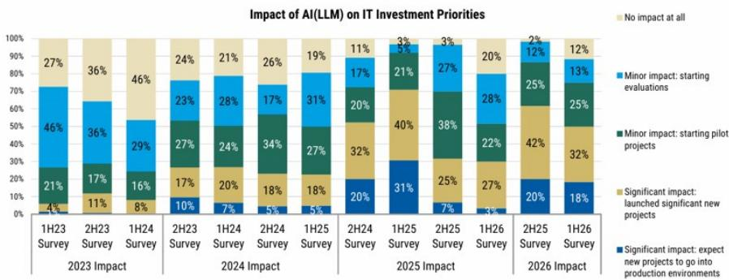

AI increasingly gaining IT budget share   
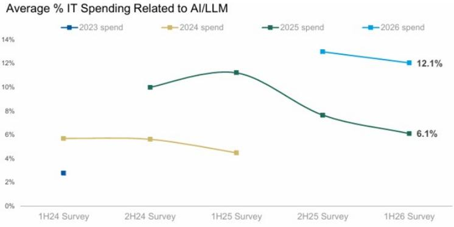

line

Average % IT Spending Related to AI/LLM
| Survey | 2023 spend (%) | 2024 spend (%) | 2025 spend (%) | 2026 spend (%) |
|---|---|---|---|---|
| 1H24 Survey | 2.8 | 5.7 | | |
| 2H24 Survey | | 5.6 | 10.0 | |
| 1H25 Survey | | 4.5 | 11.3 | |
| 2H25 Survey | | | 7.7 | 13.1 |
| 1H26 Survey | | | 6.1 | 12.1 |

Source: AlphaWise, MS.

# AI Disruption 1 – Budget Reallocation

Impact of AI spending on total IT budget   
Impact of GenAI/LLM Spending on Total IT Budget for Current Year vs. Next 3 Years   
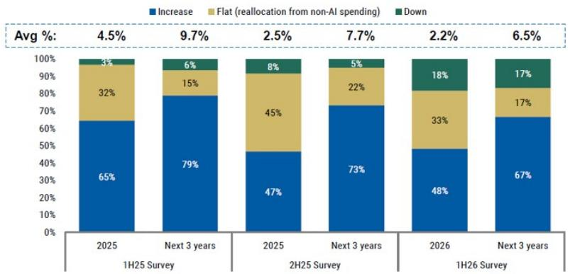

bar_stacked

| Survey | Period | Increase (%) | Flat (reallocation from non-AI spending) (%) | Down (%) |
| :--- | :--- | :--- | :--- | :--- |
| 1H25 Survey | 2025 | 65 | 32 | 3 |
| 1H25 Survey | Next 3 years | 79 | 15 | 6 |
| 2H25 Survey | 2025 | 47 | 45 | 8 |
| 2H25 Survey | Next 3 years | 73 | 22 | 5 |
| 1H26 Survey | 2026 | 48 | 33 | 18 |
| 1H26 Survey | Next 3 years | 67 | 17 | 17 |
Avg %: |
| Avg %: |
| 4.5% |
| 9.7% |
| 2.5% |
| 7.7% |
| 2.2% |
| 6.5% |

More AI funding coming from software budget reallocation

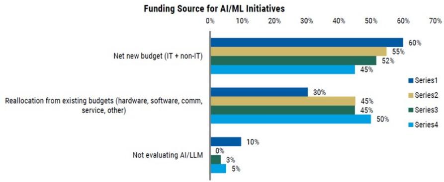

bar

Funding Source for AI/ML Initiatives
| Funding Source | Series1 (%) | Series2 (%) | Series3 (%) | Series4 (%) |
|---|---|---|---|---|
| Net new budget (IT + non-IT) | 60 | 55 | 52 | 45 |
| Reallocation from existing budgets (hardware, software, comm, service, other) | 30 | 45 | 45 | 50 |
| Not evaluating AI/LLM | 10 | 0 | 3 | 5 |

Source: AlphaWise, MS.

AI spending breakdown   
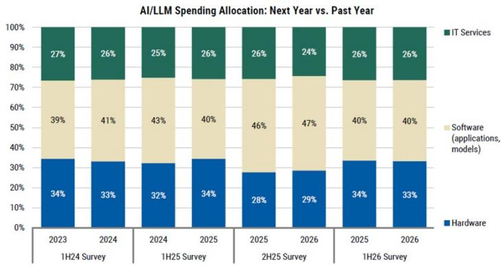

bar_stacked

AI/LLM Spending Allocation: Next Year vs. Past Year
| Survey | Year | Hardware (%) | Software (applications, models) (%) | IT Services (%) |
| :--- | :--- | :--- | :--- | :--- |
| 1H24 Survey | 2023 | 34 | 39 | 27 |
| 1H24 Survey | 2024 | 33 | 41 | 26 |
| 1H25 Survey | 2024 | 32 | 43 | 25 |
| 1H25 Survey | 2025 | 34 | 40 | 26 |
| 2H25 Survey | 2025 | 28 | 46 | 26 |
| 2H25 Survey | 2026 | 29 | 47 | 24 |
| 1H26 Survey | 2025 | 34 | 40 | 26 |
| 1H26 Survey | 2026 | 33 | 40 | 26 |

Impact of AI on software procurement

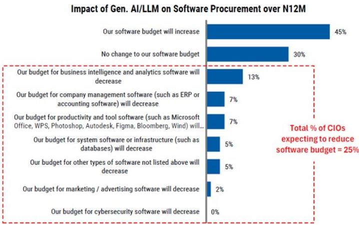

bar

Impact of Gen. AI/LLM on Software Procurement over N12M
| Category | Impact (%) |
|---|---|
| Our software budget will increase | 45 |
| No change to our software budget | 30 |
| Our budget for business intelligence and analytics software will decrease | 13 |
| Our budget for company management software (such as ERP or accounting software) will decrease | 7 |
| Our budget for productivity and tool software (such as Microsoft Office, WPS, Photoshop, Autodesk, Figma, Bloomberg, Wind) will decrease | 7 |
| Our budget for system software or infrastructure (such as databases) will decrease | 5 |
| Our budget for other types of software not listed above will decrease | 5 |
| Our budget for marketing / advertising software will decrease | 2 |
| Our budget for cybersecurity software will decrease | 0 |
Total % of CIOs expecting to reduce software budget = 25%

# AI Disruption 2 – Vendor Reshuffle

# Software vendor preference of AI

Most Likely Provider for Deploying AI Applications Over N12M (Among Those Impacted by Recent AI Innovations)   
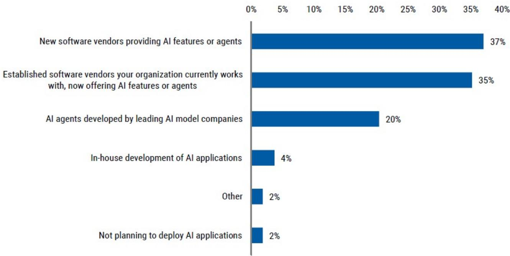

bar

| Category | Percentage (%) |
| :--- | :--- |
| New software vendors providing AI features or agents | 37 |
| Established software vendors your organization currently works with, now offering AI features or agents | 35 |
| AI agents developed by leading AI model companies | 20 |
| In-house development of AI applications | 4 |
| Other | 2 |
| Not planning to deploy AI applications | 2 |

Source: AlphaWise, MS.

# AI Disruption 3 – Less Headcount...

# From Human-Driven Operations to AI Agent-Powered Enterprises

# TODAY: HUMAN-CENTRIC WORKFORCE

Enterprises rely on people to execute routine, repetitive and knowledge work

Finance & Accounting

Human

Procurement

Customer

Marketing

Legal &

Operations &

# TOMORROW: AI AGENT-CENTRIC WORKFORCE

AI agents handle end-to-end processes with greater speed, accuracy and scale—at a fraction of the cost

Finance & Accounting

Finance Agent
Automates reporting, reconciliation,
forecasting and billing

Human Resources

HR Agent
Handles recruitment, onboarding,
policy Q&A and employee support

Procurement

Procurement Agent
Manages demand, sourcing, contracts and supplier evaluation

Customer Service

Customer Service Agent
Resolves inquiries, understands intent and delivers 24/7 support

Marketing

Marketing Agent
Creates content, runs campaigns,
analyzes performance

Legal & Compliance

Legal Agent
Reviews contracts, ensures compliance and manages risks

Operations & Supply Chain

Operations Agent
Optimizes inventory, plans demand and monitors performance

# Impact of AI on total headcounts

Anticipated Changes to Workforce Due to the Use of GenAI/LLM

1H25 2H25 1H26

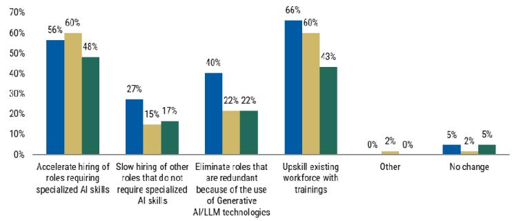

bar

| Category | Blue Bar (%) | Yellow Bar (%) | Green Bar (%) |
| -------- | ------------ | -------------- | ------------- |
| Accelerate hiring of roles requiring specialized AI skills | 56 | 60 | 48 |
| Slow hiring of other roles that do not require specialized AI skills | 27 | 15 | 17 |
| Eliminate roles that are redundant because of the use of Generative AI/LLM technologies | 40 | 22 | 22 |
| Upskill existing workforce with trainings | 66 | 60 | 43 |
| Other | 0 | 2 | 0 |
| No change | 5 | 2 | 5 |

# Impact of AI on total headcount summary

Anticipated Changes to Total Headcounts Due to the Use of GenAI/LLM in Next 3 Years

1H25 2H25 1H26

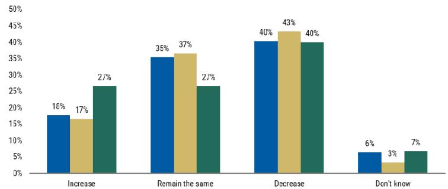

bar

| Category | Blue Bar (%) | Yellow Bar (%) | Green Bar (%) |
|---|---|---|---|
| Increase | 18 | 17 | 27 |
| Remain the same | 35 | 37 | 27 |
| Decrease | 40 | 43 | 40 |
| Don't know | 6 | 3 | 7 |

Source: AlphaWise, MS.

# ...But There Are Also Opportunities

# 1. Shift of software value proposition

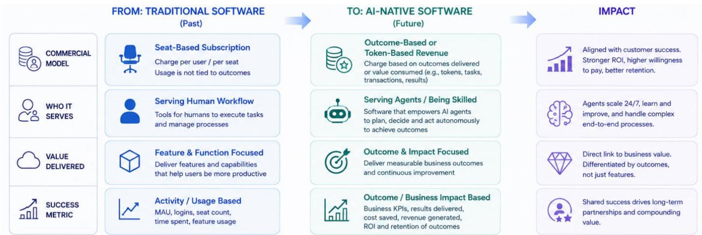

flowchart

```mermaid
graph LR
    A["FROM: TRADITIONAL SOFTWARE (Past)"] --> B["TO: AI-NATIVE SOFTWARE (Future)"]
    B --> C["IMPACT"]

    subgraph_A["COMMERCIAL MODEL"]
        A1["Seat-Based Subscription"]
        A2["Serving Human Workflow"]
        A3["Feature & Function Focused"]
        A4["Activity / Usage Based"]
    end

    subgraph_B["TO: AI-NATIVE SOFTWARE (Future)"]
        B1["Outcome-Based or Token-Based Revenue"]
        B2["Serving Agents / Being Skilled"]
        B3["Outcome & Impact Focused"]
        B4["Outcome / Business Impact Based"]
    end

    subgraph_C["IMPACT"]
        C1["Aligned with customer success. Stronger ROI, higher willingness to pay, better retention."]
        C2["Agents scale 24/7, learn and improve, and handle complex end-to-end processes."]
        C3["Direct link to business value. Differentiated by outcomes, not just features."]
        C4["Shared success drives long-term partnerships and compounding value."]
    end

    A --> B --> C
    B --> C
    C --> A
    A --> D["Seat-Based Subscription"]
        A --> E["Serving Human Workflow"]
        A --> F["Feature & Function Focused"]
        A --> G["Activity / Usage Based"]
    end
```

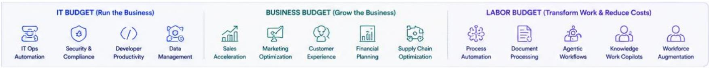

text_image

IT BUDGET (Run the Business)
IT Ops
Automation
Security &
Compliance
Developer
Productivity
Data
Management
BUSINESS BUDGET (Grow the Business)
Sales
Acceleration
Marketing
Optimization
Customer
Experience
Financial
Planning
Supply Chain
Optimization
LABOR BUDGET (Transform Work & Reduce Costs)
Process
Automation
Document
Processing
Agentic
Workflows
Knowledge
Work Copilots
Workforce
Augmentation

Source: MS.

# ...But There Are Also Opportunities

2. Prefer buying software over building software   
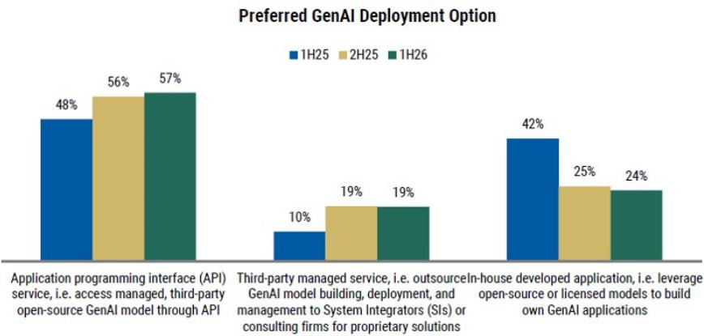

bar

Preferred GenAI Deployment Option
| Category | 1H25 (%) | 2H25 (%) | 1H26 (%) |
|---|---|---|---|
| Application programming interface (API) service, i.e. access managed, third-party open-source GenAI model through API | 48 | 56 | 57 |
| Third-party managed service, i.e. outsource GenAI model building, deployment, and management to System Integrators (SIs) or consulting firms for proprietary solutions | 10 | 19 | 19 |
| In-house developed application, i.e. leverage open-source or licensed models to build own GenAI applications | 42 | 25 | 24 |

3. Prefer public/hybrid cloud over private cloud   
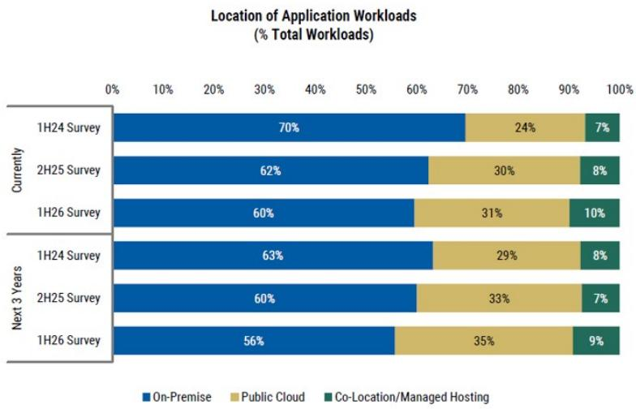

bar_stacked

Location of Application Workloads (% Total Workloads)
| Time Period | On-Premise (%) | Public Cloud (%) | Co-Location/Managed Hosting (%) |
|---|---|---|---|
| Currently 1H24 Survey | 70 | 24 | 7 |
| Currently 2H25 Survey | 62 | 30 | 8 |
| Currently 1H26 Survey | 60 | 31 | 10 |
| Next 3 Years 1H24 Survey | 63 | 29 | 8 |
| Next 3 Years 2H25 Survey | 60 | 33 | 7 |
| Next 3 Years 1H26 Survey | 56 | 35 | 9 |

Source: AlphaWise, MS.

# Case Studies: China AI Applications

# Meitu – GenAI Applied in Consumer/Prosumer Apps

Meitu major app portfolio   
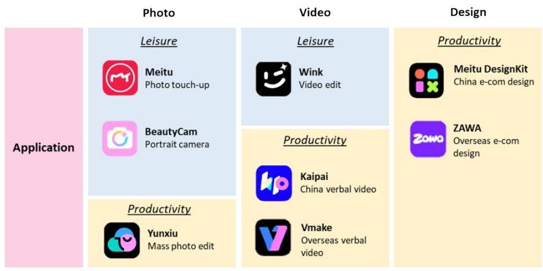

flowchart

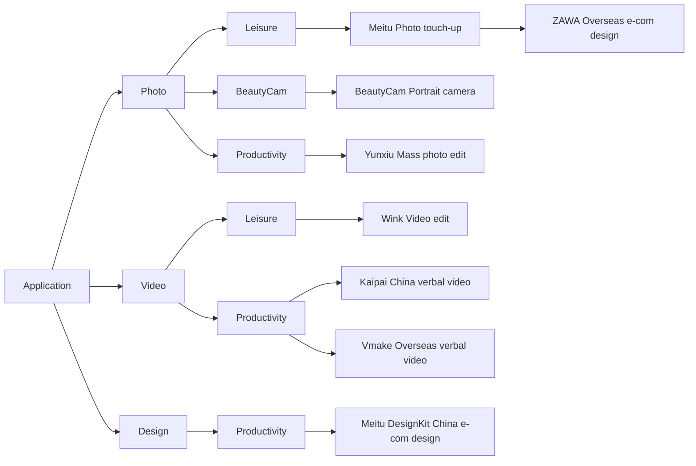
```mermaid
graph LR
    A["Application"] --> B["Photo"]
    A --> C["Video"]
    A --> D["Design"]
    
    B --> E["Leisure"]
    B --> F["BeautyCam"]
    B --> G["Productivity"]
    
    C --> H["Leisure"]
    C --> I["Productivity"]
    
    D --> J["Productivity"]
    
    E --> K["Meitu Photo touch-up"]
    F --> L["BeautyCam Portrait camera"]
    G --> M["Yunxiu Mass photo edit"]
    
    H --> N["Wink Video edit"]
    I --> O["Kaipai China verbal video"]
    I --> P["Vmake Overseas verbal video"]
    
    J --> Q["Meitu DesignKit China e-com design"]
    K --> R["ZAWA Overseas e-com design"]
```

RoboNeo – AI agent   

text_image

Model
Seedance
Kling
Nano Banana
Vidu
...

Meitu target markets   
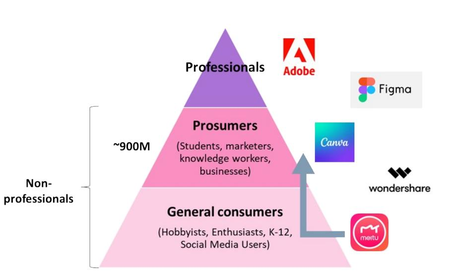

other

| Category             | Value     |
| -------------------- | --------- |
| Professionals        | ~900M     |
| Prosumers            | Students, marketers, knowledge workers, businesses |
| General consumers    | Hobbyists, Enthusiasts, K-12, Social Media Users |

Photo MAU (mn)   
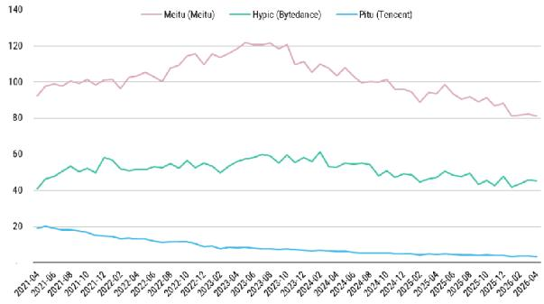

line

| Date       | Meita (Meita) | Hypic (Bytelessness) | Pitu (Tenoent) |
| ---------- | ------------- | ------------------- | -------------- |
| 2021-04    | 95            | 40                  | 20             |
| 2021-06    | 100           | 45                  | 18             |
| 2021-08    | 105           | 50                  | 16             |
| 2021-10    | 108           | 55                  | 14             |
| 2021-12    | 110           | 58                  | 12             |
| 2022-02    | 115           | 56                  | 10             |
| 2022-04    | 118           | 57                  | 9              |
| 2022-06    | 120           | 58                  | 8              |
| 2022-08    | 118           | 57                  | 7              |
| 2022-10    | 115           | 56                  | 6              |
| 2022-12    | 110           | 55                  | 5              |
| 2023-02    | 105           | 54                  | 4              |
| 2023-04    | 100           | 53                  | 3              |
| 2023-06    | 95            | 52                  | 2              |
| 2023-08    | 90            | 51                  | 1              |
| 2023-10    | 85            | 50                  | 0              |
| 2023-12    | 80            | 49                  | -1             |
| 2024-02    | 75            | 48                  | -2             |
| 2024-04    | 70            | 47                  | -3             |
| 2024-06    | 65            | 46                  | -4             |
| 2024-08    | 60            | 45                  | -5             |
| 2024-10    | 55            | 44                  | -6             |
| 2024-12    | 50            | 43                  | -7             |
| 2025-02    | 45            | 42                  | -8             |
| 2025-04    | 40            | 41                  | -9             |
| 2025-06    | 35            | 40                  | -10            |
| 2025-08    | 30            | 39                  | -11            |
| 2025-10    | 25            | 38                  | -12            |
| 2025-12    | 20            | 37                  | -13            |
| 2026-02    | 15            | 36                  | -14            |
| 2026-04    | 10            | 35                  | -15            |

Video MAU (mn)   
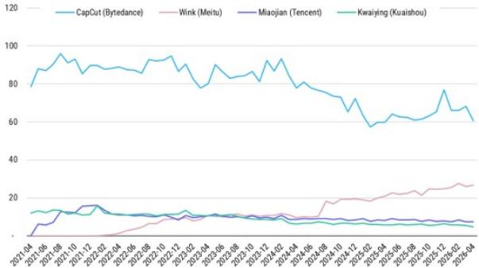

Verbal video MAU (mn)   
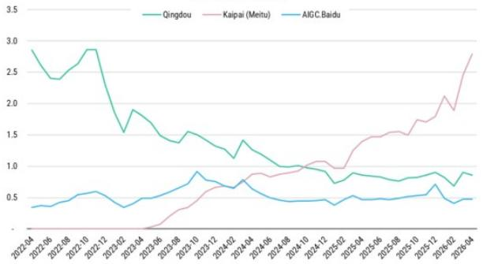

line

| Date | Qingdou | Kaipai (Meitu) | AIGC.Baidu |
|---|---|---|---|
| 2022-04 | 2.9 | - | 0.35 |
| 2022-06 | 2.4 | - | 0.35 |
| 2022-08 | 2.7 | - | 0.45 |
| 2022-10 | 2.9 | - | 0.55 |
| 2022-12 | 2.9 | - | 0.6 |
| 2023-02 | 1.6 | - | 0.35 |
| 2023-04 | 1.9 | - | 0.45 |
| 2023-06 | 1.7 | - | 0.55 |
| 2023-08 | 1.5 | - | 0.75 |
| 2023-10 | 1.6 | - | 0.9 |
| 2023-12 | 1.4 | - | 0.75 |
| 2024-02 | 1.3 | - | 0.65 |
| 2024-04 | 1.4 | - | 0.75 |
| 2024-06 | 1.1 | - | 0.55 |
| 2024-08 | 1.0 | - | 0.45 |
| 2024-10 | 1.0 | - | 0.45 |
| 2024-12 | 0.8 | - | 0.4 |
| 2025-02 | 0.75 | - | 0.35 |
| 2025-04 | 0.9 | - | 0.45 |
| 2025-06 | 0.85 | - | 0.45 |
| 2025-08 | 0.85 | - | 0.45 |
| 2025-10 | 0.9 | - | 0.5 |
| 2025-12 | 0.95 | - | 0.6 |
| 2026-02 | 0.85 | - | 0.4 |
| 2026-04 | 0.9 | - | 0.45 |
The chart displays a time series with three data series: 'Qingdou' (green line), 'Kaipai (Meitu)' (pink line), and 'AIGC.Baidu' (blue line). The values for each series are estimated based on the Y-axis scale ranging from 0 to 3.5. The data is already in English. There is no variation or trend over time — it's a single series representing the time series.

Source: Questmobile, MS

# Meitu – GenAI Applied in Consumer/Prosumer Apps

# Improving operating metrics with GenAI

# Key strategy: productivity + globalization

- Increasing AI-empowered product features behind a paywall   
- Growing mix of productivity apps with higher paying ratio and ARPPU   
- Growing mix of overseas users with higher paying ratio and ARPPU

Multi-modal progress benefits Meitu   
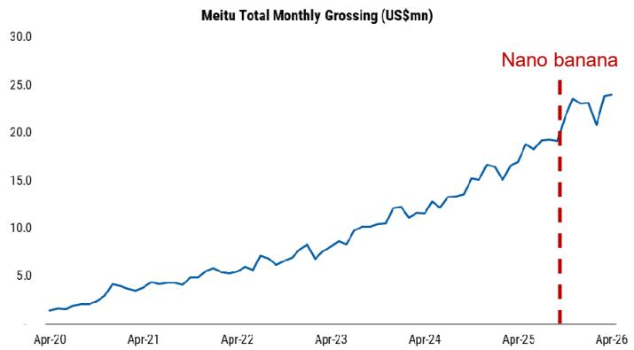

line

| Date    | Total Grossing (US$mn) |
|---------|------------------------|
| Apr-20  | ~1.0                   |
| Apr-21  | ~4.0                   |
| Apr-22  | ~6.0                   |
| Apr-23  | ~8.0                   |
| Apr-24  | ~12.0                  |
| Apr-25  | ~19.0                  |
| Apr-26  | ~24.0                  |

Meitu RoboNeo: China's first design agent   
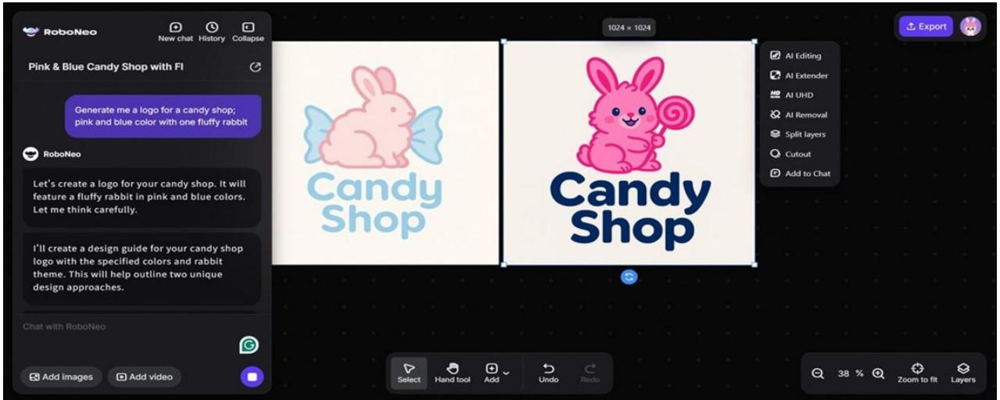

text_image

RoboNeo
New chat History Collapse
Pink & Blue Candy Shop with FI
Generate me a logo for a candy shop;
pink and blue color with one fluffy rabbit
RoboNeo
Let's create a logo for your candy shop. It will
feature a fluffy rabbit in pink and blue colors.
Let me think carefully.
I'll create a design guide for your candy shop
logo with the specified colors and rabbit
theme. This will help outline two unique
design approaches.
Chat with RoboNeo
Add Images Add video
1024 x 1024
Candy Shop
Candy Shop
AI Editing
AI Extender
AI UHD
AI Removal
Split layers
Cutout
Add to Chat
Select Hand tool Add Undo Redo
38 % Zoom to fit Layers

Source: Company, SensorTower

# Kingsoft Office WPS – GenAI Applied in Office Software

WPS AI offerings   
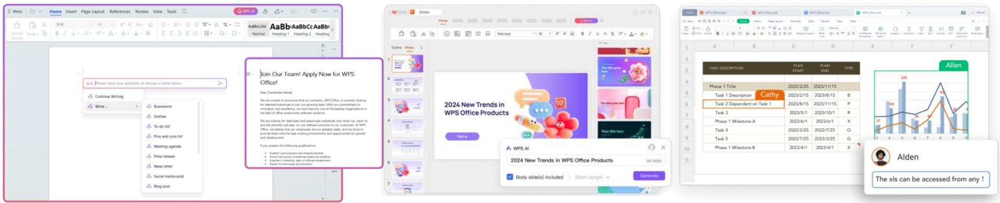

text_image

Please input your question, or choose a scene below
Continue Writing
Write ...
Brainstorm
Outline
To-do list
Price and cons list
Meeting agenda
Press release
News letter
Social media post
Blog post
Join Our Team! Apply Now for WPS Office!
Dear [Candidate Name].
We are excited to announce that our company. WPS Office, is currently looking for talented individuals to join our growing team. With our contentment to innovation and excellence, we have become one of the leading organizations in the field of office productivity software solutions.
We are looking for dedicated and passionate individuals who share our vision to provide powerful yet easy-to-use software solutions to our customers. At WPS Office, we believe that our employees are our greatest extent, and we also show to provide them with the best working environment and opportunities for growth and development.
If you possess the following qualifications:
• Executive communication and interpersonal skills
• Support track record of sharing lengths and deadlines.
• Expert in marketing skills, or software development
• Support for technology and innovation
2024 New Trends in WPS Office Products
Name
WPS AI
2024 New Trends in WPS Office Products
58/3000
Body slide(s) included Short-length Generate
PLAN START PLAN END TYPE
Phase 1 Title Cathy
2023/2/15 2023/8/15 B
Task 2 Dependent on Task 1
2023/8/15 2023/11/15 P
Phase 3 2023/5/1 2023/10/1 R
Phase 1 Milestone A 2023/6/1 2023/4/1 X
Phase 4 2022/2/25 2022/7/25 O
Phase 5 2022/7/25 2023/3/25 G
Phase 1 Milestone B 2023/4/1 2023/4/1 X
Allen
The xls can be accessed from any !

WPS 2C revenue YoY% growth   
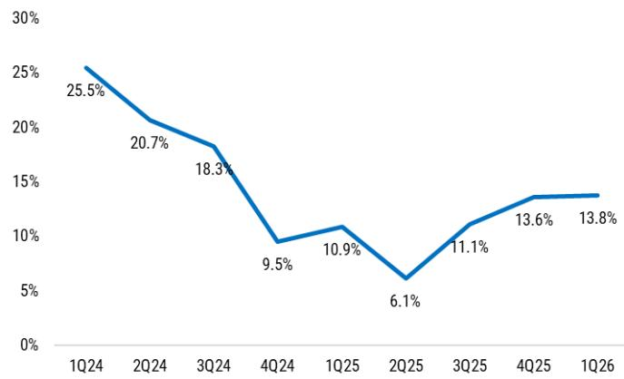

line

| Quarter | Value (%) |
|---|---|
| 1Q24 | 25.5 |
| 2Q24 | 20.7 |
| 3Q24 | 18.3 |
| 4Q24 | 9.5 |
| 1Q25 | 10.9 |
| 2Q25 | 6.1 |
| 3Q25 | 11.1 |
| 4Q25 | 13.6 |
| 1Q26 | 13.8 |

Enlarged WPS promotion discounts 

<table><tr><td rowspan="2">Promotional event</td><td colspan="4">2026</td><td colspan="8">2025</td></tr><tr><td>618</td><td>List price</td><td>Discount price</td><td>Implied discount</td><td>Double 11</td><td>List price</td><td>Discount price</td><td>Implied discount</td><td>618</td><td>List price</td><td>Discount price</td><td>Implied discount</td></tr><tr><td>Super membership (超级会员):</td><td></td><td></td><td></td><td></td><td></td><td></td><td></td><td></td><td></td><td></td><td></td><td></td></tr><tr><td>Discount to 1 year membership</td><td>√</td><td>168</td><td>128</td><td>24%</td><td>√</td><td>166</td><td>131</td><td>21%</td><td>√</td><td>168</td><td>128</td><td>24%</td></tr><tr><td>Discount to 2 year membership</td><td>√</td><td>278</td><td>208</td><td>25%</td><td>√</td><td>228</td><td>188</td><td>18%</td><td>√</td><td>288</td><td>198</td><td>31%</td></tr><tr><td>Discount to 3 year membership</td><td>√</td><td>368</td><td>298</td><td>19%</td><td>√</td><td>299</td><td>237</td><td>21%</td><td>√</td><td>378</td><td>229</td><td>39%</td></tr><tr><td>Discount to 4 year membership</td><td>√</td><td>488</td><td>398</td><td>18%</td><td>√</td><td>352</td><td>275</td><td>22%</td><td>√</td><td>438</td><td>303</td><td>31%</td></tr><tr><td>Grand membership (大会员)</td><td></td><td></td><td></td><td></td><td></td><td></td><td></td><td></td><td></td><td></td><td></td><td></td></tr><tr><td>Discount to 1 year membership</td><td>√</td><td>238</td><td>188</td><td>21%</td><td>√</td><td>228</td><td>179</td><td>22%</td><td>√</td><td>228</td><td>168</td><td>26%</td></tr><tr><td>Discount to 2 year membership</td><td>√</td><td>388</td><td>299</td><td>23%</td><td>√</td><td>310</td><td>233</td><td>25%</td><td>√</td><td>458</td><td>298</td><td>35%</td></tr><tr><td>Discount to 3 year membership</td><td>√</td><td>528</td><td>438</td><td>17%</td><td>√</td><td>457</td><td>359</td><td>21%</td><td>√</td><td>538</td><td>358</td><td>33%</td></tr><tr><td>Discount to 4 year membership</td><td>√</td><td>658</td><td>528</td><td>20%</td><td>√</td><td>598</td><td>483</td><td>19%</td><td>√</td><td>550</td><td>473</td><td>14%</td></tr></table>

Source: Kingsoft Office, MS

# Kingdee & Beisen – GenAI Applied in Enterprise Management Application

Kingdee AI offerings   
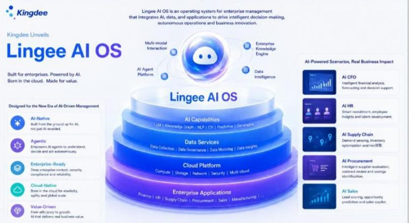

flowchart

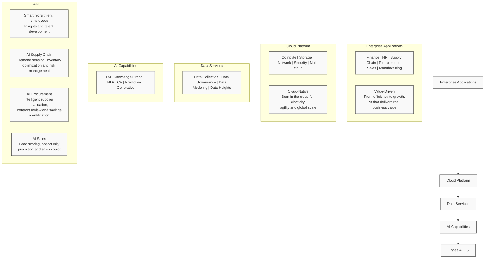
```mermaid
graph TD
    A["Enterprise Applications"] --> B["Cloud Platform"]
    B --> C["Data Services"]
    C --> D["AI Capabilities"]
    D --> E["Lingee AI OS"]
    
    subgraph Enterprise Applications
        F["Finance | HR | Supply Chain | Procurement | Sales | Manufacturing"]
        G["Value-Driven<br>From efficiency to growth,<br>At that delivers real business value"]
    end
    
    subgraph Cloud Platform
        H["Compute | Storage | Network | Security | Multi-cloud"]
        I["Cloud-Native<br>Born in the cloud for elasticity,<br>agility and global scale"]
    end
    
    subgraph Data Services
        J["Data Collection | Data Governance | Data Modeling | Data Heights"]
    end
    
    subgraph AI Capabilities
        K["LM | Knowledge Graph | NLP | CV | Predictive | Generative"]
    end
    
    subgraph AI-CFO
        L["Smart recruitment, employees<br>Insights and talent development"]
        M["AI Supply Chain<br>Demand sensing, inventory<br>optimization and risk management"]
        N["AI Procurement<br>Intelligent supplier evaluation,<br>contract review and savings<br>identification"]
        O["AI Sales<br>Lead scoring, opportunity<br>prediction and sales coplot"]
    end
    
    style A fill:#f9f9f9,stroke:#333
    style B fill:#f9f9f9,stroke:#333
    style C fill:#f9f9f9,stroke:#333
    style D fill:#f9f9f9,stroke:#333
    style E fill:#f9f9f9,stroke:#333
    style F fill:#f9f9f9,stroke:#333
    style G fill:#f9f9f9,stroke:#333
    style H fill:#f9f9f9,stroke:#333
    style I fill:#f9f9f9,stroke:#333
    style J fill:#f9f9f9,stroke:#333
    style K fill:#f9f9f9,stroke:#333
    style L fill:#f9f9f9,stroke:#333
    style M fill:#f9f9f9,stroke:#333
    style N fill:#f9f9f9,stroke:#333
    style O fill:#f9f9f9,stroke:#333
```

Beisen AI offerings

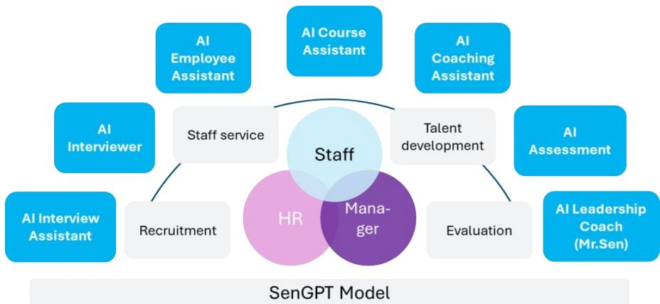

flowchart

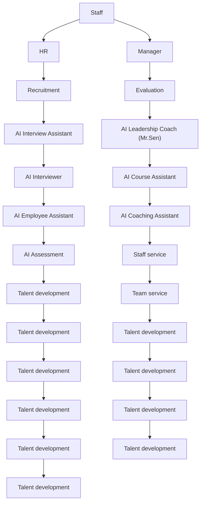
```mermaid
graph TD
    A["Staff"] --> B["HR"]
    A --> C["Manager"]
    B --> D["Recruitment"]
    C --> E["Evaluation"]
    D --> F["AI Interview Assistant"]
    E --> G["AI Leadership Coach (Mr.Sen)"]
    F --> H["AI Interviewer"]
    G --> I["AI Course Assistant"]
    H --> J["AI Employee Assistant"]
    I --> K["AI Coaching Assistant"]
    J --> L["AI Assessment"]
    K --> M["Staff service"]
    L --> N["Talent development"]
    M --> O["Team service"]
    N --> P["Talent development"]
    O --> Q["Talent development"]
    P --> R["Talent development"]
    Q --> S["Talent development"]
    R --> T["Talent development"]
    S --> U["Talent development"]
    T --> V["Talent development"]
    U --> W["Talent development"]
    V --> X["Talent development"]
```

HR SaaS + PaaS   
Source: Kingdee, Beisen, MS

# ToB AI application

- Lack explosiveness compared with toC AI application   
• Customers care about AI adoption ROIs   
• Positive for enterprise cloud migration acceleration   
- May generate higher gross margin compared with declining inference costs

Beisen gross margin breakdown   
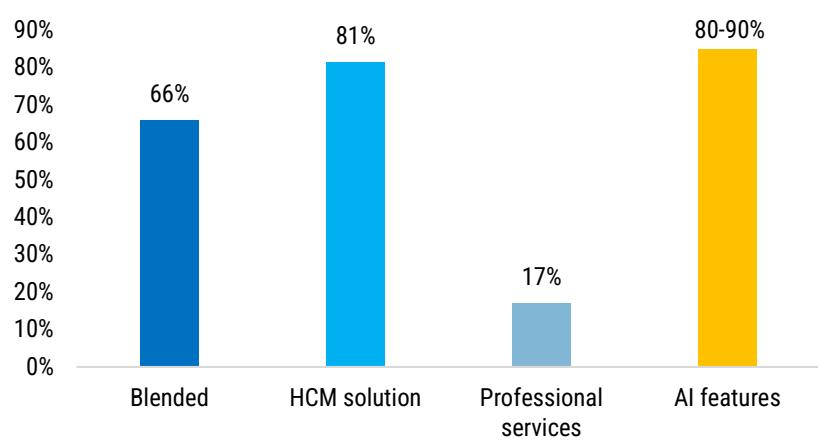

bar

| Category | Value (%) |
| :--- | :--- |
| Blended | 66 |
| HCM solution | 81 |
| Professional services | 17 |
| AI features | 80-90 |

# Appendix: Business Model

# Software Business Model: Revenue Stream

Perpetual License   
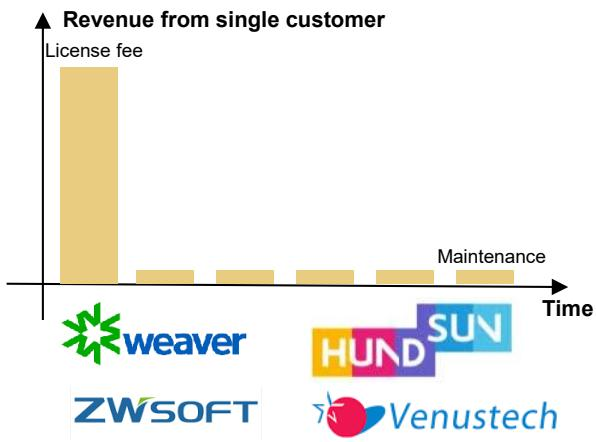

bar

| Time | Revenue from single customer |
| ---- | ---------------------------- |
| weaver | 100000000                   |
| ZWSOFT | 2000000                    |
| HUND   | 300000                     |
| SUN    | 400000                     |
| Venustech | 50000                      |

SaaS (Subscription)   
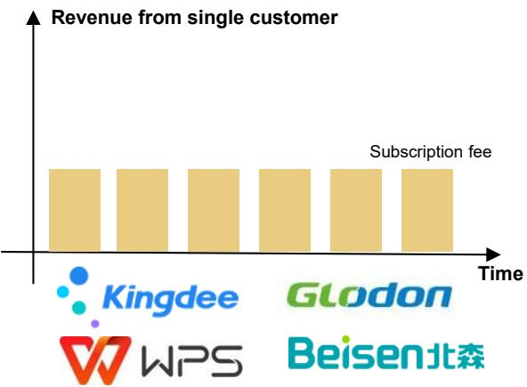

bar

| Time | Revenue from single customer |
| ---- | ---------------------------- |
| Kingdee | 100% |
| Glodon | 100% |
| WPS | 100% |
| Beisen北森 | 100% |

SaaS (Consumption)   
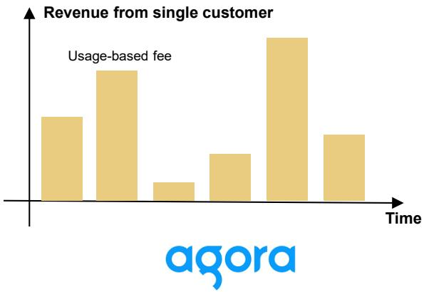

bar

| Time | Revenue from single customer |
| ---- | ---------------------------- |
| 1    | 0                            |
| 2    | 0                            |
| 3    | 0                            |
| 4    | 0                            |
| 5    | 0                            |
| 6    | 0                            |
| 7    | 0                            |
| 8    | 0                            |
| 9    | 0                            |
| 10   | 0                            |
| 11   | 0                            |
| 12   | 0                            |
| 13   | 0                            |
| 14   | 0                            |
| 15   | 0                            |
| 16   | 0                            |
| 17   | 0                            |
| 18   | 0                            |
| 19   | 0                            |
| 20   | 0                            |
| 21   | 0                            |
| 22   | 0                            |
| 23   | 0                            |
| 24   | 0                            |
| 25   | 0                            |
| 26   | 0                            |
| 27   | 0                            |
| 28   | 0                            |
| 29   | 0                            |
| 30   | 0                            |
| 31   | 0                            |
| 32   | 0                            |
| 33   | 0                            |
| 34   | 0                            |
| 35   | 0                            |
| 36   | 0                            |
| 37   | 0                            |
| 38   | 0                            |
| 39   | 0                            |
| 40   | 0                            |
| 41   | 0                            |
| 42   | 0                            |
| 43   | 0                            |
| 44   | 0                            |
| 45   | 0                            |
| 46   | 0                            |
| 47   | 0                            |
| 48   | 0                            |
| 49   | 0                            |
| 50   | 0                            |
| 51   | 0                            |
| 52   | 0                            |
| 53   | 0                            |
| 54   | 0                            |
| 55   | 0                            |
| 56   | 0                            |
| 57   | 0                            |
| 58   | 0                            |
| 59   | 0                            |
| 60   | 0                            |
| 61   | 0                            |
| 62   | 0                            |
| 63   | 0                            |
| 64   | 0                            |
| 65   | 0                            |
| 66   | 0                            |
| 67   | 0                            |
| 68   | 0                            |
| 69   | 0                            |
| 70   | 0                            |
| 71   | 0                            |
| 72   | 0                            |
| 73   | 0                            |
| 74   | 0                            |
| 75   | 0                            |
| 76   | 0                            |
| 77   | 0                            |
| 78   | 0                            |
| 79   | 0                            |
| 80   | 0                            |
| Note: The actual values for 'Usage-based fee' are not provided in the code. I have used the label 'agora'.

# Perpetual license

Cloud

# Subscription

GenAI

# Hybrid (AI)

Subscription + token based/outcome based

# Features

Customer lifetime value (LTV)

Revenue volatility

Operating leverage

# Perpetual License

Low

High

Mid

# Subscription

High

Low

High

# Consumption

High

High

High

Source: MS

IT Services Business Model: Smiling Curve   
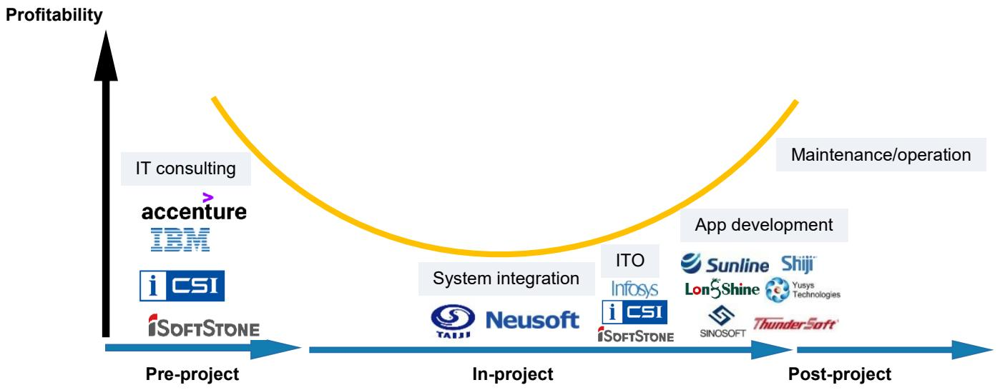

line

| Project Phase | Company           | Profitability |
| ------------- | ----------------- | ------------- |
| Pre-project    | IT consulting      | High          |
| Pre-project    | accenture IBM      | Medium        |
| Pre-project    | i CSI             | Low           |
| Pre-project    | iSOFTSTONE         | Low           |
| In-project     | System integration| Low           |
| In-project     | Neusoft           | Medium        |
| In-project     | i CSI             | Medium        |
| In-project     | iSOFTSTONE        | Medium        |
| Post-project   | App development   | High          |
| Post-project   | Sunline           | Medium        |
| Post-project   | LongShine         | Low           |
| Post-project   | Yusys Technologies | Low         |
| Post-project   | Sinosoft          | Low           |
| Post-project   | ThunderSoft       | Low           |
| Post-project   | Maintenance/operation | High        |

<table><tr><td>Features</td><td>IT consulting</td><td>System integration</td><td>ITO</td><td>App development</td><td>Maintenance/operation</td></tr><tr><td>Pricing model</td><td>Project-based</td><td>Mark-up on costs</td><td>Labor/time-based</td><td>Project-based</td><td>Fixed terms</td></tr><tr><td>Frequency</td><td>One-time</td><td>One-time</td><td>Recurring</td><td>One-time</td><td>Recurring</td></tr><tr><td>Gross margin</td><td>~50%</td><td>&lt;10%</td><td>~20%</td><td>30%+</td><td>60%+</td></tr><tr><td>Talent requirement</td><td>High</td><td>Low</td><td>Low</td><td>Mid</td><td>Mid</td></tr></table>

Source: MS

# AI Agent

1. Understand and interact with its environment (receive inputs)   
2. Collect and connect to data   
3. Take action autonomously without using pre-determined rules   
4. Learns from its experience over time

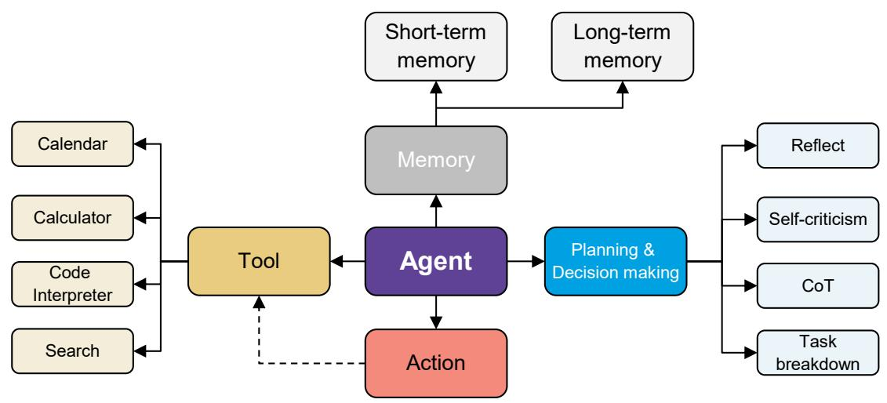

flowchart

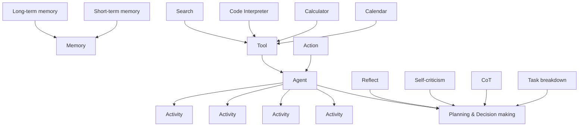
```mermaid
graph TD
    A["Tool"] --> B["Agent"]
    B --> C["Planning & Decision making"]
    D["Short-term memory"] --> E["Memory"]
    F["Long-term memory"] --> E
    G["Calendar"] --> A
    H["Calculator"] --> A
    I["Code Interpreter"] --> A
    J["Search"] --> A
    K["Action"] --> B
    L["Reflect"] --> C
    M["Self-criticism"] --> C
    N["CoT"] --> C
    O["Task breakdown"] --> C
    B --> P["Activity"]
    B --> Q["Activity"]
    B --> R["Activity"]
    B --> S["Activity"]
```

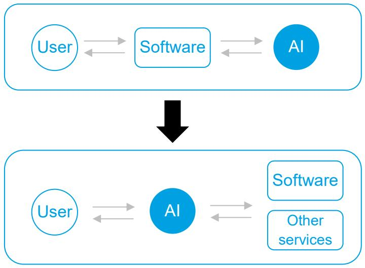

flowchart

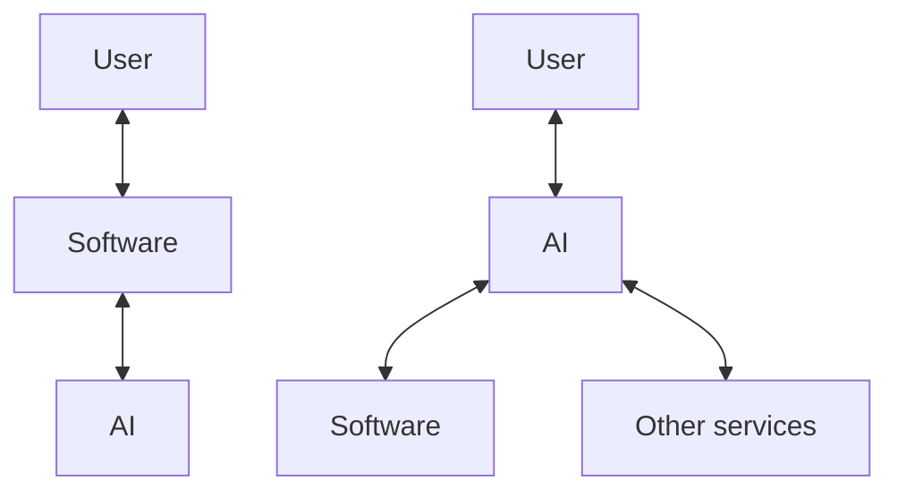
```mermaid
graph TD
    A["User"] <--> B["Software"]
    B <--> C["AI"]
    D["User"] <--> E["AI"]
    E <--> F["Software"]
    E <--> G["Other services"]
```

Source: MS

# Disclosure Section

The information and opinions in MS were prepared or are disseminated by MS Asia Limited (which accepts the responsibility for its contents) and/or MS Asia (Singapore) Pte. (Registration number 199206298Z) and/or MS Asia (Singapore) Securities Pte Ltd (Registration number 200008434H), regulated by the Monetary Authority of Singapore (which accepts legal responsibility for its contents and should be contacted with respect to any matters arising from, or in connection with, MS), and/or MS Taiwan Limited and/or MS & Co International plc, Seoul Branch, and/or MS Australia Limited (A.B.N. 67 003 734 576, holder of Australian financial services license No. 233742, which accepts responsibility for its contents), and/or MS Wealth Management Australia Pty Ltd (A.B.N. 19 009 145 555, holder of Australian financial services license No. 240813, which accepts responsibility for its contents), and/or MS India Company Private Limited having Corporate Identification No (CIN) U22990MH1998PTC115305, regulated by the Securities and Exchange Board of India ("SEBI") and holder of licenses as a Research Analyst (SEBI Registration No. INH000001105); Stock Broker (SEBI Stock Broker Registration No. INZ000244438), Merchant Banker (SEBI Registration No. INM000011203), and depository participant with National Securities Depository Limited (SEBI Registration No. IN-DP-NSDL-567-2021) having registered office at Altimus, Level 39 & 40, Pandurang Budhkar Marg, Worli, Mumbai 400018, India; Telephone no. +91-22-61181000; Compliance Officer Details: Mr. Tejarshi Hardas, Tel. No.: +91-22-61181000 or Email: tejarshi.hardas@morganstanley.com; Grievance officer details: Mr. Tejarshi Hardas, Tel. No.: +91-22-61181000 or Email: msic-compliance@morganstanley.com which accepts the responsibility for its contents and should be contacted with respect to any matters arising from, or in connection with, MS, and their affiliates (collectively, "MS"). MS India Company Private Limited (MSICPL) may use AI tools in providing research services. All recommendations contained herein are made by the duly qualified research analysts.

For important disclosures, stock price charts and equity rating histories regarding companies that are the subject of this report, please see the MS Disclosure Website at www.morganstanley.com/eqr/disclosures/webapp/generalresearch, or contact your investment representative or MS at 1585 Broadway, (Attention: Research Management), New York, NY, 10036 USA.

For valuation methodology and risks associated with any recommendation, rating or price target referenced in this research report, please contact the Client Support Team as follows: US/Canada +1 800 303-2495; Hong Kong +852 2848-5999; Latin America +1 718 754-5444 (U.S.); London +44 (0)20-7425-8169; Singapore +65 6834-6860; Sydney +61 (0)2-9770-1505; Tokyo +81 (0)3-6836-9000. Alternatively you may contact your investment representative or MS at 1585 Broadway, (Attention: Research Management), New York, NY 10036 USA.

# Analyst Certification

The following analysts hereby certify that their views about the companies and their securities discussed in this report are accurately expressed and that they have not received and will not receive direct or indirect compensation in exchange for expressing specific recommendations or views in this report: Lydia Lin; Yang Liu.

# Global Research Conflict Management Policy

MS has been published in accordance with our conflict management policy, which is available at www.morganstanley.com/institutional/research/conflictpolicies. A Portuguese version of the policy can be found at www.morganstanley.com.br

# Important Regulatory Disclosures on Subject Companies

As of April 30, 2026, MS beneficially owned 1% or more of a class of common equity securities of the following companies covered in MS: Kingdee International Software Group, Meitu Inc.

Within the last 12 months, MS managed or co-managed a public offering (or 144A offering) of securities of Kingsoft Corp Ltd, MiniMax.

Within the last 12 months, MS has received compensation for investment banking services from Kingsoft Corp Ltd, MiniMax.

In the next 3 months, MS expects to receive or intends to seek compensation for investment banking services from Beijing Kingsoft Office Software Inc, Chinasoft International Ltd, Glodon Co. Ltd., Hundsun Technologies Inc., Kingdee International Software Group, Kingsoft Corp Ltd, Meitu Inc, MiniMax, Tuya Inc., Yonyou Network Technology Co Ltd.

Within the last 12 months, MS has received compensation for products and services other than investment banking services from Kingsoft Corp Ltd.

Within the last 12 months, MS has provided or is providing investment banking services to, or has an investment banking client relationship with, the following company: Beijing Kingsoft Office Software Inc, Chinasoft International Ltd, Glodon Co. Ltd., Hundsun Technologies Inc., Kingdee International Software Group, Kingsoft Corp Ltd, Meitu Inc, MiniMax, Tuya Inc., Yonyou Network Technology Co Ltd.

Within the last 12 months, MS has either provided or is providing non-investment banking, securities-related services to and/or in the past has entered into an agreement to provide services or has a client relationship with the following company: Beisen Holding Limited, Kingsoft Corp Ltd, Tuya Inc..

The equity research analysts or strategists principally responsible for the preparation of MS have received compensation based upon various factors, including quality of research, investor client feedback, stock picking, competitive factors, firm revenues and overall investment banking revenues. Equity Research analysts' or strategists' compensation is not linked to investment banking or capital markets transactions performed by MS or the profitability or revenues of particular trading desks.

MS and its affiliates do business that relates to companies/instruments covered in MS, including market making, providing liquidity, fund management, commercial banking, extension of credit, investment services and investment banking. MS sells to and buys from customers the securities/instruments of companies covered in MS on a principal basis. MS may have a position in the debt of the Company or instruments discussed in this report. MS trades or may trade as principal in the debt securities (or in related derivatives) that are the subject of the debt research report.

Certain disclosures listed above are also for compliance with applicable regulations in non-US jurisdictions.

# STOCK RATINGS

MS uses a relative rating system using terms such as Overweight, Equal-weight, Not-Rated or Underweight (see definitions below). MS does not assign ratings of Buy, Hold or Sell to the stocks we cover. Overweight, Equal-weight, Not-Rated and Underweight are not the equivalent of buy, hold and sell. Investors should carefully read the definitions of all ratings used in MS. In addition, since MS contains more complete information concerning the analyst's views, investors should carefully read MS, in its entirety, and not infer the contents from the rating alone. In any case, ratings (or research) should not be used or relied upon as investment advice. An investor's decision to buy or sell a stock should depend on individual circumstances (such as the investor's existing holdings) and other considerations.

# Global Stock Ratings Distribution

(as of May 31, 2026)

The Stock Ratings described below apply to MS's Fundamental Equity Research and do not apply to Debt Research produced by the Firm.

For disclosure purposes only (in accordance with FINRA requirements), we include the category headings of Buy, Hold, and Sell alongside our ratings of Overweight, Equal-weight, Not-Rated and Underweight. MS does not assign ratings of Buy, Hold or Sell to the stocks we cover. Overweight, Equal-weight, Not-Rated and Underweight are not the equivalent of buy, hold, and sell but represent recommended relative weightings (see definitions below). To satisfy regulatory requirements, we correspond Overweight, our most positive stock rating, with a buy recommendation; we correspond Equal-weight and Not-Rated to hold and Underweight to sell recommendations, respectively.

<table><tr><td></td><td colspan="2">Coverage Universe</td><td colspan="3">Investment Banking Clients (IBC)</td><td colspan="2">Other Material Investment ServicesClients (MISC)</td></tr><tr><td>Stock RatingCategory</td><td>Count</td><td>% of Total</td><td>Count</td><td>% of Total IBC</td><td>% of RatingCategory</td><td>Count</td><td>% of Total OtherMISC</td></tr><tr><td>Overweight/Buy</td><td>1542</td><td>42%</td><td>465</td><td>51%</td><td>30%</td><td>707</td><td>43%</td></tr><tr><td>Equal-weight/Hold</td><td>1571</td><td>43%</td><td>369</td><td>40%</td><td>23%</td><td>723</td><td>44%</td></tr><tr><td>Not-Rated/Hold</td><td>3</td><td>0%</td><td>0</td><td>0%</td><td>0%</td><td>1</td><td>0%</td></tr><tr><td>Underweight/Sell</td><td>551</td><td>15%</td><td>86</td><td>9%</td><td>16%</td><td>201</td><td>12%</td></tr><tr><td>Total</td><td>3,667</td><td></td><td>920</td><td></td><td></td><td>1632</td><td></td></tr></table>

Data include common stock and ADRs currently assigned ratings. Investment Banking Clients are companies from whom MS received investment banking compensation in the last 12 months. Due to rounding off of decimals, the percentages provided in the "% of total" column may not add up to exactly 100 percent.

# Analyst Stock Ratings

Overweight (O). The stock's total return is expected to exceed the average total return of the analyst's industry (or industry team's) coverage universe, on a risk-adjusted basis, over the next 12-18 months.

Equal-weight (E). The stock's total return is expected to be in line with the average total return of the analyst's industry (or industry team's) coverage universe, on a risk-adjusted basis, over the next 12-18 months.

Not-Rated (NR). Currently the analyst does not have adequate conviction about the stock's total return relative to the average total return of the analyst's industry (or industry team's) coverage universe, on a risk-adjusted basis, over the next 12-18 months.

Underweight (U). The stock's total return is expected to be below the average total return of the analyst's industry (or industry team's) coverage universe, on a risk-adjusted basis, over the next 12-18 months.

Unless otherwise specified, the time frame for price targets included in MS is 12 to 18 months.

# Analyst Industry Views

Attractive (A): The analyst expects the performance of his or her industry coverage universe over the next 12-18 months to be attractive vs. the relevant broad market benchmark, as indicated below.

In-Line (I): The analyst expects the performance of his or her industry coverage universe over the next 12-18 months to be in line with the relevant broad market benchmark, as indicated below. Cautious (C): The analyst views the performance of his or her industry coverage universe over the next 12-18 months with caution vs. the relevant broad market benchmark, as indicated below. Benchmarks for each region are as follows: North America - S&P 500; Latin America - relevant MSCI country index or MSCI Latin America Index; Europe - MSCI Europe; Japan - TOPIX; Asia - relevant MSCI country index or MSCI sub-regional index or MSCI AC Asia Pacific ex Japan Index.

# Important Disclosures for MS Smith Barney LLC Customers

Important disclosures regarding any material conflict of interest that can reasonably be expected to have influenced MS Smith Barney LLC's choice of a third-party research provider or the subject company of a third-party research report, are available on the MS Wealth Management disclosure website at www.morganstanley.com/online/researchdisclosures. For MS specific disclosures, you may refer to https://www.morganstanley.com/eqr/disclosures/webapp/generalresearch.

Each MS report is reviewed and approved on behalf of MS Smith Barney LLC. This review and approval is conducted by the same person who reviews the research report on behalf of MS. This could create a conflict of interest.

# Other Important Disclosures

MS policy is to update research reports as and when the Research Analyst and Research Management deem appropriate, based on developments with the issuer, the sector, or the market that may have a material impact on the research views or opinions stated therein. In addition, certain Research publications are intended to be updated on a regular periodic basis (weekly/monthly/quarterly/annual) and will ordinarily be updated with that frequency, unless the Research Analyst and Research Management determine that a different publication schedule is appropriate based on current conditions.

MS is not acting as a municipal advisor and the opinions or views contained herein are not intended to be, and do not constitute, advice within the meaning of Section 975 of the Dodd-Frank Wall Street Reform and Consumer Protection Act.

MS produces an equity research product called a "Tactical Idea." Views contained in a "Tactical Idea" on a particular stock may be contrary to the recommendations or views expressed in research on the same stock. This may be the result of differing time horizons, methodologies, market events, or other factors. For all research available on a particular stock, please contact your sales representative or go to Matrix at http://www.morganstanley.com/matrix.

MS is provided to our clients through our proprietary research portal on Matrix and also distributed electronically by MS to clients. Certain, but not all, MS products are also made available to clients through third-party vendors or redistributed to clients through alternate electronic means as a convenience. For access to all available MS, please contact your sales representative or go to Matrix at http://www.morganstanley.com/matrix.

Any access and/or use of MS is subject to MS's Terms of Use (http://www.morganstanley.com/terms.html). By accessing and/or using MS, you are indicating that you have read and agree to be bound by our Terms of Use (http://www.morganstanley.com/terms.html). In addition you consent to MS processing your personal data and using cookies in accordance with our Privacy Policy and our Global Cookies Policy (http://www.morganstanley.com/privacy\_pledge.html), including for the purposes of setting your preferences and to collect readership data so that we can deliver better and more personalized service and products to you. To find out more information about how MS processes personal data, how we use cookies and how to reject cookies see our Privacy Policy and our Global Cookies Policy (http://www.morganstanley.com/privacy\_pledge.html). Please use the provided link to review the Terms and Conditions and Most Important Terms and Conditions for MS India Company Private Limited (https://www.morganstanley.com/assets/pdfs/about-us-global-offices/india/Terms\_and\_conditions.pdf) and the following link to review the audit report (https://ny.matrix.ms.com/eqr/research/webapp/researchdocs/MSICPL\_Morgan\_Stanley\_Research\_Audit\_Report.pdf).

If you do not agree to our Terms of Use and/or if you do not wish to provide your consent to MS processing your personal data or using cookies please do not access our research. MS does not provide individually tailored investment advice. MS has been prepared without regard to the circumstances and objectives of those who receive it. MS recommends that investors independently evaluate particular investments and strategies, and encourages investors to seek the advice of a financial adviser. The appropriateness of an investment or strategy will depend on an investor's circumstances and objectives. The securities, instruments, or strategies discussed in MS may not be suitable for all investors, and certain investors may not be eligible to purchase or participate in some or all of them. MS is not an offer to buy or sell or the solicitation of an offer to buy or sell any security/instrument or to participate in any particular trading strategy. The value of and income from your investments may vary because of changes in interest rates, foreign exchange rates, default rates, prepayment rates, securities/instruments prices, market indexes, operational or financial conditions of companies or other factors. There may be time limitations on the exercise of options or other rights in securities/instruments transactions. Past performance is not necessarily a guide to future performance. Estimates of future performance are based on assumptions that may not be realized. If provided, and unless otherwise stated, the closing price on the cover page is that of the primary exchange for the subject company's securities/instruments.

The fixed income research analysts, strategists or economists principally responsible for the preparation of MS have received compensation based upon various factors, including quality, accuracy and value of research, firm profitability or revenues (which include fixed income trading and capital markets profitability or revenues), client feedback and competitive factors. Fixed Income Research analysts', strategists' or economists' compensation is not linked to investment banking or capital markets transactions performed by MS or the profitability or revenues of particular trading desks.

The "Important Regulatory Disclosures on Subject Companies" section in MS lists all companies mentioned where MS owns 1% or more of a class of common equity securities of the companies. For all other companies mentioned in MS, MS may have an investment of less than 1% in securities/instruments or derivatives of securities/instruments of companies and may trade them in ways different from those discussed in MS. Employees of MS not involved in the preparation of MS may have investments in securities/instruments or derivatives of securities/instruments of companies mentioned and may trade them in ways different from those discussed in MS. Derivatives may be issued by MS or associated persons.

With the exception of information regarding MS, MS is based on public information. MS makes every effort to use reliable, comprehensive information, but we make no representation that it is accurate or complete. We have no obligation to tell you when opinions or information in MS change apart from when we intend to discontinue equity research coverage of a subject company. Facts and views presented in MS have not been reviewed by, and may not reflect information known to, professionals in other MS business areas, including investment banking personnel.

MS personnel may participate in company events such as site visits and are generally prohibited from accepting payment by the company of associated expenses unless pre-approved by authorized members of Research management.

MS may make investment decisions that are inconsistent with the recommendations or views in this report.

To our readers based in Taiwan or trading in Taiwan securities/instruments: Information on securities/instruments that trade in Taiwan is distributed by MS Taiwan Limited ("MSTL"). Such information is for your reference only. The reader should independently evaluate the investment risks and is solely responsible for their investment decisions. MS may not be distributed to the public media or quoted or used by the public media without the express written consent of MS. Any non-customer reader within the scope of Article 7-1 of the Taiwan Stock Exchange Recommendation Regulations accessing and/or receiving MS is not permitted to provide MS to any third party (including but not limited to related parties, affiliated companies and any other third parties) or engage in any activities regarding MS which may create or give the appearance of creating a conflict of interest. Information on securities/instruments that do not trade in Taiwan is for informational purposes only and is not to be construed as a recommendation or a solicitation to trade in such securities/instruments. MSTL may not execute transactions for clients in these securities/instruments.

Certain information in MS was sourced by employees of the Shanghai Representative Office of MS Asia Limited for the use of MS Asia Limited. MS is not incorporated under PRC law and the research in relation to this report is conducted outside the PRC. MS does not constitute an offer to sell or the solicitation of an offer to buy any securities in the PRC. PRC investors shall have the relevant qualifications to invest in such securities and shall be responsible for obtaining all relevant approvals, licenses, verifications and/or registrations from the relevant governmental authorities themselves. Neither this report nor any part of it is intended as, or shall constitute, provision of any consultancy or advisory service of securities investment as defined under PRC law. Such information is provided for your reference only.

MS is disseminated in Brazil by MS C.T.V.M. S.A. located at Av. Brigadeiro Faria Lima, 3600, 6th floor, São Paulo - SP, Brazil; and is regulated by the Comissão de Valores Mobiliários; in Mexico by MS México, Casa de Bolsa, S.A. de C.V which is regulated by Comision Nacional Bancaria y de Valores. Paseo de los Tamarindos 90, Torre 1, Col. Bosques de las Lomas Floor 29, 05120 Mexico City; in Japan by MS MUFG Securities Co., Ltd. and, for Commodities related research reports only, MS Capital Group Japan Co., Ltd; in Hong Kong by MS Asia Limited (which accepts responsibility for its contents) and by MS Bank Asia Limited; in Singapore by MS Asia (Singapore) Pte. (Registration number 199206298Z) and/or MS Asia (Singapore) Securities Pte Ltd (Registration number 200008434H), regulated by the Monetary Authority of Singapore (which accepts legal responsibility for its contents and should be contacted with respect to any matters arising from, or in connection with, MS) and by MS Bank Asia Limited, Singapore Branch (Registration number T14FC0118J); in Australia to "wholesale clients" within the meaning of the Australian Corporations Act by MS Australia Limited A.B.N. 67 003 734-576, holder of Australian financial services license No. 233742, which accepts responsibility for its contents; in Australia to "wholesale clients" and "retail clients" within the meaning of the Australian Corporations Act by MS Wealth Management Australia Pty Ltd (A.B.N. 19 009 145 555, holder of Australian financial services license No. 240813, which accepts responsibility for its contents; in Korea by MS & Co International plc, Seoul Branch; in India by MS India Company Private Limited having Corporate Identification No (CIN) U22990MH1998PTC115305, regulated by the Securities and Exchange Board of India ("SEBI") and holder of licenses as a Research Analyst (SEBI Registration No. INH000001105); Stock Broker (SEBI Stock Broker Registration No. INZ000244438), Merchant Banker (SEBI Registration No. INM000011203), and depository participant with National Securities Depository Limited (SEBI Registration No. IN-DP-NSDL-567-2021) having registered office at Altimus, Level 39 & 40, Pandurang Budhkar Marg, Worli, Mumbai 400018, India; Telephone no. +91-22-61181000; Compliance Officer Details: Mr. Tejarshi Hardas, Tel. No.: +91-22-61181000 or Email: tejarshi.hardas@morganstanley.com; Grievance officer details: Mr. Tejarshi Hardas, Tel. No.: +91-22-61181000 or Email: msic-compliance@morganstanley.com. MS India Company Private Limited (MSICPL) may use AI tools in providing research services. All recommendations contained herein are made by the duly qualified research analysts; in Canada by MS Canada Limited; in Germany and the European Economic Area where required by MS Europe S.E., authorised and regulated by Bundesanstalt fuer Finanzdienstleistungsaufsicht (BaFin) under the reference number 149169; in the US by MS & Co. LLC, which accepts responsibility for its contents. MS & Co. International plc, authorized by the Prudential Regulation Authority and regulated by the Financial Conduct Authority and the Prudential Regulation Authority, disseminates in the UK research that it has prepared, and research which has been prepared by any of its affiliates, only to persons who (i)

are investment professionals falling within Article 19(5) of the Financial Services and Markets Act 2000 (Financial Promotion) Order 2005 (as amended, the "Order"); (ii) are persons who are high net worth entities falling within Article 49(2)(a) to (d) of the Order; or (iii) are persons to whom an invitation or inducement to engage in investment activity (within the meaning of section 21 of the Financial Services and Markets Act 2000, as amended) may otherwise lawfully be communicated or caused to be communicated. RMB MS Proprietary Limited is a member of the JSE Limited and A2X (Pty) Ltd. RMB MS Proprietary Limited is a joint venture owned equally by MS International Holdings Inc. and RMB Investment Advisory (Proprietary) Limited, which is wholly owned by FirstRand Limited. The information in MS is being disseminated by MS Saudi Arabia, regulated by the Capital Market Authority in the Kingdom of Saudi Arabia, and is directed at Sophisticated investors only.

MS Hong Kong Securities Limited is the liquidity provider/market maker for securities of Chinasoft International Ltd, Kingdee International Software Group, Kingsoft Corp Ltd, Knowledge Atlas Technology JSC Ltd, Meitu Inc, MiniMax listed on the Stock Exchange of Hong Kong Limited. An updated list can be found on HKEx website: http://www.hkex.com.hk.

The information in MS is being communicated by MS & Co. International plc (DIFC Branch), regulated by the Dubai Financial Services Authority (the DFSA) or by MS & Co. International plc (ADGM Branch), regulated by the Financial Services Regulatory Authority Abu Dhabi (the FSRA), and is directed at Professional Clients only, as defined by the DFSA or the FSRA, respectively. The financial products or financial services to which this research relates will only be made available to a customer who we are satisfied meets the regulatory criteria of a Professional Client. A distribution of the different MS Research ratings or recommendations, in percentage terms for Investments in each sector covered, is available upon request from your sales representative.

The information in MS is being communicated by MS & Co. International plc (QFC Branch), regulated by the Qatar Financial Centre Regulatory Authority (the QFCRA), and is directed at business customers and market counterparties only and is not intended for Retail Customers as defined by the QFCRA.

As required by the Capital Markets Board of Turkey, investment information, comments and recommendations stated here, are not within the scope of investment advisory activity. Investment advisory service is provided exclusively to persons based on their risk and income preferences by the authorized firms. Comments and recommendations stated here are general in nature. These opinions may not fit to your financial status, risk and return preferences. For this reason, to make an investment decision by relying solely to this information stated here may not bring about outcomes that fit your expectations.

The trademarks and service marks contained in MS are the property of their respective owners. Third-party data providers make no warranties or representations relating to the accuracy, completeness, or timeliness of the data they provide and shall not have liability for any damages relating to such data. The Global Industry Classification Standard (GICS) was developed by and is the exclusive property of MSCI and S&P.

MS, or any portion thereof may not be reprinted, sold or redistributed without the written consent of MS.

Indicators and trackers referenced in MS may not be used as, or treated as, a benchmark under Regulation EU 2016/1011, or any other similar framework.

The issuers and/or fixed income products recommended or discussed in certain fixed income research reports may not be continuously followed. Accordingly, investors should regard those fixed income research reports as providing stand-alone analysis and should not expect continuing analysis or additional reports relating to such issuers and/or individual fixed income products. MS may hold, from time to time, material financial and commercial interests regarding the company subject to the Research report.

Registration granted by SEBI and certification from the National Institute of Securities Markets (NISM) in no way guarantee performance of the intermediary or provide any assurance of returns to investors. Investment in securities market are subject to market risks. Read all the related documents carefully before investing.

INDUSTRY COVERAGE: Greater China IT Services and Software 

<table><tr><td>COMPANY (TICKER)</td><td>RATING (AS OF)</td><td>PRICE* (06/02/2026)</td></tr><tr><td colspan="3">Gary Yu</td></tr><tr><td>Knowledge Atlas Technology JSC Ltd (2513.HK)</td><td>O (02/20/2026)</td><td>HK$1,412.00</td></tr><tr><td>MiniMax (0100.HK)</td><td>O (02/20/2026)</td><td>HK$667.50</td></tr><tr><td colspan="3">Lydia Lin</td></tr><tr><td>Beisen Holding Limited (9669.HK)</td><td>O (06/23/2025)</td><td>HK$4.10</td></tr><tr><td>Chinasoft International Ltd (0354.HK)</td><td>U (05/04/2026)</td><td>HK$4.36</td></tr><tr><td>Glodon Co. Ltd. (002410.SZ)</td><td>E (08/23/2023)</td><td>Rmb10.10</td></tr><tr><td>Hundsun Technologies Inc. (600570.SS)</td><td>U (04/07/2025)</td><td>Rmb24.38</td></tr><tr><td>Longshine Technology Group Co Ltd (300682.SZ)</td><td>U (09/17/2025)</td><td>Rmb12.47</td></tr><tr><td>Meitu Inc (1357.HK)</td><td>O (10/01/2024)</td><td>HK$5.59</td></tr><tr><td colspan="3">Sharon Shih</td></tr><tr><td>iFlytek Co Ltd (002230.SZ)</td><td>E (04/20/2021)</td><td>Rmb48.26</td></tr><tr><td colspan="3">Yang Liu</td></tr><tr><td>Beijing Kingsoft Office Software Inc (688111.SS)</td><td>U (08/26/2024)</td><td>Rmb262.25</td></tr><tr><td>Kingdee International Software Group (0268.HK)</td><td>E (03/19/2025)</td><td>HK$8.99</td></tr><tr><td>Kingsoft Corp Ltd (3888.HK)</td><td>E (07/21/2025)</td><td>HK$23.54</td></tr><tr><td>Sangfor Technologies Inc (300454.SZ)</td><td>E (07/05/2024)</td><td>Rmb120.01</td></tr><tr><td>Tuya Inc. (TUYA.N)</td><td>O (11/29/2023)</td><td>US$2.15</td></tr><tr><td>Wangsu Science &amp; Technology (300017.SZ)</td><td>U (11/12/2024)</td><td>Rmb15.18</td></tr><tr><td>Yonyou Network Technology Co Ltd (600588.SS)</td><td>U (11/12/2024)</td><td>Rmb11.28</td></tr></table>

Stock Ratings are subject to change. Please see latest research for each company.   
\* Historical prices are not split adjusted.

© 2026 MS