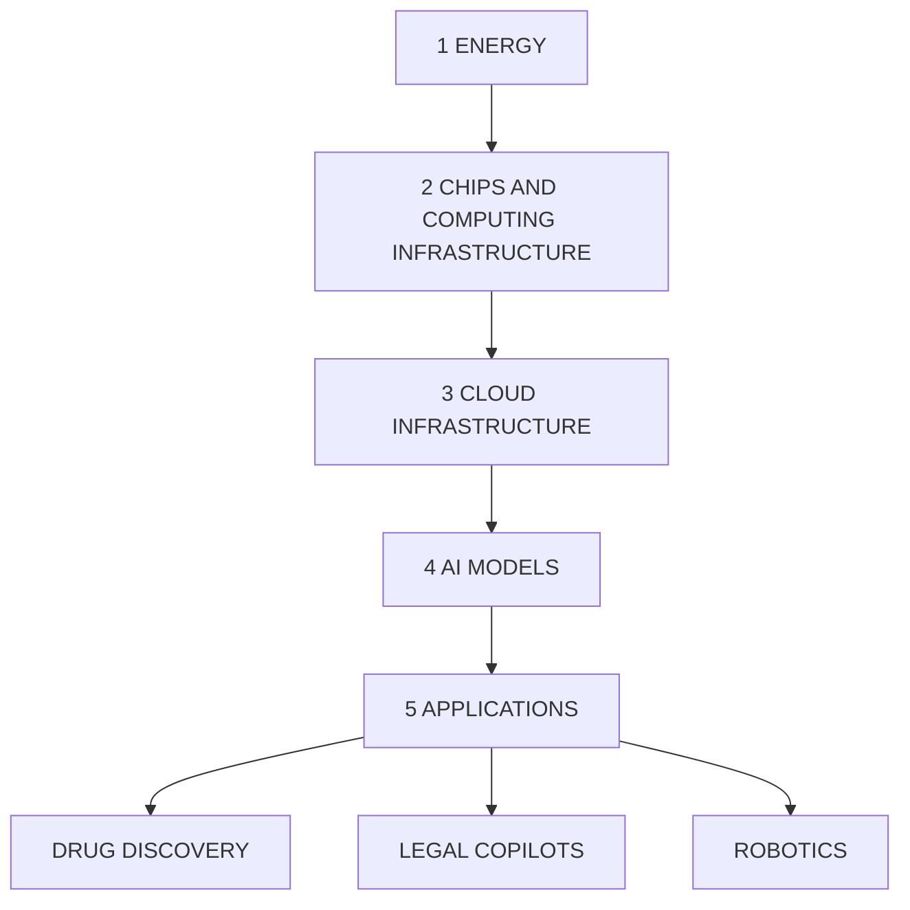

You are a senior financial newsletter editor with a consulting-style strategy lens. You turn research-report material into a long-form English article that is structured, insightful, and suitable for a serious business audience.

Objective:
- Write an English Markdown article based on the report parsing below.
- Target length: around 2200 words, plus or minus 15%.
- Tone: serious, analytical, strategic, and readable.
- The article should not feel like a summary. It should make an argument.
- You may extend the report's logic into reasonable second-order implications, but do not invent data, company actions, or quotes.
- Do not disclose every detail. Leave several meaningful open questions that make readers want the full report.

McKinsey-style writing principles:
1. Answer first: open with the controlling idea, not background.
2. Governing thought: every section must support the main answer.
3. Mutually exclusive, collectively exhaustive logic: avoid overlapping sections.
4. So what: every section must explain why the point matters.
5. Synthesis over summary: do not list facts; interpret what the pattern means.
6. Action titles: section headings must be complete, insight-bearing sentences. Do not use generic headings such as "Key Takeaways", "Market Background", "Core View", or "Reader Implications".
7. Natural hooks: if you want readers to join the community or read the full report, the hook should emerge from unresolved analytical questions, not from promotional language.

Required Markdown structure:
- `# Title`: make it a direct argument, not a topic label.
- Opening: 4-6 short paragraphs that state the main thesis and why now matters.
- 4-6 `##` sections. Each `##` heading must be an action title: a sentence that tells the reader the insight.
- One section should identify what the report does not fully answer yet.
- One section should translate the report into a decision framework for readers.
- Final section: naturally invite readers to join the community or read the full report using this CTA: Join the community to read the full report and review the original charts.
- End with: `*This article is for learning and discussion only and does not constitute investment advice.*`

Content boundaries:
- Do not mention specific investment bank names such as GS. Use "a global investment bank report" if needed.
- Do not use emoji.
- Do not write like a viral post.
- Do not output your reasoning process.
- Do not generate image Markdown; the system will insert original MinerU images afterward.

Report parsing:
"""
# Investor Presentation | Asia Pacific

# Asia Summer School: China Software and IT Services

MS ASIA LIMITED+

Yang Liu

Equity Analyst

Yang.Liu@morganstanley.com +852 2239-1911

Lydia Lin

Equity Analyst

Lydia.Lin@morganstanley.com +852 2239-1572

text_image

Asia Summer School 2026

text_image

India Investment Forum 2026

GREATER CHINA IT SERVICES AND SOFTWARE

Asia Pacific

Industry View

In-Line

MS does and seeks to do business with companies covered in MS. As a result, investors should be aware that the firm may have a conflict of interest that could affect the objectivity of MS. Investors should consider MS as only a single factor in making their investment decision.

For analyst certification and other important disclosures, refer to the Disclosure Section, located at the end of this report.

+= Analysts employed by non-U.S. affiliates are not registered with FINRA, may not be associated persons of the member and may not be subject to FINRA restrictions on communications with a subject company, public appearances and trading securities held by a research analyst account.

# Asia Summer School

# Enterprise Software Overview

# Industry Drivers

# Supply

- New technology: cloud -> AI   
- Delivery   
- Any software must run on some hardware

natural_image

Two gray arrows pointing in opposite directions (no text or symbols)

# Demand

• Nominal GDP growth with late-cycle effect   
• Efficiency improvement to hedge rising labor costs   
- Government's requirement on digitization and IT localization   
- Industry cycle: hardware/infra vs. software/IT services

# Industry Growth: Reported Numbers

Industry revenue (qtly growth)   

line

| Date    | Software & IT services growth | Nominal GDP (RHS) |
|---------|-------------------------------|-------------------|
| Mar-19  | ~20%                          | ~8%               |
| Jun-19  | ~25%                          | ~7%               |
| Sep-19  | ~30%                          | ~6%               |
| Dec-19  | ~0%                           | ~-5%              |
| Mar-20  | ~-5%                          | ~-10%             |
| Jun-20  | ~10%                          | ~5%               |
| Sep-20  | ~20%                          | ~10%              |
| Dec-20  | ~25%                          | ~15%              |
| Mar-21  | ~50%                          | ~25%              |
| Jun-21  | ~30%                          | ~20%              |
| Sep-21  | ~25%                          | ~15%              |
| Dec-21  | ~20%                          | ~10%              |
| Mar-22  | ~15%                          | ~5%               |
| Jun-22  | ~10%                          | ~0%               |
| Sep-22  | ~5%                           | ~5%               |
| Dec-22  | ~0%                           | ~10%              |
| Mar-23  | ~5%                           | ~15%              |
| Jun-23  | ~0%                           | ~10%              |
| Sep-23  | ~0%                           | ~10%              |
| Dec-23  | ~0%                           | ~10%              |
| Mar-24  | ~5%                           | ~10%              |
| Jun-24  | ~0%                           | ~10%              |
| Sep-24  | ~-5%                          | ~10%              |
| Dec-24  | ~0%                           | ~10%              |
| Mar-25  | ~0%                           | ~10%              |
| Jun-25  | ~0%                           | ~10%              |
| Sep-25  | ~0%                           | ~10%              |
| Dec-25  | ~0%                           | ~10%              |
| Mar-26  | ~5%                           | ~10%              |

MIIT industry revenue vs nominal GDP growth   
  
Source: CEIC, MIIT, MS.

# Industry Growth: China CIO Survey Results

2026 external IT spending growth expectations by sector   

bar

| Category | 2H25 Survey (%) | 1H26 Survey (%) |
|---|---|---|
| Hardware, Communication & Networking Equipment | 8.1 | 3.6 |
| Software | 13.1 | 5.3 |
| Professional Services | 8.6 | 7.0 |
| Total estimated external IT Spending Change | 12.6 | 4.8 |

Expectations of potential IT budget revisions this year   

bar_stacked

| Survey | Upward (%) | Flat (%) | Downward (%) |
| :--- | :--- | :--- | :--- |
| 2H20 Survey | 44 | 31 | 26 |
| 1H21 Survey | 62 | 28 | 11 |
| 2H21 Survey | 55 | 34 | 11 |
| 1H22 Survey | 56 | 27 | 17 |
| 2H22 Survey | 46 | 26 | 27 |
| 1H23 Survey | 64 | 21 | 15 |
| 2H23 Survey | 54 | 28 | 18 |
| 1H24 Survey | 46 | 35 | 20 |
| 2H24 Survey | 31 | 34 | 35 |
| 1H25 Survey | 31 | 37 | 32 |
| 2H25 Survey | 48 | 37 | 15 |
| 1H26 Survey | 38 | 35 | 27 |
1H27 Survey (x) = 1.7x; 1H28 Survey (x) = 5.7x; 1H29 Survey (x) = 4.8x; 1H30 Survey (x) = 3.4x; 1H31 Survey (x) = 1.7x; 1H32 Survey (x) = 4.4x; 1H33 Survey (x) = 3.0x; 1H34 Survey (x) = 2.3x; 1H35 Survey (x) = 0.9x; 1H36 Survey (x) = 0.9x; 1H37 Survey (x) = 3.2x; 1H38 Survey (x) = 1.4x.

Overall external IT spending growth expectations   

line

| Period | 2020 Budget (%) | 2021 Budget (%) | 2022 Budget (%) | 2023 Budget (%) | 2024 Budget (%) | 2025 Budget (%) | 2026 Budget (%) |
|---|---|---|---|---|---|---|---|
| 2H20 | 12.3 | 15.1 | - | - | - | - | - |
| 1H21 | 10.3 | 12.9 | - | - | - | - | - |
| 2H21 | - | 16.8 | 18.7 | - | 18.8 | - | - |
| 1H22 | - | 15.3 | 16.5 | - | - | - | - |
| 2H22 | - | - | 13.0 | - | 15.1 | - | - |
| 1H23 | - | - | 9.3 | 17.0 | - | - | - |
| 2H23 | - | - | - | 9.9 | 13.5 | - | - |
| 1H24 | - | - | - | 8.1 | 9.9 | - | - |
| 2H24 | - | - | - | - | 4.8 | 7.3 | - |
| 1H25 | - | - | - | - | 7.9 | 5.9 | - |
| 2H25 | - | - | - | - | 12.6 | 7.4 | 12.6 |
| 1H26 | - | - | - | - | 5.2 | 4.8 | 5.2 |

IT spending as a % of total revenue in the next 3 years   
  
Source: AlphaWise, MS.

# Global Comparison

US vs. China enterprise IT spending comparison   

bar_stacked

| Year | Country | Hardware (USD bn) | IT Services (USD bn) | Software (USD bn) |
| :--- | :--- | :--- | :--- | :--- |
| 2025 | China | 471 | 17 | 0 |
| 2025 | USA | 768 | 39 | 668 |
| 2026E | China | 452 | 15 | 0 |
| 2026E | USA | 954 | 39 | 786 |
| 2027E | China | 482 | 15 | 0 |
| 2027E | USA | 1184 | 39 | 849 |
| 2028E | China | 561 | 15 | 0 |
| 2028E | USA | 1364 | 39 | 984 |
| 2029E | China | 579 | 15 | 0 |
| 2029E | USA | 1564 | 39 | 1062 |
| 2030E | China | 632 | 15 | 0 |
| 2030E | USA | 1694 | 39 | 1179 |
The chart displays a stacked bar chart with three categories: Hardware, IT Services, and Software. The values in parentheses are explicitly labeled on each segment.

Software & IT spending market share: China at 4.9%

bar

| Year | China (%) | USA (%) |
| :--- | :--- | :--- |
| 2025 | 4.9 | 47.7 |
| 2026E | 4.9 | 48.2 |
| 2027E | 4.8 | 48.5 |
| 2028E | 4.8 | 48.6 |
| 2029E | 4.8 | 48.6 |
| 2030E | 4.7 | 48.6 |

Source: IDC, FactSet, MS. E = IDC estimates.

Software & IT services as a % of total IT spending   

line

| Year | China (%) | USA (%) | Worldwide (%) |
|---|---|---|---|
| 2025 | 22 | 59 | 53 |
| 2026E | 22 | 57 | 53 |
| 2027E | 23 | 53 | 52 |
| 2028E | 23 | 53 | 53 |
| 2029E | 23 | 53 | 54 |
| 2030E | 23 | 54 | 55 |

Software & IT services spending as % of 2025 nominal GDP

bar

| Country | Value (%) |
| :--- | :--- |
| China | 0.6 |
| India | 0.9 |
| Brazil | 1.5 |
| Japan | 2.1 |
| Australia | 2.4 |
| US | 3.6 |

Software Segments by Product   

treemap

| Category | Sub-category | Value ($) | CAGR (%) |
| :--- | :--- | :--- | :--- |
| Applications | Application Development & Deployment | 2025-30 | 11 |
| Kingdee Yonyou Inspur | Applications | 4,594.80 | 12 |
| Enterprise Resource Management (ERM), Engineering, Neusoft Baosight | Applications | 3,883.75 | 6 |
| Glodon ZWSoft | Applications | 3,599.46 | 5 |
| Production | Applications | 3,088.29 | 12 |
| MarketingForce Weimob Youzan NeoCRM | Applications | 2,566.72 | 15 |
| Customer Relationship Management (CRM), Engineering, CeMoR | Applications | 2,566.72 | 15 |
| Kingsoft Office Wondershare | Applications | 3,088.29 | 12 |
| Feishu DingTalk WeCom Weaver | Applications | 1,948.69 | 20 |
| Collaborative, SCM, Security | Applications | 742.07 | 7 |
| System Workflow and Management, Venustech Sangfor Qi An Xin | System Infrastructure Software | 5,617.57 | 6 |
| H3C Sangfor Inspur | Physical and Virtual Computing | 5,617.57 | 1 |
| Storage, Network, Security, Network, Deepexi iFlyTek | System Infrastructure Software | 1,195.05 | 9 |
| System and Service Management, System and Services Management, Network, Nanjing Tech, Data Management Software, Artificial Intelligence Platforms, Tongtech Middleware, FanRuan Analytics and Business Intelligence e, Application Platforms, Data Management Software, Data Management Software, Data Management Software, Data Management Software, Data Management Software, Data Management Software, Data Management Software, Data Management Software, Data Management Software, Data Management Software, Data Management Software, Data Management Software, Data Management Software, Data Management Software, Data Management Software, Data Management Software, Data Management Software, Data Management Software, Data Management Software, Data Management Software, Data Management Software, Data Management Software, Data Management Software, Data Management Software, Data Management Software, Data Management software, Data Management software, Data Management software, Data Management software, Data Management software, Data Management software, Data Management software, Data Management software, Data Management software, Data Management software, Data Management software, Data Management software, Data Management software, Data Management software, Data Management software, Data Management software, Data Management software, Data Management software, Data Management software, Data Management software, Data Management software, Data Management software, Data Management software, Data Management software, Data Management software, Data ManagementSoftware, Data Management software, Data Management software, Data Management software, Data Management software, Data Management software, Data Management software, Data Management software, Data Management software, Data Management software, Data Management software, Data Management software, Data Management software, Data Management software, Data Management software, Data Management software, Data Management software, Data Management software, Data Management software, Data Management software, Data Management software, Data Management software, Data Management software, Data Management software, Data Management software, Data Management Software, Data Management Software, Data Management Software, Data Management Software, Data Management Software, Data Management Software, Data Management Software, Data Management Software, Data Management Software, Data Management Software, Data Management Software, Data Management Software, Data Management Software, Data Management Software, Data Management Software, Data Management Software, Data Management Software, Data Management Software, Data Management Software, Data Management Software, Data Management Software, Data Management Software, Data Management Software, Data Management Software, Data ManagementSoftware,

Source: IDC, MS. E = IDC estimates.

# Growth Outlook

IDC estimates software market to rise at a 13.9% four-year CAGR to 2028   

bar_stacked

| Year | System Infrastructure Software (US$bn) | Application Development & Deployment (US$bn) | Applications (US$bn) |
| :--- | :--- | :--- | :--- |
| 2020 | 10.1 | 5.7 | 15.1 |
| 2021 | 10.5 | 7.3 | 15.4 |
| 2022 | 11.5 | 9.7 | 17.7 |
| 2023 | 12.4 | 11.9 | 20.4 |
| 2024 | 12.5 | 14.0 | 22.2 |
| 2025 | 12.9 | 16.6 | 24.1 |
| 2026E | 13.8 | 20.7 | 26.9 |
| 2027E | 15.1 | 26.4 | 30.4 |
| 2028E | 16.6 | 32.3 | 34.3 |
| 2029E | 18.3 | 38.4 | 38.5 |
| 2030E | 19.9 | 44.3 | 42.7 |
The chart includes a red dashed line indicating growth from US$31bn in 2020 to US$107bn in 2030E, with an annotation showing a 12% growth rate between the two years.

bar

| Category | Application Development & Deployment (%) | System Infrastructure Software (%) |
| :--- | :--- | :--- |
| Applications | SCM | 10 |
| Applications | Production | 6 |
| Applications | Enterprise Resource Management (ERM) | 17 |
| Applications | Engineering | 11 |
| Applications | Customer Relationship Management (CRM) | 22 |
| Applications | Content Workflow and Management | 14 |
| Applications | Collaborative | 24 |
| Application Development & Deployment | Life Cycle Tools | 9 |
| Application Development & Deployment | Middleware | 14 |
| Application Development & Deployment | Data Management Software | 23 |
| Application Development & Deployment | Artificial Intelligence Platforms | 42 |
| Application Development & Deployment | Application Platforms | 20 |
| Application Development & Deployment | App Development | 30 |
| Application Development & Deployment | Analytics and Business Intelligence | 12 |
| System Infrastructure Software | System and Service Management | 16 |
| System Infrastructure Software | Storage | 14 |
| System Infrastructure Software | Security | 16 |
| System Infrastructure Software | Physical and Virtual Computing | 6 |
| System Infrastructure Software | Network | 10 |
| System Infrastructure Software | Endpoint Management | 7 |

Source: IDC, MS. E = IDC estimates.

# AI Cloud Infra

# AI: The 5-layer Cake

# THE AI 5-LAYER CAKE THEORY

# BUILDING THE AI STACK FROM THE GROUND UP

AI is built in layers. Each layer depends on the one below it. Together, they form the full AI stack that powers every AI application we use today.

THE IDEA   

Like a cake, every layer has a purpose. Remove one, and the whole thing can't stand.

# WHY IT MATTERS

Each layer represents a massive opportunity.

The layers work together to deliver end-to-end AI.

The higher the layer, the closer you are to end-user value.

# THE TAKEAWAY

A strong foundation powers everything above it.

flowchart

Each layer is a multi-billion dollar opportunity.

All layers are interdependent and critical.

The highest layers deliver the closest value to users.

# MS

# 5 APPLICATIONS

The top layer where actual economic value and real-world solutions (such as drug discovery, legal copilots, and robotics) are delivered to end users.

# 4 AI MODELS

The foundation models (like LLMs) that sit on top of the infrastructure. This is where most people think "AI" lives.

# 3 CLOUD INFRASTRUCTURE The data centers, hyperscalers, and orchestration that tie the chips together.

# 2 CHIPS AND COMPUTING INFRASTRUCTURE

The hardware layer, which includes GPUs and memory.

# 1 ENERGY

The foundational layer. AI processing and intelligence are generated in real time, which requires massive amounts of power.

Source: MS

# Cloud infra: Data Centers

China data center capacity   

bar_line

| Year   | Total capacity in service (GW) | YoY% (RHS) |
| ------ | ------------------------------ | ---------- |
| 2017   | 4.0                            | -          |
| 2018   | 5.0                            | -          |
| 2019   | 7.0                            | -          |
| 2020   | 10.0                           | -          |
| 2021   | 13.0                           | -          |
| 2022   | 16.0                           | -          |
| 2023   | 20.0                           | -          |
| 2024   | 22.0                           | -          |
| 2025E  | 27.0                           | -          |
| 2026E  | 31.0             

[中间内容因长度限制已省略]

udi Arabia, and is directed at Sophisticated investors only.

MS Hong Kong Securities Limited is the liquidity provider/market maker for securities of Chinasoft International Ltd, Kingdee International Software Group, Kingsoft Corp Ltd, Knowledge Atlas Technology JSC Ltd, Meitu Inc, MiniMax listed on the Stock Exchange of Hong Kong Limited. An updated list can be found on HKEx website: http://www.hkex.com.hk.

The information in MS is being communicated by MS & Co. International plc (DIFC Branch), regulated by the Dubai Financial Services Authority (the DFSA) or by MS & Co. International plc (ADGM Branch), regulated by the Financial Services Regulatory Authority Abu Dhabi (the FSRA), and is directed at Professional Clients only, as defined by the DFSA or the FSRA, respectively. The financial products or financial services to which this research relates will only be made available to a customer who we are satisfied meets the regulatory criteria of a Professional Client. A distribution of the different MS Research ratings or recommendations, in percentage terms for Investments in each sector covered, is available upon request from your sales representative.

The information in MS is being communicated by MS & Co. International plc (QFC Branch), regulated by the Qatar Financial Centre Regulatory Authority (the QFCRA), and is directed at business customers and market counterparties only and is not intended for Retail Customers as defined by the QFCRA.

As required by the Capital Markets Board of Turkey, investment information, comments and recommendations stated here, are not within the scope of investment advisory activity. Investment advisory service is provided exclusively to persons based on their risk and income preferences by the authorized firms. Comments and recommendations stated here are general in nature. These opinions may not fit to your financial status, risk and return preferences. For this reason, to make an investment decision by relying solely to this information stated here may not bring about outcomes that fit your expectations.

The trademarks and service marks contained in MS are the property of their respective owners. Third-party data providers make no warranties or representations relating to the accuracy, completeness, or timeliness of the data they provide and shall not have liability for any damages relating to such data. The Global Industry Classification Standard (GICS) was developed by and is the exclusive property of MSCI and S&P.

MS, or any portion thereof may not be reprinted, sold or redistributed without the written consent of MS.

Indicators and trackers referenced in MS may not be used as, or treated as, a benchmark under Regulation EU 2016/1011, or any other similar framework.

The issuers and/or fixed income products recommended or discussed in certain fixed income research reports may not be continuously followed. Accordingly, investors should regard those fixed income research reports as providing stand-alone analysis and should not expect continuing analysis or additional reports relating to such issuers and/or individual fixed income products. MS may hold, from time to time, material financial and commercial interests regarding the company subject to the Research report.

Registration granted by SEBI and certification from the National Institute of Securities Markets (NISM) in no way guarantee performance of the intermediary or provide any assurance of returns to investors. Investment in securities market are subject to market risks. Read all the related documents carefully before investing.

INDUSTRY COVERAGE: Greater China IT Services and Software 

<table><tr><td>COMPANY (TICKER)</td><td>RATING (AS OF)</td><td>PRICE* (06/02/2026)</td></tr><tr><td colspan="3">Gary Yu</td></tr><tr><td>Knowledge Atlas Technology JSC Ltd (2513.HK)</td><td>O (02/20/2026)</td><td>HK$1,412.00</td></tr><tr><td>MiniMax (0100.HK)</td><td>O (02/20/2026)</td><td>HK$667.50</td></tr><tr><td colspan="3">Lydia Lin</td></tr><tr><td>Beisen Holding Limited (9669.HK)</td><td>O (06/23/2025)</td><td>HK$4.10</td></tr><tr><td>Chinasoft International Ltd (0354.HK)</td><td>U (05/04/2026)</td><td>HK$4.36</td></tr><tr><td>Glodon Co. Ltd. (002410.SZ)</td><td>E (08/23/2023)</td><td>Rmb10.10</td></tr><tr><td>Hundsun Technologies Inc. (600570.SS)</td><td>U (04/07/2025)</td><td>Rmb24.38</td></tr><tr><td>Longshine Technology Group Co Ltd (300682.SZ)</td><td>U (09/17/2025)</td><td>Rmb12.47</td></tr><tr><td>Meitu Inc (1357.HK)</td><td>O (10/01/2024)</td><td>HK$5.59</td></tr><tr><td colspan="3">Sharon Shih</td></tr><tr><td>iFlytek Co Ltd (002230.SZ)</td><td>E (04/20/2021)</td><td>Rmb48.26</td></tr><tr><td colspan="3">Yang Liu</td></tr><tr><td>Beijing Kingsoft Office Software Inc (688111.SS)</td><td>U (08/26/2024)</td><td>Rmb262.25</td></tr><tr><td>Kingdee International Software Group (0268.HK)</td><td>E (03/19/2025)</td><td>HK$8.99</td></tr><tr><td>Kingsoft Corp Ltd (3888.HK)</td><td>E (07/21/2025)</td><td>HK$23.54</td></tr><tr><td>Sangfor Technologies Inc (300454.SZ)</td><td>E (07/05/2024)</td><td>Rmb120.01</td></tr><tr><td>Tuya Inc. (TUYA.N)</td><td>O (11/29/2023)</td><td>US$2.15</td></tr><tr><td>Wangsu Science &amp; Technology (300017.SZ)</td><td>U (11/12/2024)</td><td>Rmb15.18</td></tr><tr><td>Yonyou Network Technology Co Ltd (600588.SS)</td><td>U (11/12/2024)</td><td>Rmb11.28</td></tr></table>

Stock Ratings are subject to change. Please see latest research for each company.   
\* Historical prices are not split adjusted.

© 2026 MS
"""
