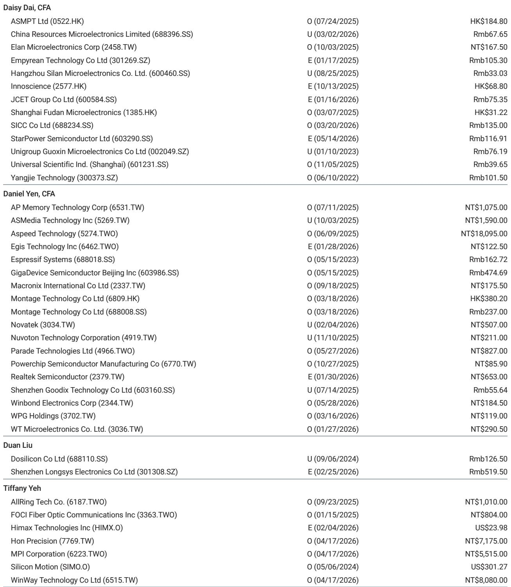
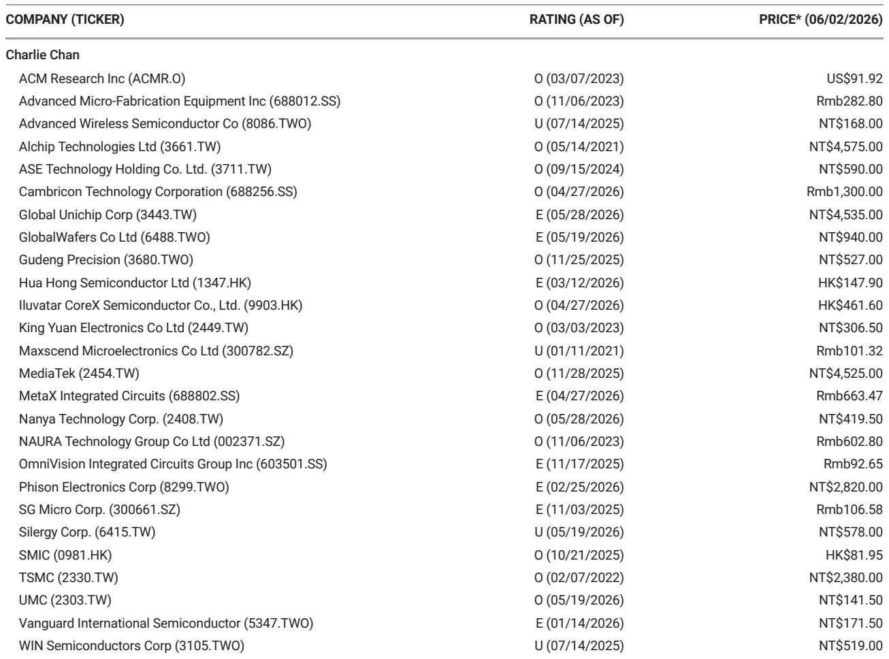
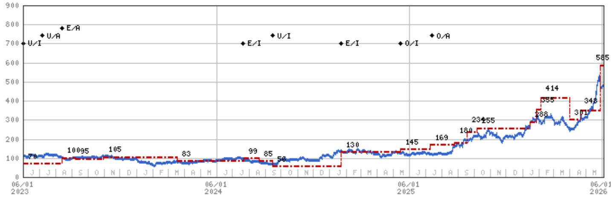

# Legacy NAND Is the Unsung Hero of AI Infrastructure: Why Three Greater China Memory Stocks Deserve a Second Look

The narrative around artificial intelligence hardware has been dominated by a single, expensive protagonist: high-bandwidth memory (HBM). But a recent disclosure from a leading NAND flash manufacturer reveals a quieter, more scalable revolution underway. Legacy NAND technology, long dismissed as a mature and commoditized product, is proving to be a critical enabler for next-generation AI workloads. A global investment bank report, drawing on insights from Kioxia's Investor Relations Day, confirms that old memory technologies are finding a new, high-growth purpose—expanding GPU memory capacity in data centers. This is not merely a niche application; it is a structural shift in the total addressable market for legacy NAND, with direct and positive implications for three Greater China memory vendors: GigaDevice, Winbond, and Macronix.

The market has been slow to recognize this transition. While the entire semiconductor industry fixates on cutting-edge process nodes and the HBM supply chain, a parallel opportunity is quietly building in the "last mile" of AI memory. The core argument is straightforward: as AI models grow larger, they do not just need faster memory; they need more of it, and they need it cost-effectively. Legacy NAND, with its proven reliability and lower cost per gigabyte, is emerging as the optimal solution for expanding GPU memory pools. This is not a replacement for HBM but a complementary layer that solves a critical system bottleneck. For investors who have overlooked the "old memory" ecosystem, the current moment represents an asymmetric opportunity. The upside surprise, as the report suggests, is that these stocks are not just cyclical plays; they are becoming structural beneficiaries of the AI buildout.

Why now? The confirmation from Kioxia that its GP series high-performance SSD, built on proprietary SLC (single-level cell) chip technology, is compatible with Nvidia's Storage-Next solution is a watershed moment. It validates that the industry's largest player sees a role for this technology in the AI pipeline. This is not a theoretical concept; it is an active product that delivers over 100 million IOPS with ultra-low latency, designed explicitly to resolve system memory constraints and accelerate large-scale database operations and AI generation. The report's analysts are drawing a direct line from this product announcement to their coverage universe, arguing that legacy NAND vendors in Greater China are ideally positioned to capture a share of this expanding TAM. The implication is clear: the market is underpricing the demand pull from an unexpected source.

---

## The AI Memory Hierarchy Is Expanding, and Legacy NAND Is the New Middle Layer

The conventional view of AI memory architecture is a two-tier system: a small, ultra-fast HBM pool directly attached to the GPU, and a much larger, slower DRAM or SSD-based storage system. This binary model is breaking down under the weight of modern AI workloads. Inference and training for large language models require massive parameter sets and intermediate data that cannot fit entirely in HBM. The solution is a third tier: a high-performance, low-latency memory layer that sits between the GPU and traditional storage. This is precisely where legacy NAND technology excels.

Kioxia's GP series SSD is a perfect example of this new tier. It is not designed to replace HBM but to expand the effective memory available to the GPU, acting as a high-speed cache or a memory extension. The report highlights that this technology enables "faster generation" and "large-scale DB" operations. The "so what" here is profound: the total addressable market for NAND is no longer limited to consumer SSDs, mobile storage, or enterprise data archiving. It now includes a direct, high-value role in the AI compute pipeline. For GigaDevice, Winbond, and Macronix, which specialize in legacy NAND (including SLC and MLC/TLC variants), this represents a new demand vector that is largely uncorrelated with the traditional cyclical memory market. The investment thesis shifts from "when will the memory cycle turn?" to "how much of the AI memory expansion can these players capture?"

---

## The Supply-Demand Calculus for Legacy NAND Is Shifting from Cyclical to Structural

For years, the memory industry has been defined by boom-and-bust cycles driven by consumer electronics demand. The report's valuation methodology for Macronix, for example, explicitly acknowledges this cyclical nature by using a price-to-book multiple. However, the emerging demand from AI infrastructure changes the fundamental supply-demand equation. The report notes that "MLC and legacy TLC NAND could be in greater shortage into 2H26, with undersupply easily going up to 40%." This is not a typical cyclical upswing; it is a structural supply deficit driven by a new, non-consumer application.

The critical insight is that the supply side is not reacting quickly enough. Legacy NAND production is not a high-priority investment for most major memory manufacturers, who are focused on the more lucrative and technologically advanced 3D NAND and HBM. This creates a window of opportunity for dedicated legacy NAND vendors. The report identifies Macronix as "the only supplier which could fill the gap," a statement that underscores the concentrated nature of this opportunity. For Winbond, the report sees opportunities in SLC NAND alongside its DRAM and NOR Flash businesses. For GigaDevice, the residual income model suggests a medium-term growth rate of 16.4%, which may prove conservative if the AI-driven NAND demand materializes faster than expected. The strategic implication for investors is that the traditional cyclicality of these stocks may be dampened, and their earnings power may become more resilient and growth-oriented.

---

## The Report's Blind Spot: Quantifying the "Memory Expansion" TAM and Competitive Dynamics

While the report makes a compelling case for the upside, it leaves several critical questions unanswered. The most significant gap is the lack of a quantified total addressable market for this "memory expansion" use case. How many gigabytes of legacy NAND will be required per AI server? What is the penetration rate of this technology across different AI workloads? The report acknowledges the potential but does not provide a granular TAM model. This is a meaningful open question for investors who need to size the opportunity and compare it to the existing revenue streams of these companies.

Furthermore, the competitive landscape is not fully explored. While the report states that Macronix is the only supplier that can fill the gap in a specific shortage scenario, the broader legacy NAND market includes other players, including some in China and Korea. How defensible are the positions of GigaDevice, Winbond, and Macronix? What are the barriers to entry for a major NAND manufacturer to pivot some production back to legacy nodes? The report also does not address the potential for technological substitution: could a different memory technology, such as MRAM or a new generation of storage-class memory, emerge as a competitor in this "middle layer" of the AI memory hierarchy? These are the analytical questions that separate a surface-level read from a deep investment thesis. The full report likely contains more nuance on these points, but the public summary leaves room for considerable debate.

---

## A Decision Framework for Investors: Three Questions to Assess the Legacy NAND AI Opportunity

To translate this report into a practical investment decision, investors should apply a structured framework based on three key questions. First, **the Confirmation Test**: Is the demand signal from hyperscale data centers and AI system integrators real and accelerating? The Kioxia announcement is a strong positive data point, but investors should monitor for similar announcements from other NAND vendors and, more importantly, from server OEMs and cloud service providers. A single data point does not make a trend, but it is a credible starting point.

Second, **the Supply Constraint Test**: How tight is the market for legacy NAND, and can the identified vendors actually capture the upside? The report points to a potential 40% undersupply by the second half of 2026. Investors need to assess the capacity expansion plans of GigaDevice, Winbond, and Macronix. Can they ramp production fast enough? Are there any wafer supply constraints? The valuation multiples used in the report (7.0x P/B for Macronix, 5.5x P/B for Winbond) are based on this supply-demand gap materializing. If the gap is smaller or materializes later, the upside is diminished.

Third, **the Valuation vs. Cycle Test**: How much of the current stock price reflects the cyclical recovery versus the structural AI opportunity? All three stocks are rated Overweight, but the report's price targets rely on assumptions about the memory cycle (e.g., NOR up-cycle, DRAM pricing). If the AI-driven NAND demand is the primary catalyst, the stocks should trade on a different metric than historical P/B. Investors should ask: what multiple would these stocks command if 20% of their revenue came from a high-growth, AI-exposed segment rather than cyclical consumer memory? The answer to this question determines whether the current price offers a sufficient margin of safety.

---

## The Investment Thesis Is Still Forming, but the Signal Is Too Strong to Ignore

The report from the global investment bank is not a definitive call; it is an early signal. It identifies a structural shift in the memory market that most investors have not yet priced in. The legacy NAND vendors in Greater China are not merely riding a cyclical wave; they are positioned at the intersection of two powerful trends: the insatiable demand for AI compute and the physical limits of HBM scaling. The technology is proven, the product is compatible with the leading AI platform, and the supply-side dynamics suggest a period of pricing power ahead.

The unresolved questions—the precise TAM, the competitive response, and the pace of adoption—are precisely what create the opportunity. If everything were known, the stocks would already be priced for perfection. The report's value lies in its ability to frame a new investment narrative, one that challenges the conventional wisdom that "old memory" is a dead end. For serious investors, the next step is to dig deeper into the specific financial models, supply chain checks, and competitive analysis that underpin this thesis. The full report contains the charts and data necessary to make that assessment.

Join the community to read the full report and review the original charts.

*This article is for learning and discussion only and does not constitute investment advice.*

Personal reading notes and learning share only. Not investment advice.

