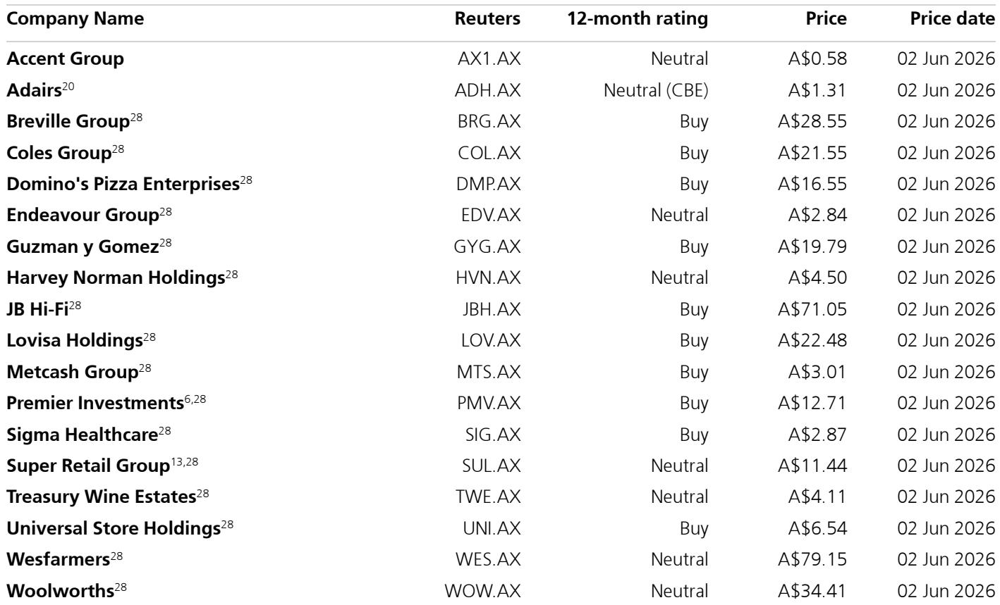
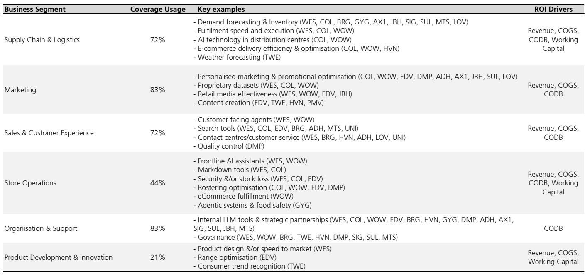
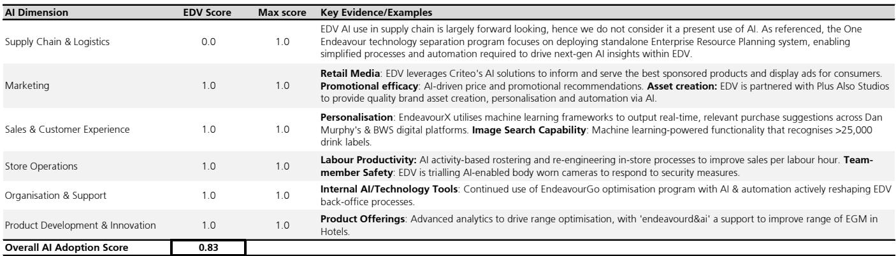

# The AI Divide in Australian Retail Is Already Here: Scale and Data Assets, Not Technology, Are the Real Moat

The conventional narrative around artificial intelligence in retail is that it is an emerging, experimental force—something to watch but not yet to act on. That assumption is outdated. Based on a systematic benchmarking of 18 publicly listed Australian retail and consumer companies, the evidence is clear: AI adoption is not only widespread, it is already creating a measurable divide between leaders and laggards. Every single company in the coverage universe has some form of AI deployment. But the gap between the top and bottom is not incremental; it is structural. Wesfarmers scores a perfect 1.0 on the adoption scorecard. Premier Investments scores 0.08. This is not a difference in technological sophistication. It is a difference in strategic positioning that will compound over the next three to five years.

Why now? Because the window for building the foundational capabilities that separate winners from the rest is closing. The highest-scoring companies are not simply deploying more AI tools. They are building integrated data ecosystems, embedding AI across all six dimensions of the business—from supply chain to product development—and creating compounding advantages that smaller or less-disciplined competitors will find increasingly difficult to replicate. The question for investors is no longer whether AI matters for Australian retail. It is which companies have already built the structural advantages that will allow them to extract disproportionate value from this transformation.

## The Scorecard Reveals a Bimodal Distribution, Not a Bell Curve

The most striking finding from the AI adoption scorecard is not the average score. It is the shape of the distribution. The 18 companies analysed fall into two distinct clusters rather than a normal spread. The top quintile—Wesfarmers, Coles, Woolworths, Endeavour Group, and Breville Group—score between 0.80 and 1.00. The bottom quintile—Premier Investments, Universal Store, and Lovisa—score between 0.08 and 0.33. The middle is thin.

This bimodal pattern matters because it signals that AI adoption in Australian retail is not a gradual diffusion process. It is an all-or-nothing commitment that requires a critical mass of infrastructure, data, and organisational capability. Companies that have invested early in loyalty programmes, proprietary data platforms, and in-house AI teams are scoring across all six dimensions. Companies that have not made those foundational investments are scoring zeros in multiple categories, not because they lack ambition but because they lack the raw materials.

The strategic implication is uncomfortable but direct: the gap between the leaders and the laggards is likely to widen, not narrow. The leaders are already generating compound benefits. Their AI models improve as they accumulate more data. Their internal tools become more sophisticated as their teams gain experience. Their cost structures improve as automation reduces manual processes. The laggards, by contrast, face a catch-22: they need data to build effective AI systems, but they lack the customer engagement and loyalty infrastructure to generate that data at scale.

## Marketing and Organisational Support Are Table Stakes; Product Innovation Is the True Differentiator

At first glance, the adoption rates across the six scorecard dimensions appear encouraging. Marketing and Organisation & Support both show 83% usage across the coverage universe. Supply Chain and Sales & Customer Experience are close behind at 72%. These numbers suggest that Australian retailers have broadly embraced AI for customer-facing and back-office functions. But this interpretation is misleading.

The real differentiation lies in the dimensions where adoption is low. Store Operations sits at 44%. Product Development & Innovation languishes at 21%. These are not peripheral activities. They are the areas where AI can drive the most defensible competitive advantages. Marketing personalisation, for example, is increasingly table stakes. Every major retailer can use AI to tailor offers. But using AI to redesign products, optimise range selection, or transform store-level labour productivity requires deeper integration with core business processes.

Consider the contrast between the leaders and the laggards on product development. Wesfarmers scores 1.0 in this dimension, using AI for private label product design at Kmart and 3D digitisation in sourcing. Endeavour Group also scores 1.0, applying AI for range optimisation and consumer trend recognition. Coles and Woolworths, despite their otherwise strong scores, score 0.0 in product development. They have not publicly disclosed AI-driven innovation in private label formulation or design. This is a meaningful gap. If the two largest grocery retailers in Australia are not yet using AI to improve their own-brand products, they are leaving significant margin and differentiation opportunities on the table.

The second-order implication is that the current scorecard may understate the long-term advantage of companies like Wesfarmers. Their perfect score in product development suggests they are building capabilities that will take years for competitors to replicate. Coles and Woolworths may close the gap, but they will have to invest heavily in R&D and data infrastructure to do so.

## The Attributes of AI Leaders Are Not What Most Investors Assume

The report identifies three attributes of the best-positioned companies: large, high-quality first-party data sets; usage that has evolved from isolated use cases to enterprise-wide integration; and significant in-house AI organisational capability. These findings are intuitive, but their implications are more nuanced than they appear.

First, the data advantage is not just about size. It is about structure. Wesfarmers' OneData platform houses 12.5 million unique customer records and powers proprietary data capability across its retail brands. Coles and Woolworths have similarly rich data from their loyalty programmes. But the critical factor is that these companies have built the infrastructure to connect data across brands, channels, and functions. A loyalty programme alone is not enough. The data must be centralised, cleaned, and made accessible to AI models across the enterprise.

Second, the evolution from quantity to sophistication is a hidden barrier to entry. Many companies can claim they use AI for demand forecasting or personalised marketing. Few can demonstrate that AI is embedded in their core operating systems. Coles, for example, operates two Ocado-powered customer fulfilment centres that use an AI-driven "air traffic control" system to coordinate over 700 robots. Woolworths uses AI for store-based picking optimisation, transport routing, and last-mile delivery fleet allocation. These are not pilot projects. They are the operational backbone of the business.

Third, the organisational capability requirement is often underestimated. Wesfarmers has strategic partnerships with Microsoft and Google, an internal AI upskilling programme across its 120,000-person workforce, and a formal AI governance policy with risk oversight. Coles deployed OpenAI's ChatGPT Enterprise at scale and built a flagship internal tool called "mycoles assistant." These investments in talent, training, and governance are expensive and time-consuming. They are also invisible in standard financial statements.

## What the Report Does Not Fully Answer: The Cost of Lagging and the Risk of Over-Disclosure

The report is transparent about its limitations. The scorecard is based on publicly available information, which means companies that communicate more aggressively about their AI activities may appear more advanced than they are, while others may have significant but undisclosed initiatives. This creates a potential distortion. Premier Investments, for example, may have meaningful AI deployment that it chooses not to publicise for competitive reasons. The report acknowledges this, but the scorecard still penalises silence.

A more fundamental open question is the relationship between AI adoption and financial performance. The report identifies potential ROI drivers—lower cost of doing business, lower cost of goods sold, higher revenue, and working capital efficiency—but it does not quantify the magnitude or timing of these benefits. It also notes that some AI headwinds may moderate the gains, including increased competition, changing consumer behaviour, and implementation costs.

The most important unanswered question is whether the current leaders can sustain their advantage as AI becomes commoditised. Many of the AI tools that Wesfarmers and Coles use today—demand forecasting, personalised marketing, contact centre automation—are becoming increasingly accessible through third-party platforms. The proprietary advantage may erode faster than expected. Conversely, the laggards may leapfrog the leaders by adopting next-generation AI architectures that do not require the same legacy data infrastructure.

Investors should also consider the risk of over-investment. The report's highest-scoring companies are spending heavily on AI partnerships, internal tools, and governance frameworks. These investments may not generate returns for several years. If consumer spending slows or competitive dynamics shift, the leaders could find themselves with inflated cost structures and no corresponding revenue uplift.

## A Decision Framework for Investors Evaluating AI Exposure in Australian Retail

For investors trying to translate this analysis into portfolio decisions, a structured framework is more useful than a simple ranking. The following three-part framework can help assess which companies are likely to extract value from AI and which are at risk of being disrupted.

First, evaluate data asset quality, not just data quantity. The key question is whether the company has a centralised, proprietary data platform that connects customer behaviour across channels and brands. Loyalty programme membership is a starting point, but the real test is whether the data is structured, accessible, and used to train enterprise-wide AI models. Companies that score highly on this dimension include Wesfarmers, Coles, and Woolworths. Companies that lack this infrastructure, regardless of their current AI projects, will struggle to scale.

Second, assess the breadth of AI integration, not the depth of any single use case. The scorecard's six dimensions provide a useful heuristic. A company that scores above 0.7 across all applicable dimensions is likely building compounding advantages. A company that scores well in only one or two dimensions, such as marketing alone, is more vulnerable to competitive pressure. The leaders are embedding AI into supply chain, store operations, and product development simultaneously. The laggards are still treating AI as a marketing or customer service project.

Third, examine the organisational commitment, not the technology stack. The presence of internal LLM tools, formal governance policies, and enterprise-wide upskilling programmes are leading indicators of sustainable AI capability. Companies that rely entirely on external vendors or isolated pilot projects are unlikely to build durable advantages. The report shows that the highest-scoring companies all have significant in-house AI teams and formal governance frameworks. This is not coincidental.

## The Full Picture Requires Deeper Analysis of the Leaders and the Lagging Use Cases

The scorecard provides a valuable starting point, but it is only a snapshot. To understand which companies are truly well-positioned, investors need to examine the specific use cases, the quality of implementation, and the financial impact. The report includes detailed profiles of the top-scoring companies, including Wesfarmers, Coles, and Woolworths, with specific evidence of their AI deployments across all six dimensions. These profiles reveal the depth of integration that separates the leaders from the rest.

For example, Wesfarmers' use of AI spans demand forecasting at Bunnings, RFID-enabled inventory visibility at Kmart, Gen AI agents in Officeworks' order management systems, AI-powered search and shopping assistants, frontline AI assistants for store staff, and AI-driven markdown tools that save 100,000 hours of manual effort. This is not a collection of experiments. It is a systematic deployment across the entire enterprise.

Similarly, Coles' AI capabilities include machine learning for inventory forecasting and demand planning, an Ocado-powered robotic fulfilment centre, predictive AI for last-mile delivery, AI-driven personalisation through Flybuys, Gen AI in customer service and store operations, and a large-scale internal ChatGPT deployment. Woolworths uses AI for store-based picking, robotic fulfilment centres, personalised offers through Everyday Rewards, customer-facing AI agents, and AI-driven rostering models.

The full report also examines the lagging companies and the use cases where adoption is lowest. Product development and store operations remain the most underpenetrated dimensions, suggesting that the next wave of competitive differentiation will come from these areas. Investors who want to understand which companies are positioned to lead that next wave need to review the complete scorecard and the underlying evidence.

Join the community to read the full report and review the original charts.

*This article is for learning and discussion only and does not constitute investment advice.*

Personal reading notes and learning share only. Not investment advice.

