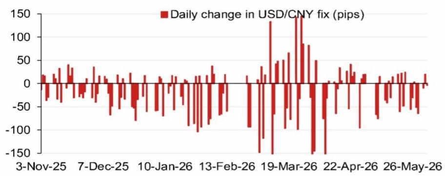
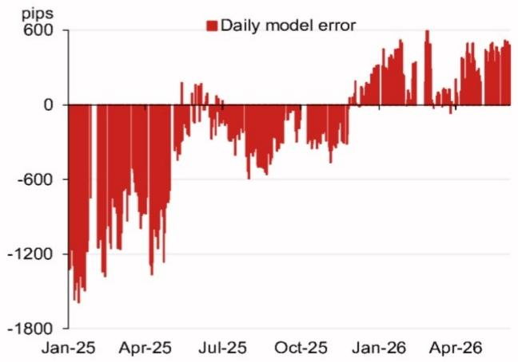

# 人民币中间价的真实信号，市场可能低估了

在人民币汇率讨论几乎被贸易摩擦和资本流动叙事主导的当下，一份来自某外资投行的每日中间价模型报告，往往被市场视为短期交易噪音。但如果我们把时间线拉长，把模型输出的数字与政策日历、历史误差模式放在一起看，一个更关键的判断正在浮现：**人民币中间价的定价逻辑，正在经历一次从“被动跟随”到“主动校准”的微妙切换，而市场对此的定价远不充分。**

这份于2026年6月4日发布的模型报告，其核心输出——6.7773的模型投影——本身并不令人震惊。真正值得关注的，是模型投影较前值大幅下移411个基点，以及计入逆周期因子后的6.7971。这两个数字之间的差值，以及模型在过去一年中持续出现的系统性误差，共同指向了一个尚未被广泛讨论的结论：当前人民币中间价的定价机制，已经不再是简单的“一篮子货币+逆周期因子”公式，而是正在成为一个更具前瞻性的政策信号工具。市场如果仍然用旧框架去理解中间价，就会持续误判政策意图，进而错失资产定价的关键拐点。

以下，我们将基于这份研报的模型输出与数据细节，拆解这一判断背后的五个核心层次。

## 1. 模型投影的骤降不是技术修正，而是政策意图的前置表达

报告显示，6月4日的模型投影为6.7773，较前值6.8184大幅下移411个基点。即便计入逆周期因子，投影值仍为6.7971，较前次定价低213个基点。这个幅度的变化，绝非简单的隔夜市场波动所能解释。

我们需要理解模型的工作原理。这类模型通常基于一篮子货币的隔夜变动、利差、以及市场情绪指标，来估算次日中间价的“无干预”水平。411个基点的单日变动，意味着模型捕捉到了来自多个币种的显著贡献。报告中的“Top 4 weighted contribution”图表显示，俄罗斯卢布、澳元、日元分别贡献了15.5、15.0和7.0个基点的正贡献，而韩元则贡献了-10.5个基点。这组数据表明，模型并非单纯跟随美元指数，而是在全球主要货币的相对变动中寻找定价锚。

但真正重要的不是模型本身，而是模型输出与实际定价之间的“误差”。报告中的“Recent model errors”图表显示，自2025年初以来，模型误差（模型投影减去实际中间价）经历了从-1800个基点（2025年1月）到+600个基点（2026年4月）的大幅波动。这意味着，在某些时期，实际中间价显著低于模型投影（即人民币被主动“托高”），而在另一些时期，实际中间价又高于模型投影（即人民币被允许“走弱”）。

这种系统性误差的存在，恰恰说明中间价并非机械盯住模型，而是被赋予了额外的政策意志。本次411个基点的下移，结合模型误差逐步收窄的趋势，暗示决策层可能正在将中间价向模型投影靠拢，即减少逆周期因子的干预力度。这背后传递的信号是：决策层认为当前汇率水平已经接近其认可的均衡区间，没有必要再通过强干预来维持一个“政治正确”的价格。

## 2. 逆周期因子正在从“托底工具”转变为“校准工具”

“模型投影计入逆周期因子后”这个数字，是理解政策意图的关键。6.7971相较于6.7773的模型投影，仅高出约200个基点。这个幅度，在近年来属于偏低水平。回顾2025年以来的数据，逆周期因子的调整幅度曾多次超过500个基点，甚至接近1000个基点。

逆周期因子本质上是一个政策黑箱，其调整方向与幅度，直接反映了决策层对汇率波动的容忍度。当逆周期因子被大幅调高（即人为压低人民币中间价），意味着决策层希望阻止人民币过快升值；反之，当逆周期因子被调低或甚至转为负值，则意味着决策层愿意接受人民币贬值。

当前逆周期因子调整幅度收窄至200个基点左右，传递了两个关键信息：第一，决策层认为当前的外部压力（如贸易摩擦）和内部经济基本面，已经不需要通过大幅干预来维持汇率稳定；第二，逆周期因子正在从一个“托底工具”转变为一个“校准工具”，其作用不再是阻止趋势，而是平滑波动、防止超调。

这对于市场参与者的含义是：过去那种“中间价大幅偏离模型投影=政策强力干预”的简单二元框架，已经不再适用。未来的中间价波动，将更多地反映真实市场供需，而非政策意图的强行外推。这意味着，人民币汇率的双向波动弹性将显著增加，而依赖中间价作为单边交易信号的策略，将面临更高的风险。

## 3. 历史误差模式揭示了一个尚未被充分定价的“政策学习曲线”

报告中的模型误差图表，是整份报告中最具洞察力的部分。它展示了一条从2025年初的-1800个基点，到2026年4月的+600个基点的演变路径。这条路径，本质上是决策层在汇率管理上的“学习曲线”。

2025年初，误差为-1800个基点，意味着实际中间价远低于模型投影，即人民币被主动“托高”。这对应了当时贸易摩擦加剧、资本外流压力上升的时期，决策层通过强干预来稳定市场预期。到了2025年中，误差收窄至0附近，表明模型与政策意图趋于一致。随后，误差再次扩大至-1200个基点（2025年10月），可能对应了新的外部冲击。但值得注意的是，2026年以来，误差持续为正且稳定在+600个基点附近，这意味着实际中间价开始高于模型投影，即人民币被允许“走弱”。

这一模式表明，决策层不再是简单地“逆风干预”，而是在不断试错中，逐步摸索出一个更灵活、更市场化的中间价形成机制。2026年以来的正误差，可能反映了决策层主动利用汇率贬值来对冲外部关税压力的意图。如果这一判断成立，那么未来人民币汇率将不再是单纯的“政策稳定器”，而是正在成为“政策缓冲器”。

市场目前对人民币汇率的定价，可能仍然基于“政策干预=汇率稳定”的旧范式。如果决策层的学习曲线正在将汇率推向更灵活、更市场化的方向，那么当前的人民币资产定价，无论是利率、信用利差还是股票估值，都可能隐含了一个“汇率稳定溢价”。一旦这个溢价被修正，将引发一系列连锁反应。

## 4. 2026年下半年政策日历中的“汇率节点”不容忽视

报告中的“Calendar of events”表格，列出了一系列2026年下半年到年底的重要政策事件。这些事件本身是公开信息，但将它们与汇率模型放在一起看，就能发现一个清晰的“政策-汇率联动”逻辑。

7月底的中央政治局会议，通常会对下半年经济工作做出部署。如果会议释放出更强的稳增长信号，或者对汇率政策有新的表述，那么中间价的定价逻辑可能再次调整。11月在深圳举行的APEC会议，以及年底中国国家主席对美国的访问，都是重要的外交节点。在这些节点前后，汇率往往会成为政策博弈的工具，中间价可能出现主动“示强”或“示弱”的阶段性调整。

12月的中央经济工作会议，则是对全年经济定调的关键会议。届时，如果经济增速仍然面临压力，决策层可能会进一步明确“以贬值促出口”的政策取向。这些事件的时间分布，意味着2026年下半年人民币汇率将面临多个“政策敏感期”，而中间价模型在这些时期的输出，将具有更强的指示意义。

市场目前对人民币汇率的预测，大多基于线性外推或静态的贸易差额分析。但这些政策事件的存在，意味着汇率路径可能随时被非经济因素打断。投资者需要建立一个“政策事件-汇率反应”的观察框架，而不是仅仅盯着中美利差或美元指数。

## 5. 报告尚未完全回答的关键问题：模型误差的收敛是趋势还是偶然？

尽管报告提供了丰富的模型输出和误差数据，但有一个核心问题并未完全解决：当前模型误差的正值收敛，是趋势性的，还是只是阶段性偶然？

从历史数据看，模型误差曾多次在正负值之间大幅摆动。2026年以来的正误差，究竟是决策层主动选择的“贬值容忍”新范式，还是仅仅因为外部压力阶段性缓解而暂时放弃干预？如果是前者，那么人民币将进入一个更市场化的波动区间；如果是后者，那么一旦新的外部冲击出现，逆周期因子可能再次大幅动用，模型误差将重新回到负值区间。

报告没有提供明确的答案。但这恰恰是这份研报最有价值的地方——它不是一个给出确定结论的“预测”，而是一个帮助读者建立观察框架的“工具”。通过理解模型、误差和政策日历之间的互动，读者可以自己判断：当前的正误差模式，是否已经构成了一个可持续的新常态。

这个问题的答案，将直接影响对人民币资产定价的判断。如果模型误差的收敛是趋势性的，那么人民币汇率的波动率将上升，人民币资产的“汇率稳定溢价”将消失，这将利好出口导向型企业，但不利于持有大量外债的行业。反之，如果这只是阶段性偶然，那么市场将很快回到旧框架，汇率稳定溢价将继续存在。

## 顺着这些未解问题继续读完整报告

中间价模型的价值，从来不只是给出一个数字。它是一面镜子，映照出政策意图与市场力量之间的博弈。当前模型投影大幅下移、逆周期因子调整幅度收窄、误差模式转向正值的三重信号，共同指向一个方向：人民币汇率的定价逻辑正在发生结构性变化。但这一变化的可持续性，以及它对不同资产类别的二阶影响，仍需要更深入的数据验证和情景分析。

完整研报中包含了更详细的模型方法论、误差归因分析、以及不同情景下的路径模拟。这些内容无法在一篇导读中完全展开，但它们对于理解上述判断的边界条件至关重要。如果你希望进一步探讨模型误差的收敛性、逆周期因子的具体调整逻辑、或者政策事件对汇率路径的潜在冲击，欢迎来星球微信群里继续讨论。我们会在群里分享完整研报的原始图表与数据，并定期组织闭门讨论，拆解这些尚未被市场充分定价的关键变量。

Personal reading notes and learning share only. Not investment advice.

