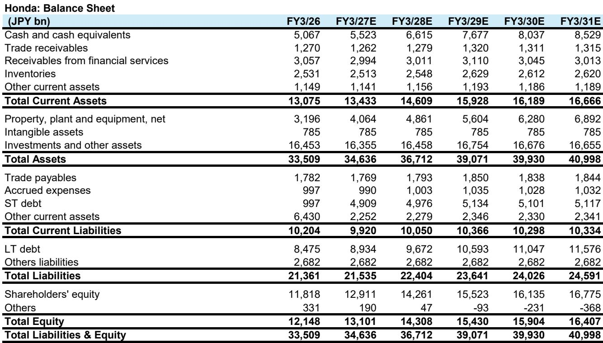
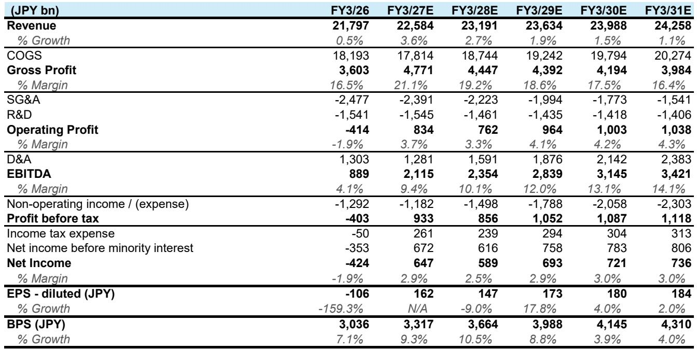
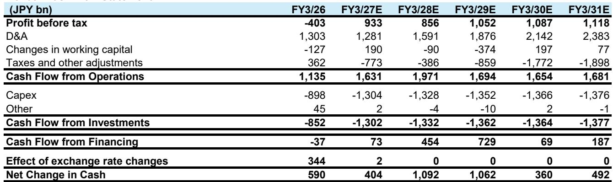

# The Japanese Auto Recovery Is Real, But It Is Not Uniform: Why HEV Strategy and New Model Cadence Now Determine Who Wins in Both Japan and the US

The global automotive market is not experiencing a broad-based recovery. It is experiencing a structurally bifurcated one, and the dividing line is not geography or brand heritage. It is the ability to deliver hybrid electric vehicles at scale while maintaining pricing discipline. The May 2026 sales data from Japan and the United States confirms this pattern with unusual clarity. In Japan, total retail sales rose 2.8 percent year-on-year, marking two consecutive months of growth, but the aggregate number masks a dramatic divergence among the major Japanese automakers. Toyota posted an 8.3 percent gain, driven by refreshed minivans and a new Land Cruiser variant. Honda grew 4 percent on the back of a new battery electric vehicle and a hybrid CR-V. Nissan, by contrast, fell 6 percent, with its registered vehicle sales dropping 16 percent. In the United States, total sales edged up just 0.4 percent, yet hybrid electric vehicle sales surged 33 percent to 256,000 units. Toyota and Honda kept incentives low while competitors raised spending. The pattern is unmistakable: the market is rewarding companies that have synchronized their new model launches with hybrid powertrain availability, and it is punishing those that have not.

This is not a cyclical story. It is a structural realignment of competitive advantage. The tax changes in Japan that reduced acquisition and fuel taxes have provided a modest tailwind, but they have not lifted all boats equally. The same geopolitical uncertainty in the Middle East that has kept gasoline prices elevated in the United States has not suppressed overall demand; it has redirected it toward fuel-efficient vehicles. The strategic question for investors is no longer whether the auto market will recover. It is which companies have the product cycle and the hybrid portfolio to capture the demand that is already there, and which companies are structurally falling behind. The May data provides a clear, if uncomfortable, answer.

## Toyota and Honda Are Winning Because Their New Model Launches Are Aligned with HEV Demand, While Nissan Is Losing Share in Both Markets

The most important single data point in the May report is not the overall sales volume. It is the contrast between Toyota and Honda on one side and Nissan on the other. In Japan, Toyota's 8.3 percent year-on-year growth was driven by the launch of face-lifted versions of its popular Noah and Voxy minivans, along with the Land Cruiser FJ. These are not experimental vehicles. They are core, high-volume models that appeal to the Japanese buyer who values practicality, fuel efficiency, and reliability. Honda's 4 percent growth came from the new BEV Super-ONE and the CR-V hybrid that launched in February. Both companies are executing on a simple strategy: refresh the models that customers already want, and make sure those models offer a hybrid option.

Nissan, meanwhile, saw its registered vehicle sales fall 16 percent year-on-year in Japan. That is not a blip. It is a structural warning. Nissan has been in a restructuring phase, but the May data suggests that restructuring has not yet translated into product momentum. The company is waiting for the new Elgrand, scheduled for launch in July, to begin its turnaround. That is a high-risk bet. One model, no matter how well executed, rarely reverses a multi-year trend of share loss, especially when competitors are launching multiple refreshed models across multiple segments. The Elgrand launch will be the single most important event for Nissan's Japan strategy in 2026, and the May data raises the stakes considerably.

## In the US Market, HEV Demand Is Reshaping Competitive Dynamics, and Incentive Discipline Is the New Measure of Strategic Health

The US market in May was flat overall, but the composition of demand shifted sharply. Hybrid electric vehicle sales reached 256,000 units, a 33 percent year-on-year increase. This is not a niche. It is now a material portion of the market, and it is growing while battery electric vehicle sales from Tesla declined nearly 17 percent. The US consumer, facing elevated gasoline prices and ongoing geopolitical uncertainty, is voting for hybrids as the pragmatic choice. They offer fuel efficiency without range anxiety, and they are increasingly available across multiple price points and body styles.

Toyota reported 239,000 units in the US, essentially flat year-on-year, but that flatness is deceptive. The company maintained an industry-low incentive of just $1,843 per vehicle, down 1 percent quarter-on-quarter, while holding days supply at just 21 days, far below the industry average of 47 days. Toyota is not discounting to move metal. It is selling what it builds, at the prices it wants, with a product mix that leans heavily on hybrids like the Camry and the new RAV4. Honda performed even better on a growth basis, with sales up 10 percent to 149,000 units, driven by record hybrid sales led by the CR-V. Honda's incentives were also low at $2,747, down 5 percent quarter-on-quarter. Both companies demonstrate that a strong hybrid lineup is not just a demand driver; it is a pricing power driver.

The contrast with Mazda is instructive. Mazda posted 35 percent year-on-year growth in the US, but that growth came with incentives of $3,535, up 6 percent quarter-on-quarter, and the CX-5, its core model, declined 18 percent year-on-year. The growth was driven by the affordable Mazda3 and the CX-50 hybrid, but the rising incentive spend suggests that Mazda is buying share rather than earning it. Subaru also grew 10 percent, supported by hybrid models and new BEVs, but the report notes that higher BEV sales likely continue to pressure margins. The lesson is clear: not all growth is created equal. Growth that comes with rising incentives and margin pressure is not sustainable growth. It is a short-term fix for a product cycle gap.

## The Report Does Not Fully Answer How Nissan and Mazda Can Close the HEV Gap, or Whether Subaru's BEV Push Will Ultimately Help or Hurt Margins

For all the clarity the May data provides, it also leaves several critical questions unresolved. The report highlights that Nissan's US performance was solid, supported by US-produced models like the Rogue, Pathfinder, and Frontier. But it also notes that the Rogue e-Power, Nissan's hybrid variant, is not expected until the second half of 2026. That means Nissan is effectively sitting out the current HEV demand wave in the US, the most important profit pool for Japanese automakers. The question is whether Nissan can maintain its US sales momentum until the e-Power arrives, or whether it will be forced to increase incentives to compensate for the lack of a hybrid option in its highest-volume model.

Mazda faces a similar but slightly different problem. It has limited HEV offerings, and the new CX-5, which launched in Japan on May 21, will be critical to its recovery. But the CX-5 declined 18 percent in the US in May, even as Mazda's overall US sales surged. That suggests the company is relying on lower-priced models to drive volume, which is a fragile strategy. The question is whether the new CX-5, once it ramps up in the US, can reverse that decline without requiring even higher incentives. If it cannot, Mazda's margin profile will deteriorate further.

Subaru's case is perhaps the most nuanced. The company benefited from the restart of the Yajima plant and strong HEV demand, and its new BEVs, the Uncharted and Trailkseeker, are contributing to volume. But the report explicitly states that higher BEV sales likely continue to pressure margins. That raises a fundamental strategic question: is Subaru's BEV push a long-term investment in future compliance and market positioning, or is it a near-term drag that will undermine profitability during a period when the company should be capitalizing on HEV demand? The answer will determine whether Subaru's current growth trajectory is sustainable or whether it is a prelude to margin compression.

## Investors Should Evaluate Japanese Automakers on a Three-Dimensional Framework: New Model Cadence, HEV Penetration Rate, and Incentive Discipline

The May data allows investors to move beyond generic assessments of "Japan auto" and toward a decision framework that differentiates the winners from the laggards. The framework has three dimensions, and each dimension is measurable.

The first dimension is new model cadence. Toyota and Honda are demonstrating that regular, meaningful refreshes of core models drive volume without requiring excessive discounting. Nissan and Mazda are demonstrating that gaps in the product cycle lead to share loss and rising incentives. Investors should track not just the number of new models a company launches, but the volume-weighted significance of those models. A face-lift of a top-selling minivan is worth more than a brand-new model in a niche segment.

The second dimension is HEV penetration rate. The US data shows that HEV sales grew 33 percent year-on-year while the overall market was flat. Companies with high HEV mix, like Toyota and Honda, are capturing disproportionate share of the most profitable demand. Companies with low HEV mix, like Nissan and Mazda, are being forced to compete on price in the declining internal combustion engine segment. Investors should monitor each company's HEV mix as a percentage of total US and Japan sales, and should watch for inflection points when new hybrid variants come online.

The third dimension is incentive discipline. This is the most revealing metric because it captures the interaction between product strength and pricing power. Toyota's $1,843 incentive and 21 days supply are best-in-class. Honda is close behind. Mazda's rising incentives and Subaru's margin pressure from BEVs are warning signs. Investors should compare each company's incentive trend against its volume trend. If volume is growing but incentives are growing faster, the strategy is not working. If volume is stable and incentives are declining, the strategy is working.

## The Full Report Contains the Original Charts and Granular Data That Make This Framework Actionable

The analysis above is based on the May 2026 sales tracker, but the full report contains the detailed exhibits that allow investors to apply this framework with precision. The Japan sales volume chart shows the monthly trend for kei-cars versus registered vehicles, with year-on-year growth rates that reveal the impact of the tax changes. The US sales volume chart shows the car versus light truck split, which is critical for understanding mix shifts. The incentive trend chart compares each Japanese automaker against the industry average, and the days supply chart highlights the extreme inventory discipline at Toyota versus the industry norm. The ticker table provides the current ratings, price targets, and valuation multiples for each company, including the recent estimate changes for Honda.

Join the community to read the full report and review the original charts.

*This article is for learning and discussion only and does not constitute investment advice.*

Personal reading notes and learning share only. Not investment advice.

