# India Industrials and Infrastructure

# Electric India: Data-Centers - The asset heavy play in the DC story shaping up in India...

  
Nikhil Nigania

+91 226 842 1414

nikhil.nigania@bernsteinsg.com

  
Madison Rezaei

+1 917 344 8622

madison.rezaei@bernsteinsg.com


Aman Jain

+91 226 842 1486

aman.jain@bernsteinsg.com

When I was marketing in Singapore-Hong Kong in Feb, foreign investors were clear that one has to position for data-centers even within India and the wave is yet to hit (they have been right till now!). One can invest via i) Equipment plays (diesel genset, optic fiber, electrical equipment, transmission, etc., especially those with US exposure), or ii) Utilities, or iii) Companies building-owning the data-centers. In this note - we focus on the latter two asset heavy plays. We look at what happened in US and learnings for India. Eventually it all comes down to access to electricity!

a) Data Center traction: Our industry discussions highlight that given the M.East crisis DC capacity in India is likely to go to the higher end of the expected 5-8GW range by 2030 (from 1.5 GW today). There is a big fight for land in Navi-Mumbai (we hear even higher than last transactions - Exhibit 13) and substation access for DCs. On capex, ex of compute it is \~Rs 50 Cr/MW (lower than the US).

b) Asset owners: Business models - 2 operating models on DC owners: i) Real estate landlords (don't own compute hardware)- colocation: Build and lease out DC infra to hyperscalers/ neocloud/ enterprises (who bring their own compute hardware) in long term contracts. E.g. DLR, Equinix- covered by Madison. ii) Cloud providers (compute hardware owners): Own GPUs and may or may not own the physical data center. Neoclouds provide rentals of fully developed GPU clusters (e.g. CRWV- covered by Madison, IREN which own infra as well- covered by Gautam Chhugani). Neoclouds can generate \~8-10x higher revenue per IT MW than co-location, but require much higher capex (\~\$45Mn vs. \$8-15Mn), have shorter contracts, and carry tech obsolescence risk when compared to co-location models. Payback period for the co-location model is \~5 years (Exhibit 4). Right to win- With \~ 6 yr avg. wait time in US for interconnect (Exhibit 9), access to power in the right region is the biggest right to win. Even crypto miners with power off-take agreements are pivoting to DC colocation model. Valuations - DC operators like Equinix and Digital Realty are trading at \~22-23x 12m fwd EV/EBITDA, in line with recent DC transactions- Blackstone(covered by Patrick Davitt) acquisition of AirTrunk at \~21x. DC in India (Exhibit 12): Given land x power is the differentiator - the dominance of Adani Group (largest renewable, private thermal, and transmission player in India) is unmatched, followed by Reliance industries (0.5 Mn acres in Gujarat and >5K acres in Navi Mumbai, not covered).

c) Utilities: In US, there is a big divergence in performance of utilities - Vistra, Constellation Energy, and NRG have become 4-8x in last 4 years, whereas others like NextEra, Dominion have remained muted-(none covered, Exhibit 16 Exhibit 17). Drivers- i) Dispatchable open capacity (Gas and Nuclear) in the right region: All 3 winners had significant capacity in PJM and ERCOT (biggest DC markets). PJM capacity prices rose from \~\$29/MW-day in 2024/25 to \~\$329/MW-day for 2026/27). ii) Access to land and behind-the-meter co-location (could this be game changer for Torrent's gas plant?). iii) Premium for clean dispatchable power - Big Nuclear deals. Even coal plants benefited indirectly with retirement of >4.4 GW of coal capacity pushed out. Indian Beneficiaries? Adani group completely dominates merchant power market and even future capacity addition - with their large land parcel, grid connectivity and locked thermal equipment (Exhibit 22).

BERNSTEIN TICKER TABLE 

<table><tr><td rowspan="2">Ticker</td><td rowspan="2">Rating</td><td colspan="3">2 Jun 2026</td><td rowspan="2">TTMRel.</td><td colspan="4">Reported EPS</td><td colspan="3">Reported P/E (x)</td></tr><tr><td>ClosingPrice</td><td>PriceTarget</td><td>PriceTarget</td><td>Cur</td><td>2025A</td><td>2026E</td><td>2027E</td><td>2025A</td><td>2026E</td><td>2027E</td></tr><tr><td>LT.IN (L&amp;T)</td><td>O</td><td>INR</td><td>4,000.90</td><td>4,637.00</td><td>(42.6)%</td><td>INR</td><td>109.00</td><td>123.00</td><td>155.00</td><td>23.0</td><td>20.3</td><td>16.8</td></tr><tr><td>ADANI.IN (Adani Power)</td><td>O</td><td>INR</td><td>235.93</td><td>177.00</td><td>63.7%</td><td>INR</td><td>6.71</td><td>6.11</td><td>6.90</td><td>35.2</td><td>38.6</td><td>34.2</td></tr><tr><td>ADANIGR.IN (Adani Green)</td><td>U</td><td>INR</td><td>1,449.40</td><td>864.00</td><td>(7.6)%</td><td>INR</td><td>8.77</td><td>12.29</td><td>24.78</td><td>38.4</td><td>29.3</td><td>22.4</td></tr><tr><td>JSW.IN (JSW Energy)</td><td>O</td><td>INR</td><td>588.55</td><td>575.00</td><td>(34.9)%</td><td>INR</td><td>11.10</td><td>12.60</td><td>15.81</td><td>53.0</td><td>46.7</td><td>37.2</td></tr><tr><td>TPWR.IN (Tata Power)</td><td>O</td><td>INR</td><td>414.90</td><td>443.00</td><td>(45.9)%</td><td>INR</td><td>12.43</td><td>12.78</td><td>17.08</td><td>33.4</td><td>32.5</td><td>24.3</td></tr><tr><td>NTPC.IN (NTPC Ltd)</td><td>O</td><td>INR</td><td>367.40</td><td>430.00</td><td>(38.9)%</td><td>INR</td><td>24.70</td><td>25.64</td><td>27.02</td><td>14.9</td><td>14.3</td><td>13.6</td></tr><tr><td>DLR (Digital Realty)</td><td>O</td><td>USD</td><td>187.26</td><td>232.00</td><td>(20.4)%</td><td>USD</td><td>3.87</td><td>2.74</td><td>2.37</td><td>48.4</td><td>68.4</td><td>78.9</td></tr><tr><td>EQIX (Equinix)</td><td>O</td><td>USD</td><td>1,071.80</td><td>1,222.00</td><td>(8.4)%</td><td>USD</td><td>14.96</td><td>17.88</td><td>21.36</td><td>71.6</td><td>59.9</td><td>50.2</td></tr><tr><td>CRWV (CoreWeave)</td><td>U</td><td>USD</td><td>119.27</td><td>67.00</td><td>(48.9)%</td><td>USD</td><td>(1.20)</td><td>(4.20)</td><td>(2.41)</td><td>40.2</td><td>15.8</td><td>8.4</td></tr><tr><td>ASIAX</td><td></td><td></td><td>2,056.69</td><td></td><td></td><td></td><td></td><td></td><td></td><td></td><td></td><td></td></tr><tr><td>SPX</td><td></td><td></td><td>7,609.78</td><td></td><td></td><td></td><td></td><td></td><td></td><td></td><td></td><td></td></tr></table>

O - Outperform, M - Market-Perform, U - Underperform, NR - Not Rated, CS - Coverage Suspended   
DLR, EQIX, CRWV estimate is Adjusted EPS; LT.IN, ADANIGR.IN, CRWV valuation is EV/EBITDA (x); DLR, EQIX valuation is Adjusted P/E (x);   
Source: Bloomberg, Bernstein estimates and analysis.

# INVESTMENT IMPLICATIONS

Within our coverage on the power generation front, the advantage of Adani Green and even Adani Power to power up data-centers is unmatched, given their large land parcel, transmission connectivity, merchant capacity, and thermal equipment availability. Beyond generators, L&T stands to gain via both play in building the DCs, power plants and even as DC owner operator.

We rate EQIX and DLR Outperform and CRWV Underperform.

# OTHER REPORTS

27 Mar 2026 - Bernstein Energy & Power: The Frontier of Electricity, what has changed...   
19 Feb 2026 - AI vs. Human: India the next stop for data-centers... assessing the value chain...   
24 Sep 2025 - Electric India: Powering the potential AI data center boom...   
15 May 2026 - Data Centers: What a top-tier data center market looks like—including the DLR and EQIX footprints

# DETAILS

# A) DATA-CENTER - ASSET OWNERS

# WHERE ARE DATA-CENTERS BEING BUILT IN US...

PJM (the Eastern region of US) is the largest data center market in US, while ERCOT (Texas) builds have taken off relatively recently. Over 2015-25, power demand due to DCs has grown at a CAGR of 23% and 26% in PJM and ERCOT respectively vs 21% for the US (18% ex-PJM and ERCOT)- Exhibit 1. They became DC hubs due to business friendly regulatory environment, large de-regulated wholesale power markets, proximity to high density fiber infra, abundant and relatively cheap land, faster interconnection process, etc. Moreover, generation companies in these regions became natural beneficiaries (like Vitra, Constellation Energy, NRG Energy) as they held dispatchable generation assets critical for 24x7 power supply to the data centers.

EXHIBIT 1: US power demand driven by data centers   
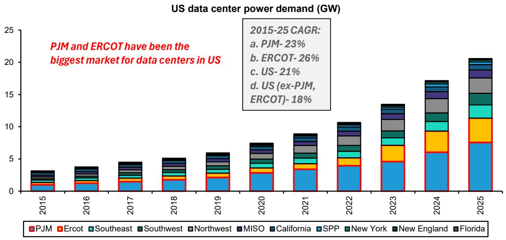

<details>
<summary>bar_stacked</summary>

| Year | PJM | Ercot | Southeast | Southwest | Northwest | MISO | California | SPP | New York | New England | Florida |
|------|-----|-------|-----------|-----------|-----------|------|------------|-----|----------|-------------|---------|
| 2015 | 0.5 | 0.1   | 0.1       | 0.1       | 0.1       | 0.1  | 0.1        | 0.1 | 0.1      | 0.1         | 0.1     |
| 2016 | 0.7 | 0.2   | 0.1       | 0.1       | 0.1       | 0.1  | 0.1        | 0.1 | 0.1      | 0.1         | 0.1     |
| 2017 | 1.0 | 0.3   | 0.2       | 0.1       | 0.1       | 0.1  | 0.1        | 0.1 | 0.1      | 0.1         | 0.1     |
| 2018 | 1.5 | 0.4   | 0.3       | 0.2       | 0.1       | 0.1  | 0.1        | 0.1 | 0.1      | 0.1         | 0.1     |
| 2019 | 2.0 | 0.5   | 0.4       | 0.3       | 0.2       | 0.1  | 0.1        | 0.1 | 0.1      | 0.1         | 0.1     |
| 2020 | 3.0 | 0.6   | 0.5       | 0.4       | 0.3       | 0.2  | 0.1        | 0.1 | 0.1      | 0.1         | 0.1     |
| 2021 | 4.0 | 0.7   | 0.6       | 0.5       | 0.4       | 0.3  | 0.2        | 0.1 | 0.1      | 0.1         | 0.1     |
| 2022 | 5.0 | 0.8   | 0.7       | 0.6       | 0.5       | 0.4  | 0.3        | 0.2 | 0.1      | 0.1         | 0.1     |
| 2023 | 6.0 | 0.9   | 0.8       | 0.7       | 0.6       | 0.5  | 0.4        | 0.3 | 0.2      | 0.1         | 0.1     |
| 2024 | 7.0 | 1.0   | 0.9       | 0.8       | 0.7       | 0.6  | 0.5        | 0.4 | 0.3      | 0.2         | 0.1     |
| 2025 | 8.0 | 1.1   | 1.0       | 0.9       | 0.8       | 0.7  | 0.6        | 0.5 | 0.4      | 0.3         | 0.2     |
</details>

Source: BNEF, Bernstein analysis

# US AI CO-LOCATION/GPU HOSTING SERVICES

There are two primary operating models for AI infrastructure asset owners in the US:

1. Real estate landlords (Infra owner, don't own compute hardware) - colocation: In this B2B model, companies lease data center infrastructure to hyperscalers, neocloud operators, or enterprises and earn fixed lease rentals. The customer brings their own GPUs (or, increasingly for inferencing, CPUs). 2 models that have seen here- a)DC REITs such as DLR and EQIX, b)Crypto miners pivoting to AI DC co-location such as Core Scientific, TeraWulf, etc.   
2. Cloud providers (Own Compute Hardware): Here, companies primarily own GPU hardware while either owning or leasing underlying infrastructure from colocation providers. There are 2 sub-categories to this model- a) Hyperscalers which offer services such as IaaS, PaaS, GPUaaS, and operate in hybrid models where they own some real estate and lease some, and b) Neoclouds which are focused on providing GPU services mostly without owning the real estate (e.g., CRWV). For this model, exceptions like IREN exist which own the underlying infrastructure as well.

How have stocks in these categories done: Most US-listed DC asset owners have rallied sharply over the last 2 years- Exhibit 2.

How do these models differ? Exhibit 3: Neocloud operators (including IREN) can generate 8-10x higher revenue per IT MW than co-location players, but at the cost of significantly higher capex, shorter contract duration, and greater technology obsolescence risk. Since capex is incurred upfront while revenues ramp over time, these models can drive a sharp rise in

leverage. In contrast, colocation is more capital-efficient and shifts GPU ownership and technology risk to the customer. Exhibit 4 compares recent co-location deals on key metrics. We expect Indian players to predominantly adopt the colocation model, with hyperscalers supplying GPUs rather than operators taking balance-sheet risk.

EXHIBIT 2: Share price returns: Most Data-center asset heavy plays have rallied sharply over the last couple of years   
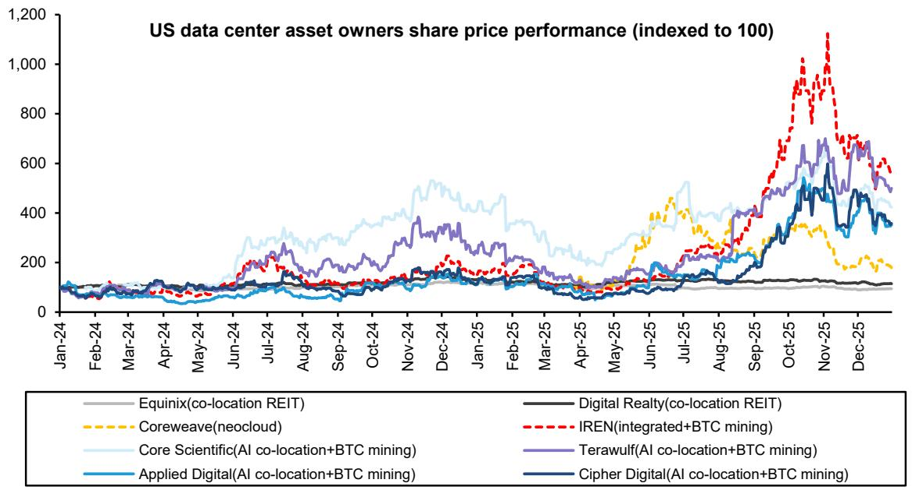

<details>
<summary>line</summary>

| Date    | Equinix(co-location REIT) | Coreweave(neocloud) | Core Scientific(AI co-location+BTC mining) | Applied Digital(AI co-location+BTC mining) | Digital Realty(co-location REIT) | IREN(integrated+BTC mining) | Terawulf(AI co-location+BTC mining) | Cipher Digital(AI co-location+BTC mining) |
|---------|---------------------------|---------------------|------------------------------------------|------------------------------------------|----------------------------------|-----------------------------|------------------------------------|------------------------------------------|
| Jan-24  | ~100                      | ~100                | ~100                                     | ~100                                     | ~100                             | ~100                        | ~100                               | ~100                                     |
| Feb-24  | ~100                      | ~100                | ~100                                     | ~100                                     | ~100                             | ~100                        | ~100                               | ~100                                     |
| Mar-24  | ~100                      | ~100                | ~100                                     | ~100                                     | ~100                             | ~100                        | ~100                               | ~100                                     |
| Apr-24  | ~100                      | ~100                | ~100                                     | ~100                                     | ~100                             | ~100                        | ~100                               | ~100                                     |
| May-24  | ~100                      | ~100                | ~100                                     | ~100                                     | ~100                             | ~100                        | ~100                               | ~100                                     |
| Jun-24  | ~100                      | ~100                | ~300                                     | ~100                                     | ~100                             | ~200                        | ~250                               | ~150                                     |
| Jul-24  | ~100                      | ~100                | ~350                                     | ~150                                     | ~150                             | ~250                        | ~350                               | ~250                                     |
| Aug-24  | ~100                      | ~100                | ~350                                     | ~250                                     | ~250                             | ~350                        | ~450                               | ~350                                     |
| Sep-24  | ~100                      | ~100                | ~350                                     | ~350                                     | ~350                             | ~450                        | ~550                               | ~450                                     |
| Oct-24  | ~100                      | ~100                | ~350                                     | ~450                                     | ~450                             | ~550                        | ~650                               | ~550                                     |
| Nov-24  | ~100                      | ~150                | ~450                                     | ~550                                     | ~550                             | ~650                        | ~750                               | ~650                                     |
| Dec-24  | ~150                      | ~250                | ~550                                     | ~650                                     | ~650                             | ~750                        | ~850                               | ~750                                     |
| Jan-25  | ~150                      | ~250                | ~450                                     | ~650                                     | ~650                             | ~750                        | ~850                               | ~750                                     |
| Feb-25  | ~150                      | ~250                | ~450                                     | ~650                                     | ~650                             | ~750                        | ~850                               | ~750                                     |
| Mar-25  | ~150                      | ~250                | ~450                                     | ~650                                     | ~650                             | ~750                        | ~850                               | ~750                                     |
| Apr-25  | ~150                      | ~250                | ~450                                     | ~650                                     | ~650                             | ~750                        | ~850                               | ~750                                     |
| May-25  | ~150                      | ~350                | ~450                                     | ~650                                     | ~650                             | ~750                        | ~850                               | ~750                                     |
| Jun-25  | ~150                      | ~450                | ~450                                     | ~650                                     | ~650                             | ~750                        | ~850                               | ~750                                     |
| Jul-25  | ~150                      | ~450                | ~450                                     | ~650                                     | ~650                             | ~750                        | ~850                               | ~750                                     |
| Aug-25  | ~150                      | ~350                | ~450                                     | ~650                                     | ~650                             | ~750                        | ~850                               | ~750                                     |
| Sep-25  | ~150                      | ~350                | ~450                                     | ~650                                     | ~650                             | ~750                        | ~850                               | ~750                                     |
| Oct-25  | ~150                      | ~350                | ~450                                     | ~650                                     | ~650                             | ~750                        | ~850                               | ~750                                     |
| Nov-25  | ~150                      | ~350                | ~450                                     | ~650                                     | ~650                             | ~750                        | ~850                               | ~750                                     |
| Dec-25  | ~150                      | ~350                | ~450                                     | ~650                                     | ~650                             | ~750                        | ~850                               | ~750                                     |
Index Level: 1, Indexed to 1, Total: 99. Top values are indices above 99; Total: 99 is an index of 99. Series: IREN(integrated+BTC mining); Core Scientific(Al co-location+BTC mining); Applied Digital(Al co-location+BTC mining); Digital Realty(co-location REIT); Copper Digital(Al co-location+BTC mining); IREN(integrated+BTC mining); Terawulf(Al co-location+BTC mining); Equinix(co-location REIT); Digital Realty(co-location REIT). Values range from approximately 99 to over 99.
</details>

Equinix, Digital Realty, CoreWeave by Madison Rezaei. IREN, Core Scientific by Gautam Chhugani. Rest not covered.   
Source: Bloomberg, Bernstein analysis

EXHIBIT 3: Business models for the asset owners involved in infrastructure renting and GPU hosting services 

<table><tr><td>Layer</td><td>Neocloud (Hardware/GPU owners)</td><td>Co-location (DC infrastructure owners)</td></tr><tr><td>Examples</td><td>CRWV, IREN</td><td>DC REITs (DLR, EQIX), CIFR, WULF</td></tr><tr><td>Land</td><td>Largely Leased</td><td></td></tr><tr><td>Building</td><td>Largely Leased</td><td></td></tr><tr><td>Power</td><td>Might have offtake agreements</td><td></td></tr><tr><td>GPUs</td><td>√</td><td></td></tr><tr><td>Tech Risk</td><td>Operator bears the tech obsolescence risk</td><td>Client bears the tech obsolescence risk</td></tr><tr><td>Revenue Economics</td><td>~$10 Mn/IT MW</td><td>~$1-2 Mn/ IT MW (for miners pivoting to AI co-location model)</td></tr><tr><td>Capex</td><td>GPU (~$30Mn/ IT MW) + Infra (if applicable, ~$15Mn/IT MW)</td><td>DC Capex (~$8-15 Mn/MW)</td></tr><tr><td>Deal duration</td><td>3-5 years (on-demand)</td><td>10-15 years + multiple extension options</td></tr><tr><td>End customers</td><td>Hyperscalers, Chip Makers</td><td>Neocloud, Hyperscalers, Chip makers</td></tr></table>

CoreWeave, Equinix, Digital Realty covered by Madison Rezaei, IREN covered by Gautam Chhugani. Rest not covered.   
Source: Company filings, Bernstein analysis

EXHIBIT 4: Select AI co-location deals in US 

<table><tr><td colspan="2">Parameter</td><td>CORZ (Landlord) - CoreWeave (Tenant)</td><td>APLD (Landlord) - CoreWeave (Tenant)</td><td>CIFR (Landlord)- Fluidstack (Tenant)</td></tr><tr><td rowspan="2">Scale</td><td>Critical IT Load (MW)</td><td>~590 MW</td><td>~400 MW</td><td>~168 MW</td></tr><tr><td>Contract Period</td><td>12 years (two 5-year renewal option)</td><td>15 years (extension option of 15 years)</td><td>10 years (two 5-year renewal option)</td></tr><tr><td rowspan="2">Per MW Economics</td><td>Annual Revenue/MW</td><td>~$1.44 Mn</td><td>~$1.83 Mn</td><td>~$1.79 Mn</td></tr><tr><td>NOI Margin(%)</td><td>~75-80%</td><td>~85-91%</td><td>~80-85%</td></tr><tr><td>Capex</td><td>Per IT MW</td><td>~$6-8 Mn/IT MW (prepayments by CRWV)</td><td>~$11-13 Mn/IT MW (to be borne by APLD)</td><td>~$9-11 Mn/IT MW (to be borne by CIFR)</td></tr><tr><td colspan="2">Avg. payback period for co-location deals</td><td colspan="3">~5 years (on 10-15 years stable contract with minimal tech obsolescence risk)</td></tr></table>

Source: Company, Bernstein Global Digital Assets team (analyst- Gautam Chhugani)

# EXHIBIT 5: Top US Markets Data Center Price & Vacancy 2016-2025

credits- Bernstein US Communications Infrastructure team (analyst- Madison Rezaei)

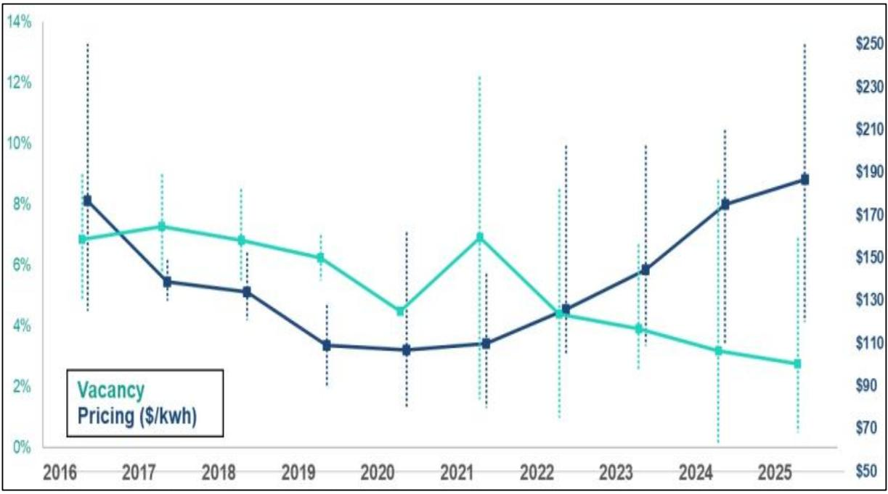

<details>
<summary>line</summary>

| Year | Vacancy Pricing ($/kwh) | Price ($/kwh) |
|------|--------------------------|---------------|
| 2016 | 8.0%                     | 160           |
| 2017 | 5.5%                     | 170           |
| 2018 | 5.0%                     | 165           |
| 2019 | 3.5%                     | 155           |
| 2020 | 3.0%                     | 130           |
| 2021 | 3.5%                     | 170           |
| 2022 | 4.5%                     | 130           |
| 2023 | 5.5%                     | 115           |
| 2024 | 8.0%                     | 105           |
| 2025 | 9.0%                     | 95            |
</details>

Source: Bernstein analysis

EXHIBIT 6: \~\$98Bn worth of co-location deals (against 4GW IT load) have been signed for the AI co-location model (avg duration of 10-15 years)   
credits- Bernstein Global Digital Assets team (analyst- Gautam Chhugani)   
Bitcoin miners are now integral part of the AI value chain   
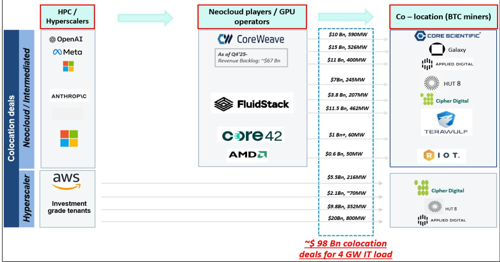

<details>
<summary>flowchart</summary>

```mermaid
graph LR
    A["Colocation deals"] --> B["HPC / Hyperscalers"]
    B --> C["Neocloud players / GPU operators"]
    C --> D["Co – location (BTC miners)"]
    
    subgraph HPC / Hyperscalers
        E["OpenAI"] --> F["Meta"]
        G["ANTHROP\C"] --> H["Square"]
    end
    
    subgraph Neocloud players / GPU operators
        I["CoreWeave"] --> J["As of Q4'25-Revenue Backlog: ~$67 Bn"]
        K["FluidStack"] --> L["Core42 AMD"]
        M["Core42 AMD"] --> N["Core42 AMD"]
    end
    
    subgraph Co – location (BTC miners)
        O["CORE SCIENTIFIC"] --> P["Galaxy"]
        P --> Q["APPLIED DIGITAL"]
        Q --> R["HUT 8"]
        Q --> S["Cipher Digital"]
        Q --> T["TERAWULF"]
        Q --> U["R I O T."]
        U --> V["Cipher Digital"]
        V --> W["HUT 8"]
        V --> X["APPLIED DIGITAL"]
    end
    
    subgraph Investment grade tenants
        Y["aws"] --> Z["Investment grade tenants"]
    end
    
    style HPC / Hyperscalers fill:#f9f9f9,stroke:#333
    style Neocloud / Neocloud deal
    style Neocloud deal fill:#e6f7ff,stroke:#333
    style Neocloud deal fill:#e6f7ff,stroke:#333
    style Neocloud deal fill:#e6f7ff,stroke:#333
    style Neocloud deal fill:#e6f7ff,stroke:#333
    style Neocloud deal fill:#e6f7ff,stroke:#333
    style Neocloud deal fill:#e6f7ff,stroke:#330
    style Neocloud deal fill:#e6f7ff,stroke:#330
    style Neocloud deal fill:#e6f7ff,stroke:#330
    style Neocloud deal fill:#e6f7ff,stroke:#330
    style Neocloud deal fill:#e6f7ff,stroke:#330
    style Neocloud deal fill:#e6f7ff,stroke:#331
    style Neocloud deal fill:#e6f7ff,stroke:#331
    style Neocloud deal fill:#e6f7ff,stroke:#331
    style Neocloud deal fill:#e6f7ff,stroke:#331
    style Neocloud deal fill:#e6f7ff,stroke:#331
    style Neocloud deal fill:#e6f7ff,stroke:#332
    style Neocloud deal fill:#e6f7ff,stroke:#332
    style Neocloud deal fill:#e6f7ff,stroke:#332
    style Neocloud deal fill:#e6f7ff,stroke:#332
    style Neocloud deal fill:#e6f7ff,stroke:#332
    style Neocloud deal fill:#e6f7ff,stroke:#333
    style Neocloud deal fill:#e6f7ff,stroke:#333
    style Neocloud deal fill:#e6f7ff,stroke:#333
    style Neocloud deal fill:#e6f7ff,stroke:#334
    style Neocloud deal fill:#e6f7ff,stroke:#334
    style Neocloud deal fill:#e6f7ff,stroke:#335
    style Neocloud deal fill:#e6f7ff,stroke:#335
    style Neocloud deal fill:#e6f7ff,stroke:#336
    style Neocloud deal fill:#e6f7ff,stroke:#336
    style Neocloud deal fill:#e6f7ff,stroke:#337
    style Neocloud deal fill:#e6f7ff,stroke:#338
    style Neocloud deal fill:#e6f7ff,stroke:#339
    style Neocloud deal fill:#e6f7ff,stroke:#340
    style Neocloud deal fill:#e6f7ff,stroke:#341
    style Neocloud deal fill:#e6f7ff,stroke:#342
    style Neocloud deal fill:#e6f7ff,stroke:#343
    style Neocloud deal fill:#e6f7ff,stroke:#344
    style Neocloud deal fill:#e6f7ff,stroke:#345
    style Neocloud deal fill:#e6f7ff,stroke:#346
    style Neocloud deal fill:#e6f7ff,stroke:#347
    style Neocloud deal fill:#e6f7ff,stroke:#348
    style Neocloud deal fill:#e6f7ff,stroke:#349
    style Neocloud deal fill:#e6f7ff,stroke:#350
    style Neocloud deal fill:#e6f7ff,stroke:#351
    style Neocloud deal fill:#e6f7ff,stroke:#352
    style Neocloud deal fill:#e6f7ff,stroke:#353
    style Neocloud deal fill:#e6f7ff,stroke:#354
    style Neocloud deal fill:#e6f7ff,stroke:#355
    style Neocloud deal fill:#e6f7ff,stroke:#356
    style Neocloud deal fill:#e6f7ff,stroke:#357
    style Neocloud deal fill:#e6f7ff,stroke:#358
    style Neocloud deal fill:#e6f7ff,stroke:#359
    style Neocloud deal fill:#e6f7ff,stroke:#360
```
</details>

Meta, Amazon covered by Mark Shmulik. Microsoft covered by Mark Moerdler. CoreWeave covered by Madison Rezaei. Core Scientific, Riot covered by Gautam Chhugani. Rest are not covered.   
Source: Bernstein analysis

# WHAT MADE DC ASSET OWNER SUCCESSFUL IN US?

Access to Power in the right location is the right to win- Grid interconnection is the most vital factor for the data center site selection- Exhibit 7. ERCOT's large-load interconnection queue has swelled from 49 GW to 225 GW within a span of \~2.5 years, dominated by data centers- Exhibit 8. Further, it now takes around \~6 years in the US to get a connection to the grid- Exhibit 9.

BTC miners pivot to AI Data Centers: Bitcoin miners have emerged as attractive partners for AI cloud providers- offering pre-secured, scalable power capacity- Exhibit 10 and infrastructure already designed for high-density, compute-intensive operations at a conversion cost of \$5-8 Mn/MW- Exhibit 11. This has also driven a sharp re-rating in their valuations, as investors increasingly view them as strategic beneficiaries of AI-led infrastructure demand. Examples include Core Scientific, Applied Digital, IREN, Cipher Digital, etc.

EXHIBIT 7: Grid connection is the key for data center site selection   
Key factors for data center site selection   
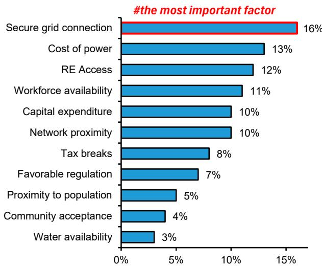

<details>
<summary>bar</summary>

#the most important factor
| Factor | Value (%) |
|---|---|
| Secure grid connection | 16 |
| Cost of power | 13 |
| RE Access | 12 |
| Workforce availability | 11 |
| Capital expenditure | 10 |
| Network proximity | 10 |
| Tax breaks | 8 |
| Favorable regulation | 7 |
| Proximity to population | 5 |
| Community acceptance | 4 |
| Water availability | 3 |
</details>

Source: BNEF, Bernstein analysis

EXHIBIT 8: ERCOT large load interconnection queue: most of the incremental requests have come from data centers   
ERCOT large load interconnection queue change (GW)   
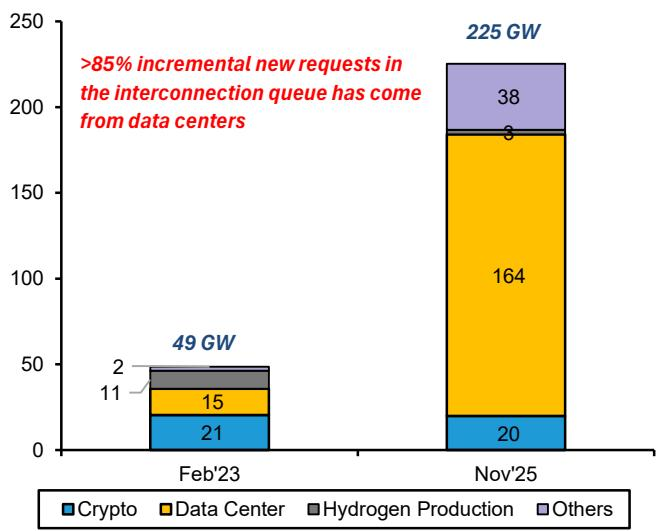

<details>
<summary>bar_stacked</summary>

| Date | Crypto (GW) | Data Center (GW) | Hydrogen Production (GW) | Others (GW) |
| :--- | :--- | :--- | :--- | :--- |
| Feb'23 | 21 | 15 | 11 | 2 |
| Nov'25 | 20 | 164 | 8 | 38 |
*85% incremental new requests in the interconnection queue has come from data centers; Total: 225 GW
</details>

Source: ERCOT, Bernstein analysis

EXHIBIT 9: Interconnection waiting time for different ISOs   
Average time for interconnection in US (years)- 2024   
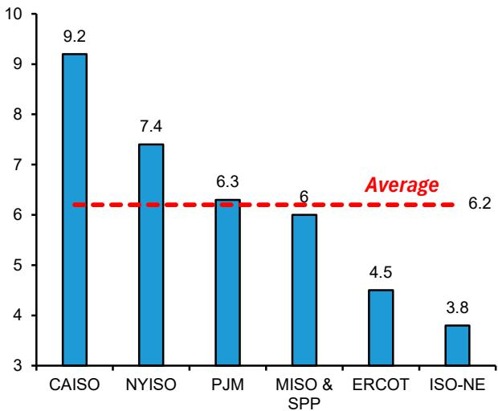

<details>
<summary>bar</summary>

| Category | Value |
|---|---|
| CAISO | 9.2 |
| NYISO | 7.4 |
| PJM | 6.3 |
| MISO & SPP | 6 |
| ERCOT | 4.5 |
| ISO-NE | 3.8 |
Average
</details>

Source: PV magazine, Bernstein analysis

EXHIBIT 10: IREN has the highest contracted power among the BTC miners with facilities concentrated in Texas   
Crypto Miners - Operating and additional contracted power capacity (GW)   
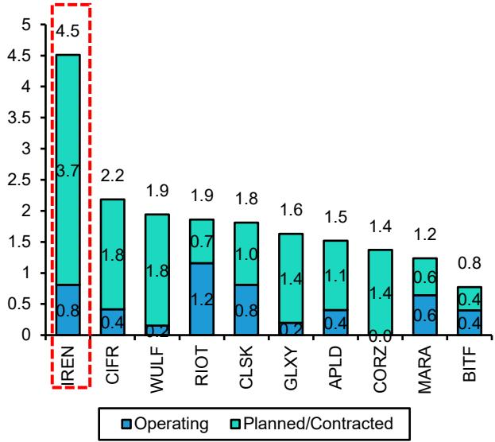  
Only IREN, RIOT, CLSK, CORZ, MARA covered by Gautam Chhugani.   
Source: Company filings, Bernstein analysis

EXHIBIT 11: What it takes to convert BTC mining data centers to AI data centers   
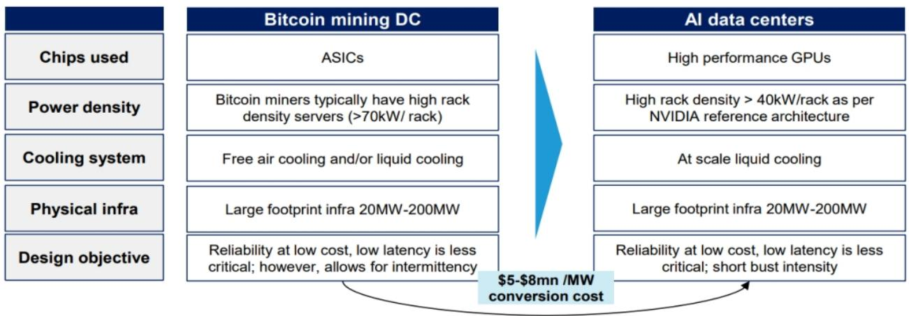

<details>
<summary>flowchart</summary>

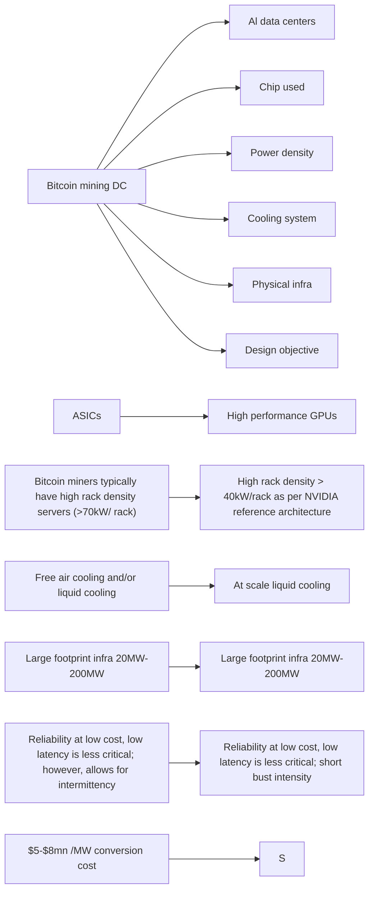
</details>

Source: Company presentation, Company filings, Bernstein analysis

# COMPANIES LOOKING TO BUILD DATA-CENTERS IN INDIA

Exhibit 12 gives details of the Indian companies with operations in the DC space. If we use the framework of land x power being the differentiator - the dominance of Adani Group (largest renewable, private thermal, and transmission player in India) is unmatched alongside 1,000+ acres of land bank in Panvel, followed by Reliance industries (both have 0.5 Mn acres of land parcel, Reliance has a big land parcel in Navi Mumbai as well of >5K acres).

EXHIBIT 12: Different business models adopted by Indian companies in Data Centers space 

<table><tr><td rowspan="2">Company</td><td colspan="3">Scope</td><td rowspan="2">Capacity Target</td><td rowspan="2">Investments</td><td rowspan="2">Partners / Hyperscaler</td><td rowspan="2">Right to win</td></tr><tr><td>Access to power</td><td>DC infra</td><td>GPU/Inference services</td></tr><tr><td>Adani Group</td><td>Yes</td><td>Yes</td><td>Maybe</td><td>5 GW (existing 2 GW JV) by 2035</td><td>Announced to invest $100Bn by 2035</td><td>Google (Raiden Info Tech for Vizag), EdgeConneX (JV)</td><td>a) 5L acres land bank; b) Largest thermal and renewable generation capacities; c) 23GW RE grid access to be rolled out; d) 1,000+ acres land in Panvel</td></tr><tr><td>Reliance Industries / Jio</td><td>Yes</td><td>Yes</td><td>Yes</td><td>3 GW (Jamnagar) + 1 GW (AP); 120MW by H2&#x27;26</td><td>$20-30Bn (Jamnagar), $11Bn (AP); $100Bn by 2035</td><td>Brookfield, Digital Realty, Meta, Google</td><td>a) 5L acres land bank; b) Building one of the largest solar and battery mfg facility; c) large retail customer base; d) 5,286 acres land bank in Navi Mumbai</td></tr><tr><td>L&amp;T</td><td>No</td><td>Yes</td><td>Yes</td><td>200 MW by 2031 (existing 30 MW)</td><td>$1Bn+ capex over the next 5 years</td><td>E2E, Microsoft</td><td>a) 3rd party DC EPC+MEP services provider+DC owner operator; b) Significant owned land</td></tr><tr><td>Lodha (Macrotech Developers)</td><td>No</td><td>Yes</td><td>Likely No</td><td>2.5GW data center park; 1GW DC co-location facility</td><td>$14Bn for Data Center park and ~$1Bn for DC shell</td><td>AWS, STT</td><td>~4,500 acres of land bank in Palava</td></tr><tr><td>Yotta Infrastructure (subsidiary of Hiranandani group)</td><td>No</td><td>Yes</td><td>Yes</td><td>Data centers in Navi Mumbai, Chennai, Greater Noida</td><td>~$2Bn+ on 20,000 Nvidia Blackwell chips</td><td>Nvidia</td><td>600 acres land bank in Panvel (owned by Hiranandani group)</td></tr><tr><td>TCS / Tata Group</td><td>No</td><td>Yes</td><td>Likely No</td><td>1 GW in 5-7 years (1st phase to come online in 2028)</td><td>$6.5Bn over the next 5-7 years</td><td>TPG (PE partner)</td><td rowspan="4"></td></tr><tr><td>Bharti Airtel (Nxtra)</td><td>No</td><td>Yes</td><td>Likely No</td><td>1 GW by 2030 (from 240 MW current)</td><td>-</td><td>Alpha Wave Global, Carlyle, Anchorage Capital</td></tr><tr><td>CtrlS Datacenters</td><td>No</td><td>Yes</td><td>Likely No</td><td>1 GW+ from the existing 250MW (by 2030)</td><td>$2Bn by 2030</td><td>NTPC (MoU for 2 GW renewable energy supply)</td></tr><tr><td>Anantraj</td><td>No</td><td>Yes</td><td>Likely No</td><td>307MW by 2032 (28MW currently)</td><td>$2Bn by 2032</td><td>Orange Business, Submer</td></tr></table>

Coverage: Amazon, Meta, Google by Mark Shmulik. Microsoft by Mark Moerdler. Nvidia is by Stacy Rasgon. L&T and NTPC by us. Rest are not covered.   
Source: Company filings, Press articles, Bernstein analysis

EXHIBIT 13: Recent land acquisition deals in Navi Mumbai region 

<table><tr><td>Buyer</td><td>Date</td><td>Seller</td><td>Location</td><td>Area (acres)</td><td>Value (Rs Cr)</td><td>Rate (Rs Cr/acre)</td></tr><tr><td>Amazon</td><td>Jun&#x27;26</td><td>Macrotech (Lodha)</td><td>Palava (near Navi Mumbai)</td><td>11</td><td>125</td><td>12</td></tr><tr><td>STT Global Data Centres</td><td>Sep&#x27;25</td><td>Macrotech (Lodha)</td><td>Palava (near Navi Mumbai)</td><td>24</td><td>500</td><td>21</td></tr><tr><td>Parth Life Spaces</td><td>Aug&#x27;25</td><td>CIDCO</td><td>Navi Mumbai</td><td>~4,500–5,100 sq.m. each</td><td>1500</td><td>40</td></tr><tr><td>L&amp;T Realty</td><td>May&#x27;25</td><td>Private landowners</td><td>Panvel</td><td>34</td><td>102</td><td>3</td></tr><tr><td>AWS</td><td>Dec&#x27;24</td><td>Macrotech (Lodha)</td><td>Palava (near Navi Mumbai)</td><td>38</td><td>450</td><td>12</td></tr><tr><td>Google</td><td>Mar&#x27;24</td><td>MIDC</td><td>Navi Mumbai</td><td>23</td><td>850</td><td>38</td></tr><tr><td colspan="7">AirTrunk (acquired by Blackstone) has recently signed Lol for DC land in Mumbai outskirts for 3GW capacity; to invest ~$21Bn</td></tr></table>

Amazon and Google covered by Mark Shmulik. L&T covered by us. Rest are not covered

Source: Company, Press articles, Bernstein analysis

# VALUATION - THIS IS WHAT SHOCKED US...

Mature, scaled data center operators like Equinix and Digital Realty currently trade at about 22-23x 12m fwd EV/EBITDA-Exhibit 14 (DC REITs in US are valued on NTM AFFO as they have recurring distributable cashflows, but for comparison purpose we have used EV/EBITDA), broadly in line with recent data center M&A, such as Blackstone and CPP's acquisition of AirTrunk at \~21x. As shown in Exhibit 15, nearly all private-market DC deals have cleared in the \~20-30x band. On the other hand, players with GPU ownership (like CoreWeave and IREN) are trading at much cheaper multiples (7-11x), likely reflecting heavy capex and tech obsolescence risk inherent in their business model. Additionally, AI co-location names are trading at highly elevated multiples likely due to the fact that they remain in early-stage growth with EBITDA yet to materialize at scale.

EXHIBIT 14: Comps table for select Data Center infrastructure players in US 

<table><tr><td>Company</td><td>Market Cap ($Bn)</td><td>EV/EBITDA- 12m fwd</td></tr><tr><td colspan="3">Neocloud (GPU as a Service)</td></tr><tr><td>CoreWeave</td><td>56</td><td>7x</td></tr><tr><td colspan="3">Co-location (Infrastructure as a Service)</td></tr><tr><td>Terawulf</td><td>13</td><td>46x</td></tr><tr><td>Applied Digital</td><td>14</td><td>51x</td></tr><tr><td>Cipher Digital</td><td>10</td><td>71x</td></tr><tr><td>Equinix (DC REIT)</td><td>106</td><td>23x</td></tr><tr><td>Digital Realty (DC REIT)</td><td>69</td><td>22x</td></tr><tr><td colspan="3">Integrated (GPU + Co-location)</td></tr><tr><td>IREN</td><td>24</td><td>13x</td></tr><tr><td>HIVE</td><td>1</td><td>11x</td></tr></table>

Source: Bloomberg, Bernstein analysis

EXHIBIT 15: Recent Data Center deals 

<table><tr><td>Company</td><td>Acquirer</td><td>Year of Acquisiton</td><td>EV ($Bn)</td><td>Multiple</td><td>Post acq growth</td></tr><tr><td>Aligned Data Centers</td><td>Blackrock and MGX</td><td>2025</td><td>~$40 Bn</td><td>Likely around 26x</td><td>-</td></tr><tr><td>AirTrunk</td><td>Blackstone + CPP</td><td>2024</td><td>~$16 Bn</td><td>21x EBITDA</td><td>Expansion in Japan, India and Saudi Arabia</td></tr><tr><td>Vantage Data Centers</td><td>DigitalBridge + Silver Lake</td><td>2024</td><td>$9.2 Bn equity investment</td><td>-</td><td>To drive $30 billion in data center development</td></tr><tr><td>CyrusOne</td><td>KKR + GIP</td><td>2022</td><td>~$15 Bn</td><td>26x EV/EBITDA</td><td>-</td></tr><tr><td>Switch</td><td>DigitalBridge + IFM</td><td>2022</td><td>~$11 Bn</td><td>31x 2022E EBITDA</td><td>Plans to do IPO for an estimated value of ~$60 Bn</td></tr><tr><td>QTS</td><td>Blackstone</td><td>2021</td><td>~$10 Bn</td><td>30x 2021E EV/EBITDA</td><td>Revenue $0.7B → $4.2B; capacity: 400MW -&gt; 3GW</td></tr></table>

Blackstone is covered by Patrick Davitt. Rest not covered

Source: Company filings, Press Articles, Bernstein analysis

# B) POWER UTILITY WINNERS

If we look at the performance of power utility names in the US since the data-center boom started, we see a very divided front. Over Jan'22-Dec'25, Vistra and Constellation Energy have risen \~8x and NRG \~4x, while most other utilities have barely moved in comparison, Exhibit 16.

EXHIBIT 16: Share price trend for US power generation companies   
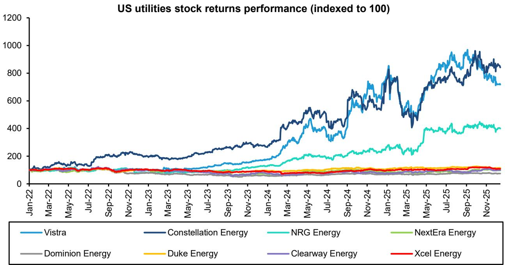  
None of them is covered by us   
Source: Bloomberg, Bernstein analysis

Two factors are driving this gap - dispatchable generation capacity and location of the plants. The biggest beneficiaries have been companies which were present in ERCOT (Texas) and PJM markets. Even within them the biggest beneficiaries were the ones-

1. Having dispatchable available capacity: Building new nuclear plants takes \~10 years, and adding new gas units take \~5 years due to tight supply of gas turbines, with long interconnection queues further adding to the timelines. That means companies that already own large nuclear and gas fleets are in a strong position as data-center demand soars and supply stays constrained.   
2. Access to land and behind-the-meter colocation: Another advantage is the ability to host data centers directly on land adjacent to large power plants, avoiding congested transmission and interconnection queues. Talen's sale of the 960 MW Cumulus campus next to its Susquehanna nuclear plant to AWS, alongside long-term PPAs, shows how such co-location lets hyperscalers secure firm, carbon-free power while generators unlock long term contracted revenue.   
3. Premium for nuclear - clean dispatchable power: Scarcity of firm, carbon-free baseload power attracted hyperscalers willing to sign long-term nuclear PPAs at significant premiums to spot and forward market prices. Exhibit 18 gives recent PPAs signed between hyperscalers and nuclear power producers (Vistra and Constellation Energy).

In-direct beneficiaries have been coal plants as well - Over May'25-Mar'26, the U.S. DOE had issued 43 emergency orders deferring the retirement of at least 4.4 GW of coal capacity, largely driven by rising power demand from data centers. Further, there have also been reports about Microsoft delaying its 2030 target of $100\%$ RE due to energy-intensive build-out of data centers.

EXHIBIT 17: US utilities financial performance comparison 

<table><tr><td>Company</td><td>Generation source</td><td>Location</td><td colspan="2">ROE</td><td colspan="2">ROCE</td><td>NI growth CAGR (2023-25)</td><td>Comments</td></tr><tr><td colspan="3"></td><td>2021</td><td>2025</td><td>2021</td><td>2025</td><td colspan="2">(2023-25)</td></tr><tr><td>Vistra</td><td>Primarily gas, coal and nuclear</td><td>Primarily ERCOT, PJM</td><td>-17%</td><td>26%</td><td>-5%</td><td>8%</td><td>24%</td><td>Only ~4 GW contracted out of 44 GW capacity</td></tr><tr><td>Constellation Energy</td><td>Primarily gas, coal and nuclear</td><td>Primarily ERCOT, PJM</td><td>-2%</td><td>17%</td><td>-1%</td><td>12%</td><td>31%</td><td>Nuclear PPAs with Hyperscalers</td></tr><tr><td>NRG Energy</td><td>Primarily gas and coal</td><td>Primarily ERCOT, PJM</td><td>83%</td><td>56%</td><td>23%</td><td>9%</td><td>19%</td><td>-</td></tr><tr><td>Dominion Energy</td><td>Primarily gas, coal and nuclear</td><td>Virginia, Carolina</td><td>13%</td><td>11%</td><td>7%</td><td>6%</td><td>7%</td><td>Regulated</td></tr><tr><td>Duke Energy</td><td>Primarily fossil + nuclear</td><td>Carolinas, Ohio, Florida, Indiana</td><td>8%</td><td>10%</td><td>5%</td><td>6%</td><td>6%</td><td>Regulated</td></tr><tr><td>NextEra Energy</td><td>Primarily renewables</td><td>Pan US (Florida heavy)</td><td>10%</td><td>13%</td><td>4%</td><td>6%</td><td>-2%</td><td>Significant portion is regulated+contracted</td></tr><tr><td>Clearway Energy</td><td>Primarily renewables</td><td>Multiple states</td><td>3%</td><td>8%</td><td>2%</td><td>1%</td><td>6%</td><td></td></tr><tr><td>Xcel Energy</td><td>Primarily renewables</td><td>Multiple states</td><td>11%</td><td>9%</td><td>6%</td><td>6%</td><td>6%</td><td>Regulated</td></tr></table>

None of them is covered by us   
Source: Bloomberg, Bernstein analysis

EXHIBIT 18: Nuclear PPAs signed between US power utilities and hyperscalers 

<table><tr><td>Counterparty pair</td><td>Date</td><td>Plant / asset</td><td>Location / market</td><td>Term</td><td>Contracted capacity</td></tr><tr><td>Vistra - Meta</td><td>Jan&#x27;26</td><td>Perry, Davis-Besse, Beaver Valley (nuclear fleet)</td><td>Ohio &amp; Pennsylvania, PJM</td><td>20 years</td><td>&gt;2,600 MW</td></tr><tr><td>Vistra - Amazon</td><td>Sep&#x27;25</td><td>Comanche Peak (nuclear)</td><td>Texas, ERCOT</td><td>20 years</td><td>Up to 1,200 MW</td></tr><tr><td>Constellation - Meta</td><td>Jun&#x27;25</td><td>Clinton nuclear plant</td><td>Illinois, MISO</td><td>20 years</td><td>~1,121 MW</td></tr><tr><td>Constellation - Microsoft</td><td>Sep&#x27;24</td><td>Three Mile Island (nuclear)</td><td>Pennsylvania, PJM</td><td>20 years</td><td>835 MW</td></tr></table>

Source: Company filings, Press articles, Bernstein analysis

The gains for some of these generators is visible in power market and locked in prices:

a) Surge in capacity market and wholesale power prices in these regions: PJM runs a forward capacity market that pays generators “capacity revenues” simply for committing to be available during future peak-demand periods, on top of whatever they earn from selling energy. PJM capacity prices rose- from \~\$29/MW-day for 2024/25 to \~\$270/MW-day for 2025/26, and then to \$329/MW-day for 2026/27. At the same time, they were also benefited due to their ability to sell a large share of their generation at higher wholesale prices in PJM and EROCT when power prices spiked- Exhibit 19

b) Higher all-in realized prices locked by generators: Companies like Vistra have already locked-in their nuclear and gas capacities at higher realized prices for 2026 and 2027, at a premium to hub prices, which also helps them to protect the downside.

EXHIBIT 19: Vistra Corp: increased revenues (in 2025 vs 2024) from wholesale generation and capacity market   
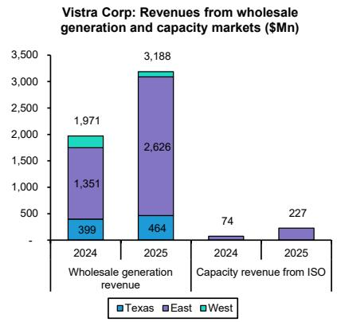

EXHIBIT 20: PJM market capacity revenues   
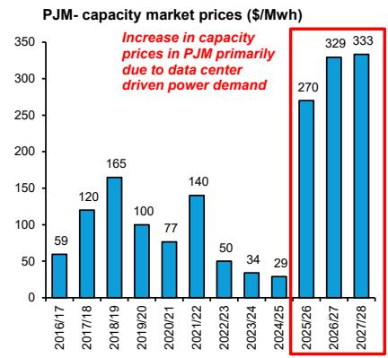

<details>
<summary>bar</summary>

| Year       | Price ($/MWh) |
| ---------- | ------------- |
| 2016/17    | 59            |
| 2017/18    | 120           |
| 2018/19    | 165           |
| 2019/20    | 100           |
| 2020/21    | 77            |
| 2021/22    | 140           |
| 2022/23    | 50            |
| 2023/24    | 34            |
| 2024/25    | 29            |
| 2025/26    | 270           |
| 2026/27    | 329           |
| 2027/28    | 333           |
</details>

Source: BNEF, Bernstein analysis

EXHIBIT 21: ERCOT ATC average power prices   
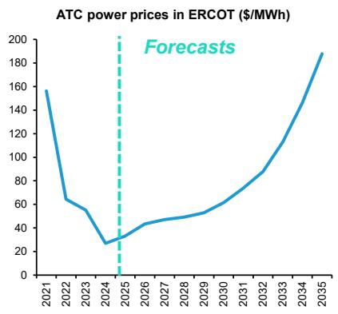

<details>
<summary>line</summary>

| Year | ATC Power Prices ($/MWh) |
|------|--------------------------|
| 2021 | 160                      |
| 2022 | 60                       |
| 2023 | 50                       |
| 2024 | 30                       |
| 2025 | 40                       |
| 2026 | 50                       |
| 2027 | 55                       |
| 2028 | 60                       |
| 2029 | 70                       |
| 2030 | 80                       |
| 2031 | 90                       |
| 2032 | 100                      |
| 2033 | 120                      |
| 2034 | 150                      |
| 2035 | 190                      |
</details>

Source: BNEF, Bernstein analysis   
Source: Company filings, Bernstein analysis

# WHO WILL BENEFIT AMONG INDIAN UTILITIES?

If we look at learnings from US, having dispatchable open power capacity can be a huge advantage for power generators as Data-center capex picks up and speed to market becomes critical. In India, the Adani group (across power and green) completely dominates merchant power market and even future capacity addition - with their large land parcel, grid connectivity and locked thermal equipments. We expect DCs to be ambivalent to color of power, although they might not sign a direct contract with a thermal company, via an intermediary (either DISCOM or trader like Adani Energy Solutions - not covered), they are fine to source thermal as well to our understanding.

EXHIBIT 22: Indian utilities comparison on key operational metrics 

<table><tr><td>Company</td><td>Operating Capacity (GW)</td><td>Type</td><td>Merchant Capacity (MW)</td><td>RE connectivity access to be rolled-out (GW)</td></tr><tr><td>Adani Green (largest land parcel)</td><td>19</td><td>Renewables</td><td>4,245</td><td>23</td></tr><tr><td>Adani Power</td><td>18</td><td>Thermal</td><td>2,599</td><td>-</td></tr><tr><td>Jaiprakash Power (To become part of Adani Power)</td><td>2</td><td>Thermal+Hydro</td><td>900</td><td></td></tr><tr><td>ReNew</td><td>13</td><td>Renewables</td><td>600</td><td>14</td></tr><tr><td>NTPC</td><td>89</td><td>Thermal+Renewables</td><td>390</td><td>-</td></tr><tr><td>JSW Energy</td><td>13</td><td>Thermal+Renewables</td><td>300</td><td>5</td></tr><tr><td>Tata Power</td><td>17</td><td>Thermal+Renewables</td><td>120</td><td>9</td></tr><tr><td>NTPC Green</td><td>10</td><td>Renewables</td><td>-</td><td>16</td></tr></table>

Except Jaiprakash Power, all are covered by us   
Source: Company filings, CTU, Press articles, Bernstein analysis

# I. REQUIRED DISCLOSURES

References to "Bernstein" or the "Firm" in these disclosures relate to the following entities: Bernstein Institutional Services LLC (April 1, 2024 onwards), Bernstein & Co., LLC (pre April 1, 2024), Bernstein Autonomous LLP, BSG France S.A. (April 1, 2024 onwards), Bernstein (Hong Kong) Limited 盛博香港有限公司, Bernstein (Canada) Limited, Bernstein (India) Private Limited (SEBI registration no. INH000006378), Bernstein (Singapore) Private Limited, Bernstein Japan KK (サンフォード・C・バーンスタイン株式会社) and analysts employed by SG Africa Technologies & Services to produce Bernstein under a Global Services Agreement in place between Bernstein and SG.

Bernstein is part of a joint venture between SG (SG) and AllianceBernstein, L.P. (AB). Unless specifically noted otherwise, for purposes of these disclosures, references to Bernstein's “affiliates” relate to both SG and AB and their respective affiliates.

# VALUATION METHODOLOGY

This research publication covers six or more companies. For valuation methodology and other company disclosures:

Please visit: https://bernstein-autonomous.bluematrix.com/sellside/Disclosures.action.

Or, you can also write to the Director of Compliance, Bernstein Institutional Services LLC, 245 Park Avenue, New York, NY 10167.

# RISKS

This research publication covers six or more companies. For risks and other company disclosures:

Please visit: https://bernstein-autonomous.bluematrix.com/sellside/Disclosures.action.

Or, you can also write to the Director of Compliance, Bernstein Institutional Services LLC, 245 Park Avenue, New York, NY 10167.

# RATINGS DEFINITIONS, BENCHMARKS AND DISTRIBUTION

# EQUITY RATINGS DEFINITIONS

# Bernstein brand

The Bernstein brand rates stocks based on forecasts of relative performance for the next 12 months versus the S&P 500 for stocks listed on the U.S. and Canadian exchanges, versus the Bloomberg Europe Developed Markets Large and Mid Cap Price Return Index EUR (EDME) for stocks listed on the European exchanges and emerging markets exchanges outside of the Asia Pacific region, versus the Bloomberg Japan Large and Mid Cap Price Return Index USD (JPL) for stocks listed on the Japanese exchanges, and versus the Bloomberg Asia ex-Japan Large and Mid Cap Price Return Index (ASIAX) for stocks listed on the Asian (ex-Japan) exchanges -unless otherwise specified.

The Bernstein brand has three categories of ratings:

- Outperform: Stock will outpace the market index by more than 15 pp   
• Market-Perform: Stock will perform in line with the market index to within +/-15 pp   
• Underperform: Stock will trail the performance of the market index by more than 15 pp

Coverage Suspended: Coverage of a company under the Bernstein brand has been suspended. Ratings and price targets are suspended temporarily, are no longer current, and should therefore not be relied upon.

Not Rated: A rating assigned when the stock cannot be accurately valued, or the performance of the company accurately predicted, at the present time. The covering analyst may continue to publish research reports on the company to update investors on events and developments.

Not Covered (NC) denotes companies that are not under coverage.

Bernstein brand stock ratings are based on a 12-month time horizon.

# Autonomous brand – common stocks

The Autonomous brand rates common stocks as indicated below. As our benchmarks we use the Bloomberg Europe 500 Banks And Financial Services Index (BEBANKS) and Bloomberg Europe Dev Mkt Financials Large and Mid Cap Price Ret Index EUR (EDMFI) index for developed European banks and Payments, the Bloomberg Europe 500 Insurance Index (BEINSUR) for European insurers, the S&P 500 and S&P Financials for US banks and Payments coverage, S5LIFE for US Insurance, the S&P Insurance Select Industry (SPSIINS) for US Non-Life Insurers coverage, and the Bloomberg Emerging Markets Financials Large, Mid and Small Cap Price Return Index (EMLSF) for emerging market banks and insurers and Payments. Ratings are stated relative to the sector (not the market).

The Autonomous brand has three categories of common stock ratings:

- Outperform (OP): Stock will outpace the relevant index by more than 10 pp   
- Neutral (N): Stock will perform in line with the market index to within +/-10 pp   
• Underperform (UP): Stock will trail the performance of the relevant index by more than 10 pp

Coverage Suspended: Coverage of a company under the Autonomous research brand has been suspended. Ratings and price targets are suspended temporarily, are no longer current, and should therefore not be relied upon.

Not Rated: A rating assigned when the stock cannot be accurately valued, or the performance of the company accurately predicted, at the present time. The covering analyst may continue to publish research reports on the company to update investors on events and developments.

Those denoted as ‘Feature’ (e.g., Feature Outperform FOP, Feature Under Outperform FUP) are our core ideas.

Not Covered (NC) denotes companies that are not under coverage.

Autonomous brand common stock ratings are based on a 12-month time horizon.

# Autonomous brand – preferred stocks

The Autonomous brand has three categories of preferred stock ratings:

- Outperform (OP): The total return of the preferred instrument is expected to outperform preferred securities of other issuers operating in similar sectors or rating categories over the next six months.   
- Neutral (N): The total return of the preferred instrument is expected to perform in line with preferred securities of other issuers operating in similar sectors or rating categories over the next six months.   
- Underperform (UP): The total return of the preferred instrument is expected to underperform preferred securities of other issuers operating in similar sectors or rating categories over the next six months.

Autonomous preferred stock ratings are based on a 6-month time horizon.

# AUTONOMOUS CREDIT RESEARCH

Where this report contains investment recommendations for credit instruments, as defined in article 3(1)(35) of the Market Abuse Regulation, the information below is presented to comply with its disclosure requirements.

The report may also include reference(s) to published opinions by other Autonomous or Bernstein analysts covering the equity securities of the issuer(s) referenced herein. Please note an investment recommendation for credit instruments published by the author(s) of this report may differ from the published view of the analyst covering equity securities for the issuer(s) contained in this report and vice versa.

# CREDIT RATINGS DEFINITIONS

The Autonomous brand has three categories of credit ratings:

\- Credit Outperform (C-OP): The total return of the Reference Credit Instrument is expected to outperform the credit spread of bonds of other issuers operating in similar sectors or rating categories over the next six months.

- Credit Neutral (C-N): The total return of the Reference Credit Instrument is expected to perform in line with the credit spread of bonds of other issuers operating in similar sectors or rating categories over the next six months.   
- Credit Underperform (C-UP): The total return of the Reference Credit Instrument is expected to underperform the credit spread of bonds of other issuers operating in similar sectors or rating categories over the next six months.

Autonomous credit ratings are based on a 6-month time horizon.

A list of all investment recommendations produced by the author(s) of this report alongside credit ratings history are available upon request.

It is at the sole discretion of the Firm as to when to initiate, update and cease research coverage. The Firm has established, maintains and relies on information barriers to control the flow of information contained in one or more areas (i.e. the private side) within the Firm, and into other areas, units, groups or affiliates (i.e. public side) of the Firm

DISTRIBUTION OF EQUITY RATINGS/INVESTMENT BANKING SERVICES 

<table><tr><td>Equity Rating</td><td>Market Abuse Regulation (MAR) and FINRA Rating Category</td><td>Global Rating Distribution</td><td>Investment Banking Relationships*</td></tr><tr><td>Outperform</td><td>BUY</td><td>51.1%</td><td>16.5%</td></tr><tr><td>Market-Perform (Bernstein Brand) Neutral (Autonomous Brand)</td><td>HOLD</td><td>36.3%</td><td>17.8%</td></tr><tr><td>Underperform</td><td>SELL</td><td>12.6%</td><td>14.9%</td></tr></table>

\* These figures represent the percentage of companies within each equity rating category for which affiliates of Bernstein have provided investment banking services within the previous 12 months.
As of March 31, 2026. All figures are updated quarterly.

# PRICE CHARTS/ RATINGS AND PRICE TARGET HISTORY

This research publication covers six or more companies. For price chart and other company disclosures, please visit https://bernstein-autonomous.bluematrix.com/sellside/Disclosures.action or you can write to the Director of Compliance, Bernstein Institutional Services LLC, 245 Park Avenue, New York, NY 10167.

# CONFLICTS OF INTEREST

Bernstein Autonomous LLP or BSG France SA, beneficially, has either a net long or short position of 0.5% or more of the total issued share capital of a class of common equity securities of the following MiFID eligible securities: Digital Realty Trust, Inc..

Bernstein and/or affiliates have received compensation for investment banking services in the past twelve months from CoreWeave, Inc..

Bernstein and/or affiliates have received compensation for non-investment banking securities-related products or services in the previous twelve months from the following clients: Adani Power, Adani Green Energy Ltd, JSW Energy, Tata Power, Equinix, Inc. and CoreWeave, Inc..

Bernstein has received compensation for non-investment banking securities-related products or services in the previous twelve months from the following clients: Tata Power.

An affiliate of Bernstein has received compensation for non-investment banking securities-related products or services in the previous twelve months from the following clients: Equinix, Inc. and CoreWeave, Inc..

Bernstein and/or affiliates expect to receive or intend to seek compensation for investment banking services in the next three months from CoreWeave, Inc..

Certain affiliates of Bernstein act as market maker or liquidity provider in the debt securities of: Tata Power and Equinix, Inc..

Bernstein and/or affiliates had an investment banking client relationship during the past twelve months with CoreWeave, Inc..

Affiliates of Bernstein managed or co-managed in the past twelve months a public offering of securities of CoreWeave, Inc..

# OTHER MATTERS

The legal entity(ies) employing the analyst(s) listed in this report, and their location, can be determined by the country code of their phone number, as follows:

+1 Bernstein Institutional Services LLC; New York, New York, USA   
+44 Bernstein Autonomous LLP; London UK   
+212 SG Africa Technologies & Services; Casablanca, Morocco   
+33 BSG France S.A.; Paris, France   
+34 BSG France S.A.; Madrid, Spain   
+41 Bernstein Autonomous LLP; Geneva, Switzerland   
+49 BSG France S.A.; Frankfurt, Germany   
+91 Bernstein (India) Private Limited; Mumbai, India   
+852 Bernstein (Hong Kong) Limited 盛博香港有限公司; Hong Kong, China   
+65 Bernstein (Singapore) Private Limited; Singapore   
+81 Bernstein Japan KK; Tokyo, Japan

Where this report has been prepared by research analyst(s) employed by a non-US affiliate, such analyst(s), is/are (unless otherwise expressly noted below) not registered as associated persons of Bernstein Institutional Services LLC or any other SEC-registered broker-dealer and are not licensed or qualified as research analysts with FINRA. Accordingly, such analyst(s) may not be subject to FINRA's restrictions regarding (among other things) communications by research analysts with a subject company, interactions between research analysts and investment banking personnel, participation by research analysts in solicitation and marketing activities relating to investment banking transactions, public appearances by research analysts, and trading securities held by a research analyst account.

Where this report has been prepared by research analyst(s) employed by SG Africa Technologies & Services (part of the SG group of companies), it has been prepared on behalf of a Bernstein company under a Global Services Agreement in place between Bernstein and SG.

# CERTIFICATION

Each research analyst listed in this report, who is primarily responsible for the preparation of the content of this report, certifies that all of the views expressed in this publication accurately reflect that analyst's personal views about any and all of the subject securities or issuers and that no part of that analyst's compensation was, is, or will be, directly or indirectly, related to the specific recommendations or views in this publication.

# II. ADDITIONAL GLOBAL CONFLICT DISCLOSURES

It is at the sole discretion of the Firm as to when to initiate, update and cease research coverage. The Firm has established, maintains and relies on information barriers to control the flow of information contained in one or more areas (i.e., the private side) within the Firm, and into other areas, units, groups or affiliates (i.e., public side) of the Firm.

# III. OTHER IMPORTANT INFORMATION AND DISCLOSURES

Separate branding is maintained for “Bernstein” and “Autonomous” research products.

- Bernstein produces a number of different types of research products including, among others, fundamental analysis and quantitative analysis under both the “Autonomous” and “Bernstein” brands. Recommendations contained within one type of research product may differ from recommendations contained within other types of research products, whether as a result of differing time horizons, methodologies or otherwise. Furthermore, views or recommendations within a research product issued under one brand may differ from views or recommendations under the same type of research product issued under the other brand. The Research Ratings System for the two brands and other information related to those Rating Systems are included in the previous section.   
- Autonomous operates as a separate business unit within the following entities: Bernstein Institutional Services LLC, Bernstein Autonomous LLP, Bernstein (Hong Kong) Limited 盛博香港有限公司 and Bernstein (India) Private Limited. For information relating to “Autonomous” branded products (including certain Sales materials) please visit: www.autonomous.com. For information relating to Bernstein branded products please visit: www.bernsteinresearch.com.

Analysts are compensated based on aggregate contributions to the research franchise as measured by account penetration, productivity and proactivity of investment ideas. No analysts are compensated based on performance in, or contributions to, generating investment banking revenues.

This report has been produced by an independent analyst as defined in Article 3 (1)(34)(i) of EU 596/2014 Market Abuse Regulation (“MAR”) and the same article of MAR as it forms part of United Kingdom domestic law by virtue of the European Union (Withdrawal) Act 2018.

To our readers in the United States: Bernstein Institutional Services LLC, a broker-dealer registered with the U.S. Securities and Exchange Commission (“SEC”) and a member of the U.S. Financial Industry Regulatory Authority, Inc. (“FINRA”) is distributing this publication in the United States and accepts responsibility for its contents. Where this material contains an analysis of debt product(s), such material is intended only for institutional investors and is not subject to the US independence and disclosure standards applicable to debt research prepared for retail investors.

Bernstein Institutional Services LLC may act as principal for its own account or as agent for another person (including an affiliate) in sales or purchases of any security which is a subject of this report. This report does not purport to meet the objectives or needs of any specific individuals, entities or accounts.

To our readers in Canada: If this publication pertains to a Canadian domiciled company, it is being distributed in Canada by Bernstein (Canada) Limited, which is licensed and regulated by the Canadian Investment Regulatory Organization. If the publication pertains to a non-Canadian domiciled company, it is being distributed by Bernstein Institutional Services LLC, which is licensed and regulated by both the SEC and FINRA, into Canada under the International Dealers Exemption.

This document may not be passed onto any person in Canada unless that person qualifies as "permitted client" as defined in Section 1.1 of NI 31-103.

To our readers in Brazil: This report has been prepared by Bernstein Institutional Services LLC, and Banco BTG Pactual S.A. ("BTG") is responsible for the distribution of this report in Brazil.

To readers in the United Kingdom: This publication has been issued or approved for issue in the United Kingdom by Bernstein Autonomous LLP, authorised and regulated by the Financial Conduct Authority and located at 60 London Wall, London EC2M 5SH, +44 (0)20-7170-5000. Registered in England & Wales No OC343985.

This document is for distribution only to persons who (i) have professional experience in matters relating to investments falling within Article 19(5) of the Financial Services and Markets Act 2000 (Financial Promotion) Order 2005 (as amended, the “Financial Promotion Order”), (ii) are persons falling within Article 49(2)(a) to (d) (“high net worth companies, unincorporated associations, etc.”) of the Financial Promotion Order, (iii) are outside the United Kingdom, or (iv) are persons to whom an invitation or inducement to engage in investment activity (within the meaning of section 21 of the FSMA) in connection with the issue or sale of any securities may otherwise lawfully be communicated or caused to be communicated (all such persons together being referred to as “relevant persons”). This document is directed only at relevant persons and must not be acted on or relied on by persons who are not relevant persons. Any investment or investment activity to which this document relates is available only to relevant persons and will be engaged in only with relevant persons.

To our readers in the member states of the EEA: This publication is being distributed by BSG France SA, which is authorised and regulated by the Autorité de Contrôle Prudentiel et de Résolution (ACPR) and Autorité des Marchés Financiers (AMF).

To our readers in Hong Kong: This publication is being distributed in Hong Kong by Bernstein (Hong Kong) Limited 盛博香港有限公司, which is licensed and regulated by the Hong Kong Securities and Futures Commission (Central Entity No. AXC846) to carry out Type 4 (Advising on Securities) regulated activities and subject to the licensing conditions mentioned in the SFC Public Register (https://www.sfc.hk/publicregWeb/corp/AXC846/details)). This publication is solely for professional investors, as defined in the Securities and Futures Ordinance (Cap. 571). The purpose of this report is solely to provide an analysis of the issuers referred to in this report and is not intended for any purpose contrary to the laws of Hong Kong.

To our readers in Singapore: This publication is being distributed in Singapore by Bernstein (Singapore) Private Limited, only to accredited investors or institutional investors, as defined in the Securities and Futures Act 2001 of Singapore ("SFA"). Recipients in Singapore should contact Bernstein (Singapore) Private Limited in respect of matters arising from, or in connection with, this publication. Bernstein (Singapore) Private Limited is regulated by the Monetary Authority of Singapore and licensed under the SFA as a capital markets services licence holder for dealing in capital markets products that are securities and collective investment schemes and an exempt financial adviser for advising on, issuing and promulgating analyses and reports on securities. Bernstein (Singapore) Private Limited is registered in Singapore with Company Registration No. 20213710W and located at One Raffles Quay, #27-11 South Tower, Singapore 048583, +65-6230-4612.

To our readers in the People's Republic of China: The securities referred to in this document are not being offered or sold and may not be offered or sold, directly or indirectly, in the People's Republic of China (for such purposes, not including the Hong Kong and Macau Special Administrative Regions or Taiwan, the “PRC”) in contravention of any applicable laws of the PRC.

This document does not constitute an offer to sell or the solicitation of an offer to buy any securities in the PRC to any person to whom it is unlawful to make the offer or solicitation in the PRC.

We do not represent that this document may be lawfully distributed, or that any securities may be lawfully offered, in compliance with any applicable registration or other requirements in the PRC, or pursuant to an exemption available thereunder, or assume any responsibility for facilitating any such distribution or offering. In particular, no action has been taken by us which would permit a public offering of any securities or distribution of this document in the PRC. Accordingly, the securities are not being offered or sold within the PRC by means of this document or any other document. Neither this document nor any advertisement or other offering material may be distributed or published in the PRC, except under circumstances that will result in compliance with any applicable laws and regulations.

To our readers in Japan: This publication is being distributed in Japan by Bernstein Japan KK (サンフォード・C・バーンスタイン株式会社), which is registered in Japan as a Financial Instruments Business Operator with the Kanto Local Finance Bureau (registration number: The Director-General of Kanto Local Finance Bureau (FIBO) No.3387) and regulated by the Financial Services Agency. It is also a member of Japan Investment Advisers Association. This publication is solely for qualified institutional investors in Japan only, as defined in Article 2, paragraph (3), items (i) of the Financial Instruments and Exchange Act.

For the institutional client readers in Japan who have been granted access to the Bernstein website by Daiwa Group Inc. ("Daiwa"), your access to this document should not be construed as meaning that Bernstein is providing you with investment advice for any purposes. Whilst Bernstein has prepared this document, your relationship is, and will remain with, Daiwa, and Bernstein has neither any contractual relationship with you nor any obligations towards you.

To our readers in Australia: Bernstein (Hong Kong) Limited 盛博香港有限公司 is responsible for distributing research in Australia. It is regulated by the Securities and Exchange Commission under U.S. laws, by the Financial Conduct Authority under U.K. laws, which differs from Australian laws. Bernstein (Hong Kong) Limited 盛博香港有限公司 is exempt from the requirement to hold an Australian financial services license under the Corporations Act 2001 in respect of the provision of the following financial services to wholesale clients:

• providing financial product advice;   
• dealing in a financial product;   
- making a market for a financial product; and   
• providing a custodial or depository service.

To our readers in India: This publication is being distributed in India by Bernstein (India) Private Limited (SCB India) which is licensed and regulated by Securities and Exchange Board of India ("SEBI") as a research analyst entity under the SEBI (Research Analyst) Regulations, 2014, having registration no. INH000006378 and as a stock broker having registration no. INZ000213537. SCB India is currently engaged in the business of providing research and stock broking services. Please refer to www.bernsteinresearch.in for more information.

\- SCB India is a Private limited company incorporated under the Companies Act, 2013, on April 12, 2017 bearing corporate identification number U65999MH2017FTC293762, and registered office at Level 3A, 4th Floor, First International Financial Centre, Plot Nos C-54 and C-55, G Block, Near CBI Office, Bandra Kurla Complex, Bandra (East), Mumbai 400098,

Maharashtra, India (Phone No: +91-22-68421401).

\- For details of Associates (i.e., affiliates/group companies) of SCB India, kindly email MUM-BERNSTEIN-InCompliance@bernsteinsg.com.

• SCB India does not have any disciplinary history as on the date of this report.

\- Except as noted above, SCB India and/or its Associates (i.e., affiliates/group companies), the Research Analysts authoring this report, and their relatives

• do not have any financial interest in the subject company   
• do not have actual/beneficial ownership of one percent or more in securities of the subject company;   
• is not engaged in any investment banking activities for Indian companies, as such;   
• have not managed or co-managed a public offering in the past twelve months for any Indian companies;

\- have not received any compensation for investment banking services or merchant banking services from the subject company in the past 12 months;

• have not received compensation for brokerage services from the subject company in the past twelve months;

\- have not received any compensation or other benefits from the subject company or third party related to the specific recommendations or views in this report; and

\- do not currently, but may in the future, act as a market maker in the financial instruments of the companies covered in the report.

• do not have any conflict of interest in the subject company as of the date of this report.

\- Except as noted above, the subject company has not been a client of SCB India during twelve months preceding the date of distribution of this research report. Neither SCB India nor its Associates (i.e., affiliates/group companies) have received compensation for products or services other than investment banking, merchant banking or brokerage services from the subject company in the past twelve months.

\- The principal research analyst(s) who prepared this report, members of the analysts' team, and members of their households are not an officer, director, employee or advisory board member of the companies covered in the report.

\- Our Compliance officer / Grievance officer is Ms. Rupal Talati, who can be reached at +91-22-68421451, or MUM-BERNSTEIN-InCompliance@bernsteinsg.com / Scbin-investorgrievance@bernsteinsg.com

\- The Research investor charter and Terms & Conditions of SCB India are available on its website and may be accessed at Bernstein (India) Private Limited (https://bernsteinresearch.in/) for your reference.

\- Disclaimer: Registration granted by SEBI, and certification from NISM, is in no way a guarantee of performance of the intermediary or provide any assurance of returns to investors. Investments in securities market are subject to market risks. Read all the related documents carefully before investing.

To our readers in Switzerland: This document is provided in Switzerland by or through Bernstein Autonomous LLP, and is provided only to qualified investors as defined in article 10 of the Swiss Collective Investment Scheme Act (“CISA”) and related provisions of the Collective Investment Scheme Ordinance and in strict compliance with applicable Swiss law and regulations. The products mentioned in this document may not be suitable for all types of investors. This document is based on the Directives on the Independence of Financial Research issued by the Swiss Bankers Association (SBA) in January 2008.

To our readers in the Middle East: Bernstein Autonomous LLP, DIFC branch has its principal office at Gate Village 06, DIFC, Dubai, UAE. Bernstein Autonomous LLP, DIFC branch is regulated by the Dubai Financial Services Authority (DFSA) with the registration number CL10040 and is provisioned for Arranging Deals in Investments and Advising on Financial Products. All communications and services are directed at Professional Clients and Market Counterparties only (as defined in the DFSA rulebook). Persons other than Professional Clients and Market Counterparties, such as Retail Clients, are not the intended

recipients of our communications or services.

# LEGAL

All research publications are disseminated to our clients through posting on the firm's password protected websites, bernsteinresearch.com and autonomous.com. Certain, but not all, research publications are also made available to clients through third-party vendors or redistributed to clients through alternate electronic means as a convenience.

This publication has been published and distributed in accordance with the Firm's policy for management of conflicts of interest in investment research, a copy of which is available from Bernstein Institutional Services LLC, Director of Compliance, 245 Park Avenue, New York, NY 10167. Additional disclosures and information regarding Bernstein's business are available on our website www.bernsteinresearch.com.

The securities described herein may not be eligible for sale in all jurisdictions or to certain categories of investors where that permission profile is not consistent with the licenses held by the entities noted herein. This document is for distribution only as may be permitted by law. This publication is not directed to, or intended for distribution to or use by, any person or entity who is a citizen or resident of, or located in any locality, state, country or other jurisdiction where such distribution, publication, availability or use would be contrary to law or regulation or which would subject any of the entities referenced herein or any of their subsidiaries or affiliates to any registration or licensing requirement within such jurisdiction. This publication is based upon public sources we believe to be reliable, but no representation is made by us that the publication is accurate or complete. We do not undertake to advise you of any change in the reported information or in the opinions herein. This publication was prepared and issued by entity referred to herein for distribution to eligible counterparties or professional clients. This publication is not an offer to buy or sell any security, and it does not constitute investment, legal or tax advice. The investments referred to herein may not be suitable for you. Investors must make their own investment decisions in consultation with their professional advisors in light of their specific circumstances. The value of investments may fluctuate, and investments that are denominated in foreign currencies may fluctuate in value as a result of exposure to exchange rate movements. Information about past performance of an investment is not necessarily a guide to, indicator of, or assurance of, future performance.

This report is directed to and intended only for our clients who are “eligible counterparties”, “professional clients”, “institutional investors” and/or “professional investors” as defined by the aforementioned regulators, and must not be redistributed to retail clients as defined by the aforementioned regulators. Retail clients who receive this report should note that the services of the entities noted herein are not available to them and should not rely on the material herein to make an investment decision. The result of such act will not hold the entities noted herein liable for any loss thus incurred as the entities noted herein are not registered/authorised/licensed to deal with retail clients and will not enter into any contractual agreement/arrangement with retail clients. This report is provided subject to the terms and conditions of any agreement that the clients may have entered into with the entities noted herein. All research reports are disseminated on a simultaneous basis to eligible clients through electronic publication to our client portal.

The information in this report was prepared by Bernstein solely for the internal business use of our clients. Clients may store, display, analyze, reformat and print the information in this report for this limited use only. Clients may not copy, alter, create derivative works, resell, reverse engineer, commercially exploit, share or distribute any part of the information contained herein for any purpose without Bernstein's express written consent. These restrictions include extracting data or using the content to develop indices or other products. Further, you may not use this report, or any portion of this report, to train or finetune any third-party machine learning or artificial intelligence system, or as a prompt or input into any such system. You also may not, without Bernstein's express written consent, do any of the foregoing in connection with your own internal machine learning or artificial intelligence system.

Bernstein may use artificial intelligence tools in the preparation of its materials. Any such materials are reviewed by Bernstein's research analysts prior to publication.

This report has been prepared for information purposes only and is based on current public information that we consider reliable, but the entities noted herein do not warrant or represent (express or implied) as to the sources of information or data contained herein are accurate, complete, not misleading or as to its fitness for the purpose intended even though the entities noted herein rely on reputable or trustworthy data providers, it should not be relied upon as such. Opinions expressed are the author(s)' current opinions as of the date appearing on the material only and we do not undertake to advise you of any change in the reported information or in the opinions herein.

This publication was prepared and issued by the entity referred to herein for distribution to eligible counterparties or professional clients. The information in this report is intended for general circulation and does not constitute an offer to buy or sell any security, investment, legal or tax advice nor a personal recommendation, as defined by any of the aforementioned regulators. It does not take into account the particular investment objectives, financial situations, or needs of individual investors. The report has not been reviewed by any of the aforementioned regulators and does not represent any official recommendation from the aforementioned regulators. The investments referred to herein may not be suitable for you. Investors must make their own investment decisions in consultation with advice sought from a financial adviser regarding the suitability of the investment product, taking into account the specific investment objectives, financial situation or particular needs of any recipient of the recommendation, before the recipient makes a commitment to purchase the investment product.

The analysis contained herein is based on numerous assumptions. Different assumptions could result in materially different results. The information in this report does not constitute, or form part of, any offer to sell or issue, or any offer to purchase or subscribe for shares, or to induce engage in any other investment activity. The value of any securities or financial instruments mentioned in this report may fluctuate subject to market conditions. Information about past performance of an investment is not necessarily a guide to, indicative of, or assurance of future performance. Estimates of future performance mentioned by the research analyst in this report are based on assumptions that may not be realized due to unforeseen factors like market volatility/fluctuation. In relation to securities or financial instruments denominated in a foreign currency other than the clients' home currency, movements in exchange rates will have an effect on the value, either favorable or unfavorable. Before acting on any recommendations in this report, recipients should consider the appropriateness of investing in the subject securities or financial instruments mentioned in this report and, if necessary, seek for independent professional advice.

The securities described herein may not be eligible for sale in all jurisdictions or to certain categories of investors where that permission profile is not consistent with the licenses held by the entities noted herein. This document is for distribution only as may be permitted by law. It is not directed to, or intended for distribution to or use by, any person or entity who is a citizen or resident of or located in any locality, state, country or other jurisdiction where such distribution, publication, availability or use would be contrary to law or regulation or would subject the entities noted herein to any regulation or licensing requirement within such jurisdiction.

Source: Bloomberg Index Services Limited. BLOOMBERG® is a trademark and service mark of Bloomberg Finance L.P. and its affiliates (collectively “Bloomberg”). Bloomberg or Bloomberg’s licensors own all proprietary rights in the Bloomberg Indices. Neither Bloomberg nor Bloomberg’s licensors approves or endorses this material, or guarantees the accuracy or completeness of any information herein, or makes any warranty, express or implied, as to the results to be obtained therefrom and, to the maximum extent allowed by law, neither shall have any liability or responsibility for injury or damages arising in connection therewith.

No part of this material may be reproduced, distributed or transmitted or otherwise made available without prior consent of the entities noted herein. Copyright Bernstein Institutional Services LLC Bernstein Autonomous LLP, BSG France S.A., Bernstein (Hong Kong) Limited 盛博香港有限公司, Bernstein (Canada) Limited, Bernstein (India) Private Limited (SEBI registration no. INH000006378), Bernstein (Singapore) Private Limited and Bernstein Japan KK (サンフォード・C・バーンスタイン株式会社). All rights reserved. The trademarks and service marks contained herein are the property of their respective owners. Any unauthorized use or disclosure is strictly prohibited. The entities noted herein may pursue legal action if the unauthorized use results in any defamation and/or reputational risk to the entities noted herein and research published under the Bernstein and Autonomous brands.