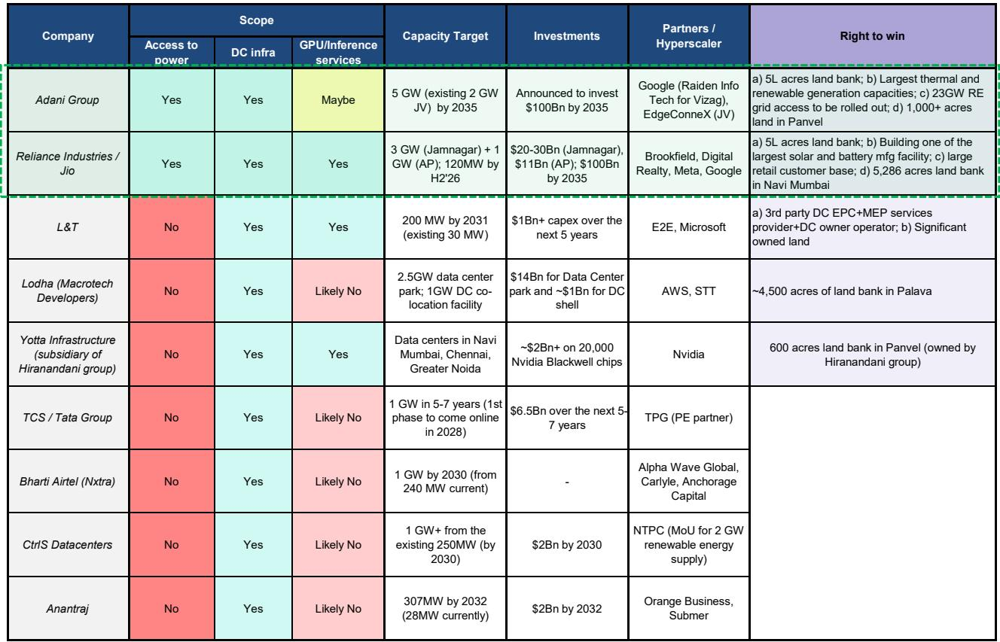
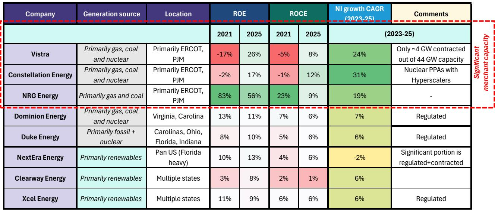
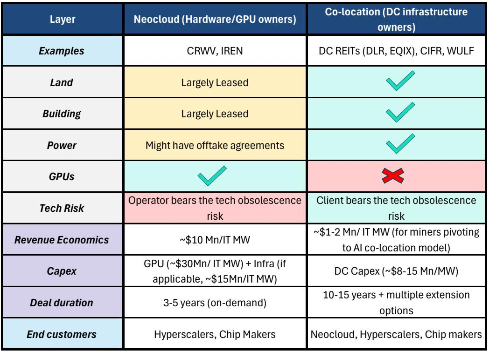

# 印度数据中心：市场真正低估的不是需求，而是电力基础设施的再定价

当外资在2025年初新加坡与香港的路演中反复追问“印度数据中心如何布局”时，一个被忽视的事实已经浮出水面：印度数据中心容量预计将从当前的1.5GW增长至2030年的5-8GW，而中东局势的持续紧张正在将这一数字推向区间上沿。某外资投行最新发布的研报指出，这一轮增长的核心驱动力并非AI算力的爆发性需求，而是电力基础设施的稀缺性正在成为整个产业链的定价锚。

这份报告的价值不在于它确认了数据中心建设的热度，而在于它揭示了一个关键的结构性转变：在印度，谁掌握“土地+电力”的稀缺组合，谁就掌握了数据中心产业链中最不可替代的议价权。对于投资者而言，这意味着传统的“买设备、卖设备”逻辑正在让位于“买电力、买土地”的资产重仓逻辑。

报告的核心判断是：印度数据中心产业链的价值分配正在从轻资产的运营服务向重资产的电力基础设施倾斜。这一判断的支撑来自三个层次：美国市场的经验验证、印度本地竞争格局的独特性、以及电力资产定价模型的根本性变化。

## 1. 美国市场的教训：真正跑赢的不是技术玩家，而是拥有“可调度电力”的公用事业公司

报告对美国数据中心市场的回顾提供了一个极具说服力的参照系。在美国，数据中心需求增长最快的两个区域是PJM（东部）和ERCOT（德州），2015-2025年间这两个区域的电力需求因数据中心而分别实现了23%和26%的年复合增长率。但真正值得关注的是，在这两个区域中表现最好的股票并非数据中心运营商，而是那些拥有天然气和核电机组的公用事业公司。

Vistra、Constellation Energy和NRG Energy在过去四年中股价上涨了4-8倍，而NextEra和Dominion等同行则表现平平。报告明确指出，这一分化的核心原因在于：前三者均在PJM和ERCOT这两个最大的数据中心市场中持有大量可调度的发电资产。当PJM的容量价格从2024/25年的约29美元/MW-day飙升至2026/27年的约329美元/MW-day时，这些公司的资产价值被重新定价。

这个案例对印度的启示是直接的：数据中心对电力的需求是24x7不间断的，这意味着拥有可调度发电能力的企业将获得系统性的定价权。在印度，这种能力并非均匀分布，而是高度集中于少数几个综合性企业集团手中。

## 2. 印度独特的竞争格局：土地与电力的双重稀缺正在重塑准入门槛

报告对印度市场的分析揭示了一个与美国截然不同的竞争格局。在美国，数据中心可以相对自由地在多个区域选址，因为PJM和ERCOT等大型批发电力市场提供了充足的电力接入。但在印度，情况完全不同。

报告提到，在Navi Mumbai地区，土地争夺已经白热化，交易价格甚至超过了上一轮的高点。变电站接入能力成为数据中心选址的硬约束。这种双重稀缺性使得印度数据中心市场的准入门槛远高于美国。

报告明确指出，Adani集团在这一格局中拥有“无与伦比”的优势。作为印度最大的可再生能源、私营火电和输电企业，Adani集团同时拥有大规模土地储备、成熟的电网连接、充足的商业电力容量以及锁定好的热力设备。这种“土地+电力+设备”三位一体的能力，使其在数据中心产业链中占据了其他竞争者难以复制的生态位。

Reliance Industries同样拥有大量土地储备，包括古吉拉特邦的50万英亩和Navi Mumbai的5000英亩以上，但报告未对Reliance进行覆盖分析。这意味着市场对Reliance在这一领域的潜在价值可能尚未充分定价。

## 3. 两种商业模式的根本差异：资产轻重决定了风险回报的对称性

报告对数据中心运营商的商业模式做了清晰的分类，这一分类对于理解印度市场的投资机会至关重要。

第一种是“房地产房东”模式，即托管服务商。这类企业建设数据中心基础设施并长期租赁给超大规模云服务商、企业或新型云服务商，但不拥有计算硬件。典型代表包括Digital Realty和Equinix。这种模式的资本效率较高，投资回收期约为5年，且技术过时风险由客户承担。

第二种是“云服务提供商”模式，即拥有计算硬件的企业。这类企业拥有GPU硬件，可能同时拥有或租赁底层基础设施。新型云服务商如CoreWeave是这一模式的代表。报告指出，新型云服务商每IT MW的营收可以达到托管服务商的8-10倍，但需要承担更高的资本支出（约4500万美元对比800-1500万美元）、更短的合同期限以及显著的技术过时风险。

报告的核心判断是：印度市场的参与者将主要采用托管服务模式，由超大规模云服务商提供GPU，运营商不承担资产负债表风险。这意味着印度数据中心运营商的核心竞争力将不在于技术能力，而在于获取稀缺资源（土地和电力）的能力，以及长期合同的稳定性。

## 4. 报告尚未完全回答的关键问题：印度公用事业公司的定价权能否复制美国经验？

报告对美国公用事业公司股价飙升的分析极具洞察力，但将其直接应用到印度市场时，存在几个尚未完全解答的关键问题。

第一个问题是：印度是否有类似PJM和ERCOT的大型批发电力市场，能够让拥有可调度发电资产的企业获得容量价格飙升的红利？印度电力市场以长期购电协议为主，商业电力市场虽然存在，但其定价机制和波动性远不如美国市场成熟。Adani集团在商业电力市场的主导地位是明确的，但这一地位能否转化为类似美国同行那样的定价权，仍需要观察印度电力市场改革的方向和速度。

第二个问题是：报告提到的“表后托管”模式（behind-the-meter co-location）在印度能否成为游戏规则改变者？报告以Torrent Power的天然气发电厂为例，提出了这一可能性。如果数据中心可以直接与发电厂签订表后供电协议，绕过电网接入的瓶颈，这将从根本上改变印度数据中心的地理分布和竞争格局。但报告没有深入分析这一模式的监管障碍和商业可行性。

第三个问题是：印度数据中心运营商当前的估值是否已经反映了这些结构性优势？报告给出了Adani Power约35倍2025年市盈率的估值，而NTPC仅为15倍。这种估值差异在多大程度上是对Adani集团稀缺资源的合理溢价，又在多大程度上是市场情绪的过度反应？报告没有给出明确的判断。

## 5. 投资者的观察框架：从“买设备”到“买电力”的思维转换

基于报告的分析，投资者在评估印度数据中心产业链时，需要建立一个以电力为核心的分析框架，而非传统的以技术或设备为核心的分析框架。

第一层：识别拥有“可调度发电能力+土地储备+电网连接”三重优势的企业。在印度，这类企业极为稀缺，Adani集团是唯一同时拥有这三项能力的综合性能源企业。L&T则通过数据中心建设、发电厂建设和潜在的运营商角色，在产业链中占据了独特的生态位。

第二层：评估“土地+电力”组合的稀缺性溢价。报告提到，美国数据中心运营商如Equinix和Digital Realty的交易估值约为22-23倍12个月远期EV/EBITDA，与Blackstone收购AirTrunk的约21倍交易倍数基本一致。印度数据中心运营商是否能够获得类似的估值倍数，取决于其稀缺资源的可复制性。

第三层：关注电力市场改革带来的潜在催化剂。如果印度能够推进类似美国PJM和ERCOT的批发电力市场改革，拥有可调度发电资产的企业将获得系统性的价值重估。这一催化剂的概率和时间表尚不确定，但值得持续跟踪。

第四层：警惕技术过时风险在托管模式下的间接传导。虽然托管服务商不直接承担GPU技术过时风险，但如果客户（超大规模云服务商）因技术迭代而调整部署策略，托管服务商的长期合同稳定性仍可能受到影响。报告没有深入讨论这一风险，但这是投资者需要自行评估的关键变量。

## 6. 报告没有完全展开的伏笔：印度数据中心的“电力瓶颈”可能比想象中更深

报告已经明确指出，电力接入是印度数据中心发展的最大瓶颈。但有几个二阶效应报告没有完全展开。

其一，如果印度数据中心容量真的从1.5GW增长到8GW，这意味着电力需求将增长超过5倍。以每个MW数据中心需要约1MW的稳定电力供应计算，8GW的数据中心容量将需要约8GW的基荷电力。考虑到印度电力系统本身已经面临高峰时段缺电的问题，这8GW的新增需求将对电网产生怎样的压力？

其二，报告提到“即使是拥有购电协议的加密货币矿工也在转向数据中心托管模式”。这一趋势意味着，原本用于加密货币挖矿的电力容量正在被数据中心“抢走”。如果这一趋势加速，印度电力市场的供需平衡将面临更大的不确定性。

其三，报告对Adani集团在数据中心产业链中的主导地位给出了高度评价，但没有讨论这种高度集中可能带来的系统性风险。如果Adani集团因任何原因（无论是监管、融资还是运营）无法按计划扩大数据中心容量，印度数据中心市场的整体供给将受到怎样的影响？

这些未解问题正是报告最有价值的部分——它们不仅告诉投资者“现在应该关注什么”，更提示了“未来可能发生什么变化”。对于希望在印度数据中心产业链中建立长期头寸的投资者而言，这些问题的答案将决定最终的回报水平。

---

以上分析基于某外资投行最新发布的研报。报告中关于美国市场的数据中心电力需求增长、公用事业公司股价表现、以及印度市场的土地和电力竞争格局等内容，均提供了详实的数据和图表支撑。但正如我们讨论的，报告中仍有几个关键假设尚未验证，包括印度电力市场改革的方向、表后托管模式的可行性、以及Adani集团主导地位的系统性风险。这些未解问题，值得在更深入的讨论中继续推敲。欢迎来星球微信群里继续讨论。

Personal reading notes and learning share only. Not investment advice.

