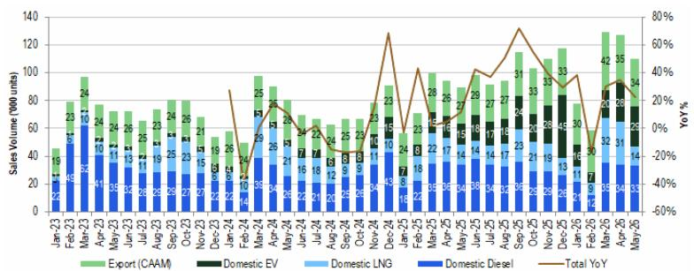

# China's Heavy-Duty Truck Market Is Splitting in Two: The NEV Surge Is Real, But the LNG Collapse Reveals a Deeper Structural Fragility

The headline numbers from China's May heavy-duty truck sales look respectable at first glance. Wholesale volume of approximately 103,000 units represents a 16% year-on-year increase. But beneath that aggregate growth lies a market undergoing a violent reconfiguration that most observers are misreading. The month-on-month decline of 12% is not a seasonal blip. It is the visible symptom of a structural schism: the unstoppable rise of new energy vehicles is real and accelerating, yet the simultaneous collapse of liquefied natural gas truck demand reveals that the market's previous growth engine was built on a fleeting price arbitrage, not genuine customer preference. Investors who treat the May data as a simple continuation of a recovery story are missing the strategic inflection point that is already reshaping competitive dynamics, supply chains, and capital allocation decisions across the entire commercial vehicle ecosystem.

The most striking data point is not the 90% year-on-year surge in NEV heavy-duty truck retail sales to 28,700 units, though that number is impressive. It is the penetration rate approaching 40%. Think about what that means. In a single month, nearly two out of every five heavy-duty trucks sold domestically in China were electric. This is not a niche anymore. This is a mainstream shift happening faster than almost any forecast predicted. The structural drivers are clear: total cost of ownership advantages in high-utilization routes, expanding charging infrastructure along major freight corridors, and increasingly aggressive policy mandates from provincial governments targeting logistics fleet electrification. The NEV segment is now large enough to dictate the overall market's growth trajectory, and it is doing so with relentless momentum.

Yet the LNG segment tells an entirely different story. Retail sales plunged 55% month-on-month to just 13,800 units, a collapse so abrupt it erased months of accumulated gains. The proximate cause is straightforward: the diesel-LNG price spread has narrowed significantly, eliminating the cost advantage that had driven a wave of LNG truck purchases in 2023 and early 2024. But this explanation, while factually correct, is dangerously superficial. The real story is that LNG truck demand was never a reflection of deep-seated customer conviction. It was a tactical response to a temporary pricing anomaly. When fuel economics shift by a few percentage points, an entire sub-segment can lose half its volume in thirty days. That is not a market. That is a speculative cycle masquerading as a trend.

The export channel, at approximately 34,000 units with 28% year-on-year growth, remains a steady and important contributor. But exports alone cannot mask the domestic bifurcation. The critical question for anyone with capital exposure to this industry is no longer about aggregate demand. It is about which technology pathway will dominate the next cycle, and whether the companies that prospered during the LNG boom have the strategic flexibility to survive the transition.

## The NEV Inflection Point Has Arrived Faster Than the Supply Chain Can Adapt

The 40% monthly penetration rate for NEV heavy-duty trucks is not an outlier. It is the leading edge of a structural shift that will reshape the competitive landscape within eighteen to twenty-four months. The data from May is consistent with a pattern that has been building for over a year: month after month, NEV volumes have grown while diesel and LNG volumes have stagnated or declined. The compound effect is now producing a step-change in market composition.

This matters for strategic planning because the NEV heavy-duty truck is not simply a drop-in replacement for a diesel truck with a different powertrain. It requires a fundamentally different approach to vehicle design, battery sizing, charging infrastructure, maintenance networks, and customer financing. The companies that have invested early in vertical integration of battery supply, in-house electric drivetrain development, and charging-as-a-service business models are building competitive moats that will be extremely difficult for legacy manufacturers to replicate quickly. The May data suggests that these early movers are now capturing market share at an accelerating rate, and the window for latecomers to catch up is closing faster than most industry participants realize.

The implications for component suppliers are equally profound. A 40% NEV penetration rate means that demand for traditional internal combustion engine components — fuel injection systems, exhaust after-treatment, turbochargers, transmission assemblies — is already in structural decline for the domestic market. Suppliers that have not diversified into electric powertrain components face a revenue cliff that will arrive well before their internal forecasts anticipate. The May data should be treated as a strategic warning, not a tactical data point.

## The LNG Collapse Exposes the Fragility of Fuel-Arbitrage-Driven Demand

The 55% month-on-month decline in LNG truck sales is the most underappreciated signal in the May report. It reveals that a significant portion of the heavy-duty truck market is driven not by durable customer preferences but by short-term fuel price differentials. When the diesel-LNG spread was wide, operators rushed to buy LNG trucks to capture immediate fuel savings. Now that the spread has narrowed, those same operators are stepping back, and the secondary market for used LNG trucks is likely facing a glut.

This creates a vicious cycle for OEMs that have invested heavily in LNG production capacity. The industry added significant LNG truck manufacturing capacity in 2023 and early 2024, betting that the fuel would become a permanent fixture in China's commercial vehicle mix. The May data suggests that bet was misplaced. If LNG demand remains depressed for another two to three months, inventory levels across the supply chain will become problematic, and pricing pressure will intensify. OEMs with high exposure to LNG may need to write down production assets or repurpose assembly lines, neither of which is quick or cheap.

For fleet operators, the lesson is equally sobering. The May data demonstrates that fuel-cost-driven purchasing decisions carry significant residual value risk. A truck purchased at the peak of the LNG cycle could lose a substantial portion of its resale value if the fuel price advantage does not return. This will make fleet operators more cautious about adopting any technology whose economic case depends on a single variable — fuel spread — that can shift rapidly and unpredictably. The strategic implication is that demand will increasingly concentrate on technologies with multi-dimensional value propositions that are less sensitive to any one input cost.

## The Report Raises Questions It Cannot Yet Answer About the Inflection Trajectory

The May data is rich with tactical insight, but it also leaves several critical strategic questions unanswered. The most important of these concerns the shape of the NEV adoption curve. A 40% monthly penetration rate is extraordinary, but it is not yet clear whether this represents a temporary surge driven by policy deadlines and subsidy expirations, or a sustainable trajectory toward a majority-electric market within two to three years. The difference matters enormously for capacity planning and investment timing.

A second open question concerns the behavior of the diesel segment. The report does not provide a clear breakdown of diesel truck sales trends, but the math is suggestive. If NEV penetration is approaching 40% and LNG has collapsed, then diesel trucks are absorbing the remaining demand — but at what volume and margin? The answer will determine whether legacy diesel manufacturers can maintain profitability during the transition, or whether they face a rapid margin compression as volumes decline and fixed costs are spread over fewer units.

A third unresolved issue is the geographic distribution of NEV adoption. Heavy-duty truck usage patterns vary dramatically across China's provinces. Long-haul routes in western regions have different infrastructure and operational requirements than regional distribution in the eastern coastal provinces. The national penetration rate of 40% may mask significant regional variation, and the pace of infrastructure buildout in lagging regions will determine how quickly the overall market can reach higher penetration levels.

These questions are not weaknesses in the report. They are the natural boundaries of what any single month of data can reveal. But they are precisely the questions that investors and strategists need to answer before committing capital to specific technology pathways or companies.

## A Decision Framework for Navigating the Heavy-Duty Truck Transition

For readers who need to translate the May data into actionable strategic decisions, the following framework is designed to cut through the noise and focus on the variables that will determine winners and losers over the next twelve to eighteen months.

The first dimension is technology exposure. Assess your portfolio or business against three categories: pure NEV, mixed-technology, and legacy-powertrain-dependent. The May data suggests that pure NEV exposure is the strongest position, provided that the company has secured battery supply and charging infrastructure partnerships. Mixed-technology players face a challenging balancing act: they need to maintain legacy volumes to fund the transition, but those volumes are eroding faster than expected. Legacy-dependent players face existential risk unless they can execute a rapid pivot.

The second dimension is geographic diversification. Companies with significant export exposure are better positioned to manage domestic volatility, but the export market has its own dynamics and competitive pressures. The key question is whether export growth can compensate for domestic NEV disruption, or whether the two markets will converge toward similar technology mixes.

The third dimension is fuel-price sensitivity. The LNG collapse demonstrates the danger of business models that depend on a single variable. Companies whose profitability is tied to diesel-LNG spreads, diesel-gasoline spreads, or any other fuel price differential should stress-test their financial models against a scenario where those spreads remain narrow for an extended period. The May data suggests that such a scenario is not only possible but increasingly likely.

The fourth dimension is policy dependency. NEV adoption in China has been heavily influenced by purchase subsidies, tax exemptions, and fleet electrification mandates. The May data does not reveal what happens if these policies are phased out or redirected. Investors should model scenarios with reduced policy support and assess which companies have achieved sufficient cost competitiveness to stand on their own.

## The Full Report Contains the Charts That Make the Pattern Unmistakable

The numbers in this analysis are drawn from a detailed market update that includes month-by-month sales breakdowns by technology type, export volumes, and historical trend lines. The charts in the full report make visible what the text can only describe: the accelerating divergence between the NEV growth curve and the LNG collapse, the shifting composition of the domestic market, and the steady if slower growth of the export channel.

These visual patterns are essential for developing an intuitive feel for the market's trajectory. A single month's data point can be dismissed as an anomaly. A multi-month trend line, clearly plotted against historical baselines, reveals the structural forces at work. The original report from a leading global investment bank provides exactly this kind of analytical clarity, and the charts are worth studying in detail.

Join the community to read the full report and review the original charts.

*This article is for learning and discussion only and does not constitute investment advice.*

Personal reading notes and learning share only. Not investment advice.

