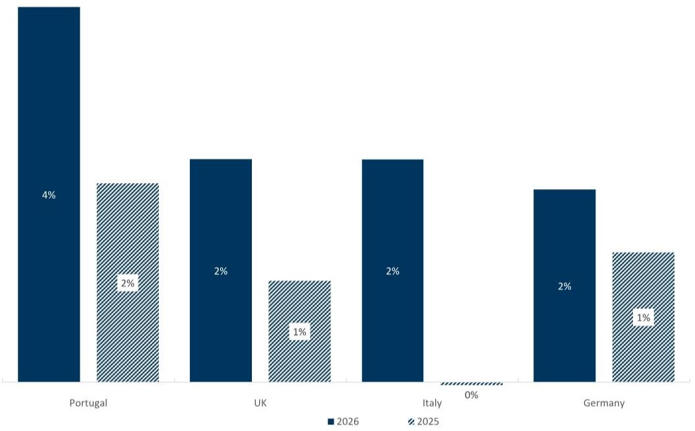
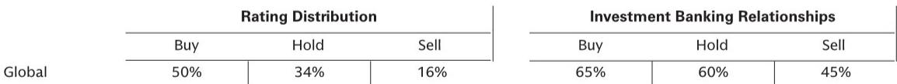

# Europe’s Electrification Is No Longer a Prediction — It Is a Structural Demand Shift That Will Reshape the Power Sector for a Decade

The narrative around European power demand has shifted from cyclical recovery to structural acceleration. After a roughly 1.5% increase in power demand across Europe in 2025, year-to-date consumption in 2026 is already running around 2% higher on average across Spain, Germany, Italy, the UK, and Portugal. This is not a weather-driven blip. The data points to a deeper transformation: electrification is becoming the dominant driver of power consumption, and it is happening faster than most market participants anticipated.

The implications are profound. If electrification continues to gain momentum, Europe is entering a period of sustained power demand growth that the continent has not seen in over a decade. The last time European electricity demand grew consistently was before the financial crisis and the subsequent era of efficiency gains and deindustrialization. Today, the drivers are different — and they are structural rather than cyclical. Heat pumps, electric vehicles, and industrial electrification are not one-off events; they are adoption curves that compound over time.

A global investment bank report on this topic makes a clear argument: the combination of accelerating electrification and the rise of artificial intelligence is creating the conditions for a generational earnings super-cycle in the power sector. The report projects that under a hyper-electrification scenario, annual power demand growth could reach 5% by 2029-2030. To put that in perspective, such growth would require roughly 3.5 trillion euros of cumulative investment in power generation and grid infrastructure over the next several years. That scale of capital deployment has not been seen in European energy since the post-war reconstruction era.

But the critical question for investors is not whether electrification is happening. It is which parts of the value chain are positioned to capture the value creation that this structural shift will unlock. The answer is not uniform across the sector, and the differentiation between winners and laggards will become sharper as the cycle matures.

## The Three Drivers of Electrification Are Converging, and Each One Doubles Household Consumption in a Different Way

The conventional view of electrification has been fragmented. Analysts have tended to treat heat pumps, electric vehicles, and industrial electrification as separate themes with independent adoption timelines. The report makes a more powerful argument: these three drivers are converging simultaneously, and each one has an outsized impact on power demand.

Heat pumps are the most immediate driver. In 2025, approximately 2.5 million heat pumps were installed across Europe. The key insight is that electrifying a household's heating system roughly doubles its electricity consumption. A typical home that uses gas for heating might consume 3,000-4,000 kWh annually for non-heating purposes. Adding a heat pump pushes total consumption to 6,000-8,000 kWh. This is not a marginal increase; it is a step-change in the load profile of the residential sector.

Electric vehicles follow a similar logic. In 2025, more than 2 million EVs were sold in Europe, representing nearly 20% of new car sales. Switching a family's primary car from an internal combustion engine to an EV also roughly doubles household electricity consumption. The math is straightforward: a typical household driving 15,000 km per year in an EV will consume approximately 3,000-4,000 kWh annually for charging, on top of existing residential consumption.

Industrial electrification is less visible to consumers but potentially even more impactful. Electric boilers, which generate steam at temperatures up to 400 degrees Celsius, are now economically superior to gas boilers in many industrial applications. This is a critical development because industrial heat represents a large share of industrial energy use, and the economics of electrification have historically been unfavorable. That is changing.

The convergence of these three drivers means that the incremental demand from electrification is not linear. It is compounding. A household that installs a heat pump and buys an EV is not adding 50% to its electricity consumption; it is adding 100-150%. When millions of households do this simultaneously, the aggregate demand impact becomes material at the system level.

## The Hyper-Electrification Scenario Points to 5% Annual Demand Growth by 2030, Requiring 3.5 Trillion Euros of Investment

The report introduces a hyper-electrification scenario that is worth examining closely. Under this scenario, annual power demand growth in Europe reaches 5% by 2029-2030. This is significantly above the consensus view, which still assumes that efficiency gains and modest economic growth will keep demand largely flat or growing at 1-2% annually.

The difference matters because 5% annual growth over several years creates a fundamentally different investment environment. At that pace, the existing power generation fleet and grid infrastructure become insufficient well before the end of the decade. The report estimates that meeting this demand would require 3.5 trillion euros of investment in power generation — largely renewables — and power grids.

To understand the scale: Europe's total annual investment in power generation and grids has been running at roughly 100-150 billion euros in recent years. The report's implied investment requirement is more than double that level on an annualized basis. This is not a marginal increase in capital spending; it is a multi-year investment boom that will reshape the financial profiles of utilities, renewable developers, and infrastructure providers.

The investment thesis rests on a simple premise: if demand grows at 5% annually, the supply side must respond. Renewable energy is the marginal source of new generation in Europe, given policy commitments and cost competitiveness. Grids need to be expanded and modernized to handle higher loads and distributed generation. The companies that provide these assets and services will benefit from multi-year visibility on revenue growth, margin expansion, and returns on invested capital.

This is what the report terms a "generational earnings super-cycle." The phrase is not hyperbole. The last time European utilities experienced a sustained period of rising demand and investment was before the liberalization of electricity markets in the 1990s. For a generation of investors, this is uncharted territory.

## Three Clusters of Companies Are Positioned to Capture the Value: Transformative Electrification, Renewables, and Energy Security Infrastructure

The report identifies three distinct clusters of companies that are positioned to benefit from the electrification super-cycle. Each cluster has a different risk-return profile and a different exposure to the underlying demand drivers.

The first cluster is transformative electrification stories. These are companies where electrification capital expenditure is about to meaningfully accelerate, transforming their portfolios on a 3-5 year basis. The report cites Naturgy, Enel, and Engie as examples. The logic is that these companies have significant exposure to regulated or semi-regulated networks and generation assets that will require substantial reinvestment. The transformation is not optional; it is driven by policy, customer demand, and the economics of renewable generation. The risk is execution, but the reward is a structural re-rating of earnings power.

The second cluster is renewable developers and manufacturers. Developers such as RWE, Solaria, and Orsted benefit from rising returns and organic growth opportunities as power prices and demand increase. Manufacturers such as Vestas and Nordex benefit from rising orders and improving margins as turbine demand accelerates. The distinction is important: developers have project-level risk but also project-level optionality, while manufacturers have factory-level risk and capacity utilization dynamics. Both are exposed to the same underlying demand growth, but the timing and volatility of earnings differ.

The third cluster is energy security infrastructure providers. This includes companies such as ENR, EON, and Snam. These are regulated or quasi-regulated network businesses that provide the physical backbone for electrification. Their earnings are less sensitive to power prices and more sensitive to regulatory allowances and investment programs. The attraction is stability and visibility: as grids need to be expanded, these companies have a clear path to higher regulated asset bases and, therefore, higher allowed returns.

The report's framework is useful because it avoids the trap of treating all power-sector stocks as a single trade. The electrification theme is broad, but the exposure of different companies to that theme varies significantly. Investors need to decide which cluster aligns with their risk tolerance, time horizon, and view on policy and technology.

## What the Report Does Not Fully Answer: The Pace of Adoption, the Role of AI, and the Risk of Policy Reversal

For all its analytical rigor, the report leaves several important questions open. These are not weaknesses in the analysis; they are inherent uncertainties that investors must weigh for themselves.

First, the pace of adoption. The report's hyper-electrification scenario assumes that heat pump and EV adoption continue to accelerate. But adoption curves are not linear. They depend on consumer behavior, interest rates, housing turnover, and the availability of skilled installers. A slowdown in any of these factors could push the demand growth trajectory lower. The report provides a scenario, not a forecast, and the gap between the two matters for investment timing.

Second, the role of AI. The report mentions that rising AI adoption rates and continued datacenter build-out should drive materially higher power consumption. This is plausible, but the magnitude is uncertain. AI datacenters are energy-intensive, but their location is not fixed. Some may be built in Europe; others may be built in regions with cheaper power or more permissive regulatory regimes. The net impact on European power demand depends on policy decisions around data sovereignty, grid connection queues, and permitting timelines.

Third, the risk of policy reversal. The electrification thesis depends on continued policy support for heat pumps, EVs, and renewables. A change in government, a shift in public opinion, or a fiscal crisis could slow or reverse these policies. The report implicitly assumes policy continuity, but investors should stress-test this assumption. The most dangerous assumption in any structural thesis is that the current policy trajectory will persist indefinitely.

These open questions do not invalidate the thesis. They define the range of outcomes. Investors who understand the range can position accordingly. Those who ignore the range are taking uncompensated risk.

## A Decision Framework for Investors: Map Your Portfolio Against the Three Clusters and Stress-Test for Adoption, Policy, and Technology Risk

The report provides the raw material for a decision framework, but it does not spell it out explicitly. Here is how investors should think about positioning.

Start by mapping your current portfolio against the three clusters: transformative electrification, renewables, and energy security infrastructure. Determine your exposure to each. If you are overweight one cluster and underweight another, ask yourself whether that reflects a deliberate view or an accidental bias.

Next, stress-test each cluster against the three key uncertainties: adoption pace, AI impact, and policy risk. For the transformative electrification cluster, the key risk is that capital expenditure accelerates but returns disappoint. For the renewables cluster, the key risk is that power prices fall as renewable penetration increases, compressing margins. For the energy security infrastructure cluster, the key risk is that regulators do not allow sufficient returns to justify the required investment.

Finally, consider the time horizon. The electrification thesis is a multi-year story. It will not play out in a straight line. There will be quarters where demand disappoints and quarters where it surprises to the upside. The ability to hold through volatility is a prerequisite for capturing the long-term value. If your investment horizon is less than three years, you may need to focus on the catalysts that could accelerate or derail the thesis within that window.

The report's analysis is a starting point, not an end point. It provides the map, but investors must navigate the terrain themselves.

Join the community to read the full report and review the original charts.

*This article is for learning and discussion only and does not constitute investment advice.*

Personal reading notes and learning share only. Not investment advice.

